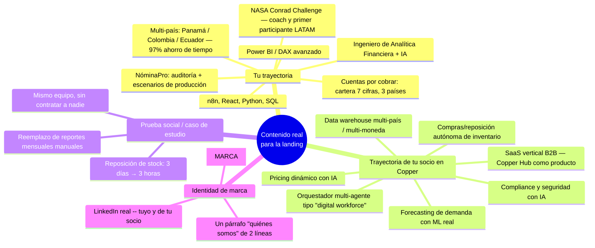
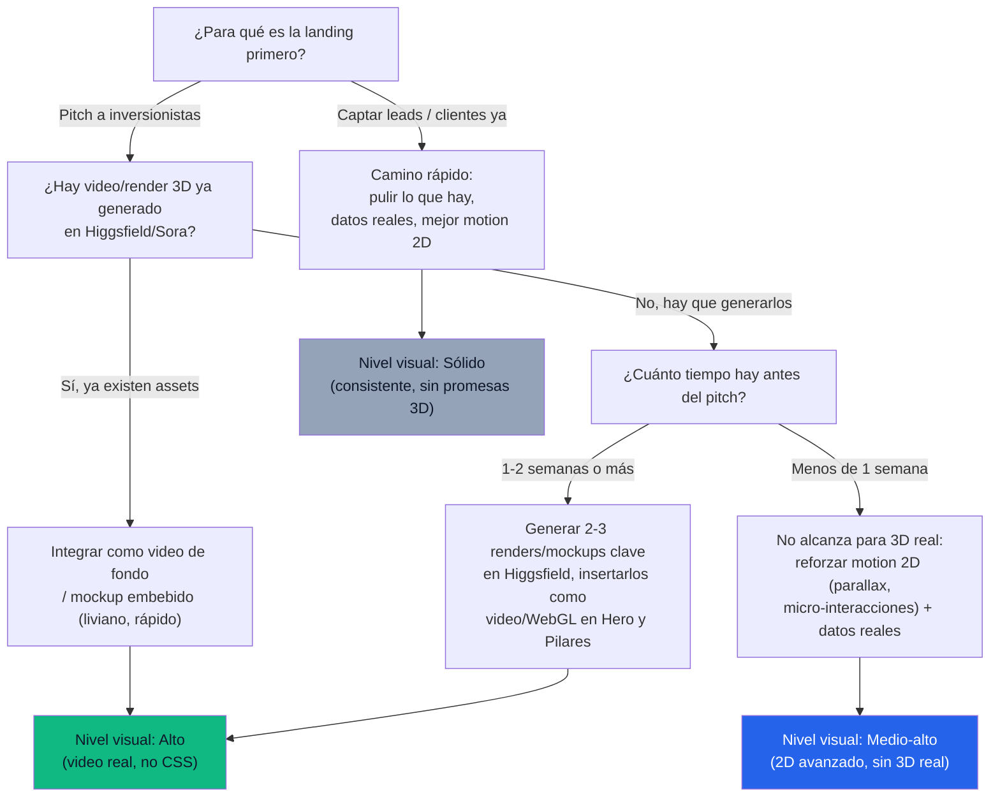
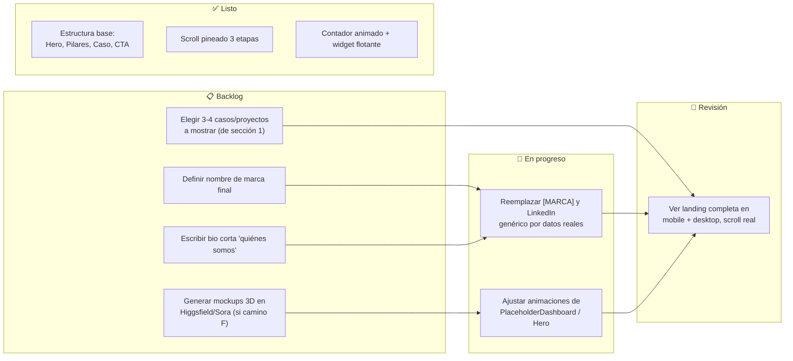

<!--
title: Plan de trabajo — Landing CodeFlow / SaaS de Marketing
-->

# Plan de trabajo: llevar la landing a nivel "levantar inversión"

Hoy la landing (`codeflow-landing`) tiene la estructura funcionando — scroll pineado, contador animado, tres pilares, mini caso de estudio, CTA final — pero corre con **datos placeholder** (`[MARCA]`, LinkedIn genérico, stats de ejemplo) y una capa visual que no refleja ni tu trayectoria ni la de tu socio. Este documento ordena el trabajo en tres vistas: **lluvia de ideas** (de dónde sacamos contenido real), **árbol de decisiones** (qué nivel de producción visual perseguimos y por qué) y **kanban** (quién hace qué, en qué orden).

---

## 1. Lluvia de ideas — de dónde sale el contenido real

Todo lo que hoy es placeholder tiene que salir de algo que ya existe: tu CV, el trabajo de tu socio en Copper, y los 15 productos que ya identificaron como vendibles.

**Acción inmediata:** de esta lista, elegir 3–4 proyectos (de los tuyos + los 15 de tu socio) como "casos" concretos para reemplazar el mini-caso genérico de retail, y decidir el nombre de marca definitivo.

---

## 2. Árbol de decisiones — qué nivel de producción visual

Pediste que "se vea súper pro" para pitch a inversionistas, con 3D y mockups vía Higgsfield/Sora. Esa ambición tiene tres caminos con costo y tiempo muy distintos — hay que elegir uno antes de tocar código, porque cambia la arquitectura de los componentes.

**Por qué importa decidir esto primero:** meter "3D animado" sin tener los assets generados es la trampa más común — se termina prometiendo un nivel de producción que el código solo no puede dar. Si el pitch es en menos de una semana, conviene ir por el camino E/H (motion 2D muy pulido + contenido real) en vez de bloquearse esperando renders.

---

## 3. Kanban — reparto de trabajo para el equipo

Asumiendo que va a haber varias personas metiendo mano (vos, tu socio, y quien sume al equipo), así se puede repartir. Cada tarjeta indica si depende de una decisión o contenido de las secciones 1 y 2.

**Cómo leerlo:** nada en "Revisión" puede cerrarse hasta tener nombre de marca, bio y los casos elegidos — es decir, el trabajo de código (`p1`, `p2`) está bloqueado por decisiones de contenido, no por falta de tiempo de desarrollo. Ese es el cuello de botella real hoy.

---

## Siguiente paso concreto

Con esto ya tenés lo que pediste (kanban, árbol de decisiones, mapa de ideas) en un solo lugar para mostrarle al equipo. Cuando tengas:

1. Nombre de marca definitivo,
2. Los 3-4 casos elegidos, y
3. Definido si vas por el camino de 3D real o motion 2D reforzado,

...te reescribo `FinalCtaFooter.tsx`, `MiniCaseStudy.tsx` y refuerzo las animaciones de `Hero.tsx` / `PlaceholderDashboard.tsx` con esa información real en vez de placeholders.
