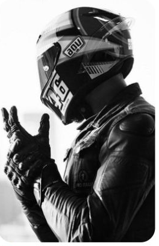
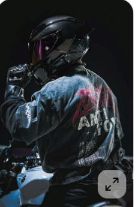
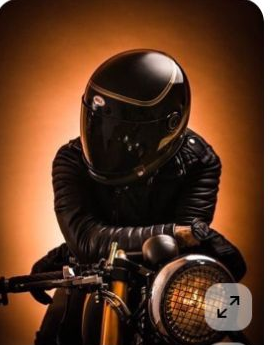
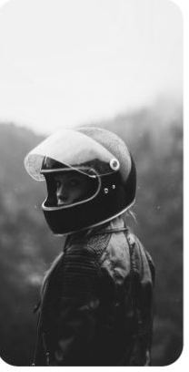
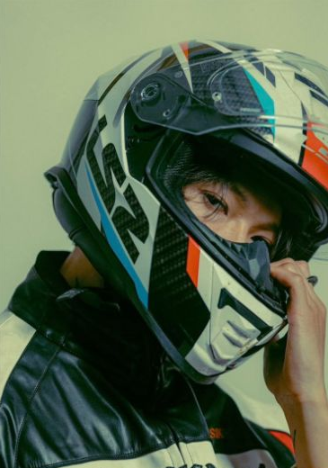

# EDGE × Spider-Man — Plan de sesión fotográfica y contenido

## Proyecto separado

> Este documento organiza la sesión fotográfica y el plan de contenido de EDGE × Spider-Man. No forma parte del proyecto del Dashboard de Cuentas por Cobrar.

<strong>1. Objetivo de la sesión</strong>

Crear un banco de imágenes y contenidos que permita presentar la colaboración de forma consistente en redes, campañas, catálogo y materiales comerciales.

### Resultado esperado

- Fotografías principales de producto.
- Imágenes verticales para redes.
- Material para reels y videos.
- Variaciones para memes, GIFs, stickers y UGC.
- Material organizado por fase de campaña.

<strong>2. Marco de marca y licencia</strong>

- Marca participante: EDGE.
- Personaje/licencia: Spider-Man.
- Titular de referencia: Sony / Marvel.
- Tema narrativo: “Brand New Day”.
- Mensaje de trabajo: “Un gran poder conlleva una gran responsabilidad”.

### Pendiente obligatorio

Confirmar con el socio y el titular correspondiente qué nombres, logos, imágenes, frases, productos y formatos están autorizados antes de publicar.

<strong>3. Árbol de campaña</strong>

### Campaña central

**EDGE × Spider-Man — Brand New Day**

### Cuatro ramas de trabajo

1. Casos de éxito y referencias.
2. Pilares del mensaje.
3. Formatos de contenido.
4. Calendario de campaña.

<strong>4. Casos de éxito y referencias</strong>

### Qué estudiar

- Cómo otras colaboraciones integran personaje, producto y audiencia.
- Qué formatos generan interacción.
- Cómo presentan el producto sin perder la identidad de la licencia.
- Qué elementos se repiten en campañas exitosas.

### Qué no copiar

- Conceptos creativos protegidos.
- Imágenes o slogans sin autorización.
- Estéticas que confundan la campaña con otra marca.
- Promesas no aprobadas por el socio.

<strong>5. Pilares del mensaje</strong>

- **Licencia oficial:** comunicar la colaboración de forma clara y autorizada.
- **Brand New Day:** presentar la campaña como una nueva etapa o experiencia.
- **Gran poder / responsabilidad:** conectar el producto con actitud, identidad y responsabilidad.
- **EDGE:** mantener visibles los atributos propios de la marca.

<strong>6. Lista de tomas fotográficas</strong>

### Producto

- Producto aislado.
- Producto con empaque.
- Detalle de textura y materiales.
- Producto en uso.
- Producto junto a elementos visuales de la colaboración.

### Personas

- Retrato con producto.
- Acción o movimiento.
- Grupo de amigos.
- Contenido con actitud de héroe cotidiano.
- Versiones inclusivas para distintos perfiles de audiencia.

### Composición

- Vertical 9:16.
- Cuadrada 1:1.
- Horizontal 16:9.
- Fondo limpio para recortes.
- Espacio negativo para textos y llamados a la acción.

<strong>7. Formatos de contenido</strong>

- Fotos de producto.
- Memes aprobables.
- Reels y videos cortos.
- GIFs y stickers.
- UGC y colaboraciones.
- Historias con encuestas o preguntas.
- Carruseles de producto y narrativa.

<strong>8. Calendario de campaña</strong>

### Fase 1 — Teaser

Presentar señales parciales: colores, siluetas, detalles del producto y mensajes de expectativa.

### Fase 2 — Reveal

Mostrar oficialmente la colaboración, el producto y el mensaje principal.

### Fase 3 — Participación

Activar UGC, colaboraciones, retos, memes y contenido de la comunidad.

### Fase 4 — Conversión

Dirigir a compra, visita, registro o acción comercial definida con el socio.

<strong>9. Flujo de trabajo con el socio</strong>

1. Confirmar objetivo comercial.
2. Recibir manuales, logos y restricciones.
3. Aprobar concepto creativo.
4. Definir lista de tomas.
5. Realizar sesión fotográfica.
6. Seleccionar material.
7. Editar formatos.
8. Revisar legal y marca.
9. Aprobar calendario.
10. Publicar y medir resultados.

<strong>10. Materiales necesarios</strong>

- Brief de EDGE.
- Guía de marca.
- Manual de uso de Spider-Man.
- Contrato o autorización de licencia.
- Productos finales.
- Empaques.
- Props y fondos.
- Lista de talentos.
- Shot list.
- Calendario de publicación.
- Sistema de aprobación del socio.

<strong>11. Criterios de calidad</strong>

- Producto visible y correctamente representado.
- Personaje y elementos licenciados usados según autorización.
- Iluminación consistente.
- Composición adaptable a varios formatos.
- Mensaje legible.
- No existen promesas no aprobadas.
- Cada archivo tiene nombre, fecha, formato y estado de aprobación.

## 12. Referencias visuales de Pinterest

Estas imágenes son referencias de dirección visual para la sesión. No se deben copiar diseños, poses ni composiciones exactas; deben reinterpretarse con identidad propia de EDGE y con los elementos de Spider-Man que estén autorizados por la licencia.

<strong>Referencia 01 — Motociclista con casco</strong>

- **Enlace Pinterest:** [Búsqueda de motociclista con casco en carretera](https://www.pinterest.com/search/pins/?q=motorcycle%20rider%20helmet%20road%20portrait)
- **Pose:** Motociclista en actitud de control, con el casco como protagonista y el cuerpo orientado hacia la ruta.
- **Composición:** Plano medio o americano, sujeto desplazado del centro y fondo con profundidad para reservar espacio de copy.
- **Paleta:** Negro, gris asfalto, rojo de acento y luz cálida de atardecer.
- **Adaptación EDGE × Spider-Man:** Mostrar un casco EDGE autorizado como símbolo del héroe cotidiano; sugerir telaraña o rojo/blanco/negro únicamente como código gráfico aprobado, sin reproducir el arte de la referencia.
- **Prompt ultrarrealista:** `Fotografía editorial ultrarrealista de un motociclista urbano con casco integral EDGE autorizado, detenido junto a su motocicleta en una carretera al atardecer, postura segura y natural, plano medio, fondo con profundidad de campo, asfalto oscuro, acentos rojo y blanco sutiles, iluminación cinematográfica cálida, textura realista de materiales, espacio negativo para texto, sin logos no autorizados, sin copiar ninguna composición existente.`

<strong>Referencia 02 — Moto y retrato del piloto</strong>

- **Enlace Pinterest:** [Búsqueda de retrato editorial de motociclista](https://www.pinterest.com/search/pins/?q=editorial%20motorcycle%20rider%20portrait%20helmet)
- **Pose:** Retrato relajado del piloto junto a la moto, mirada fuera de cámara y manos ocupadas de forma natural.
- **Composición:** Retrato vertical con moto parcialmente visible; capas de primer plano, sujeto y entorno para una imagen aspiracional.
- **Paleta:** Negro mate, rojo profundo, piel natural y luces urbanas neutras.
- **Adaptación EDGE × Spider-Man:** Enfatizar seguridad, actitud y producto; incorporar un detalle gráfico arácnido abstracto y aprobado en el casco o la dirección de arte, sin usar al personaje completo.
- **Prompt ultrarrealista:** `Retrato fotográfico ultrarrealista de un rider junto a una motocicleta premium, casco integral EDGE autorizado bajo el brazo, expresión confiada y cotidiana, encuadre vertical editorial, luz lateral suave, ciudad desenfocada al fondo, negros mate y rojo profundo, piel y textiles naturales, detalle de producto nítido, estética de héroe urbano, sin personajes ni logos no autorizados.`

<strong>Referencia 03 — Manillar editorial</strong>

- **Enlace Pinterest:** [Búsqueda de fotografía editorial de manillar de moto](https://www.pinterest.com/search/pins/?q=motorcycle%20handlebar%20editorial%20photography)
- **Pose:** Manos del piloto firmes sobre el manillar, listas para iniciar el recorrido; gesto funcional, no teatral.
- **Composición:** Primer plano con líneas diagonales del manillar y foco selectivo en guantes, controles y textura.
- **Paleta:** Carbón, acero, rojo puntual y reflejos fríos de ciudad.
- **Adaptación EDGE × Spider-Man:** Usar el detalle para contar responsabilidad y control; vincularlo con el casco EDGE mediante un reflejo o corte de producto aprobado, evitando replicar la perspectiva exacta.
- **Prompt ultrarrealista:** `Primerísimo primer plano ultrarrealista de manos enguantadas controlando el manillar de una motocicleta moderna, controles y metal con textura precisa, iluminación editorial de alto contraste, reflejos fríos urbanos con un acento rojo sutil, profundidad de campo corta, sensación de control y responsabilidad, composición original, sin marcas no autorizadas.`

<strong>Referencia 04 — Moto en paisaje abierto</strong>

- **Enlace Pinterest:** [Búsqueda de motocicleta en paisaje cinematográfico](https://www.pinterest.com/search/pins/?q=cinematic%20motorcycle%20landscape%20road)
- **Pose:** Moto detenida o avanzando lentamente en un paisaje amplio; el piloto integrado en la escena, no posando de forma rígida.
- **Composición:** Plano general panorámico con horizonte limpio, escala pequeña del sujeto y espacio para mensaje de campaña.
- **Paleta:** Tierra, azul de cielo, negro del equipo y rojo como acento controlado.
- **Adaptación EDGE × Spider-Man:** Convertir el viaje en metáfora de un nuevo día: libertad con responsabilidad, con un casco EDGE claramente identificable pero sin alterar el paisaje con una copia visual.
- **Prompt ultrarrealista:** `Fotografía panorámica ultrarrealista de una motocicleta con rider usando casco integral EDGE autorizado en un paisaje abierto al amanecer, carretera que conduce hacia el horizonte, escala cinematográfica, cielo azul y tonos tierra, negro del equipo con un acento rojo discreto, atmósfera de nuevo comienzo, espacio negativo para titular, sin copiar una imagen de referencia.`

<strong>Referencia 05 — Retrato con casco</strong>

- **Enlace Pinterest:** [Búsqueda de retrato de motociclista con casco integral](https://www.pinterest.com/search/pins/?q=close%20up%20motorcycle%20helmet%20rider%20portrait)
- **Pose:** Retrato frontal o tres cuartos, cabeza ligeramente inclinada y visor orientado hacia la luz para destacar la silueta.
- **Composición:** Primer plano limpio, fondo oscuro y separación de contorno; ideal para reveal, portada o pieza de producto.
- **Paleta:** Negro, blanco de luz especular y rojo controlado en detalles.
- **Adaptación EDGE × Spider-Man:** Hacer del casco el centro narrativo del héroe cotidiano; añadir solo recursos Spider-Man licenciados y aprobados, manteniendo legible la marca EDGE.
- **Prompt ultrarrealista:** `Primer plano de retrato ultrarrealista de un motociclista con casco integral EDGE autorizado, encuadre tres cuartos, visor capturando una luz especular limpia, fondo oscuro con separación de silueta, negros profundos, blanco brillante y pequeño acento rojo, textura realista del casco y la chaqueta, tono cinematográfico de reveal, sin personaje completo ni elementos de marca no autorizados.`

## Próximo paso

Antes de producir, completar el brief del socio: objetivo, producto, audiencia, canales, fechas, restricciones de licencia y acción comercial esperada.
