# Auditoría visual — Dashboard CxC

> **Referencia de inspiración:** [Dashboard for a Management Product ✦ Worklio — Dribbble](https://dribbble.com/shots/23474771-Dashboard-for-a-Management-Product-Worklio), consultada el 2026-08-11.
> **Uso:** análisis visual e inspiración; no se afirma licencia de reutilización ni se autoriza copiar su interfaz.

<strong>1. Alcance y regla de preservación</strong>

Esta auditoría cubre exclusivamente la **capa visual** del prototipo local Dashboard CxC. Una eventual implementación solo podrá cambiar presentación, tokens y comportamiento visual de interacción.

Debe conservar al 100%: módulos, rutas, cálculos, datos ficticios, modelo de datos, tabla, filtros, orden, paginación, reglas de Aging, exclusiones, avisos de simulación y estados de negocio. No autoriza cambios de lógica, datos, fórmulas, textos de advertencia ni integraciones.

La evidencia actual corresponde a escritorio. No hay evidencia móvil en este lote; la revisión responsive queda pendiente de capturas específicas antes de aprobar una transformación visual final.

<strong>2. Evidencia actual y diagnóstico por pantalla</strong>

### Resumen de cartera

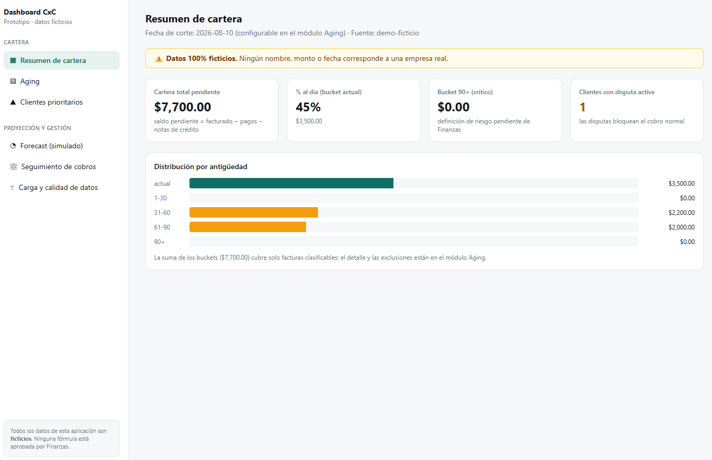

#### Referencia visual para esta pantalla

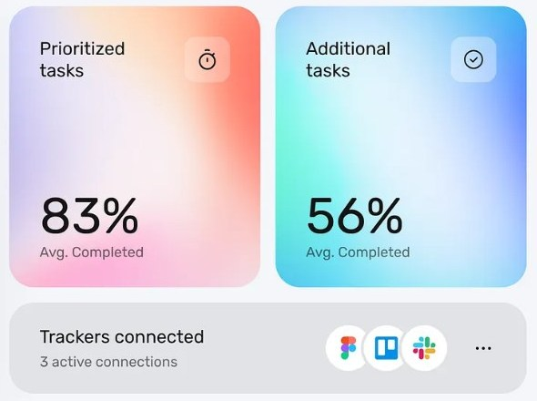

- **Capa de referencia que se usa:** el grupo de tarjetas con radios amplios, aire interior, contraste entre dato principal y texto secundario, y gradientes suaves reservados a dos tarjetas de énfasis.
- **No se usa:** perfil, foto, porcentajes, iconos, textos ni estructura de gestión de tareas de Worklio.
- **Indicación para Claude:** conservar las cuatro KPI, sus valores y sus textos; reorganizarlas como un conjunto de tarjetas con 16 px de radio, 20–24 px internos y sombra sutil. Aplicar como máximo un gradiente muy tenue a una KPI de atención, sin reducir el contraste ni cambiar su significado. Convertir la distribución Aging en un panel con jerarquía visual, conservando buckets e importes exactos.

- La jerarquía funcional es clara: aviso de datos ficticios, cuatro KPI y distribución de Aging.
- La superficie es muy plana: demasiado espacio vacío inferior, tarjetas con poco contraste jerárquico y barras con escasa diferenciación semántica.
- Mantener los importes, la nota de conciliación y los avisos; solo mejorar composición, profundidad, espaciado y legibilidad del gráfico.

### Aging

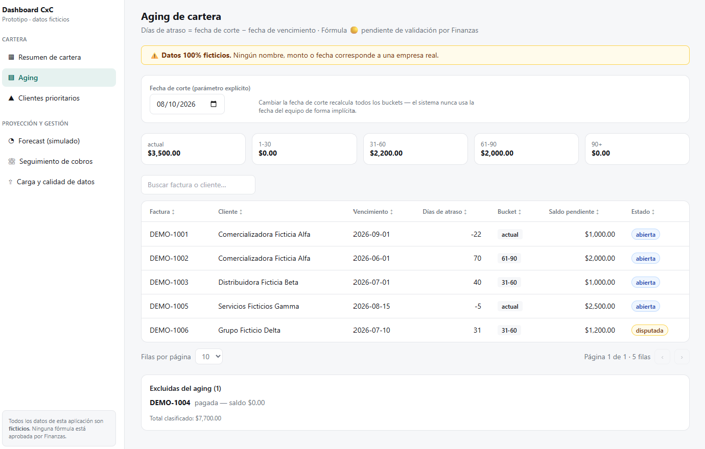

#### Referencia visual para esta pantalla

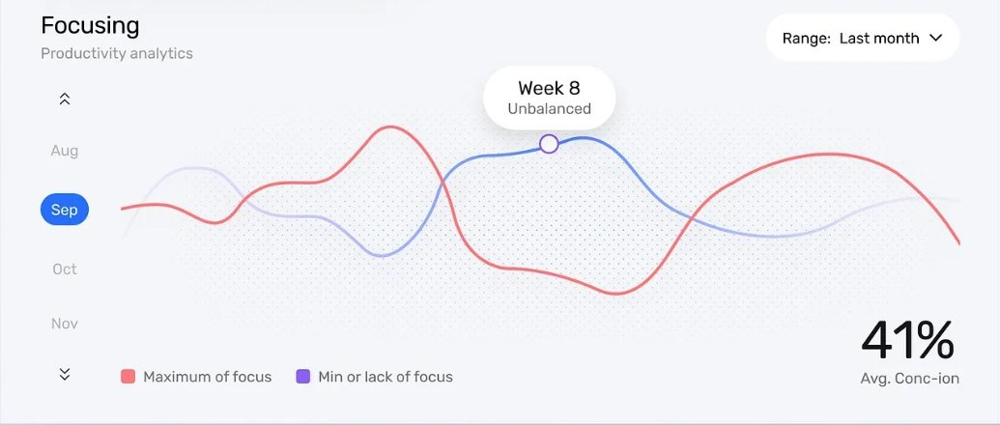

- **Capa de referencia que se usa:** el panel de análisis con área de respiración, líneas/grillas de bajo contraste, leyenda compacta y lectura principal claramente destacada.
- **No se usa:** las series, meses, métricas de productividad ni el gráfico de Worklio como modelo de datos.
- **Indicación para Claude:** mantener fecha de corte, cinco buckets, búsqueda, tabla, paginación y exclusiones exactamente como están. Aplicar el sistema de paneles al conjunto de buckets y a la tabla: encabezado más distinguible, cifras a la derecha, filas con hover sutil y badges de alto contraste. El bloque “Excluidas del aging” debe seguir separado y visible; no convertirlo en tooltip, modal ni contenido colapsado.

- Fecha de corte, buckets, búsqueda, tabla, filtros implícitos, paginación y exclusiones están visibles y deben preservarse.
- La tabla necesita una jerarquía más clara entre encabezados, cifras y badges; los cinco totales pueden convertirse visualmente en un conjunto más escaneable sin cambiar sus valores.
- El bloque de exclusiones debe seguir visible y distinguible: es evidencia de regla funcional, no decoración.

### Clientes prioritarios

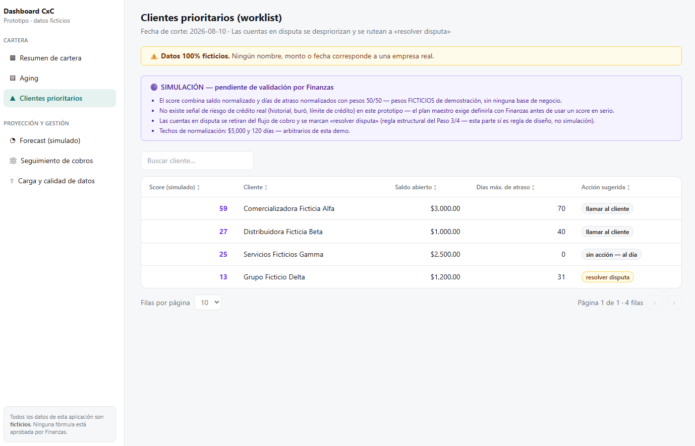

#### Referencia visual para esta pantalla

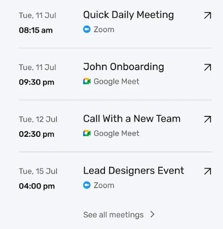

- **Capa de referencia que se usa:** ritmo vertical de una lista, separadores ligeros, prioridad visual entre título, metadato y acción, y acciones discretas alineadas al extremo.
- **No se usa:** reuniones, nombres, horas, plataformas, iconos ni acciones de Worklio.
- **Indicación para Claude:** conservar score, cliente, saldo abierto, días de atraso y acción sugerida; no modificar orden ni la regla de disputa. Refinar filas y badges para que cada acción se escanee como una lista operativa: score y acción con énfasis controlado, separadores suaves y el aviso “SIMULACIÓN” siempre antes de la tabla, íntegro y legible.

- El aviso de simulación es explícito y correcto; no se puede ocultar, suavizar ni relegar a tooltip.
- La tabla permite leer score, saldo, atraso y acción. Falta contraste estructural entre prioridades, acciones y el aviso informativo.
- Los badges pueden ganar semántica cromática moderada, siempre con texto y contraste suficientes.

### Forecast

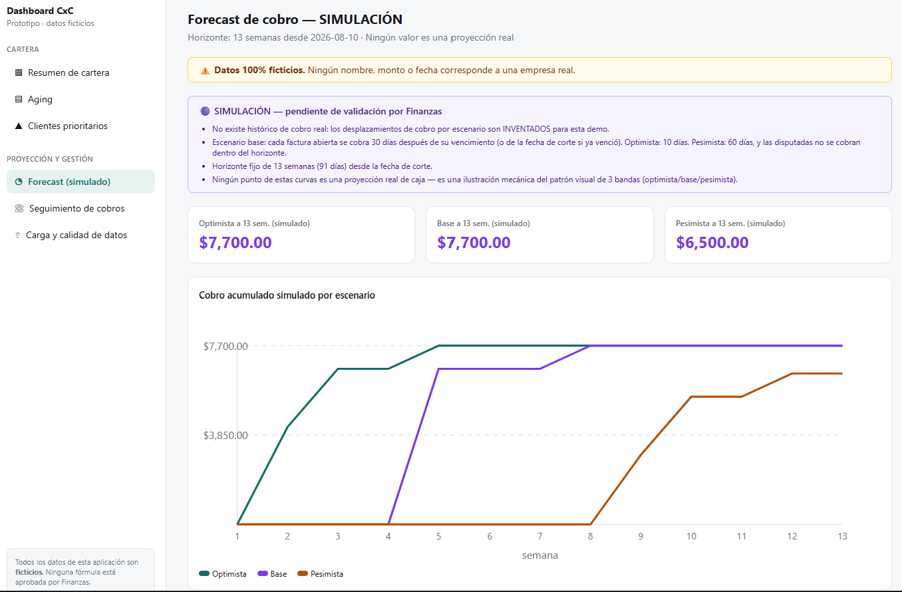

#### Referencia visual para esta pantalla

- **Capa de referencia que se usa:** composición abierta del área de gráfica, líneas limpias, grilla tenue, leyenda simple y un dato focal sin ruido visual.
- **No se usa:** curvas, escalas, etiquetas, colores exactos ni analítica de productividad de Worklio.
- **Indicación para Claude:** preservar por completo horizonte, importes, curvas y los tres escenarios. Mejorar únicamente contenedor, tipografía de las tarjetas, contraste de series, leyenda y grilla. Cada serie debe seguir identificable por texto además de color; el aviso de simulación permanece visible encima de los KPI.

- Los tres escenarios y el aviso de simulación están correctamente expuestos y se deben conservar sin reinterpretar la proyección.
- Las tarjetas y el gráfico requieren una composición más editorial: mejor separación de niveles, leyenda consistente y líneas distinguibles sin depender solo del color.
- No cambiar curvas, importes, horizonte, supuestos ni etiqueta de simulación.

### Carga y calidad de datos

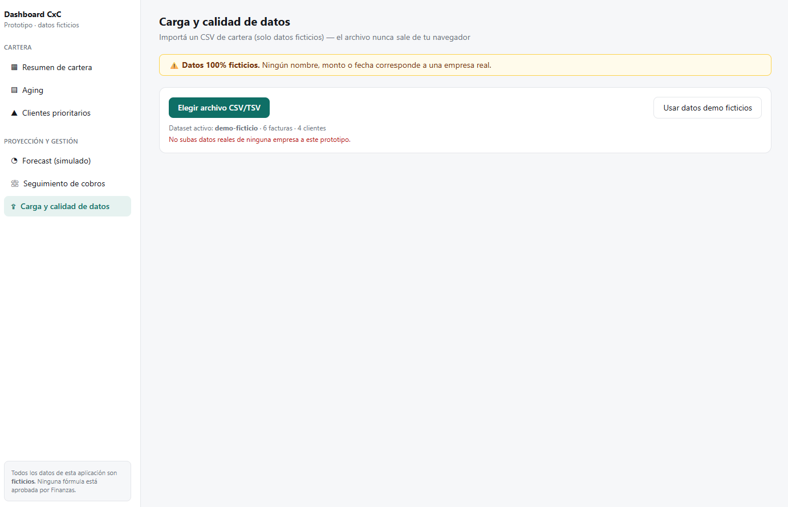

#### Referencia visual para esta pantalla

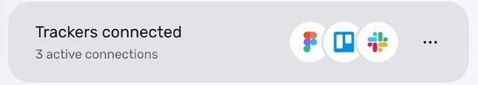

- **Capa de referencia que se usa:** tarjeta horizontal compacta, agrupación de acciones relacionadas y separación entre acción principal, metadato y acción secundaria.
- **No se usa:** logos de integraciones, menú de Worklio, ni la noción de conectar herramientas externas.
- **Indicación para Claude:** conservar botón CSV/TSV, botón de demo, texto de dataset y la regla de privacidad. Transformar solo la presentación en un panel de importación con jerarquía: acción primaria clara, acción secundaria separada y estado del dataset legible. No añadir integraciones, carga remota, credenciales ni nuevos controles funcionales.

- El control de carga, el botón de demo y la advertencia de datos ficticios son visibles.
- El área de trabajo queda visualmente subutilizada; puede organizarse como una zona de importación con ayuda contextual y estado de archivo, sin alterar el flujo ni la privacidad declarada.
- Esta captura se incluye una sola vez: la captura repetida aportada no añade evidencia distinta.

<strong>3. Referencia Worklio: principios visuales observables</strong>

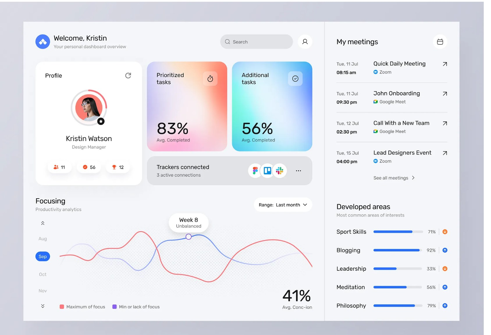

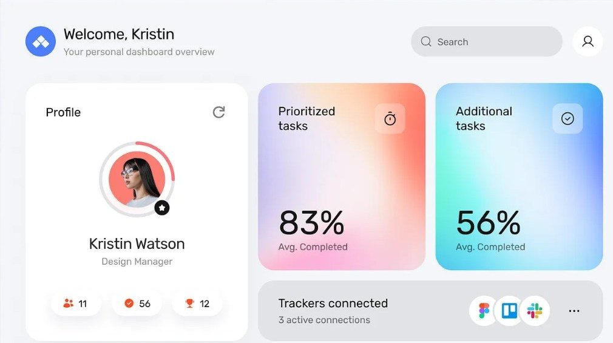

- **Layout:** composición por zonas, con panel principal amplio y columna secundaria de información; bloques claramente agrupados.
- **Jerarquía:** saludo/título, KPI de alto contraste y actividad secundaria con pesos tipográficos diferenciados.
- **Aire:** márgenes generosos, separación regular entre tarjetas y concentración de información por grupos.
- **Tarjetas:** radios amplios, fondos claros, sombras suaves y algunos paneles de énfasis cromático.
- **Paleta y gradientes:** base neutra fría con azul como acento; gradientes suaves reservados para tarjetas prioritarias, no para todo el fondo.
- **Tipografía:** títulos oscuros y directos; metadatos secundarios de menor contraste pero todavía legibles.
- **Gráficos:** líneas finas, leyenda simple, espacio de respiración y colores consistentes por serie.
- **Navegación y densidad:** controles discretos; el diseño prioriza lectura rápida sin llenar cada área disponible.

Estos principios se adaptan al dominio CxC; no se reproducen literalmente su composición, imágenes, textos, iconos ni layout.

<strong>4. Matriz actual → transformación visual permitida</strong>

| Componente actual | Transformación permitida | Preservación obligatoria |
|---|---|---|
| Sidebar | Fondo neutro, grupos con mayor aire, indicador activo y tipografía refinada | Todas las rutas, etiquetas y navegación |
| Encabezados | Jerarquía de título/subtítulo y mejor alineación | Textos, fecha de corte y avisos |
| Avisos ficticios/simulación | Contenedor de alta legibilidad, icono y color semántico | Texto, visibilidad y carácter no aprobado |
| KPI | Tarjetas con mejor spacing, borde/sombra sutil y acento contextual | Valores, definiciones y orden funcional |
| Buckets Aging | Barras con escala y color semántico consistente | Buckets, importes, cálculo y exclusiones |
| Tablas | Encabezado fijado visualmente, zebra muy leve, hover y columnas más escaneables | Columnas, búsqueda, orden, filtros y paginación |
| Badges | Tokens por estado y forma consistente | Estados, etiquetas y reglas |
| Forecast | Tarjetas de escenarios y gráfica con mejor leyenda/contraste | Curvas, horizonte, valores y aviso simulado |
| Carga de datos | Zona visual de importación con estado y ayuda | Flujo CSV/TSV, datos demo y regla de navegador |

<strong>5. Sistema visual propuesto</strong>

| Token | Propuesta de uso |
|---|---|
| Fondo | `#F6F7FB` para aplicación; superficies `#FFFFFF` |
| Texto | primario `#172033`, secundario `#64748B` |
| Acento | azul índigo `#4F7CFF`; turquesa `#0F8B7B` para cartera al día |
| Riesgo | ámbar `#D97706`, rojo `#D14343`, violeta `#7C3AED` solo para simulación |
| Espaciado | escala 4 / 8 / 12 / 16 / 24 / 32 px; paneles con 20–24 px internos |
| Radios | 12 px para controles, 16 px para tarjetas, 20 px para paneles destacados |
| Bordes y sombras | borde `#E6EAF0`; sombra baja `0 8px 24px rgba(23,32,51,.06)` |
| Estados | mensajes semánticos con texto e icono; nunca solamente color |
| Gráfico Aging | actual turquesa, 1–30 azul, 31–60 ámbar, 61–90 naranja, 90+ rojo; leyenda textual |
| Tabla | encabezado con superficie neutra, filas legibles, hover sutil, cifras alineadas a la derecha |
| Badges | fondo tenue + texto/borde de alto contraste; conservar siempre el nombre del estado |

<strong>6. Efectos permitidos y prohibidos</strong>

**Permitidos:** gradientes suaves y localizados; profundidad sutil; microinteracciones breves de hover/focus; glass moderado únicamente si conserva legibilidad y contraste.

**Prohibidos:** cambiar lógica, datos, cálculos o reglas CxC; ocultar controles con decoración; contraste insuficiente; depender solo de color; efectos excesivos, animación distractora, gradientes detrás de tablas o avisos, y cualquier tratamiento que minimice la advertencia de simulación/ficticio.

<strong>7. Plan de implementación visual por etapas</strong>

1. **Piloto: Resumen de cartera.** Aplicar tokens, layout, KPI y gráfico Aging sin alterar datos ni estructura funcional. Tomar captura antes/después en escritorio y móvil.
2. **Revisión humana del piloto.** Validar legibilidad, avisos, cifras y navegación antes de ampliar alcance.
3. **Sistema compartido.** Llevar tokens a sidebar, encabezados, avisos, tarjetas, tablas y badges.
4. **Módulos de mayor riesgo visual.** Adaptar Aging y Clientes prioritarios; comprobar tabla, filtros, paginación, exclusiones y aviso simulado.
5. **Forecast y calidad de datos.** Mejorar visualización sin tocar curvas ni flujo de carga.
6. **Auditoría final.** Repetir capturas desktop/móvil y estados normal, vacío, carga y error; documentar diferencias y hallazgos.

No avanzar de una etapa a la siguiente sin evidencia visual y aprobación humana del alcance anterior.

<strong>8. Prompt técnico final para Claude — usar solo tras aprobación humana</strong>

> Aplica exclusivamente la capa estética del prototipo local Dashboard CxC, siguiendo `auditoria-visual-worklio-cxc.md` como especificación. Worklio es solo inspiración visual: no copies su UI, texto, iconos, imágenes ni composición exacta.
>
> Empieza únicamente por la pantalla **Resumen de cartera** como piloto. Conserva sin excepción rutas, módulos, cálculos, datos ficticios, tabla, filtros, paginación, avisos de simulación, reglas de Aging y exclusiones. No modifiques lógica CxC, tipos, fuentes de datos, fórmula, importación CSV ni textos de advertencia.
>
> Implementa los tokens, espaciado, tarjetas, jerarquía, gráfico Aging, sidebar y estados definidos en la auditoría. Mantén alto contraste, navegación por teclado y texto además de color para cualquier estado. Gradientes y glass, si se usan, deben ser suaves, localizados y no reducir legibilidad.
>
> Ejecuta pruebas existentes y build; toma capturas antes/después en desktop y móvil. Reporta rutas de evidencia, esperado/observado y cualquier regresión. No ejecutes `git add`, commit ni push sin autorización humana expresa.

