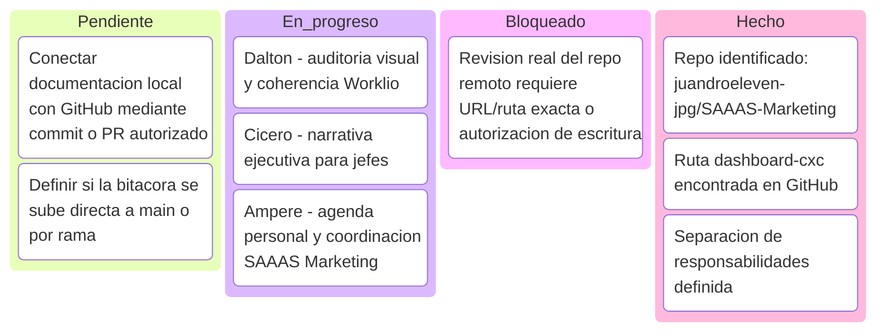

# Bitacora de agentes - Dashboard CxC

Fecha de control: 2026-08-11  
Repositorio GitHub: https://github.com/juandroeleven-jpg/SAAAS-Marketing  
Ruta sugerida en repo: `proyectos/dashboard-cxc/bitacora-agentes-dashboard-cxc.md`

Este documento funciona como centro de mando para coordinar los tres agentes sin que se pisen entre si. La regla base es simple: cada agente reporta avances aqui, pero no modifica el area de otro agente sin autorizacion.

## Estado general



## Agentes

| Agente | Rol | Estado | Entregable esperado | No debe tocar |
|---|---|---:|---|---|
| Dalton / Boyle | Auditor visual del Dashboard CxC | En progreso | Hallazgos visuales, screenshots, comparacion con Worklio, mejoras de UI | Logica, datos, formulas |
| Cicero / Carson | Presentacion ejecutiva | En progreso | Historia para jefes, guion demo, KPI, beneficios, limites y decisiones | Codigo de la app |
| Ampere / Dirac | Agenda personal y proyecto SAAAS Marketing | En progreso | Prioridades, calendario, backlog, seguimiento de repo | Servicios externos sin permiso |
| Tesla | Interfaz de automatizacion visual SAAAS Marketing | Pendiente | Brief UX, arquitectura de procesos, prompt maestro y plan para app en Vercel | Dashboard CxC, GitHub sin permiso, APIs externas |

## Registro historico

<details>
<summary>2026-08-11 - Identificacion del repositorio</summary>

- Se confirmo autenticacion local de GitHub como `juandroeleven-jpg`.
- Se encontro el repositorio `juandroeleven-jpg/SAAAS-Marketing`.
- Se confirmo que el repo contiene `proyectos/dashboard-cxc/`.
- No se hizo ningun cambio remoto.

</details>

<details>
<summary>2026-08-11 - Contexto funcional del Dashboard CxC</summary>

- El prototipo usa datos 100% ficticios.
- Modulos identificados:
  - Resumen de cartera
  - Aging
  - Clientes prioritarios
  - Forecast simulado
  - Seguimiento de cobros
  - Carga y calidad de datos
- Saldo pendiente mostrado en capturas: `$7,700.00`.
- Buckets vistos:
  - Al dia: `$3,500.00`
  - 1-30 dias: `$0.00`
  - 31-60 dias: `$2,200.00`
  - 61-90 dias: `$2,000.00`
  - 90+ dias: `$0.00`
- Existe una disputa activa que bloquea cobro normal.

</details>

<details>
<summary>2026-08-11 - Regla de no conflicto entre agentes</summary>

Cada agente debe escribir su avance en esta bitacora o en su propio archivo asignado. Nadie debe editar el mismo bloque, componente o documento que otro agente si no hay coordinacion previa.

Subreglas:

1. Dalton/Boyle revisa solo estetica, coherencia visual, contraste, responsive, cortes y capturas.
2. Cicero/Carson trabaja solo narrativa ejecutiva, presentacion, guion y explicacion para jefes.
3. Ampere/Dirac trabaja solo agenda personal, orden del proyecto, prioridades y seguimiento.
4. Ningun agente cambia datos, formulas, supuestos financieros o logica sin autorizacion explicita.

</details>

## Pasos operativos

<details>
<summary>Paso 1 - Conectar/revisar GitHub</summary>

Objetivo: usar el repo `SAAAS-Marketing` como fuente de verdad del proyecto.

Subpasos:

1. Confirmar acceso GitHub con la cuenta correcta.
2. Abrir `https://github.com/juandroeleven-jpg/SAAAS-Marketing`.
3. Revisar la carpeta `proyectos/dashboard-cxc/`.
4. Ubicar documentos existentes antes de crear duplicados.
5. Si se va a escribir en GitHub, definir si se hace commit directo o PR.

Estado actual: repo encontrado y pagina abierta en Codex. Escritura remota pendiente de autorizacion.

</details>

<details>
<summary>Paso 2 - Consolidar avances de agentes</summary>

Objetivo: que cada agente deje evidencia clara de que hizo y que falta.

Subpasos:

1. Pedir a Dalton/Boyle su ultimo reporte visual.
2. Pedir a Cicero/Carson su ultimo guion ejecutivo.
3. Pedir a Ampere/Dirac su plan de agenda y seguimiento.
4. Copiar los avances resumidos en "Registro historico".
5. Mover tarjetas del Kanban segun estado real.

Estado actual: roles definidos; falta consolidar entregables finales de cada agente.

</details>

<details>
<summary>Paso 3 - Definir tablero de proyecto</summary>

Objetivo: tener una vista simple de que esta pendiente, en progreso, bloqueado y hecho.

Subpasos:

1. Usar Mermaid Kanban como tablero principal.
2. Mantener una tarjeta por entregable, no por conversacion larga.
3. Marcar bloqueos solo cuando falta una decision, acceso o autorizacion.
4. Actualizar el tablero al cierre de cada sesion de agente.

Estado actual: tablero inicial creado.

</details>

<details>
<summary>Paso 4 - Preparar documento para GitHub</summary>

Objetivo: que este Markdown pueda vivir dentro del repo y servir como historial.

Subpasos:

1. Guardar este archivo en `proyectos/dashboard-cxc/`.
2. Revisar nombres y enlaces internos.
3. Confirmar con el usuario si se sube a GitHub.
4. Crear rama, commit y PR si se decide no tocar `main` directo.

Estado actual: documento creado localmente.

</details>

## Plantilla para reportes de agente

<details>
<summary>Formato obligatorio de actualizacion</summary>

```markdown
### Actualizacion - NOMBRE_AGENTE - YYYY-MM-DD HH:mm

Estado: Pendiente | En progreso | Bloqueado | Hecho

Avances:
- 

Evidencia:
- Archivo, screenshot, URL o nota

Riesgos:
- 

Proximo paso:
- 
```

</details>

## Proximas decisiones

1. Confirmar si este documento se sube al repo `SAAAS-Marketing`.
2. Confirmar si se sube directo a `main` o mediante una rama y PR.
3. Pedir a los tres agentes que usen este archivo como bitacora unica de avance.

## Nueva linea SAAAS Marketing - Interfaz de automatizacion visual

<details>
<summary>2026-08-11 - Nueva tarea: interfaz tipo tablero para procesos de imagen</summary>

Objetivo: crear una app/interfaz en Vercel para organizar procesos de generacion y edicion de imagenes, sin depender de API propia al inicio. ChatGPT se conectaria de forma operativa mediante tareas/agentes y prompts, no mediante integracion API.

Inspiracion visual/funcional recibida:

- Referencia 1: tablero oscuro tipo canvas con nodos conectados, assets, story, prompts e imagen/video gen.
- Referencia 2: interfaz clara tipo proyecto/kanban con columnas, tarjetas, tareas, archivos, responsables y estados.
- Referencia 3: bitacora actual en GitHub con Mermaid, que muestra la necesidad de guardar avances, prompts y decisiones.

Concepto del producto:

- Una interfaz general de procesos visuales.
- Cada proceso puede tener subprocesos.
- Cada subproceso puede tener subventanas.
- Las subventanas internas pueden abrir un tablero de edicion tipo canvas.
- La experiencia debe sentirse como un sistema de produccion visual, no como una lista plana.

Ejemplo de proceso:

1. Proceso principal: crear catalogo.
2. Subproceso: recopilar assets.
3. Subproceso: generar story / concepto.
4. Subproceso: crear prompts.
5. Subproceso: generar imagenes o video.
6. Subproceso interno: tablero de edicion con nodos, conexiones, outputs y versiones.

Regla importante aprendida:

Los prompts enviados a agentes no deben vivir solo en chats. Cada prompt operativo debe guardarse tambien en Markdown, con fecha, agente, objetivo, alcance, archivos permitidos y resultado esperado.

</details>

<details>
<summary>Prompt maestro para nuevo agente Tesla</summary>

```text
Trabaja como agente separado para SAAAS Marketing. Tu nombre de trabajo es Tesla.

Tu mision es disenar la primera version conceptual y operativa de una interfaz web para automatizacion de procesos visuales de imagen/video.

Contexto:
- Esto pertenece al repo SAAAS Marketing, no al Dashboard CxC.
- La app se quiere desplegar rapidamente en Vercel.
- Al inicio no debe depender de una API propia.
- ChatGPT se usaria mediante tareas/agentes y prompts, no mediante integracion API directa.
- Todo prompt importante que se envie a agentes debe quedar guardado en Markdown como historial del proyecto.

Referencias visuales:
- Una referencia oscura tipo canvas con nodos conectados: Assets -> Story -> Prompts -> Img/Video Gen.
- Una referencia clara tipo kanban/proyecto con columnas, tarjetas, archivos, estados, responsables y tareas.
- La idea de proceso/subproceso/subventana/tablero interno debe ser central.

Debes entregar:
1. Nombre provisional del producto/interfaz.
2. Descripcion corta del problema que resuelve.
3. Arquitectura UX:
   - vista general de procesos;
   - vista de proceso;
   - subprocesos;
   - subventanas;
   - tablero interno de edicion;
   - historial de prompts;
   - panel de outputs/versiones.
4. Modelo de navegacion tipo "proceso -> subproceso -> ventana -> tablero".
5. Componentes principales de la interfaz.
6. Mermaid con flujo del proceso.
7. Mermaid tipo kanban con estado inicial del proyecto.
8. Prompt tecnico para un futuro agente implementador que cree el prototipo en Vercel.
9. Riesgos y limites: no prometer automatizacion real sin API, no tocar servicios externos sin autorizacion, no mezclar con Dashboard CxC.

No modifiques archivos, GitHub, calendario, Gmail ni servicios externos sin autorizacion. Puedes proponer el Markdown que deberia guardarse y reportar tu avance usando la plantilla de bitacora.
```

</details>

### Actualizacion - Cicero / Carson - 2026-08-11 13:00

Estado: En progreso

Avances:
- Se definio la narrativa ejecutiva para jefatura alrededor de una idea central: el Dashboard CxC convierte la cartera en prioridades de gestion y no solo en un reporte.
- Problema a presentar: informacion dispersa, reaccion tardia ante vencimientos, seguimiento manual y poca visibilidad sobre riesgo, responsables y compromisos.
- Solucion a presentar: una vista integrada de resumen de cartera, aging, clientes prioritarios, forecast simulado, seguimiento de cobros y carga/calidad de datos.
- KPI propuestos para la conversacion ejecutiva: saldo pendiente, cartera vencida, porcentaje vencido, aging por bucket, concentracion en clientes prioritarios, recaudo, cumplimiento de compromisos y calidad/oportunidad de datos. Las definiciones finales deben validarse antes de convertirlos en KPI oficiales.
- Beneficio ejecutivo: mejorar visibilidad, priorizacion, velocidad de gestion y control del avance de cobranza, con foco en recuperacion de caja y reduccion de riesgo.
- Limites declarados: el prototipo usa datos 100% ficticios, el forecast es simulado, la disputa activa puede bloquear el cobro normal y el tablero depende de la calidad y frecuencia de actualizacion de las fuentes.
- Guion de demo propuesto: iniciar en Resumen de cartera, explicar el saldo pendiente de `$7,700.00`, recorrer los buckets de aging, bajar a Clientes prioritarios, mostrar la disputa y el Seguimiento de cobros, y cerrar con Forecast y Calidad de datos.
- Decisiones solicitadas a jefatura: validar KPI y definiciones, confirmar fuentes y frecuencia de actualizacion, acordar criterios de prioridad/escalamiento, nombrar responsables y autorizar un piloto con datos reales.

Evidencia:
- Contexto funcional registrado en esta bitacora, seccion "2026-08-11 - Contexto funcional del Dashboard CxC".
- Modulos identificados: Resumen de cartera, Aging, Clientes prioritarios, Forecast simulado, Seguimiento de cobros y Carga y calidad de datos.
- Cifras de referencia registradas: saldo pendiente `$7,700.00`; Al dia `$3,500.00`; 31-60 dias `$2,200.00`; 61-90 dias `$2,000.00`; 1-30 y 90+ en `$0.00`.

Riesgos:
- Presentar datos ficticios como resultados reales podria generar una conclusion incorrecta sobre la efectividad de cobranza.
- No se deben prometer automatizaciones, precision de forecast ni integraciones que no esten confirmadas en el prototipo.
- Sin definiciones comunes de KPI, jefatura podria interpretar de forma distinta vencido, recaudo, promesa cumplida o calidad de datos.

Proximo paso:
- Convertir esta narrativa en un guion final de 5-7 minutos y una lista de decisiones para la reunion, una vez confirmados los KPI visibles y el flujo exacto de la demo.
