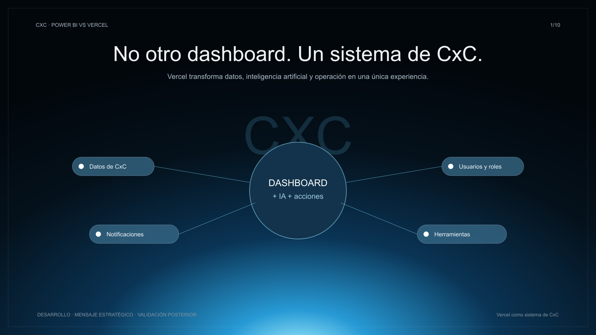
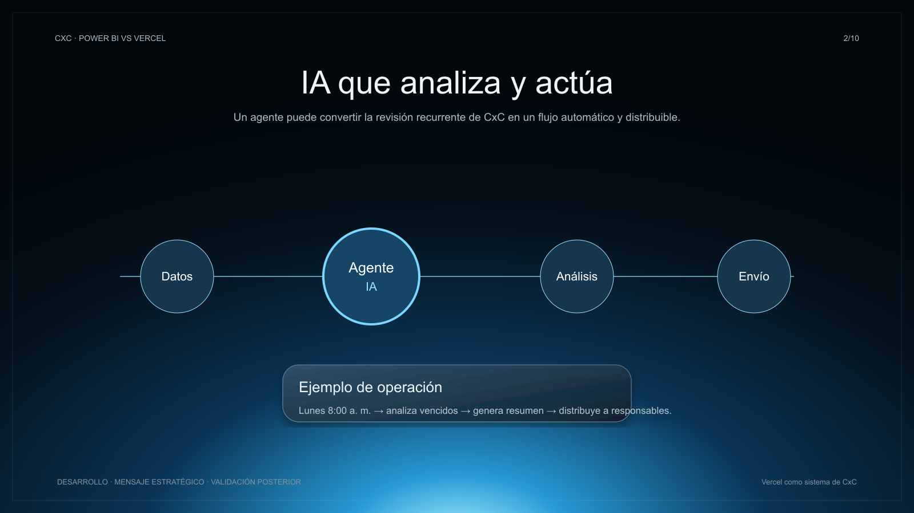
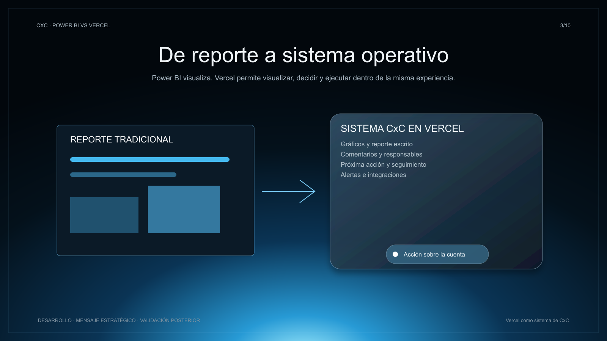
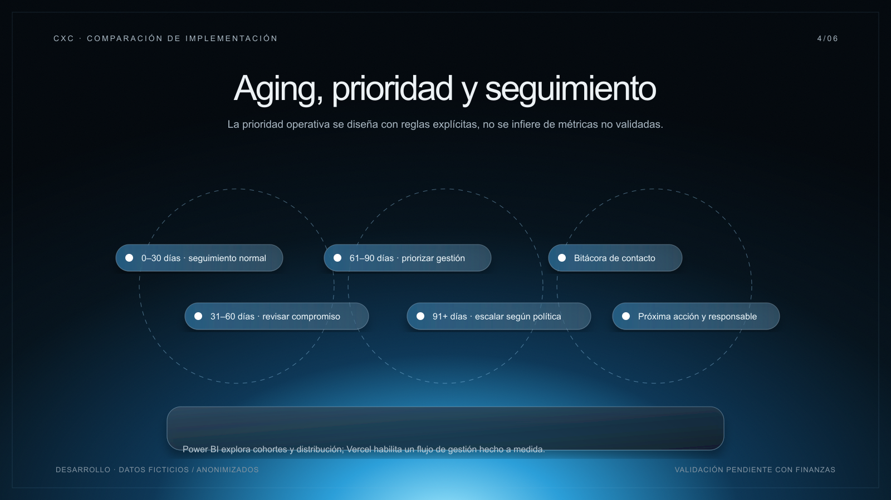
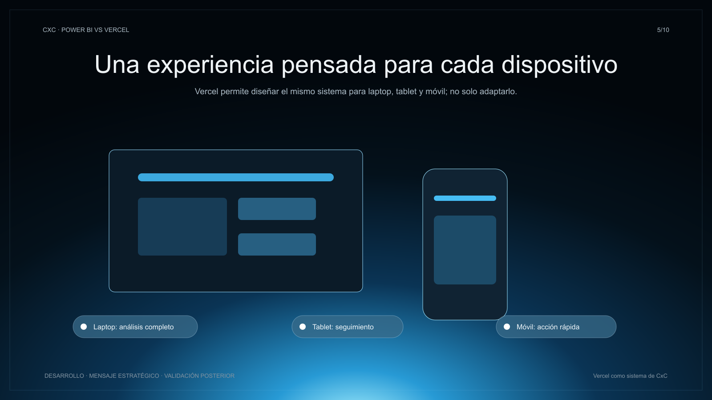
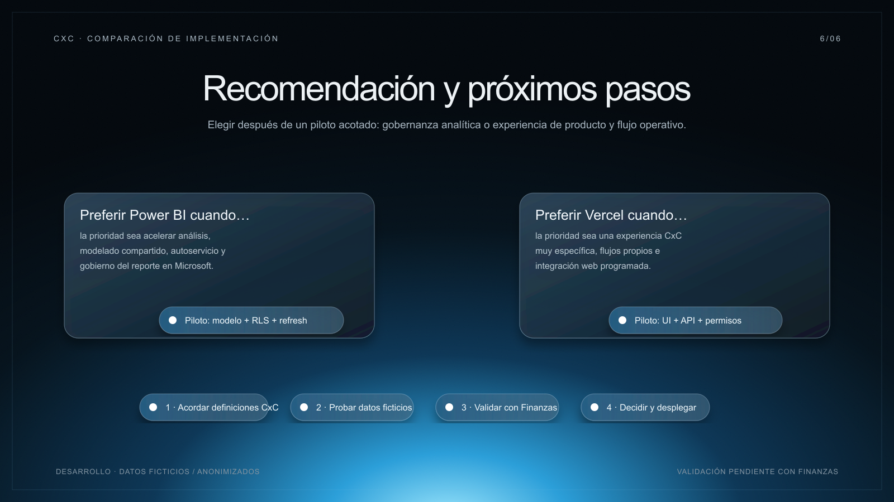
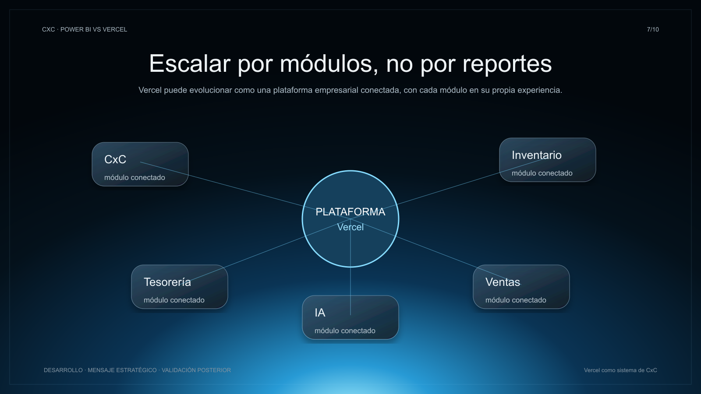
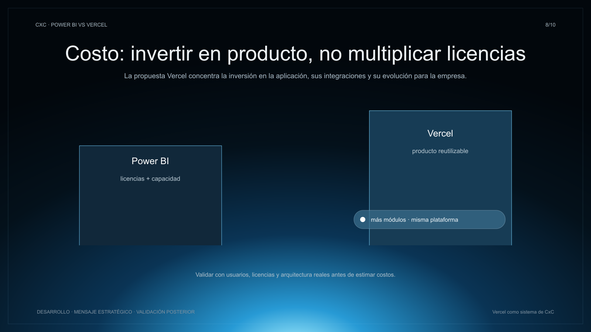
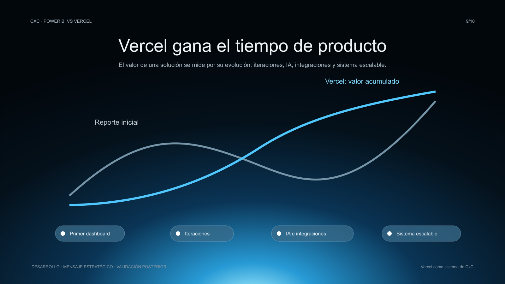
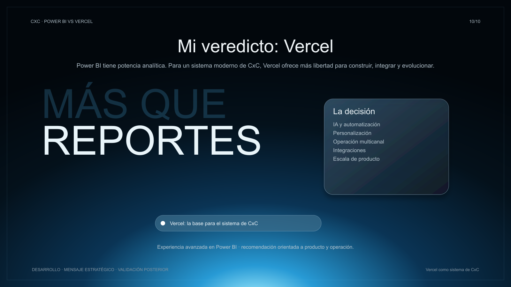

# CxC: por qué elegir una aplicación web en Vercel

Fecha: 2026-08-10. Presentación estratégica para proponer un sistema de Cuentas por Cobrar (CxC) programado y desplegado en Vercel. La comparación posiciona a Vercel como la alternativa recomendada para el producto objetivo; no declara KPIs financieros, costos, rendimiento o controles ya validados. Todo piloto debe usar datos ficticios o anonimizados y validarse con Finanzas, TI y Seguridad.

## Tesis

Power BI es una plataforma sólida de analítica y reportes. La propuesta Vercel se recomienda cuando CxC debe evolucionar de dashboard a sistema operativo: una experiencia personalizada que integra datos, usuarios, automatizaciones, IA, tareas y herramientas externas.

01 · Sistema de CxC

**Objetivo:** abrir con la tesis: Vercel conecta datos, IA, usuarios, herramientas y acciones en un sistema único.

**Lectura Power BI:** reportes y análisis administrados.

**Lectura Vercel:** producto CxC a medida; ganador estratégico por integración y operación.

**Supuestos:** integraciones y permisos se implementarán y aprobarán antes de producción.

### Guion para presentar

Esta primera lámina plantea el cambio de enfoque. No estamos proponiendo otro dashboard aislado, sino un sistema de CxC donde los datos se conectan con las personas, las reglas de negocio y las acciones que debe ejecutar el equipo. Power BI resuelve muy bien la capa de análisis y reporte; esa fortaleza se reconoce. Sin embargo, nuestra recomendación es Vercel porque nos permite diseñar el producto completo alrededor de la operación de cobranza: vistas por rol, procesos propios, notificaciones e integraciones. La prioridad ya no es solo mirar un saldo; es entenderlo y convertirlo en una acción controlada.

02 · IA que analiza y actúa

**Objetivo:** visualizar un agente que analiza datos, genera un resumen y lo distribuye.

**Lectura Power BI:** IA y automatización dentro de flujos administrados, según capacidades habilitadas.

**Lectura Vercel:** máxima libertad para conectar APIs, agentes, horarios y destinatarios; ganador para el flujo de trabajo a medida.

**Supuestos:** ejemplo ilustrativo; no hay agente ni envío automático operando aún.

### Guion para presentar

Aquí está uno de los diferenciales más importantes. En una aplicación construida en Vercel podemos conectar un agente de IA al flujo de CxC: recibe datos permitidos, identifica cambios relevantes, redacta un resumen y lo distribuye a los responsables definidos. Por ejemplo, podría ejecutarse cada lunes a las ocho de la mañana, pero eso es un caso de diseño, no una automatización ya activa. Power BI puede apoyar el análisis dentro de su entorno. Vercel gana en esta propuesta porque permite integrar la IA, el horario, la lógica y los canales de entrega dentro del mismo producto, con controles que deben validarse antes de producción.

03 · De reporte a sistema operativo

**Objetivo:** diferenciar visualización analítica de experiencia operativa.

**Lectura Power BI:** reportes, tablas, filtros y exploración.

**Lectura Vercel:** combina análisis, comentario, asignación, alerta y acción; ganador por personalización.

**Supuestos:** funciones operativas sujetas a diseño y pruebas.

### Guion para presentar

La diferencia aquí no es que Power BI sea malo para reportar; de hecho, es muy fuerte para tablas, gráficos, filtros y exploración. La pregunta es qué ocurre después de descubrir una cuenta vencida. Con Vercel, el mismo espacio puede mostrar el análisis, permitir registrar un comentario, asignar un responsable, crear una próxima acción y disparar una alerta. Es decir, el reporte deja de ser el final del proceso y se convierte en el punto de partida de la operación. Por esa capacidad de personalización y de acción, recomendamos Vercel como base del sistema de CxC.

04 · Facilidad de uso

**Objetivo:** priorizar una vista por rol y tarea.

**Lectura Power BI:** navegación basada en la estructura del reporte.

**Lectura Vercel:** interfaz, lenguaje y flujo hechos para cobranza; ganador para la experiencia final de usuario.

**Supuestos:** se realizará prueba UX con usuarios reales antes de concluir.

### Guion para presentar

Facilidad de uso no significa solamente que el primer reporte se construya rápido. Significa que el cobrador, el analista y el director encuentren exactamente lo que necesitan sin aprender una estructura genérica de páginas, filtros y visuales. Power BI ofrece una experiencia conocida de BI y funciona muy bien para consumo analítico. Con Vercel podemos diseñar una vista por rol, usar el lenguaje de la empresa y convertir las tareas frecuentes en acciones visibles. Esa libertad nos permite reducir fricción para el usuario final. La prueba definitiva será una validación UX con usuarios reales, pero la recomendación de diseño es Vercel.

05 · Multidispositivo

**Objetivo:** mostrar la experiencia coherente en laptop, tablet y móvil.

**Lectura Power BI:** aplicaciones y autenticación del ecosistema Microsoft.

**Lectura Vercel:** experiencia web adaptable, diseño móvil específico y acceso personalizable; ganador por control de producto.

**Supuestos:** autenticación y autorización deben validarse con TI.

### Guion para presentar

En acceso multidispositivo, Power BI tiene una ventaja clara: aplicaciones y autenticación integradas en el ecosistema Microsoft. No la ignoramos. Sin embargo, para el producto que estamos proponiendo, Vercel ofrece más control sobre la experiencia. Podemos diseñar de forma específica qué se ve en laptop, qué acción rápida se habilita en móvil y qué información debe aparecer en tablet. También podemos adaptar la autenticación y los permisos a la estructura real de la empresa. Eso no elimina la necesidad de controles; al contrario, TI debe validar identidad, autorización y protección de datos. Vercel gana porque el producto se adapta al trabajo, no al revés.

06 · De explorar a actuar

**Objetivo:** llevar de resumen a cliente, factura, contacto y próxima acción sin salir del sistema.

**Lectura Power BI:** drill-down y exploración analítica.

**Lectura Vercel:** flujo operativo con asignación, comentarios y cierre; ganador por ejecución.

**Supuestos:** las acciones y estados aún son conceptos de producto.

### Guion para presentar

Esta lámina resume la diferencia operativa. Power BI permite bajar desde un resumen hasta el detalle mediante filtros, navegación y drill-down; es muy útil para investigar. Vercel nos permite continuar ese recorrido hasta la acción: abrir el cliente, ver la factura, registrar un contacto, definir un compromiso y asignar una siguiente tarea sin salir a otro sistema. Así convertimos el dashboard en un espacio de ejecución, no solo de consulta. Las acciones mostradas todavía son conceptos de producto y deberán diseñarse con el equipo de cobranza. Aun así, el criterio de recomendación es claro: Vercel ofrece la experiencia más completa para actuar sobre CxC.

07 · Escalabilidad modular

**Objetivo:** representar CxC como parte de una plataforma conectada.

**Lectura Power BI:** expansión mediante modelos, reportes y gobierno analítico.

**Lectura Vercel:** módulos independientes conectados en una plataforma de producto; ganador para la evolución funcional.

**Supuestos:** arquitectura, datos y capacidad se evaluarán en un piloto.

### Guion para presentar

Cuando la empresa crece, CxC rara vez permanece aislado. Aparecen inventario, ventas, tesorería, alertas e iniciativas de IA. Power BI puede crecer mediante modelos, reportes y gobierno analítico, y esa disciplina es valiosa. Nuestra propuesta busca otra forma de escalar: una plataforma de producto donde cada módulo tiene su experiencia propia, pero comparte identidad, datos autorizados e integraciones. Vercel gana porque permite evolucionar por módulos sin convertir toda la experiencia en una colección de reportes independientes. Esto no es una promesa de rendimiento: la arquitectura, capacidad y calidad de datos deben comprobarse mediante un piloto técnico controlado.

08 · Costo y reutilización

**Objetivo:** contrastar licenciamiento con una inversión de producto reutilizable.

**Lectura Power BI:** costos ligados a licencias, capacidades y configuración aplicable.

**Lectura Vercel:** mayor control para diseñar una plataforma reutilizable; ganador potencial de largo plazo, sujeto a estimación real.

**Supuestos:** no se presentan precios, ahorros ni costos validados.

### Guion para presentar

No estamos afirmando que una opción sea más barata sin conocer usuarios, licencias, capacidad, infraestructura y necesidades de soporte. Power BI tiene una estructura de costos ligada a las licencias y a la configuración que corresponda. Vercel también requiere inversión: desarrollo, mantenimiento, seguridad e integraciones. La razón por la que recomendamos Vercel es estratégica: la inversión construye un producto reutilizable que puede extenderse a otros módulos y procesos de la empresa. En lugar de valorar solo el precio de un reporte, debemos valorar la propiedad y reutilización del sistema. La estimación económica debe hacerse después con información real y aprobada.

09 · Tiempo y evolución

**Objetivo:** mostrar por qué el tiempo relevante es el de construir y evolucionar el producto completo.

**Lectura Power BI:** optimiza la creación de reportes dentro de su patrón analítico.

**Lectura Vercel:** gana en el tiempo total de producto al evolucionar con IA, integraciones y experiencia propia.

**Supuestos:** los tiempos se estimarán después de definir alcance y equipo.

### Guion para presentar

El tiempo correcto para comparar no es únicamente el de publicar la primera pantalla. Power BI optimiza la creación de reportes dentro de un patrón analítico conocido. Vercel requiere construir más piezas al inicio, pero nos permite evolucionar sin que cada nueva necesidad tenga que adaptarse a un formato fijo. Cuando añadimos automatización, IA, integraciones, roles, acciones y módulos, la inversión se acumula como producto. Por eso Vercel es el ganador de tiempo en la visión completa: no por una promesa de días ni por una cifra no validada, sino porque crea una base flexible para las siguientes iteraciones. El cronograma real dependerá del alcance y del equipo.

10 · Veredicto

**Objetivo:** cerrar con la recomendación de Vercel como base del sistema CxC.

**Lectura Power BI:** potencia analítica reconocida.

**Lectura Vercel:** recomendación por IA, automatización, personalización, integraciones y escala de producto.

**Supuestos:** veredicto estratégico basado en experiencia de producto; requiere aprobación de las áreas responsables.

### Guion para presentar

El veredicto no pretende descalificar Power BI. Es una herramienta potente para analítica, reportes y gobierno de datos, y puede seguir siendo valiosa en la empresa. Pero para este objetivo —un sistema moderno de CxC con experiencia propia, IA, automatización, integraciones y capacidad de evolucionar— recomendamos Vercel. Su ventaja es la propiedad del producto: la empresa define la interfaz, el flujo, las reglas y cómo se conectan las herramientas. Esa libertad implica responsabilidad técnica y validaciones con Finanzas, TI y Seguridad. La recomendación final es iniciar un piloto de Vercel con datos ficticios o anonimizados y criterios de éxito acordados.

## Método, límites y fuentes oficiales

La presentación compara una implementación madura de Power BI con una aplicación web programada y desplegada en Vercel. No afirma que Vercel sustituya controles de identidad, autorización, seguridad de API, protección de datos o monitoreo: estos deben diseñarse explícitamente. Los enlaces siguientes se usarán como base técnica para el piloto:

- [Power BI: guía de seguridad por filas](https://learn.microsoft.com/power-bi/guidance/rls-guidance)
- [Power BI: actualización incremental](https://learn.microsoft.com/power-bi/connect-data/incremental-refresh-configure)
- [Vercel Functions](https://vercel.com/docs/functions)
- [Vercel: despliegues](https://vercel.com/docs/deployments/overview)
- [Vercel: variables de entorno](https://vercel.com/docs/environment-variables)
