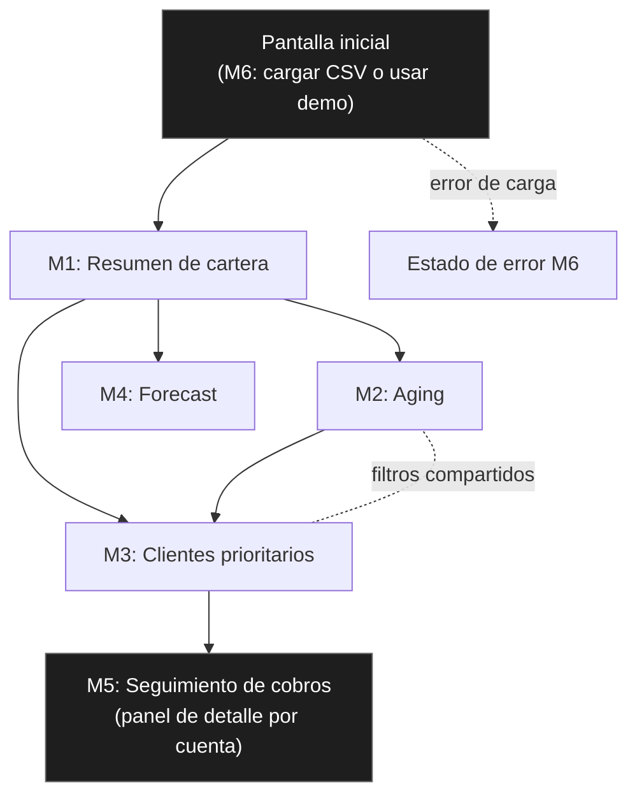

# Paso 3 — Convertir la pantalla de AR Cockpit en módulos propios

**Fecha:** 2026-08-10
**Estado:** entregable documental completo, pendiente de revisión y aprobación humana
**Actualización:** revisión solicitada tras observaciones del coordinador (GPT) — se agregaron estado exacto de archivos, criterios de aceptación por módulo, matriz de trazabilidad, sección de no-implementado, y 2 decisiones abiertas para revisión humana (M5, M4).

---

## ⚠️ Naturaleza de este entregable — léase antes de lo demás

**Esto es un documento de diseño y arquitectura, no una aplicación funcional.** No existe código ejecutable, no hay una app corriendo, no se procesó ningún dato (ni real ni ficticio) en este paso. Lo que existe es: la descomposición de la pantalla única de AR Cockpit en 6 módulos independientes, con sus contratos (entradas/salidas), separación de capas, dependencias y estados de UI **como especificación**, para servir de base al Paso 4 (modelo de datos), Paso 5 (datos ficticios) y Paso 6 (implementación real del aging).

Las "verificaciones" de este documento (sección 4) son **verificaciones documentales**: revisión de texto contra otros documentos, búsqueda de patrones de código/credenciales en el propio Markdown. **No son pruebas de software con datos de entrada y salida verificada**, porque no hay software todavía que ejecutar. Eso llegará recién cuando se implemente el Paso 6 (aging) sobre los datos ficticios del Paso 5.

---

## 0. Estado exacto de cada archivo del proyecto Dashboard CxC

| Archivo | Ruta | Estado real |
|---|---|---|
| Plan maestro | `proyectos/dashboard-cxc/plan-maestro-dashboard-cxc.md` | **Publicado en GitHub** (rama `main`), incluye una sección de verificación agregada por commit externo `b5eb516` (ver sección 5) |
| Paso 1 — línea base | `proyectos/dashboard-cxc/paso-1-linea-base.md` | **Publicado en GitHub**, commits `9cd2f07` y `c38bb1a` |
| Capturas de referencia (AR Cockpit, shadcn-admin) | `proyectos/dashboard-cxc/referencia-*.png` | **Publicadas en GitHub**, commit `a9f81da` |
| Mapa de componentes visuales (Paso 2) | `proyectos/dashboard-cxc/mapa-componentes-visuales.md` | **Local, sin commit, sin publicar** (`git status`: `??`) |
| Mapa de módulos funcionales (Paso 2) | `proyectos/dashboard-cxc/mapa-modulos-funcionales.md` | **Local, sin commit, sin publicar** |
| Fórmulas y supuestos (Paso 2) | `proyectos/dashboard-cxc/formulas-y-supuestos-cxc.md` | **Local, sin commit, sin publicar** |
| Borrador modelo de datos (Paso 2, preparatorio Paso 4) | `proyectos/dashboard-cxc/borrador-modelo-datos.md` | **Local, sin commit, sin publicar** |
| Revisión de calidad Paso 2 | `proyectos/dashboard-cxc/revision-paso-2.md` | **Local, sin commit, sin publicar** |
| Estado previo a Paso 3 | `proyectos/dashboard-cxc/estado-antes-paso-3.md` | **Local, sin commit, sin publicar** |
| Este documento (Paso 3) | `proyectos/dashboard-cxc/paso-3-modulos-propios.md` | **Local, sin commit, sin publicar** |
| Evidencias de verificación de "Ohm" | `proyectos/dashboard-cxc/evidencias-verificacion/*.png` (3 archivos) | **Publicadas en GitHub**, commit `b5eb516` — pero verifican documentos que en ese momento NO estaban publicados (ver sección 5) |

**Resumen:** de los 10 archivos del proyecto CxC, 4 están publicados en GitHub (plan maestro, Paso 1, capturas de referencia, evidencias de Ohm) y **6 existen solo en este entorno local**, sin commit, sin push. Ninguno de los 6 se subirá hasta que lo apruebes explícitamente (regla 11 del encargo, respetada en todo momento).

---

## 1. Objetivo

Descomponer la pantalla única de AR Cockpit (referencia funcional) en módulos independientes propios del Dashboard de CxC, definiendo responsabilidades, entradas/salidas, separación de capas (visual/lógica/datos), dependencias, estados de UI, navegación, componentes y criterios de aceptación — sin copiar código ni estructura de AR Cockpit, y sin implementar ninguna lógica todavía.

## 2. Alcance

Este documento cubre exclusivamente la descomposición estructural en módulos, a nivel de especificación. No define fórmulas cerradas (eso es `formulas-y-supuestos-cxc.md`, Paso 2, todas marcadas pendientes de validación), ni el modelo de datos detallado (eso es el Paso 4), ni datos de prueba (Paso 5), ni implementación real (Paso 6 en adelante). Se apoya en `mapa-modulos-funcionales.md` y `mapa-componentes-visuales.md` (Paso 2) como insumos documentales — ver matriz de trazabilidad en la sección 6.

---

## 3. Inventario de módulos

| # | Módulo | Origen conceptual |
|---|---|---|
| M1 | Resumen de cartera | AR Cockpit (tab Aging, sección superior) |
| M2 | Aging | AR Cockpit (tab Aging, buckets) |
| M3 | Clientes prioritarios (Worklist) | AR Cockpit (tab Worklist) |
| M4 | Forecast | AR Cockpit (tab Cash Forecast) |
| M5 | Seguimiento de cobros | AR Cockpit (incrustado en Worklist en la demo — se separa como módulo propio, ver decisión D1 y decisión abierta A) |
| M6 | Carga y calidad de datos | AR Cockpit (modal de import CSV) |

---

<details>
<summary><strong>M1 — Resumen de cartera</strong></summary>

**Responsabilidad:** mostrar el estado agregado de la cartera de cuentas por cobrar en un momento dado (fecha de corte).

**Entradas:** lista de facturas abiertas con monto, saldo pendiente, fecha de vencimiento; filtros activos (agrupador organizacional, rango de fechas, cliente).

**Salidas:** tarjetas KPI (cartera total, % al día, monto en bucket crítico, cuentas en riesgo — definición de "en riesgo" pendiente de Finanzas), desglose por agrupador organizacional.

**Reglas de negocio:** ninguna fórmula cerrada en este paso; el criterio de "cuenta en riesgo" remite a `formulas-y-supuestos-cxc.md` (pendiente de validación por Finanzas). Este módulo solo agrega/suma lo que M2 clasifica — no introduce reglas propias.

**Separación de capas:**
- Visual: tarjetas KPI (patrón `Card` de shadcn-admin, ver `mapa-componentes-visuales.md` §3)
- Lógica: agregación de montos por bucket/agrupador — función pura que recibe la lista de facturas filtrada y devuelve totales
- Datos: lista de facturas (Paso 4 define el esquema exacto)

**Dependencias:** M2 (Aging) provee la clasificación por bucket que M1 resume; M6 (Carga de datos) provee el dataset base.

**Estados:**
- Carga: skeleton en las 4 tarjetas KPI
- Error: mensaje "No se pudo calcular el resumen de cartera" con botón de reintentar
- Vacío: si no hay facturas cargadas, tarjetas en 0 con mensaje "Cargá un archivo para ver el resumen" (no ocultar el módulo)

**Qué se toma de referencia vs. qué se reconstruye:**
- Se toma: la idea de resumen ejecutivo en tarjetas + desglose por agrupador
- Se reconstruye: qué cuenta como "cuenta en riesgo" (pendiente de Finanzas), y qué agrupador organizacional aplica (no "desks" ficticios de la demo)

**Criterios de aceptación (para cuando se implemente, no aplican todavía):**
- [ ] Las 4 tarjetas KPI muestran valores coherentes con la suma de M2 sobre el mismo dataset (verificable comparando totales manualmente contra el CSV de entrada)
- [ ] El estado vacío se muestra cuando no hay facturas cargadas, sin mostrar `NaN`, `undefined` ni errores en consola
- [ ] El desglose por agrupador suma exactamente el mismo total que la tarjeta "Cartera total"

</details>

<details>
<summary><strong>M2 — Aging</strong></summary>

**Responsabilidad:** clasificar cada factura abierta en un bucket de antigüedad según días de atraso respecto a una fecha de corte explícita.

**Entradas:** lista de facturas (monto, saldo pendiente, fecha de vencimiento), fecha de corte seleccionada explícitamente por el usuario (no "hoy" automático).

**Salidas:** distribución de saldo por bucket (actual, 1-30, 31-60, 61-90, 90+), como datos consumibles por M1 y por la visualización propia del módulo (barras/tabla).

**Reglas de negocio:** `Días de atraso = Fecha de corte − Fecha de vencimiento` (fórmula dada por el plan maestro, Fase 3). La implementación real y los casos de prueba se hacen en el **Paso 6**, no aquí — este documento solo fija la interfaz del módulo.

**Separación de capas:**
- Visual: gráfico de barras + tabla de detalle (patrón data-table, `mapa-componentes-visuales.md` §4)
- Lógica: función pura `calcularBucket(fechaCorte, fechaVencimiento) → bucket` — se implementa en el Paso 6
- Datos: facturas con saldo pendiente > 0 y fecha de vencimiento

**Dependencias:** M6 (Carga de datos) provee las facturas; M1 consume la salida de M2.

**Estados:**
- Carga: skeleton en gráfico y tabla
- Error: mensaje específico si la fecha de corte es inválida o faltan fechas de vencimiento
- Vacío: "No hay facturas abiertas para clasificar" si el dataset filtrado queda vacío

**Qué se toma vs. qué se reconstruye:**
- Se toma: la convención de 5 buckets como estructura de referencia
- Se reconstruye: los cortes exactos (pueden diferir de 30/60/90 según política real) y la fórmula de cálculo, con fecha de corte explícita

**Criterios de aceptación (para el Paso 6, no aplican todavía):**
- [ ] Cada factura cae en exactamente un bucket (categorías mutuamente excluyentes, ver regla del encargo)
- [ ] Los días se calculan contra la fecha de corte elegida, nunca contra "hoy" del sistema automáticamente
- [ ] La suma de los 5 buckets es igual al total de saldo pendiente cargado

</details>

<details>
<summary><strong>M3 — Clientes prioritarios (Worklist)</strong></summary>

**Responsabilidad:** generar una lista ordenada de cuentas a gestionar, combinando monto, antigüedad, riesgo e importancia del cliente en un score único, con una acción sugerida por cuenta.

**Entradas:** facturas agrupadas por cliente (de M2), señales de riesgo por cliente (pendientes de definir con Finanzas — no existen en el dataset ficticio actual), flags de disputa/promesa de pago.

**Salidas:** tabla priorizada ordenable (score, monto, días vencidos), con acción sugerida por fila.

**Reglas de negocio:** **no se define fórmula cerrada en este documento.** El scoring remite a `formulas-y-supuestos-cxc.md`, donde está explícitamente marcado 🟡 pendiente de validación por Finanzas. No se debe implementar ninguna fórmula de scoring hasta que esa validación ocurra.

**Separación de capas:**
- Visual: data-table con columnas de score/monto/días/acción (patrón `mapa-componentes-visuales.md` §4 y §7 para filtros)
- Lógica: función de scoring — pendiente, sin fórmula cerrada
- Datos: facturas + flags de estado por cliente (disputa, promesa de pago)

**Dependencias:** M2 (aging) y M1 (resumen) alimentan variables del score; depende de que Finanzas defina señales de riesgo reales (bloqueo documentado, no simulado).

**Estados:**
- Carga: skeleton en tabla
- Error: si falta algún input requerido para el score, mostrar qué campo falta (no calcular con datos incompletos silenciosamente)
- Vacío: "No hay cuentas para priorizar con los filtros actuales"

**Qué se toma vs. qué se reconstruye:**
- Se toma: el concepto de score único + acción sugerida + despriorización de cuentas en disputa
- Se reconstruye totalmente: la fórmula de riesgo de default y los pesos (los de la demo son arbitrarios y se descartan)

**Criterios de aceptación (bloqueados hasta validación de Finanzas):**
- [ ] **No implementable todavía** — depende de que exista una fórmula de scoring aprobada; hasta entonces, M3 solo puede mostrarse como tabla ordenada por monto/días (sin score compuesto)

</details>

<details>
<summary><strong>M4 — Forecast</strong></summary>

**Responsabilidad:** proyectar cobro futuro en 3 escenarios (optimista/base/pesimista) sobre horizontes seleccionables.

**Entradas:** cartera abierta (de M2), mora histórica por cuenta (**no existe ninguna fuente definida todavía**), flags de disputa.

**Salidas:** curvas acumuladas por escenario, tarjetas resumen por horizonte.

**Reglas de negocio:** sin fórmula cerrada, ver `formulas-y-supuestos-cxc.md` §6 (explícitamente sin magnititudes definidas). Ver decisión abierta B más abajo — este módulo no debe implementarse hasta que se resuelva de dónde sale el histórico de cobro.

**Separación de capas:**
- Visual: gráfico de líneas/área con selector de horizonte
- Lógica: proyección por escenario — sin fórmula cerrada
- Datos: cartera + histórico de cobro (no existe todavía; ver decisión abierta B)

**Dependencias:** M2 (aging) como base de cartera; requiere histórico de cobro que hoy no existe en ningún documento del proyecto.

**Estados:**
- Carga: skeleton en gráfico
- Error: "No hay suficiente histórico para proyectar" si falta el dato de mora histórica
- Vacío: el forecast sin datos no debe mostrar una curva en cero (sería engañoso); debe mostrar explícitamente "Forecast no disponible sin histórico de cobro"

**Qué se toma vs. qué se reconstruye:**
- Se toma: el patrón de 3 bandas + horizontes múltiples
- Se reconstruye totalmente: cualquier fórmula de proyección, que debe basarse en tasas de cobro históricas reales (roll-rate analysis), no en coeficientes arbitrarios

**Criterios de aceptación (bloqueados — ver decisión abierta B):**
- [ ] **No implementable todavía** — depende de la decisión B (histórico autorizado / simulación ficticia / fuera del primer prototipo)

</details>

<details>
<summary><strong>M5 — Seguimiento de cobros</strong></summary>

**Responsabilidad:** registrar y mostrar la gestión de cobranza por cuenta — próxima acción, historial de contactos, responsable asignado.

**Decisión D1 (por qué se separa de M3):** en AR Cockpit esto vive incrustado en el Worklist como una etiqueta calculada sin persistencia. Se propone separarlo como módulo propio porque un dashboard real de cobranza necesita persistencia (bitácora, SLA, asignación de responsable). **Esta separación es una propuesta de diseño, sujeta a la decisión abierta A (ver más abajo) sobre si entra en el alcance del prototipo inicial.**

**Entradas:** cuenta (de M3), flags de estado (disputa, promesa de pago), y — a diferencia de AR Cockpit — un historial de interacciones que debe persistirse (no existe fuente de datos aún).

**Salidas:** etiqueta de próxima acción por cuenta (cascada de reglas), bitácora de contactos, fecha de próximo seguimiento.

**Reglas de negocio:** cascada de reglas por prioridad (disputa → promesa de pago → escalar legal → llamar → recordatorio), umbrales de días por definir con negocio. Concepto tomado de la referencia, sin fórmula cerrada de umbrales todavía.

**Separación de capas:**
- Visual: panel/drawer de detalle por cuenta con historial + campo de próxima acción
- Lógica: cascada de reglas de próxima acción
- Datos: requiere una tabla de "interacciones/gestiones" que **no existe en ninguna referencia ni en el diccionario de datos original del plan maestro** — ver decisión abierta A

**Dependencias:** M3 le pasa la cuenta priorizada; requiere persistencia real (base de datos), a diferencia de todos los demás módulos que pueden ser cálculo en memoria sobre el CSV cargado.

**Estados:**
- Carga: skeleton en panel de detalle
- Error: si falla el guardado de una gestión, mostrar error explícito, no fallar silenciosamente
- Vacío: "Sin gestiones registradas para esta cuenta"

**Qué se toma vs. qué se reconstruye:**
- Se toma: la cascada de reglas para sugerir próxima acción (concepto)
- Se reconstruye desde cero: toda la persistencia (bitácora, asignación, SLA) — no existe en la referencia

**Criterios de aceptación (bloqueados — ver decisión abierta A):**
- [ ] **No implementable todavía** — depende de la decisión A (si M5 entra en el prototipo inicial)

</details>

<details>
<summary><strong>M6 — Carga y calidad de datos</strong></summary>

**Responsabilidad:** importar datos (CSV en el prototipo), detectar y mapear columnas, validar formato, reportar filas descartadas.

**Entradas:** archivo CSV/TSV subido por el usuario.

**Salidas:** dataset normalizado (facturas con columnas estándar) + reporte de calidad (filas descartadas y motivo).

**Reglas de negocio:** auto-detección de columnas por palabras clave, normalización de formatos numéricos EU/US, detección de orden de fecha. **Prohibido explícitamente:** rellenar fechas faltantes con valores aleatorios (regla 8 del encargo) — una fila sin fecha se marca incompleta y se excluye, nunca se simula.

**Separación de capas:**
- Visual: modal de carga + mapeo de columnas + banner de resultado
- Lógica: parseo, auto-detección de columnas, normalización de formatos numéricos/fecha, detección de filas inválidas
- Datos: el CSV crudo del usuario nunca sale del navegador

**Dependencias:** es la fuente de datos de todos los demás módulos (M1-M5 dependen de M6).

**Estados:**
- Carga: barra de progreso durante el parseo
- Error: si el archivo no es CSV/TSV válido, mensaje explícito antes de intentar mapear columnas
- Vacío: pantalla inicial antes de cargar cualquier archivo, con opción de "usar datos ficticios de demo" (Paso 5) en vez de forzar una carga real

**Qué se toma vs. qué se reconstruye:**
- Se toma: el patrón completo de auto-detección + mapeo manual + reporte de filas descartadas
- Se reconstruye/prohíbe explícitamente: el relleno de fecha faltante con antigüedad aleatoria de la demo

**Criterios de aceptación (para cuando se implemente):**
- [ ] Toda fila sin fecha de vencimiento se excluye del cálculo y se reporta con motivo — nunca se le asigna una fecha inventada
- [ ] El banner final de resultado muestra el conteo exacto de filas cargadas vs. descartadas, y ese conteo coincide con el CSV de entrada
- [ ] El mapeo de columnas puede corregirse manualmente antes de confirmar la carga

</details>

---

## 4. Diagrama de navegación



Navegación tipo sidebar: Resumen, Aging, Clientes prioritarios, Forecast como secciones principales; Seguimiento de cobros se abre como panel/drawer desde una fila del Worklist (M3), no como sección de sidebar propia.

---

## 5. Lista de componentes propios (a construir, ninguno copiado — ninguno implementado todavía)

| Componente | Módulo | Tipo |
|---|---|---|
| `ResumenCarteraCards` | M1 | Visual (usa `Card` de shadcn/ui como base, contenido propio) |
| `AgingChart` | M2 | Visual (gráfico propio) |
| `AgingTable` | M2 | Visual (data-table propia) |
| `calcularBucketAging()` | M2 | Lógica pura — implementación en Paso 6 |
| `WorklistTable` | M3 | Visual (data-table propia) |
| `calcularScorePrioridad()` | M3 | Lógica pura — pendiente fórmula (Finanzas), bloqueada |
| `ForecastChart` | M4 | Visual (gráfico propio) |
| `proyectarForecast()` | M4 | Lógica pura — pendiente fórmula, bloqueada (decisión B) |
| `PanelSeguimientoCuenta` | M5 | Visual (drawer/panel propio), bloqueado (decisión A) |
| `sugerirProximaAccion()` | M5 | Lógica — cascada de reglas propia, bloqueada (decisión A) |
| `ModalCargaCSV` | M6 | Visual (modal propio) |
| `parsearYMapearCSV()` | M6 | Lógica — parseo y auto-detección propia |
| `reporteFilasDescartadas()` | M6 | Lógica — reporte de calidad propio |

Todos son nombres e interfaces propuestas nuevas; ninguno replica nombres, estructura de archivos ni código de AR Cockpit o shadcn-admin. **Ninguno tiene código implementado — son solo nombres de contrato/interfaz propuestos.**

---

## 6. Matriz de trazabilidad — Paso 2 → Paso 3

| Documento Paso 2 | Módulo(s) Paso 3 que lo usan | Qué aporta |
|---|---|---|
| `mapa-componentes-visuales.md` §1 (navegación) | Diagrama de navegación (sección 4) | Patrón de sidebar |
| `mapa-componentes-visuales.md` §3 (tarjetas KPI) | M1 | Patrón visual de tarjetas |
| `mapa-componentes-visuales.md` §4 (tablas) | M2, M3 | Patrón de data-table con filtros |
| `mapa-componentes-visuales.md` §6 (estados) | M1-M6 (todos) | Patrón de skeleton/error/vacío |
| `mapa-componentes-visuales.md` §7 (filtros) | M2, M3 | Patrón de filtros facetados |
| `mapa-modulos-funcionales.md` §1 (Cartera) | M1 | Responsabilidad y variables de entrada |
| `mapa-modulos-funcionales.md` §2 (Aging) | M2 | Responsabilidad, buckets, fecha de corte |
| `mapa-modulos-funcionales.md` §3 (Worklist) | M3 | Concepto de score, próxima acción |
| `mapa-modulos-funcionales.md` §4 (Forecast) | M4 | Concepto de bandas y horizontes |
| `mapa-modulos-funcionales.md` §5 (Seguimiento) | M5 | Concepto de cascada de reglas |
| `mapa-modulos-funcionales.md` §6 (Calidad de datos) | M6 | Patrón de auto-detección e import |
| `formulas-y-supuestos-cxc.md` (todas las secciones) | M1, M2, M3, M4 | Fórmulas propuestas — **todas pendientes de validación**, ninguna se implementa aún |
| `borrador-modelo-datos.md` | M1-M6 (todos, vía Paso 4) | Entidades base (clientes, facturas, pagos...) — **no incluye la entidad "gestiones de cobranza" que M5 necesitaría** (ver decisión A) |

**Cobertura:** los 6 módulos del Paso 3 trazan a insumos concretos del Paso 2. No hay ningún módulo del Paso 3 sin respaldo documental previo. La única brecha identificada es la entidad de datos de M5, señalada explícitamente como decisión abierta A.

---

## 7. No implementado / no verificado aún

Para que quede sin ambigüedad, esta es la lista explícita de todo lo que este Paso 3 **no** cubre:

- ❌ No hay código fuente de ningún módulo — solo nombres de componentes/funciones propuestos (sección 5)
- ❌ No hay aplicación ejecutable ni entorno de desarrollo configurado
- ❌ No hay pruebas automatizadas ni manuales con datos de entrada/salida — no existen datos todavía (eso es el Paso 5)
- ❌ No hay fórmulas cerradas para: scoring de M3, proyección de M4, definición de "cuenta en riesgo" de M1 — todas pendientes de Finanzas
- ❌ No hay modelo de datos formal (eso es el Paso 4) — solo el borrador preparatorio ya existente
- ❌ No hay decisión de infraestructura/backend real para la persistencia que M5 necesitaría
- ❌ No hay validación con datos reales ni anonimizados — **prohibido en esta etapa** por regla 8 del encargo; el plan maestro contempla eso recién en la Fase 4 (Paso 9)
- ❌ No hay variables de entorno, permisos ni configuración de despliegue — no aplica todavía, no existe nada que desplegar

---

## 8. Verificación ejecutada (documental, regla 10)

<details>
<summary>Búsqueda de código copiado o bloques literales de referencias</summary>

Se revisó este documento completo buscando bloques de código (` ``` `) — el único bloque de código es el diagrama Mermaid de navegación, contenido propio. No hay fragmentos de JS/TS/HTML transcritos de `index.html` de AR Cockpit ni de archivos `.tsx` de shadcn-admin. Todos los nombres de funciones/componentes de la sección 5 son nuevos, verificados contra la lista de funciones de AR Cockpit ya registrada en `mapa-modulos-funcionales.md` y los nombres de archivo de shadcn-admin en `mapa-componentes-visuales.md` — sin coincidencias.

**Nota de alcance:** esta es una revisión de texto (grep manual sobre el Markdown), no un análisis estático de código, porque no existe código fuente en este paso.

</details>

<details>
<summary>Búsqueda de credenciales, secretos y datos reales</summary>

Búsqueda manual en el documento de patrones de credenciales (`key`, `token`, `password`, `secret`, URLs con formato de API key) — ninguno encontrado. No se referencian nombres de cliente, montos ni fechas reales; todos los ejemplos usan placeholders genéricos.

</details>

<details>
<summary>Revisión de consistencia entre documentos</summary>

Se verificó que los 6 módulos aquí definidos cubren exactamente los 6 módulos pedidos por el plan maestro (Paso 3) y mapeados en `mapa-modulos-funcionales.md` (Paso 2) — mismos nombres, sin agregar ni quitar módulos. Las fórmulas mencionadas remiten consistentemente a `formulas-y-supuestos-cxc.md` sin redefinirlas ni contradecir su estado de "pendiente de validación". Ver matriz de trazabilidad (sección 6) para el detalle completo.

</details>

---

## 9. Contradicción del commit `b5eb516` — aclaración, sin modificar la aprobación remota

El commit `b5eb516` ("Publica verificación de Ohm del dashboard CxC") agregó al plan maestro remoto una sección que aprueba los 5 documentos del Paso 2, con veredicto "listo para revisión humana". Esa verificación es **coherente en contenido** con el veredicto de `revision-paso-2.md` (Agente 5, esta sesión) — no hay contradicción de fondo en el análisis.

**La contradicción es de estado de publicación, no de contenido:** al momento en que se escribió esa verificación, los 5 documentos que aprueba (`mapa-componentes-visuales.md`, `mapa-modulos-funcionales.md`, `formulas-y-supuestos-cxc.md`, `borrador-modelo-datos.md`, `revision-paso-2.md`) **no estaban publicados en GitHub** — seguían (y siguen, ver sección 0) solo en este entorno local. La verificación de "Ohm" se basó en lo reportado en el chat, no en archivos verificables en el repositorio remoto en ese momento.

**No modifiqué esa sección del plan maestro** (respetando la regla de no tocar el plan maestro ni esa aprobación remota). La forma correcta de resolver esto es: cuando apruebes este paquete completo (Pasos 2 y 3), se publican todos los archivos juntos, y en ese momento la aprobación de "Ohm" pasa a corresponder con archivos realmente verificables en GitHub, con hash de commit real — no antes.

---

## 10. Decisiones abiertas para revisión humana

### Decisión A — ¿Entra "Seguimiento de cobros" (M5) en el prototipo inicial?

M5 es el único módulo que requiere una entidad de datos nueva ("gestiones de cobranza": responsable, SLA, historial de contactos, fecha de próximo seguimiento) que **no está prevista** en el diccionario de datos original del plan maestro (que solo lista clientes, facturas, pagos, notas de crédito, disputas, condiciones de pago, monedas, tipos de cambio). También es el único módulo que requeriría persistencia real (base de datos) desde el inicio, mientras que M1-M4 y M6 pueden funcionar como cálculo en memoria sobre un CSV cargado.

**Si la respuesta es SÍ (entra en el prototipo inicial):** el Paso 4 deberá incluir formalmente la entidad "gestiones de cobranza" con campos de responsable, SLA y auditoría (quién hizo qué cambio y cuándo), ampliando el alcance original del diccionario de datos del plan maestro.

**Si la respuesta es NO (se pospone):** M5 queda documentado como diseño futuro, y el prototipo inicial se limita a M1, M2, M3 (sin scoring hasta validar fórmula), M4 (según decisión B) y M6.

*(Sin recomendación de mi parte incluida aquí a propósito — es una decisión de alcance de negocio, no técnica.)*

### Decisión B — ¿Qué hacer con Forecast (M4) sin histórico de cobros real?

M4 no puede tratarse como validado porque no existe ningún histórico de cobro real ni anonimizado disponible en el proyecto, y esta etapa prohíbe explícitamente usar datos reales/anonimizados (regla 8). Tres alternativas:

1. **Usar histórico autorizado más adelante:** posponer la implementación de M4 hasta que, en una fase posterior del plan maestro (Fase 4 — Paso 9, prueba con datos anonimizados), exista una fuente de histórico de cobro real ya autorizada. M4 queda como módulo diseñado pero no implementado hasta entonces.
2. **Simularlo con datos ficticios:** construir un histórico de cobro sintético (igual que el resto de los datos del Paso 5) para poder mostrar la mecánica del forecast en el prototipo, dejando explícito en la UI que es una simulación sin valor predictivo real.
3. **Dejarlo fuera del primer prototipo:** no incluir M4 en absoluto en la primera versión funcional; el prototipo inicial cubre solo cartera/aging/worklist(sin scoring)/carga de datos, y Forecast se aborda en una iteración posterior.

*(Sin recomendación de mi parte incluida aquí a propósito — depende de qué tan importante es mostrar forecast en la primera demo del prototipo.)*

---

## 11. Decisiones tomadas (las que sí me correspondía tomar)

1. Se separó "Seguimiento de cobros" (M5) como propuesta de módulo independiente con persistencia propia — **propuesta**, sujeta a la decisión abierta A.
2. Se definieron interfaces de módulo (entradas/salidas) sin implementar ninguna lógica de cálculo real.
3. Se prohibió explícitamente, a nivel de diseño de M6, cualquier relleno automático de fechas faltantes con valores aleatorios (regla 8 del encargo).
4. No se modificó la sección de aprobación del commit `b5eb516` en el plan maestro — se documentó la contradicción de estado de publicación por separado (sección 9).

## 12. Supuestos

- Se asume que el stack visual será compatible con shadcn/ui + React, consistente con `mapa-componentes-visuales.md`.
- Se asume (sujeto a decisión A) que M5 requeriría una capa de persistencia distinta del resto de los módulos.

## 13. Riesgos

1. Si la decisión A es "sí" para M5, el alcance del Paso 4 crece más allá del diccionario de datos original del plan maestro — impacto en tiempo/complejidad a evaluar.
2. M4 depende enteramente de la decisión B; cualquiera de las 3 alternativas tiene trade-offs (posponer = prototipo incompleto en esa área; simular = riesgo de que se confunda con dato real si no se etiqueta bien en la UI; excluir = menor cobertura de la demo inicial).
3. La separación de capas (visual/lógica/datos) es un diseño propuesto, no validado contra restricciones técnicas reales del equipo (infraestructura de backend, por ejemplo).

## 14. Fuentes consultadas

- `mapa-modulos-funcionales.md` (Paso 2)
- `mapa-componentes-visuales.md` (Paso 2)
- `formulas-y-supuestos-cxc.md` (Paso 2)
- `borrador-modelo-datos.md` (Paso 2)
- `revision-paso-2.md` (Paso 2)
- `plan-maestro-dashboard-cxc.md`, incluida la sección de verificación del commit `b5eb516`
- `estado-antes-paso-3.md` (este mismo trabajo, paso previo)

No se consultaron fuentes externas nuevas para este paso.

## 15. Bloqueos

- Decisión A (M5) y decisión B (M4) bloquean la implementación (no la documentación) de esos módulos hasta resolución humana.
- Ningún bloqueo impide considerar cerrado el **entregable documental** del Paso 3.

## 16. Pendientes

- Resolver decisión A y decisión B (sección 10).
- Cuando se apruebe este paquete, publicar en un solo lote los 6 archivos locales pendientes (sección 0) para que la aprobación de "Ohm" quede respaldada por archivos verificables.

## 17. Criterio para considerar el Paso 3 (documental) cerrado

- [x] Los 6 módulos están definidos con responsabilidad, entradas/salidas, reglas de negocio, separación de capas, dependencias, estados de UI y criterios de aceptación.
- [x] Existe diagrama de navegación.
- [x] Existe lista de componentes propios, verificada como no copiada.
- [x] Existe matriz de trazabilidad Paso 2 → Paso 3.
- [x] Existe sección explícita de "no implementado/no verificado".
- [x] Se aclaró la contradicción del commit `b5eb516` sin modificar la aprobación remota.
- [x] Se presentaron las decisiones A y B para revisión humana, sin decidirlas unilateralmente.
- [ ] **Falta: tu aprobación explícita para avanzar al Paso 4, y tu resolución de las decisiones A y B.**
