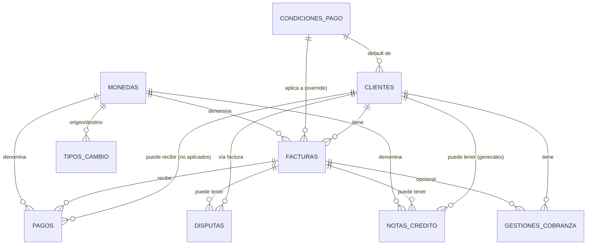

# Paso 4 — Diseñar el modelo de datos compatible

**Fecha:** 2026-08-10
**Estado:** entregable documental completo, pendiente de revisión humana
**Base:** formaliza y amplía `borrador-modelo-datos.md` (Paso 2, preparatorio), incorporando la Decisión A (entidad `gestiones_cobranza`) y las entidades de moneda/tipo de cambio/condiciones de pago pedidas por el plan maestro y por este encargo.

## ⚠️ Naturaleza de este entregable

Es un **modelo de datos documental** (diccionario + diagrama ER + reglas), no una base de datos implementada. No hay motor de base de datos elegido, no hay migraciones, no hay datos cargados. Los datos ficticios llegan en el Paso 5; la implementación real de cálculos (aging) llega en el Paso 6.

---

## 1. Entidades — diccionario de datos completo

<strong>1.1 Clientes</strong>

| Campo | Tipo | Obligatorio | Notas |
|---|---|---|---|
| `id_cliente` (PK) | UUID | Sí | Identificador técnico, no el nombre/RFC |
| `nombre_cliente` | texto | Sí | Razón social o nombre comercial |
| `identificacion_fiscal` | texto | No | RFC/NIT/RUC/EIN según país — ejemplo, no catálogo cerrado |
| `email_contacto` | texto | No | |
| `telefono_contacto` | texto | No | |
| `direccion` | texto | No | |
| `condiciones_pago_default_id` (FK) | referencia | No | Apunta a `condiciones_pago`; puede sobreescribirse por factura |
| `centro_costo` | texto | No | Campo recomendado del plan maestro |
| `estado_cliente` | enum: `activo`/`inactivo` | Sí | |
| `fecha_creacion` | fecha/hora | Sí | |

**Clave única:** `id_cliente`. **Regla de unicidad de negocio:** `identificacion_fiscal` debería ser único cuando esté presente (evita duplicar el mismo cliente con dos registros) — ver sección 6, verificación.

<strong>1.2 Facturas</strong>

| Campo | Tipo | Obligatorio | Notas |
|---|---|---|---|
| `id_factura` (PK) | UUID | Sí | |
| `id_cliente` (FK → Clientes) | UUID | Sí | |
| `numero_factura` | texto | Sí | Folio visible al usuario, distinto del PK técnico |
| `fecha_emision` | fecha | Sí | |
| `fecha_vencimiento` | fecha | Sí | Requerida para aging (Paso 6) — si falta, la factura se excluye del aging y se reporta (regla M6, Paso 3) |
| `monto_original` | decimal(18,2) | Sí | |
| `moneda_id` (FK → Monedas) | referencia | Sí | |
| `saldo_pendiente` | decimal(18,2) | **Derivado** | Ver sección 3 — no se ingresa a mano, se calcula |
| `condiciones_pago_id` (FK → condiciones_pago) | referencia | No | Hereda de cliente si no se especifica |
| `estado_factura` | enum: `abierta`/`pagada`/`anulada`/`disputada` | Sí | Campo mínimo obligatorio del plan maestro |
| `centro_costo` | texto | No | |
| `notas` | texto | No | |

**Clave única:** `id_factura`. **Regla de unicidad de negocio:** `(id_cliente, numero_factura)` debe ser único — evita cargar la misma factura dos veces desde distintos CSV (ver verificación, sección 6).

<strong>1.3 Pagos</strong>

| Campo | Tipo | Obligatorio | Notas |
|---|---|---|---|
| `id_pago` (PK) | UUID | Sí | |
| `id_factura` (FK → Facturas, nullable) | UUID | No | Nullable para soportar pagos no aplicados/anticipos |
| `id_cliente` (FK → Clientes) | UUID | Sí | Referencia directa, útil si el pago no está aplicado |
| `fecha_pago` | fecha | Sí | Campo mínimo obligatorio del plan maestro |
| `monto_pago` | decimal(18,2) | Sí | |
| `moneda_id` (FK → Monedas) | referencia | Sí | |
| `metodo_pago` | texto | No | Ejemplo, no catálogo cerrado |
| `estado_aplicacion` | enum: `aplicado`/`no_aplicado`/`parcial` | Sí | |
| `referencia_pago` | texto | No | Número de transacción/comprobante — candidato a regla de duplicados |

**Clave única:** `id_pago`. **Relación clave del plan maestro (pregunta crítica):** **Factura 1:N Pagos** — una factura puede tener varios pagos parciales; cada pago aplicado pertenece a una sola factura, cada factura puede acumular N pagos hasta saldar su monto.

<strong>1.4 Notas de crédito</strong>

| Campo | Tipo | Obligatorio | Notas |
|---|---|---|---|
| `id_nota_credito` (PK) | UUID | Sí | |
| `id_factura` (FK → Facturas, nullable) | UUID | No | Nullable si la nota es general al cliente |
| `id_cliente` (FK → Clientes) | UUID | Sí | |
| `fecha_emision` | fecha | Sí | |
| `monto_nota_credito` | decimal(18,2) | Sí | |
| `moneda_id` (FK → Monedas) | referencia | Sí | |
| `motivo` | texto | No | Ejemplo: devolución, descuento, ajuste |
| `estado_nota_credito` | enum: `aplicada`/`pendiente`/`anulada` | Sí | |

**Clave única:** `id_nota_credito`. **Regla de negocio explícita (Fase 3 del plan maestro):** una nota de crédito aplicada **resta** de `saldo_pendiente`, nunca debe sumarse ni tratarse como si aumentara la cartera — ver sección 3 y Paso 6.

<strong>1.5 Disputas</strong>

| Campo | Tipo | Obligatorio | Notas |
|---|---|---|---|
| `id_disputa` (PK) | UUID | Sí | |
| `id_factura` (FK → Facturas) | UUID | Sí | |
| `id_cliente` (FK → Clientes) | UUID | Sí | Redundante pero útil para consultas rápidas |
| `fecha_apertura` | fecha | Sí | |
| `fecha_resolucion` | fecha, nullable | No | |
| `motivo_disputa` | texto | No | |
| `monto_disputado` | decimal(18,2) | Sí | |
| `estado_disputa` | enum: `abierta`/`en_revision`/`resuelta`/`rechazada` | Sí | |
| `resolucion` | texto | No | |

**Clave única:** `id_disputa`. **Regla pendiente de definir (ya señalada como riesgo en el borrador Paso 2):** si `estado_factura = disputada` es excluyente de `abierta`, y cómo se sincroniza con `estado_disputa` — queda como pendiente explícito (sección 8), no resuelto en este documento.

<strong>1.6 Condiciones de pago</strong>

| Campo | Tipo | Obligatorio | Notas |
|---|---|---|---|
| `id_condicion_pago` (PK) | UUID | Sí | |
| `nombre` | texto | Sí | Ej. "Net 30", "Net 45", "Contado" (ejemplo, no catálogo cerrado) |
| `dias_credito` | entero | Sí | |
| `descripcion` | texto | No | |

**Clave única:** `id_condicion_pago`. Catálogo de referencia, usado por Clientes y opcionalmente sobreescrito por Facturas.

<strong>1.7 Monedas</strong>

| Campo | Tipo | Obligatorio | Notas |
|---|---|---|---|
| `codigo_moneda` (PK) | texto (ISO 4217, ej. USD/MXN/EUR) | Sí | |
| `nombre_moneda` | texto | Sí | |
| `simbolo` | texto | No | |

**Clave única:** `codigo_moneda`. Catálogo de referencia.

<strong>1.8 Tipos de cambio</strong>

| Campo | Tipo | Obligatorio | Notas |
|---|---|---|---|
| `id_tipo_cambio` (PK) | UUID | Sí | |
| `moneda_origen` (FK → Monedas) | texto | Sí | |
| `moneda_destino` (FK → Monedas) | texto | Sí | Normalmente la moneda de consolidación del reporte |
| `fecha` | fecha | Sí | Tipo de cambio vigente en esa fecha |
| `tasa` | decimal(18,6) | Sí | |

**Clave única:** `(moneda_origen, moneda_destino, fecha)`. **Uso:** consolidar montos multi-moneda al momento de calcular KPIs agregados (M1) en una sola moneda de reporte — sin esto, sumar `monto_original` de facturas en USD y MXN directamente sería incorrecto.

<strong>1.9 Gestiones de cobranza (nueva — Decisión A)</strong>

Entidad agregada por decisión explícita del usuario para que M5 (Seguimiento de cobros) entre en el prototipo inicial. **No existía en el diccionario de datos original del plan maestro** — es una ampliación de alcance documentada aquí.

| Campo | Tipo | Obligatorio | Notas |
|---|---|---|---|
| `id_gestion` (PK) | UUID | Sí | |
| `id_cliente` (FK → Clientes) | UUID | Sí | Toda gestión pertenece a un cliente |
| `id_factura` (FK → Facturas, nullable) | UUID | No | Opcional — una gestión puede ser sobre el cliente en general, no siempre sobre una factura específica |
| `responsable` | texto | Sí | Quién ejecutó la gestión (nombre/usuario — sin datos reales en esta etapa, ver sección 5) |
| `fecha_hora` | fecha/hora | Sí | Cuándo se registró la gestión |
| `tipo_gestion` | enum: `llamada`/`email`/`carta`/`visita`/`escalamiento_legal`/`otro` | Sí | Catálogo ejemplo, ampliable |
| `resultado` | texto | No | Qué pasó en la gestión (ej. "promesa de pago", "sin respuesta") |
| `proxima_accion` | texto | No | Puede derivarse de la cascada de reglas de M5 (`mapa-modulos-funcionales.md` §5) o registrarse manualmente |
| `fecha_proxima_accion` | fecha | No | |
| `sla_estado` | enum: `en_plazo`/`vencido`/`cumplido`/`no_aplica` | Sí | Estado del SLA de seguimiento |
| `notas` | texto | No | |
| `creado_por` | texto | Sí | Auditoría básica: quién creó el registro |
| `fecha_creacion` | fecha/hora | Sí | Auditoría básica |
| `modificado_por` | texto | No | Auditoría básica: última modificación |
| `fecha_modificacion` | fecha/hora, nullable | No | Auditoría básica |

**Clave única:** `id_gestion`. **Relaciones:** Cliente 1:N Gestiones; Factura 1:N Gestiones (opcional). **Auditoría:** los 4 campos finales (`creado_por`, `fecha_creacion`, `modificado_por`, `fecha_modificacion`) cubren el mínimo pedido ("auditoría básica") — no incluyen versionado histórico completo de cambios campo por campo, que quedaría como ampliación futura si se requiere trazabilidad más fina.

---

## 2. Diagrama entidad-relación

*(Diagrama propio, generado para este documento — no reproduce ningún esquema de AR Cockpit ni shadcn-admin, ninguno de los cuales define modelo de datos relacional.)*

---

## 2.1 Enmienda — Sincronización `estado_factura` ↔ `estado_disputa`

**Motivo:** el riesgo #1 de este documento (sección 9, versión anterior) quedaba sin resolver. El usuario aprobó el Paso 4 de forma condicionada a cerrar este punto antes de iniciar el Paso 5. Esta sección reemplaza ese pendiente con una regla explícita.

### Principio rector

`estado_disputa` (en la entidad Disputas) es la **fuente de verdad** del ciclo de vida de cada disputa individual. `estado_factura = disputada` es un **resumen operativo derivado** — no se edita a mano, se recalcula a partir del estado de las disputas asociadas a esa factura. **`disputada` es excluyente de `abierta`**: una factura nunca tiene ambos valores a la vez.

### Estados de disputa considerados "activos"

Una disputa se considera **activa** cuando `estado_disputa` está en `abierta` o `en_revision`. Se considera **cerrada** cuando está en `resuelta` o `rechazada`.

### Disparadores (triggers) de recálculo de `estado_factura`

| Evento | Efecto sobre `estado_factura` |
|---|---|
| Se crea una disputa nueva sobre una factura con `estado_factura = abierta` | `estado_factura` pasa a `disputada` |
| Se crea una disputa nueva sobre una factura con `estado_factura = pagada` o `anulada` | **No cambia** `estado_factura` — una disputa sobre una factura ya liquidada/anulada es un caso excepcional que debe registrarse en `motivo_disputa` pero no reabre el ciclo de cobro normal (ver Riesgo nuevo, sección 9) |
| Una disputa activa pasa a `resuelta` o `rechazada` | Se reevalúa si **quedan otras disputas activas** sobre la misma factura (ver "múltiples disputas" abajo) |
| No quedan disputas activas sobre la factura tras cerrar la última | `estado_factura` se recalcula **según saldo y vencimiento**: si `saldo_pendiente = 0` → `pagada`; si `saldo_pendiente > 0` y `fecha_vencimiento` ya pasó respecto a la fecha de corte → `abierta` (y entra al bucket de aging correspondiente en M2); si `saldo_pendiente > 0` y no ha vencido → `abierta` (bucket "actual") |

### Manejo de múltiples disputas sobre una misma factura

Una factura puede tener **N disputas** a lo largo del tiempo (relación Factura 1:N Disputas ya definida en la sección 1.5). Mientras **al menos una** disputa asociada esté en estado activo (`abierta` o `en_revision`), `estado_factura` permanece en `disputada`. Solo al cerrarse **la última** disputa activa (todas las disputas de esa factura quedan en `resuelta` o `rechazada`) se dispara el recálculo descrito arriba. Esto evita que cerrar una disputa parcial reabra prematuramente el cobro normal mientras otra sigue activa.

### Disputa sobre una factura ya liquidada (`pagada` o `anulada`) — resolución definitiva

**Decisión: se PERMITE, no se bloquea.** Justificación: en cobranza real, una disputa puede surgir después del pago (ej. el cliente paga y luego reclama un error de facturación, un cobro duplicado, o un cargo indebido) — bloquear el registro de esa disputa impediría documentar un reclamo legítimo del cliente, que es exactamente el tipo de evento que un dashboard de CxC debe poder registrar.

**Reglas explícitas que acotan el permiso:**

1. La disputa se crea normalmente en la entidad Disputas (`id_disputa`, `id_factura`, `estado_disputa = abierta`, etc.) — su ciclo de vida (`abierta` → `en_revision` → `resuelta`/`rechazada`) es **independiente** del de la factura.
2. **`estado_factura` NO cambia.** Una factura `pagada` o `anulada` permanece exactamente así — el disparador de la tabla de arriba ("crear disputa nueva sobre factura pagada/anulada") ya establece esto, y aquí se confirma como regla definitiva, no como caso abierto.
3. **`saldo_pendiente` NO se recalcula ni se reabre.** Esta disputa no puede, por sí sola, crear saldo pendiente en una factura que ya llegó a 0 ni modificar el estado financiero histórico de esa factura. El campo `saldo_pendiente` de una factura `pagada` permanece en `0.00` durante todo el ciclo de esta disputa, sin excepción.
4. Si la disputa se resuelve a favor del cliente (ej. corresponde un reembolso o crédito), el mecanismo para reflejarlo **no es** reabrir la factura original — es generar un **registro nuevo** (una nota de crédito o un proceso de reembolso, según corresponda) referenciando la factura original vía `id_factura`. Ese registro nuevo es el que, si aplica, afecta saldos — nunca una mutación retroactiva del historial de la factura ya liquidada.
5. Estas disputas quedan **fuera del alcance del aging** (Paso 6): no vencen, no generan bucket, porque no representan saldo por cobrar — son un reclamo administrativo sobre un hecho ya cerrado.

**Consecuencia para reportes:** como ya señalaba el riesgo #2 de este documento, cualquier reporte de "disputas activas" debe consultar la entidad Disputas directamente (no filtrar solo por `estado_factura = disputada`), porque este tipo de disputa nunca marca la factura como `disputada`.

### Reglas para pagos, notas de crédito y gestiones durante una disputa activa

| Entidad | Regla durante disputa activa |
|---|---|
| **Pagos** | Se permite registrar un pago sobre una factura `disputada` (el cliente puede pagar la parte no disputada), pero el pago se aplica normalmente contra `saldo_pendiente` — no se bloquea el registro, solo se documenta que el monto disputado (`monto_disputado` en Disputas) puede no coincidir con el saldo restante tras el pago. Esto es una decisión de diseño explícita, no una regla contable definitiva — **pendiente de validar con Finanzas** si algún negocio prefiere bloquear pagos parciales durante disputa. |
| **Notas de crédito** | Se permite emitir una nota de crédito durante una disputa (frecuentemente es la forma en que se resuelve) — al aplicarse, resta de `saldo_pendiente` igual que en el flujo normal (regla ya definida en sección 4). |
| **Gestiones de cobranza** (`gestiones_cobranza`) | Durante una disputa activa, la cascada de reglas de M5 (`mapa-modulos-funcionales.md` §5) prioriza `proxima_accion = "resolver disputa"` por sobre cualquier otra acción de cobro — esta regla ya estaba definida conceptualmente en el Paso 3 (M5) y aquí se confirma que aplica también a nivel de dato: una gestión registrada durante disputa activa debe poder marcar `tipo_gestion` relacionado a la disputa (ej. "escalamiento_legal" solo si la disputa lleva mucho tiempo sin resolverse, umbral pendiente de Finanzas). |

### Trazabilidad conservada

Ningún recálculo de `estado_factura` borra ni sobreescribe el historial de Disputas: cada fila de Disputas permanece con su `estado_disputa` final (`resuelta`/`rechazada`) y sus fechas de apertura/resolución intactas. El campo `estado_factura` es siempre un valor derivado y recalculable a partir de las Disputas asociadas + saldo + vencimiento — nunca la única fuente de esa información. Esto permite auditar en cualquier momento por qué una factura pasó a `disputada` y por qué salió de ese estado, consultando la tabla Disputas completa, no solo el valor actual de `estado_factura`.

---

## 3. Datos base vs. derivados vs. simulados

Esta distinción es la que pediste explícitamente y es clave para no confundir capas:

| Categoría | Qué incluye | Ejemplo |
|---|---|---|
| **Datos base** | Se cargan directamente (vía CSV en el prototipo, M6) y no se calculan | `monto_original`, `fecha_emision`, `fecha_vencimiento`, `monto_pago`, `fecha_pago`, `monto_nota_credito`, todos los campos de `gestiones_cobranza` |
| **Datos derivados** | Se calculan a partir de datos base, con una fórmula (algunas ya definidas por el plan maestro, otras pendientes de Finanzas) | `saldo_pendiente` (= `monto_original` − suma de pagos aplicados − suma de notas de crédito aplicadas), bucket de aging (Paso 6), score de priorización de M3 (pendiente fórmula) |
| **Datos simulados** | No existen como dato real todavía; se generan sintéticamente solo para poder mostrar el módulo en el prototipo — **deben quedar visualmente marcados como ficticios en la UI**, nunca presentarse como resultado real | Serie histórica de cobro para M4 (Forecast) — por Decisión B, M4 se incluye **solo** como simulación; **todo** su supuesto, fórmula, serie histórica y resultado debe etiquetarse "ficticio / pendiente de validación con Finanzas" |

**Regla explícita para M4 (Decisión B del usuario):** ningún campo de Forecast se trata como dato base ni como derivado confiable — todo lo que alimenta M4 es simulado por diseño en esta etapa, y así debe quedar rotulado en cualquier pantalla, documento o export que lo muestre.

---

## 4. Restricciones e integridad

| Regla | Entidades afectadas |
|---|---|
| `saldo_pendiente` nunca puede ser negativo | Facturas (validación al aplicar pago o nota de crédito) |
| Suma de pagos aplicados a una factura no puede superar `monto_original` (salvo casos de sobrepago documentado explícitamente como excepción, no cubiertos aquí) | Facturas ↔ Pagos |
| Una nota de crédito aplicada resta de `saldo_pendiente`, nunca lo incrementa | Facturas ↔ Notas de crédito |
| `estado_factura = anulada` no debe tener pagos nuevos aplicados después de la anulación | Facturas ↔ Pagos |
| `(id_cliente, numero_factura)` único — evita duplicar la misma factura | Facturas |
| `identificacion_fiscal` único cuando está presente — evita duplicar cliente | Clientes |
| `id_factura` en Gestiones de cobranza, si está presente, debe pertenecer al mismo `id_cliente` de la gestión | Gestiones de cobranza ↔ Facturas ↔ Clientes |
| Toda fecha de vencimiento faltante excluye la factura del cálculo de aging (no se inventa fecha) | Facturas — regla heredada de M6, Paso 3 |

---

## 5. Cómo M1–M6 consumen el modelo

| Módulo (Paso 3) | Entidades que consume | Campos clave |
|---|---|---|
| M1 — Resumen de cartera | Facturas, Monedas, Tipos de cambio | `saldo_pendiente` (derivado), `moneda_id` consolidado vía `tipos_cambio` |
| M2 — Aging | Facturas | `fecha_vencimiento`, `saldo_pendiente`, fecha de corte (parámetro de UI, no de la entidad) |
| M3 — Clientes prioritarios | Facturas, Clientes, Disputas | `saldo_pendiente`, `estado_disputa` (para despriorizar — `estado_factura = disputada` excluye de cobro normal, ver sección 2.1), score derivado (pendiente fórmula) |
| M4 — Forecast | Facturas (base de cartera) + **serie histórica simulada** (no persistida como entidad real, generada ad-hoc en el Paso 5 como dataset ficticio aparte) | Todo marcado ficticio por Decisión B |
| M5 — Seguimiento de cobros | **Gestiones_cobranza**, Clientes, Facturas | Todos los campos de la entidad nueva (sección 1.9) |
| M6 — Carga y calidad de datos | Facturas, Pagos, Notas de crédito (destino de la carga), Clientes | Valida `(id_cliente, numero_factura)` único, reporta filas sin `fecha_vencimiento` |

---

## 6. Verificación documental ejecutada

Consistencia con Paso 3 (trazabilidad)

Se verificó que las entidades definidas aquí cubren exactamente lo que cada módulo del Paso 3 necesita como "Datos" en su especificación (sección "Separación de capas" de cada módulo en `paso-3-modulos-propios.md`). En particular: M5 requería una entidad de "interacciones/gestiones" señalada como faltante en el Paso 3 (riesgo #1) — queda resuelta aquí con `gestiones_cobranza` (sección 1.9), cerrando esa brecha documentada.

Consistencia entre ER, diccionario y reglas M1–M6 (verificación explícita pedida por el usuario)

Se revisó que el diagrama ER (sección 2) no contradice el diccionario (sección 1): todas las relaciones dibujadas en el ER tienen su FK correspondiente listada en la tabla de la entidad "muchos" (ej. `FACTURAS ||--o{ DISPUTAS` en el ER corresponde a `id_factura (FK → Facturas)` en la tabla de Disputas, sección 1.5). Se verificó que la nueva sección 2.1 (sincronización factura↔disputa) no introduce ningún campo nuevo no declarado en el diccionario — usa exclusivamente `estado_factura`, `estado_disputa`, `saldo_pendiente` y `fecha_vencimiento`, todos ya definidos en las secciones 1.2 y 1.5. Se verificó que la tabla de la sección 5 (cómo M1-M6 consumen el modelo) es consistente con las reglas de la sección 2.1 (ver ajuste en M3 arriba).

Validación de claves y relaciones

Cada entidad tiene una clave primaria única explícita (sección 1). Se verificó la relación 1:N crítica exigida por el plan maestro (Factura 1:N Pagos) — confirmada: `id_factura` es FK nullable en Pagos, permitiendo múltiples pagos por factura y pagos no aplicados sin factura. Se verificó que ninguna relación quede ambigua (cada FK indica de qué entidad a cuál apunta y su cardinalidad, sección 2).

Ausencia de datos reales

Revisión del documento completo: todos los valores de ejemplo (nombres de campo, catálogos de `tipo_gestion`, `metodo_pago`, etc.) son genéricos/ilustrativos. No hay nombres de cliente, montos, fechas ni identificadores fiscales reales. `responsable` y `creado_por` en `gestiones_cobranza` son campos de esquema (tipo de dato), no contienen ningún valor de ejemplo con nombre real.

Ausencia de código o esquema copiado

Ni AR Cockpit ni shadcn-admin definen un modelo de datos relacional (AR Cockpit genera datos sintéticos en memoria con JS; shadcn-admin es solo capa visual) — por lo tanto no existe ningún esquema de referencia que pudiera copiarse. Este modelo es diseño propio derivado del diccionario de campos del plan maestro (Fase 2) y de las necesidades de M1–M6 (Paso 3).

---

## 7. Decisiones tomadas en este paso

1. Se agregó `gestiones_cobranza` con los campos mínimos pedidos explícitamente (id, cliente_id, documento_id opcional, responsable, fecha_hora, tipo de gestión, resultado, próxima acción, fecha próxima acción, SLA/estado, notas, auditoría básica) — Decisión A del usuario.
2. Se agregaron `condiciones_pago`, `monedas` y `tipos_cambio` como entidades de catálogo/soporte, requeridas por el plan maestro (Fase 2, campos recomendados) pero ausentes del borrador preparatorio del Paso 2.
3. Se clasificó explícitamente cada dato como base/derivado/simulado (sección 3), con foco especial en marcar TODO lo de Forecast (M4) como simulado, por Decisión B del usuario.
4. `saldo_pendiente` se define como campo derivado (no se ingresa a mano), resolviendo la ambigüedad que el borrador del Paso 2 había dejado abierta ("calculado o mantenido").

## 8. Supuestos

- Se asume que el prototipo inicial opera con posible multi-moneda (de ahí `monedas`/`tipos_cambio`), aunque el Paso 5 (datos ficticios) podría simplificar a una sola moneda para el primer set de prueba — a definir en ese paso.
- Se asume que `gestiones_cobranza` no requiere versionado histórico campo por campo en esta fase (solo últimos valores + quién/cuándo modificó por última vez) — si se requiere auditoría más granular, es una ampliación futura.
- Se asume que el "documento_id opcional" pedido para `gestiones_cobranza` corresponde a `id_factura`, ya que "documento" en el contexto de CxC de este proyecto se refiere a la factura (no hay otro tipo de documento definido en el plan maestro).

## 9. Riesgos

1. ~~Pendiente sin resolver: sincronización `estado_factura`/`estado_disputa`~~ — **RESUELTO** en sección 2.1 de esta actualización: `estado_disputa` es fuente de verdad, `estado_factura = disputada` es resumen derivado y excluyente de `abierta`.
2. ~~Disputa sobre factura ya liquidada~~ — **RESUELTO**: se permite (no se bloquea), con las 5 reglas explícitas de la subsección "Disputa sobre una factura ya liquidada" (sección 2.1): no reabre saldo, no cambia `estado_factura`, cualquier reembolso se instrumenta como registro nuevo (nota de crédito), y queda fuera del alcance del aging. Reportes de disputas deben consultar la entidad Disputas directamente, no solo `estado_factura = disputada`.
3. El modelo asume que toda gestión de cobranza es responsabilidad de una sola persona (`responsable` como texto simple) — si el proceso real requiere gestión en equipo o reasignación con historial, el modelo necesitaría ampliarse.
4. No se han definido índices ni el motor de base de datos — esto es intencional en esta etapa documental, pero es un pendiente técnico real antes de implementar.
5. La regla "suma de pagos no puede superar monto_original" no contempla sobrepagos, que ocurren en la práctica real de cobranza (crédito a favor del cliente) — quedó señalado como excepción no cubierta.
6. El umbral de días para que una gestión de cobranza escale a `tipo_gestion = escalamiento_legal` durante una disputa prolongada (sección 2.1) queda **pendiente de validación con Finanzas** — no se fija un número aquí.

## 10. Fuentes consultadas

- `plan-maestro-dashboard-cxc.md`, Fase 2 (diccionario de datos) y Paso 4
- `borrador-modelo-datos.md` (Paso 2, base de este documento)
- `paso-3-modulos-propios.md` (para la sección 5, cómo M1-M6 consumen el modelo, y para resolver el riesgo de M5 señalado ahí)
- Instrucciones explícitas del usuario (Decisión A y B de este mensaje)

## 11. Bloqueos

Ninguno que impida cerrar este entregable documental.

## 12. Pendientes

- Decidir motor de base de datos e índices cuando se pase a implementación real.
- Confirmar en el Paso 5 si el dataset ficticio inicial usa una sola moneda o multi-moneda.
- Validar con Finanzas el umbral de escalamiento a legal durante disputas prolongadas (riesgo #6).

## 13. Criterio para considerar el Paso 4 cerrado

- [x] Entidades, campos, tipos, claves, relaciones y restricciones definidos (secciones 1 y 4).
- [x] `gestiones_cobranza` incluida con los campos mínimos pedidos.
- [x] Distinción explícita entre datos base, derivados y simulados (sección 3).
- [x] Diagrama ER (sección 2) y diccionario de datos (sección 1) completos.
- [x] Documentado cómo M1–M6 consumen el modelo (sección 5).
- [x] Verificación documental ejecutada: consistencia, claves, relaciones, ausencia de datos reales, trazabilidad con Paso 3 (sección 6).
- [x] Sincronización `estado_factura` ↔ `estado_disputa` resuelta (sección 2.1).
- [x] Sin `git add`, commit ni push.
- [x] **Aprobado condicionalmente por el usuario — condición cumplida con esta actualización.**
