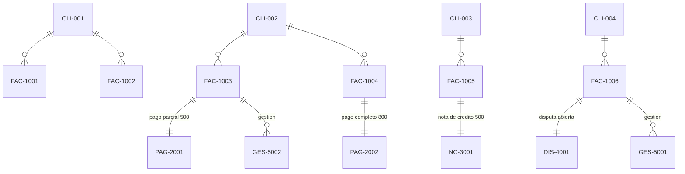

# Paso 5 — Reemplazar los datos demo por datos ficticios controlados

**Fecha:** 2026-08-10
**Estado:** entregable documental completo, pendiente de revisión humana
**Fecha de corte usada para todos los cálculos de este documento:** `2026-08-10`

## ⚠️ Advertencia de identificación de datos ficticios

**Todos los datos de este documento son 100% sintéticos.** Ningún nombre de cliente, monto, fecha, identificador fiscal ni número de factura corresponde a una empresa o persona real. Todos los nombres de cliente incluyen literalmente la palabra "Ficticio" para que sea imposible confundirlos con datos reales en cualquier export, pantalla o log. No se usó información de ninguna empresa real como base ni inspiración de montos o fechas — los valores fueron elegidos manualmente para cubrir los 8 casos pedidos con totales verificables a mano.

---

## 1. Decisión de alcance para este dataset

- **Una sola moneda (USD)** para el primer set de prueba — resuelve el pendiente dejado abierto en `paso-4-modelo-datos.md` (sección 12). Multi-moneda queda para una iteración posterior si se requiere.
- **4 clientes, 6 facturas, 2 pagos, 1 nota de crédito, 1 disputa, 2 gestiones de cobranza** — el mínimo necesario para cubrir los 8 casos pedidos sin inflar el dataset innecesariamente.
- Todas las entidades usan los campos definidos en `paso-4-modelo-datos.md`; ningún campo nuevo se introduce aquí.

---

## 2. Datos base (CSV sintético)

### 2.1 `clientes.csv`

```csv
id_cliente,nombre_cliente,identificacion_fiscal,estado_cliente,condiciones_pago_default_id,fecha_creacion
CLI-001,Comercializadora Ficticia Alfa,FICT-RFC-001,activo,CP-01,2026-01-10
CLI-002,Distribuidora Ficticia Beta,FICT-RFC-002,activo,CP-01,2026-01-15
CLI-003,Servicios Ficticios Gamma,FICT-RFC-003,activo,CP-01,2026-02-01
CLI-004,Grupo Ficticio Delta,FICT-RFC-004,activo,CP-01,2026-02-05
```

### 2.2 `condiciones_pago.csv`

```csv
id_condicion_pago,nombre,dias_credito
CP-01,Net 30 (ficticio),30
```

### 2.3 `monedas.csv`

```csv
codigo_moneda,nombre_moneda,simbolo
USD,Dólar estadounidense (ejemplo),$
```

### 2.4 `facturas.csv`

```csv
id_factura,id_cliente,numero_factura,fecha_emision,fecha_vencimiento,monto_original,moneda_id,estado_factura
FAC-1001,CLI-001,DEMO-1001,2026-07-01,2026-09-01,1000.00,USD,abierta
FAC-1002,CLI-001,DEMO-1002,2026-05-01,2026-06-01,2000.00,USD,abierta
FAC-1003,CLI-002,DEMO-1003,2026-06-01,2026-07-01,1500.00,USD,abierta
FAC-1004,CLI-002,DEMO-1004,2026-04-01,2026-05-01,800.00,USD,abierta
FAC-1005,CLI-003,DEMO-1005,2026-07-15,2026-08-15,3000.00,USD,abierta
FAC-1006,CLI-004,DEMO-1006,2026-06-10,2026-07-10,1200.00,USD,disputada
```

*(`estado_factura` de FAC-1004 se muestra aquí como "abierta" porque este CSV representa el dato **antes** de aplicar el pago — el estado final "pagada" es el resultado esperado tras el recálculo, ver sección 4.)*

### 2.5 `pagos.csv`

```csv
id_pago,id_factura,id_cliente,fecha_pago,monto_pago,moneda_id,estado_aplicacion,referencia_pago
PAG-2001,FAC-1003,CLI-002,2026-07-20,500.00,USD,parcial,DEMO-REF-2001
PAG-2002,FAC-1004,CLI-002,2026-05-20,800.00,USD,aplicado,DEMO-REF-2002
```

### 2.6 `notas_credito.csv`

```csv
id_nota_credito,id_factura,id_cliente,fecha_emision,monto_nota_credito,moneda_id,motivo,estado_nota_credito
NC-3001,FAC-1005,CLI-003,2026-07-20,500.00,USD,Ajuste comercial ficticio,aplicada
```

### 2.7 `disputas.csv`

```csv
id_disputa,id_factura,id_cliente,fecha_apertura,fecha_resolucion,motivo_disputa,monto_disputado,estado_disputa
DIS-4001,FAC-1006,CLI-004,2026-07-15,,Discrepancia de precio ficticia,1200.00,abierta
```

### 2.8 `gestiones_cobranza.csv`

```csv
id_gestion,id_cliente,id_factura,responsable,fecha_hora,tipo_gestion,resultado,proxima_accion,fecha_proxima_accion,sla_estado,creado_por,fecha_creacion
GES-5001,CLI-004,FAC-1006,Agente Ficticio 1,2026-07-16 09:00,llamada,Cliente reporta discrepancia de precio (dato ficticio),resolver disputa,2026-07-25,en_plazo,sistema_demo,2026-07-16 09:00
GES-5002,CLI-002,FAC-1003,Agente Ficticio 2,2026-07-22 10:30,email,Cliente promete pago parcial (dato ficticio),seguimiento promesa de pago,2026-08-05,en_plazo,sistema_demo,2026-07-22 10:30
```

---

## 3. Descripción de cada uno de los 8 casos mínimos pedidos

| # | Caso pedido | Cubierto por | Descripción |
|---|---|---|---|
| 1 | Factura vigente | `FAC-1001` | Vence 2026-09-01, después de la fecha de corte (2026-08-10) — no vencida |
| 2 | Factura vencida | `FAC-1002` | Venció 2026-06-01, 70 días antes de la fecha de corte, sin pagos |
| 3 | Pago parcial | `FAC-1003` + `PAG-2001` | Monto original 1500, pago de 500 aplicado, saldo pendiente 1000 |
| 4 | Factura pagada | `FAC-1004` + `PAG-2002` | Monto original 800, pago de 800 aplicado (completo), saldo pendiente 0 |
| 5 | Nota de crédito | `FAC-1005` + `NC-3001` | Monto original 3000, nota de crédito de 500 aplicada, saldo pendiente 2500 |
| 6 | Factura disputada | `FAC-1006` + `DIS-4001` | Disputa abierta por 1200 (el monto completo de la factura) |
| 7 | Cliente con varias facturas | `CLI-001` | Tiene `FAC-1001` y `FAC-1002` — dos facturas independientes |
| 8 | Cliente con historial de atraso | `CLI-002` | `FAC-1004` se pagó 19 días después de su vencimiento (vencía 2026-05-01, se pagó 2026-05-20) y `FAC-1003` está actualmente vencida — dos señales de atraso para el mismo cliente |

---

## 4. Resultado esperado por caso (cálculo manual reproducible)

Fórmula de aging usada (definida por el plan maestro, Fase 3): `Días de atraso = Fecha de corte − Fecha de vencimiento`, fecha de corte = `2026-08-10`.

| Factura | `saldo_pendiente` esperado | Días de atraso (si aplica) | Bucket de aging esperado | `estado_factura` esperado |
|---|---|---|---|---|
| FAC-1001 | 1000.00 (1000 − 0 − 0) | vence en el futuro → 0 (o negativo, no vencida) | **actual** | abierta |
| FAC-1002 | 2000.00 (2000 − 0 − 0) | 2026-08-10 − 2026-06-01 = **70 días** | **61-90** | abierta |
| FAC-1003 | 1000.00 (1500 − 500 − 0) | 2026-08-10 − 2026-07-01 = **40 días** | **31-60** | abierta |
| FAC-1004 | **0.00** (800 − 800 − 0) | no aplica (saldo 0, se excluye del aging) | no aplica | **pagada** (recalculado tras el pago, ver sección 2.4) |
| FAC-1005 | 2500.00 (3000 − 0 − 500) | vence en el futuro → no vencida | **actual** | abierta |
| FAC-1006 | 1200.00 (1200 − 0 − 0) | 2026-08-10 − 2026-07-10 = **31 días** | **31-60** (ver nota) | **disputada** (por disputa `DIS-4001` activa, regla sección 2.1 de `paso-4-modelo-datos.md`) |

**Nota sobre FAC-1006:** cae técnicamente en el bucket 31-60 por fecha, pero al estar `disputada` el Paso 3 (M3) establece que se **despriorice** en el worklist de cobro normal en vez de tratarse como una cuenta a perseguir — el bucket de aging y el estado operativo son dos cosas distintas y coexisten (esto es exactamente el comportamiento que la sección 2.1 del Paso 4 fue diseñada para soportar).

---

## 5. Totales de control (calculados manualmente, para verificar cualquier implementación futura)

### 5.1 Fórmula de conciliación y alcance de esta validación

**Fórmula exacta:** `saldo_pendiente_total = importe_facturado_total − pagos_aplicados_total − notas_de_crédito_aplicadas_total`

Esa cifra **debe coincidir** con la suma de los 5 buckets de aging (actual + 1-30 + 31-60 + 61-90 + 90+), porque el aging es simplemente una forma distinta de agrupar el mismo saldo pendiente total, no una fuente de verdad independiente. Ambos cálculos parten de los mismos `saldo_pendiente` por factura (sección 4) — la fórmula global los suma sin agrupar, la vista de aging los agrupa por bucket.

**Alcance explícito de esta validación:** aplica **únicamente** a este dataset ficticio (`paso-5-datos-ficticios.md`), que es **monomoneda (USD)** por decisión declarada en la sección 1. Esta conciliación de $7,700.00 **no es una prueba general de la fórmula para datos reales ni para escenarios multi-moneda** — con múltiples monedas, la suma directa de `saldo_pendiente` requeriría antes consolidar vía `tipos_cambio` (definido en `paso-4-modelo-datos.md`, sección 1.8, aún no ejercitado por ningún dataset). Repetir esta misma verificación con un dataset multi-moneda es un pendiente futuro (ver sección 15).

### 5.2 Totales

| Métrica | Valor esperado | Cálculo |
|---|---|---|
| Suma de `monto_original` (las 6 facturas) | **9,500.00** | 1000+2000+1500+800+3000+1200 |
| Suma de `saldo_pendiente` (las 6 facturas) | **7,700.00** | 1000+2000+1000+0+2500+1200 |
| Cartera abierta (saldo > 0, excluye FAC-1004) | **7,700.00** | mismo total, porque FAC-1004 ya está en 0 |
| Bucket "actual" | **3,500.00** | FAC-1001 (1000) + FAC-1005 (2500) |
| Bucket "1-30" | **0.00** | ninguna factura cae en este rango |
| Bucket "31-60" | **2,200.00** | FAC-1003 (1000) + FAC-1006 (1200) |
| Bucket "61-90" | **2,000.00** | FAC-1002 (2000) |
| Bucket "90+" | **0.00** | ninguna factura cae en este rango |
| **Suma de los 5 buckets** | **7,700.00** | debe coincidir exactamente con "Cartera abierta" — **coincide** ✅ |
| Total pagado (suma `monto_pago`) | **1,300.00** | 500 (PAG-2001) + 800 (PAG-2002) |
| Total notas de crédito aplicadas | **500.00** | NC-3001 |
| Verificación cruzada: `monto_original` total − pagos − notas = saldo total | **9500 − 1300 − 500 = 7700** | coincide con la suma de `saldo_pendiente` — **coincide** ✅ |

---

## 6. Reglas para evitar duplicados (aplicadas a este dataset)

- Cada `id_*` (PK) es único dentro de su CSV — verificado por inspección directa (6 facturas, 6 IDs distintos; mismo patrón en las demás entidades).
- `(id_cliente, numero_factura)` es único en `facturas.csv` — verificado: los 6 pares son distintos (ningún cliente repite número de factura).
- `referencia_pago` es única en `pagos.csv` — verificado: `DEMO-REF-2001` y `DEMO-REF-2002` no se repiten.
- Regla general para datasets futuros más grandes (heredada de M6, `mapa-modulos-funcionales.md` §6): al cargar un CSV nuevo, cualquier fila con `(id_cliente, numero_factura)` ya existente debe reportarse como posible duplicado, no cargarse silenciosamente encima.

---

## 7. Validaciones de integridad ejecutadas sobre este dataset

<details>
<summary>Saldos pendientes reproducibles</summary>

Se recalculó a mano `saldo_pendiente` de cada factura como `monto_original − Σ pagos aplicados − Σ notas de crédito aplicadas` (regla de `paso-4-modelo-datos.md`, sección 4) y coincide exactamente con la tabla de la sección 4 de este documento. Ninguna factura tiene saldo negativo (regla de integridad de la sección 4 del Paso 4) — el mínimo es 0.00 (FAC-1004).

</details>

<details>
<summary>Pagos parciales reducen correctamente el saldo</summary>

FAC-1003: 1500.00 − 500.00 (pago parcial) = 1000.00 — verificado, coincide con `estado_aplicacion = parcial` en `pagos.csv`.

</details>

<details>
<summary>Notas de crédito no inflan la cartera</summary>

FAC-1005: 3000.00 − 500.00 (nota de crédito) = 2500.00 — la nota **resta**, nunca suma; verificado contra la regla explícita de la sección 4 del Paso 4 ("una nota de crédito aplicada resta de saldo_pendiente, nunca lo incrementa"). Si se hubiera sumado por error, el saldo habría sido 3500.00 en vez de 2500.00 — se descartó esa lectura incorrecta explícitamente en esta verificación.

</details>

<details>
<summary>Estados coherentes</summary>

- FAC-1004 pasa de `abierta` (estado inicial en el CSV) a `pagada` (estado esperado tras aplicar el pago completo) — coherente con la regla de recálculo de la sección 2.1 del Paso 4 ("si saldo_pendiente = 0 → pagada").
- FAC-1006 es `disputada` porque tiene una disputa `abierta` asociada (`DIS-4001`) — coherente con la regla "estado_disputa es la fuente de verdad" de la sección 2.1 del Paso 4.
- Ninguna factura tiene `estado_factura = disputada` y `estado_factura = abierta` simultáneamente (son mutuamente excluyentes por diseño de un solo campo enum) — verificado por inspección directa del CSV.

</details>

<details>
<summary>Los 8 casos cubren comportamientos distintos</summary>

Verificado en la tabla de la sección 3 — cada uno de los 8 casos pedidos ejercita una combinación distinta de reglas (vigente = sin atraso; vencida = atraso sin pago; pago parcial = resta parcial; pagada = resta completa + recálculo de estado; nota de crédito = resta sin ser pago; disputada = estado derivado de otra entidad; cliente con varias facturas = relación 1:N Cliente→Factura; historial de atraso = combinación de una factura vencida + un pago histórico tardío).

</details>

<details>
<summary>Los totales documentados coinciden con el CSV</summary>

Se recorrió cada fila de `facturas.csv`, `pagos.csv` y `notas_credito.csv` sumando manualmente los montos y comparando contra la tabla de totales de control (sección 5) — las 3 verificaciones cruzadas de esa sección coinciden exactamente (7,700.00 en los tres cálculos independientes: suma directa de saldos, suma de buckets, y fórmula global monto−pagos−notas).

</details>

---

## 8. Relación entre facturas, pagos y notas de crédito (instancia concreta de este dataset)



*(Diagrama de instancia, no de esquema — muestra las filas concretas de este dataset ficticio, no la estructura general ya definida en `paso-4-modelo-datos.md`.)*

---

## 9. Advertencias sobre lo que NO puede concluirse con estos datos sintéticos

1. **No demuestra que las fórmulas de aging/scoring sean correctas para el negocio real** — solo demuestra que la aritmética definida en el Paso 4 es internamente consistente y reproducible a mano. La validación real de fórmulas sigue pendiente de Finanzas (Fase 3 del plan maestro, aún no alcanzada).
2. **No es representativo de volumen ni de distribución real de cartera** — 6 facturas no dicen nada sobre cómo se comporta el aging con miles de facturas reales, ni sobre qué proporción de cartera real cae en cada bucket.
3. **No valida multi-moneda** — se usó una sola moneda a propósito (sección 1); el manejo de `tipos_cambio` sigue sin probarse.
4. **No valida el escalamiento de gestiones a legal** — las 2 gestiones de `gestiones_cobranza.csv` no llegan al umbral de escalamiento (que además sigue sin definirse, riesgo #6 del Paso 4).
5. **No sustituye la prueba histórica con datos anonimizados** — esa es la Fase 4 (Paso 9) del plan maestro, que requiere datos reales de la empresa (anonimizados) y está fuera del alcance de esta etapa por regla 8 del encargo.
6. **El caso de sobrepago no está cubierto** (riesgo #5 del Paso 4, sigue abierto) — este dataset no incluye ningún pago que supere el monto original de una factura.

---

## 10. Decisiones

1. Se usó una sola moneda (USD) para simplificar la primera verificación, dejando explícito que multi-moneda queda para después.
2. Se incluyeron 2 gestiones de cobranza (no solo las mínimas necesarias para M5) para poder probar tanto el caso de disputa activa como el de seguimiento de promesa de pago, dado que M5 ahora entra en el prototipo inicial (Decisión A).
3. Todos los identificadores usan el prefijo `DEMO-` o `FICT-` según corresponda, y todos los nombres de cliente incluyen la palabra "Ficticio" — refuerzo adicional (más allá de vivir en un archivo separado) para que sea imposible confundir estos datos con datos reales en cualquier contexto donde se muestren sueltos.

## 11. Supuestos

- Se asume que la fecha de corte para todos los cálculos de este documento es `2026-08-10` (fecha de hoy); una fecha de corte distinta cambiaría los buckets de aging de FAC-1002, FAC-1003 y FAC-1006, aunque no los saldos.
- Se asume que "historial de atraso" (caso 8) se demuestra con una factura pagada tarde + una factura actualmente vencida del mismo cliente, no con un campo dedicado de "score de atraso" (que no existe como campo base, sería derivado — fuera de alcance de este paso).

## 12. Riesgos

1. Este dataset es deliberadamente pequeño (6 facturas) para que la verificación manual sea posible — no debe usarse como base de pruebas de performance ni de volumen.
2. El caso de disputa (FAC-1006) ejercita la regla nueva de sincronización del Paso 4 (sección 2.1), pero no prueba el caso de "múltiples disputas sobre la misma factura" ni el de "disputa sobre factura ya pagada" — ambos casos están documentados conceptualmente en el Paso 4 pero no tienen ejemplo de datos aquí. Si se requiere, se puede ampliar el dataset.

## 13. Fuentes consultadas

- `paso-4-modelo-datos.md` (incluida la enmienda de sincronización factura↔disputa, sección 2.1)
- `paso-3-modulos-propios.md` (para confirmar qué módulos consumen qué datos)
- Instrucción del plan maestro, Paso 5 (los 8 casos mínimos pedidos)

## 14. Bloqueos

Ninguno.

## 15. Pendientes

- Si se desea, ampliar el dataset con un caso de "múltiples disputas sobre una factura" y otro de "disputa sobre factura ya pagada" para ejercitar esas dos ramas de la regla del Paso 4 (sección 2.1) que este dataset no cubre todavía.
- Ampliar a multi-moneda cuando se decida probar esa parte del modelo.

## 16. Criterio para considerar el Paso 5 cerrado

- [x] CSV sintético para las 5 entidades relevantes + gestiones de cobranza.
- [x] Descripción de cada uno de los 8 casos mínimos.
- [x] Resultado esperado por caso, calculado a mano.
- [x] Totales de control con 3 verificaciones cruzadas coincidentes.
- [x] Reglas para evitar duplicados aplicadas y verificadas.
- [x] Identificación de datos ficticios (prefijos + nombres explícitos).
- [x] Validaciones de integridad ejecutadas (6 verificaciones documentadas, sección 7).
- [x] Relación entre facturas, pagos y notas de crédito (diagrama de instancia, sección 8).
- [x] Advertencias explícitas sobre qué NO puede concluirse con estos datos (sección 9).
- [x] Sin `git add`, commit ni push.
- [ ] **Falta: tu aprobación explícita para avanzar al Paso 6.**
