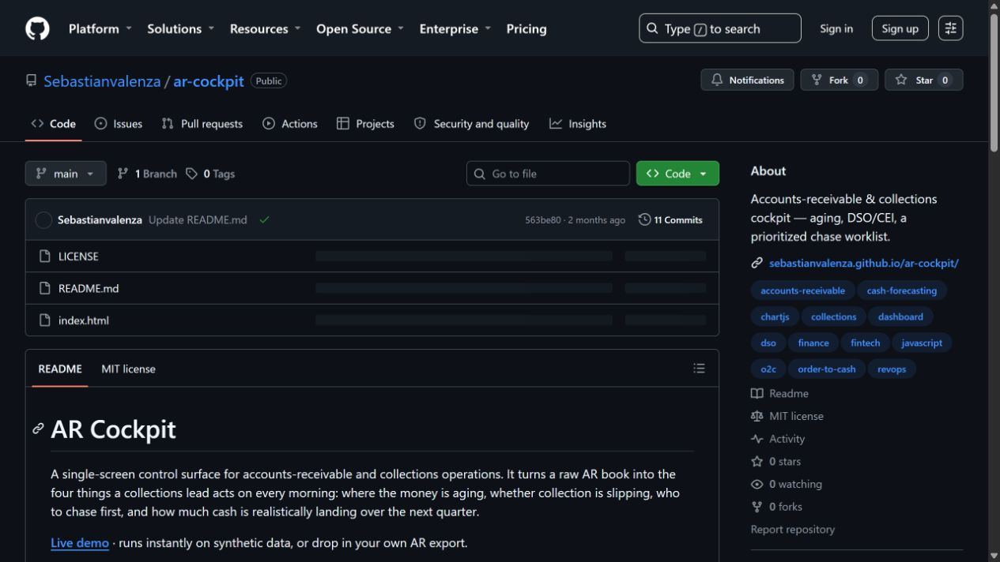
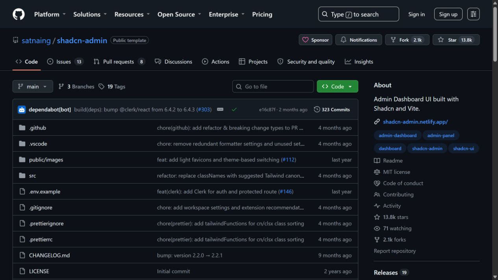

# Proyecto: Dashboard de Cuentas por Cobrar

## Plan maestro de investigación, diseño y ejecución

> Objetivo: construir primero un prototipo funcional de CxC con datos ficticios, usando referencias existentes del mercado, y preparar una adaptación segura a los datos reales de la empresa.

<strong>1. Principio de trabajo y distribución de responsabilidades</strong>

### ChatGPT — planificación maestra

- Investiga estándares y referencias de la industria.
- Define el alcance y las fases.
- Revisa la lógica financiera.
- Identifica riesgos, supuestos y preguntas para Finanzas.
- Valida que cada decisión tenga una referencia o justificación.

### Claude — ejecución operativa

- Implementa tareas concretas.
- Genera y modifica código.
- Construye componentes, consultas y pruebas.
- Ejecuta instrucciones definidas en el plan maestro.

### GitHub — memoria y control del proyecto

- Conserva decisiones y referencias.
- Documenta cambios.
- Almacena código, capturas, datos ficticios y criterios de aceptación.
- Permite revisar el trabajo antes de conectarlo a datos reales.

### Principio

La automatización debe partir de una referencia funcional o de mercado, adaptarse al contexto de la empresa y documentar cada supuesto antes de ejecutarse.

<strong>2. Referencia funcional: AR Cockpit</strong>

**Repositorio:** [AR Cockpit](https://github.com/Sebastianvalenza/ar-cockpit)

### Qué queremos estudiar

- Aging de cartera: actual, 1–30, 31–60, 61–90 y 90+.
- Priorización de clientes.
- Score de prioridad.
- Acciones de seguimiento.
- Forecast optimista, base y pesimista.
- Indicadores como DSO y CEI.
- Carga de datos y filtros.

### Qué no debemos copiar sin validar

- KPIs fijados manualmente.
- DSO calculado con aproximaciones.
- Forecast basado en supuestos artificiales.
- Scores de riesgo sin historial real.
- Fechas generadas automáticamente cuando faltan datos.
- Datos sintéticos tratados como si fueran resultados financieros reales.

### Conclusión

AR Cockpit sirve como referencia de experiencia y estructura de CxC, pero la lógica financiera debe reconstruirse, documentarse y validarse con Finanzas.

<strong>3. Referencia visual: shadcn-admin</strong>

**Repositorio:** [shadcn-admin](https://github.com/satnaing/shadcn-admin)

### Qué queremos estudiar

- Jerarquía visual de dashboards.
- Navegación lateral.
- Tarjetas KPI.
- Tablas con filtros.
- Estados vacíos, carga y error.
- Diseño responsive.
- Componentes reutilizables.

### Regla de uso

La referencia visual no define las fórmulas financieras. Solo sirve para construir una interfaz clara, consistente y fácil de operar.

### Resultado esperado

Un dashboard con apariencia profesional, pero con datos, cálculos y estados claramente separados de la capa visual.

<strong>4. Fase 1 — Definir el alcance del prototipo</strong>

### Entregables

- Dashboard con datos ficticios.
- KPIs iniciales.
- Aging de facturas.
- Tabla priorizada de clientes.
- Filtros por cliente, estado, fecha y vencimiento.
- Forecast claramente marcado como simulado.

### Sin riesgo

Esta fase no utiliza datos reales, no modifica contabilidad y sirve para validar diseño, navegación y flujo de trabajo.

<strong>5. Fase 2 — Diccionario y compatibilidad de datos</strong>

### Campos mínimos

| Campo | Uso |
|---|---|
| Cliente | Agrupar cartera |
| ID de factura | Evitar duplicados |
| Fecha de emisión | Medir antigüedad |
| Fecha de vencimiento | Calcular atraso |
| Monto original | Medir exposición |
| Saldo pendiente | Calcular CxC real |
| Pagos aplicados | Reducir saldo |
| Fecha de pago | Medir comportamiento |
| Moneda | Consolidar correctamente |
| Estado de factura | Separar abierta, pagada, anulada o disputada |

### Campos recomendados

Notas de crédito, pagos no aplicados, condiciones de pago, estado de disputa y centro de costo.

### Pregunta crítica

Cada fila debe representar una factura, un pago o un cliente claramente identificado. Si una factura puede tener varios pagos, el modelo debe permitir una relación de uno a muchos.

<strong>6. Fase 3 — Validar los KPIs y fórmulas</strong>

### Aging

`Días de atraso = Fecha de corte − Fecha de vencimiento`

Clasificación: actual, 1–30, 31–60, 61–90 y 90+.

### DSO

Debe definirse con Finanzas, por ejemplo:

`DSO = CxC promedio / ventas a crédito del período × días del período`

### CEI

Debe calcularse con saldo inicial, ventas a crédito, saldo final y cartera corriente según la política de la empresa.

### Riesgo

Debe considerar historial de pagos, atrasos, pagos parciales, disputas, crédito aprobado, saldo pendiente e incumplimientos.

### Regla de validación

Para cada KPI: resultado del dashboard = resultado calculado manualmente = resultado aprobado por Finanzas.

<strong>7. Fase 4 — Prueba histórica con datos anonimizados</strong>

### Proceso

1. Recibir entre 3 y 12 meses de datos anonimizados.
2. Cargar los datos sin modificar el archivo original.
3. Comparar dashboard contra Excel o ERP actual.
4. Revisar diferencias de saldo, aging y pagos.
5. Documentar cada transformación.
6. Corregir y repetir la conciliación.

### Sin riesgo

La prueba debe ejecutarse en un entorno separado, con acceso limitado y datos anonimizados. No se debe conectar el sistema a producción en esta fase.

<strong>8. Fase 5 — Piloto operativo</strong>

### Duración sugerida

30 días con el equipo de CxC.

### Métricas

- Tiempo ahorrado en reportes.
- Clientes contactados.
- Monto recuperado.
- Disminución de cartera vencida.
- Precisión del forecast.
- Facilidad de uso.
- Diferencias contra el sistema oficial.

<strong>9. Riesgos y controles</strong>

| Riesgo | Control |
|---|---|
| Saldos incorrectos | Conciliación contra ERP |
| Pagos parciales mal aplicados | Modelo separado de facturas y pagos |
| Notas de crédito ignoradas | Campo y regla documentados |
| DSO artificial | Fórmula aprobada por Finanzas |
| Forecast exagerado | Supuestos visibles y escenarios limitados |
| Datos incompletos | Semáforo de calidad de datos |
| Acceso indebido | Entorno aislado y permisos mínimos |

<strong>10. Criterios de aceptación</strong>

El prototipo puede avanzar a piloto solo cuando:

- Los saldos coinciden con la fuente oficial.
- Las fórmulas fueron aprobadas.
- No se generan fechas aleatorias.
- Los pagos parciales se manejan correctamente.
- Las notas de crédito no inflan la cartera.
- El forecast documenta sus supuestos.
- Los datos ficticios están claramente identificados.
- El equipo financiero entiende y acepta los resultados.

<strong>11. Referencias de industria</strong>

- [APQC — Measuring Order-to-Cash](https://www.apqc.org/resource-library/resource-listing/measuring-order-cash)
- [Microsoft — Star schema guidance](https://learn.microsoft.com/en-us/power-bi/guidance/star-schema)
- [Oracle — Accounts Receivable Aging](https://docs.oracle.com/en/industries/hospitality/opera-cloud/21.4/ocsuh/c_accounts_receivable_accounts_receivable_aging.htm)
- [SAP — Days Sales Outstanding](https://help.sap.com/docs/SAP_S4HANA_CLOUD/918bca53037f408f91a2295d04ac16bc/a9453358fde89244e10000000a4450e5.html)
- [IFRS Foundation — IFRS 9](https://www.ifrs.org/content/dam/ifrs/publications/html-standards/english/2024/issued/ifrs9.html)

## Veredicto inicial

El proyecto es viable como prototipo y puede convertirse en una herramienta empresarial, pero solo después de reconstruir y validar la lógica financiera con datos anonimizados. AR Cockpit aporta la referencia funcional; shadcn-admin aporta la referencia visual; ChatGPT organiza la planificación; Claude ejecuta las tareas operativas; GitHub conserva la memoria y las decisiones del sistema.
