# REGISTRO DE ANÁLISIS — Adaptaciones de licencias EDGE / EDGEPRO

Este es el **registro único y acumulativo** de todos los análisis de resultados
generados del proyecto de adaptaciones de licencias EDGE/EDGEPRO: auditorías,
mediciones, casos de éxito y post-mortems de cada variante y cada vista.

> **Las imágenes van EMBEBIDAS en este archivo, no solo enlazadas.**
> Cada entrada muestra la ilustración de referencia, el resultado
> generado, el molde real y las comparativas directamente acá, para
> poder leer el análisis y ver la evidencia sin abrir otra pestaña.
> Al agregar una entrada nueva, usá siempre `` y no una
> ruta suelta entre backticks.

## Regla de uso (no negociable)

- **Cada análisis nuevo se APENDA acá abajo**, al final, como una entrada más.
- **Nunca se crea un archivo suelto nuevo** para un análisis. Si hay evidencia
  visual (crops, comparativas, resultados), va a `kratos-dakota/resultados/` o
  `kratos-dakota/resultados/crops/` y se enlaza desde la entrada.
- Cada entrada se escribe con la **plantilla** de más abajo, sin sacarle campos.
  Si un campo no aplica, se pone "—", no se borra.
- Las lecciones nuevas se copian además a **LECCIONES ACUMULADAS** (al final del
  archivo), sin duplicar las que ya están.
- Marco metodológico de referencia: [`00-anatomia-adaptacion.md`](00-anatomia-adaptacion.md)
  (las 6 capas de toda adaptación, fallos conocidos a blindar, restricción de IP).

### Qué NO es un análisis (y por eso vive en otro lado)

La regla de arriba prohíbe crear archivos sueltos **para un análisis**. No
prohíbe registrar el **estado actual** de una variante, que es otra cosa:

| | Este REGISTRO | Fichas en [`fichas/`](fichas/) |
|---|---|---|
| Qué contiene | qué **pasó** el día X | qué es **cierto hoy** |
| Orden | cronológico | por objeto (molde / variante) |
| Se escribe | se apenda, nunca se edita hacia atrás | se sobrescribe |

Un análisis nuevo sigue viniendo acá, siempre. La ficha correspondiente se
actualiza y **linkea** a la entrada, sin copiar el contenido. Los conflictos
ilustración-vs-molde no se repiten en cada variante: viven una sola vez en el
delta del molde+licencia. Ver [`fichas/README.md`](fichas/README.md).

---

## Índice

| # | Fecha | Variante y vista | Estado | Decisión |
|---|---|---|---|---|
| 01 | 2026-07-30 | Kratos Dakota 01 AZUL — Vista C (trasera) | ⚠️ aprobado con reservas | Regenerar con prompt v2 antes de material de licencia |
| 02 | 2026-07-30 | Kratos Dakota 04 ROJO/BLANCO/NEGRO — Vista C (trasera) | ⚠️ aprobado con reservas | Editar (repintado quirúrgico del spoiler) |
| 03 | 2026-07-30 | Kratos Dakota 02 GRIS/NEGRO — Vista B (lateral) | ❌ rechazado (tonos) | Editar (ajuste tonal global) antes de regenerar |
| 04 | 2026-07-30 | Kratos Dakota 05 CELESTE/MAGENTA — Vista B (lateral) v2 | ⚠️ aprobado con reservas | Editar (5 correcciones tonales) |
| 05 | 2026-07-30 | Kratos Dakota 05 CELESTE/MAGENTA — Vista B (lateral) v3 EDITADO | ✅ aprobado (reserva menor: visor) | Aceptar + retoque del visor |
| 06 | 2026-07-31 | Kratos Dakota 05 CELESTE/MAGENTA — Vista C (trasera) | ❌ rechazado (estilo + contradicción de prompt) | Regenerar con prompt v3 |
| 07 | 2026-07-31 | Kratos Dakota 05 CELESTE/MAGENTA — Vista C (trasera) v3 | ⚠️ aprobado con reservas (1 pieza) | Editar (spoiler: celeste → petróleo oscuro) |
| 08 | 2026-07-31 | Kratos Dakota 05 CELESTE/MAGENTA — Vista C (trasera) tras edición v4 | ❌ rechazado (colores del spoiler invertidos) | Regenerar con prompt v5 |

---

## PLANTILLA DE ENTRADA (copiar/pegar)

```markdown
## Entrada NN — <Variante> · <Vista>

**Fecha:** AAAA-MM-DD
**Variante y vista:** <licencia / número de variante / vista A-B-C>
**Estado:** ✅ aprobado · ⚠️ aprobado con reservas · ❌ rechazado

**Archivos de evidencia**

*Ilustración de referencia*


*Resultado generado*


*Molde real (autoridad de forma)*


*Comparativa / zoom del defecto*

**Tabla de verificación**

| # | Ítem verificado | Veredicto | Nota |
|---|---|---|---|
| 1 |  |  |  |

**Defectos encontrados**
1.

**Decisión:** editar / regenerar / aceptar — <por qué>

**Prompt usado:** <qué prompt lo produjo, o dónde está registrado>

**Lección nueva:** <o "ninguna">
```

---

# ENTRADAS

## Entrada 01 — Kratos Dakota 01 AZUL · Vista C (trasera)

**Fecha:** 2026-07-30
**Variante y vista:** EDGEPRO Kratos · Dakota 01 Azul/Rojo/Blanco · Vista C (trasera), primer resultado
**Estado:** ⚠️ aprobado con reservas
Auditor: pasada independiente de la que generó (Lecciones 6 y 12). Fuentes cotejadas:
resultado generado · foto real del Kratos trasera · ilustración Dakota azul trasera.
Usable para ficha técnica / e-commerce. No usable para material de licencia o campaña
comparada contra el arte aprobado sin regenerar.

**Archivos de evidencia**
- Ilustración: 

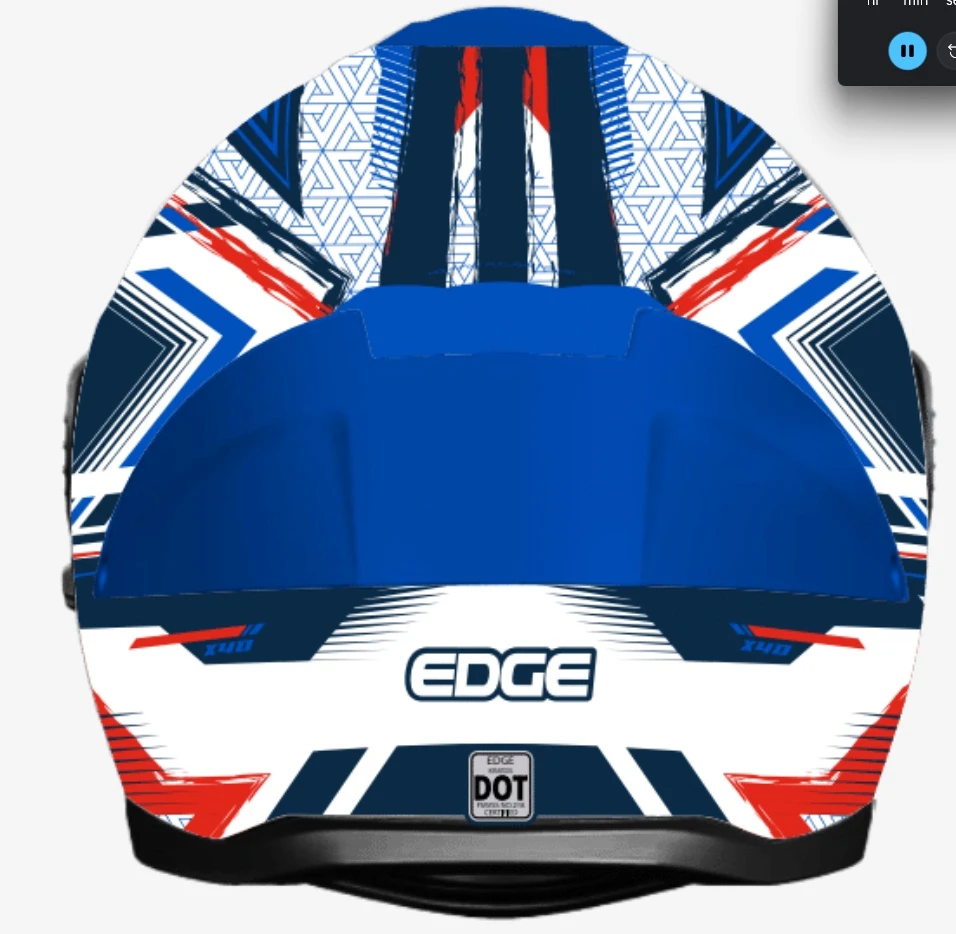

*01-azul-vista-c-ILUSTRACION.webp*

- Resultado: 

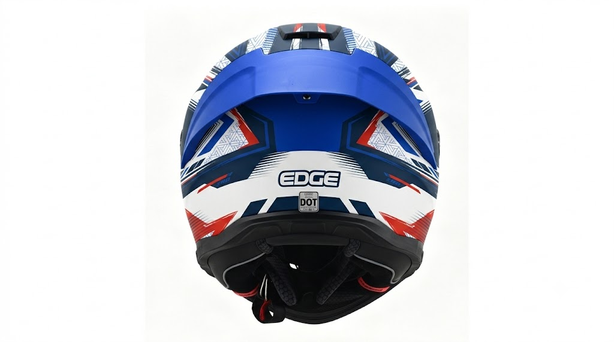

*01-azul-vista-c-RESULTADO.png*

- Checkpoint real: 

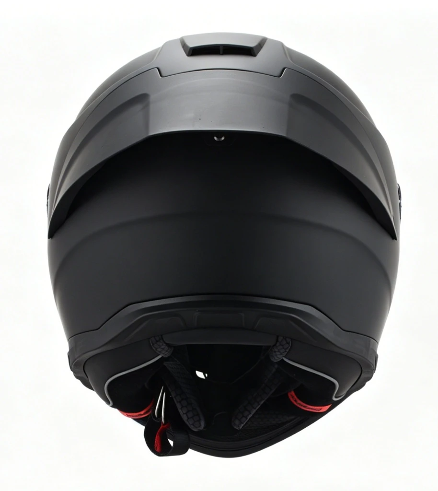

*00-kratos-real-trasera-CHECKPOINT.webp*

- Crops: 

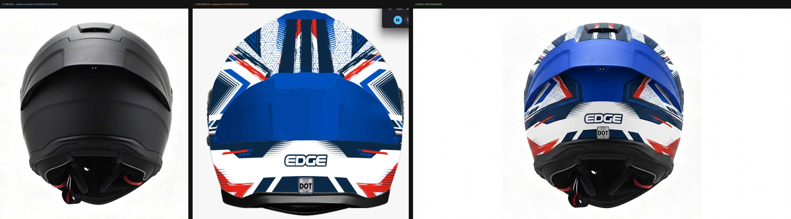

*TRIPTICO-azul.png*
,
  `crops/AZUL-z3a-extractor-ranuras.png`, `crops/AZUL-z4-cuello-ers.png`,
  `crops/AZUL-z5-6-banda-edge-x40.png`, `crops/AZUL-z6b-dot.png`,
  `crops/AZUL-z7-spoiler-mate.png`, `crops/ZOOM-azul-x40-faltantes.png`,
  `crops/ZOOM-dot-referencia-vs-resultado.png`,
  `crops/ZOOM-spoiler-referencia-vs-resultado.png`

**Tabla de verificación**

| # | Ítem verificado | Veredicto | Nota |
|---|---|---|---|
| 1 | Silueta real, no la del dibujo | ✅ | El riesgo crítico se resolvió: trasera ancha con hombros marcados, como la foto real. El bloque de conflicto declarado funcionó |
| 2 | Fotografía, no ilustración | ✅ | Luz de estudio, especulares, sombra propia, interior fotográfico |
| 3 | Extractor / 2 ranuras / tornillo / pieza ranurada baja | ⚠️ | Extractor y tornillo sí. Las dos ranuras chicas y la pieza ranurada baja quedaron absorbidas por el gráfico |
| 4 | Cuello, lengüetas rojas ERS, correa | ✅ | Lo mejor conservado del checkpoint real |
| 5 | Gráfico completo y simétrico | ⚠️ | Cobertura y simetría OK, pero densidad de detalle simplificada y marcas "X40" omitidas |
| 6 | Logo EDGE y sello DOT | ✅ | EDGE completo y bien escrito; DOT legible. No se repitieron los fallos de Padrino/Top Gun |
| 7 | Fondo, sombra, acabado mate | ⚠️ | Fondo y sombra OK. Acabado satinado/brillante en vez de mate |
| 8 | Coherencia de serie | ✅ provisorio | Se confirma con A y B generadas |

**Defectos encontrados**
1. Ranuras pequeñas y pieza ranurada baja comidas por el gráfico.
2. Densidad de detalle del gráfico simplificada respecto de la ilustración.
3. Marcas "X40" de los costados omitidas.
4. Acabado satinado en vez de mate absoluto.

Diagnóstico: los tres primeros desvíos tienen una raíz común — **el generador
"resume" cuando la superficie tiene mucha información**: baja densidad gráfica, se
come piezas chicas, omite textos pequeños. Aparte, interpretó "fotografía de
producto" como "producto lustroso", ignorando el mate declarado.

**Decisión:** regenerar con prompt v2 antes de cualquier uso de licencia. Correcciones
aplicadas a los 5 prompts de Vista C:
1. Bloque **PROHIBIDO SIMPLIFICAR EL GRÁFICO** (misma densidad de líneas, malla
   triangular completa, comparación zona por zona contra la ilustración).
2. Marcas pequeñas de texto de los costados declaradas obligatorias y nominales.
3. **ACABADO MATE ABSOLUTO** con criterio de rechazo explícito ("si refleja como un
   espejo, está mal").
4. Ranuras pequeñas y pieza ranurada baja **desagregadas en chequeos propios** (3b),
   fuera de la lista larga.

**Prompt usado:** prompt v1 de Vista C, ver [`kratos-dakota/01-azul-vista-c-trasera.md`](kratos-dakota/01-azul-vista-c-trasera.md).
Auditoría original: [`kratos-dakota/AUDITORIA-01-azul-vista-c.md`](kratos-dakota/AUDITORIA-01-azul-vista-c.md).

**Lección nueva:** el generador resume la información densa. Todo ítem chico
(ranura, tornillo, microtexto) necesita su propio bloque numerado; dentro de una
lista larga se pierde. Y "fotografía de producto" no implica mate: el mate se declara
aparte, con criterio de rechazo.

---

## Entrada 02 — Kratos Dakota 04 ROJO/BLANCO/NEGRO · Vista C (trasera)

**Fecha:** 2026-07-30
**Variante y vista:** EDGEPRO Kratos · Dakota 04 Rojo/Blanco/Negro · Vista C (trasera)
**Estado:** ⚠️ aprobado con reservas — 9 cumplen · 3 parciales · 1 falla · 2 a verificar con zoom

**Archivos de evidencia**
- Ilustración: 

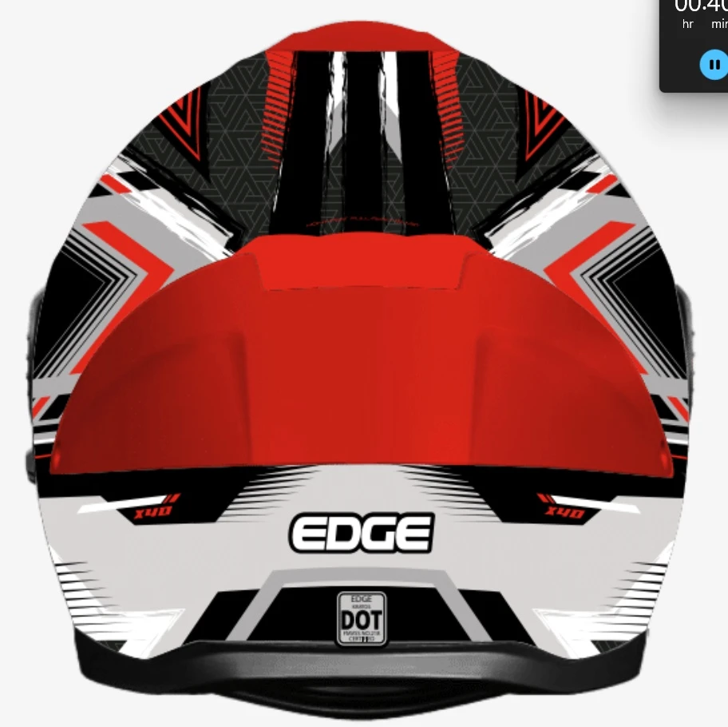

*04-rojo-blanco-vista-c-ILUSTRACION.webp*

- Resultado: 

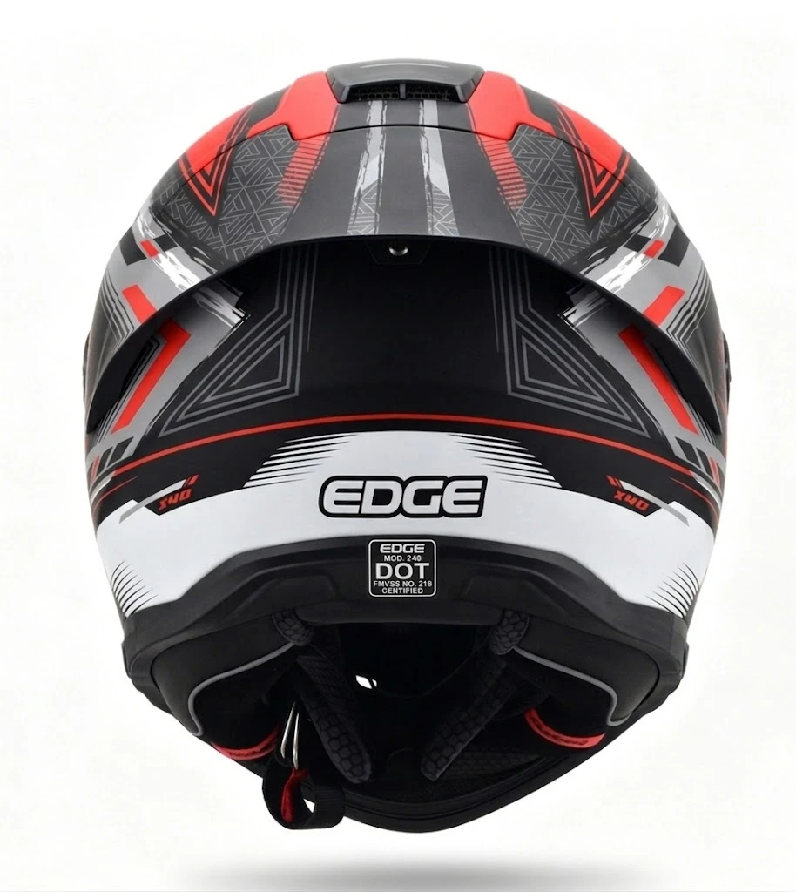

*04-rojo-blanco-vista-c-RESULTADO.webp*

- Intento de edición: 

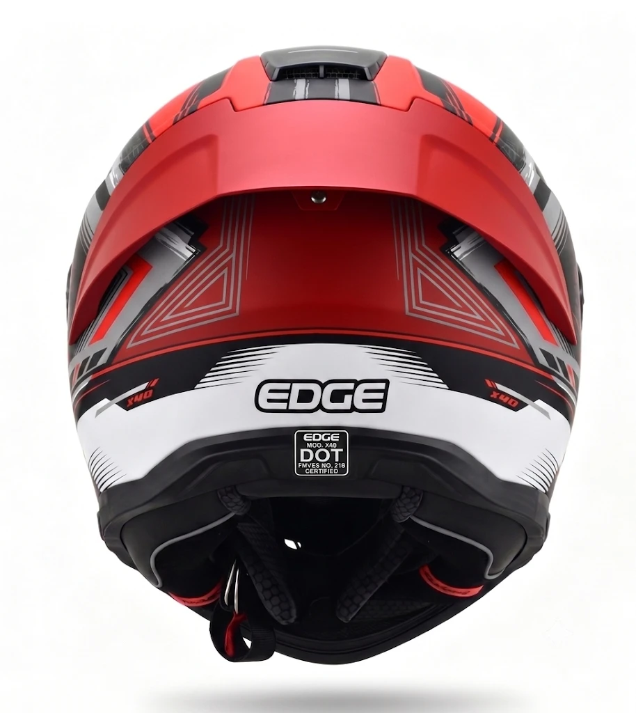

*04-rojo-blanco-vista-c-EDICION-intento1.webp*

- Crops: 

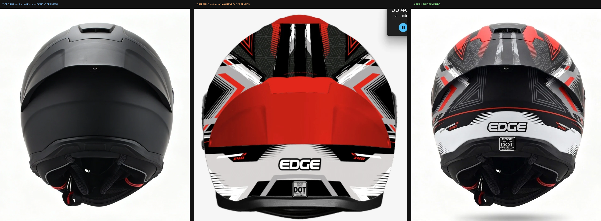

*TRIPTICO-rojo-blanco.png*
,
  `crops/ROJO-z3a-extractor-ranuras.png`, `crops/ROJO-z4-cuello-ers.png`,
  `crops/ROJO-z5c-banda-edge-x40.png`, `crops/ROJO-z5d-spoiler-NEGRO.png`,
  `crops/ROJO-z6b-dot-CENTIFIED.png`, `crops/ROJO-COMPARATIVA-spoiler.png`,
  `crops/EDICION-comparativa-derrame.png`, `crops/EDICION-dot-FMVES.png`

**Tabla de verificación**

| # | Ítem verificado | Veredicto | Nota |
|---|---|---|---|
| 1 | Silueta real, no la del dibujo | ✅ | |
| 2 | Fotografía, no ilustración | ✅ | |
| 3a | Extractor superior | ✅ | |
| 3b | Dos ranuras pequeñas | ⚠️ | Invadidas por el gráfico |
| 3c | Tornillo central | ✅ | Mejor que en la azul |
| 3d | Pieza ranurada trasera baja | ⚠️ | Resuelta como negro plano |
| 4 | Cuello, lengüetas ERS, correa | ✅ | Muy bien |
| 5a | Cobertura y simetría del gráfico | ✅ | |
| 5b | Densidad de detalle | ✅ | Mejoró mucho vs. la azul |
| 5c | Marcas "X40" | ✅ | Presentes (faltaban en la azul) |
| 5d | Color del spoiler | ❌ | Negro en vez de rojo — **culpa del prompt** |
| 6a | Logo EDGE | ⚠️ | Negro; en la ilustración se lee blanco con contorno |
| 6b | Sello DOT | ⚠️ | Posible "CENTIFIED" en vez de "CERTIFIED" — verificar con zoom |
| 7 | Acabado mate | ✅ | Corrigió solo el defecto de la azul |
| 8 | Coherencia de serie | ⏳ | Pendiente de A y B |

**Defectos encontrados**
1. **Spoiler negro en vez de rojo intenso.** Causa raíz: ERROR DEL PROMPT, no del
   generador. El prompt v1 asignaba NEGRO al panel central del spoiler; la ilustración
   lo muestra en ROJO INTENSO, que es la masa de color protagonista. El generador
   obedeció al pie de la letra. Error de transcripción del Agente 0.
2. Logo EDGE negro donde la ilustración lo lleva blanco con contorno oscuro (segundo
   posible error de transcripción, detectado en la misma pasada).
3. Sello DOT con microtipografía corrupta ("CENTIFIED").
4. Ranuras chicas invadidas y pieza ranurada baja aplanada a negro.

**Decisión:** **editar**, no regenerar. El resultado ganó en mate, densidad, X40 y
tornillo central respecto de la azul; tirarlo sería perder eso. Se aplica edición
quirúrgica sobre la foto final: repintar solo el panel del spoiler de negro a rojo,
conservando tornillo, bordes de pieza y el resto de la imagen intactos.

Corrección de raíz: los 3 prompts de la variante 04 ahora declaran spoiler ROJO y logo
EDGE BLANCO con contorno oscuro.

Pendiente de verificación con zoom (Lección 12):
1. Texto exacto del sello DOT ("CERTIFIED" vs. "CENTIFIED").
2. Color real del logo EDGE en la ilustración.
3. Revisar el color del spoiler declarado en las variantes 02, 03 y 05 contra sus
   ilustraciones, por el mismo tipo de error.

**Prompt usado:** prompt v1 de Vista C variante 04, ver
[`kratos-dakota/04-rojo-blanco-vista-c-trasera.md`](kratos-dakota/04-rojo-blanco-vista-c-trasera.md).
Prompt de edición entregado en el hilo de trabajo el 2026-07-30.
Auditoría original: [`kratos-dakota/AUDITORIA-01-azul-vista-c.md`](kratos-dakota/AUDITORIA-01-azul-vista-c.md) (sección "Auditoría 2").

**Lección nueva:** al transcribir una ilustración, verificar el color de **cada pieza
grande por separado** contra el dibujo — nunca inferirlo del "tema" de la variante. El
nombre ("rojo/blanco/negro") no dice qué pieza lleva qué color. Un error de
transcripción del Agente 0 se ve idéntico a un error del generador, pero se arregla en
otro lado.

---

## Entrada 03 — Kratos Dakota 02 GRIS/NEGRO MONOCROMO · Vista B (lateral)

**Fecha:** 2026-07-30
**Variante y vista:** EDGEPRO Kratos · Dakota 02 Gris/Negro monocromo · Vista B (lateral)
**Estado:** ❌ rechazado — FORMA ✅ / TONOS ❌. Diagnóstico: **COLAPSO DE CONTRASTE**
Método: histograma de luminancia sobre ilustración vs. resultado.

**Archivos de evidencia**
- Ilustración: 

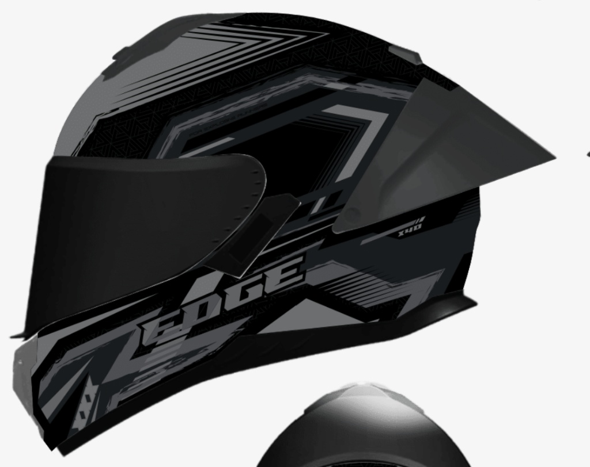

*02-gris-vista-b-ILUSTRACION.png*

- Resultado: 

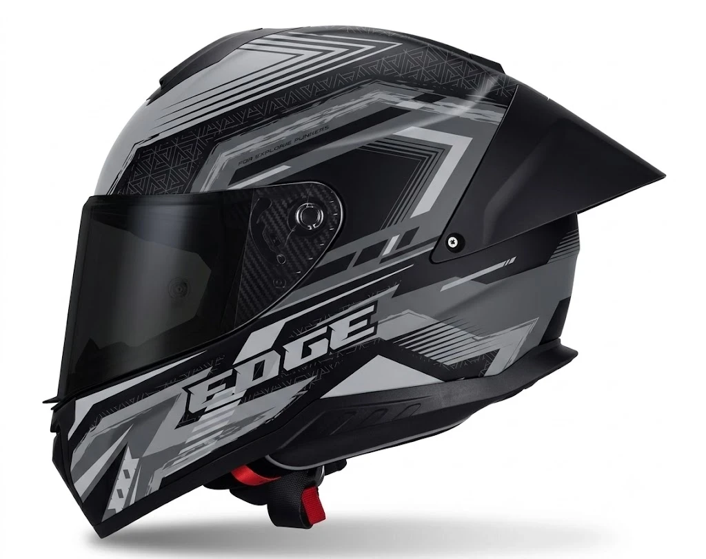

*02-gris-vista-b-RESULTADO.webp*

- Molde real lateral: 


*00-kratos-real-lateral.png*
,
  


*00-kratos-real-lateral-CHECKPOINT.webp*

- Crops: 

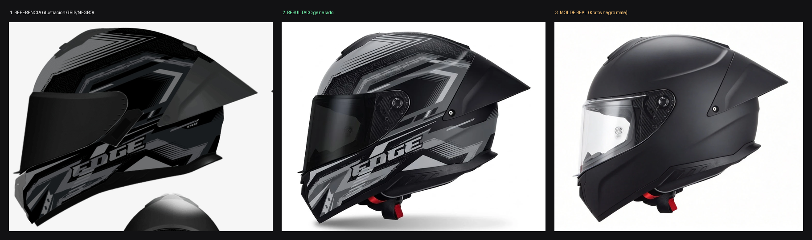

*GRIS-triptico.png*
,
  `crops/GRIS-z-calota.png`, `crops/GRIS-z-banda.png`, `crops/GRIS-z-zona.png`

**Tabla de verificación** (recuento de píxeles por nivel de luminancia)

| Nivel | Referencia | Resultado | Veredicto | Lectura |
|---|---|---|---|---|
| 0 (negro puro) | 40.226 | 13.442 | ❌ | El negro base se levantó a grafito: perdió 2/3 de su masa |
| 80–176 (grises medios) | ~14.400 | ~34.700 | ❌ | Todo se apelotonó en el medio |
| 240 (casi blanco) | 1.635 | 0 (tope en 224) | ❌ | El acento claro se apagó |
| — Forma / geometría / piezas | — | — | ✅ | La forma no es el problema |

La ilustración es **bimodal** (mucho negro + acentos casi blancos, poco en el medio).
El resultado es **unimodal**: una papilla de grises medios. Los 4 niveles declarados
colapsaron a ~2.

**Defectos encontrados**
1. Negro base levantado a gris grafito (calota alta y zona trasera).
2. Gris claro casi blanco de galones/filetes apagado a gris medio.
3. Gris grafito de fondo y gris medio de banda indistinguibles entre sí.
4. Contorno del logo EDGE perdió separación contra su banda.
5. Microtipografía "FOR EXPLORING RUNNERS" ilegible (va a post-producción).

**Decisión:** **editar** primero — ajuste tonal global, que es exactamente lo que el
generador sí ejecuta bien. Regenerar solo si la edición degrada el gráfico.

**Prompt usado:** prompt de Vista B variante 02, ver
[`kratos-dakota/02-gris-vista-b-lateral.md`](kratos-dakota/02-gris-vista-b-lateral.md).
Auditoría original: [`kratos-dakota/AUDITORIA-02-gris-vista-b.md`](kratos-dakota/AUDITORIA-02-gris-vista-b.md).

**Lección nueva:** en variantes monocromas el riesgo no es la forma, es el **colapso de
contraste**. Si no se declara una escala de tonos numerada con regla de conteo, el
generador apelotona todo en valores medios. Medirlo con histograma es más rápido y más
confiable que mirarlo.

---

## Entrada 04 — Kratos Dakota 05 CELESTE/MAGENTA · Vista B (lateral) — RESULTADO v2

**Fecha:** 2026-07-30
**Variante y vista:** EDGEPRO Kratos · Dakota 05 Celeste/Magenta/Blanco · Vista B (lateral), v2
**Estado:** ⚠️ aprobado con reservas — el mejor resultado del lote junto con rojo/gris V2.
Geometría, piezas y gráfico correctos. **No aparece la pieza extra bajo el visor.** Fallan 5 tonos.
Método: muestreo de píxel sobre ilustración vs. resultado.

**Archivos de evidencia**
- Ilustración: 


*05-celeste-magenta-vista-b-ILUSTRACION.webp*
,
  

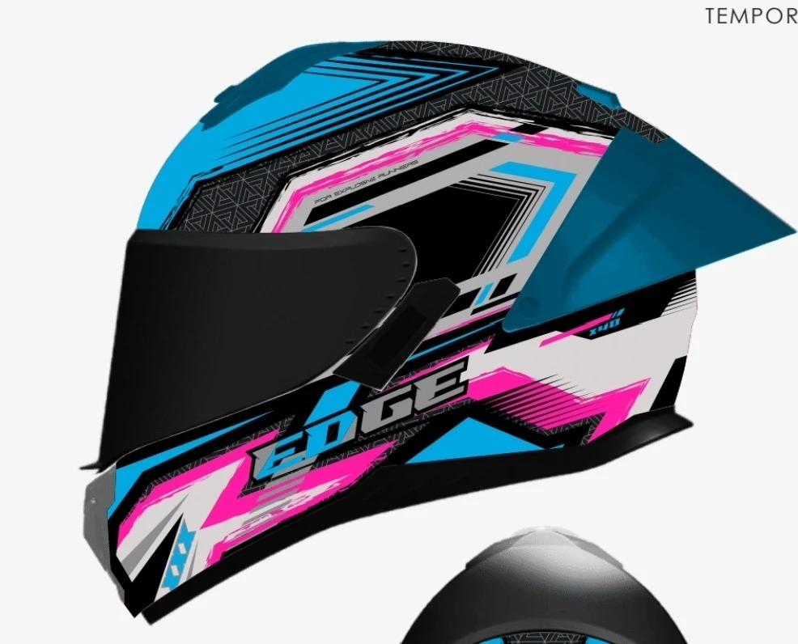

*05-cel-ref-ilustracion.webp*

- Resultado v1: 

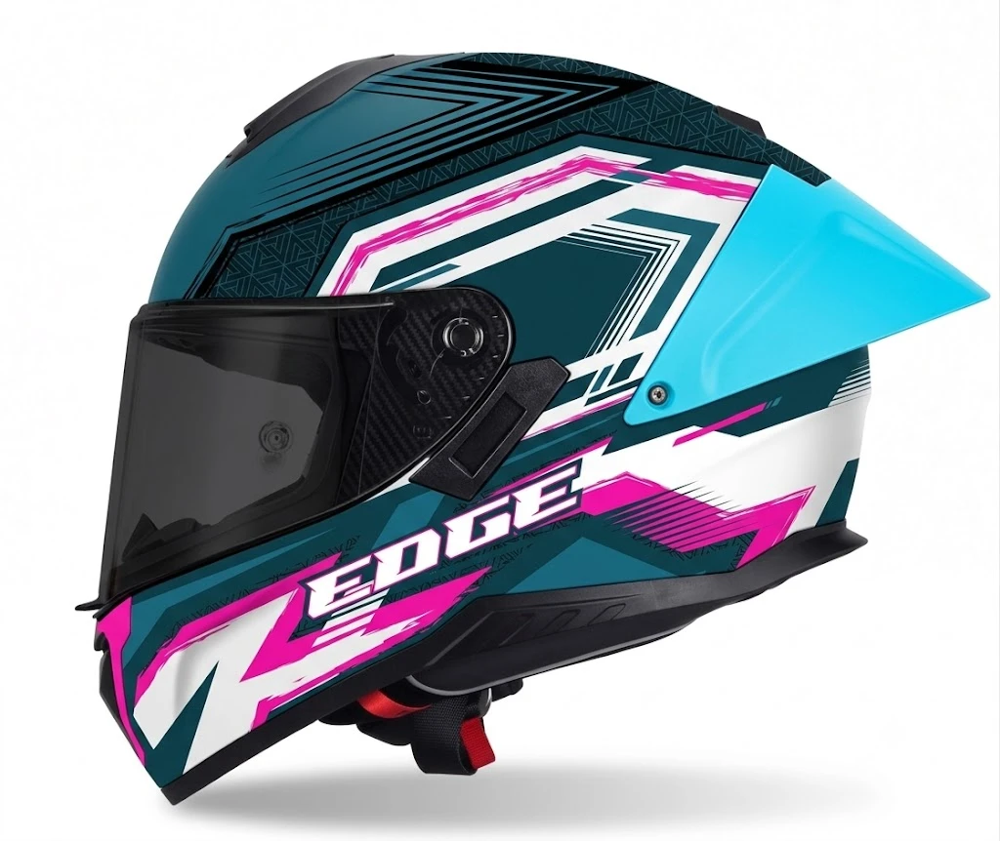

*05-celeste-magenta-vista-b-RESULTADO.webp*

- Resultado v2: 

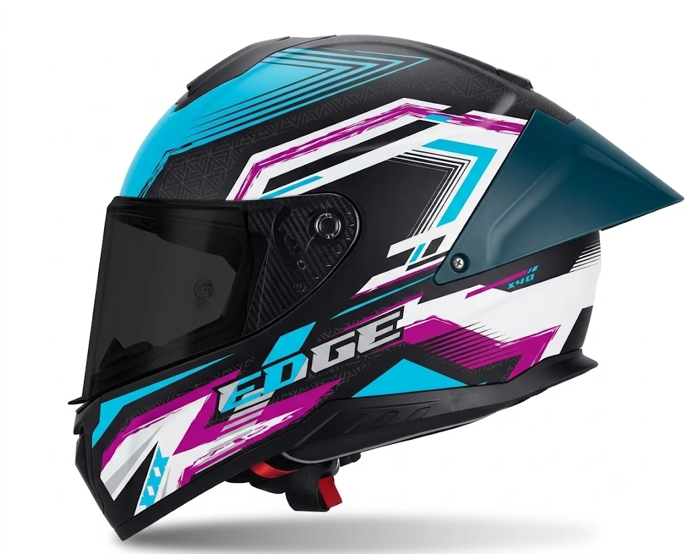

*05-celeste-vista-b-RESULTADO-v2.webp*
,
  


*05-cel-v2-previo.webp*

- Zoom de la pieza superior: 

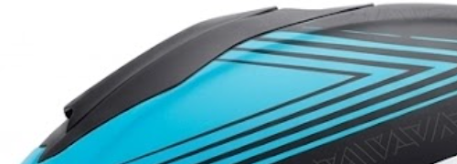

*05-celeste-zoom-pieza-superior.png*

- Crops: `crops/CEL-v2-pieza-superior.png`, `crops/CEL-v2-ref-vs-res.png`,
  `crops/TRIPTICO-celeste-lateral.png`, `crops/CELESTE-COLORES-INVERTIDOS.png`,
  `crops/CELESTE-XXX-comparacion.png`, `crops/CELESTE-lat-z-boca-XXX.png`,
  `crops/CELESTE-lat-z-mecanismo.png`, `crops/CELESTE-lat-z-tonos-alto.png`,
  `crops/ZOOM-celeste-lateral-PIEZA-EXTRA.png`

**Tabla de verificación**

| # | Zona | Referencia | Resultado | Veredicto |
|---|---|---|---|---|
| 1 | Celeste de flechas/galones | RGB ≈ (0,160,215) azul cyan medio | Turquesa/aqua más claro y verdoso | ❌ |
| 2 | Magenta | RGB ≈ (240,25,145) fucsia puro | Violeta/púrpura | ❌ |
| 3 | Pieza superior (extractor de la calota) | Mismo azul petróleo del spoiler ≈ (0,72,96) | NEGRA | ❌ |
| 4 | Banda "FOR EXPLORING RUNNERS" | GRIS medio ≈ (168,168,168) | BLANCA | ❌ |
| 5 | Deflector / respiradero frontal de la mentonera | GRIS medio | NEGRO | ❌ |
| — | Spoiler | Azul petróleo oscuro | Correcto | ✅ |
| — | Pieza extra bajo el visor | No existe | No aparece | ✅ |
| — | Geometría, piezas, gráfico | — | Correctos | ✅ |

**Defectos encontrados**
1. Celeste corrido a turquesa verdoso.
2. Magenta corrido a violeta.
3. Pieza superior en negro en vez del petróleo del spoiler.
4. Banda del microtexto en blanco en vez de gris medio.
5. Deflector frontal en negro en vez de gris medio.

**Decisión:** **editar**. Los 5 defectos son ajustes tonales globales, que es la clase
de cambio que el generador SÍ ejecuta bien. No hay error de geometría que justifique
regenerar.

**Prompt usado:** prompt v2 de Vista B variante 05, ver
[`kratos-dakota/05-celeste-magenta-vista-b-lateral.md`](kratos-dakota/05-celeste-magenta-vista-b-lateral.md).
Auditoría original: [`kratos-dakota/AUDITORIA-05-celeste-vista-b-v2.md`](kratos-dakota/AUDITORIA-05-celeste-vista-b-v2.md).

**Lección nueva:** cuando la forma ya está bien, hay que resistir la tentación de
regenerar. Un desvío de color no es motivo de regeneración: separar siempre el
diagnóstico en FORMA vs. TONO y elegir la herramienta según eso.

---

## Entrada 05 — Kratos Dakota 05 CELESTE/MAGENTA · Vista B (lateral) — v3 EDITADO · CASO DE ÉXITO 01

**Fecha:** 2026-07-30
**Variante y vista:** EDGEPRO Kratos · Dakota 05 Celeste/Magenta/Blanco · Vista B (lateral), v3 editado
**Estado:** ✅ aprobado — con una corrección menor pendiente (el visor)
Es el mejor resultado del lote y el que **define el método a seguir**: una única edición
tonal corrigió los 5 desvíos de color de golpe, sin degradar geometría ni gráfico.

**Archivos de evidencia**
- Referencia: 


*05-cel-ref-ilustracion.webp*

- Antes (v2): 


*05-cel-v2-previo.webp*

- Después (v3): 

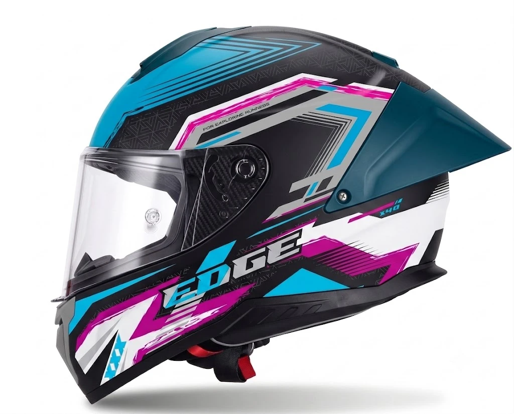

*05-cel-v3-EDITADO-OK.webp*

- Molde real: 

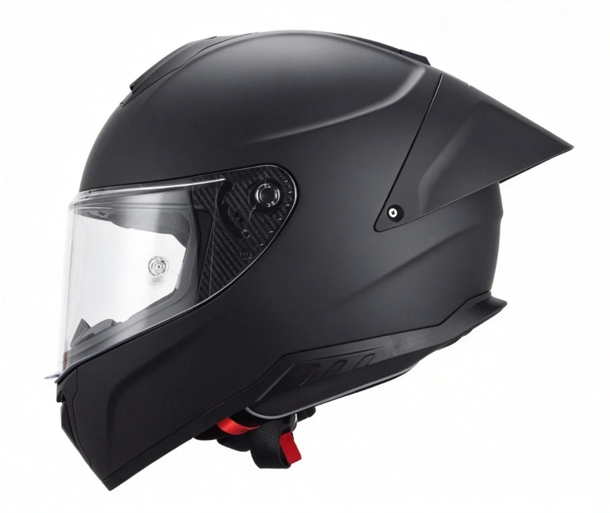

*00-molde-real.webp*
,
  


*00-molde-real-lateral.png*

- Crops: `crops/CEL-EXITO-antes-despues.png`, `crops/CEL-EXITO-visor.png`,
  `crops/CEL-EXITO-zona.png`, `crops/CELv3-lado-a-lado.png`, `crops/CELv3-frente.png`,
  `crops/CELv3-linea.png`, `crops/CELv3-pieza.png`

**Tabla de verificación**

| # | Cambio pedido | Veredicto | Nota |
|---|---|---|---|
| 1 | Celeste turquesa → azul cyan medio | ✅ | |
| 2 | Magenta violeta → fucsia | ✅ | Queda un resto leve de violeta |
| 3 | Pieza extractora superior negra → petróleo del spoiler | ✅ | Resuelto con la regla de "gemelos de color" |
| 4 | Banda "FOR EXPLORING RUNNERS" blanca → gris medio | ✅ | |
| 5 | Deflector frontal negro → gris medio | ✅ | |
| — | Geometría, piezas, encuadre, logo, fondo intactos | ✅ | La edición no derramó |
| — | Ninguna pieza inventada bajo el visor | ✅ | |
| — | Microtipografía legible | ✅ | Primera vez en todo el lote |
| — | Visor NEGRO OPACO | ❌ | Salió transparente (RGB ~242,241,246 vs. 19,19,19 en la referencia) |

**Defectos encontrados**
1. Único defecto: el visor volvió a transparente, como en la foto del molde real (Kratos
   negro). La lista de "lo que NO se toca" decía "el VISOR sigue negro opaco", pero como
   renglón suelto dentro de una lista no alcanzó.

**Decisión:** **aceptar** + retoque puntual del visor (bloque numerado propio en la
siguiente edición, o post-producción).

**Prompt usado:** prompt de edición de 5 cambios, registrado en el hilo de trabajo del
2026-07-30. Documentado en
[`casos-de-exito/01-celeste-magenta-vista-b.md`](casos-de-exito/01-celeste-magenta-vista-b.md)
y [`kratos-dakota/AUDITORIA-05-celeste-vista-b-v2.md`](kratos-dakota/AUDITORIA-05-celeste-vista-b-v2.md).

**Por qué funcionó — el patrón a replicar:**
1. **Declarar que la forma ya está bien** y que esto NO es una regeneración. Sin esa
   declaración el modelo redibuja y rompe todo.
2. **Cambios numerados, uno por bloque**, nombrando cada pieza por su nombre físico
   ("la banda que lleva el texto FOR EXPLORING RUNNERS", "el deflector de la
   mentonera"), no por ubicación vaga.
3. **Decir qué está mal Y qué debe quedar**, con la operación explícita ("sacale el
   componente verde y bajale la luminosidad").
4. **Criterio de rechazo por cambio**: "si sigue pareciendo agua de pileta, está MAL".
5. **Escala de tonos ordenada de oscuro a claro con N niveles numerados**, más la regla
   "son N niveles distintos; si dos se parecen, está MAL". Esto es lo que impide el
   colapso de contraste.
6. **Relaciones entre piezas en vez de nombres de color**: "la pieza superior lleva
   EXACTAMENTE EL MISMO TONO QUE EL SPOILER; son GEMELOS de color".
7. **Bloque explícito de lo que NO se toca**, nominando cada pieza. Sin esto el cambio
   se derrama (lección del rojo vino).
8. **Checklist final de preguntas** que el modelo debe responder.

**Lección nueva:** al editar, el modelo puede **revertir una pieza al estado del molde
real**. Cada pieza crítica necesita su propio bloque numerado, no un renglón dentro de
la lista de exclusiones.

---

## Entrada 06 — Kratos Dakota 05 CELESTE/MAGENTA · Vista C (trasera)

**Fecha:** 2026-07-31
**Variante y vista:** EDGEPRO Kratos · Dakota 05 Celeste/Magenta/Blanco · Vista C (trasera)
**Estado:** ❌ rechazado — el defecto principal es de ESTILO (render/ilustración en vez de
fotografía), no un desvío tonal. No usable para ficha técnica ni para material de
licencia en su estado actual.

**Archivos de evidencia**

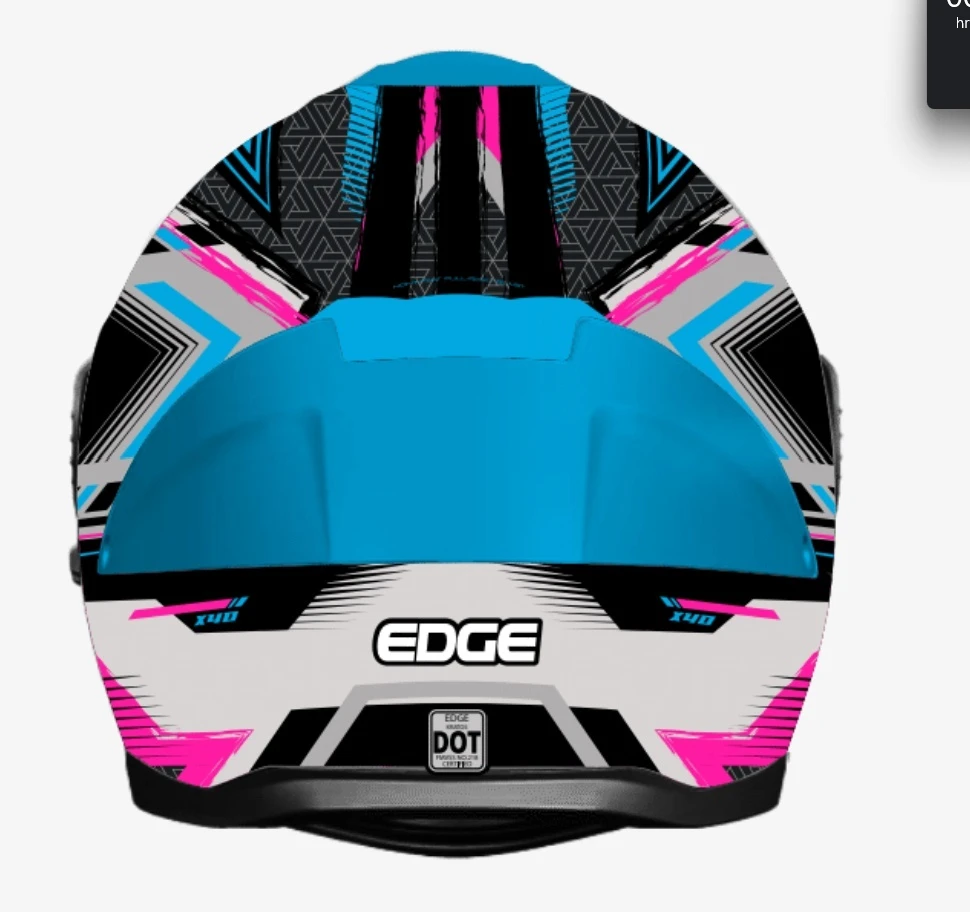

*Ilustración de referencia (autoridad de gráfico)*


*Checkpoint real — Kratos negro mate, trasera (autoridad de forma)*

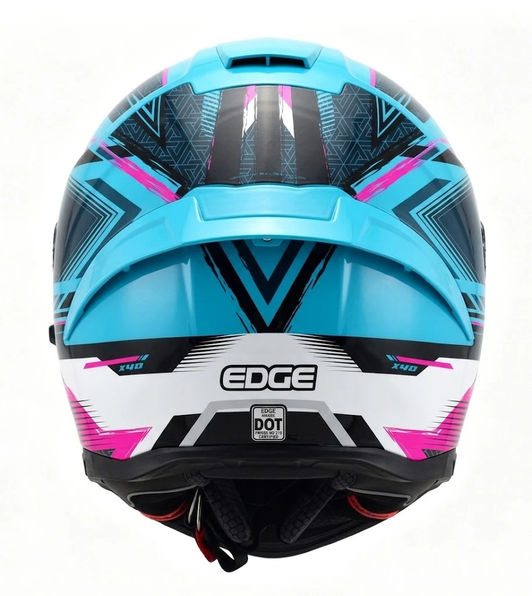

*Resultado generado (prompt v2)*

**Tabla de verificación**

| # | Ítem verificado | Veredicto | Nota |
|---|---|---|---|
| 1 | Silueta trasera (ancha, hombros marcados, no la del dibujo) | ✅ | Sin desvío visible contra el checkpoint real en este encuadre frontal |
| 2 | Resultado es FOTOGRAFÍA, no ilustración/render | ❌ | **Defecto principal.** El acabado, los cortes de color y los reflejos se leen como render/ilustración plana, no como fotografía de producto — exactamente lo que el propio prompt prohíbe en dos lugares distintos |
| 3 | Acabado MATE absoluto | ❌ | Brillo/satinado marcado en el panel celeste del spoiler y en la calota alta — el mismo defecto que el changelog v2 del propio prompt dice haber corregido |
| 4 | Extractor superior, dos ranuras, tornillo central, pieza ranurada baja | ⚠️ | No se puede confirmar sin crop con zoom — patrón dominante del proyecto es que el gráfico las absorbe (Lección 12/13) |
| 5 | Cuello, lengüetas ERS, correa | ✅ provisorio | Se ve consistente con el checkpoint real en lo que el encuadre permite verificar |
| 6 | Densidad del gráfico vs. ilustración | ⚠️ | A ojo, comparable; no se verificó zona por zona con crop |
| 7 | Marcas "X40" de los costados | ✅ | Presentes en el resultado |
| 8 | Logotipo EDGE completo y legible | ⚠️ | Presente y legible, pero de color oscuro/negro — **el prompt pide "en AZUL"; la ilustración (autoridad de gráfico) lo muestra negro.** Contradicción de origen, no defecto del generador — ver Defecto 3 |
| 9 | Sello DOT presente y coherente | ⚠️ | Presente, con texto de certificación de aspecto corrupto — esperable (Lección 11), pero agravado por una contradicción del propio prompt — ver Defecto 4 |

**Defectos encontrados**

1. **El resultado se lee como render/ilustración, no como fotografía de producto.**
   Es el defecto de mayor peso: ambas versiones del prompt (v1 y v2) incluyen la
   prohibición explícita *"Prohibido devolver una ilustración, un vector o un render
   plano: el resultado es una FOTOGRAFÍA"*, y el resultado la incumple. A diferencia de
   un desvío de color, esto no se arregla con un ajuste tonal global: la textura y el
   comportamiento de la luz fotográfica no se sintetizan editando tonos.
2. **Acabado satinado/brillante en el panel celeste del spoiler y en la calota alta**,
   en vez de mate absoluto. El propio prompt v2 documenta en su changelog que este
   defecto ya había ocurrido en un intento anterior de esta misma vista y agrega un
   bloque de refuerzo — este resultado sugiere que el refuerzo no alcanzó, o que
   corresponde a la generación anterior al bloque.
3. **Contradicción de origen sobre el color del logo EDGE.** El bloque "TEXTOS Y
   DECALS" del prompt pide el logotipo *"en AZUL"*; la ilustración —declarada autoridad
   de gráfico— lo muestra negro/oscuro. Es el mismo patrón que el spoiler negro de la
   variante 04 (Entrada 02): un error de transcripción del Agente 0, no del generador.
   No se corrige en el generador: se corrige en la fuente.
4. **Contradicción interna en el propio archivo de prompt sobre el sello DOT.** La
   sección "TEXTOS Y DECALS" (línea 104) pide dibujar *"el SELLO / STICKER DE
   HOMOLOGACIÓN 'DOT'... con el texto 'DOT'"*, y 67 líneas más abajo el bloque "EL
   SELLO DOT NO SE DIBUJA" (línea 171) dice lo opuesto: *"no incluir calcomanías de
   homologación... se componen después en post-producción"*. El generador no puede
   cumplir las dos. El sello con texto de certificación de aspecto corrupto en el
   resultado es la consecuencia directa y esperable de esa contradicción, no un fallo
   aislado del generador.
5. **Piezas chicas sin verificar con zoom**: extractor, dos ranuras y pieza ranurada
   baja. Se marcan a verificar en vez de aprobarse a ojo, siguiendo la Lección 12.

**Decisión:** **regenerar**, no editar. El defecto principal (estilo/fotografía) no es
un desvío tonal — es un problema de tipo de imagen completo, que un ajuste tonal global
no resuelve. Se corrigen primero las dos contradicciones de origen (Defectos 3 y 4),
que son gratis de arreglar y estaban generando ruido en cada intento. Se ofrece además
un prompt de edición liviana como alternativa más barata, para el caso de que se
prefiera intentar arreglar acabado + logo sobre el mismo archivo antes de gastar una
regeneración completa — aclarando que no es el método recomendado para el defecto
principal.

**Prompt usado:** prompt v2 de Vista C variante 05, ver
[`kratos-dakota/05-celeste-magenta-vista-c-trasera.md`](kratos-dakota/05-celeste-magenta-vista-c-trasera.md).
Prompt v3 corregido y prompt de edición alternativo, ambos apendados al final de ese
mismo archivo el 2026-07-31.

**Lección nueva:** un prompt puede contradecirse a sí mismo entre dos secciones
distintas (acá: "dibujá el sello DOT con su texto" vs. "el sello DOT no se dibuja"),
y esa contradicción se ve idéntica a un fallo del generador — el sello sale mal
igual — pero se arregla en otro lado. Antes de dar un prompt por bueno hay que leerlo
completo de punta a punta buscando instrucciones que se pisen entre sí, no alcanza con
revisar cada bloque de forma aislada.

---

## Entrada 07 — Kratos Dakota 05 CELESTE/MAGENTA · Vista C (trasera) · resultado con prompt v3

**Fecha:** 2026-07-31
**Variante y vista:** EDGEPRO Kratos · Dakota 05 Celeste/Magenta/Blanco · Vista C (trasera),
resultado tras aplicar el prompt v3 (corrección de las 2 contradicciones de origen +
refuerzo anti-render de la Entrada 06).
**Estado:** ⚠️ aprobado con reservas — 6 de 7 ítems corregidos correctamente. Queda 1
defecto, acotado a una sola pieza.

**Archivos de evidencia**

Ilustración de referencia y checkpoint real: los mismos de la Entrada 06 —
[`05-celeste-magenta-vista-c-ILUSTRACION.webp`](kratos-dakota/resultados/05-celeste-magenta-vista-c-ILUSTRACION.webp)
y
[`00-kratos-real-trasera-CHECKPOINT.webp`](kratos-dakota/resultados/00-kratos-real-trasera-CHECKPOINT.webp).

Resultado nuevo (v3): **pendiente de subir al repo.** El archivo fue compartido
directamente en el hilo de trabajo; no existe todavía como archivo en
`kratos-dakota/resultados/`. Falta guardarlo ahí como
`05-celeste-magenta-vista-c-RESULTADO-v3.webp` para que esta entrada quede
completamente auditable sin depender del hilo de chat.

**Tabla de verificación** — contra los 9 chequeos del prompt v3

| # | Ítem verificado | Veredicto | Nota |
|---|---|---|---|
| 1 | Silueta trasera (ancha, hombros marcados) | ✅ | Sin desvío visible |
| 2 | Resultado es FOTOGRAFÍA, no render/ilustración | ✅ | Corregido respecto de la Entrada 06 — el bloque anti-render funcionó |
| 3 / 3c | Extractor superior y tornillo central | ✅ | Ambos visibles |
| 3b | Dos ranuras pequeñas y pieza ranurada baja | ⚠️ | No se puede confirmar sin crop con zoom — a verificar (Lección 12) |
| 4 | Cuello, ERS, correa | ✅ provisorio | Consistente con el checkpoint en lo que el encuadre permite ver |
| 5 / 5b | Densidad del gráfico y marcas "X40" | ✅ | Ambos presentes, comparable a la ilustración |
| 5c | Cobertura y simetría del gráfico | ✅ | Simétrico, sin parches negros |
| 6 | Logo EDGE (color) y sello DOT (sin texto de certificación) | ✅ | **Las dos correcciones de origen de la Entrada 06 funcionaron**: logo negro, sello DOT como placa lisa sin texto corrupto |
| 7 | Acabado MATE | ✅ | Corregido — sin brillo tipo espejo |
| — | **Color del SPOILER** | ❌ | **Único defecto.** Sale en el mismo celeste brillante que la calota; el prompt pide azul petróleo oscuro, un tono claramente más oscuro y distinto |

**Defectos encontrados**

1. **El spoiler (la pieza que sobresale, con sus dos rejillas laterales) sale en
   celeste brillante, igual que el panel de la calota.** El prompt v3 declara dos
   tonos distintos para zonas vecinas — celeste en la calota, azul petróleo oscuro en
   el spoiler — y el generador los colapsó en uno solo. Es el mismo mecanismo de la
   Lección 7 (separación de tonos), pero acotado a una sola pieza en vez de a todo el
   casco: la regla de conteo funcionó para el resto de la superficie y falló acá.

**Decisión:** **editar**, no regenerar. Six de siete ítems están resueltos; el único
defecto es un ajuste tonal de una pieza puntual, exactamente el tipo de corrección que
el generador SÍ ejecuta bien (Lección 6). Se ofrece un prompt de edición dirigido solo
al spoiler, con la relación "no-gemelos" declarada explícitamente (el spoiler NO
comparte tono con la calota), y un prompt de regeneración v4 como respaldo por si la
edición revierte alguna otra pieza (Lección 3).

**Prompt usado:** prompt v3, ver la sección "v3" al final de
[`kratos-dakota/05-celeste-magenta-vista-c-trasera.md`](kratos-dakota/05-celeste-magenta-vista-c-trasera.md).
Prompt de edición del spoiler y prompt v4 de respaldo, apendados al mismo archivo el
2026-07-31.

**Lección nueva:** la separación de tonos (Lección 7) puede fallar en una sola pieza
aunque el resto de la superficie la respete. No alcanza con declarar la escala general
de tonos: cuando dos zonas VECINAS llevan colores parecidos pero distintos (celeste
calota / petróleo spoiler), conviene declarar explícitamente que **no son gemelos** —
la relación inversa a la regla de gemelos de color de la Entrada 05.

---

## Entrada 08 — Kratos Dakota 05 CELESTE/MAGENTA · Vista C (trasera) · resultado tras aplicar la edición v4

**Fecha:** 2026-07-31
**Variante y vista:** EDGEPRO Kratos · Dakota 05 Celeste/Magenta/Blanco · Vista C (trasera),
resultado tras aplicar el prompt de EDICIÓN del spoiler de la Entrada 07 (lógica del
bloque "v4" del archivo de prompt).
**Estado:** ❌ rechazado — el defecto no es el desvío tonal que se creía en la Entrada
07: es una **confusión de identificación de pieza**. El generador invirtió cuál forma
física es "el spoiler".

**Archivos de evidencia**

Ilustración de referencia y checkpoint real: los mismos de las Entradas 06 y 07 —
[`05-celeste-magenta-vista-c-ILUSTRACION.webp`](kratos-dakota/resultados/05-celeste-magenta-vista-c-ILUSTRACION.webp)
y
[`00-kratos-real-trasera-CHECKPOINT.webp`](kratos-dakota/resultados/00-kratos-real-trasera-CHECKPOINT.webp).

Resultado de este intento: **no está subido al repo.** Se vio directamente en el hilo
de chat, no existe todavía como archivo en `kratos-dakota/resultados/`. Falta
guardarlo ahí (sugerido: `05-celeste-magenta-vista-c-RESULTADO-v4-edicion.webp`) para
que esta entrada quede completamente auditable sin depender del hilo de chat.

**Tabla de verificación**

| # | Ítem verificado | Veredicto | Nota |
|---|---|---|---|
| 1-7 | Todo lo demás (silueta, fotografía, mate, logo EDGE, sello DOT, densidad, X40) | ✅ | Sin cambios respecto de la Entrada 07: la edición no derramó sobre el resto de la imagen |
| — | **Color del ala protuberante con las dos rejillas laterales (el spoiler real)** | ❌ | Salió en CELESTE BRILLANTE. Debía quedar en azul petróleo oscuro |
| — | **Color de la zona plana de fondo que rodea al spoiler (malla geométrica triangular, parte alta de la calota)** | ❌ | Salió en AZUL PETRÓLEO OSCURO. Debía quedar en celeste |

**Defectos encontrados**

1. **Los colores del spoiler y del fondo que lo rodea están EXACTAMENTE INVERTIDOS
   respecto de lo declarado.** La pieza que sobresale de verdad —el ala con sus dos
   rejillas de ventilación laterales, ubicada inmediatamente debajo del extractor
   superior y arriba de la banda blanca, la misma forma que se ve protuberante en la
   foto del checkpoint real— salió en celeste brillante. La zona plana de fondo que la
   rodea —la superficie con la malla geométrica triangular— salió en azul petróleo
   oscuro. Es lo opuesto exacto de lo que piden el prompt v3 y el prompt de edición v4:
   "AZUL CYAN MEDIO... en el panel central grande de la zona del spoiler" / "El SPOILER
   va en AZUL PETRÓLEO OSCURO".

   **Esto NO es el mismo defecto que la Entrada 07.** En la Entrada 07 el spoiler y la
   calota habían COLAPSADO al mismo tono (los dos celeste) — un problema de separación
   de tonos (Lección 7), resoluble con una edición tonal. Acá los dos tonos SÍ están
   separados y presentes en la imagen, pero cada uno quedó sobre la pieza física
   equivocada. El generador no fusionó los colores: **no identifica correctamente cuál
   forma física es "el spoiler"**. Confunde el ala protuberante real (la pieza con las
   rejillas, físicamente saliente, clara y verificable en la foto del checkpoint) con la
   zona plana de fondo que la rodea.

2. **Causa raíz probable, localizada en el propio texto del prompt v3/v4.** El Bloque
   2 de color usa la palabra "spoiler" en dos frases consecutivas para referirse a dos
   cosas distintas:
   - *"AZUL CYAN MEDIO... en el panel central grande de la ZONA DEL SPOILER"* — acá
     "zona del spoiler" suena a una región amplia de la superficie.
   - *"El SPOILER va en AZUL PETRÓLEO OSCURO"*, el renglón siguiente — acá "el
     spoiler" se refiere a la pieza puntual en sí.

   Un lector humano distingue las dos por contexto; el generador de imágenes no tiene
   ese contexto y termina asignando los dos colores a la forma equivocada, o
   intercambiados, exactamente como pasó acá. El prompt de edición v4 (dirigido "solo
   al spoiler") heredó la misma ambigüedad de nombre y no la corrigió — probablemente
   por eso el intercambio de colores no se resolvió, sino que se invirtió del todo.

**Decisión:** **regenerar** con un prompt v5, no editar de nuevo. Una edición no
alcanza cuando la causa es que el modelo no ubica bien cuál pieza es cuál: declarar
únicamente "cambiá el color de esta zona" no arregla una confusión de identificación
de forma, porque el problema no es el tono sino el mapeo tono→pieza. Antes de intentar
otra edición hace falta reescribir el Bloque 2 dándole al spoiler un nombre exclusivo,
no compartido con la zona que lo rodea, y anclado a un detalle físico verificable de la
foto real. Se ofrece igualmente, como vía más barata a probar primero, un prompt de
edición v2 que declara el intercambio de los dos colores ya presentes (no requiere
sintetizar textura nueva, a diferencia del defecto de "se ve como render" de la Entrada
06, que sí necesitó regenerar).

**Prompt usado:** prompt de edición del spoiler de la Entrada 07 (bloque "v4" de
[`kratos-dakota/05-celeste-magenta-vista-c-trasera.md`](kratos-dakota/05-celeste-magenta-vista-c-trasera.md)).
Prompt de regeneración v5 y prompt de edición v2 alternativo, ambos apendados al mismo
archivo el 2026-07-31.

**Lección nueva:** cuando dos frases consecutivas de un mismo prompt usan la misma
palabra ("spoiler") para referirse a una ZONA AMPLIA y a una PIEZA PUNTUAL distinta
dentro de esa zona, el generador puede confundir cuál es cuál — y no como una fusión
de tonos (eso ya lo cubre la Lección 7), sino como una inversión completa de qué pieza
lleva qué color. Hay que darle a la pieza puntual un nombre EXCLUSIVO, que no comparta
palabra con el nombre de la zona que la rodea, y anclar su identificación a un detalle
físico verificable de la foto real (acá: las dos rejillas laterales, y su posición
exacta respecto de otras piezas — debajo del extractor, arriba de la banda blanca). Un
desvío de tono se edita; una confusión de qué pieza es cuál no se arregla con un
ajuste de color, hay que resolver primero la ambigüedad de nombres en el prompt.

---

# LECCIONES ACUMULADAS

Consolidado de todo lo aprendido en el proyecto. Se ordena por tema, no por
cronología. **Antes de escribir un prompt nuevo, leer esta sección entera.**

## Sobre cómo edita el modelo

1. **El modelo no hace ediciones locales.** Pedirle "borrá esto" o "sacá aquello"
   provoca una regeneración y daño colateral en el resto de la imagen. Los **ajustes
   tonales globales SÍ funcionan** y son la herramienta correcta cuando la forma ya
   está bien.
2. **Al editar hay que declarar que NO es una regeneración**: "la forma ya está bien,
   no la toques". Sin esa declaración el modelo redibuja.
3. **Al editar, el modelo puede revertir una pieza al estado del molde real.** Caso
   confirmado: el visor volvió a transparente porque así está en la foto del Kratos
   negro. **Cada pieza crítica necesita su propio bloque numerado**, nunca un renglón
   dentro de una lista de exclusiones.
4. **Bloque explícito de lo que NO se toca, nominando cada pieza.** Sin eso el cambio
   se derrama a piezas vecinas (lección del rojo vino).
5. **Un cambio = un bloque numerado**, nombrando la pieza por su nombre físico y con
   la operación explícita y su criterio de rechazo ("si sigue pareciendo agua de
   pileta, está MAL").
6. **Separar el diagnóstico en FORMA vs. TONO** y elegir la herramienta según eso: un
   desvío de color se edita, no se regenera. Solo la geometría rota justifica regenerar.

## Sobre color y contraste

7. **Colapso de contraste:** si no se declara una escala de tonos **numerada con regla
   de conteo** ("son N niveles distintos; si dos se parecen, está MAL"), todos los
   tonos se apelotonan en valores medios. Es el fallo dominante en las variantes
   monocromas.
8. **Declarar RELACIONES entre piezas funciona mejor que nombrar colores**: "la pieza
   superior lleva EXACTAMENTE EL MISMO TONO QUE EL SPOILER; son gemelos de color".
9. **Verificar el color de cada pieza grande por separado contra la ilustración.** No
   inferirlo del nombre de la variante: "rojo/blanco/negro" no dice qué pieza lleva qué
   color. Un error de transcripción del Agente 0 se ve igual que un error del generador
   pero se arregla en otro lado.
10. **Medir, no mirar.** Histograma de luminancia y muestreo de píxel sobre ilustración
    vs. resultado detectan desvíos que el ojo aprueba.
10b. **Una palabra compartida entre una zona amplia y una pieza puntual que está adentro
    de esa zona puede hacer que el generador invierta cuál pieza lleva qué color** (caso
    Dakota 05 vista C: "la zona del spoiler" y "el spoiler" en dos frases consecutivas,
    referidas a cosas distintas). Esto no es un colapso de tonos (Lección 7): los dos
    tonos quedan presentes y separados, pero cada uno cae sobre la forma equivocada. Se
    blinda dándole a la pieza puntual un nombre EXCLUSIVO, que no comparta palabra con
    el nombre de la zona que la rodea, y anclando su identificación a un detalle físico
    verificable de la foto real (una rejilla, una posición relativa a otra pieza). Un
    desvío de tono se edita; una confusión de qué pieza es cuál necesita primero
    resolver la ambigüedad de nombres en el prompt, no un ajuste de color.

## Sobre texto, sellos y detalle fino

11. **El sello DOT y la microtipografía siempre salen corruptos** ("CENTIFIED",
    "FMVES", "FOR EXPLORING RUNNERS" ilegible). **No se dibujan: se componen en
    post-producción.**
11b. **Un prompt puede contradecirse a sí mismo entre dos secciones distintas**
    (caso Dakota 05 vista C: una sección pide dibujar el sello DOT con su texto, otra
    dice "el sello DOT no se dibuja"). Esa contradicción se ve idéntica a un fallo del
    generador, pero se arregla releyendo el prompt entero de punta a punta, no
    regenerando. Antes de dar un prompt por bueno, no alcanza con revisar cada bloque
    aislado.
12. **El generador "resume" cuando la superficie tiene mucha información**: baja la
    densidad gráfica, se come piezas chicas y omite textos pequeños. Se blinda con un
    bloque **PROHIBIDO SIMPLIFICAR EL GRÁFICO** y comparación zona por zona.
13. **Cada ítem chico va en su propio chequeo numerado** (ranuras, tornillo, pieza
    ranurada baja, marcas "X40"). Dentro de una lista larga se pierde.
14. **Texto cortado por el borde** (caso Padrino): el logotipo de la licencia debe
    entrar completo dentro de la zona visible, con margen.
15. **"Logo malo"** (caso Top Gun): el logotipo se reproduce fiel al arte de referencia
    adjunto, nunca se redibuja de memoria.

## Sobre forma, molde y conflictos con la ilustración

16. **El molde es la autoridad de forma.** Misma geometría, mismas piezas, mismo
    ángulo. El arte se aplica ENCIMA, nunca redibuja el casco.
17. **Declarar los conflictos explícitamente** ("esto es una carencia del dibujo, no
    una indicación de diseño") evita que el modelo copie los errores de la ilustración.
    Funcionó para la silueta trasera ancha, la placa de carbono, las ranuras bajas y la
    correa roja.
18. **Zonas de gráfico vs. zonas protegidas.** El arte cubre la calota; quedan lisas y
    negras el spoiler, la mentonera baja, las tomas de aire, las placas del mecanismo
    del visor y la goma del borde inferior. Esa separación es lo que hace que se lea
    como producto real.
19. **Textura real vs. pintura.** El carbono de la placa es textura del producto, no
    decal: no se pinta encima. El gráfico Dakota es pintura: se deforma con la
    curvatura.

## Defectos aleatorios (no se resuelven por prompt)

20. **La pieza negra extra debajo del mecanismo del visor apareció en 4 de 4 laterales
    y NO se pudo controlar por prompt: es aleatoria.** Solución: retoque manual o 2-3
    reintentos hasta que salga limpio.

## Sobre el proceso

21. **Auditor separado del generador.** La validación de cada resultado la hace una
    pasada distinta de la que generó, con zoom sobre las piezas críticas.
22. **Un prompt por vista, entrega escalonada.** Presupuesto de atención: las 4 vistas
    juntas degradan todo.
23. **Orden del payload:** ilustración PRIMERO, foto real del molde ÚLTIMA como
    autoridad, y declararlo dentro del prompt.
24. **Estructura del prompt en bloques separados:** geometría / color+gráfico /
    adaptación a superficie / fotografía.
25. **"Fotografía de producto" no implica mate.** El acabado mate se declara aparte,
    con criterio de rechazo explícito ("si refleja como un espejo, está mal"), o el
    generador devuelve producto lustroso.
26. **Nombrar los archivos FINAL / DESCARTAR al generarlos.** Dos intentos casi
    idénticos sin marcar cuál es el bueno pasó en los 3 casos anteriores.
27. **Restricción de IP:** solo se adapta material con licencia ya autorizada por EDGE
    para ese proyecto, y cada variante se verifica contra los términos de la licencia
    antes de producción.


---

## LECCIÓN CRÍTICA AGREGADA (2026-07-30) — la pestaña bajo el visor NO era aleatoria

Comparando la ILUSTRACIÓN contra la FOTO DEL MOLDE REAL se confirmó que
la "pieza negra extra" que apareció en 4 de 4 laterales **está dibujada
en la propia ilustración**: es una pestaña negra rectangular colgando
del borde del visor, en la zona del mecanismo. En el casco real esa
pieza NO existe.

El generador la copiaba porque el prompt declara la ilustración como
AUTORIDAD DE GRÁFICO y nunca se declaró que esa pestaña era un
artefacto del dibujo.

→ Corrige la conclusión anterior ("es aleatoria, no se controla por
prompt"). SÍ se controla: hay que declarar el conflicto, igual que se
hizo con el carbono de la placa y con las ranuras traseras.

Bloque agregado a los 15 prompts:

    LA PESTAÑA NEGRA DEBAJO DEL VISOR NO EXISTE — ATENCIÓN MÁXIMA:
    En la ILUSTRACIÓN aparece una pequeña PIEZA/PESTAÑA NEGRA
    RECTANGULAR colgando por debajo del borde del visor, en la zona
    del mecanismo. ESA PIEZA NO EXISTE EN EL CASCO REAL. Es un
    artefacto del dibujo, NO una indicación de diseño. Mirá la foto
    real: ahí no hay nada colgando. NO LA DIBUJES.

Regla general que se desprende: **antes de escribir cualquier prompt de
adaptación, hacer el delta ilustración-vs-molde real y declarar TODOS
los conflictos**, en las dos direcciones (lo que la ilustración omite y
lo que la ilustración agrega de más).
