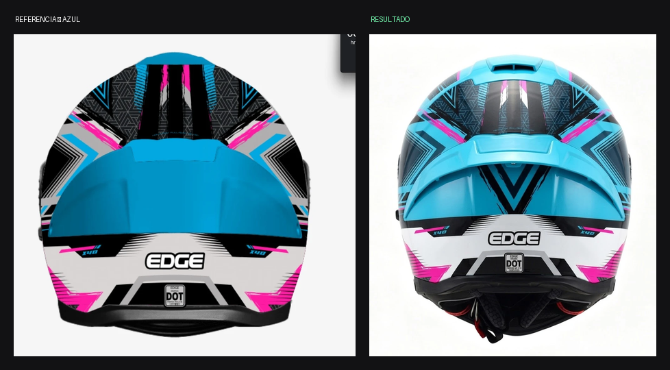

# ANÁLISIS — Kratos Dakota AZUL / ROJO / BLANCO — Vista C trasera

Fecha: 2026-07-30 · Estado: ❌ **El azul royal invadió la zona alta**

*Referencia vs. resultado*

*Zona alta: el fondo negro y los encuadres blancos desaparecieron*

*Panel del spoiler*

*Banda baja con EDGE y el sello DOT*

## Medición

| Color | Referencia | Resultado | Desvío |
|---|---|---|---|
| AZUL ROYAL | 34 % | 37 % | +3 (mal distribuido) |
| NEGRO | **32 %** | 27 % | −5 |
| BLANCO | **15 %** | 10 % | −5 |
| GRIS | **11 %** | 7 % | −4 |
| ROJO | **4 %** | 2 % | −2 |
| azul marino parásito | 1 % | **12 %** | +11 |

## Lo que se cumplió ✅
- Silueta real ancha, no la del dibujo.
- Extractor superior, ranuras, tornillo central, pieza ranurada baja.
- Cuello con acolchado, malla, dos lengüetas rojas del ERS y correa.
- Banda blanca baja con "EDGE" completo y bien escrito.
- Sello DOT presente y legible. Las dos "X40" presentes.
- Simetría correcta.

## Lo que falló ❌
1. **El azul royal se derramó sobre el fondo negro de la zona alta.**
2. **Apareció un AZUL MARINO parásito del 12 %** —el royal oscurecido
   por la sombra— que no está en la paleta.
3. **Cayeron blanco (−5), gris (−4) y negro (−5):** los encuadres
   angulares blancos y la malla triangular gris se perdieron.
4. **El rojo de acento casi desapareció** (4 % → 2 %).
5. Acabado demasiado brillante.

## Recomendación
EDICIÓN. La geometría y los textos están perfectos.
