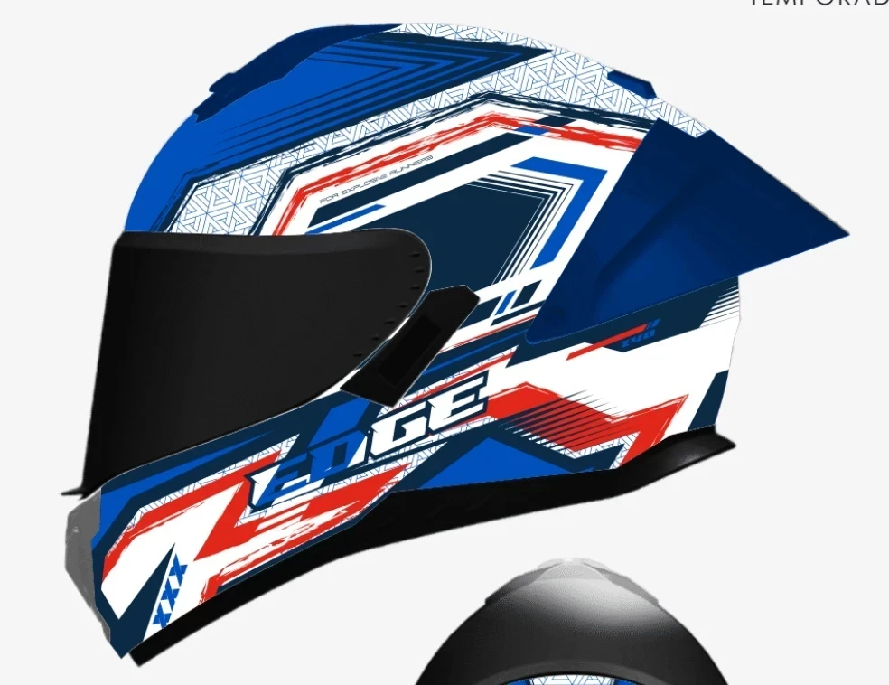
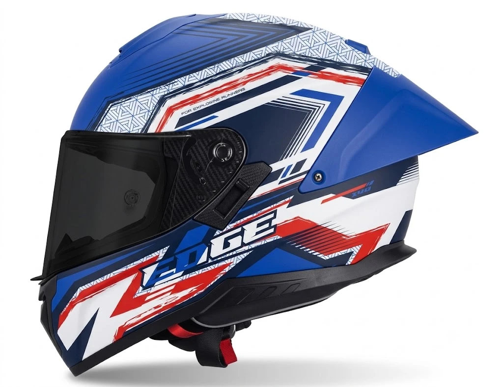
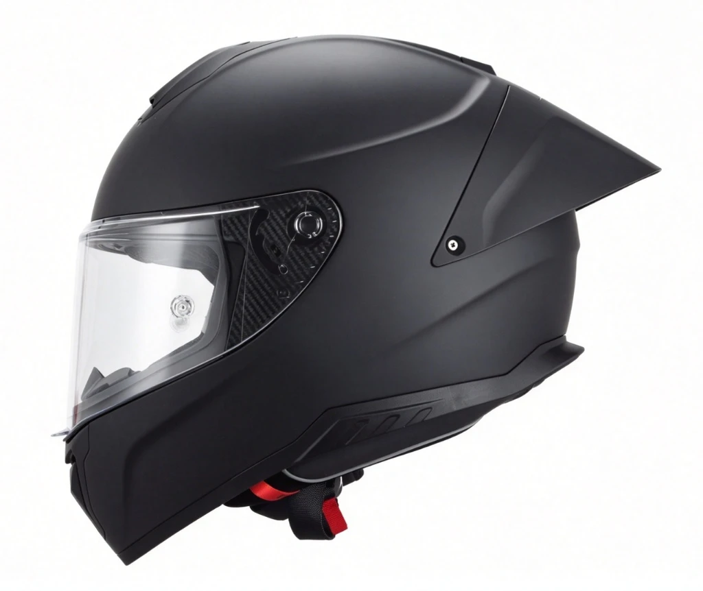
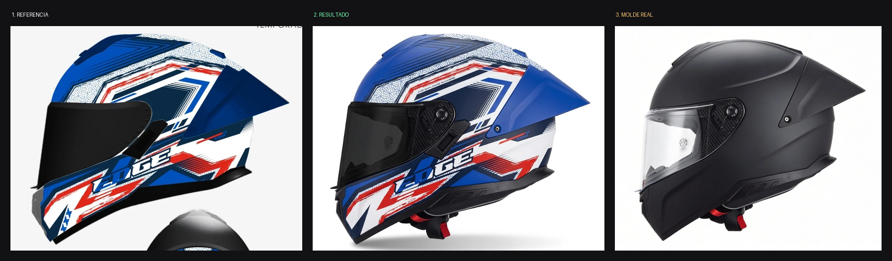
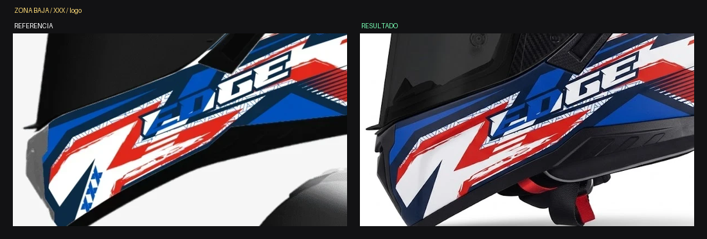
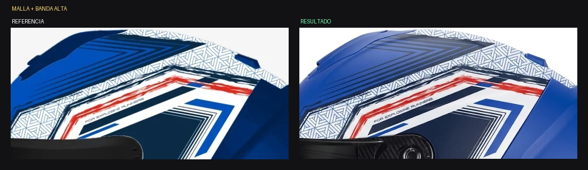

# ANÁLISIS — Kratos Dakota AZUL / ROJO / BLANCO — Vista B lateral

Fecha: 2026-07-30 · Estado: ⚠️ **Aprobado con reservas — 3 correcciones**

---

## Las imágenes

*1. Ilustración de referencia (autoridad de gráfico y de color)*

*2. Resultado generado*

*3. Molde real Kratos negro mate (autoridad de forma y de piezas)*

*Tríptico comparativo*

*Zona baja: acá se ve que faltan las XXX*

*Zona alta: malla, banda y microtipografía — la parte más fiel del resultado*

---

## Lo que se cumplió ✅

| Ítem | Estado |
|---|---|
| Fotografía de producto, no ilustración | ✅ |
| Vista lateral / perfil mirando a la izquierda | ✅ |
| Spoiler completo con su tornillo | ✅ |
| Placa de fibra de carbono con su dial rotativo | ✅ |
| Ranuras de ventilación traseras bajas | ✅ |
| Borde de goma perimetral | ✅ |
| Correa con detalle rojo y hebilla | ✅ |
| Deflector frontal de la mentonera | ✅ |
| Malla triangular con su densidad correcta | ✅ |
| Microtipografía "FOR EXPLORING RUNNERS" legible | ✅ |
| Logo "EDGE" completo, bien escrito, con contorno rojo | ✅ |
| Visor negro opaco | ✅ |
| Fondo blanco, sombra suave, acabado mate | ✅ |
| Cortes de color nítidos estilo racing | ✅ |
| Ninguna pieza inventada bajo el visor | ✅ |

La zona alta es de lo más fiel de todo el lote: la malla triangular, los
encuadres concéntricos y la banda con la microtipografía están calcados.

## Lo que falló ❌

### 1. Faltan las marcas "XXX" de la zona baja delantera
En la ilustración, abajo a la izquierda sobre la masa blanca, hay
**tres marcas en forma de X, azules**, alineadas en diagonal. En el
resultado **no existen**. Es el mismo tipo de omisión que ya vimos en
otras variantes: el generador simplifica los elementos chicos de la
zona baja.

### 2. El azul royal perdió saturación y brillo
Medición de píxel sobre la masa azul dominante:

| | Referencia | Resultado |
|---|---|---|
| Azul dominante | **RGB (0, 72, 168)** | **RGB (24, 72, 144)** |

El resultado tiene **más rojo (24 en vez de 0)** y **menos azul (144 en
vez de 168)**. Traducido: el royal saturado y luminoso se apagó hacia un
azul más grisáceo y más oscuro, con un tinte violáceo. Es sutil pero se
nota al ponerlos uno al lado del otro.

### 3. Falta el "X40" de la zona alta trasera
En la ilustración hay una marca **"X40"** cerca de la base del spoiler.
En el resultado no se lee.

---

## Recomendación

**EDICIÓN.** Ningún defecto es de geometría. El azul es un ajuste tonal
global (lo que el generador ejecuta bien) y las XXX / X40 son elementos
gráficos chicos que se pueden agregar sin tocar el resto.

La reserva: agregar elementos gráficos nuevos es más riesgoso que
cambiar un tono. Si la edición rompe algo, el orden correcto es correr
primero solo el ajuste de azul y dejar las XXX para retoque manual.

---

## Ronda 2 (2026-07-30) — resultado de la primera edición

### Se cumplió ✅
- Azul royal recuperó saturación y luminosidad.
- Las TRES marcas "XXX" aparecieron, en la posición y diagonal correctas.
- La marca "X40" apareció y se lee.
- Malla triangular, encuadres, logo "EDGE" y placa de carbono intactos.
- Visor negro opaco.

### Defectos que quedan ❌
1. **El SPOILER quedó azul royal brillante** — en la referencia es
   AZUL MARINO OSCURO, claramente más oscuro que la calota. Error mío:
   el prompt de edición decía "aplicá el royal a ... el spoiler".
2. **La PIEZA EXTRACTORA SUPERIOR** de la calota: mismo caso, va marino
   oscuro como el spoiler.
3. **El DEFLECTOR / RESPIRADERO FRONTAL de la mentonera salió NEGRO**
   y va GRIS.
4. **Reapareció la PESTAÑA NEGRA debajo del visor**, que no existe en el
   molde real.
5. La microtipografía salió corrupta: dice "FOR EXPLOSINE PUNNERS" en
   vez de "FOR EXPLORING RUNNERS". Va a post-producción.

### Lección
Al escribir un ajuste de color por familia ("aplicá el royal a TODAS las
masas azules"), hay que EXCLUIR NOMINALMENTE las piezas que llevan otro
tono de esa misma familia. Si no, el ajuste se derrama sobre ellas. Es
el mismo error del rojo vino, en versión azul.
