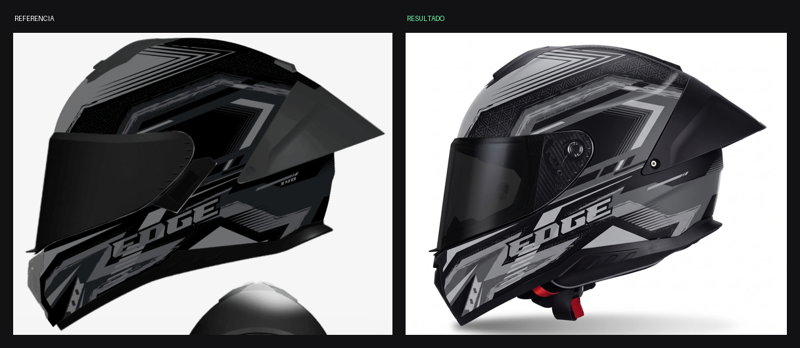
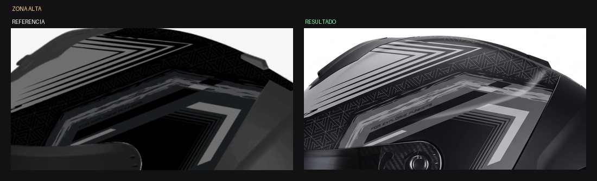
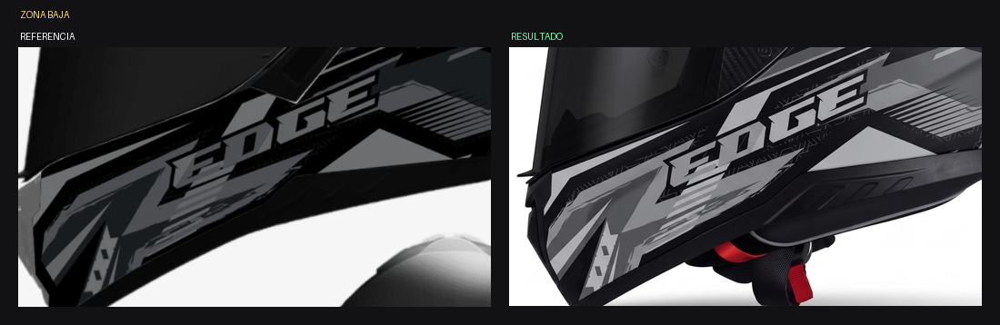

# ANÁLISIS — Kratos Dakota GRIS / NEGRO MONOCROMO — Vista B lateral

Fecha: 2026-07-30 · Estado: ⚠️ **Mejoró pero sigue lavado**

*Referencia vs. resultado*

*Zona alta*

*Zona baja: acá está el desvío grande*

## Medición — reparto de superficie por nivel de luminancia

| Zona | | Oscuros (<64) | Medios (64-159) | Claros (≥160) |
|---|---|---|---|---|
| Todo el casco | **Referencia** | **73 %** | 18 % | 8 % |
| Todo el casco | **Resultado** | **54 %** | 31 % | 14 % |
| Mitad baja | **Referencia** | **64 %** | 21 % | 15 % |
| Mitad baja | **Resultado** | **48 %** | 31 % | 21 % |

## Diagnóstico

El colapso de contraste se redujo respecto de la versión anterior, pero
**sigue existiendo y es medible**: al resultado le faltan **19 puntos de
masa oscura** y le sobran 13 puntos de grises medios y 6 de claros.

En la mitad baja el desvío es todavía peor: la referencia es 64 % negra
y el resultado apenas 48 %.

Causa: el prompt describía los niveles con lenguaje cualitativo ("es
escaso", "ocupa muy poca superficie"). Eso el generador lo interpreta
con mucha libertad.

## Corrección aplicada al prompt

Reemplazar el lenguaje cualitativo por **objetivos numéricos de reparto
de superficie**: 70-75 % negro profundo, 10-15 % grafito, 10-15 % gris
medio, menos del 8 % casi blanco. Y la misma regla repetida
específicamente para la mitad baja, que es donde más se desvía.

## Otros hallazgos

- La microtipografía dice "FOR EXPLORIIE PUMFERS": corrupta. Va a
  post-producción.
- El "X40" se lee correcto.
- Geometría, piezas, placa de carbono, correa con detalle rojo y visor
  negro opaco: todos correctos.

## Lección

Los objetivos cualitativos de tono ("poco", "escaso", "sutil") no
alcanzan. Hay que dar **porcentajes de reparto de superficie** y pedirle
al generador que los verifique antes de entregar.
