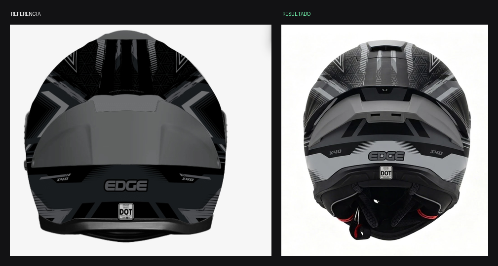
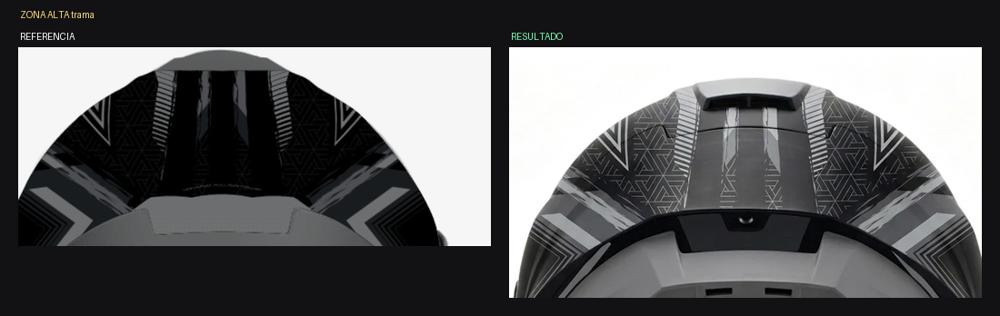
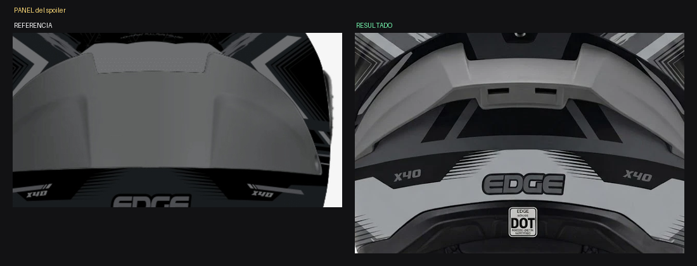
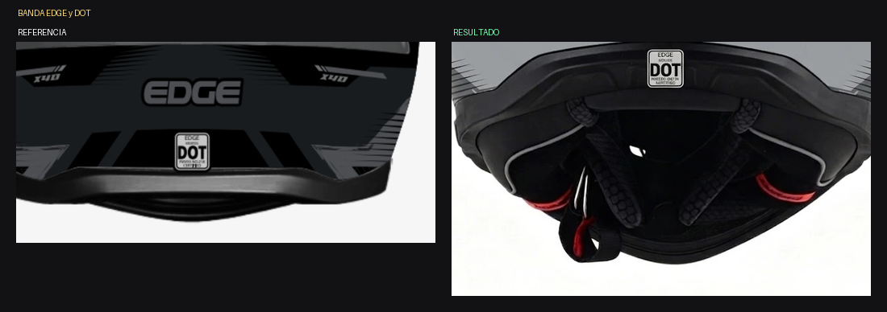

# ANÁLISIS — Kratos Dakota GRIS / NEGRO MONOCROMO — Vista C trasera

Fecha: 2026-07-30 · Estado: ❌ **No cumple — el gris medio invadió**

*Referencia vs. resultado*

*Zona alta: la trama perdió densidad y el grafito se aclaró*

*Panel del spoiler: salió GRIS MEDIO CLARO y debía ser más oscuro*

*Banda baja con EDGE y el sello DOT*

## Medición — reparto de superficie por nivel

| Nivel | Referencia | Resultado | Desvío |
|---|---|---|---|
| NEGRO | **58 %** | 51 % | −7 |
| GRIS GRAFITO OSCURO | **38 %** | 23 % | **−15** |
| GRIS MEDIO | **3 %** | **22 %** | **+19** |
| CASI BLANCO | 1 % | 3 % | +2 |

## Diagnóstico

La referencia es **casi bitonal**: 96 % de su superficie es NEGRO o
GRIS GRAFITO OSCURO. El gris medio es casi inexistente (3 %).

El resultado metió **19 puntos de gris medio** que no existen en el
diseño, robándoselos al grafito. Concretamente:

1. **El PANEL DEL SPOILER salió GRIS MEDIO CLARO.** En la referencia
   ese panel es notablemente más oscuro.
2. **Apareció una PIEZA GRIS CLARA grande debajo del spoiler** que en
   la ilustración no está: el generador convirtió una masa del gráfico
   en una pieza física con volumen y sombra propia.
3. **La trama de la zona alta perdió densidad** y su grafito se aclaró.
4. Las marcas "X40" se movieron de posición respecto de la referencia.

## Lo que se cumplió ✅
- Silueta real ancha, no la del dibujo.
- Extractor superior, ranuras, tornillo central, pieza ranurada baja.
- Cuello con acolchado, malla, dos lengüetas rojas del ERS y correa.
- Banda baja con "EDGE" completo y bien escrito.
- Sello DOT presente. Simetría correcta.
- Monocromía respetada: cero color cromático.

## Recomendación
EDICIÓN para los tonos. La pieza gris inventada bajo el spoiler puede
requerir retoque manual si la edición no la elimina.
