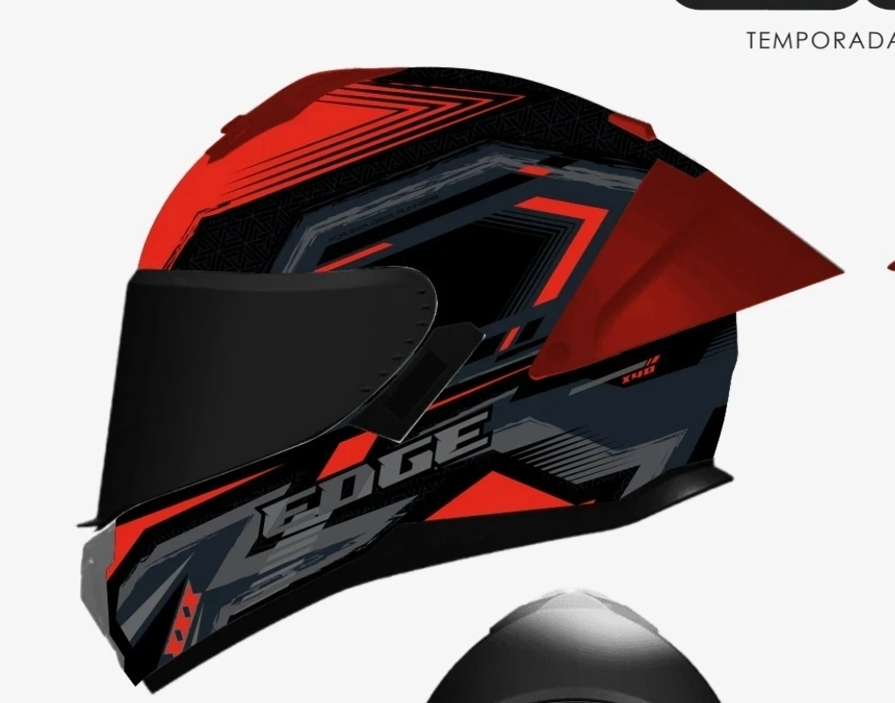
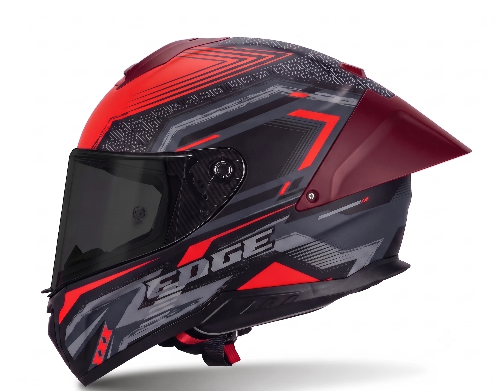
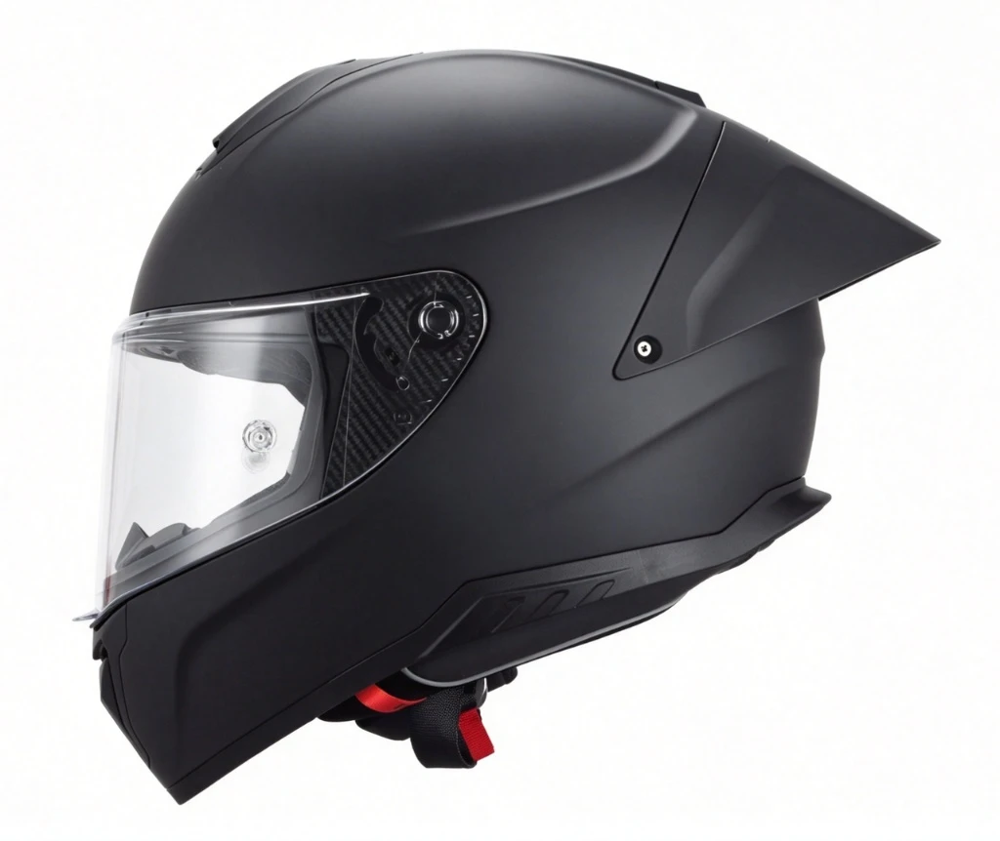
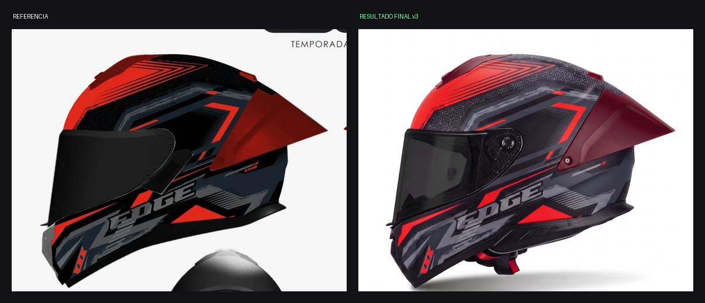
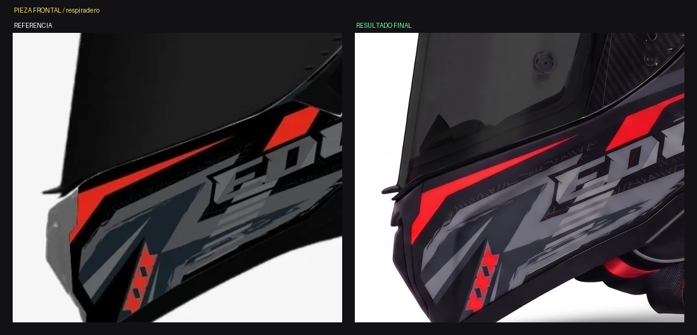
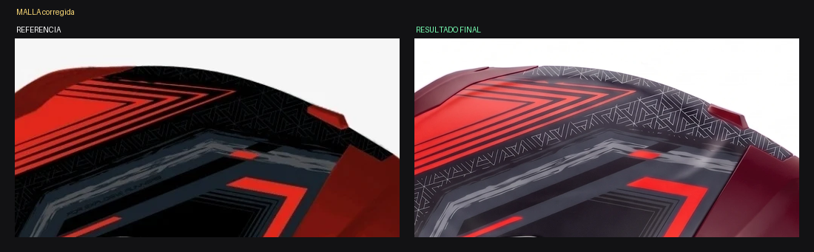
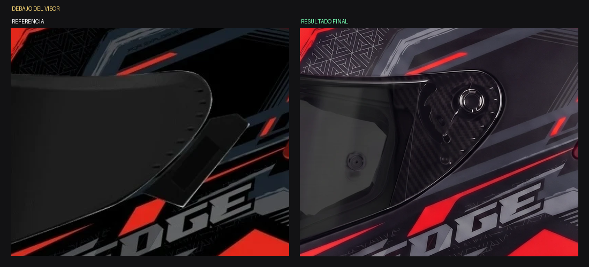

# ANÁLISIS — Kratos Dakota ROJO / GRIS (spoiler vino) — Vista B lateral

Fecha: 2026-07-30 · Estado: ✅ **Aprobado — falta UNA sola edición**

---

## Las imágenes

*1. Ilustración de referencia (autoridad de gráfico y de color)*

*2. Resultado final tras la edición de malla + pestaña*

*3. Molde real Kratos negro mate (autoridad de forma)*

*Referencia vs. resultado final*

*El único defecto que queda: el deflector frontal salió NEGRO y va GRIS*

*La malla triangular quedó corregida: oscura y discreta*

*La pestaña inexistente desapareció*

---

## Historial del caso

| Versión | Qué pasó |
|---|---|
| v1 | Generación base correcta, rojo brillante uniforme |
| v2 | Edición a vino: **falló**, pintó TODO el casco de borgoña. Causa: el prompt decía "los acentos rojos finos acompañan el mismo cambio" |
| v3 | Edición corregida desde el checkpoint: **los dos rojos conviven** ✅ |
| v4 | Edición de malla + pestaña: **ambas cumplidas** ✅ |

## Lo que se cumplió ✅

| Ítem | Estado |
|---|---|
| Rojo vino en el spoiler | ✅ |
| Rojo vino en la piecita superior de la calota, gemela del spoiler | ✅ |
| Rojo anaranjado fuerte en todo el resto del gráfico | ✅ |
| **Los DOS rojos conviven** sin derrame | ✅ |
| Malla triangular oscura y discreta, sin líneas claras | ✅ |
| Malla con su dibujo, posición y densidad intactos | ✅ |
| **Pestaña inexistente debajo del visor: eliminada** | ✅ |
| Placa de fibra de carbono con su dial | ✅ |
| Logo "EDGE" completo, bien escrito | ✅ |
| Marcas "XXX" presentes | ✅ |
| Marca "X40" presente y legible | ✅ |
| Ranuras traseras bajas, borde de goma, correa con detalle rojo | ✅ |
| Visor negro opaco | ✅ |
| Grises con sus valores correctos | ✅ |
| Fondo, sombra, mate, encuadre | ✅ |

## Lo que falta ❌ — una sola cosa

**El DEFLECTOR / RESPIRADERO FRONTAL de la mentonera salió NEGRO y en la
referencia es GRIS MEDIO.** Es la pieza saliente de la parte baja
delantera, delante de la mentonera, debajo del arranque del visor.
Se ve claramente en el crop `VINOv3-pieza.png`: en la referencia esa
pieza es un gris claro que la separa del negro de la mentonera; en el
resultado se fundió con el negro.

Es exactamente el mismo defecto que apareció en la variante celeste, y
allá se corrigió sin problemas con una edición tonal.

## Recomendación

**EDICIÓN.** Es un cambio tonal sobre una sola pieza nombrada, la clase
de operación que este generador ejecuta bien. Regenerar sería tirar
cuatro rondas de trabajo por un solo tono.

## Lección de este caso

Nunca escribir "para que toda la pieza tenga un solo color coherente"
si el diseño requiere dos colores conviviendo. El generador obedece la
instrucción literal y unifica todo. Hay que declarar explícitamente
**cuántos** tonos de una misma familia deben coexistir y **cuáles**
piezas llevan cada uno.
