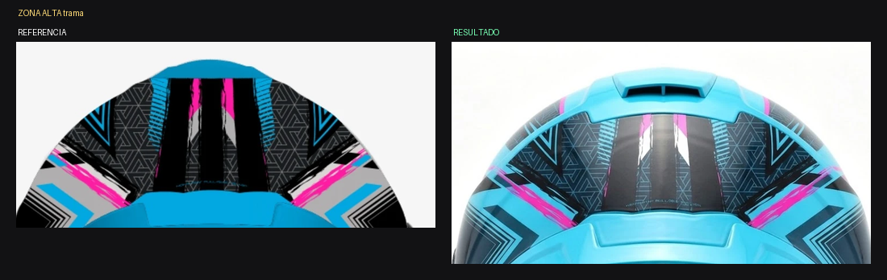

# ANÁLISIS — Kratos Dakota ROJO / GRIS / NEGRO — Vista C trasera

Fecha: 2026-07-30 · Estado: ❌ **El rojo desapareció y todo colapsó a grises**

*Referencia vs. resultado*

*Zona alta: el fondo negro se levantó y la trama perdió contraste*

*Panel del spoiler: debía ser ROJO INTENSO y salió GRIS*

*Banda baja con EDGE y el sello DOT*

## Medición

| Color | Referencia | Resultado | Desvío |
|---|---|---|---|
| **ROJO** | **4 %** | 2 % | **−2** |
| **NEGRO** | **32 %** | 27 % | **−5** |
| **BLANCO** | **15 %** | 10 % | **−5** |
| **GRIS** | **11 %** | 8 % | **−3** |
| tonos intermedios | 37 % | **52 %** | **+15** |

## Lo que se cumplió ✅
- Silueta real ancha, no la del dibujo.
- Extractor superior, ranuras, tornillo central, pieza ranurada baja.
- Cuello con acolchado, malla, dos lengüetas rojas del ERS y correa.
- Banda baja con "EDGE" completo y bien escrito.
- Sello DOT presente. Las dos "X40" presentes.
- Simetría correcta.
- Monocromía respetada en la zona alta.

## Lo que falló ❌
1. **EL PANEL DEL SPOILER SALIÓ GRIS Y DEBÍA SER ROJO INTENSO.** Es el
   defecto más visible: la única masa de color de la variante
   desapareció.
2. **Los tonos intermedios subieron 15 puntos** (37 % → 52 %): todo se
   apelotonó en grises medios sin separación.
3. **El negro base se levantó** (−5 pts): la zona alta perdió su fondo.
4. **El blanco cayó 5 puntos:** los encuadres angulares se agrisaron.
5. **El rojo de acento casi desapareció** de los filetes y las marcas.

## Recomendación
EDICIÓN. La geometría y los textos están perfectos; hay que pintar el
panel de rojo y recuperar la separación de tonos.
