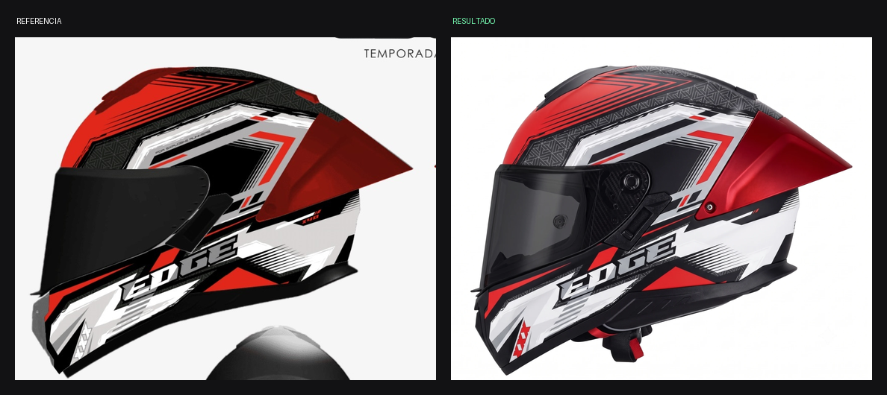
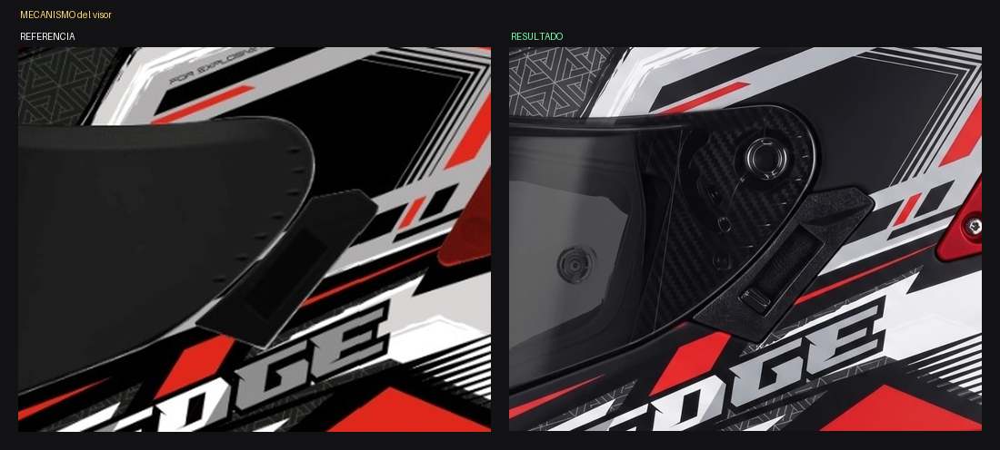

# ANÁLISIS — Kratos Dakota ROJO / BLANCO / NEGRO — Vista B lateral

Fecha: 2026-07-30 · Estado: ⚠️ **No cumple: reparto de color desviado + pieza inventada**

*Referencia vs. resultado*

*La clave: la pestaña ESTÁ DIBUJADA en la ilustración (izq.) y el generador la convirtió en una pieza física con ranura (der.)*

## Medición — reparto de superficie por color

| Color | Referencia | Resultado | Desvío |
|---|---|---|---|
| NEGRO | **54 %** | 50 % | −4 |
| BLANCO | **14 %** | 12 % | −2 |
| ROJO | **12 %** | 18 % | **+6** |
| GRIS | **8 %** | 15 % | **+7** |

## Diagnóstico

1. **Sobra rojo (+6 pts) y sobra gris (+7 pts).** El rojo invadió zonas
   que en la referencia son negras o blancas, y la malla triangular
   gris creció y se aclaró hasta volverse protagonista.
2. **La pestaña bajo el visor volvió a aparecer, y ahora como PIEZA
   FÍSICA con ranura y sombra propia.**

### El error de diagnóstico que veníamos arrastrando

El prompt actual dice que el generador "inventó" la pieza al interpretar
una masa oscura del gráfico. **Eso es falso.** El zoom lo prueba: la
pestaña negra angular **está DIBUJADA en la propia ilustración**,
colgando del borde del visor.

El generador no inventa nada: **copia fielmente la ilustración**, que es
la autoridad de gráfico declarada. Y como el prompt le dice "las masas
oscuras son pintura plana", el generador resuelve la contradicción de la
peor manera: la dibuja igual, pero como pieza con volumen.

→ El bloque hay que reescribirlo declarando el **conflicto entre las dos
imágenes**, igual que se hizo con el carbono de la placa y las ranuras
traseras.

## Correcciones aplicadas al prompt

1. Bloque de conflicto reescrito: la pestaña está en la ilustración, es
   un error del dibujo, no se dibuja.
2. Reparto de color con **porcentajes numéricos** en vez de adjetivos.
3. Tope explícito al rojo y a la malla gris.

## Lección

Antes de culpar al generador de "inventar", verificar si el elemento
está en la ilustración. Si está, el problema es que falta declarar el
conflicto — no que el generador alucine.
