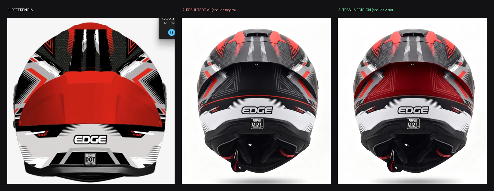
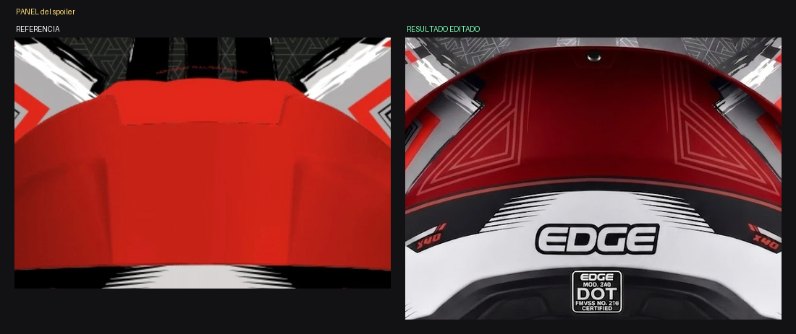
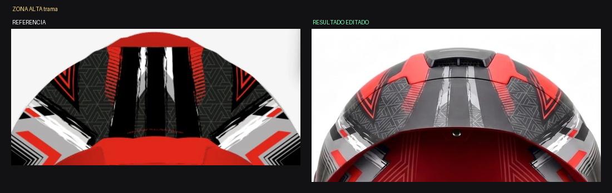
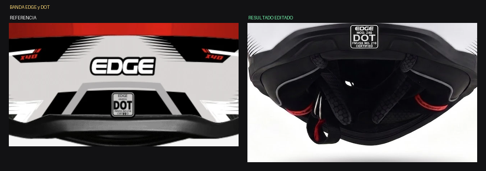

# ANÁLISIS — Kratos Dakota ROJO / BLANCO / NEGRO — Vista C trasera

Fecha: 2026-07-30 · Estado: ⚠️ **Casi — el rojo salió vino y falta blanco**

*Referencia / resultado v1 (spoiler negro) / resultado tras la edición*

*Panel del spoiler: pasó de negro a VINO, debía ser ROJO INTENSO*

*Zona alta: el blanco de los encuadres se perdió*

*Banda baja con EDGE y el sello DOT*

## Medición

| Color | Referencia | Resultado v1 | Resultado editado |
|---|---|---|---|
| ROJO | **35 %** | 7 % | 14 % |
| NEGRO | 35 % | 54 % | 37 % |
| BLANCO | **18 %** | 16 % | 15 % |
| GRIS | 11 % | 22 % | 20 % |
| tono parásito (vino) | 2 % | 2 % | **14 %** |

## Lo que se cumplió ✅
- Silueta real ancha, no la del dibujo.
- Extractor superior, ranuras, tornillo central, pieza ranurada baja.
- Cuello con acolchado, malla, dos lengüetas rojas del ERS y correa.
- Banda blanca baja con "EDGE" completo y bien escrito.
- Sello DOT presente. Las dos "X40" presentes.
- Simetría correcta.
- La edición SÍ pintó el panel del spoiler (antes era negro).

## Lo que falló ❌
1. **El panel del spoiler salió VINO OSCURO, no ROJO INTENSO.** El rojo
   real pasó de 7 % a solo 14 %, contra el 35 % de la referencia.
   Apareció además un 14 % de tono vino que no está en la paleta.
2. **Sobra gris (+9 pts)** y **falta blanco (−3 pts)**: los encuadres
   angulares blancos de la zona alta se volvieron grises.
3. **El acento rojo del gráfico casi desapareció** de la zona alta.

## Recomendación
EDICIÓN. La geometría y los textos están perfectos; solo hay que subir
el rojo y recuperar los blancos.
