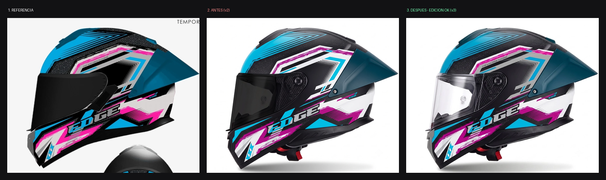
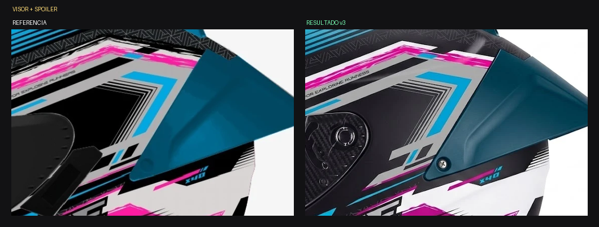
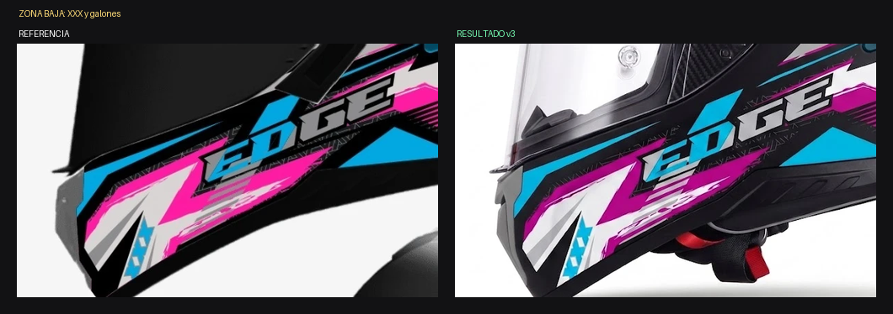

# ANÁLISIS — Kratos Dakota CELESTE / MAGENTA — Vista B lateral

Fecha: 2026-07-30 · Estado: ✅ **APROBADO — caso de éxito del lote**

*Referencia / antes (v2) / después de la edición (v3)*

*Visor y spoiler*

*Zona baja con las XXX y los galones*

## Historial

| Versión | Qué pasó |
|---|---|
| v1 | Colores cruzados: spoiler celeste brillante en vez de petróleo. Error del prompt. |
| v2 | Regeneración: forma correcta, 5 desvíos de tono |
| v3 | **Edición: los 5 corregidos de una pasada** ✅ |

## Verificación de la v3

| Cambio pedido | Resultado |
|---|---|
| Celeste turquesa → azul cyan medio | ✅ |
| Magenta violeta → fucsia | ✅ (resto leve de violeta) |
| Pieza extractora superior negra → petróleo del spoiler | ✅ |
| Banda "FOR EXPLORING RUNNERS" blanca → gris medio | ✅ |
| Deflector frontal negro → gris medio | ✅ |
| Geometría, piezas, encuadre, logo, fondo intactos | ✅ |
| Ninguna pieza inventada bajo el visor | ✅ |
| Microtipografía legible (única vez en el lote lateral) | ✅ |
| Visor: debía quedar NEGRO OPACO | ❌ salió transparente (RGB 242,241,246 vs. 19,19,19) |

## Único pendiente
El visor volvió a transparente. Micro-edición registrada en el hilo.

## Por qué funcionó — el patrón replicable
1. Declarar que la forma ya está bien y que NO es una regeneración.
2. Cambios NUMERADOS, uno por bloque.
3. Nombrar la pieza por su nombre físico, no por ubicación vaga.
4. Decir qué está mal Y la operación a aplicar.
5. Criterio de rechazo por cambio.
6. Escala de tonos numerada de oscuro a claro + regla de conteo.
7. Relaciones entre piezas ("son GEMELOS de color").
8. Bloque explícito de lo que NO se toca, nominando cada pieza.
