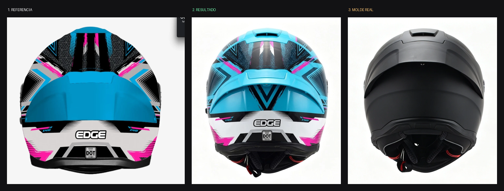
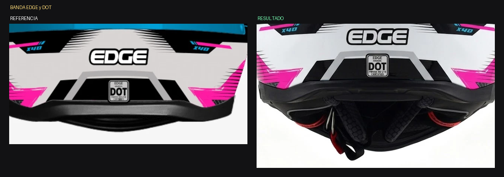

# ANÁLISIS — Kratos Dakota CELESTE / MAGENTA / BLANCO — Vista C trasera

Fecha: 2026-07-30 · Estado: ❌ **No cumple — el celeste invadió la zona alta**

*Referencia / resultado / molde real*

*Zona alta: el defecto principal — el fondo negro y la trama gris desaparecieron*

*Banda baja: acá sí cumplió, y el sello DOT salió legible por primera vez*

## Medición — reparto de superficie por color

| Color | Referencia | Resultado | Desvío |
|---|---|---|---|
| CELESTE | 34 % | 35 % | ok en total, **mal distribuido** |
| NEGRO | **32 %** | 27 % | −5 |
| BLANCO | **15 %** | 10 % | −5 |
| GRIS | **11 %** | 8 % | −3 |
| MAGENTA | 4 % | 3 % | −1 |
| "petróleo" | 1 % | **10 %** | +9 (celeste oscurecido por sombra) |

## Diagnóstico

**El celeste no aumentó en cantidad: se corrió de lugar.**

En la referencia la ZONA ALTA es mayoritariamente **NEGRA**, con:
- trama de MALLA TRIANGULAR GRIS sobre ese negro,
- encuadres angulares concéntricos NEGROS y BLANCOS,
- galones CELESTES solo en los extremos laterales,
- trazos MAGENTA verticales en el centro.

En el resultado toda esa zona alta se pintó de **CELESTE PLANO**: el
fondo negro desapareció, la malla gris casi no se ve, los encuadres
blancos se perdieron y la densidad gráfica colapsó.

El celeste sigue ocupando el mismo 35 % de superficie, pero está en el
lugar equivocado: debía estar en el panel central del spoiler y en los
galones laterales, no cubriendo toda la calota.

## Lo que SÍ cumplió ✅

- Silueta real ancha con hombros marcados (no copió la del dibujo).
- Extractor superior, ranuras, tornillo central, pieza ranurada baja.
- Cuello con acolchado, malla, **dos lengüetas rojas del ERS** y correa.
- Banda blanca baja con el logotipo "EDGE" completo y bien escrito.
- **El sello DOT salió LEGIBLE**: "FMVSS NO 218 CERTIFIED". Primera vez
  en todo el lote.
- Marcas "X40" a ambos lados, presentes y legibles.
- Simetría respecto del eje central.

## Lo que falló ❌

1. **El celeste invadió la zona alta** y borró el fondo negro.
2. **La malla triangular gris casi desapareció.**
3. **Los encuadres angulares blancos se perdieron.**
4. **Densidad gráfica colapsada**: la zona alta quedó vacía comparada
   con la referencia.
5. **Acabado brillante** en vez de mate.

## Lección

Declarar el color de una zona ("celeste en el panel central") no basta
si no se declara además **qué color es el FONDO de esa zona**. Sin fondo
declarado, el generador extiende el color de acento a toda la superficie.
