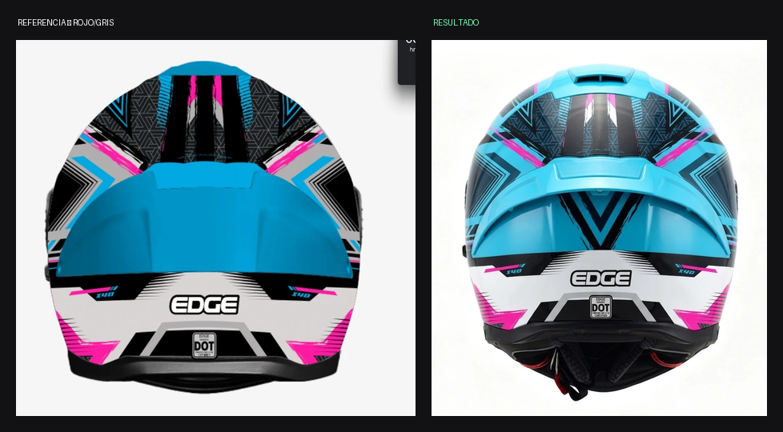

# DIAGNÓSTICO COMÚN — LAS VISTAS TRASERAS (Vista C) — Kratos Dakota

Fecha: 2026-07-30 · Estado: ❌ **Las 4 variantes fallan del mismo modo**

Casos analizados: CELESTE/MAGENTA, ROJO/BLANCO/NEGRO, AZUL/ROJO/BLANCO,
ROJO/GRIS. El patrón de error es idéntico en las cuatro.

---

## Las imágenes

*CELESTE/MAGENTA — referencia / resultado / molde real*

*ROJO/BLANCO/NEGRO — referencia / resultado v1 / resultado tras la edición*

*AZUL/ROJO/BLANCO — referencia vs. resultado*

*ROJO/GRIS — referencia vs. resultado*

---

## Medición — reparto de superficie por color

| Variante | | NEGRO | BLANCO | GRIS | Color dominante | Tono intermedio parásito |
|---|---|---|---|---|---|---|
| CELESTE | ref | **32 %** | **15 %** | **11 %** | 34 % | 1 % |
| CELESTE | res | 27 % | 10 % | 8 % | 35 % | **10 %** (petróleo) |
| AZUL | ref | **32 %** | **15 %** | **11 %** | 34 % | 1 % |
| AZUL | res | 27 % | 10 % | 7 % | 37 % | **12 %** (marino) |
| ROJO/BLANCO | ref | **35 %** | **18 %** | **11 %** | 35 % | 2 % |
| ROJO/BLANCO | res | 37 % | 15 % | 20 % | 14 % | **14 %** (vino) |
| ROJO/GRIS | ref | **32 %** | **15 %** | **11 %** | — | 37 % |
| ROJO/GRIS | res | 27 % | 10 % | 8 % | — | **52 %** |

## EL PATRÓN — es siempre el mismo

En las cuatro variantes pasa exactamente esto:

1. **El NEGRO cae ~5 puntos** (32 % → 27 %).
2. **El BLANCO cae ~5 puntos** (15 % → 10 %).
3. **El GRIS cae ~3 puntos** (11 % → 8 %).
4. **Aparece un TONO INTERMEDIO PARÁSITO del 10-14 %** que en la
   referencia no existe: petróleo en la celeste, marino en la azul,
   vino en la roja.

### La causa

**El color dominante se derrama sobre el fondo negro de la zona alta.**
Al recibir la sombra propia del casco, ese color derramado se oscurece
y genera un tono intermedio que nadie pidió.

Y al cubrir el fondo negro, se llevan puesta la **trama gris** y los
**encuadres blancos**, que solo existen POR CONTRASTE contra ese negro.
De ahí la caída simultánea de negro, blanco y gris.

### Por qué el prompt actual lo permite

El BLOQUE 2 dice *"COLOR X en el panel central grande de la zona del
spoiler y en las masas dominantes de la parte alta"*.
**Nunca declara qué color es el FONDO de la zona alta.** Sin fondo
declarado, el generador extiende el color dominante a toda la superficie.

## La corrección

Reescribir el BLOQUE 2 separando **FONDO** de **FIGURA**, con
porcentajes de reparto y un tope explícito al color dominante.

## Lección

Declarar el color de una zona no basta si no se declara además **qué
color es el FONDO de esa zona**. Y hay que prohibir explícitamente los
tonos intermedios: "solo existen los N colores de la paleta; si aparece
un tono a medio camino entre dos, está MAL".
