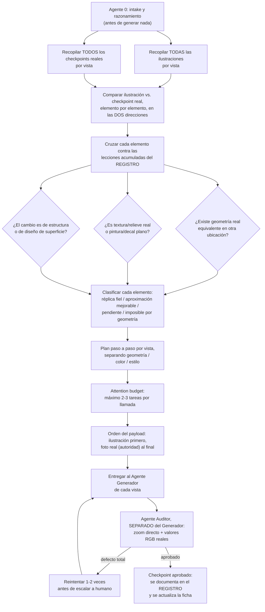

# Fichas de adaptación — cómo funciona esta carpeta

Acá vive el **estado actual de verdad** de cada molde+licencia y de cada
variante. No es un log: es la foto de cómo están las cosas HOY.

## La distinción con el REGISTRO (leer antes de tocar nada)

El [`REGISTRO-DE-ANALISIS.md`](../REGISTRO-DE-ANALISIS.md) tiene una regla no
negociable: *"nunca se crea un archivo suelto nuevo para un análisis"*. Estas
fichas **no la violan, porque no son análisis**. La diferencia:

| | REGISTRO | Ficha |
|---|---|---|
| Qué contiene | qué **pasó** el día X | qué es **cierto hoy** |
| Orden | cronológico | por objeto (molde / variante) |
| Se escribe | se apenda, nunca se edita hacia atrás | se sobrescribe |
| Pregunta que responde | "¿qué aprendimos?" | "¿en qué estado está esto?" |

Un análisis nuevo sigue yendo al REGISTRO como siempre. La ficha se actualiza y
**linkea** a esa entrada, sin copiar el contenido. Cero duplicación: cada
documento aporta una forma distinta sobre la misma materia.

## Los dos niveles, y por qué

**Nivel 1 — DELTA de molde+licencia** (`DELTA-<molde>-<licencia>.md`)
Los conflictos entre la ilustración y el molde real. **No dependen del
colorway.** Verificado empíricamente: los 4 conflictos declarados en los 15
prompts de Kratos·Dakota son idénticos en las 5 variantes, palabra por palabra.

**Nivel 2 — FICHA de variante** (`<NN>-<nombre>.md`)
Lo que sí es propio del colorway: el mapa de color pieza por pieza, el estado
por vista, los reintentos y el veredicto del auditor.

> **Por qué separado:** si el delta se copiara dentro de cada ficha, habría que
> corregirlo en N lugares cuando cambia. Eso es exactamente el bug que ya pasó
> con la Lección 20 del REGISTRO: la pestaña bajo el visor se creyó aleatoria,
> se corrigió en un lugar y la conclusión vieja quedó viva en otro. El delta se
> escribe **una sola vez** y las fichas lo linkean.

## El pipeline que gobierna estas fichas

Cada sección de las fichas es un nodo de este grafo. El Agente 0 razona en este
orden, y lo que produce queda escrito acá — no se pierde en el hilo de trabajo.

Nodos → dónde se escriben:

| Nodo | Dónde vive |
|---|---|
| `G1` `G2` | DELTA § Inventario de insumos |
| `CMP` `RULES` `R1-R3` `CLASS` | DELTA § Tabla delta y § Clasificación |
| `PLAN` `BUDGET` `ORDER` | Ficha § Plan por vista |
| `OUT` | archivos de prompt en `../<molde>-<licencia>/` |
| `QA` `RETRY` | Ficha § Estado por vista (columna reintentos) |
| `DONE` | entrada nueva en el REGISTRO + ficha actualizada |

## Orden de trabajo para una licencia nueva

1. Llenar el **DELTA** primero. Sin delta cerrado no se escribe ningún prompt.
   (Regla general del REGISTRO: *"antes de escribir cualquier prompt de
   adaptación, hacer el delta ilustración-vs-molde real y declarar TODOS los
   conflictos, en las dos direcciones"*.)
2. Copiar `00-PLANTILLA-VARIANTE.md` una vez por colorway.
3. Llenar el mapa de color **mirando la ilustración pieza por pieza**, nunca
   infiriéndolo del nombre de la variante (Lección 9).
4. Recién ahí, escribir los prompts por vista.

## Índice

| Delta | Molde | Licencia | Variantes | Estado |
|---|---|---|---|---|
| [`DELTA-kratos-dakota.md`](DELTA-kratos-dakota.md) | EDGEPRO Kratos | Dakota | 5 | delta cerrado · 2 acciones pendientes |

| Ficha | Variante | Estado |
|---|---|---|
| [`05-celeste-magenta.md`](05-celeste-magenta.md) | Dakota 05 Celeste/Magenta/Blanco | 🟡 B aprobada (reserva menor) · C rechazada |
| [`03-rojo-gris.md`](03-rojo-gris.md) | Dakota 03 Rojo/Gris/Negro | 🔴 C rechazada dos veces (confusión del spoiler) |
| — | 01, 02, 04 pendientes de crear | — |

## Plantillas

- [`00-PLANTILLA-VARIANTE.md`](00-PLANTILLA-VARIANTE.md) — ficha de colorway
- [`00-PLANTILLA-DELTA.md`](00-PLANTILLA-DELTA.md) — delta de molde+licencia
