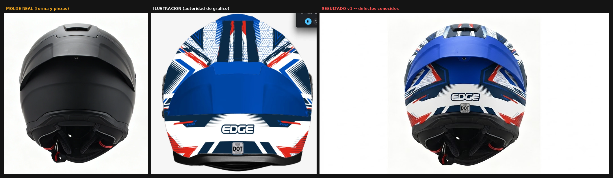

# ESTADO — Variante 01 · Dakota AZUL / ROJO / BLANCO · Vista C (trasera)

> Es la **Entrada 01** del `REGISTRO-DE-ANALISIS.md` — el primer resultado del lote,
> ya documentado como *"aprobado con reservas, regenerar con prompt v2"*. Esta página
> retoma esa auditoría, confirma que la corrección v2 ya está aplicada en el archivo
> de generación, y encuentra un defecto sistémico que la v2 no corrigió.
>
> Índice: [`../../indice-adaptaciones.md`](../../indice-adaptaciones.md)

**Fecha de este cierre:** 2026-07-31 · **Estado:** 🟡 pasada 3 ejecutada, corrección v4 lista, sin ejecutar

---

## 1. La secuencia

*Molde real · Ilustración (autoridad de gráfico) · Resultado v1 (el que está documentado en la Entrada 01)*

---

## 2. Los 4 defectos de la Entrada 01 — qué está corregido y qué no

| # | Defecto (Entrada 01, 2026-07-30) | ¿Ya corregido en el archivo de generación? |
|---|---|---|
| 1 | Ranuras pequeñas y pieza ranurada baja comidas por el gráfico | ⚠️ Parcial — desagregadas como chequeo 3b propio, sin bloque de recuperación dedicado |
| 2 | Densidad del gráfico simplificada | ✅ Bloque "PROHIBIDO SIMPLIFICAR EL GRÁFICO" agregado en v2 |
| 3 | Marcas "X40" de los costados omitidas | ✅ Declaradas obligatorias en v2 — pero ver § 3, quedan dudas de legibilidad |
| 4 | Acabado satinado en vez de mate | ✅ Bloque "ACABADO MATE ABSOLUTO — CRÍTICO" agregado en v2 |

La v2 ya está en el repo (`kratos-dakota/01-azul-vista-c-trasera.md`) y corrige 3 de
4. Lo que **no** corrigió, porque nadie lo había encontrado todavía, es esto:

---

## 3. Hallazgo nuevo — el mismo defecto sistémico de la variante 04

El archivo de generación de esta vista tiene **la misma contradicción de tres
puntas sobre el sello DOT** que encontré y corregí en
[`variantes/04-rojo-blanco-negro/`](../04-rojo-blanco-negro/ESTADO.md): un bloque
pide el sello "con el texto DOT", otro bloque más abajo prohíbe texto legible ahí, y
el checklist final vuelve a pedir "el sello DOT está presente y legible".

Confirma la hipótesis P4 que había dejado abierta en la variante 04: **es un defecto
copiado en (al menos) estos dos prompts del lote, probablemente en los 15**. Zoom
del resultado v1 de esta variante:

- "DOT" sale legible.
- La línea de arriba y la de abajo del sello salen **corruptas** (ilegibles),
  igual que "CENTIFIED" en la variante 04.

Sobre las marcas "X40" de los costados: en el resultado v1 se ven dos marcas
pequeñas rojas cerca de las flechas de ambos costados — **no tengo resolución
suficiente para confirmar si dicen "X40" con claridad o si también salieron
corruptas**. Lo marco como pendiente de zoom dedicado en el próximo resultado, no
como defecto confirmado.

---

## 4. Los dos prompts

Van completos en el chat (no como archivo adjunto), y quedan también guardados acá
para consistencia del registro:
[`prompts/01-edicion.md`](prompts/01-edicion.md) ·
[`prompts/02-regeneracion-completa.md`](prompts/02-regeneracion-completa.md)

**Por qué el de edición es más acotado que el de la variante 04:** de los 4
defectos, dos son ajustes acotables sin riesgo (mate, recuperar detalle de una
zona) y dos son microtipografía (sello, marcas X40). La Lección de la variante 04
mostró que **editar microtexto ya arruinado genera typos nuevos** en vez de
arreglarlo — por eso el sello y las marcas **no** van en el prompt de edición: van
en la regeneración completa, con el bloque corregido, o se componen en
post-producción.

---

## 5. Auditoría — Pasada 3 ejecutada (regeneración completa v3): mejora grande, un defecto nuevo

Se corrió el prompt de regeneración completa v3
([`prompts/02-regeneracion-completa.md`](prompts/02-regeneracion-completa.md), § 4)
sobre esta vista. Resultado:

| # | Ítem | Veredicto |
|---|---|---|
| 1 | Acabado mate | ✅ correcto — sin brillo ni "hot spot", coherente con el bloque "ACABADO MATE ABSOLUTO" |
| 2 | Colores y densidad del gráfico | ✅ correctos |
| 3 | Sello de homologación | ✅ correcto — rectángulo blanco vacío, sin texto |
| 4 | AZUL ROYAL en el spoiler = masas dominantes de la parte alta | ✅ **confirmado por medición de píxeles** — no hace falta tocar ese punto del bloque de color |
| 5 | **Extractor de ventilación superior** (rejilla en la punta de la calota, arriba del domo del spoiler) | ❌ **defecto nuevo** — salió en su gris/negro original del molde, sin el gráfico azul encima; se ve como un parche sin terminar en la punta del casco |

La mejora es grande: de los defectos anteriores (§ 2 y § 3), esta pasada corrige el
acabado y confirma el punto del spoiler. Queda un solo defecto, nunca visto en las
pasadas anteriores.

---

## 6. Causa raíz del defecto del extractor — el mismo patrón de ambigüedad que la variante 04

Medí la ilustración real (`kratos-dakota/resultados/01-azul-vista-c-ILUSTRACION.webp`)
en la zona de la punta superior (caja aproximada x 0.42–0.58, y 0.02–0.10 de la
imagen): el RGB promedio ahí es **(41, 56, 103)** — un azul marino oscuro, **no**
gris. Es decir, la ilustración **no** muestra un extractor sin pintar en esa zona:
todo el tope está cubierto por el gráfico. La ilustración simplifica/absorbe el
extractor dentro del gráfico pintado, no lo muestra como pieza aparte sin pintar.

El prompt v3 (bloque "ZONAS QUE QUEDAN NEGRAS", § 4) dice que *"el interior de las
rejillas, ranuras y del extractor"* queda sin pintar, pero no aclara que la
**carcasa externa** del extractor sí recibe el gráfico. Esa ambigüedad hizo que el
generador dejara **toda la pieza** (carcasa incluida) en su gris/negro original del
molde, en vez de solo el interior de la rejilla — el mismo tipo de contradicción /
ambigüedad de bloque que se encontró y corrigió con el sello DOT en la
[variante 04](../04-rojo-blanco-negro/ESTADO.md) y en esta misma variante (§ 3),
ahora aplicado a una pieza de ventilación en vez de a un sello.

---

## 7. El prompt v4 — corrección del extractor

Standalone, parte del v3 (§ 4) y le aplica tres cambios puntuales, sin tocar nada
más del texto:

1. **Bloque nuevo**, agregado después de "ZONAS QUE QUEDAN NEGRAS", que declara el
   conflicto: la carcasa externa del extractor SÍ recibe el gráfico, solo el
   interior de la rejilla queda oscuro — con el fallo de la pasada 3 nombrado
   explícitamente como criterio de rechazo.
2. El ítem del extractor dentro de "ZONAS QUE QUEDAN NEGRAS" pasa de *"El interior
   de las rejillas, ranuras y del extractor"* a *"El interior de las rejillas,
   ranuras y del extractor (NO la carcasa externa del extractor, que sí lleva el
   gráfico pintado encima)."*
3. Chequeo nuevo 5d en "VERIFICACIÓN FINAL": *"¿La carcasa externa del extractor
   superior recibe el gráfico (no quedó en gris/negro sin pintar), y solo el
   interior de la rejilla se mantiene oscuro?"*

→ Archivo completo: [`prompts/03-regeneracion-completa-v4.md`](prompts/03-regeneracion-completa-v4.md)

---

## 8. Pendientes

| # | Pendiente |
|---|---|
| P1 | Ejecutar el prompt v4 ([`prompts/03-regeneracion-completa-v4.md`](prompts/03-regeneracion-completa-v4.md)) para corregir el extractor de ventilación superior |
| P2 | Confirmar con zoom dedicado si las marcas "X40" del resultado v1 son legibles o corruptas |
| P3 | Revisar el mismo bloque contradictorio del sello DOT en los 13 prompts restantes del lote (P4 de la variante 04, todavía abierto) |
| P4 | Revisar si el mismo tipo de ambigüedad de "carcasa vs. interior" existe en otros bloques "ZONAS QUE QUEDAN NEGRAS" del lote (extractores, rejillas, ranuras de otras variantes) |

---

## 9. Lección nueva

**"El interior no se pinta" es ambiguo sobre la carcasa externa de una pieza de
ventilación.** Cuando un bloque de "zonas que quedan negras" nombra una pieza
compuesta (extractor, rejilla) sin distinguir explícitamente su carcasa/marco
externo de su hueco/interior, el generador puede leerlo como "toda la pieza queda
sin pintar" y dejarla completa en el color del molde real, en vez de solo el hueco.
Hay que **declarar explícitamente si la CARCASA de una pieza de ventilación recibe
el gráfico o no** — no alcanza con decir "el interior no se pinta".
