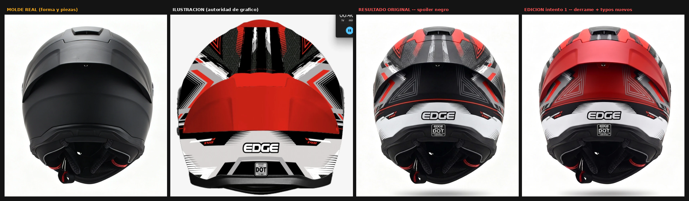
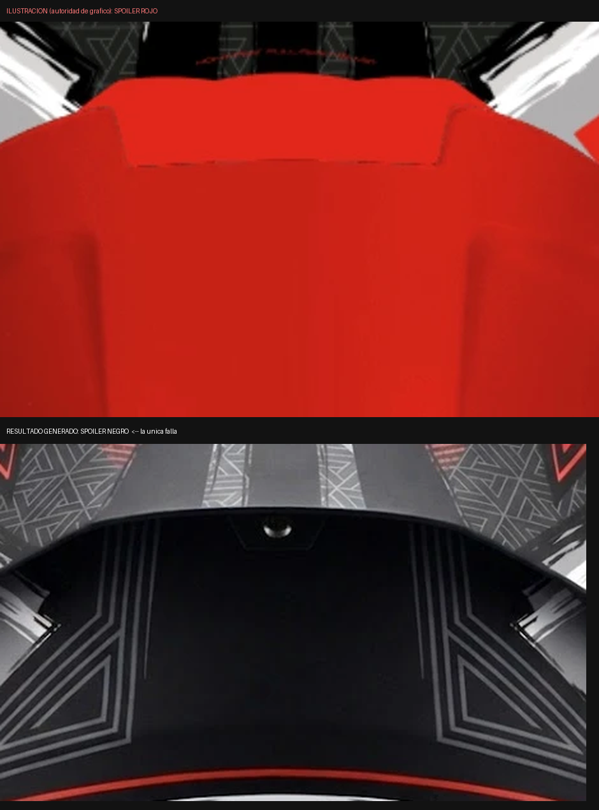
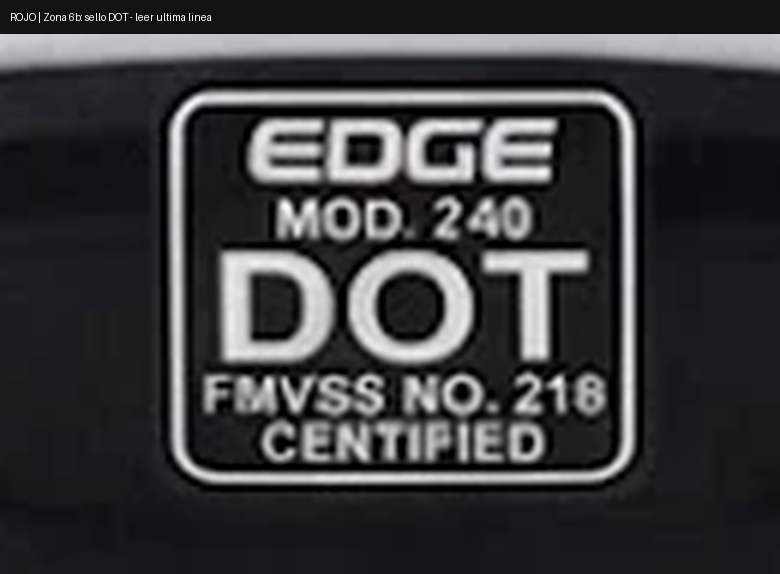
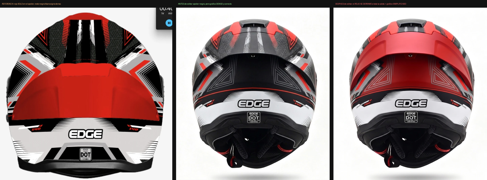

# ESTADO — Variante 04 · Dakota ROJO / BLANCO / NEGRO · Vista C (trasera)

> Cierra el pendiente que había quedado abierto en la **Entrada 02** del
> `REGISTRO-DE-ANALISIS.md`: *"verificar el texto exacto del sello DOT"* (Lección 12).
> Se auditó el intento de edición y se encontró la causa raíz.
>
> Índice: [`../../indice-adaptaciones.md`](../../indice-adaptaciones.md)

**Fecha de este cierre:** 2026-07-31 · **Estado:** 🟡 pasada 3 pendiente de ejecutar

---

## 1. La secuencia completa

*Molde real · Ilustración (autoridad de gráfico) · Resultado original · Intento de edición 1*

| Archivo real en el repo | Qué es |
|---|---|
| `kratos-dakota/resultados/00-kratos-real-trasera-CHECKPOINT.webp` | Molde real, autoridad de forma |
| `kratos-dakota/resultados/04-rojo-blanco-vista-c-ILUSTRACION.webp` | Ilustración, autoridad de gráfico |
| `kratos-dakota/resultados/04-rojo-blanco-vista-c-RESULTADO.webp` | Pasada 1 — generación |
| `kratos-dakota/resultados/04-rojo-blanco-vista-c-EDICION-intento1.webp` | Pasada 2 — edición (defectuosa) |

---

## 2. Auditoría — Pasada 1 (generación original)

| # | Ítem | Ilustración | Resultado | Veredicto |
|---|---|---|---|---|
| 1 | Color del panel del spoiler | Rojo intenso | **Negro** | ❌ |
| 2 | Densidad y corrección del resto del gráfico | — | Correcto, denso | ✅ |

| # | Ítem | Referencia | Resultado | Veredicto |
|---|---|---|---|---|
| 3 | Código de modelo del sello | (a confirmar, ver § 4) | **"MOD. 240"** | ❌ probable |
| 4 | Última línea del sello | "CERTIFIED" | **"CENTIFIED"** | ❌ |

**Decisión de la Entrada 02:** editar (no regenerar) — el color es un ajuste tonal
global y el resto del resultado es el mejor del lote junto con la 05.

---

## 3. Auditoría — Pasada 2 (intento de edición 1) · **cierra el pendiente**

| # | Ítem | Antes (pasada 1) | Después (edición) | Veredicto |
|---|---|---|---|---|
| 5 | Color del spoiler | Negro | Rojo | ✅ corregido |
| 6 | **Límite del rojo contra el gráfico circundante** | — | **Se derramó más allá del panel**, invadiendo zona de trama | ❌ **regresión nueva** |
| 7 | Densidad del gráfico circundante | Densa y correcta | **Simplificada / lavada** | ❌ **regresión nueva** |

| # | Ítem | Antes | Después | Veredicto |
|---|---|---|---|---|
| 8 | Última línea del sello | "CENTIFIED" | **"CERTIFIED"** | ✅ corregido |
| 9 | Código de modelo | "MOD. 240" | **"MOO. X40"** | ❌ **typo nuevo** ("MOD." → "MOO.") |
| 10 | Norma referenciada | "FMVSS NO. 218" (correcta) | **"FMVES NO. 218"** | ❌ **typo nuevo** ("FMVSS" → "FMVES") |

**Lectura:** la edición **arregló los dos defectos originales y generó cuatro
regresiones nuevas** (2 de derrame de color/gráfico + 2 de microtipografía). Esto es
exactamente el patrón de la Lección 3 del proyecto — *"al editar, el modelo puede
revertir o derramar una pieza que no estaba en la lista de cambios"* — aplicado acá
al color en vez de a una pieza. **El intento 1 queda descartado.**

---

## 4. La causa raíz — no es el generador, es el prompt

Fui al prompt de generación de esta vista
([`kratos-dakota/04-rojo-blanco-vista-c-trasera.md`](../../kratos-dakota/04-rojo-blanco-vista-c-trasera.md))
a buscar por qué el sello sigue saliendo mal en dos pasadas distintas, y **el prompt
se contradice a sí mismo**:

> **Línea ~100 — le pide que lo dibuje, con texto:**
> *"El SELLO / STICKER DE HOMOLOGACIÓN "DOT": rectángulo blanco pequeño con el
> texto "DOT", centrado en el eje... Va como en la ilustración."*
>
> **Línea ~167 — le prohíbe dibujar texto legible ahí:**
> *"EL SELLO DOT NO SE DIBUJA: no incluir calcomanías de homologación... Este
> generador siempre los escribe mal. Se componen después en post-producción."*

Un bloque pide un sello con "DOT" legible y posicionado; 67 líneas más abajo, otro
bloque prohíbe dibujar cualquier legible ahí. El generador no tiene cómo resolver
eso: el resultado — un sello **completo, con 5 líneas de texto y con dos de ellas
mal escritas** — es lo esperable de una instrucción contradictoria, no un fallo
aleatorio. Esto no estaba identificado en las 27 lecciones del `REGISTRO`: es una
categoría nueva.

**Corrección de raíz (Prompt 2, § 6):** eliminar el primer bloque y dejar solo la
prohibición, con la forma del sello declarada pero **sin ningún texto**, ni siquiera
"DOT".

---

## 5. Pendiente sin resolver — el código de modelo

No hay ninguna vista de este lote donde se vea el sello de la **ilustración** con
suficiente resolución para confirmar el código de modelo real. Lo que sí hay son dos
generaciones que lo escribieron distinto entre sí (`240` vs. `X40`), y las dos marcas
laterales del faldón (visibles en las tres imágenes de la secuencia) dicen
**"X40"** consistentemente.

**No lo doy por confirmado — lo marco como hipótesis a verificar:** el código de
modelo correcto es probablemente **"X40"**, coherente con las marcas laterales, y
`"MOD. 240"` de la pasada 1 es un tercer defecto que **el prompt del usuario para la
pasada 3 no corrige** porque no lo pedía. Lo agrego como CAMBIO 3, marcado como
condicional a esa confirmación.

---

## 6. Los dos prompts

### PROMPT 1 — Edición correctiva (pasada 3, sobre el RESULTADO ORIGINAL)

Corre sobre `04-rojo-blanco-vista-c-RESULTADO.webp` (pasada 1), **no** sobre el
intento 1 — se parte del último punto sin regresiones. Es el prompt que mandaste,
con **un cambio agregado (CAMBIO 3, condicional)** y el bloque de exclusión reforzado
en el punto que falló en el intento 1 (el derrame).

→ Archivo completo: [`prompts/01-edicion-spoiler-y-dot.md`](prompts/01-edicion-spoiler-y-dot.md)

Lo que se agrega respecto de tu versión:

- **CAMBIO 3 (nuevo, condicional):** `"MOD. 240"` → `"MOD. X40"`, *solo si se
  confirma contra la ilustración en alta resolución* — ver § 5.
- **NO SE TOCA 8 (nuevo):** el límite del rojo no avanza ni un píxel más allá del
  borde físico del panel — se nombra explícitamente el fallo del intento 1 como
  criterio de rechazo, no solo como regla general.

### PROMPT 2 — Parche al prompt de generación (corrige la causa raíz, § 4)

No es para correr ahora: es la corrección que hay que aplicar al archivo
`kratos-dakota/04-rojo-blanco-vista-c-trasera.md` **antes de la próxima vez** que se
regenere esta vista o cualquier otra del lote con el mismo bloque duplicado.

→ Archivo completo: [`prompts/02-parche-generacion-sello-dot.md`](prompts/02-parche-generacion-sello-dot.md)

---

## 7. Pendientes

| # | Pendiente |
|---|---|
| P1 | Ejecutar el Prompt 1 sobre el `RESULTADO` original (no sobre el intento 1) |
| P2 | Confirmar el código de modelo real contra la ilustración en alta resolución antes de aplicar el CAMBIO 3 |
| P3 | Aplicar el Prompt 2 (parche) al archivo de generación antes de cualquier regeneración futura de esta vista |
| P4 | Revisar si el mismo bloque duplicado del sello DOT está en los otros 14 prompts del lote (5 variantes × 3 vistas) — es probable que sea sistémico, no de esta vista sola |
| P5 | Actualizar la Entrada 02 del `REGISTRO-DE-ANALISIS.md` marcando el pendiente de Lección 12 como **cerrado**, con puntero a esta página |

---

## 8. Lección nueva

**El prompt puede contradecirse a sí mismo entre bloques que se escriben en
momentos distintos.** Cuando un bloque describe un elemento como "parte del
producto, a reproducir" y otro bloque, más abajo, lo prohíbe como "texto que el
generador siempre arruina", el resultado hereda lo peor de los dos: un elemento
completo, detallado, y mal escrito. **Antes de cada generación conviene un chequeo
de consistencia interna del prompt**, no solo del prompt contra la ilustración.
