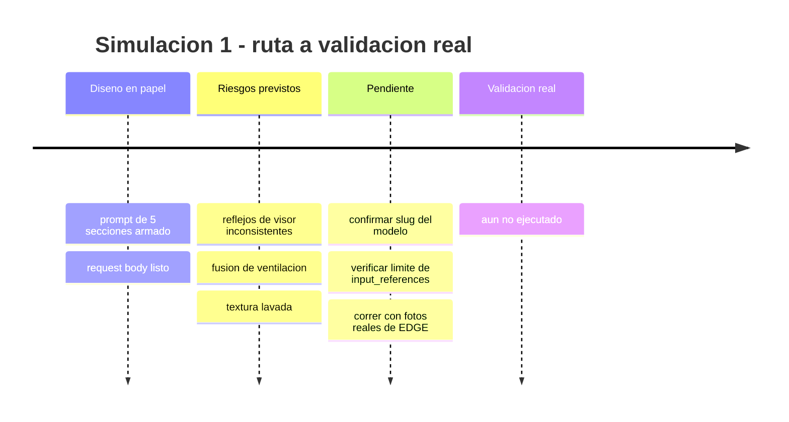
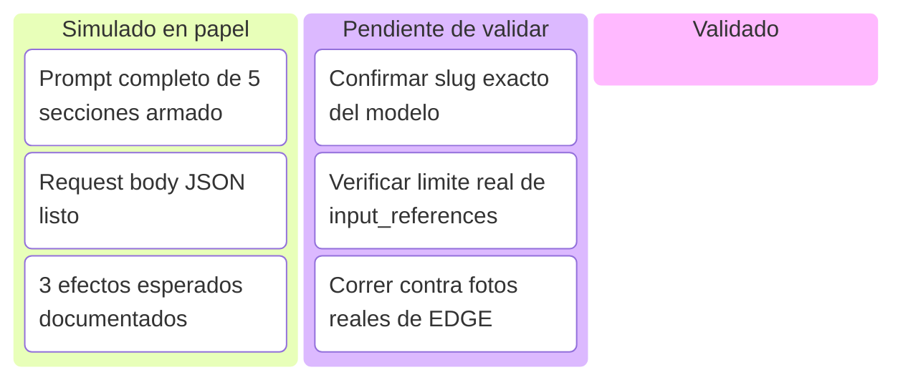
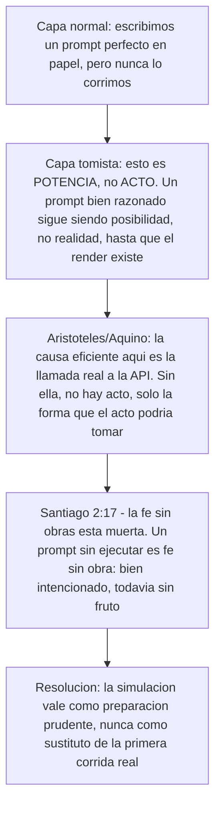
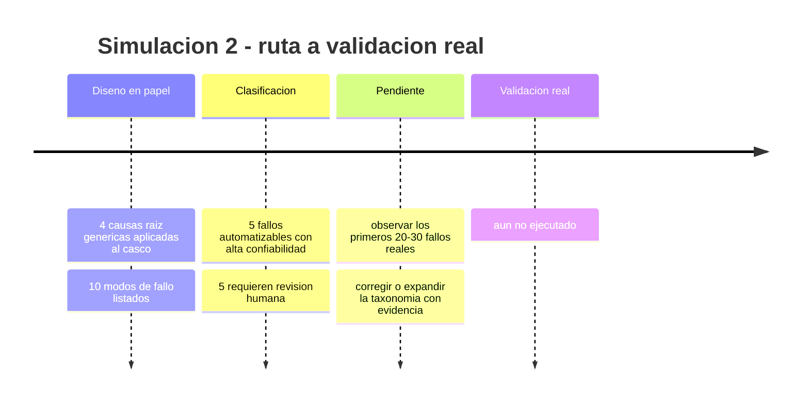
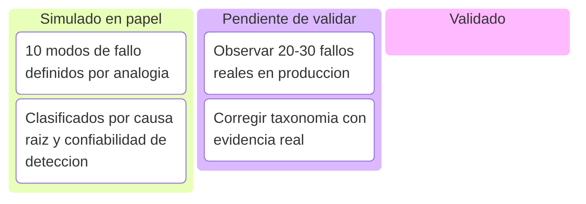
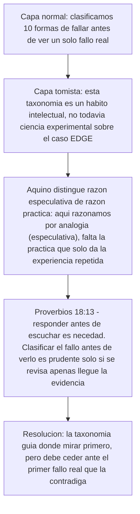
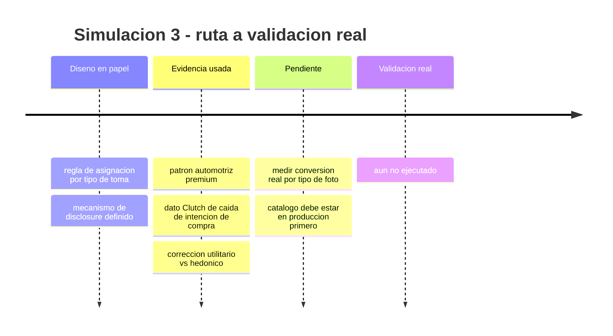
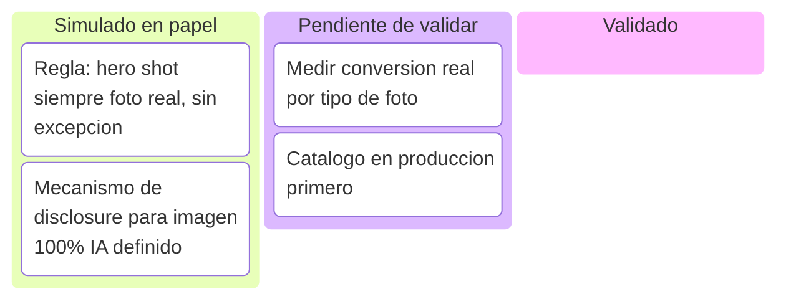
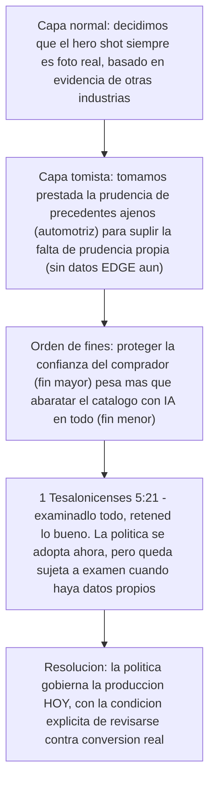

# Índice de simulaciones — Pipeline EDGE

**Qué es este documento:** el sub-índice de todas las simulaciones "ejecutadas en papel" del proyecto EDGE — se construye el artefacto real (prompt, política, taxonomía) y se analiza su efecto esperado usando la investigación ya validada, **sin llamar a la API real todavía**. No reemplaza la ejecución real: reduce el riesgo de que la primera ejecución real falle por un diseño evitable.

**Regla de este documento:** toda simulación lleva la marca 🧪 **SIMULACIÓN — no ejecutado contra la API/dato real**. Cuando una simulación se valide con ejecución real, se marca ✅ **VALIDADO** y se traslada como hallazgo real a `pipeline-edge-6-meses.md`.

**Cómo leer cada simulación:** cada una tiene 4 partes, todas plegables — abrí solo la que necesites en cada momento.
1. **Línea de tiempo** — de dónde salió la simulación a dónde falta llegar.
2. **Kanban** — estado de sus piezas: simulado / pendiente de validar / validado.
3. **Contenido completo** — el prompt, la política o la taxonomía, tal como se construyó.
4. **Lectura tomista** — la misma tensión (potencia vs. acto) narrada en tres capas, para no perder de vista que ninguna simulación es todavía una decisión tomada por la realidad.

---

<details>
<summary><strong>▸ Simulación 1 — Prompt de render Nano Banana Pro (Etapa 1)</strong></summary>

### Línea de tiempo



### Kanban



### Contenido completo

<details>
<summary>Ver prompt, request body y riesgos mitigados</summary>

🧪 Todo lo que sigue es simulación de razonamiento — no se ejecutó ninguna llamada real. Los valores geométricos son **placeholders inventados solo para este ejercicio**, deben reemplazarse por medidas reales de EDGE antes de producción.

**Request body (listo para usar de base, verificar el slug del modelo antes de correr real):**

```json
{
  "model": "google/gemini-3-pro-image-preview",
  "prompt": "(ver texto completo abajo)",
  "n": 4,
  "input_references": [
    { "image_url": ".../EDGE-M1_profile_90deg.jpg", "label": "silhouette_side_90" },
    { "image_url": ".../EDGE-M1_profile_45deg.jpg", "label": "silhouette_34_45" },
    { "image_url": ".../EDGE-M1_top_down.jpg", "label": "silhouette_top" },
    { "image_url": ".../EDGE-M1_sketch_on_mold.jpg", "label": "source_sketch_on_mold" }
  ],
  "aspect_ratio": "1:1",
  "quality": "high",
  "output_format": "png"
}
```

**Notas técnicas a verificar antes de correr real:** el slug exacto del modelo debe confirmarse contra `GET /api/v1/models` (no asumir el nombre). `output_format: png` es deliberado — JPEG introduce artefactos de compresión que contaminan el LPIPS con "desviación" que no viene del modelo. `n:4` genera variantes del mismo prompt (no batch real, ya confirmado). El límite de `input_references` por request no está confirmado — verificar antes de asumir que acepta 4.

**Prompt completo (5 secciones, mapeadas a la plantilla de Anchor Visual ya diseñada):** el prompt codifica (1) silueta maestra con 3 ángulos de referencia simultáneos, (2) 4 elementos no negociables con coordenadas numéricas exactas (spoiler: altura/posición %/ángulo; visor: ancho/alto/radio de esquina; ventilación: conteo/spacing exacto; mentonera: profundidad sin línea de partición visible), (3) elementos variables explícitos (color, gráficos, tinte), (4) instrucción de fidelidad de material (policarbonato semi-mate, 20-30% sheen, micro-textura, NO alto brillo tipo showroom), (5) restricciones de output (sin logos nuevos, sin props, fondo neutro).

**Riesgo que mitiga cada sección:**

| Sección | Sin esta instrucción... |
|---|---|
| Silueta con 3 ángulos simultáneos | El render se ve bien desde un ángulo pero falla desde otros — inconsistencia detectable de inmediato |
| Spoiler con coordenadas exactas | Las 4 variantes tendrían spoilers de formas distintas — ninguna sería el trade-dress real |
| Visor con radio de esquina explícito | El modelo redondea de más o hace la forma angular tipo casco de carreras — desviación que empuja el LPIPS sobre 0.35 |
| Ventilación con conteo exacto | El modelo funde vents o cambia el conteo — defecto fácil de detectar mentalmente, pero costoso en reintentos ($12/M tokens de output) |
| Mentonera sin línea de partición | Se renderiza como pieza separada, artefacto típico de render 3D genérico que no coincide con el molde real |
| Material semi-mate explícito | El modelo cae a su default de "casco genérico" de alto brillo — justo el fallo que hunde la intención de compra al 14% cuando se percibe como IA |

**3 efectos esperados de calidad (simulados, no observados):**

1. **Reflejos del visor probablemente inconsistentes entre variantes** — el prompt detalla el material del shell pero no del visor (policarbonato distinto, más reflectante). Mitigación: añadir subsección de material específica para el visor.
2. **Fusión o pérdida de conteo en la línea de ventilación** — detalle geométrico fino y repetitivo, el punto débil documentado de estos modelos. Aplica directo el hallazgo de DiffSpot: no se puede confiar en que un modelo de IA "revise" el conteo — la validación necesita LPIPS local sobre el crop de esa zona específica, no LPIPS global.
3. **Textura de policarbonato probablemente "se lava" hacia un acabado genérico** — no hay benchmark que confirme que Nano Banana Pro (elegido por identidad, no por material) resuelva esto solo con texto. Hipótesis abierta: pipeline de 2 pasos (Nano Banana Pro fija forma → FLUX.2 Pro refina solo textura con LPIPS objetivo 0.05-0.10).

🧪 **SIMULACIÓN** — prompt no ejecutado contra la API real. Debe validarse con imágenes reales de EDGE antes de usarse en producción.

</details>

### Lectura tomista

<details>
<summary>Ver lectura en 3 capas</summary>



</details>

</details>

---

<details>
<summary><strong>▸ Simulación 2 — Taxonomía de fallos de fidelidad de producto (Etapa 4)</strong></summary>

### Línea de tiempo



### Kanban



### Contenido completo

<details>
<summary>Ver los 10 modos de fallo</summary>

Borrador derivado por analogía razonada de las 4 causas raíz genéricas (default del modelo, estructura del prompt, distribución de entrenamiento, detección de plataforma), aplicadas a un objeto rígido de producto (casco) en vez de rostros/personas.

| # | Modo de fallo | Causa raíz | Señal de chequeo | Confiabilidad de detección |
|---|---|---|---|---|
| 1 | Aplanamiento/pérdida de curvatura de carcasa en ángulos 3/4 | Default del modelo | Comparación de contorno/silueta contra anchor | Requiere revisión humana |
| 2 | Deformación de línea/patrón de ventilación | Distribución de entrenamiento | LPIPS local + conteo/posición contra anchor | Mixta |
| 3 | Alteración de proporción del spoiler trasero | Estructura del prompt | Bounding-box del spoiler vs. anchor | Alta — automatizable |
| 4 | Elementos gráficos/logos no solicitados | Detección de plataforma / default | Chequeo de whitelist de colorway | Automatizable, pero revisión humana obligatoria por riesgo legal |
| 5 | Textura de policarbonato demasiado brillante/plástica | Default del modelo | Histograma de reflejos especulares vs. referencia | Requiere revisión humana |
| 6 | Deformación de apertura del visor | Distribución de entrenamiento | Medición geométrica vs. anchor | Parcial |
| 7 | Pérdida/alteración de la mentonera | Estructura del prompt | Chequeo geométrico condicionado al ángulo | Requiere revisión humana casi siempre |
| 8 | Recorte fuera del frame / composición inconsistente | Estructura del prompt | Bounding-box del casco completo en el canvas | Alta confiabilidad automática |
| 9 | Prompt-leakage (texto/instrucciones como gráficos) | Estructura del prompt / plataforma | OCR automático | Alta confiabilidad automática |
| 10 | Drift cromático del colorway | Default del modelo | Delta-E en LAB vs. anchor | Alta confiabilidad automática |

**Lectura clave:** los fallos automatizables con buena confiabilidad (#3, #4, #6 primera línea, #8, #9, #10) pueden ser gate de máquina; los que requieren revisión humana específica (#1, #5, #7, y matices de #2/#6) son exactamente el tipo de "diff fino" que el benchmark DiffSpot ya confirmó que ningún modelo de visión detecta bien.

🧪 **SIMULACIÓN** — taxonomía derivada por analogía razonada, no de fallos reales observados en renders de EDGE. Debe corregirse/expandirse con los primeros 20-30 fallos reales una vez existan.

</details>

### Lectura tomista

<details>
<summary>Ver lectura en 3 capas</summary>



</details>

</details>

---

<details>
<summary><strong>▸ Simulación 3 — Política de mezcla IA/físico en catálogo (Etapa 2)</strong></summary>

### Línea de tiempo



### Kanban



### Contenido completo

<details>
<summary>Ver la política completa</summary>

**Punto de partida:** no existe un benchmark publicado de "% máximo de catálogo generado por IA" para ninguna categoría de alta implicación (seguridad, automotriz, electrodomésticos, salud). Esto ya se investigó a fondo — es un vacío real de la industria, no un fallo de búsqueda. Por tanto, esta política no cita un estándar externo que no existe; construye una regla propia a partir de tres piezas de evidencia sólidas: (a) el patrón de mezcla real usado por marcas automotrices premium, (b) el dato cuantitativo de Clutch sobre caída de intención de compra, y (c) la corrección sobre el mecanismo utilitario vs. hedónico que determina cuándo ese rechazo se activa con más o menos fuerza.

**Regla de asignación por tipo de toma — DEBE ser foto real/física, sin excepción:**
- **Hero shot de cada SKU** (imagen principal de ficha de producto / portada de PDP y primer frame de listado). Ancla la percepción de veracidad de toda la galería.
- Cualquier toma que sirva como **prueba de seguridad o cumplimiento normativo** (etiqueta de homologación, certificación ECE/DOT visible, foto de la carcasa interior/EPS).

**Síntesis:** el precedente automotriz da la arquitectura de la mezcla, Clutch da la razón cuantitativa de proteger el hero shot, y la corrección utilitario/hedónico justifica abrir el resto de la galería a IA sin el mismo riesgo que en una categoría hedónica.

**Mecanismo de disclosure:** etiqueta discreta y consistente ("Render generado digitalmente") en toda imagen 100% IA, por principio de precaución — sin cifra propia verificada para EDGE, pero más seguro divulgar sistemáticamente que arriesgar percepción de engaño. El hero shot, al ser siempre foto real, no lleva etiqueta — su ausencia es en sí misma parte de la señal de máxima fiabilidad.

🧪 **SIMULACIÓN** — política derivada de precedentes de otras industrias y datos generales de consumidor, no de test A/B propio con clientes reales de EDGE. Debe validarse midiendo conversión real por tipo de foto una vez el catálogo esté en producción.

</details>

### Lectura tomista

<details>
<summary>Ver lectura en 3 capas</summary>



</details>

</details>

---

**Última actualización de este índice:** se actualiza manualmente cada vez que se cierra una simulación nueva o una se valida contra la API real — no es automático.
