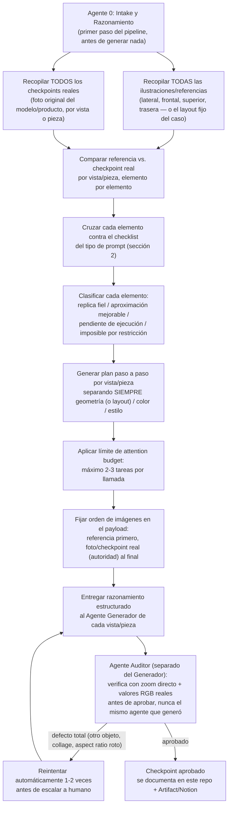

# Orquestación de agentes en paralelo — pipeline de generación/auditoría de imagen

[← Volver al índice del proyecto EDGE](../indice-proyecto-edge.md)

**Qué es esto:** la plantilla operativa para correr varios agentes en paralelo sobre distintos casos (cascos, tarjetas de specs, y lo que se sume después) y distintos tipos de prompt de generación/edición de imagen. No es un caso puntual — es el proceso que se reutiliza cada vez que se agrega un caso nuevo.

**Qué NO es esto:** un generador de imágenes. Esta sesión de Claude Code no tiene conectada una herramienta de edición tipo Nano Banana/Gemini — la generación real de píxeles se sigue corriendo donde ya se corre hoy (Nano Banana Pro vía OpenRouter, según `pipeline-edge-6-meses.md`). Lo que este documento y los agentes en paralelo aportan es **razonamiento, comparación, auditoría y documentación** antes y después de cada generación — el Agente 0, el plan por vista, y el Agente Auditor del diagrama de abajo.

---

## 1. Pipeline de roles



**Regla dura:** el Agente Auditor nunca es el mismo agente (ni la misma llamada) que el Agente Generador. Si no hay forma de separarlos en una ejecución dada, el resultado se marca `sin auditar`, no `aprobado`.

---

## 2. Tipos de prompt (taxonomía extensible)

Cada caso nuevo se clasifica en uno de estos tipos antes de armar el plan. Si no encaja en ninguno, se agrega un tipo nuevo con su propio checklist — no se fuerza a que encaje en uno existente.

### Tipo A — Transferencia de diseño gráfico sobre geometría/objeto real existente
Ejemplo: aplicar un diseño (manga/samurái, "The Godfather", etc.) sobre la carcasa real de un casco ya fabricado, por vista (lateral, frontal, superior, trasera).

Checklist de auditoría (Tipo A):
- [ ] **Geometría intacta** — silueta, proporciones, curvatura sin alterar entre checkpoint real y resultado.
- [ ] **Elementos físicos reales en su posición exacta** — ventilaciones, tornillos/remaches, hebilla, correa, mentonera, soporte de cámara, etc. — ni cubiertos ni movidos.
- [ ] **Visera/lente transparente y limpia** — sin tinte, sin sombra oscura cerca del pivote/bisagra, sin diseño aplicado encima.
- [ ] **Transición limpia** entre carcasa y piezas adyacentes (correa, acolchado) — sin línea negra ni gap visible.
- [ ] **Sin soporte/pole de estudio** visible, fondo plano y limpio según lo pedido.
- [ ] **Textura/relieve real vs. pintura/decal plano** — no confundir un relieve físico con un gráfico 2D superpuesto.
- [ ] **Cambio de superficie, no de estructura** — el prompt nunca debe pedir (ni el resultado mostrar) un cambio de forma del objeto.
- [ ] **Plan separado por capa**: geometría / color / estilo nunca se piden juntos en la misma instrucción.
- [ ] **Attention budget**: máximo 2-3 tareas por llamada de generación.
- [ ] **Orden de imágenes en el payload**: referencia de diseño primero, foto real (autoridad) al final.
- [ ] **Sesión de generación aislada por caso** — no generar dos cascos/piezas distintas en el mismo hilo/conversación de la herramienta de generación seguidos uno del otro. Hallazgo real (caso Vortex, `simulacion-11-vortex-verificacion.md`): con un prompt confirmado correcto, el generador sustituyó un ítem por el del caso inmediatamente anterior (Kratos) en la misma sesión — contaminación cruzada entre generaciones, no error de quién escribió el prompt. Empezar una sesión nueva por caso, o reforzar el prompt con "ignora cualquier lista usada en imágenes anteriores de esta sesión".
- [ ] **"Fuente de forma" y "fuente de diseño gráfico" separadas explícitamente cuando son imágenes distintas** — aplica sobre todo a la línea de licencias de marca (Marvel/DC/Paramount, etc.), donde el arte de referencia (mockup del diseño licenciado) casi siempre está aplicado sobre un casco genérico de catálogo, con proporciones distintas al molde real que se va a usar. Hallazgo real (caso Top Gun sobre molde azul, `simulacion-6c-top-gun.md`, Intento 4): sin esta separación explícita, el generador mezcló la forma del casco de la imagen de estilo (pico frontal, ventilaciones, pivote, curvatura de calota) con la del molde real, aunque el prompt solo pedía transferir el diseño gráfico. El prompt tiene que decir explícitamente cuál imagen es la única autoridad de forma y cuál es solo fuente de color/íconos/texto, y listar las piezas geométricas distintivas del molde real (forma exacta de pico, conteo y forma de ventilaciones, forma de la carcasa del pivote, curvatura de calota) para que el generador tenga algo concreto contra qué verificar.
- [ ] **Todo lo que está en el mockup de diseño es pintura plana, nunca una pieza física nueva** — cuando la fuente de diseño es una ilustración 2D, sus formas angulares, chevrones y paneles pueden leerse como relieves y el generador los materializa: agrega aletas, paneles elevados o salientes que no existen en el molde real. El prompt tiene que decir explícitamente qué piezas físicas tiene el casco (las de la foto del checkpoint, ni una más) y que todo elemento del diseño va pintado sobre superficie lisa, aunque en la ilustración parezca un volumen. Hallazgo real (livery EDGE, `simulaciones-cc/simulacion-30-edge-racing-livery.md`, Intento 2→3 de la vista trasera del Colorway 1): aparecieron aletas y paneles elevados inventados en la parte alta de la calota. Es la versión "en el otro sentido" del ítem ya existente de textura/relieve real vs. pintura plana.
- [ ] **Diseño gráfico solo sobre superficie pintada, nunca sobre piezas de plástico negro** — cuando el casco real tiene piezas de plástico negro sin pintar (ventilaciones, mentonera, spoiler, carcasa de pivote) además de la superficie pintada, el generador tiende a dibujar elementos del diseño 2D encima de esas piezas negras en vez de limitarlos a la zona pintada. El prompt tiene que prohibirlo explícitamente: "el diseño gráfico va SOLO sobre la superficie pintada, nunca sobre piezas de plástico negro; si un elemento cae cerca del límite, hay que recortarlo o desplazarlo". Hallazgo real (caso Top Gun sobre molde azul, `simulacion-6c-top-gun.md`, Intento 5→6): los chevrones dorados quedaron dibujados sobre una pieza de plástico negro del spoiler.
- [ ] **Ajuste puntual sobre un resultado ya aprobado = edición, no regeneración completa** — cuando ya se logró un resultado con geometría y diseño correctos y solo falta corregir un detalle chico (ej. la posición de un solo elemento), no repetir el prompt completo de generación (geometría + todas las reglas + todos los elementos) pidiéndole que "mantenga todo igual excepto X" — un prompt así vuelve a poner en juego toda la geometría desde cero en cada corrida, y sin la imagen real del resultado bueno como base de edición, la instrucción de texto "igual que antes" no tiene nada concreto de dónde partir. En su lugar, adjuntar SOLO la imagen del resultado ya aprobado y pedir una edición mínima de una sola tarea ("esta es una edición puntual, no una generación nueva — todo lo demás queda pixel por pixel igual, el único cambio es X"). Hallazgo real (caso Top Gun sobre molde azul, `simulacion-6c-top-gun.md`, Intento 7): un prompt de regeneración completa que solo cambiaba la posición del logo volvió a producir el mismo drift de geometría (pivote, ventilaciones) que ya se había corregido en el Intento 5 — mismo síntoma que el Intento 4, con causa raíz distinta a la de aquel caso. Se relaciona con la regla de "Attention budget" de arriba, pero es un hallazgo propio: no solo hay que limitar cuántas tareas van en un prompt, sino preferir edición sobre regeneración cuando la base ya es buena.
- [ ] **En un prompt de edición no alcanza con proteger lo que no se toca: hay que declarar también qué cambia DENTRO de la zona que sí se edita** — un prompt de edición típicamente enumera con mucho detalle todo lo que queda congelado (geometría, realismo, fondo, el resto del diseño) y después nombra la zona a corregir. Eso deja un agujero: sobre la zona nombrada el generador no tiene ninguna restricción, así que la lee como "esta zona la podés rehacer" y la vuelve a dibujar entera con su propia interpretación, devolviéndola simplificada — menos líneas, menos capas, patrones menos densos, textos chicos eliminados, formas reemplazadas por versiones más limpias. El prompt tiene que decir explícitamente que **dentro de la zona editada lo ÚNICO que cambia es el atributo puntual indicado** (el color de relleno, la posición, el tamaño) y que **todo su dibujo interno —líneas, texturas, textos, capas, cada trazo en su posición— se conserva idéntico**, con la analogía concreta de "seleccionar esa área en un editor de imagen y cambiarle ese atributo sin tocar ninguna de las capas de dibujo que están encima". Conviene cerrar además con una verificación final: comparar el resultado contra la imagen adjunta y confirmar que la única diferencia perceptible sea la pedida. Hallazgo real (livery de carreras EDGE, `simulaciones-cc/simulacion-30-edge-racing-livery.md`, Intento 2→3 de la vista lateral del Colorway 2): un pedido de recolorear el interior de un rombo de rojo a negro volvió con toda la zona alta del lateral redibujada y simplificada —marco geométrico concéntrico reemplazado por una forma hexagonal con menos líneas, patrón de malla reducido, texto chico desaparecido— y encima sin el cambio de color pedido. Es el complemento del ítem anterior: elegir edición en vez de regeneración no basta si la edición no está acotada a un atributo. **Y hay una contracara que hay que pedir en la misma frase: además de blindar el dibujo, hay que exigir COBERTURA COMPLETA del cambio dentro de la zona.** Acotar el cambio a un atributo evita que el generador rehaga la zona, pero no garantiza que la aplique entera: si el cambio es un recoloreo, el generador tiende a pintar el fondo dominante y saltearse grupos de elementos que también estaban en el color viejo. El prompt tiene que decir que **ninguna isla, ningún bloque ni ningún grupo de elementos —barras, franjas, líneas, formas— puede quedarse con el color anterior**, y **nombrar explícitamente las excepciones que sí lo conservan**, para que no queden implícitas. Conviene desdoblar la verificación final en dos chequeos: que no cambió ningún dibujo, y que no quedó ningún rastro del color viejo dentro de la zona salvo las excepciones declaradas. Hallazgo real (mismo caso, `simulaciones-cc/simulacion-30-edge-racing-livery.md`, Intento 3→4 de la vista lateral del Colorway 2): con el bloque de "la zona recoloreada tampoco se redibuja" el dibujo se conservó perfecto —marco concéntrico, malla con su densidad, texto chico, capas de líneas— pero el recoloreo salió incompleto: un grupo de barras horizontales en la parte baja-izquierda de la zona se quedó con el rojo viejo en vez de pasar a negro, porque el prompt describía la zona de forma global ("el interior del rombo") sin exigir cobertura total ni declarar que la única excepción roja era la flecha/chevron.
- [ ] **El generador no es determinístico — un solo resultado no basta para juzgar un prompt** — el mismo prompt, corrido dos veces sin cambiar una letra, puede dar resultados de geometría/calidad distinta entre una corrida y otra. Esto significa que no se puede concluir "este cambio de prompt arregló/rompió la geometría" a partir de una sola corrida de cada versión — parte de la diferencia observada puede ser variación aleatoria del generador, no un efecto real del texto. Antes de descartar un prompt como fallido (o de confirmarlo como bueno), conviene correrlo 2-3 veces tal cual está: si sale bien la mayoría de las veces, el prompt está OK y alcanza con reintentar hasta lograr una corrida limpia; si sale mal la mayoría de las veces, ahí sí vale la pena seguir ajustando el texto. Hallazgo real (caso Top Gun sobre molde azul, `simulacion-6c-top-gun.md`, re-corrida del Intento 6): el mismo prompt exacto dio un resultado distinto al correrlo de nuevo, lo que obliga a releer con cautela toda una secuencia de intentos (4 a 11) donde cada cambio de texto se había interpretado como causa directa de una mejora o una falla.
- [ ] **Cuando la fuente de diseño es una ilustración/mockup vectorial 2D, hay que separar TRES ejes y no dos** — forma (del checkpoint fotográfico), contenido gráfico (del mockup) y **estilo de render / realismo de material (del checkpoint, nunca del mockup)**. La separación clásica de "fuente de forma" vs. "fuente de diseño gráfico" no alcanza cuando el arte de referencia es un dibujo vectorial plano y el checkpoint es una fotografía real: si el prompt no dice explícitamente que el ESTILO DE RENDER de la ilustración no se copia, el generador lo copia junto con el contenido y devuelve un dibujo vectorial plano —colores planos sin gradiente, sin microtextura de pintura, sin reflejos especulares ni sombras de estudio, bordes de software de diseño— en vez de una fotografía; y de paso contamina también la forma, tirando la geometría hacia la del mockup. El prompt tiene que exigir explícitamente un resultado FOTORREALISTA con el mismo tratamiento fotográfico del checkpoint (misma iluminación de estudio con sus sombras suaves, mismos reflejos especulares sobre las superficies curvas, misma microtextura de pintura, mismas texturas de materiales reales — fibra de carbono, tela de la correa, etc.) y aclarar que el diseño se aplica como PINTURA REAL sobre la superficie física, siguiendo la curvatura y recibiendo la luz de la escena, no como un dibujo plano pegado encima. Hallazgo real (livery de carreras EDGE, `simulaciones-cc/simulacion-30-edge-racing-livery.md`, Intento 2→3 del Colorway 1 vista lateral): el Intento 2 corrigió todos los defectos de contenido gráfico pendientes, pero devolvió una ilustración vectorial plana en vez de una foto del casco real, con el pico frontal/spoiler deformado hacia la forma triangular del mockup.
- [ ] **Toda regla nueva se propaga en el acto a los prompts de TODAS las vistas y colorways del mismo caso** — cuando durante la auditoría de una vista se descubre una regla nueva y se corrige su prompt, la corrección no se queda en esa vista: hay que copiarla inmediatamente a los prompts de las demás vistas (lateral, frontal, superior, trasera) y de los demás colorways/variantes del caso, incluidos los que viven en archivos separados y todavía están "pendientes de generar". Un caso de varias vistas no es una secuencia de problemas independientes: comparten checkpoint, comparten mockup y comparten generador, así que la causa raíz que hizo fallar a una vista va a hacer fallar a las otras exactamente igual. Si la propagación no se hace en el momento, el mismo defecto reaparece vista por vista, se gasta una corrida entera en redescubrirlo y se rehace un diagnóstico que ya estaba escrito unas líneas más arriba en el mismo documento. Conviene además dejar el pendiente marcado bien visible en los archivos hermanos que aún no se actualizaron, para que nadie los corra con el prompt viejo. Hallazgo real (livery de carreras EDGE, `simulaciones-cc/simulacion-30-edge-racing-livery.md`, Intento 3→4 del Colorway 1 vista trasera): el tercer eje de realismo de render se descubrió y se agregó al prompt de la vista **lateral**, pero nunca se copió al de la **trasera**, que siguió con la regla vieja de "DOS FUENTES, DOS ROLES" y sin bloque de fotografía — y la trasera volvió a devolver una ilustración vectorial plana, arrastrando además la silueta del mockup en vez de la del molde real, una regresión respecto de intentos anteriores de esa misma vista que ya lo habían logrado bien.
- [ ] **Cuando una PIEZA concreta toma su color de una fuente y su forma de otra, la separación de roles tiene que bajar al nivel de esa pieza** — declarar la separación de fuentes a nivel de la imagen completa ("la foto manda en la forma, el mockup manda en el contenido gráfico") alcanza para el objeto entero, pero **no** para la pieza puntual donde las dos fuentes se cruzan: si el prompt le dice al generador "el color de esta pieza viene del mockup" y "su forma viene de la foto real", el elemento recibe instrucciones de las dos a la vez y el generador **las promedia**, devolviendo una pieza híbrida que no es ni la del mockup ni la del molde real. El prompt tiene que darle a esa pieza un bloque propio que **desglose atributo por atributo qué sale de cada imagen** (forma, tamaño, perfil y borde de la foto; color, patrón o textura del mockup), **prohibir el promedio con esas palabras** ("no combinar, no promediar, no hibridar; ni entera, ni parcialmente, ni a medio camino"), **describir la forma real de la pieza con detalle** —cuánto sobresale, qué perfil tiene, cómo es su borde, cómo se integra al resto— en vez de solo nombrarla, y cerrar con una verificación explícita comparando esa pieza contra la foto del checkpoint antes de entregar. Hallazgo real (livery de carreras EDGE, `simulaciones-cc/simulacion-30-edge-racing-livery.md`, Intento 4→5 de la vista trasera del Colorway 1): con los 3 roles bien separados a nivel de imagen —el resto de la vista salió excelente, con realismo, silueta y livery completos— el **spoiler salió híbrido**: se quedó con el azul sólido del mockup, que era lo correcto, pero se trajo junto con el color su forma de ala grande y prominente, en vez del labio bajo, discreto e integrado que tiene en la foto del molde real.
- [ ] **Declarar la PROPORCIÓN y la relación FIGURA/FONDO del diseño, no solo qué colores lo componen** — un prompt puede nombrar correctamente todos los colores del livery y aun así devolver el diseño mal repartido, porque enumerar colores no dice **cuánta superficie** le toca a cada uno ni **cuál va encima de cuál**. Mientras el prompt razone zona por zona ("el interior de esta forma va en negro", "esta pieza va en rojo"), cada instrucción local puede ser correcta por separado y el resultado global igual quedar invertido: sin un techo declarado, el generador **expande el color de acento a superficies enteras** y **da vuelta la relación figura/fondo** —donde el diseño tiene fondo oscuro con líneas de acento finas encima, devuelve fondo de acento con líneas oscuras encima—. Hay que declarar la jerarquía explícitamente: cuál es la **superficie dominante** del objeto, cuál es el **color de acento minoritario**, **en qué lugares concretos (y en ningún otro) aparece ese acento**, que sumado todo ocupa **mucha menos superficie** que el dominante, y prohibir con esas palabras **expandirlo a superficies completas** e **invertir figura y fondo**. Ojo especial con las instrucciones de "subir la intensidad/saturación" de un color: sin un límite de superficie declarado, el generador lee "más color" como **más área**, no solo como más saturación. **Corolario, que es la otra mitad del mismo hallazgo: un detalle fino de un color solo sobrevive si el prompt declara contra qué fondo tiene que contrastar.** No alcanza con nombrar el detalle **en negativo**, como excepción de otra regla ("esta flechita conserva su rojo"): hay que describirlo **en positivo** —qué grosor tiene, qué elementos lo rodean, y sobre qué fondo se apoya— y decir que su legibilidad depende de ese contraste, prohibiendo engrosarlo, duplicarlo, convertirlo en masa o apoyarlo sobre un fondo de su mismo color. Hallazgo real (livery de carreras EDGE, `simulaciones-cc/simulacion-30-edge-racing-livery.md`, Intento 4→5 de la vista lateral del Colorway 2): con el dibujo blindado y el recoloreo ya completo, el resultado volvió con la calota superior y el pico frontal fundidos en una **masa roja continua** que ocupaba el tercio superior del casco, cuando en el mockup el cuerpo central del lateral es negro y el rojo es un acento; y la **única flecha roja delgada** del grupo de chevrons concéntricos grises **desapareció**, porque un trazo rojo fino sobre fondo rojo no tiene contraste posible. Los dos defectos son el mismo problema visto dos veces.

- [ ] **La regla de COBERTURA COMPLETA del cambio vale también para los BORRADOS y para los AGREGADOS, no solo para los recoloreos** — la exigencia de cobertura total dentro de la zona editada nació describiendo un recoloreo ("ninguna isla puede quedarse con el color viejo"), pero los otros dos tipos de cambio que puede pedir una edición puntual tienen su propia versión de la misma trampa, y hay que escribirla explícitamente en el prompt. **En un borrado son dos tareas, no una**: *eliminar* el elemento sin dejar resto, borde, ranura, contorno, halo ni sombra, **y** *reconstruir el dibujo que va debajo*. La segunda es la que se saltea, y se saltea sobre todo cuando la superficie de abajo **no es lisa sino un diseño gráfico con patrón**: si el prompt no declara qué dibujo va en el lugar vacío, el generador tapa el hueco con un parche de color plano o inventa un gráfico nuevo. Hay que pedir que el patrón vecino **se complete por debajo** con las mismas líneas, los mismos colores y el mismo trazado, con la continuidad exigida trazo por trazo —"una línea que entra por un borde del área tiene que salir por el otro alineada y con el mismo grosor"— y con la misma iluminación, los mismos reflejos y el mismo material que la superficie contigua, sin costura visible. **En un agregado la cobertura completa es cantidad, alineación, posición y tamaño exactos, con conteo forzado**: un elemento repetido descrito solo por su zona ("tres marcas en la parte baja de la mentonera") sale en la cantidad y en el lugar que el generador quiera, así que hay que decir "EXACTAMENTE TRES, ni dos ni cuatro, contalas antes de entregar", anclar la posición contra una referencia física concreta y fijar el tamaño relativo — es el mismo mecanismo que el ítem de **conteo forzado de celdas del grid** del Tipo B, que hasta ahora no estaba escrito para el Tipo A. Y en los dos casos conviene cerrar con la verificación final desdoblada que ya usa el ítem del recoloreo: **dibujo intacto** + **cambio aplicado entero** (cero rastros de lo eliminado, conteo correcto de lo agregado). Caso de referencia (livery de carreras EDGE, `simulaciones-cc/simulacion-30-edge-racing-livery.md`, Intento 5 de la vista lateral del Colorway 1): una edición puntual de 3 cambios —borrar una pieza negra tipo toma de aire inventada sobre el livery, borrar un sticker "DOT" y agregar las 3 marcas en "X" de la mentonera— donde la auditoría se preparó cruzando cada cambio contra estos modos de falla; el veredicto empírico queda pendiente de que el usuario mire las imágenes, pero la brecha del prompt es estructural y se ve sin necesidad del resultado: el bloque de cobertura completa del caso estaba redactado solo en términos de "color viejo" y no cubría ni el resto de una pieza borrada, ni el dibujo que va debajo de ella, ni el conteo de un elemento agregado.

- [ ] **Hacer TRANSPARENTE algo opaco no es un cambio de color: es REVELAR CONTENIDO QUE NO EXISTE en la imagen de partida** — y todo contenido nuevo es una invitación a que el generador invente. Un pedido que suena tan chico como "que el visor quede más transparente" no se parece a un recoloreo: mientras el visor era opaco, la zona detrás de él simplemente **no estaba fotografiada**, así que al bajarle la opacidad aparece un área vacía que el generador **tiene que rellenar con algo**, y si el prompt no dice con qué, la rellena con lo que su prior considere probable — que en un casco es **una cabeza, una cara, un piloto o un maniquí**. La regla es: **cuando una edición destapa una zona, hay que DECLARAR EN POSITIVO qué se ve debajo**, con el mismo nivel de detalle con el que se describe cualquier otro contenido del prompt (en el caso de un casco de foto de producto: acolchado interior negro/gris oscuro, superficie interna de la calota en penumbra, abertura del mentón vacía, y nada más). **No alcanza con prohibir lo que no debe aparecer**: una lista de prohibiciones deja el hueco sin llenar y el generador igual tiene que poner algo ahí. La prohibición explícita ("ninguna cara, cabeza, persona, maniquí, ojos ni figura de ningún tipo") va igual, pero **como refuerzo de la descripción positiva, nunca en su lugar**. Segundo blindaje del mismo ítem: **volver transparente una pieza no es borrarla** — hay que decir explícitamente que la pieza sigue existiendo y que se conservan su forma, su contorno, su borde, su curvatura, su espesor y **sus reflejos especulares** (un policarbonato transparente sigue reflejando la luz de estudio; sin esa aclaración el generador lo devuelve como un agujero recortado, o directamente deja ver el fondo de la foto a través del casco). Lo único que cambia es la **opacidad del material**. Caso de referencia: `simulaciones-cc/simulacion-31-casco-bob-esponja-visor-transparente.md` (casco jet con arte grafiti tipo Bob Esponja, edición de 2 cambios: visor ahumado → transparente y quitar **un objeto con forma de vara que se veía DENTRO del visor**). **Beneficio adicional que ese caso dejó al confirmarse el pedido (2026-07-29) y que vale registrar acá, dentro del mismo ítem:** declarar el contenido de la zona **en positivo** no solo evita que el generador invente — **también resuelve ambigüedades del propio pedido**. Ahí el usuario había pedido "quitar el palo" sin decir qué era, y al confirmarse que estaba **dentro del visor** el segundo cambio no necesitó bloque propio: la zona ya estaba declarada como *interior de casco vacío y nada más*, así que **cualquier objeto que no esté en esa declaración queda excluido sin necesidad de nombrarlo**, incluido uno que no se sabía identificar. Corolario práctico: cuando dos cambios de una misma edición caen sobre **la misma zona**, conviene **integrarlos en una sola instrucción** en vez de escribir un bloque por cambio. Se generaliza más allá del visor: aplica a cualquier edición que quite, abra, destape o vuelva translúcido algo que tapaba —abrir una mentonera de un flip-up, levantar una visera, sacar una pieza que cubría otra—; en todos esos casos hay un "detrás" que la foto original nunca capturó y que hay que declarar.

- [ ] **Cuando se pide COMPLETAR un elemento, hay que declarar explícitamente que COMPLETAR NO ES AGRANDAR** — un pedido de integridad ("que el spoiler salga completo", "que la franja se vea entera", "que la forma cierre") se refiere al **recorrido** de la pieza, pero el generador tiende a leerlo como un pedido de **tamaño**: "completo" → "más grande, más prominente, más presente". Cuando ese elemento ya tuvo un defecto de tamaño o de forma resuelto en intentos anteriores, el pedido de integridad **lo reintroduce**, y se pierde en una corrida lo que costó varias conseguir. **Todo pedido de integridad tiene que venir con el blindaje explícito de las dimensiones que NO cambian**: no se agranda, no se hace más prominente, no cambia de perfil, de altura, de grosor ni de color, no se separa de la pieza a la que pertenece — y decir con esas palabras que **lo que se completa es el RECORRIDO, no las DIMENSIONES**. La forma concreta de pedir la integridad es describir el **trayecto completo** de la pieza —de dónde nace, qué recorre y contra qué cierra en cada extremo— y aplicarle la misma **cobertura completa del cambio** que ya se exige para recoloreos, borrados y agregados, adaptada acá a **integridad de pieza**: recorrer el elemento de un extremo al otro y confirmar que no queda ningún tramo cortado, difuminado, adelgazado hasta desaparecer ni interrumpido. Conviene cerrar con dos chequeos separados en la verificación final —**¿se lee entero?** y **¿sigue teniendo el mismo tamaño?**—, porque son dos preguntas distintas y aprobar la primera no garantiza la segunda. Causa raíz general, que vale más allá de este caso: **el atributo que el prompt no declara es el que sale mal**. Si un bloque describe una pieza solo en términos de dimensiones (cuánto sobresale, qué perfil, qué altura) y nunca dice hasta dónde llega a lo largo del objeto, el generador resuelve bien lo declarado y deja lo no declarado librado a su criterio. Hallazgo real (livery de carreras EDGE, `simulaciones-cc/simulacion-30-edge-racing-livery.md`, Intento 5→6 de la vista trasera del Colorway 1): el bloque de separación de roles a nivel de pieza resolvió el **tamaño** del spoiler —dejó de salir hibridado y agrandado con la forma alada del mockup, y salió como el labio bajo e integrado del molde real, en azul sólido— pero el spoiler quedó **truncado en los dos extremos**, desvaneciéndose contra la silueta en vez de cerrar contra la carcasa, porque el prompt hablaba solo de dimensiones y nunca de extensión.

- [ ] **Pedir MÁS RESOLUCIÓN sobre una fuente de baja resolución es RECONSTRUCCIÓN, no reescalado — más píxeles no autoriza a redibujar** — "dámela igual pero en 4K" se lee como un pedido técnico neutro, y no lo es: si la imagen de partida es una captura de pantalla chica, comprimida o borrosa, el generador **no tiene** el detalle que el 4K exige, así que lo **inventa**. Y lo inventa exactamente donde menos se nota que está inventando: simplifica trazos que no entiende, "limpia" garabatos, unifica colores parecidos, mueve elementos chicos, reemplaza una forma imprecisa por una versión prolija que él deduce, y **reescribe el texto ilegible completándolo con palabras plausibles**. El resultado se ve mejor y es infiel — el peor tipo de falla, porque pasa la inspección rápida. El prompt tiene que declarar que **4K significa MÁS RESOLUCIÓN DEL MISMO DIBUJO, no un dibujo nuevo mejor**: cada trazo, cada color, cada elemento y cada letra queda en su misma posición, con su misma forma y su mismo color, solo con más píxeles y bordes más nítidos; y prohibir con esas palabras **reinterpretar, simplificar, "mejorar", ordenar, corregir, completar o redibujar**. Tres refuerzos que hay que escribir aparte porque no se deducen: (1) **lo que parece un error en la fuente es contenido, no un error** —un trazo caótico, un borrón, un garabato sin sentido— y se reproduce tal cual; (2) **el texto tiene su propio bloque de prohibición**: un tramo que no se lee se reproduce con el mismo grado de ilegibilidad, mismo corte, mismo salto de línea, y **un texto borroso que aparece legible con palabras nuevas es un error, no una mejora**; (3) conviene cerrar con una verificación de **contenido nuevo**: "¿aparece algún elemento, forma o detalle que NO se distinguía en la imagen adjunta? Si aparece algo nuevo, lo inventaste". Es la contracara del ítem de "revelar contenido que no existe" de arriba: allá el hueco lo abre la edición, acá lo abre la resolución, pero en los dos casos el generador tiene píxeles que llenar sin fuente de dónde sacarlos. Caso de referencia: `simulaciones-cc/simulacion-32-visor-transparente-4k-laterales.md` (3 capturas de pantalla de una página de producto — casco grafiti tipo Bob Esponja y casco The Godfather — a las que se les pide 4K + visor transparente; la tercera es la de menor resolución y a la vez la que más texto tiene, o sea el peor cruce posible).

- [ ] **Cuando dos piezas distintas comparten el mismo color y solo una cambia, la pieza que cambia se identifica por su UBICACIÓN y NUNCA por su color — nombrar el color selecciona las dos** — es el complemento simétrico del ítem de separación de roles a nivel de pieza de más arriba, pero con una causa raíz distinta: allá el problema es que **una** pieza recibe atributos de **dos fuentes** y el generador los promedia; acá el problema es que **dos** piezas comparten un atributo (el color) y el prompt las selecciona a las dos sin querer. Una instrucción del tipo "pasá el rosa a negro" no le pide al generador que cambie una pieza: le pide que **reemplace un color en toda la imagen**, así que todo lo que sea rosa —incluidas las piezas que tenían que quedarse como estaban— se va a negro. El prompt tiene que (1) **describir la pieza a cambiar exclusivamente por su ubicación y su recorrido físico** ("la tira que recorre toda la base del casco, la franja más baja, que va por la zona inferior de la mentonera y sigue por el borde inferior de la calota"), sin usar el color viejo como criterio de selección; (2) darle un **bloque propio y enfático** que **enumere las piezas del mismo color una por una**, diga cuál cambia y cuál no, y **prohíba con esas palabras** tratar el color como algo a reemplazar en la imagen ("el cambio es de una PIEZA concreta, no de un color"); y (3) cerrar con un **chequeo de verificación dedicado a la pieza que NO cambia** ("¿el contorno del visor conserva su color original?"), porque la falla es silenciosa —el resultado se ve prolijo y coherente, solo que con una pieza de más pintada— y sin un chequeo que la apunte no salta en la auditoría. Riesgo extra cuando el color viejo y el nuevo son **ambos oscuros** (azul marino → negro, bordó → negro): además de no pintarla, hay que pedir que la pieza que se queda siga **claramente distinguible** del negro nuevo, y prohibir explícitamente oscurecerla "para que combine". Caso de referencia: `simulaciones-cc/simulacion-26-casco-retro-goma-negra.md` (molde retro/redondo, 2 colorways) — en cada casco el **contorno de la abertura del visor** y la **goma del borde inferior** son exactamente del mismo color (rosa en uno, azul marino en el otro) y solo la de abajo pasa a negro por la regla de negocio de la sección 9. Se generaliza a cualquier edición donde el atributo que define el cambio no sea exclusivo de la pieza a cambiar.

- [ ] **Una corrección formulada solo como SUSTRACCIÓN no tiene piso y produce el defecto inverso — hay que declarar el ESTADO OBJETIVO EN POSITIVO, con ubicación y proporción, y acotar en las DOS direcciones** — es el ítem hermano del de proporción y figura/fondo de más arriba, y su complemento necesario: aquel enseña a poner un **techo** cuando un color se expandió de más; este enseña que un techo sin **piso** produce exactamente el defecto simétrico. Cuando un intento falla por exceso, el prompt correctivo se escribe casi solo en negativo —"devolvé esta zona a oscuro", "prohibido expandir el color", "ocupa mucho menos superficie", "si se lee como color principal, está mal"— y **cada una de esas frases dice cuánto restar, ninguna dice cuánto tiene que quedar**. Una instrucción de sustracción sin piso el generador la aplica **hasta el fondo**, y el resultado es el defecto opuesto con la misma gravedad. El agravante típico es una palabra **puramente relativa** como *"acotada"*, *"discreta"*, *"sutil"*, *"leve"*, usada como si describiera una cantidad: **sin decir dónde empieza, dónde termina y cuánto ocupa, "acotada" se resuelve como "nada"**. El prompt correctivo tiene que traer: (1) un bloque de **estado objetivo en positivo** que describa **qué tiene que haber** cuando la edición esté terminada —cada zona que conserva el atributo, con **ubicación anatómica concreta** (de dónde nace, hasta dónde llega, contra qué transiciona) y **proporción aproximada expresada en una fracción del total**, no en adjetivos—; (2) un bloque de **límites en las dos direcciones** que **nombre los dos defectos ya ocurridos** ("demasiado, así se veía"; "demasiado poco, así se veía") y diga explícitamente que el objetivo está **en el medio** de los dos, no "más" ni "menos" que el estado actual; (3) un **encabezado de contexto** que aclare de entrada en qué dirección va la corrección, porque un prompt que sigue a otro de sustracción tiende a leerse como "más de lo mismo". Regla mnemotécnica: **el prompt tiene que decir qué tiene que haber, no solo qué no tiene que haber**. Hallazgo real (livery de carreras EDGE, `simulaciones-cc/simulacion-30-edge-racing-livery.md`, Colorway 2 vista lateral, Intentos 4→5→6): el Intento 4 falló por **exceso** —calota superior y pico fundidos en una masa roja continua sobre el tercio superior del casco—, el Intento 5 corrigió con un prompt escrito enteramente como sustracción y falló por **defecto** —casco prácticamente monocromo negro/gris, con la zona roja de la calota alta-delantera que sí debía conservarse desaparecida por completo—. Dos corridas gastadas en el mismo elemento, en direcciones opuestas: es el modo de falla más caro del checklist, porque no cuesta un intento sino dos.

- [ ] **Un elemento ÚNICO dentro de un grupo de elementos REPETIDOS tiende a uniformarse con el grupo — hay que describirlo por su POSICIÓN ORDINAL dentro del grupo, con conteo forzado, no por su color** — es el cierre de una causa raíz que el checklist tenía mal diagnosticada. El corolario del ítem de proporción y figura/fondo decía que *"un detalle fino de un color solo sobrevive si el prompt declara contra qué fondo tiene que contrastar"*; eso es cierto pero **no es suficiente**, y hay evidencia empírica de que no lo es: en el mismo caso, una corrida posterior **cumplió la condición de contraste** (el fondo pasó a oscuro, como se pedía) y el elemento **igual no apareció**. La causa real es otra: cuando el elemento vive **dentro de un grupo de hermanos idénticos en forma** —chevrons anidados, líneas de una malla, marcas repetidas, celdas de un patrón— el generador dibuja el grupo como un **patrón homogéneo** y le aplica **un solo color a todos**, uniformizando al que era distinto. Y la trampa de redacción es que el elemento se termina describiendo como un **matiz de color dentro de un conjunto** ("entre ellos hay uno rojo") rodeado de **prohibiciones** ("no lo engroses", "no lo dupliques", "no lo conviertas en masa"): **ninguna prohibición se viola cuando el elemento simplemente no se dibuja**, así que prohibir no ayuda a que **exista**. Hay que convertir el pedido en una **instrucción de dibujo en pasos**: (1) **identificar el grupo** y establecer un orden de conteo explícito ("contá los trazos desde el borde exterior hacia adentro"); (2) **nombrar cuál es, por su ordinal** ("el segundo contando desde afuera"), con una **regla de respaldo** por si el conteo no coincide ("si el grupo tiene menos de tres, el del medio; la regla es que no sea ni el más externo ni el más interno"); (3) declarar que **lo único que lo diferencia de sus hermanos es el atributo puntual** —mismo grosor, misma forma, mismo largo, misma posición, solo cambia el color— para que no se lo redibuje; (4) cerrar con **conteo forzado**, tomado del ítem de agregados y del "conteo forzado de celdas del grid" del Tipo B: *"antes de entregar contá cuántos hay: tiene que haber exactamente uno; CERO es un error tan grave como DOS"*. Ese último detalle no es retórico: las prohibiciones cubren el caso "dos o más" y dejan el caso "cero" sin cubrir, que es justamente el que ocurre. Y si el elemento falla dos veces seguidas, **aislar el pedido** en una edición de un solo cambio antes de seguir engordando el texto, para descartar que compita por atención con el resto de las instrucciones. Hallazgo real (livery de carreras EDGE, `simulaciones-cc/simulacion-30-edge-racing-livery.md`, Colorway 2 vista lateral, Intentos 4 y 5): la **única flecha/chevron roja delgada** del grupo de chevrons concéntricos grises **no apareció en dos intentos consecutivos** — el primero se explicó por falta de contraste (fondo rojo), pero el segundo salió con el fondo ya oscuro y **todos los chevrons del grupo igual salieron grises**.

- [ ] **Cuando el objeto se TRASLADA a una escena nueva, sus superficies reflectantes tienen que reflejar la ESCENA NUEVA y no el estudio de origen — si no, el objeto se lee como un recorte pegado por más que su forma sea correcta** — es el modo de falla propio de los pedidos de *foto lifestyle* sobre una foto de producto: todo el esfuerzo del prompt se va en blindar la **forma** (geometría, piezas, ángulo), y la forma sale bien, pero el objeto igual no se integra, porque **el reflejo lo delata**. Un visor espejado, un cromado, un plástico glossy o un metal pulido no son "un color": son una **imagen del entorno**, y si esa imagen sigue siendo el fondo liso del estudio mientras alrededor hay una cafetería, el cerebro lee un recorte antes de mirar la geometría. **Ojo con la interacción con el ítem de los tres ejes de arriba:** aquel pide conservar *"el mismo tratamiento fotográfico del checkpoint, con sus mismos reflejos especulares"*, y eso vale mientras el objeto **se queda** en su escena original; en un traslado hay que declarar el matiz explícitamente, porque aplicado sin él empuja justo al defecto contrario. Lo que se conserva del checkpoint es el **material y su comportamiento** (qué tan especular es, qué tan mate, cómo se curva el reflejo); lo que **cambia** es el **contenido** de ese reflejo. El prompt tiene que (1) nombrar una por una las superficies reflectantes del objeto y decir **qué elementos concretos de la escena nueva** se ven en cada una ("el visor espejado refleja la mesa, la fachada, los toldos, la calle, el cielo y la silueta de la gente alrededor"); (2) prohibir con esas palabras que refleje **el fondo del estudio de origen** o **un reflejo genérico**; (3) mantener separado el comportamiento por material —la superficie **mate** devuelve un realce suave y difuso siguiendo la curvatura, nunca un especular duro; las piezas **brillantes** sí devuelven reflejos nítidos, y ese contraste es parte del objeto—; (4) pedir explícitamente los otros dos anclajes físicos que van en el mismo paquete, la **misma luz que el resto de la escena** (misma dirección, misma temperatura de color) y la **sombra de contacto** contra la superficie donde apoya; y (5) cerrar con un chequeo dedicado en la verificación final: *"¿el reflejo del visor corresponde a la escena nueva y no al fondo del estudio?"*. Caso de referencia: `simulaciones-cc/simulacion-34-lifestyle-cafeteria-casco-negro.md` (casco integral negro mate con visor espejado dorado levantado, trasladado de una foto de producto sobre fondo claro a la terraza de una cafetería). Se generaliza a cualquier traslado de escena, no solo a los lifestyle: mudar un objeto de estudio a exterior, de día a noche, o de un fondo plano a un interior.

- [ ] **Cuando el objeto de partida es MONOCROMO, ninguna pieza se puede seleccionar por color — hay que declarar una LISTA CERRADA de piezas por ubicación y función, y usar la MISMA lista en todas las variantes** — es el caso extremo del ítem anterior (dos piezas que comparten color y solo una cambia) llevado al límite: si el objeto de partida es de un solo color —un casco **negro mate entero**, sin gráficos ni piezas de acento—, **todas** sus piezas comparten el color de origen, así que el color deja de ser un criterio de selección **para cualquier pieza**, no solo para el par conflictivo. No hay ninguna instrucción de la forma "lo que hoy es X" que sirva. La consecuencia práctica es que **toda la desambiguación tiene que venir de una enumeración explícita de piezas por ubicación y función** ("la placa del mecanismo de pivote lateral, el deslizador de ventilación que está al lado, el extractor de la parte alta de la calota, la toma de aire de la mentonera, la palanca de apertura del flip up, el panel lateral trasero"), declarada como **lista cerrada** —"son exactamente estas seis, ni una más ni una menos"— y no como una categoría abierta ("los elementos", "los detalles", "los accesorios"), que el generador resuelve distinto en cada corrida. **Y la segunda mitad del ítem, que es la que no se deduce: cuando el pedido son VARIAS VARIANTES del mismo molde, la lista cerrada tiene que ser LITERALMENTE LA MISMA en todos los prompts.** Sin eso, cada variante pinta un conjunto distinto de piezas y el resultado no es una familia de colorways sino un conjunto de cascos parecidos con repartos de color diferentes — un defecto que **no se ve mirando una imagen sola**, solo aparece al poner las variantes lado a lado, que es justamente como las va a ver el cliente en el catálogo. Corolario operativo: si el usuario corrige la lista, la corrección se propaga **a los N prompts a la vez** (es el ítem de propagación inmediata de reglas de más arriba, aplicado acá a la definición de las categorías de color), y conviene cerrar con un chequeo de auditoría que **compare las variantes entre sí**, no solo cada una contra la referencia. Vale también al revés: una categoría que el usuario **no enumeró** ("los elementos") es una decisión del que arma el prompt, y hay que dejarla registrada como asunción pendiente de confirmar, no resolverla en silencio. Caso de referencia: `simulaciones-cc/simulacion-35-casco-modular-4-colorways.md` (molde modular/flip up negro mate entero, 4 colorways de calota + elementos + goma negra, con la lista cerrada de 6 piezas compartida por los 4 prompts).

- [ ] **Volver OPACO algo transparente es la operación INVERSA de volverlo transparente, y comparte su trampa: en los dos casos la pieza tiene que seguir existiendo con su forma, su borde, su curvatura, su espesor y sus reflejos — lo que cambia es QUÉ DEJA PASAR, no SI ESTÁ** — el checklist ya registra el ítem de *hacer transparente algo opaco* (revelar contenido que no existe), y su segundo blindaje dice que *"volver transparente una pieza no es borrarla"*. **Ese ítem está escrito en una sola dirección**, y la dirección contraria tiene su propio modo de falla, que no se deduce del otro: volver algo opaco le da al generador **un atajo barato para cumplir la instrucción literal**, que es **pintar un agujero negro plano** en el lugar de la pieza. Ese atajo satisface "no se ve a través" al 100% **y a la vez destruye la pieza** —sin borde, sin contorno, sin curvatura, sin espesor, sin reflejos, sin línea de separación contra lo que la rodea—, así que la prevención tiene que ser distinta de la de la otra dirección (allá el atajo era rellenar el hueco con una cara). El prompt tiene que escribir el bloque **en dos mitades etiquetadas como tales**: **(1) la pieza sigue existiendo** —misma forma, mismo contorno, mismo borde perimetral, misma curvatura, mismo espesor, misma posición, mismo montaje, y **conserva sus reflejos especulares** (un policarbonato negro sigue siendo una superficie brillante y curva; los reflejos son lo que hace leer su volumen)—; **(2) opacidad total** —no se ve absolutamente nada a través, ni tenuemente, ni en los bordes, ni en las zonas oscuras, de borde a borde—; y cerrar con la frase que las une: *"un hueco negro plano sin borde y sin reflejos NO es un visor opaco: es un visor borrado"*. **Dos refuerzos propios de esta dirección, sin equivalente en la otra:** **(a)** si la pieza opacada queda **del mismo color que una pieza vecina** (visor negro contra calota negra), hay que pedir explícitamente que **sigan distinguiéndose como dos piezas**, con su línea de borde y su brillo propio, o se funden en una sola masa negra y se pierde la silueta del producto — es pariente del ítem de *dos piezas del mismo color*, pero acá el color compartido **lo crea la propia edición**, no la foto de partida; **(b)** si además hay que **limpiar stickers sobre la misma pieza que se vuelve opaca**, hay que declarar el **ORDEN**: primero eliminar y reconstruir la superficie, después opacar. Sin esa aclaración el generador **tapa los stickers con el negro** en vez de borrarlos, y queda un fantasma —relieve, borde, cambio de brillo, textura distinta— que reaparece en cuanto la luz lo cruza; es la interacción de este ítem con el de *"un borrado son dos tareas"*, y solo aparece cuando los dos cambios caen sobre la misma superficie. Caso de referencia: `simulaciones-cc/simulacion-36-casco-negro-4-vistas-limpieza.md` (casco modular/flip up negro, 4 vistas; el usuario lo formuló como *"full opaco negro, o sea no opaco como si fuera de mentira, sino que no se pueda ver a través de él"* — y **"de mentira" no describe la opacidad, describe la pérdida de la pieza**).

- [ ] **Cuando se piden varias vistas del mismo producto como un SET, el bloque de iluminación tiene que estar redactado con las MISMAS PALABRAS en todos los prompts — la coherencia del conjunto no emerge de optimizar cada pieza por separado** — es el vecino cercano del ítem de *propagación inmediata de reglas entre vistas*, pero **no es lo mismo y no lo cubre**: aquel es sobre **corrección** (una regla que evita un defecto conocido hay que copiarla a las demás vistas para no redescubrirlo); este es sobre un bloque **puramente descriptivo** —cómo tiene que ser la luz— que igual hay que copiar **literal**, no por corrección sino por **coherencia visual del conjunto**. Cuando el entregable no es una imagen sino un **set** (cuatro vistas de catálogo, un carrusel de producto, una familia de colorways), un pedido como *"que den la misma apreciación"* **no se cumple pidiéndole buena luz a cada vista por separado**: si cada prompt describe su luz con palabras distintas —aunque las N descripciones sean correctas—, el generador produce N interpretaciones distintas y el set no se lee como una familia, sino como fotos sacadas en días distintos. La implementación es un **bloque común copiado sin variar una palabra**, delimitado con marcadores explícitos (`[BLOQUE COMÚN — IDÉNTICO EN LAS N VISTAS]` … `[FIN DEL BLOQUE COMÚN]`), con la instrucción de **no reinterpretarlo**, y con los parámetros que fijan la coherencia dichos en **absolutos o en números y no en adjetivos**: misma exposición, mismo contraste, misma temperatura de color, mismo fondo, mismo tipo de sombra de contacto, mismo comportamiento del material. Lo único que varía por vista es un **addendum corto que nombra el defecto concreto de esa foto** —cada una llega con el suyo y hay que decírselo—, nunca una redescripción del objetivo. **Advertencia que sale del mismo razonamiento:** cuando el set llega con **acabados aparentemente distintos entre vistas** (una se ve mate y otra glossy), hay que **decidir y declarar cuál es el acabado real** y hacer converger todas, en vez de dejar que cada una conserve el suyo —dejar que cada vista se quede con su acabado aparente es exactamente el resultado que el pedido de set busca evitar—, registrando la decisión como **asunción pendiente de confirmación** y no como hecho. **Corolario de auditoría:** un set tiene un chequeo que **no se puede hacer vista por vista** — hay que poner las N imágenes finales **una al lado de la otra, en tira**, porque una vista puede pasar todos sus chequeos individuales y aun así romper el set. Caso de referencia: `simulaciones-cc/simulacion-36-casco-negro-4-vistas-limpieza.md` (4 vistas del mismo casco negro con pedidos distintos por vista —limpieza, visor opaco, solo iluminación— y el requisito transversal de *"que den la misma apreciación"*, resuelto con un bloque de iluminación idéntico en los 4 prompts + un addendum de defecto por vista).

- [ ] **Cuando la ESCENA NUEVA contiene un elemento del MISMO TIPO que una pieza del producto, hay que declarar la pieza del producto COMO PIEZA y no como efecto — si no, el generador la ABSORBE dentro de la escena y la pierde** — es el modo de falla que aparece cuando un traslado de escena introduce, en el entorno, algo que se parece a una pieza del objeto: **luces de color en el set y una luz LED en el producto**, reflejos del ambiente y una superficie cromada, humo de la escena y una toma de aire, gotas de lluvia y unos remaches. Para el generador las dos cosas pertenecen a la misma categoría visual ("hay luz roja en esta imagen"), y la resolución barata del conflicto es tratar la del producto como **una consecuencia de la iluminación de la escena** —un reflejo, un halo, un destello— y simplemente **no dibujarla**. Es una falla **silenciosa**: el resultado queda coherente, atmosférico y creíble, solo que sin la pieza, así que pasa la inspección rápida igual que el defecto de "más resolución = redibujar" de más abajo. **No alcanza con enumerar la pieza en el bloque de autoridad de forma** junto con las demás: ahí compite con veinte ítems y no tiene nada que la proteja del elemento gemelo de la escena. Hay que darle un **bloque propio** que (1) la declare **PIEZA FÍSICA REAL DEL PRODUCTO**, fabricada y montada, con las palabras "no es un reflejo, no es un destello, no es un artefacto de la foto de producto, no es parte de la iluminación del set"; (2) declare **en positivo cómo se distingue** del elemento gemelo de la escena, con atributos concretos y contrastables —"es una fuente puntual, chica, nítida, adherida a la superficie del spoiler y en foco junto con el casco, mientras que las luces de la escena están detrás, difusas y fuera de foco"—; (3) aplique el **conteo forzado** del ítem de agregados ("son exactamente TRES puntos, ni dos ni cuatro, contalos antes de entregar"), porque la falla real es el **cero** y las prohibiciones genéricas no cubren el cero; y (4) cierre con un **chequeo dedicado** en la verificación final que pregunte explícitamente por la **distinción**, no solo por la presencia: *"¿la luz LED roja del spoiler sigue encendida Y se distingue claramente de las luces rojas de la escena?"*. Es **distinto** del ítem de las dos piezas del mismo color (`simulacion-26`): allá las dos piezas pertenecen **al objeto** y el problema es de **selección** dentro de una edición; acá el gemelo pertenece **a la escena** y el problema es de **absorción** dentro de un traslado. Y es distinto del ítem de los reflejos de arriba: aquel declara qué **contenido** debe tener un reflejo, este declara qué **no es** un reflejo. Regla mnemotécnica: **si la escena puede explicar la pieza, la escena se la come.** Caso de referencia: `simulaciones-cc/simulacion-37-lifestyle-montana-visor-opaco.md`, Escena 2 (casco modular negro mate con una **luz LED roja de tres puntos sobre el spoiler**, trasladado a un set de fotografía en un cuarto negro con **contraluz LED rojo y azul** — el peor cruce posible: mismo tipo de elemento, mismo color y misma zona del encuadre).

- [ ] **Cuando una pieza del producto admite DOS ESTADOS —mentonera abierta o cerrada, visor arriba o abajo, visera puesta o quitada—, hay que DECLARAR EL ESTADO en cada prompt: el generador lo NORMALIZA al valor más común del tipo de producto, aunque la referencia muestre el otro** — el checklist ya exige *geometría intacta* y *elementos físicos reales en su posición exacta*, pero eso está escrito pensando en piezas **fijas** (una ventilación, un tornillo, una hebilla): están donde están y no hay alternativa. Una pieza **articulada** es un caso distinto, porque tiene **dos estados igual de válidos** y el generador arrastra un **prior fortísimo** sobre cuál es "el normal" para esa familia de producto —un casco integral se ve cerrado, un visor se ve bajado—. Cuando la referencia muestra el estado **minoritario**, una instrucción genérica del tipo *"no cambies nada"* **no alcanza**: el generador no lee el estado como una decisión sino como un accidente de la sesión de fotos, y lo "arregla" sin considerar que está cambiando algo. Hay que (1) **nombrar el estado en positivo y describirlo físicamente** —dónde queda la pieza, qué zona deja descubierta o tapada, con qué otras piezas viaja (en un flip up el visor principal sube junto con la mentonera)—; (2) **prohibir explícitamente el estado contrario**, con esas palabras y anticipando las excusas típicas ("porque se ve más prolijo", "porque así se usa", "para que se vea mejor la cara"); y (3) poner el chequeo del estado **primero** en la verificación final, no diluido dentro del ítem genérico de "¿cambió algo de la forma?". **Segunda mitad del ítem, que es la que no se deduce: cuando el pedido son VARIAS imágenes del mismo producto en ESTADOS DISTINTOS, no alcanza con que cada prompt declare el suyo — cada uno tiene que PROHIBIR el estado de los otros, y cada uno se corre en SESIÓN AISLADA.** Si las generaciones comparten hilo, el estado de la primera se filtra a la segunda: es el ítem de **sesión aislada por caso** (caso Vortex) aplicado a la **configuración física** de la pieza y no al diseño gráfico, y el riesgo es mayor de lo habitual justamente porque es el mismo objeto. Corolario operativo: cuando cada imagen tiene **su propia foto de referencia**, hay que **dejar escrito en el documento cuál referencia va con cuál prompt** — adjuntar la imagen equivocada es el error más barato de cometer y es el único que el texto del prompt no puede atrapar. Caso de referencia: `simulaciones-cc/simulacion-39-lifestyle-avenida-y-centro-comercial.md` (mismo casco modular / flip up en dos fotos lifestyle: **mentonera levantada y abierta** en la avenida, desde la referencia lateral, y **bajada y cerrada** en el centro comercial, desde la frontal).

- [ ] **Si la imagen de referencia es una LÁMINA DE CATÁLOGO, un PRODUCTO VECINO que asoma en el borde puede ser incorporado como OBJETO REAL de la escena nueva — hay que nombrarlo y excluirlo explícitamente, con conteo forzado; no alcanza con pedir "fondo limpio"** — el Tipo D ya cubre las **guías de maquetación, marcas de recorte y líneas punteadas**, y varios casos (`simulacion-31`, `simulacion-32`, `simulacion-34`, `simulacion-37`) ya llevan bloques de limpieza. Pero todos esos artefactos comparten una propiedad que los hace fáciles: **son ruido gráfico obviamente ajeno a una fotografía** —una línea punteada, una barra, una forma decorativa, una tarjeta de texto— y basta con nombrarlos para que el generador los descarte. Un **producto vecino de la misma lámina** es **cualitativamente distinto y bastante más peligroso**, porque es **exactamente el mismo tipo de objeto que el protagonista** y es **perfectamente plausible dentro de la escena nueva**: un segundo casco apoyado en la vereda, en una vidriera, bajo el brazo del modelo o en la cabeza de alguien del fondo no viola ninguna regla de realismo, así que el generador no tiene ningún motivo para descartarlo — y una instrucción genérica de "sin artefactos de maquetación, fondo limpio" **no lo alcanza, porque el generador no lo clasifica como artefacto**. Hay que (1) **nombrarlo por lo que es** ("parte de otro casco que asoma por el borde inferior de la lámina: es un producto vecino del catálogo, no un objeto de esta escena"); (2) **enumerar una por una las formas concretas en que podría colarse** y prohibirlas (apoyado en el piso, sobre un mueble, en una vidriera, en la mano de alguien, en otra cabeza, como un segundo personaje al fondo), porque una prohibición abstracta deja abiertas todas las encarnaciones plausibles; y (3) cerrar con **conteo forzado**, tomado del ítem de agregados y del conteo de celdas del Tipo B: *"contá los cascos antes de entregar: tiene que haber exactamente UNO"*. El conteo no es retórico: la prohibición describe qué no hacer, pero solo el conteo obliga a **verificar el resultado**, que es donde se detecta el objeto de más. Caso de referencia: `simulaciones-cc/simulacion-39-lifestyle-avenida-y-centro-comercial.md` (las dos láminas de referencia traen, además de líneas guía punteadas y una línea violeta, **parte de otro casco asomando por el borde inferior**).

### Tipo B — Reproducción exacta de layout fijo (tarjetas de specs, homologación, grids de íconos)
Ejemplo: tarjeta "HOMOLOGACIÓN" (DOT, FNVSS 510, ECE 22.06 + lista de 6 features) o grid 2x3 de íconos de características — mismo lienzo, mismo aspect ratio que la referencia, cambiando solo el contenido de texto/íconos.

Checklist de auditoría (Tipo B):
- [ ] **Aspect ratio y tamaño en píxeles idénticos** a la referencia — sin recorte, sin estirar, sin cambiar orientación.
- [ ] **Proporción relativa de cada bloque** (header, bloque de logo, área de lista/grid) igual a la referencia — no comprimir ni expandir ningún bloque por separado.
- [ ] **Lista de ítems exacta** — ni de más ni de menos que lo pedido, mismo orden.
- [ ] **Lista de exclusión explícita respetada** — si el prompt dice "prohibido absoluto" sobre un texto/ítem, verificar que no aparezca en ninguna forma (ni tachado, ni parcial).
- [ ] **Tipografía/estilo consistente** con la referencia (peso, mayúsculas, alineación, separadores).
- [ ] **Estilo de ícono consistente** (línea, color, forma del contenedor) cuando aplica.
- [ ] **Sin duplicados entre piezas de un mismo set** — si dos tarjetas del mismo caso comparten un ítem (ej. "Visera Anti Scratch" ya en la ficha de homologación), no repetirlo en la segunda pieza.
- [ ] **Resolución pedida** (ej. 4K) respetada.
- [ ] **Íconos nuevos, no reciclados de la referencia** — cuando se manda una imagen de referencia junto con una lista de ítems distinta a la de esa referencia, el prompt tiene que decir explícitamente que hay que diseñar un ícono nuevo para cada ítem (mismo estilo visual, pero pictograma propio) y prohibir copiar el dibujo interno de un ícono de la referencia que corresponda a un ítem distinto o eliminado. Sin esta instrucción, el generador tiende a reciclar el ícono de la referencia (incluso con defectos que ya tenía, como un tache/X que no corresponde) en vez de crear uno nuevo — hallazgo real, ver `simulacion-11-vortex-verificacion.md`.
- [ ] **Dimensiones y cantidad de celdas del grid explícitas, con conteo forzado** — no alcanza con decir "grid 2x3" una vez; hay que reforzar "EXACTAMENTE 2 columnas x 3 filas = 6 celdas, ni una más" y pedirle al generador que cuente las celdas antes de terminar. Hallazgo real: con un prompt que solo decía "2x3" una vez, un generador produjo un grid de 2x4 con dos ítems duplicados en la fila extra — ver capturas del caso Kratos re-auditadas por el usuario en Gemini. Aplica también al aspect ratio/tamaño en píxeles del lienzo completo, no solo al grid interno.
- [ ] **Cada bloque jerárquico de la pieza descrito por separado, no solo "mismo formato"** — cuando la pieza real tiene una estructura visual de varios bloques distintos (ej. título arriba / banner de color sólido con texto grande en el medio / lista de ítems abajo), no alcanza con una instrucción genérica como "mismo formato/aspect ratio que la referencia". Hay que describir explícitamente cada bloque por separado (qué contiene, qué proporción del alto ocupa, qué color de fondo tiene). Hallazgo real (`simulacion-14-stellar-verificacion.md`, Intento 2→3): el prompt trataba el título "HOMOLOGACIÓN — DOT & ECE 22.06" como una sola línea de texto, cuando la referencia real tiene 3 bloques (título / banner negro con "DOT" gigante + certificación chica / lista de 6 ítems) — el resultado no coincidió en estructura hasta que se describieron los 3 bloques por separado.
- [ ] **Cuando la pieza reproduce el layout con MENOS elementos que la referencia, el LIENZO es una constante y el REPARTO es la variable — hay que decirlo con esas palabras** — es el caso más frecuente del Tipo B (una tarjeta de 7 ítems que baja a 3, un grid de 6 celdas que baja a 3), y es donde el prompt se contradice sin darse cuenta: por un lado exige fidelidad de lienzo ("el mismo ancho y alto en píxeles que la referencia"), por el otro da permiso de redistribución ("redistribuí la zona completa entre los ítems"). Con menos elementos que la referencia esas dos instrucciones **no pueden cumplirse las dos**, y el generador elige la que no queremos: **conserva el alto de bloque por elemento y hace crecer el lienzo**, en vez de conservar el alto del lienzo y hacer crecer el aire por elemento. Hay tres cosas que arreglan esto y ninguna es opcional: (1) declarar la relación de aspecto **en números**, no solo en palabras —"aproximadamente 1 : 2, el alto es el doble del ancho, del orden de 264 x 527 px"—, porque "el mismo tamaño que la referencia" es una frase que no obliga a nada; (2) decir explícitamente que **bajar la cantidad de elementos NO agranda la pieza**: "el alto total es el mismo con 7 ítems que con 3, lo único que cambia es cuánto aire hay entre ellos"; (3) **nombrar el defecto concreto** si ya ocurrió ("salió 415 x 1024, o sea 1 : 2,47, estirada — no lo repitas"), igual que se hace con el conteo forzado de celdas. Y conviene cerrar con una verificación aritmética que el generador pueda hacer solo: *"¿el alto dividido el ancho da aproximadamente 2, como la referencia?"*. **Corolario sobre el ritmo interno:** pedir "espaciado uniforme" tampoco alcanza, porque "uniforme" solo fija que los huecos sean **iguales entre sí** y no pone ningún **techo** — hay que dar una referencia concreta de densidad contra la que medir ("los 3 ítems forman un grupo compacto que ocupa una proporción del alto parecida a la que ocupan los 7 de la referencia"), o la pieza vuelve con cada elemento flotando solo en el centro de un bloque vacío y se lee vacía. **Y una prohibición que hay que agregar en el mismo movimiento:** el espacio sobrante invita al generador a **rellenarlo con adornos** (destellos, estrellas, brillos, degradés, marcos), así que el `PROHIBIDO ABSOLUTO` tiene que nombrarlos explícitamente, no confiar en que "no se pidió" alcance. Hallazgo real (Hero, `simulaciones-cc/simulacion-12-hero-verificacion.md`, Prompt A, Intento 1): con todo el contenido correcto —certificación corregida, los 3 ítems exactos, sin ítems inventados, paleta respetada— la tarjeta volvió **estirada a 1 : 2,47**, con cada ítem flotando en un bloque enorme de gris vacío y con una **estrella blanca de cuatro puntas** inventada abajo a la derecha. El mismo agujero se detectó y se tapó **preventivamente** en el Prompt B del mismo caso (grid que baja de 6 celdas a 3), donde la constante es el **ancho**, los **márgenes** y el **tamaño de celda**, y el alto baja proporcionalmente al pasar de 3 filas a 1 — lo prohibido es idéntico: estirar el lienzo o inflar los elementos porque hay menos contenido.
- [ ] **Un elemento gráfico chico descrito solo con adjetivos no sobrevive: hay que darle GEOMETRÍA — grosor, largo relativo y posición** — separadores, guiones, filetes, viñetas, marcos finos. "Una línea horizontal fina gris" suena preciso y no lo es: "fina" es relativo, y la frase no dice nada del **largo**, ni de si el elemento va **centrado**, ni de si **toca o no los bordes**. Sin esa geometría el generador reinterpreta el elemento hacia lo que le resulte más natural en el lienzo que armó, y lo cambia de categoría: un separador discreto se le vuelve un **divisor de sección**. El prompt tiene que declarar **grosor en píxeles** ("de 1 a 2 px, fino como un trazo de lápiz"), **largo como fracción del ancho de la pieza** ("ocupa entre un 15 % y un 25 % del ancho, no más"), **posición** ("centrado en el eje vertical, alineado con el centrado del texto"), **qué NO toca** ("no llega a los bordes laterales: queda mucho espacio vacío a izquierda y derecha"), **cuántos hay** ("exactamente 2: uno entre el ítem 1 y el 2, otro entre el 2 y el 3; ninguno arriba del primero ni debajo del último") y **en qué NO se puede convertir** ("prohibido convertirlo en banda o franja horizontal de ancho completo, en barra gruesa, en divisor de sección o en un bloque de fondo de otro tono"). Conviene además aclarar que el **fondo sobre el que se apoya es uno solo y continuo** y que el elemento se dibuja encima, para que el generador no lo lea como una división en zonas de distinto color. Hallazgo real (Hero, `simulaciones-cc/simulacion-12-hero-verificacion.md`, Prompt A, Intento 1): los separadores entre ítems, descritos en el prompt solo como *"una línea horizontal fina gris"*, volvieron como **bandas horizontales gruesas de ancho completo** de un gris apenas distinto al del fondo, que partían la tarjeta en tres bloques macizos. Es el **pariente geométrico** del corolario ya registrado en el checklist Tipo A sobre la flecha roja fina (`simulaciones-cc/simulacion-30-edge-racing-livery.md`): allá el eje que faltaba declarar era el **contraste de color contra el fondo**, acá es la **geometría del elemento**; son dos caras del mismo principio —un detalle fino solo sobrevive si el prompt lo describe **en positivo y con parámetros**, nunca con un adjetivo suelto ni solo como excepción de otra regla.

- [ ] **Cuando un prompt corrige VARIAS cosas heterogéneas a la vez, el resultado puede aplicar unas y saltearse otras — la auditoría del resultado va CORRECCIÓN POR CORRECCIÓN, y no se dan por aplicadas todas porque el contenido principal salió bien** — es el modo de falla de las **reproducciones con correcciones múltiples**, que son la mayoría del Tipo B: una pieza que se rehace suele traer **dos clases de cambio distintas** que el prompt trata como si fueran una sola lista de instrucciones — **(a)** cambios de **contenido**, donde el prompt aporta información que la referencia no tiene (un ítem que se reemplaza por otro, una celda que cambia de valor), y **(b)** correcciones de **texto de plantilla**, donde la referencia **ya tiene el texto y está mal** (una falta de ortografía, un número de norma equivocado, una etiqueta heredada). Las dos van escritas con el mismo énfasis, con bloques `CRÍTICO` y chequeos propios en la verificación final, y aun así **no tienen la misma probabilidad de aplicarse**: el generador cumple con naturalidad el cambio de contenido —tiene que escribir algo nuevo, no puede copiar— y **se saltea la corrección de texto de plantilla**, porque para esa hay un camino más barato que satisface la instrucción dominante de "reproducí fielmente la referencia": **copiar el texto tal cual**. El resultado es una pieza que **parece corregida** —el cambio visible, el que uno estaba mirando, está hecho— y que arrastra intacto el defecto que se venía documentando hace nueve fichas. Tres reglas prácticas: **(1) enumerar las correcciones del prompt como lista numerada ANTES de auditar** y verificar el resultado **una por una contra esa lista**, marcando cada una como aplicada / no aplicada / no verificable — nunca un veredicto agregado tipo "salió bien"; **(2) auditar primero las correcciones de tipo (b)**, las de texto heredado, porque son las que fallan y las que menos se miran: el ojo va al cambio nuevo, que es el que uno diseñó; **(3) si una corrección no se aplicó, no reescribir el prompt por reflejo** — hay que distinguir si falló la **instrucción** (estaba mal escrita o ausente) o la **aplicación** (estaba bien escrita y el generador la ignoró): en el segundo caso se vuelve a correr **el mismo prompt sin tocarlo**, y reescribirlo solo agrega ruido. **Corolario para el que arma el prompt:** si un prompt tiene que hacer las dos clases de cambio, conviene **separarlas visualmente en el texto** ("CAMBIOS DE CONTENIDO" / "CORRECCIONES DE TEXTO DE LA REFERENCIA — la referencia dice X y está MAL, va Y") y, si el defecto de plantilla ya se repitió en varias piezas, **arreglarlo en el template maestro** en vez de pedírselo a cada corrida. **Corolario de auditoría, importante:** una corrección que la captura recibida **no permite ver** —porque el recorte la deja afuera o la resolución no alcanza— se registra como **no verificable**, con la pregunta concreta para el usuario, **nunca como aplicada**; y si otra corrección del mismo prompt ya falló, hay motivo concreto para sospechar de las que no se ven, pero sospechar tampoco es verificar. Hallazgo real: `simulaciones-cc/simulacion-33-boston-verificacion.md` (Boston, sección 6). El Prompt A pedía dos cosas: reemplazar un ítem de la lista (contenido) y corregir el banner de certificación de **"DOT / FNVSS 510"** a **"DOT" + "& ECE" + "FMVSS 218"** (texto de plantilla). La pieza generada volvió con **el reemplazo de contenido perfecto** —los 7 ítems correctos, la ficha pasó de 11/13 a **13/13** contra el excel— y con **el banner intacto en "DOT / FNVSS 510"**, pese a que esa corrección tenía un bloque `CRÍTICO — CERTIFICACIÓN EXACTA, SON DOS CORRECCIONES DISTINTAS` de doce líneas y un chequeo dedicado en la verificación final. Es exactamente el patrón inverso del caso Hero (`simulaciones-cc/simulacion-12-hero-verificacion.md`, Prompt A, Intento 1), donde **todo el contenido salió bien y todo el layout mal**: acá salió bien el contenido y mal el **texto heredado**, que es la tercera categoría que ninguno de los dos ítems anteriores cubría.

### Tipo C — Verificación de ficha de marketing contra fuente de datos (excel/spec maestro)
No es generación de imagen: es auditar si los claims de una pieza ya publicada/diseñada (ficha, tarjeta, catálogo) coinciden con la fuente de verdad interna (excel de specs, ficha técnica del fabricante). Ejemplo: caso Kratos (`simulaciones-cc/simulacion-10-kratos-verificacion.md`).

Checklist de auditoría (Tipo C):
- [ ] **Cada claim de la pieza contra su fila exacta** en la fuente de datos — no asumir a qué fila corresponde un claim ambiguo (ej. "liberación rápida del visor" puede confundirse con "kit de mecanismo visor" si son filas distintas).
- [ ] **No asumir cuál fuente tiene razón** cuando hay conflicto — el resultado es "mismatch a resolver", nunca "la ficha está mal" o "el excel está mal" por default.
- [ ] **Reportar cada mismatch individualmente**, con la fila usada y el valor exacto — no un resumen agregado que oculte cuáles fallaron.
- [ ] **Separar mismatches de alto impacto** (seguridad, regulatorio/homologación, expectativa física del producto) de los de bajo impacto (naming, redondeo) — no tratarlos igual en la recomendación.
- [ ] **Listar datos confirmados en la fuente pero no reclamados en la pieza** — no es un error, es una oportunidad, y se reporta aparte de los mismatches.
- [ ] **Auditor separado del que transcribe** — quien lee/transcribe las fuentes no es quien decide match/mismatch, mismo principio de separación de roles que en Tipo A y B.
- [ ] **Tres resultados posibles, no dos** — MATCH, MISMATCH (la fuente confirma explícitamente lo contrario, ej. N/A) y **SIN DATO** (la celda está vacía — no hay forma de confirmar ni descartar). Nunca tratar una celda vacía como si fuera un N/A confirmado (caso Hero, `simulacion-12-hero-verificacion.md`).
- [ ] **Contradicciones estructurales aparte de mismatches de dato** — si un claim contradice una categoría confirmada (ej. "diseño modular" cuando el tipo de casco confirmado es "open face"), marcarlo con más peso que un simple dato faltante, aunque técnicamente derive de la misma fila.
- [ ] **El veredicto valida el TEXTO del claim, no su representación gráfica — hace falta un chequeo aparte de que el arte no niegue lo que el texto afirma** — un ítem puede estar perfectamente bien elegido (texto correcto, fila correcta, valor X confirmado → MATCH legítimo) y aun así **comunicarle al cliente exactamente lo contrario de lo que dice la fuente**, si el arte le agrega encima una marca de negación: una X, un tache, una cruz, una barra diagonal, un símbolo de prohibición. La auditoría Tipo C, tal como está definida, cruza texto contra celda y por construcción no ve eso — de hecho lo deja pasar en silencio, porque el veredicto de esa fila es MATCH. Por eso el chequeo del arte va **aparte y fuera del conteo formal**: no es un MISMATCH (el dato y el ítem están bien, lo que está mal es el dibujo), es un **defecto de arte**, y hay que reportarlo con esa etiqueta para que se derive a diseño y no a datos. Regla práctica: **para cada claim que dé MATCH, mirar además el ícono/gráfico que lo acompaña y preguntarse si afirma o niega**; si la pieza llegó solo como transcripción de texto, el ítem queda como "no verificable sin inspección visual", nunca como verificado. Hallazgo real: la ficha vigente del Stellar (`simulaciones-cc/simulacion-14-stellar-verificacion.md`, Revisión 2026-07-29) da 12/12 en texto y sin embargo muestra el ícono de "hebilla micrométrica" con una X roja grande encima, siendo una feature confirmada con X en el excel — se está regalando una feature real. Es el mismo defecto que en Vortex (`simulaciones-cc/simulacion-11-vortex-verificacion.md`, Pieza 1 e Intento 1 del Prompt B), con la misma duda abierta en Kratos y en Shift: **cuatro modelos con el mismo ícono tachado, o sea un defecto de la plantilla maestra del catálogo, no de la ficha de cada modelo.**
- [ ] **Cuando un ítem se saca por decisión comercial y no por falta de dato, registrarlo como DECISIÓN DE NEGOCIO, nunca como MISMATCH** — que un claim confirmado por la fuente no aparezca en la pieza puede deberse a dos cosas completamente distintas: que el dato no lo respalde (mismatch/sin dato, un problema a corregir) o que el usuario **haya decidido no comunicarlo** (una elección legítima, sin nada que corregir). Si no se deja escrito cuál de las dos fue, la próxima auditoría solo ve "feature confirmada con X que la pieza no reclama", la clasifica como oportunidad comercial no usada o directamente como olvido, y la **devuelve a la pieza "corrigiendo" algo que nadie había roto**. Registrarla en un bloque propio, marcada como decisión de negocio, con quién la tomó y cuándo, y **excluirla explícitamente de la lista de "datos confirmados no reclamados"** para que no reaparezca por esa vía. Caso de referencia: el usuario pidió que "DOBLE VISERA" no se comunique en ninguna de las 2 piezas del Stellar (`simulaciones-cc/simulacion-14-stellar-verificacion.md`, Revisión 2026-07-29) — feature confirmada con X, MATCH genuino, y de las pocas del catálogo con ese respaldo (en Kratos, Vortex y Hero es N/A), justo el perfil de ítem que una auditoría posterior tendería a reponer. Corolario para el Generador: la exclusión va en el bloque de **PROHIBIDO ABSOLUTO del prompt con su motivo escrito** ("decisión comercial, no error de dato"), porque un prohibido sin motivo también se "corrige" solo.
- [ ] **Un elemento de arte heredado de una plantilla puede ser CORRECTO en un modelo y FALSO en otro sin que nada en la pieza lo delate — cuando se detecta uno, hay que verificarlo modelo por modelo en todo el catálogo, no solo en la ficha donde apareció** — es la continuación del ítem anterior (el veredicto valida el texto, el arte se chequea aparte) y corrige una conclusión que parecía obvia: que un elemento de arte recurrente y equivocado es *siempre* un defecto. No lo es. **El mismo tache rojo, sobre el mismo ícono, dibujado igual, puede estar mintiendo en una ficha y diciendo la verdad en otra**, porque el dato del modelo cambia y el arte no. Y el caso más peligroso no es el error: es el **acierto accidental**, porque valida socialmente la plantilla —"mirá, acá el tache está bien"— cuando en realidad nadie verificó nada y coincidió por azar. Reglas prácticas: (1) que un elemento heredado coincida con el dato de un modelo **no lo valida** ni para ese modelo ni para ningún otro — la coincidencia es la hipótesis nula, no la confirmación; (2) al detectar un elemento de arte que afirma o niega algo, **abrir la fila correspondiente del excel en TODAS las columnas del catálogo de una sola pasada** y clasificar modelo por modelo (correcto / defecto / no verificable), en vez de resolverlo solo en la ficha que se está auditando; (3) registrar el acierto accidental **con esa etiqueta**, fuera del conteo formal, igual que el defecto de arte — no como "verificado"; (4) el arreglo va al **template maestro**, no a la ficha: un elemento que se decide por plantilla y no por modelo va a seguir acertando y errando al azar mientras la plantilla no lo parametrice. Hallazgo real: el ícono de "hebilla micrométrica" **con X roja encima** aparece idéntico en la ficha del Shift (`simulaciones-cc/simulacion-15-shift-verificacion.md`, Revisión 2026-07-29) y en la del Stellar (`simulaciones-cc/simulacion-14-stellar-verificacion.md`, Revisión 2026-07-29): en el Shift el excel dice **N/A** y el tache es **correcto**; en el Stellar dice **X** y el tache **niega una feature real**. Mismo arte, veredictos opuestos, y nada en las piezas permite distinguirlos. Con la Pieza 1 de Vortex (`simulaciones-cc/simulacion-11-vortex-verificacion.md`, tache incorrecto) y la duda abierta en Kratos son **cuatro modelos donde el tache es un defecto y uno donde coincide por casualidad**. Corolario de identificación, del mismo caso: cuando una pieza **no coincide bien con ninguna columna** (el Shift dio 9/13 contra su propia columna y 10/13 contra la de otro modelo, con los mismos 13 claims ya atribuidos a cinco modelos distintos), la conclusión no es "esta ficha tiene N errores" sino **"esta ficha es la plantilla genérica publicada sin instanciar"** — y la corrección tampoco es puntual, es instanciar la plantilla contra la columna del modelo.

- [ ] **Antes de auditar una ficha hay que confirmar contra QUÉ hoja/tabla se la audita — un mismo catálogo puede tener varias líneas de producto con sets de filas distintos, y auditar contra la tabla equivocada produce "SIN DATO" y "MISMATCH" falsos** — el checklist ya exige cruzar *cada claim contra su fila exacta*, pero eso da por sentado algo que no siempre es cierto: **que la fila existe**. Cuando la fuente de verdad es un excel con **varias hojas/tabs, una por línea de producto**, las hojas **no comparten el set de filas**, así que una fila que en una línea es un dato confirmado en la otra directamente **no existe** — y una fila que existe en una y no en la otra puede leerse como celda vacía (SIN DATO) cuando en realidad la pregunta no aplica. El primer paso de toda auditoría Tipo C es entonces **identificar la hoja correcta y declararla por escrito** (nombre de la hoja, marca, lista de modelos que contiene), y si se sospecha que hay más de una, **comparar los sets de filas de las dos hojas antes de auditar**, dejando registrada la diferencia. Tres consecuencias prácticas que hay que verificar explícitamente: (1) **atributos que parecen de marca pueden ser por modelo** — no heredar la certificación (ni ningún otro campo) de una hoja a la otra ni de un modelo a sus vecinos: hay que leer la celda del modelo auditado y usar **exactamente** esa cadena, sin agregarle números ni sufijos que use la otra hoja; (2) **el repertorio de ítems de reemplazo cambia con la hoja** — el relleno estándar que funcionaba para completar un grid en una línea de producto puede no ser una fila disponible en la otra, y hay que resolverlo con los datos de la hoja correcta en vez de forzarlo; (3) **si una misma plantilla de pieza se usa en las dos líneas, sus claims fueron diseñados sobre el set de filas de una sola de ellas**, que es la explicación de fondo de por qué los mismos claims fallan una y otra vez en modelos distintos — el error no es de cada modelo, es de aplicar una plantilla a una línea de producto cuyo set de specs no la soporta. Caso de referencia: **`simulaciones-cc/simulacion-33-boston-verificacion.md`** (Boston, hoja **"FICHA DE CASCOS"** de la marca **EDGE**) contra los casos **10 a 16 y 25** (Kratos, Vortex, Hero, Stellar, Shift, Carbex — hoja de la marca **EDGEPRO**): la hoja EDGE tiene una fila **PRECIO** que la EDGEPRO no tiene, le faltan las filas **KIT DE MECANISMO VISOR** y **CON MALETÍN DE LUJO** que la EDGEPRO sí tiene, y su **certificación es por modelo** (conviven "DOT" y "DOT & ECE" en la misma hoja, y nunca escribe el "22.06" que la EDGEPRO usa en todas sus columnas). Los casos 13 (Shanghai) y 16 (Evolution 929) ya habían tocado esa hoja y habían dejado escrito "no mezclar las dos fuentes", pero ninguno había comparado los sets de filas — y el 13 chocó justamente con la consecuencia (2), quedándose con un grid de 4 de 6 ítems por buscar un relleno que en su hoja no existe.

### Tipo D — Limpieza de producto (quitar stickers/logos/etiquetas)
No es cambio de color ni de contenido: es sacar elementos que sobran en la foto real (stickers de certificación, logos de protección de envío, calcomanías temporales) dejando el producto real intacto. Ejemplo: casco EDGE flip-up, `simulacion-24-edge-flipup-quitar-stickers.md`.

Checklist de auditoría (Tipo D):
- [ ] **Cada sticker/logo a quitar nombrado explícitamente** en el prompt — no decir "sacá los logos" en general si se puede describir cuál es cuál (posición, contenido, tamaño), para que el generador no dude ni saque de más ni de menos.
- [ ] **Sin restos fantasma** — verificar que no quede una sombra, un borde o una silueta tenue donde estaba el sticker; la superficie debe quedar limpia y continua con el material real de esa zona (mate, cromado, transparente, según corresponda).
- [ ] **No inventar textura nueva en el área limpiada** — si se saca un sticker de una visera transparente, esa zona vuelve a ser transparente lisa, no un parche opaco o difuminado.
- [ ] **Todo lo demás sin cambios** — mismo criterio de geometría intacta que Tipo A, pero acá se extiende a que ni el color, ni el acabado (mate/cromado/glossy) de la pieza limpiada cambien, solo desaparece el sticker/logo.
- [ ] **Elementos que no son del producto ni del fondo (guías de maquetación, marcas de recorte, reglas, líneas punteadas) también entran acá, y son el caso más fácil de confundir con decoración** — una guía que quedó pegada en la imagen convive con elementos de plantilla que sí hay que conservar (formas geométricas tenues del fondo, degradés, marcos), así que el prompt tiene que nombrar cuál se saca **y** declarar explícitamente cuáles se quedan. Y como el elemento suele **cruzar varias superficies distintas** (fondo, producto, pieza transparente), la reconstrucción de abajo se describe **tramo por tramo**, con cobertura completa de punta a punta — ver el ítem del Tipo A sobre borrados. Casos de referencia: `simulaciones-cc/simulacion-32-visor-transparente-4k-laterales.md`, `simulacion-34-lifestyle-cafeteria-casco-negro.md` y `simulacion-37-lifestyle-montana-visor-opaco.md`. ⚠️ **Y un caso que muestra la otra cara del mismo ítem:** en `simulaciones-cc/simulacion-31-casco-bob-esponja-visor-transparente.md` hay una línea vertical punteada que cruza fondo, calota con arte grafiti y visor, y **se dio por sentado que era lo que el usuario quería quitar**; cuando el usuario respondió (2026-07-29) resultó que **no lo era**, y la guía pasó a la lista de lo que **NO se toca**. Moraleja: que un elemento sea claramente un artefacto de maquetación **no autoriza a suponer que el usuario pidió sacarlo** — si nadie lo pidió, sacarlo es un cambio no solicitado, sobre todo cuando el pedido venía con un "que no invente ni cambie nada".
- [ ] **Si además de limpiar hay que volver transparente o destapar algo, se aplica el ítem del Tipo A sobre "revelar contenido que no existe"** — declarar en positivo qué se ve debajo, no solo prohibir lo que no debe aparecer. Es el complemento del ítem de "no inventar textura nueva en el área limpiada" de arriba: aquel cubre el caso en que abajo hay una superficie conocida y lisa; este cubre el caso en que abajo **no hay nada fotografiado** y hay que decirle al generador qué poner.
- [ ] **Cuando la limpieza y un cambio de opacidad caen sobre LA MISMA superficie, hay que declarar el ORDEN: primero eliminar y reconstruir, después opacar** — es el caso cruzado más filoso del Tipo D y el complemento del ítem anterior, que cubre la dirección "destapar". Si sobre una pieza hay stickers **y** además esa pieza tiene que volverse opaca, el generador tiene un atajo que cumple las dos instrucciones a la vez sin hacer ninguna de las dos bien: **tapar los stickers con el color opaco** en vez de eliminarlos. El resultado pasa la inspección rápida y falla en cuanto la luz cruza la zona, porque debajo queda un **fantasma** —un relieve, un borde, un cambio de brillo, una textura distinta, una silueta que reaparece—. El prompt tiene que escribir la secuencia con esas palabras ("PRIMERO se elimina el sticker y queda la superficie limpia; RECIÉN DESPUÉS esa superficie limpia cambia de opacidad") y decir explícitamente que **el color opaco no es una tapa**, con su chequeo propio en la verificación final: *"¿quedó algún relieve o cambio de brillo que delate dónde estaban los stickers debajo?"*. Ver el ítem del Tipo A sobre volver opaco algo transparente. Caso de referencia: `simulaciones-cc/simulacion-36-casco-negro-4-vistas-limpieza.md` (vistas 1 y 2: film protector de fábrica sobre un visor que además pasa a negro 100% opaco).

### Tipo E, ... — pendientes
Se agregan acá a medida que lleguen casos que no encajen en A, B, C o D, con su propio checklist derivado del caso real que los define.

---

## 3. Las 12 lecciones aprendidas (Sesión 2 del Artifact)

Referenciadas en el diagrama original pero documentadas en un Artifact externo, no en este repo todavía.

**🔴 Pendiente de tu parte:** pegar acá el contenido completo de las 12 lecciones (o el link al Artifact) para que quede versionado en el repo junto con el resto del pipeline, en vez de vivir solo en una conversación aparte.

---

## 4. Estructura de carpetas por caso

Cada caso nuevo (casco, tarjeta, o lo que sea) vive en su propia carpeta dentro de `proyectos/edge-cascos/documentos/simulaciones-cc/` (si es continuación del patrón ya existente) con esta estructura mínima:

```
simulacion-N-nombre-caso/
├── referencias/       ← ilustraciones, PDFs de diseño, mockups (lo que define "cómo debería verse")
├── checkpoints/        ← fotos reales del objeto/persona/modelo (la autoridad final)
├── resultados/          ← salidas generadas, nombradas con FINAL o DESCARTAR (ver lección de simulación 6)
└── auditoria.md          ← hallazgos del Agente Auditor por vista/pieza, checklist del tipo A o B marcado
```

Cuando subas fotos por el chat, decime a qué caso y a qué carpeta (`referencias/` o `checkpoints/`) corresponden y las guardo ahí.

### 4.1 Formato de subpágina por vista/pieza

Cada vista o pieza de un caso tiene su propia subpágina `.md` dentro de la carpeta del caso (ej. `simulacion-N-dakota/vista-lateral.md`), con este formato fijo — imagen arriba, prompt en desplegable, y si algo falló, qué falló y qué falta hacer:

```markdown
### <Nombre de la vista/pieza> — <caso>


<details><summary>Prompt usado</summary>

<prompt completo, texto plano, tal cual se mandó al generador>

</details>

**Estado:** ✅ aprobado · ⚠️ falló · 🔴 pendiente de generar

**Qué falló:** <descripción concreta del defecto — geometría, texto corrupto, aspect ratio roto, etc. "Ninguno" si aprobado>

**Qué hay que hacer:** <siguiente paso concreto y accionable — reintentar con X ajuste, escalar a humano porque Y, esperar foto real de Z>
```

Esta es la unidad mínima de trabajo del Agente Auditor: revisa la imagen, llena "Qué falló" y "Qué hay que hacer", y decide el estado. Si el Auditor aprueba, el registro de la sección 6 se actualiza en la misma pasada.

---

## 5. Cómo se ejecuta con agentes en paralelo

Con el tool de Workflow, el patrón por caso es un **pipeline** (no una barrera) de dos etapas por vista/pieza, para que la vista 1 pueda estar en auditoría mientras la vista 2 todavía está en generación de plan:

```
pipeline(
  vistas_o_piezas_del_caso,
  vista => Agente 0 + Generador  → arma el plan (sección 1) y produce/describe el resultado de esa vista,
  resultado => Agente Auditor    → aplica el checklist del tipo A o B (sección 2), nunca el mismo agente
)
```

Reintentos (`RETRY` del diagrama) se hacen dentro de la misma etapa, máximo 1-2 veces, antes de marcar la vista como `escalar a humano` en `auditoria.md`.

Esto corre en background — cuando termine te aviso con el resultado, no hace falta que preguntes por el estado mientras tanto.

---

## 6. Registro de casos

📚 **[Índice maestro de prompts del catálogo](simulaciones-cc/indice-prompts-catalogo.md)** — todos los prompts ya armados en los casos Kratos a Evolution 929 (Simulaciones 10-19), organizados por caso con estado (listo/bloqueado/con reintento) y con la lista completa de pendientes de confirmación del usuario en un solo lugar.

| Caso | Tipo | Estado | Bloqueo |
|---|---|---|---|
| Dakota (diseño manga/samurái) | A | 🔴 Sin archivos | Esperando ilustración de referencia + checkpoints reales por vista |
| Tarjeta HOMOLOGACIÓN (DOT/FNVSS/ECE) | B | 🔴 Sin archivos | Esperando imagen de referencia real (la que define el aspect ratio exacto) |
| Grid de features 2x3 (íconos) | B | 🔴 Sin archivos | Esperando imagen de referencia real |
| Kratos — ficha vs. excel de specs | C | ⚠️ Auditado — [`simulacion-10-kratos-verificacion.md`](simulaciones-cc/simulacion-10-kratos-verificacion.md) | 4 de 13 claims + certificación no coinciden con el excel; falta confirmar con fabricante y subir los 2 archivos como adjunto real |
| Vortex — ficha vs. excel de specs | C | ✅ Auditado — [`simulacion-11-vortex-verificacion.md`](simulaciones-cc/simulacion-11-vortex-verificacion.md) | Ninguno en el texto; falta confirmar qué va en el rectángulo negro de la ficha y subir los archivos como adjunto real |
| Hero — ficha vs. excel de specs | C (+ B en las 2 tarjetas) | ⚠️ Prompt A con reintento pendiente — [`simulacion-12-hero-verificacion.md`](simulaciones-cc/simulacion-12-hero-verificacion.md) | 9 de 13 claims sin dato en el excel (se revirtió la lectura errónea de "cubre barbilla"/"cubre nariz": están vacías); "diseño modular" contradice "open face" confirmado; tipo de hebilla en conflicto (micrométrica vs. doble D). Las 2 tarjetas se armaron con reparto 3 + 3; el **Prompt A se corrió y falló solo en layout** (lienzo estirado a 1 : 2,47, separadores convertidos en bandas, espaciado desmesurado, estrella inventada) — corregido en su Intento 2 y propagado preventivamente al Prompt B. 🔤 Falta de ortografía **"HOMOLOGACÓN"** en la pieza original del cliente, probablemente replicada en todo el catálogo |
| Shanghai — ficha vs. excel de specs (otro tab) | C | ⚠️ Auditado — [`simulacion-13-shanghai-verificacion.md`](simulaciones-cc/simulacion-13-shanghai-verificacion.md) | 4 de 13 claims + 1 sin dato no coinciden; prompt B queda en 4/6 ítems por falta de feature física confirmada; 3er caso seguido con rectángulo negro recurrente en el layout — revisar template maestro |
| Stellar — ficha vs. excel de specs | C | ⚠️ Auditado — [`simulacion-14-stellar-verificacion.md`](simulaciones-cc/simulacion-14-stellar-verificacion.md) | 3 de 13 claims no coinciden (mejor resultado del catálogo); certificación incompleta en la ficha; 2 prompts completados a 6/6 sin ítems de empaque |
| Shift — ficha vs. excel de specs | C (+ B en las 2 piezas) | ⚠️ **Re-auditado 2026-07-29** — [`simulacion-15-shift-verificacion.md`](simulaciones-cc/simulacion-15-shift-verificacion.md) | Veredicto sin cambios: **9 MATCH / 4 MISMATCH / 0 SIN DATO**. La prueba de huella digital muestra que **la pieza no es la ficha del Shift: es la plantilla genérica del catálogo sin instanciar** (coincide mejor con Stellar, 10/13, que con Shift, 9/13, y los mismos 13 claims ya se atribuyeron a Hero, Kratos, Stellar y Vortex). El **tache del ícono de hebilla micrométrica acá es CORRECTO** (N/A confirmado), al revés que en el Stellar — mismo arte, veredictos opuestos: deja la lección nueva del Tipo C sobre elementos de arte heredados. Se suman al recuento la certificación **"DOT / FNVSS 510"** (6ª aparición) y la falta **"HOMOLOGACÓN"** (3ª). 2 prompts corregidos listos, manteniendo 7 ítems + 6 celdas. 🔴 Pendiente del usuario: confirmar si la celda de hebilla pasa a "HEBILLA DOBLE D" |
| Evolution 929 — ficha vs. excel de specs (tab de marca EDGE) | C | ✅ Auditado — [`simulacion-16-evolution929-verificacion.md`](simulaciones-cc/simulacion-16-evolution929-verificacion.md) | Solo 2 de 13 claims no coinciden — mejor resultado del catálogo; primer caso donde "Diseño modular" es un MATCH real (tipo Flip Up confirmado); primer caso de la marca EDGE en vez de EDGEPRO, no mezclar tabs |
| Boston — ficha vs. excel de specs (hoja "FICHA DE CASCOS", marca EDGE) | C | ⚠️ Auditado — [`simulacion-33-boston-verificacion.md`](simulaciones-cc/simulacion-33-boston-verificacion.md) | **11 de 13 claims coinciden** (empata el mejor resultado del catálogo sobre la plantilla de 13 claims). Identificado por **huella digital**: es la única columna de las 8 donde "Diseño modular" y "Con luz LED" son MATCH a la vez, y el **único modelo de las dos hojas con LED confirmado**. Deja el **hallazgo estructural de las dos hojas** (fila PRECIO de más; KIT DE MECANISMO VISOR y CON MALETÍN DE LUJO de menos; certificación por modelo, sin "22.06") y **cierra el caso del tache de hebilla micrométrica a nivel catálogo**. ✅ **2026-07-29, confirmado por el usuario:** *"yo te mandé a hacer 2 diferentes, una del Boston y la otra del Boston 4.0"* — **son dos fichas distintas**, esta es la del Boston. Queda como **hallazgo de método** que las dos fichas son **visualmente idénticas** y que el veredicto cambia según el modelo (11/13 vs. 13/13): **refuerza el pedido de que cada pieza lleve el nombre del modelo visible**. Faltan: "HOMOLOGACÓN" → "HOMOLOGACIÓN" (2da aparición confirmada, ahora en la hoja EDGE) y confirmar si **Evolution 929** es columna de esta hoja |
| **Boston 4.0** — ficha vs. excel de specs (hoja "FICHA DE CASCOS", marca EDGE) | C | ✅ Auditado — [`simulacion-38-boston40-verificacion.md`](simulaciones-cc/simulacion-38-boston40-verificacion.md) | **13 de 13 claims coinciden: primera ficha 13/13 del catálogo.** No hay que reemplazar ningún ítem; solo se corrigen 3 defectos de arte y texto. Hallazgo principal: **la plantilla de ficha no estaba mal diseñada sino mal asignada** — fue escrita para un casco con este perfil de features (flip up + LED + liberación rápida de visor) y después se copió sobre modelos que no las tienen, lo que explica de una sola vez casi todos los mismatches acumulados del catálogo. ✅ Confirmado el 2026-07-29 que es una **ficha distinta** de la del Boston, aunque las dos piezas sean visualmente idénticas. ⚖️ Certificación cerrada el mismo día: banner **"DOT" + "FMVSS 218"**, con la primera línea leída de la columna del modelo (acá "DOT" a secas, sin "& ECE") |
| ⚖️ **Corrección de nivel catálogo — certificación "FNVSS 510" → "FMVSS 218"** | C (template maestro) | ✅ **Confirmada por el usuario el 2026-07-29** (*"dot fmvss"*) | **No es un caso, es una corrección del TEMPLATE MAESTRO** que aplica a todo el catálogo. "FNVSS 510" está mal por partida doble: las **letras** (es **FMVSS**) y el **número** (es **218**). **Evidencia:** los **stickers de certificación pegados en los cascos físicos**, visibles en las fotos de producto del propio catálogo ("DOT · FMVSS NO. 218 · CERTIFIED"). El dato **no existe en ninguna de las dos hojas del excel** y ya apareció en 9 modelos, en las dos hojas y las dos líneas de producto: se arregla **una sola vez en el template**, igual que "HOMOLOGACÓN" y el tache heredado de la hebilla micrométrica. ⚠️ **No cambia** el valor de certificación de la **primera línea**, que se sigue leyendo de la fila *Certificación* de la **columna de cada modelo** — no se hereda por marca y no se inventa "& ECE" donde el excel no lo dice |
| Bob Esponja, Padrino, Top Gun, Stellar | A | Ver `simulaciones-cc/` | Ya documentados, no usan todavía este checklist formal — se puede retro-auditar con la sección 2 si hace falta |
| Casco jet arte Bob Esponja — visor transparente + quitar "el palo" que se ve **dentro del visor** | A (edición puntual) + D | 🔴 Pendiente de generar, **sin bloqueos** — [`simulacion-31-casco-bob-esponja-visor-transparente.md`](simulaciones-cc/simulacion-31-casco-bob-esponja-visor-transparente.md) | ✅ **Desbloqueado el 2026-07-29:** el usuario confirmó que *"el palo es lo que se ve dentro del visor del casco"*. Se descartó la lectura de la **línea vertical punteada de maquetación** —que ahora queda en la lista de lo que **no se toca**— y el `CAMBIO 2` se reescribió **integrado con el `CAMBIO 1`**: como el bloque `QUÉ SE VE A TRAVÉS DEL VISOR` ya declaraba en positivo que ahí va **interior de casco vacío y nada más**, el palo se sumó a las prohibiciones de esa zona junto a cara/cabeza/persona/maniquí. 🔎 **Hallazgo de método: la ambigüedad se resolvió sola al integrar los dos cambios** — el objeto a eliminar estaba dentro de la zona que el otro cambio ya obligaba a declarar en positivo, así que quedó excluido **sin necesidad de saber identificarlo**. Es un argumento a favor de **declarar el contenido de una zona en positivo antes que ir prohibiendo objeto por objeto**, y **no se registra como ítem nuevo**: es un beneficio no anticipado del ítem de transparencia que este mismo caso ya aportó al Tipo A |
| Bob Esponja + Padrino laterales — visor opaco → transparente + 4K (3 capturas de pantalla) | A (edición puntual + reescalado) | 🔴 Pendiente de generar — [`simulacion-32-visor-transparente-4k-laterales.md`](simulaciones-cc/simulacion-32-visor-transparente-4k-laterales.md) | 🟡 Decisión abierta: el usuario pidió "que no la cambie en nada", pero las 3 imágenes traen artefactos de captura (líneas y marco violeta, barra "Size / S / M", tira de miniaturas, línea punteada, borde de otra imagen) — los prompts principales los conservan y hay bloques de limpieza opcionales aparte, pendientes de confirmación. Deja el ítem nuevo del Tipo A sobre 4K = reconstrucción, no reescalado |
| Casco integral negro mate con visor dorado levantado — foto lifestyle en una cafetería, **con el casco PUESTO** | A (traslado de escena, geometría intacta) | 🔴 Pendiente de generar (**1 prompt**), **sin bloqueos** — [`simulacion-34-lifestyle-cafeteria-casco-negro.md`](simulaciones-cc/simulacion-34-lifestyle-cafeteria-casco-negro.md) | ✅ **Desbloqueado el 2026-07-29:** el usuario confirmó que *"el casco en la cafetería es sobre una persona"*. Gana la lectura **(B)**, que queda como prompt **definitivo y único**; **la variante (A) —casco apoyado sobre la mesa— se eliminó del documento**, no se archivó. ⚠️ **Consecuencia registrada:** (A) era la lectura que conservaba **literalmente** el ángulo de 3/4 delantero desde arriba de la foto de producto, así que con el casco puesto **el ángulo pasa a depender de la pose de la cabeza** — es ahora el punto de riesgo principal del caso. Se resolvió con la regla ya establecida (**el ángulo del casco lo define la foto de producto, no la pose del modelo**), reforzando ese bloque con el orden de construcción en dos pasos y moviendo su chequeo al **puesto 1** de la verificación final; se sumó además el bloque de **rostro no visible** en positivo. Los 2 visores se declaran en positivo (dorado levantado + interno oscuro bajado), por los defectos de visor de la Simulación 29. Deja el ítem nuevo del Tipo A sobre superficies reflectantes en un traslado de escena |
| Casco modular / flip up negro mate con visor opaco y **LED rojo trasero** — 2 fotos lifestyle: montaña de día + estudio oscuro con LED rojo y azul | A (traslado de escena, geometría intacta) | 🔴 Pendientes de generar (**2 escenas, 3 prompts**, en sesiones aisladas) — [`simulacion-37-lifestyle-montana-visor-opaco.md`](simulaciones-cc/simulacion-37-lifestyle-montana-visor-opaco.md) | **3 requisitos duros del usuario**, cada uno con bloque propio y los dos últimos declarados en positivo: **casco intacto · visor opaco · rostro no visible**. ✅ **Escena 1 desbloqueada el 2026-07-29:** el usuario confirmó *"moto en la montaña"*, o sea la lectura con la que el prompt ya estaba escrito — **el prompt no cambió** y se descarta la lectura literal de *"como si manejara bici"* (el producto es un casco integral modular **de moto**). 🟡 **Escena 2 SIGUE ABIERTA:** casco solo **(A)** vs. con persona **(B)** — el usuario **no** respondió esta. Deja el ítem nuevo del Tipo A sobre **declarar la pieza del producto como pieza y no como efecto** cuando la escena contiene un elemento del mismo tipo (LED del set vs. LED del spoiler) |
| Casco modular / flip up negro mate — 4 colorways (calota + elementos + goma negra) | A (cambio de color sobre molde real) | 🔴 Pendientes de generar (4 prompts) — [`simulacion-35-casco-modular-4-colorways.md`](simulaciones-cc/simulacion-35-casco-modular-4-colorways.md) | 🟡 2 decisiones pendientes de confirmación: **(1)** qué piezas cuentan como "los elementos del casco" — el usuario no las enumeró, se definió una **lista cerrada de 6** (placa del pivote lateral, deslizador de ventilación, extractor superior, toma de aire de la mentonera, palanca de apertura del flip up, panel lateral trasero), la **misma en los 4 prompts**; y **(2)** el visor de los colorways 3 y 4, no especificado, asumido **transparente** como la referencia. La **goma del borde inferior queda NEGRA en los 4** (sección 9), con aviso extra en el colorway 1 porque sus elementos van azul oscuro. Deja el ítem nuevo del Tipo A sobre el **molde monocromo de partida** y la lista cerrada compartida entre variantes |
| Casco modular / flip up negro liso — 4 vistas: quitar stickers + visor 100% opaco negro + iluminación de set | D (limpieza) + A (edición puntual) | 🔴 Pendientes de generar (4 prompts, uno por vista) — [`simulacion-36-casco-negro-4-vistas-limpieza.md`](simulaciones-cc/simulacion-36-casco-negro-4-vistas-limpieza.md) | 🟡 3 asunciones pendientes de confirmación: **(1)** el **logo "EDGE®" impreso en la calota se conserva** (es branding del producto) y solo se quita el del **film protector del visor** — el usuario dijo "las etiquetas y el logo" y en la frontal hay **dos** logos distintos; **(2)** el **acabado real es negro mate** y las 4 vistas convergen ahí, porque la trasera se ve más brillante **por la luz, no por la pintura** (el spoiler brillante sí es contraste real de pieza y se conserva); **(3)** reiluminar entra dentro de "que el casco no cambie nada", entendiendo que lo único que cambia es la **distribución** de la luz y no la geometría, el material ni las piezas. El **bloque de iluminación va redactado con las mismas palabras exactas en los 4 prompts** (pedido de *"que den la misma apreciación"*). Se aplica la regla de negocio de **no incluir stickers DOT/FMVSS**. Deja **2 ítems nuevos del Tipo A** (volver opaco algo transparente = operación inversa con la misma trampa; bloque de iluminación idéntico cuando las vistas son un set) y **1 del Tipo D** (orden obligatorio limpiar→opacar sobre la misma superficie) |
| Casco modular / flip up negro mate en **2 estados** — 2 fotos lifestyle: avenida pública con tráfico + centro comercial con visor opaco | A (traslado de escena, geometría intacta) | 🔴 Pendientes de generar (2 prompts, **en sesiones aisladas**) — [`simulacion-39-lifestyle-avenida-y-centro-comercial.md`](simulaciones-cc/simulacion-39-lifestyle-avenida-y-centro-comercial.md) | Cada foto tiene **su propia referencia y su propio ESTADO del casco**: **mentonera LEVANTADA** en la avenida (referencia lateral, con los 2 visores en su posición y el **ángulo del casco mandando sobre la pose de la modelo**) y **mentonera CERRADA** en el centro comercial (referencia frontal, con el **visor pasando a 100 % opaco negro** como único cambio permitido). El **acolchado interior ROJO** tiene tratamiento propio en los dos prompts. ✅ **Foto 2 desbloqueada el 2026-07-29:** el usuario confirmó *"rostro totalmente tapado con el casco en el centro"*, o sea la lectura con la que el prompt ya estaba escrito (**visor 100 % opaco, rostro no visible, mentonera cerrada**) — **el prompt no cambió**. Se descarta la lectura de ver el mentón por debajo del visor, que además era **físicamente imposible** con la mentonera cerrada. Deja **2 ítems nuevos del Tipo A** (declarar el estado de una pieza que admite dos posiciones; el producto vecino de una lámina de catálogo incorporado como objeto real, con conteo forzado) |

**Nota técnica — imágenes pegadas en el chat:** esta sesión puede *ver* y transcribir una imagen que mandás pegada directamente en el mensaje, pero no puede extraer sus bytes para guardarla como archivo binario en el repo (por eso el caso Kratos no tiene todavía carpeta `imagenes-kratos/`). Si necesitás que la imagen quede versionada como archivo real, mandala como **adjunto/subida de archivo**, no solo pegada inline.

---

## 7. Plantilla para agregar un caso nuevo

```
### Caso: <nombre>
- Tipo de prompt: A / B / nuevo (definir checklist)
- Referencias adjuntas: sí/no — ruta: referencias/...
- Checkpoints reales adjuntos: sí/no — ruta: checkpoints/...
- Prompt exacto usado: <pegar completo>
- Resultado: <archivo o "pendiente de generar">
- Auditoría (checklist tipo A o B): <marcar ítem por ítem>
- Veredicto: aprobado / reintentar / escalar a humano
```

---

## 8. Lecciones aprendidas — sesión 2026-07-28

- **Confirmación de nombre "Boston 4.0"** — había una pregunta abierta de larga data sobre si el modelo se llamaba "Boston" o "Boston 4.0", que se resolvió porque el usuario mandó una imagen del logo/título real de la ficha. Lección: cuando hay una duda de naming sin resolver, un logo/título real de marca es evidencia más fuerte que la silueta o el color del casco. Documentado en `simulaciones-cc/simulacion-21-boston-4-colores.md` y `simulaciones-cc/simulacion-25-carbex-verificacion.md`.

- **Nuevo sub-tipo de prompt: swap de texto en logo/título de marca** (variante chica del Tipo A) — mismo ícono/barra/tipografía/fondo, cambiando solo el nombre del modelo/marca en el texto, con las mismas dimensiones exactas. Usado 2 veces (Boston 4.0 → Carbex, Boston 4.0 → Stellar), con el mismo prompt base reutilizable. Ver `simulaciones-cc/simulacion-25-carbex-verificacion.md` y `simulaciones-cc/simulacion-14-stellar-verificacion.md`.

- **Nueva línea de trabajo: "Licencias de marca" (Marvel, DC, Paramount, etc.)** — el usuario confirmó que tiene licencias pagas con estas marcas y produce cascos adaptativos (molde real + arte de diseño licenciado aplicado encima). Primer caso concreto: Top Gun: Maverick sobre un molde azul real (`simulaciones-cc/simulacion-6c-top-gun.md`), que pasó por 6+ intentos de auditoría/corrección:
  - Intento 1: logo omitido, elementos mal ubicados, geometría alterada, paleta desviada.
  - Intento 2: arreglado, pero el visor se oscureció.
  - Intento 3: visor arreglado, pero el layout se corrió por falta de imagen de referencia del resultado bueno anterior.
  - Intento 4: con 3 imágenes de referencia, layout arreglado, pero la forma del casco se mezcló con la del casco de la imagen de estilo.
  - Intento 5: separando "fuente de forma" de "fuente de diseño gráfico", geometría por fin correcta; quedaron 2 defectos — gráfico sobre piezas negras y un elemento faltante.
  - Intento 6: agregó el elemento faltante y prohibió el gráfico sobre piezas negras.
  - Regla más importante que deja este caso para toda la línea de licencias: cuando el arte licenciado está diseñado sobre otro casco de forma distinta al molde real, hay que separar explícitamente en el prompt cuál imagen manda en la forma y cuál solo aporta el diseño gráfico — ya está en el checklist Tipo A (sección 2).

- **Primer caso de casco retro/redondo** (`simulaciones-cc/simulacion-26-casco-retro-goma-negra.md`) — primer molde de esta silueta en el catálogo (café racer, calota lisa, pivote cromado circular). Reafirma el patrón de "cambio único y puntual": bloquear todo el resto de la imagen explícitamente y cambiar una sola pieza chica (la goma del borde inferior), sin tocar ni siquiera otras piezas del mismo color que no correspondían.

- **Re-lectura de excel puede desbloquear casos previamente bloqueados** — el caso Hero (`simulaciones-cc/simulacion-12-hero-verificacion.md`) estaba bloqueado por 9 de 13 celdas sin dato en el excel. Una nueva captura de pantalla del mismo excel, más completa, reveló que 2 de esas celdas ("Cubre barbilla", "Cubre nariz") sí tenían dato (X confirmado) que no se había visto en la captura original. Lección: cuando llega una captura nueva del mismo excel, siempre vale la pena re-auditar contra la transcripción ya guardada en vez de asumir que no cambió nada — puede haber más columna visible o mejor resolución.

- **Regla de proceso ya establecida y reforzada hoy** (no nueva, pero vale dejarla explícita acá) — cada prompt o hallazgo nuevo se guarda en el archivo del caso correspondiente y se commitea/pushea al repo inmediatamente, sin esperar a que el usuario lo pida cada vez — es el flujo de trabajo esperado de esta sesión.

---

## 9. Regla de negocio — goma del borde inferior siempre negro

- **Regla confirmada por el equipo**, vía comentario directo de un compañero ("jimgarzons") dejado sobre una pieza real en la herramienta de diseño (Canva): en **TODOS** los cascos del catálogo, la goma/tira del borde inferior de la calota debe ser color **NEGRO**, sin excepción. Texto exacto del comentario: "LA GOMA DE ABAJO DEL CASCO DEBE SER COLOR NEGRO. LOS ACCESORIOS SI PUEDEN QUEDARSE DE ESE COLOR, SOLO CAMBIAR LA GOMA DE ABAJO A COLOR NEGRO. ESTO APLICAR PARA TODOS LOS CASOS".
- **Los demás accesorios de color SÍ pueden mantener su color propio** — pico frontal/spoiler, piezas de ventilación, etc. no se ven afectados por esta regla. Aplica específicamente a la goma del borde inferior, no a todas las piezas de acabado del casco.
- **Se aplica retroactivamente como checklist a futuros prompts de variantes de color**: cuando se genere o audite cualquier variante de color de un casco del catálogo, hay que verificar puntualmente que la goma del borde inferior sea negra, independientemente de qué otro color tenga el resto del casco.
- **Primer caso donde la regla se aplica dentro de un pedido de VARIANTES DE COLOR, y no como edición puntual:** Simulación 35 (`simulaciones-cc/simulacion-35-casco-modular-4-colorways.md`) — 4 colorways de un molde modular/flip up **negro mate entero**, donde la goma del borde inferior queda negra en los 4 mientras la calota y los elementos cambian. Aporta dos matices propios: **(a)** la goma se declara como una **tercera categoría de color** propia, separada de la calota y de los elementos, para que no se la lea como "un elemento más" (el usuario lo reconfirmó textualmente: *"la parte de abajo, la que no puede variar, la goma, en negro; eso en todos"*); y **(b)** el riesgo del par oscuro reaparece cuando el colorway pinta los elementos de un color oscuro —azul oscuro en el colorway 1, chocolate en el 3—, así que el prompt tiene que pedir además que ese color siga **claramente distinguible** del negro de la goma, igual que en la Simulación 26.
- **Primer caso donde se aplicó explícitamente:** Simulación 27 (casco blanco/glossy con detalles tostados) — `simulaciones-cc/simulacion-27-casco-blanco-glossy-goma-negra.md`.
- **Referencia cruzada:** la Simulación 26 (casco retro/redondo, `simulaciones-cc/simulacion-26-casco-retro-goma-negra.md`) ya había hecho este mismo tipo de cambio puntual antes de que la regla se formalizara como política general — vale la pena revisarla para confirmar que cumple. **Actualizado 2026-07-29:** la Simulación 26 se reescribió aplicando esta regla explícitamente (prompts v2 de edición puntual para los 2 colorways). Es además el caso que deja el modo de falla más filoso de esta regla: cuando la **goma del borde inferior** y un **accesorio que conserva su color** son del **mismo color** (ahí, el contorno de la abertura del visor), decir "pasá el rosa a negro" pinta las dos — la pieza que cambia hay que identificarla por su **ubicación**, nunca por su color (ítem propio en el checklist Tipo A).

---

**Última actualización:** 2026-07-29 · agregado **1 ítem nuevo al checklist Tipo B**, salido de la **primera pieza generada del pipeline que llega para auditar** (`simulaciones-cc/simulacion-33-boston-verificacion.md`, Boston, sección 6): **cuando un prompt corrige VARIAS cosas heterogéneas a la vez, el resultado puede aplicar unas y saltearse otras — la auditoría del resultado va corrección por corrección**. Una reproducción con correcciones múltiples mezcla dos clases de cambio que **no tienen la misma probabilidad de aplicarse**: los de **contenido** (información nueva que la referencia no tiene) se cumplen con naturalidad porque el generador **no puede copiar**, y los de **texto de plantilla** (la referencia ya tiene el texto y está mal) se saltean, porque copiarlos tal cual es el camino barato que satisface la instrucción dominante de "reproducí fielmente la referencia". El resultado **parece corregido** —el cambio nuevo, el que uno estaba mirando, está hecho— y arrastra intacto el defecto viejo. Hay que enumerar las correcciones del prompt **antes** de auditar y verificarlas una por una (aplicada / no aplicada / **no verificable**), empezar por las de texto heredado porque son las que fallan y las que menos se miran, y **distinguir si falló la instrucción o la aplicación**: si el prompt ya la contemplaba bien, se vuelve a correr **el mismo prompt sin tocarlo**. Con dos corolarios: separar visualmente las dos clases de cambio en el texto del prompt (y llevar al **template maestro** el defecto que ya se repitió en varias piezas), y registrar como **no verificable**, con la pregunta concreta al usuario, toda corrección que la captura recibida no permita ver — **nunca como aplicada**, aunque otra corrección del mismo prompt haya fallado y dé motivo para sospechar. Caso real: el Prompt A del Boston devolvió **el reemplazo de contenido perfecto** (la ficha pasó de **11/13 a 13/13** contra el excel) y **el banner de certificación intacto en "DOT / FNVSS 510"**, pese a tener un bloque `CRÍTICO` de doce líneas y un chequeo dedicado. Es el **patrón inverso del caso Hero** (todo el contenido bien, todo el layout mal): acá salió bien el contenido y mal el **texto heredado**, la tercera categoría que ninguno de los dos ítems Tipo B anteriores cubría. · *(registro previo del mismo día)* **se aplicaron 6 decisiones del usuario** al registro de casos y a 2 ítems del checklist. **Salieron de estado bloqueado/ambiguo 4 casos:** `simulacion-31` (qué es "el palo" → un objeto con forma de vara **dentro del visor**; se descartó la línea punteada de maquetación, que pasa a la lista de lo que no se toca), `simulacion-34` (el casco de la cafetería va **PUESTO** → gana la variante (B), se **elimina** la (A)), `simulacion-37` Escena 1 (**moto**, no bici → el prompt no cambia) y `simulacion-39` Foto 2 (**rostro totalmente tapado** → el prompt no cambia). Se cerraron además las 2 decisiones de la familia **Boston**: **33 y 38 son dos fichas distintas**, una por modelo (11/13 y 13/13), lo que deja como **hallazgo de método** que dos fichas **visualmente idénticas** auditen distinto y **refuerza el pedido de que cada pieza lleve el nombre del modelo visible**; y la certificación va **"DOT / FMVSS 218"**, con la corrección del número aplicada al **template maestro de todo el catálogo** (evidencia: los stickers de certificación de los cascos físicos) y **sin tocar** el valor de la primera línea, que se sigue leyendo de la columna de cada modelo. **Se agregaron al registro las filas de `simulacion-37`, de `simulacion-38` (Boston 4.0) y de la corrección de certificación de nivel catálogo.** Dos ítems del checklist se ampliaron con lo que dejó este cierre, **sin crear ítems nuevos**: el de **transparencia (Tipo A)** suma que declarar el contenido de una zona **en positivo** no solo evita invenciones sino que **resuelve ambigüedades del propio pedido** —el palo quedó excluido sin necesidad de saber identificarlo— con el corolario de **integrar en una sola instrucción los cambios que caen sobre la misma zona**; y el de **guías de maquetación (Tipo D)** suma la advertencia inversa: que un elemento sea claramente un artefacto **no autoriza a suponer que el usuario pidió sacarlo**. 🟡 **Sigue abierta** la ambigüedad de la **Escena 2 de `simulacion-37`** (casco solo vs. con persona), que el usuario no respondió. · *(registro previo del mismo día)* agregados **2 ítems nuevos al checklist Tipo A**, los dos de `simulaciones-cc/simulacion-39-lifestyle-avenida-y-centro-comercial.md` (mismo casco modular/flip up en **2 fotos lifestyle y 2 estados distintos**: avenida pública con la mentonera levantada, centro comercial con la mentonera cerrada y el visor 100 % opaco): **(1) cuando una pieza del producto admite DOS ESTADOS —mentonera abierta o cerrada, visor arriba o abajo— hay que DECLARAR EL ESTADO en cada prompt, porque el generador lo NORMALIZA al valor más común del tipo de producto aunque la referencia muestre el otro**. Los ítems ya existentes de *geometría intacta* y *elementos físicos en su posición exacta* están escritos para piezas **fijas**, que no tienen alternativa; una pieza **articulada** tiene dos estados igual de válidos y un prior fortísimo a favor de uno de ellos ("un casco integral se ve cerrado"), así que un genérico *"no cambies nada"* no alcanza: el generador lee el estado minoritario como un accidente de la sesión de fotos y lo "arregla". Hay que nombrarlo **en positivo y describirlo físicamente** (dónde queda la pieza, qué zona deja descubierta, con qué otras viaja — en un flip up el visor sube junto con la mentonera), **prohibir explícitamente el estado contrario** anticipando las excusas típicas, y poner ese chequeo **primero** en la verificación final. Segunda mitad, que es la que no se deduce: **si el pedido son varias imágenes del mismo producto en estados distintos, cada prompt tiene que prohibir el estado de los otros y correrse en sesión aislada** —el ítem de sesión aislada (caso Vortex) aplicado a la **configuración física** y no al diseño gráfico—, con el corolario operativo de **dejar escrito cuál referencia va con cuál prompt**, porque adjuntar la imagen equivocada es el único error que el texto del prompt no puede atrapar. **(2) si la referencia es una LÁMINA DE CATÁLOGO, un PRODUCTO VECINO que asoma en el borde puede incorporarse como OBJETO REAL de la escena nueva**. El Tipo D ya cubre guías, líneas punteadas y marcas de recorte, pero todos esos artefactos son **ruido gráfico obviamente ajeno a una foto** y basta nombrarlos; un producto vecino es **el mismo tipo de objeto que el protagonista** y es **plausible dentro de la escena** —un segundo casco en la vereda, en una vidriera, bajo el brazo del modelo—, así que una instrucción de "sin artefactos, fondo limpio" **no lo alcanza: el generador no lo clasifica como artefacto**. Hay que nombrarlo por lo que es, **enumerar una por una las formas concretas en que podría colarse** y cerrar con **conteo forzado** ("contá los cascos: tiene que haber exactamente UNO"), porque la prohibición describe qué no hacer pero solo el conteo obliga a verificar el resultado. El mismo caso confirma, sin duplicarlas, la lección de los **reflejos de la escena nueva** (3ª aparición, Simulación 34) y la de **opaco no es plano** (reverso del ítem de las Simulaciones 31/32, ya registrado por la Simulación 36). · *(registro previo del mismo día)* agregados **2 ítems nuevos al checklist Tipo A** y **1 al Tipo D**, los tres de `simulaciones-cc/simulacion-36-casco-negro-4-vistas-limpieza.md` (casco modular/flip up negro, 4 vistas: quitar stickers + visor 100% opaco negro + iluminación de set): **(1) volver OPACO algo transparente es la operación INVERSA de volverlo transparente y comparte su trampa** — el ítem ya registrado de *hacer transparente algo opaco* está escrito en una sola dirección, y la contraria tiene su propio modo de falla: volver algo opaco le da al generador **un atajo barato** —pintar un **agujero negro plano**— que cumple "no se ve a través" al 100% **y destruye la pieza**. En los dos sentidos la pieza tiene que seguir existiendo con su forma, su borde, su curvatura, su espesor y sus **reflejos especulares**: lo que cambia es **qué deja pasar, no si está**. Se pide el bloque en **dos mitades etiquetadas** (la pieza sigue existiendo / opacidad total de borde a borde) más dos refuerzos propios de esta dirección: que la pieza opacada **no se funda con una vecina del mismo color** —acá el color compartido **lo crea la propia edición**, no la foto de partida, a diferencia del ítem de `simulacion-26`— y el **orden obligatorio limpiar→opacar**. El usuario lo formuló como *"full opaco negro, o sea no opaco como si fuera de mentira"*: **"de mentira" no describe la opacidad, describe la pérdida de la pieza**. **(2) cuando se piden varias vistas del mismo producto como un SET, el bloque de iluminación tiene que estar redactado con las MISMAS PALABRAS en todos los prompts** — es el vecino del ítem de *propagación de reglas entre vistas* pero no lo cubre: aquel es sobre **corrección**, este sobre un bloque **puramente descriptivo** que igual hay que copiar literal, por **coherencia del conjunto**. Un pedido de *"que den la misma apreciación"* no se cumple pidiéndole buena luz a cada vista por separado: N descripciones distintas, aunque todas correctas, dan N interpretaciones distintas y el set no se lee como una familia. Va con marcadores explícitos de bloque común, parámetros en absolutos y no en adjetivos, un **addendum corto por vista que nombra su defecto concreto**, la advertencia de **decidir y declarar el acabado real** cuando las vistas llegan con acabados aparentemente distintos (registrándolo como asunción, no como hecho), y un **corolario de auditoría**: hay un chequeo que solo se puede hacer con las N imágenes **en tira**, porque una vista puede pasar todos sus chequeos individuales y aun así romper el set. **(3) Tipo D — cuando la limpieza y un cambio de opacidad caen sobre la MISMA superficie, hay que declarar el ORDEN** (primero eliminar y reconstruir, después opacar), porque si no el generador **tapa los stickers con el color opaco** en vez de borrarlos y deja un fantasma —relieve, borde, cambio de brillo— que reaparece en cuanto la luz cruza la zona. · *(registro previo del mismo día)* agregado **1 ítem nuevo al checklist Tipo A**: **cuando la ESCENA NUEVA contiene un elemento del MISMO TIPO que una pieza del producto, hay que declarar la pieza del producto COMO PIEZA y no como efecto — si no, el generador la ABSORBE dentro de la escena y la pierde**. Es el modo de falla que aparece cuando un traslado de escena introduce en el entorno algo que se parece a una pieza del objeto (luces de color en el set y una LED en el producto, reflejos del ambiente y un cromado, humo de escena y una toma de aire): las dos cosas caen en la misma categoría visual, y la resolución barata del generador es tratar la del producto como una **consecuencia de la iluminación de la escena** y no dibujarla. Es una falla **silenciosa** —el resultado queda atmosférico y creíble, solo que sin la pieza— y **no alcanza con enumerarla en el bloque de autoridad de forma**, donde compite con veinte ítems. Hay que darle un **bloque propio** que la declare pieza física real ("no es un reflejo, no es un destello, no es parte de la iluminación del set"), declare **en positivo cómo se distingue** del gemelo de la escena con atributos contrastables (puntual, nítida, adherida a la superficie y en foco, contra halos difusos y fuera de foco al fondo), aplique **conteo forzado** —porque la falla real es el **cero**, que las prohibiciones genéricas no cubren— y cierre con un chequeo dedicado que pregunte por la **distinción**, no solo por la presencia. Es distinto del ítem de las dos piezas del mismo color (`simulacion-26`: allá el gemelo es **del objeto** y el problema es de **selección** en una edición; acá es **de la escena** y el problema es de **absorción** en un traslado) y del ítem de los reflejos (aquel dice qué **contenido** tiene un reflejo, este dice qué **no es** un reflejo). Regla mnemotécnica: **si la escena puede explicar la pieza, la escena se la come.** Caso de referencia: `simulaciones-cc/simulacion-37-lifestyle-montana-visor-opaco.md`, Escena 2 (casco modular negro mate con una **luz LED roja de tres puntos sobre el spoiler**, llevado a un set de fotografía en un cuarto negro con **contraluz LED rojo y azul** — mismo tipo de elemento, mismo color y misma zona del encuadre). El mismo caso deja además la **segunda aparición** del ítem de los reflejos de escena nueva registrado el mismo día con la Simulación 34, con el matiz de que también aplica a **superficies negras pulidas** —un visor opaco, unas piezas glossy negras— y no solo a espejos evidentes, y aplica el mismo objeto a **dos escenas distintas**, lo que muestra que el contenido del reflejo es un parámetro **por escena** y no una propiedad del objeto. · *(registro previo del mismo día)* agregado **1 ítem nuevo al checklist Tipo C**: **antes de auditar una ficha hay que confirmar contra QUÉ hoja/tabla se la audita** — un mismo catálogo puede tener varias líneas de producto con **sets de filas distintos**, y auditar contra la tabla equivocada produce "SIN DATO" y "MISMATCH" **falsos**. El checklist ya exigía cruzar cada claim contra su fila exacta, pero daba por sentado que **la fila existe**. Hay que identificar y declarar por escrito la hoja correcta (nombre, marca, modelos que contiene) y, si hay más de una, **comparar los sets de filas antes de auditar**; con tres consecuencias a verificar: no heredar atributos que parecen de marca (la certificación puede ser **por modelo**, y hay que usar exactamente la cadena de la celda, sin sufijos de la otra hoja), el **repertorio de ítems de reemplazo cambia con la hoja** (el relleno estándar de una línea puede no existir como fila en la otra), y si una misma plantilla de pieza se usa en las dos líneas, **sus claims se diseñaron sobre el set de filas de una sola** — que es la explicación de fondo de por qué los mismos claims fallan una y otra vez en modelos distintos. Caso de referencia: `simulaciones-cc/simulacion-33-boston-verificacion.md` (Boston, hoja **"FICHA DE CASCOS"** de la marca **EDGE**) contra los casos **10 a 16 y 25** (hoja **EDGEPRO**): la hoja EDGE tiene una fila **PRECIO** que la otra no tiene, le faltan **KIT DE MECANISMO VISOR** y **CON MALETÍN DE LUJO**, y su certificación es por modelo y nunca escribe el "22.06". Los casos 13 (Shanghai) y 16 (Evolution 929) ya habían tocado esa hoja y habían escrito "no mezclar las dos fuentes", pero ninguno comparó los sets de filas — y el 13 chocó justo con la consecuencia del repertorio, quedándose con un grid de 4 de 6 ítems. **El mismo caso Boston suma la 5ª aparición del tache de "hebilla micrométrica"** (excel = X, o sea falso) y **cierra ese hallazgo a nivel catálogo**: el tache aparece en modelos con X y con N/A, en las **dos hojas**, o sea que viene de la plantilla y no se decidió nunca por modelo — confirmación directa del ítem de *acierto accidental* registrado más abajo el mismo día. · *(registro previo del mismo día)* agregado **1 ítem nuevo al checklist Tipo C**: **un elemento de arte heredado de una plantilla puede ser correcto en un modelo y falso en otro sin que nada en la pieza lo delate** — corrige una conclusión que el propio checklist daba por obvia (que un elemento de arte recurrente y equivocado es *siempre* un defecto): el **mismo tache rojo sobre el mismo ícono de "hebilla micrométrica"** es **correcto en el Shift** (`simulaciones-cc/simulacion-15-shift-verificacion.md`, Revisión 2026-07-29, excel = N/A) y **falso en el Stellar** (`simulaciones-cc/simulacion-14-stellar-verificacion.md`, excel = X), con Vortex y Kratos del lado del defecto — cuatro modelos donde miente y uno donde acierta **por casualidad**. El caso peligroso no es el error sino el **acierto accidental**, porque valida socialmente la plantilla sin que nadie haya verificado nada. Al detectar un elemento de arte que afirma o niega algo, hay que abrir esa fila del excel en **todas las columnas del catálogo de una pasada** y clasificar modelo por modelo, registrar el acierto accidental **con esa etiqueta** y fuera del conteo formal, y llevar el arreglo al **template maestro** y no a la ficha. Con su corolario de identificación: cuando una pieza **no coincide bien con ninguna columna** (el Shift dio 9/13 contra su propia columna y 10/13 contra otra, con los mismos 13 claims ya atribuidos a cinco modelos), no es "una ficha con N errores" sino **la plantilla genérica publicada sin instanciar**. · *(registro previo del mismo día)* agregado **1 ítem nuevo al checklist Tipo A**: **cuando el objeto se TRASLADA a una escena nueva, sus superficies reflectantes tienen que reflejar la ESCENA NUEVA y no el estudio de origen** — es el modo de falla propio de los pedidos de *foto lifestyle* sobre una foto de producto: el prompt gasta todo su esfuerzo en blindar la forma, la forma sale bien, y el objeto igual se lee como un **recorte pegado**, porque un visor espejado (o un cromado, o un glossy) no es un color sino **una imagen del entorno**, y si esa imagen sigue siendo el fondo liso del estudio mientras alrededor hay una cafetería, el ojo lo detecta antes de mirar la geometría. Hay que nombrar una por una las superficies reflectantes y decir **qué elementos concretos de la escena nueva** se ven en cada una, prohibir el reflejo del estudio de origen y el "reflejo genérico", mantener separado el comportamiento por material (mate = realce suave y difuso; piezas brillantes = especular nítido, y ese contraste es parte del objeto), pedir los otros dos anclajes físicos del mismo paquete —**misma luz que el resto de la escena** y **sombra de contacto**— y cerrar con un chequeo dedicado en la verificación final. Se registra explícitamente el **matiz sobre el ítem de los tres ejes**, que pide conservar "los mismos reflejos especulares del checkpoint": eso vale mientras el objeto **se queda** en su escena original — en un traslado se conserva el **material y su comportamiento**, y **cambia el contenido** del reflejo. Caso de referencia: `simulaciones-cc/simulacion-34-lifestyle-cafeteria-casco-negro.md` (casco integral negro mate con visor espejado dorado levantado y visor interno oscuro bajado, llevado de una foto de producto sobre fondo claro a la terraza de una cafetería; 2 prompts —casco sobre la mesa y casco puesto— con la ambigüedad de "sentado con este casco" registrada como pendiente de confirmación del usuario). · *(registro previo del mismo día)* agregado **1 ítem al checklist Tipo A**: **cuando dos piezas distintas comparten el mismo color y solo una cambia, la pieza que cambia se identifica por su UBICACIÓN y nunca por su color** — nombrar el color no selecciona una pieza, ordena un reemplazo de color en toda la imagen, así que se pintan las dos. Es el complemento simétrico del ítem de separación de roles a nivel de pieza (allá una pieza recibe atributos de dos fuentes y el generador los promedia; acá dos piezas comparten un atributo y el prompt las selecciona a las dos sin querer). Pide describir la pieza por su recorrido físico, un bloque propio que enumere las piezas del mismo color una por una diciendo cuál cambia y cuál no, y un chequeo de verificación dedicado a la pieza que **no** cambia —porque la falla es silenciosa: el resultado se ve prolijo, solo que con una pieza de más pintada—, con cuidado extra cuando el color viejo y el nuevo son ambos oscuros. Caso de referencia: `simulaciones-cc/simulacion-26-casco-retro-goma-negra.md`, donde el contorno de la abertura del visor y la goma del borde inferior son del mismo color en los dos colorways y solo la de abajo pasa a negro. Se actualiza también la sección 9 con la referencia cruzada correspondiente. · Agregados después **2 ítems más al checklist Tipo A**, los dos salidos del Intento 5 de la vista lateral del Colorway 2 de `simulaciones-cc/simulacion-30-edge-racing-livery.md`: **(1) una corrección formulada solo como SUSTRACCIÓN no tiene piso y produce el defecto inverso** — el efecto péndulo, el modo de falla más caro del checklist porque cuesta dos corridas en vez de una: un intento falló por exceso de rojo, el correctivo se escribió enteramente en negativo ("prohibido expandir", "ocupa mucho menos superficie") y falló por defecto, dejando el casco casi monocromo; hay que declarar el **estado objetivo en positivo** con **ubicación anatómica** y **proporción**, acotar en las **dos direcciones** nombrando los dos defectos ya ocurridos, y desconfiar de palabras relativas como "acotada", que sin dónde empieza, dónde termina y cuánto ocupa se resuelven como "nada". Es el complemento del ítem de proporción y figura/fondo: aquel pone el techo, este pone el piso. **(2) un elemento ÚNICO dentro de un grupo de elementos REPETIDOS tiende a uniformarse con el grupo** — corrige una causa raíz que el checklist tenía mal diagnosticada: el corolario de "un detalle fino solo sobrevive si se declara contra qué fondo contrasta" es cierto pero insuficiente, y hay evidencia empírica (la flecha roja falló **dos** intentos seguidos, el segundo con el fondo oscuro ya conseguido); hay que describir el elemento por su **posición ordinal dentro del grupo** con **conteo forzado** ("exactamente uno; CERO es un error tan grave como DOS"), porque las prohibiciones cubren el caso "dos o más" y dejan sin cubrir el caso "cero", que es el que ocurre.
· *(2026-07-29, mismo día)* agregado **1 ítem nuevo al checklist Tipo A**: **cuando el objeto de partida es MONOCROMO, ninguna pieza se puede seleccionar por color — hay que declarar una LISTA CERRADA de piezas por ubicación y función, y usar la MISMA lista en todas las variantes**. Es el caso extremo del ítem de "dos piezas comparten color y solo una cambia": si el objeto de partida es de un solo color (un casco **negro mate entero**, sin gráficos ni piezas de acento), **todas** sus piezas comparten el color de origen, así que el color deja de servir como criterio de selección **para cualquier pieza**, no solo para el par conflictivo — no hay ninguna instrucción de la forma "lo que hoy es X" que funcione. Toda la desambiguación tiene que venir de una **enumeración explícita de piezas por ubicación y función**, declarada como lista cerrada ("son exactamente estas seis, ni una más ni una menos") y nunca como categoría abierta ("los elementos", "los detalles"), que el generador resuelve distinto en cada corrida. La segunda mitad del ítem es la que no se deduce: **cuando el pedido son varias variantes del mismo molde, la lista tiene que ser literalmente la misma en todos los prompts**, o el resultado no es una familia de colorways sino un conjunto de cascos parecidos con repartos de color diferentes — un defecto que **no se ve mirando una imagen sola** y solo aparece al ponerlas lado a lado, que es exactamente como las mira el cliente en el catálogo. Corolarios: si el usuario corrige la lista, la corrección se propaga a los N prompts a la vez (ítem de propagación inmediata aplicado a la definición de las categorías de color); la auditoría tiene que **comparar las variantes entre sí**, no solo cada una contra la referencia; y una categoría que el usuario **no enumeró** es una decisión del que arma el prompt, que se registra como asunción pendiente de confirmar y no se resuelve en silencio. Caso de referencia: `simulaciones-cc/simulacion-35-casco-modular-4-colorways.md` (molde modular/flip up negro mate, 4 colorways de calota + elementos + goma negra, lista cerrada de 6 piezas compartida por los 4 prompts, con el visor de 2 colorways asumido transparente por falta de especificación). Se actualiza también la **sección 9** con este caso, que es el primero donde la regla de la goma negra se aplica dentro de un pedido de **variantes de color** y no como edición puntual, declarándola como **tercera categoría de color** propia y con el aviso del par oscuro cuando los elementos van azul oscuro o chocolate.
· *(2026-07-29, registro previo)* agregados **2 ítems nuevos al checklist Tipo C**, ambos del caso Stellar (`simulaciones-cc/simulacion-14-stellar-verificacion.md`, Revisión 2026-07-29): (1) **el veredicto Tipo C valida el TEXTO del claim, no su representación gráfica** — un ítem puede dar MATCH legítimo y aun así comunicar lo contrario de la fuente si el arte le agrega una marca de negación encima, así que hace falta un chequeo aparte, fuera del conteo formal, de que el arte no niegue lo que el texto afirma, reportado como *defecto de arte* y no como mismatch (la ficha vigente del Stellar da 12/12 en texto y sin embargo muestra el ícono de "hebilla micrométrica" tachado con una X roja siendo una feature confirmada con X; con Vortex, Kratos y Shift ya son 4 modelos con el mismo ícono tachado, o sea un defecto de la plantilla maestra); y (2) **cuando un ítem se saca por decisión comercial y no por falta de dato, hay que registrarlo como decisión de negocio y no como MISMATCH**, en un bloque propio y excluido de la lista de "datos confirmados no reclamados", o una auditoría posterior lo lee como oportunidad no usada y lo devuelve a la pieza "corrigiendo" algo que nadie rompió — con su corolario para el Generador: la exclusión va en el PROHIBIDO ABSOLUTO del prompt **con el motivo escrito** (caso real: el usuario pidió no comunicar "doble visera" en el Stellar, feature confirmada con X).
· *(2026-07-29, mismo día)* se suma un **ítem nuevo al checklist Tipo A**: **hacer transparente algo opaco no es un cambio de color, es revelar contenido que no existe en la imagen de partida** — cuando una edición destapa una zona hay que **declarar en positivo qué se ve debajo** (en un casco: acolchado interior oscuro, calota interna en penumbra, abertura del mentón vacía), porque una lista de prohibiciones deja el hueco sin llenar y el generador igual tiene que poner algo ahí (típicamente una cara o un maniquí); y hay que decir además que **la pieza que se vuelve transparente no se borra**, conservando forma, borde, curvatura, espesor y reflejos especulares — lo único que cambia es la opacidad del material. Se agregan también **2 ítems al checklist Tipo D**: los elementos que no son ni del producto ni del fondo (guías de maquetación, marcas de recorte, líneas punteadas) entran en la limpieza, hay que declarar qué se saca **y** qué decoración de plantilla se queda, y su reconstrucción se describe tramo por tramo porque suelen cruzar varias superficies distintas; más el puntero al ítem del Tipo A para cuando la limpieza incluye destapar algo. Caso de referencia: `simulaciones-cc/simulacion-31-casco-bob-esponja-visor-transparente.md` (casco jet con arte grafiti tipo Bob Esponja, edición puntual de 2 cambios — visor ahumado → transparente y quitar la guía punteada vertical —, con la interpretación de "el palo" pendiente de confirmación del usuario).
· *(2026-07-29, mismo día)* se suma otro **ítem nuevo al checklist Tipo A**, contracara del anterior: **pedir más resolución sobre una fuente de baja resolución es reconstrucción, no reescalado**. "Dámela igual pero en 4K" suena a pedido técnico neutro y no lo es: si la fuente es una captura de pantalla chica o comprimida, el generador no tiene el detalle que el 4K exige y lo **inventa** justo donde menos se nota — simplifica trazos que no entiende, "limpia" garabatos, unifica colores parecidos, reemplaza formas imprecisas por versiones prolijas y **reescribe el texto ilegible completándolo con palabras plausibles** —, devolviendo algo que se ve mejor y es infiel, el peor tipo de falla porque pasa la inspección rápida. Hay que declarar que **4K es más resolución del mismo dibujo, no un dibujo nuevo mejor**, prohibir con esas palabras reinterpretar / simplificar / "mejorar" / ordenar / completar / redibujar, aclarar que **lo que parece un error en la fuente es contenido** (un borrón, un garabato sin sentido) y se reproduce tal cual, darle al **texto un bloque propio** (un tramo ilegible sale con el mismo grado de ilegibilidad, mismo corte y mismo salto de línea; **un texto borroso que aparece legible con palabras nuevas es un error, no una mejora**) y cerrar con una verificación de **contenido nuevo**: "¿aparece algún elemento, forma o detalle que NO se distinguía en la imagen adjunta? Si aparece algo nuevo, lo inventaste". Es la contracara exacta del ítem de *revelar contenido que no existe* registrado más arriba el mismo día: allá el hueco lo abre la edición, acá lo abre la resolución, pero en los dos casos el generador tiene píxeles que llenar sin fuente de dónde sacarlos. Caso de referencia: `simulaciones-cc/simulacion-32-visor-transparente-4k-laterales.md` (3 capturas de una página de producto — casco grafiti tipo Bob Esponja y casco The Godfather — con pedido de 4K + visor transparente; ese caso **no duplica** el ítem de transparencia, ya registrado desde `simulacion-31`, y suma además el registro de una **decisión abierta sobre artefactos de captura**: los prompts principales hacen solo lo pedido y la limpieza va en bloques opcionales aparte, porque el usuario dijo "que no la cambie en nada").
· *(2026-07-28, registro previo)* agregados 2 ítems de checklist (Tipo A: diseño gráfico solo sobre superficie pintada; Tipo B: describir cada bloque jerárquico por separado), sección 8 con las lecciones aprendidas de la sesión del 2026-07-28 (confirmación de nombre Boston 4.0, sub-tipo de prompt de swap de texto en logo, línea de licencias de marca y caso Top Gun, primer casco retro, re-lectura de excel del caso Hero), y sección 9 con la nueva regla de negocio de goma del borde inferior siempre negro (confirmada por comentario del equipo, primer caso Simulación 27). Se suma además un ítem nuevo al checklist Tipo A: cuando la fuente de diseño es una ilustración/mockup vectorial 2D y el checkpoint es una fotografía real, hay que separar TRES ejes (forma / contenido gráfico / estilo de render y realismo de material) y exigir explícitamente resultado fotorrealista con el tratamiento fotográfico del checkpoint — hallazgo del livery de carreras EDGE (`simulaciones-cc/simulacion-30-edge-racing-livery.md`, Intento 2→3 del Colorway 1 vista lateral). Se suma también un ítem nuevo al checklist Tipo A sobre **prompts de edición**: no alcanza con proteger lo que no se toca — hay que declarar además que dentro de la zona que sí se edita lo único que cambia es el atributo puntual indicado (color, posición, tamaño) y que todo su dibujo interno (líneas, texturas, textos, capas) se conserva idéntico, más una verificación final contra la imagen original; sin esa aclaración, nombrar una zona como "la que hay que cambiar" le da licencia al generador para rehacerla entera y la devuelve simplificada — hallazgo del mismo caso EDGE (`simulaciones-cc/simulacion-30-edge-racing-livery.md`, Intento 2→3 de la vista lateral del Colorway 2). Se suma por último un ítem nuevo al checklist Tipo A sobre **propagación de reglas entre vistas**: cuando se descubre una regla nueva y se corrige el prompt de una vista o pieza, hay que copiarla en el acto a los prompts de todas las demás vistas y colorways del mismo caso (incluidos los que viven en archivos separados y siguen pendientes de generar), o el mismo defecto reaparece vista por vista y se pierde tiempo redescubriéndolo — hallazgo del mismo caso EDGE (`simulaciones-cc/simulacion-30-edge-racing-livery.md`, Intento 3→4 del Colorway 1 vista trasera), donde el tercer eje de realismo se agregó a la vista lateral pero no a la trasera, y la trasera volvió a devolver una ilustración plana con la silueta del mockup en vez de la del molde real. Se **amplía** además ese ítem del checklist Tipo A sobre prompts de edición con su contracara: blindar el dibujo de la zona editada no alcanza por sí solo — hay que exigir también **cobertura completa del cambio dentro de la zona** (si el cambio es un recoloreo, ninguna isla, bloque ni grupo de elementos puede quedarse con el color viejo) y **nombrar explícitamente las excepciones que sí lo conservan**, cerrando con una verificación final desdoblada en dos chequeos (dibujo intacto + cero rastros del color anterior). Hallazgo del mismo caso EDGE (`simulaciones-cc/simulacion-30-edge-racing-livery.md`, Intento 3→4 de la vista lateral del Colorway 2): el dibujo de la zona se conservó perfecto, pero un grupo de barras horizontales de la parte baja-izquierda quedó sin recolorear. Se suma finalmente un ítem nuevo al checklist Tipo A sobre **separación de roles a nivel de pieza**: cuando una pieza concreta toma su color/textura de una fuente y su forma de otra, no alcanza con declarar la separación a nivel de la imagen completa — hay que darle a esa pieza un bloque propio que diga explícitamente qué atributo sale de cada imagen, prohibir el promedio/híbrido con esas palabras, describir la forma real de la pieza con detalle (cuánto sobresale, qué perfil, cómo es su borde) en vez de solo nombrarla, y cerrar con una verificación contra la foto del checkpoint. Hallazgo del mismo caso EDGE (`simulaciones-cc/simulacion-30-edge-racing-livery.md`, Intento 4→5 de la vista trasera del Colorway 1): con todo el resto de la vista resuelto, el spoiler salió híbrido — tomó el azul sólido del mockup, que era lo correcto, pero arrastró también su forma de ala grande y prominente en lugar del labio bajo e integrado del molde real. Se suma por último un ítem nuevo al checklist Tipo A sobre **proporción y relación figura/fondo**: no alcanza con declarar qué colores componen el diseño — hay que declarar cuál es la **superficie dominante**, cuál el **acento minoritario**, en qué lugares concretos aparece ese acento y que sumado ocupa mucha menos superficie que el dominante, prohibiendo explícitamente expandirlo a superficies completas e invertir figura y fondo (ojo con los pedidos de "subir la intensidad" de un color: sin límite de superficie declarado, el generador lee "más color" como "más área"). Y su corolario: **un detalle fino de un color solo sobrevive si el prompt declara contra qué fondo debe contrastar**, descrito en positivo (grosor, elementos que lo rodean, fondo sobre el que se apoya) y no solo en negativo como excepción de otra regla. Hallazgo del mismo caso EDGE (`simulaciones-cc/simulacion-30-edge-racing-livery.md`, Intento 4→5 de la vista lateral del Colorway 2): con el dibujo blindado y el recoloreo ya completo, la calota superior y el pico frontal volvieron fundidos en una masa roja continua que ocupaba el tercio superior del casco —figura y fondo invertidos respecto del mockup— y la única flecha roja delgada del grupo de chevrons grises desapareció por falta de contraste. Se suma por último un ítem nuevo al checklist Tipo A que **generaliza la regla de cobertura completa a los borrados y a los agregados**, no solo a los recoloreos: en un **borrado** son dos tareas —eliminar sin dejar resto, borde, halo ni sombra, y **reconstruir el dibujo que va debajo**, que hay que declarar explícitamente cuando la superficie de abajo no es lisa sino un diseño con patrón, exigiendo continuidad trazo por trazo y sin costura visible—; en un **agregado** la cobertura completa es **cantidad, alineación, posición y tamaño exactos con conteo forzado**, el mismo mecanismo que el ítem de conteo de celdas del Tipo B pero que hasta ahora no estaba escrito para el Tipo A. Caso de referencia (`simulaciones-cc/simulacion-30-edge-racing-livery.md`, Intento 5 de la vista lateral del Colorway 1): una edición puntual de 3 cambios —borrar una pieza negra tipo toma de aire inventada sobre el livery, borrar un sticker "DOT" y agregar las 3 marcas en "X" de la mentonera— cuya auditoría quedó preparada con checklist por cambio, riesgo anticipado por cambio y dos prompts correctivos "Intento 6" (Escenario A, cobertura parcial; Escenario B, la edición redibujó de más), con el veredicto empírico pendiente de que el usuario mire las 3 imágenes generadas. Se suma por último un ítem nuevo al checklist Tipo A sobre **pedidos de integridad**: cuando se pide **COMPLETAR** un elemento ("que el spoiler salga completo", "que la franja se vea entera"), hay que declarar explícitamente que **completar no es agrandar** — el generador tiende a leer "completo" como "más grande / más prominente" y así **reintroduce un defecto de tamaño o de forma ya resuelto** en intentos anteriores. Todo pedido de integridad tiene que venir con el **blindaje explícito de las dimensiones que NO cambian** (no se agranda, no cambia de perfil, de altura, de grosor ni de color), describir el **trayecto completo** de la pieza —de dónde nace, qué recorre y contra qué cierra en cada extremo—, aplicar la **cobertura completa del cambio** adaptada a integridad de pieza (recorrerla de un extremo al otro sin tramos cortados ni difuminados) y cerrar con **dos chequeos separados**: ¿se lee entera? y ¿sigue teniendo el mismo tamaño? La causa raíz general es que **el atributo que el prompt no declara es el que sale mal**. Hallazgo del mismo caso EDGE (`simulaciones-cc/simulacion-30-edge-racing-livery.md`, Intento 5→6 de la vista trasera del Colorway 1): el bloque de separación de roles a nivel de pieza resolvió el **tamaño** del spoiler —dejó de salir hibridado y agrandado, y quedó como el labio bajo e integrado del molde real en azul sólido, cerrando los tres defectos históricos de esa vista— pero el spoiler salió **truncado en los dos extremos**, porque el prompt hablaba solo de dimensiones y nunca de extensión. Se suman por último **dos ítems nuevos al checklist Tipo B**, los dos del caso Hero (`simulaciones-cc/simulacion-12-hero-verificacion.md`, Prompt A, Intento 1), donde una tarjeta de homologación salió con **todo el contenido correcto y todo el layout mal**: (1) cuando la pieza reproduce un layout fijo con **MENOS elementos que la referencia**, hay que declarar que el **lienzo es una constante y el reparto es la variable** —relación de aspecto en números y no solo en palabras, la frase explícita de que bajar de 7 ítems a 3 no agranda la tarjeta, el defecto concreto nombrado si ya ocurrió, un techo de aire medido contra la densidad de la referencia y la prohibición explícita de rellenar el espacio sobrante con adornos—, porque exigir fidelidad de lienzo y dar permiso de redistribución al mismo tiempo es una contradicción que el generador resuelve **estirando el lienzo** (salió 415 x 1024, o sea 1 : 2,47, contra el 1 : 2 de la referencia); y (2) **un elemento gráfico chico descrito solo con adjetivos no sobrevive** —hay que darle grosor en píxeles, largo como fracción del ancho, posición, qué no toca, cuántos hay y en qué no puede convertirse—, porque los separadores entre ítems, descritos solo como “una línea horizontal fina gris”, volvieron como **bandas horizontales de ancho completo** que partían la tarjeta en tres bloques; es el pariente **geométrico** del corolario del Tipo A sobre la flecha roja fina, donde el eje que faltaba era el **contraste de color**. La lección (1) se propagó en el acto y de forma **preventiva** al Prompt B del mismo caso (grid que baja de 6 celdas a 3), que tenía el mismo agujero y todavía no se había corrido.
