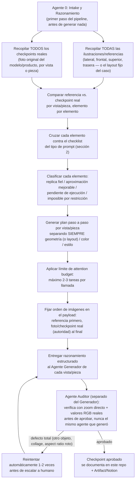

# Orquestación de agentes en paralelo — pipeline de generación/auditoría de imagen

[← Volver al índice del proyecto EDGE](../indice-proyecto-edge.md)

**Qué es esto:** la plantilla operativa para correr varios agentes en paralelo sobre distintos casos (cascos, tarjetas de specs, y lo que se sume después) y distintos tipos de prompt de generación/edición de imagen. No es un caso puntual — es el proceso que se reutiliza cada vez que se agrega un caso nuevo.

**Qué NO es esto:** un generador de imágenes. Esta sesión de Claude Code no tiene conectada una herramienta de edición tipo Nano Banana/Gemini — la generación real de píxeles se sigue corriendo donde ya se corre hoy (Nano Banana Pro vía OpenRouter, según `pipeline-edge-6-meses.md`). Lo que este documento y los agentes en paralelo aportan es **razonamiento, comparación, auditoría y documentación** antes y después de cada generación — el Agente 0, el plan por vista, y el Agente Auditor del diagrama de abajo.

---

## 1. Pipeline de roles



**Regla dura:** el Agente Auditor nunca es el mismo agente (ni la misma llamada) que el Agente Generador. Si no hay forma de separarlos en una ejecución dada, el resultado se marca `sin auditar`, no `aprobado`.

---

## 2. Tipos de prompt (taxonomía extensible)

Cada caso nuevo se clasifica en uno de estos tipos antes de armar el plan. Si no encaja en ninguno, se agrega un tipo nuevo con su propio checklist — no se fuerza a que encaje en uno existente.

### Tipo A — Transferencia de diseño gráfico sobre geometría/objeto real existente
Ejemplo: aplicar un diseño (manga/samurái, "The Godfather", etc.) sobre la carcasa real de un casco ya fabricado, por vista (lateral, frontal, superior, trasera).

Checklist de auditoría (Tipo A):
- [ ] **Geometría intacta** — silueta, proporciones, curvatura sin alterar entre checkpoint real y resultado.
- [ ] **Elementos físicos reales en su posición exacta** — ventilaciones, tornillos/remaches, hebilla, correa, mentonera, soporte de cámara, etc. — ni cubiertos ni movidos.
- [ ] **Visera/lente transparente y limpia** — sin tinte, sin sombra oscura cerca del pivote/bisagra, sin diseño aplicado encima.
- [ ] **Transición limpia** entre carcasa y piezas adyacentes (correa, acolchado) — sin línea negra ni gap visible.
- [ ] **Sin soporte/pole de estudio** visible, fondo plano y limpio según lo pedido.
- [ ] **Textura/relieve real vs. pintura/decal plano** — no confundir un relieve físico con un gráfico 2D superpuesto.
- [ ] **Cambio de superficie, no de estructura** — el prompt nunca debe pedir (ni el resultado mostrar) un cambio de forma del objeto.
- [ ] **Plan separado por capa**: geometría / color / estilo nunca se piden juntos en la misma instrucción.
- [ ] **Attention budget**: máximo 2-3 tareas por llamada de generación.
- [ ] **Orden de imágenes en el payload**: referencia de diseño primero, foto real (autoridad) al final.
- [ ] **Sesión de generación aislada por caso** — no generar dos cascos/piezas distintas en el mismo hilo/conversación de la herramienta de generación seguidos uno del otro. Hallazgo real (caso Vortex, `simulacion-11-vortex-verificacion.md`): con un prompt confirmado correcto, el generador sustituyó un ítem por el del caso inmediatamente anterior (Kratos) en la misma sesión — contaminación cruzada entre generaciones, no error de quién escribió el prompt. Empezar una sesión nueva por caso, o reforzar el prompt con "ignora cualquier lista usada en imágenes anteriores de esta sesión".
- [ ] **"Fuente de forma" y "fuente de diseño gráfico" separadas explícitamente cuando son imágenes distintas** — aplica sobre todo a la línea de licencias de marca (Marvel/DC/Paramount, etc.), donde el arte de referencia (mockup del diseño licenciado) casi siempre está aplicado sobre un casco genérico de catálogo, con proporciones distintas al molde real que se va a usar. Hallazgo real (caso Top Gun sobre molde azul, `simulacion-6c-top-gun.md`, Intento 4): sin esta separación explícita, el generador mezcló la forma del casco de la imagen de estilo (pico frontal, ventilaciones, pivote, curvatura de calota) con la del molde real, aunque el prompt solo pedía transferir el diseño gráfico. El prompt tiene que decir explícitamente cuál imagen es la única autoridad de forma y cuál es solo fuente de color/íconos/texto, y listar las piezas geométricas distintivas del molde real (forma exacta de pico, conteo y forma de ventilaciones, forma de la carcasa del pivote, curvatura de calota) para que el generador tenga algo concreto contra qué verificar.
- [ ] **Diseño gráfico solo sobre superficie pintada, nunca sobre piezas de plástico negro** — cuando el casco real tiene piezas de plástico negro sin pintar (ventilaciones, mentonera, spoiler, carcasa de pivote) además de la superficie pintada, el generador tiende a dibujar elementos del diseño 2D encima de esas piezas negras en vez de limitarlos a la zona pintada. El prompt tiene que prohibirlo explícitamente: "el diseño gráfico va SOLO sobre la superficie pintada, nunca sobre piezas de plástico negro; si un elemento cae cerca del límite, hay que recortarlo o desplazarlo". Hallazgo real (caso Top Gun sobre molde azul, `simulacion-6c-top-gun.md`, Intento 5→6): los chevrones dorados quedaron dibujados sobre una pieza de plástico negro del spoiler.
- [ ] **Ajuste puntual sobre un resultado ya aprobado = edición, no regeneración completa** — cuando ya se logró un resultado con geometría y diseño correctos y solo falta corregir un detalle chico (ej. la posición de un solo elemento), no repetir el prompt completo de generación (geometría + todas las reglas + todos los elementos) pidiéndole que "mantenga todo igual excepto X" — un prompt así vuelve a poner en juego toda la geometría desde cero en cada corrida, y sin la imagen real del resultado bueno como base de edición, la instrucción de texto "igual que antes" no tiene nada concreto de dónde partir. En su lugar, adjuntar SOLO la imagen del resultado ya aprobado y pedir una edición mínima de una sola tarea ("esta es una edición puntual, no una generación nueva — todo lo demás queda pixel por pixel igual, el único cambio es X"). Hallazgo real (caso Top Gun sobre molde azul, `simulacion-6c-top-gun.md`, Intento 7): un prompt de regeneración completa que solo cambiaba la posición del logo volvió a producir el mismo drift de geometría (pivote, ventilaciones) que ya se había corregido en el Intento 5 — mismo síntoma que el Intento 4, con causa raíz distinta a la de aquel caso. Se relaciona con la regla de "Attention budget" de arriba, pero es un hallazgo propio: no solo hay que limitar cuántas tareas van en un prompt, sino preferir edición sobre regeneración cuando la base ya es buena.

### Tipo B — Reproducción exacta de layout fijo (tarjetas de specs, homologación, grids de íconos)
Ejemplo: tarjeta "HOMOLOGACIÓN" (DOT, FNVSS 510, ECE 22.06 + lista de 6 features) o grid 2x3 de íconos de características — mismo lienzo, mismo aspect ratio que la referencia, cambiando solo el contenido de texto/íconos.

Checklist de auditoría (Tipo B):
- [ ] **Aspect ratio y tamaño en píxeles idénticos** a la referencia — sin recorte, sin estirar, sin cambiar orientación.
- [ ] **Proporción relativa de cada bloque** (header, bloque de logo, área de lista/grid) igual a la referencia — no comprimir ni expandir ningún bloque por separado.
- [ ] **Lista de ítems exacta** — ni de más ni de menos que lo pedido, mismo orden.
- [ ] **Lista de exclusión explícita respetada** — si el prompt dice "prohibido absoluto" sobre un texto/ítem, verificar que no aparezca en ninguna forma (ni tachado, ni parcial).
- [ ] **Tipografía/estilo consistente** con la referencia (peso, mayúsculas, alineación, separadores).
- [ ] **Estilo de ícono consistente** (línea, color, forma del contenedor) cuando aplica.
- [ ] **Sin duplicados entre piezas de un mismo set** — si dos tarjetas del mismo caso comparten un ítem (ej. "Visera Anti Scratch" ya en la ficha de homologación), no repetirlo en la segunda pieza.
- [ ] **Resolución pedida** (ej. 4K) respetada.
- [ ] **Íconos nuevos, no reciclados de la referencia** — cuando se manda una imagen de referencia junto con una lista de ítems distinta a la de esa referencia, el prompt tiene que decir explícitamente que hay que diseñar un ícono nuevo para cada ítem (mismo estilo visual, pero pictograma propio) y prohibir copiar el dibujo interno de un ícono de la referencia que corresponda a un ítem distinto o eliminado. Sin esta instrucción, el generador tiende a reciclar el ícono de la referencia (incluso con defectos que ya tenía, como un tache/X que no corresponde) en vez de crear uno nuevo — hallazgo real, ver `simulacion-11-vortex-verificacion.md`.
- [ ] **Dimensiones y cantidad de celdas del grid explícitas, con conteo forzado** — no alcanza con decir "grid 2x3" una vez; hay que reforzar "EXACTAMENTE 2 columnas x 3 filas = 6 celdas, ni una más" y pedirle al generador que cuente las celdas antes de terminar. Hallazgo real: con un prompt que solo decía "2x3" una vez, un generador produjo un grid de 2x4 con dos ítems duplicados en la fila extra — ver capturas del caso Kratos re-auditadas por el usuario en Gemini. Aplica también al aspect ratio/tamaño en píxeles del lienzo completo, no solo al grid interno.
- [ ] **Cada bloque jerárquico de la pieza descrito por separado, no solo "mismo formato"** — cuando la pieza real tiene una estructura visual de varios bloques distintos (ej. título arriba / banner de color sólido con texto grande en el medio / lista de ítems abajo), no alcanza con una instrucción genérica como "mismo formato/aspect ratio que la referencia". Hay que describir explícitamente cada bloque por separado (qué contiene, qué proporción del alto ocupa, qué color de fondo tiene). Hallazgo real (`simulacion-14-stellar-verificacion.md`, Intento 2→3): el prompt trataba el título "HOMOLOGACIÓN — DOT & ECE 22.06" como una sola línea de texto, cuando la referencia real tiene 3 bloques (título / banner negro con "DOT" gigante + certificación chica / lista de 6 ítems) — el resultado no coincidió en estructura hasta que se describieron los 3 bloques por separado.

### Tipo C — Verificación de ficha de marketing contra fuente de datos (excel/spec maestro)
No es generación de imagen: es auditar si los claims de una pieza ya publicada/diseñada (ficha, tarjeta, catálogo) coinciden con la fuente de verdad interna (excel de specs, ficha técnica del fabricante). Ejemplo: caso Kratos (`simulaciones-cc/simulacion-10-kratos-verificacion.md`).

Checklist de auditoría (Tipo C):
- [ ] **Cada claim de la pieza contra su fila exacta** en la fuente de datos — no asumir a qué fila corresponde un claim ambiguo (ej. "liberación rápida del visor" puede confundirse con "kit de mecanismo visor" si son filas distintas).
- [ ] **No asumir cuál fuente tiene razón** cuando hay conflicto — el resultado es "mismatch a resolver", nunca "la ficha está mal" o "el excel está mal" por default.
- [ ] **Reportar cada mismatch individualmente**, con la fila usada y el valor exacto — no un resumen agregado que oculte cuáles fallaron.
- [ ] **Separar mismatches de alto impacto** (seguridad, regulatorio/homologación, expectativa física del producto) de los de bajo impacto (naming, redondeo) — no tratarlos igual en la recomendación.
- [ ] **Listar datos confirmados en la fuente pero no reclamados en la pieza** — no es un error, es una oportunidad, y se reporta aparte de los mismatches.
- [ ] **Auditor separado del que transcribe** — quien lee/transcribe las fuentes no es quien decide match/mismatch, mismo principio de separación de roles que en Tipo A y B.
- [ ] **Tres resultados posibles, no dos** — MATCH, MISMATCH (la fuente confirma explícitamente lo contrario, ej. N/A) y **SIN DATO** (la celda está vacía — no hay forma de confirmar ni descartar). Nunca tratar una celda vacía como si fuera un N/A confirmado (caso Hero, `simulacion-12-hero-verificacion.md`).
- [ ] **Contradicciones estructurales aparte de mismatches de dato** — si un claim contradice una categoría confirmada (ej. "diseño modular" cuando el tipo de casco confirmado es "open face"), marcarlo con más peso que un simple dato faltante, aunque técnicamente derive de la misma fila.

### Tipo D — Limpieza de producto (quitar stickers/logos/etiquetas)
No es cambio de color ni de contenido: es sacar elementos que sobran en la foto real (stickers de certificación, logos de protección de envío, calcomanías temporales) dejando el producto real intacto. Ejemplo: casco EDGE flip-up, `simulacion-24-edge-flipup-quitar-stickers.md`.

Checklist de auditoría (Tipo D):
- [ ] **Cada sticker/logo a quitar nombrado explícitamente** en el prompt — no decir "sacá los logos" en general si se puede describir cuál es cuál (posición, contenido, tamaño), para que el generador no dude ni saque de más ni de menos.
- [ ] **Sin restos fantasma** — verificar que no quede una sombra, un borde o una silueta tenue donde estaba el sticker; la superficie debe quedar limpia y continua con el material real de esa zona (mate, cromado, transparente, según corresponda).
- [ ] **No inventar textura nueva en el área limpiada** — si se saca un sticker de una visera transparente, esa zona vuelve a ser transparente lisa, no un parche opaco o difuminado.
- [ ] **Todo lo demás sin cambios** — mismo criterio de geometría intacta que Tipo A, pero acá se extiende a que ni el color, ni el acabado (mate/cromado/glossy) de la pieza limpiada cambien, solo desaparece el sticker/logo.

### Tipo E, ... — pendientes
Se agregan acá a medida que lleguen casos que no encajen en A, B, C o D, con su propio checklist derivado del caso real que los define.

---

## 3. Las 12 lecciones aprendidas (Sesión 2 del Artifact)

Referenciadas en el diagrama original pero documentadas en un Artifact externo, no en este repo todavía.

**🔴 Pendiente de tu parte:** pegar acá el contenido completo de las 12 lecciones (o el link al Artifact) para que quede versionado en el repo junto con el resto del pipeline, en vez de vivir solo en una conversación aparte.

---

## 4. Estructura de carpetas por caso

Cada caso nuevo (casco, tarjeta, o lo que sea) vive en su propia carpeta dentro de `proyectos/edge-cascos/documentos/simulaciones-cc/` (si es continuación del patrón ya existente) con esta estructura mínima:

```
simulacion-N-nombre-caso/
├── referencias/       ← ilustraciones, PDFs de diseño, mockups (lo que define "cómo debería verse")
├── checkpoints/        ← fotos reales del objeto/persona/modelo (la autoridad final)
├── resultados/          ← salidas generadas, nombradas con FINAL o DESCARTAR (ver lección de simulación 6)
└── auditoria.md          ← hallazgos del Agente Auditor por vista/pieza, checklist del tipo A o B marcado
```

Cuando subas fotos por el chat, decime a qué caso y a qué carpeta (`referencias/` o `checkpoints/`) corresponden y las guardo ahí.

### 4.1 Formato de subpágina por vista/pieza

Cada vista o pieza de un caso tiene su propia subpágina `.md` dentro de la carpeta del caso (ej. `simulacion-N-dakota/vista-lateral.md`), con este formato fijo — imagen arriba, prompt en desplegable, y si algo falló, qué falló y qué falta hacer:

```markdown
### <Nombre de la vista/pieza> — <caso>


<details><summary>Prompt usado</summary>

<prompt completo, texto plano, tal cual se mandó al generador>

</details>

**Estado:** ✅ aprobado · ⚠️ falló · 🔴 pendiente de generar

**Qué falló:** <descripción concreta del defecto — geometría, texto corrupto, aspect ratio roto, etc. "Ninguno" si aprobado>

**Qué hay que hacer:** <siguiente paso concreto y accionable — reintentar con X ajuste, escalar a humano porque Y, esperar foto real de Z>
```

Esta es la unidad mínima de trabajo del Agente Auditor: revisa la imagen, llena "Qué falló" y "Qué hay que hacer", y decide el estado. Si el Auditor aprueba, el registro de la sección 6 se actualiza en la misma pasada.

---

## 5. Cómo se ejecuta con agentes en paralelo

Con el tool de Workflow, el patrón por caso es un **pipeline** (no una barrera) de dos etapas por vista/pieza, para que la vista 1 pueda estar en auditoría mientras la vista 2 todavía está en generación de plan:

```
pipeline(
  vistas_o_piezas_del_caso,
  vista => Agente 0 + Generador  → arma el plan (sección 1) y produce/describe el resultado de esa vista,
  resultado => Agente Auditor    → aplica el checklist del tipo A o B (sección 2), nunca el mismo agente
)
```

Reintentos (`RETRY` del diagrama) se hacen dentro de la misma etapa, máximo 1-2 veces, antes de marcar la vista como `escalar a humano` en `auditoria.md`.

Esto corre en background — cuando termine te aviso con el resultado, no hace falta que preguntes por el estado mientras tanto.

---

## 6. Registro de casos

📚 **[Índice maestro de prompts del catálogo](simulaciones-cc/indice-prompts-catalogo.md)** — todos los prompts ya armados en los casos Kratos a Evolution 929 (Simulaciones 10-19), organizados por caso con estado (listo/bloqueado/con reintento) y con la lista completa de pendientes de confirmación del usuario en un solo lugar.

| Caso | Tipo | Estado | Bloqueo |
|---|---|---|---|
| Dakota (diseño manga/samurái) | A | 🔴 Sin archivos | Esperando ilustración de referencia + checkpoints reales por vista |
| Tarjeta HOMOLOGACIÓN (DOT/FNVSS/ECE) | B | 🔴 Sin archivos | Esperando imagen de referencia real (la que define el aspect ratio exacto) |
| Grid de features 2x3 (íconos) | B | 🔴 Sin archivos | Esperando imagen de referencia real |
| Kratos — ficha vs. excel de specs | C | ⚠️ Auditado — [`simulacion-10-kratos-verificacion.md`](simulaciones-cc/simulacion-10-kratos-verificacion.md) | 4 de 13 claims + certificación no coinciden con el excel; falta confirmar con fabricante y subir los 2 archivos como adjunto real |
| Vortex — ficha vs. excel de specs | C | ✅ Auditado — [`simulacion-11-vortex-verificacion.md`](simulaciones-cc/simulacion-11-vortex-verificacion.md) | Ninguno en el texto; falta confirmar qué va en el rectángulo negro de la ficha y subir los archivos como adjunto real |
| Hero — ficha vs. excel de specs | C | ⚠️ Parcialmente desbloqueado — [`simulacion-12-hero-verificacion.md`](simulaciones-cc/simulacion-12-hero-verificacion.md) | 7 de 13 claims sin dato en el excel (bajó de 9: "cubre barbilla"/"cubre nariz" se confirmaron con una captura más completa); "diseño modular" contradice "open face" confirmado; tipo de hebilla en conflicto (micrométrica vs. doble D) — versión reducida de 3/6 ya generable, versión completa espera el excel |
| Shanghai — ficha vs. excel de specs (otro tab) | C | ⚠️ Auditado — [`simulacion-13-shanghai-verificacion.md`](simulaciones-cc/simulacion-13-shanghai-verificacion.md) | 4 de 13 claims + 1 sin dato no coinciden; prompt B queda en 4/6 ítems por falta de feature física confirmada; 3er caso seguido con rectángulo negro recurrente en el layout — revisar template maestro |
| Stellar — ficha vs. excel de specs | C | ⚠️ Auditado — [`simulacion-14-stellar-verificacion.md`](simulaciones-cc/simulacion-14-stellar-verificacion.md) | 3 de 13 claims no coinciden (mejor resultado del catálogo); certificación incompleta en la ficha; 2 prompts completados a 6/6 sin ítems de empaque |
| Shift — ficha vs. excel de specs | C | ⚠️ Auditado — [`simulacion-15-shift-verificacion.md`](simulaciones-cc/simulacion-15-shift-verificacion.md) | 4 de 13 claims no coinciden; "hebilla micrométrica" N/A para este modelo (a diferencia de casi todo el catálogo) — el ícono tachado en la ficha real podría ser correcto o no, sin confirmar; 4to caso seguido con rectángulo negro recurrente |
| Evolution 929 — ficha vs. excel de specs (tab de marca EDGE) | C | ✅ Auditado — [`simulacion-16-evolution929-verificacion.md`](simulaciones-cc/simulacion-16-evolution929-verificacion.md) | Solo 2 de 13 claims no coinciden — mejor resultado del catálogo; primer caso donde "Diseño modular" es un MATCH real (tipo Flip Up confirmado); primer caso de la marca EDGE en vez de EDGEPRO, no mezclar tabs |
| Bob Esponja, Padrino, Top Gun, Stellar | A | Ver `simulaciones-cc/` | Ya documentados, no usan todavía este checklist formal — se puede retro-auditar con la sección 2 si hace falta |

**Nota técnica — imágenes pegadas en el chat:** esta sesión puede *ver* y transcribir una imagen que mandás pegada directamente en el mensaje, pero no puede extraer sus bytes para guardarla como archivo binario en el repo (por eso el caso Kratos no tiene todavía carpeta `imagenes-kratos/`). Si necesitás que la imagen quede versionada como archivo real, mandala como **adjunto/subida de archivo**, no solo pegada inline.

---

## 7. Plantilla para agregar un caso nuevo

```
### Caso: <nombre>
- Tipo de prompt: A / B / nuevo (definir checklist)
- Referencias adjuntas: sí/no — ruta: referencias/...
- Checkpoints reales adjuntos: sí/no — ruta: checkpoints/...
- Prompt exacto usado: <pegar completo>
- Resultado: <archivo o "pendiente de generar">
- Auditoría (checklist tipo A o B): <marcar ítem por ítem>
- Veredicto: aprobado / reintentar / escalar a humano
```

---

## 8. Lecciones aprendidas — sesión 2026-07-28

- **Confirmación de nombre "Boston 4.0"** — había una pregunta abierta de larga data sobre si el modelo se llamaba "Boston" o "Boston 4.0", que se resolvió porque el usuario mandó una imagen del logo/título real de la ficha. Lección: cuando hay una duda de naming sin resolver, un logo/título real de marca es evidencia más fuerte que la silueta o el color del casco. Documentado en `simulaciones-cc/simulacion-21-boston-4-colores.md` y `simulaciones-cc/simulacion-25-carbex-verificacion.md`.

- **Nuevo sub-tipo de prompt: swap de texto en logo/título de marca** (variante chica del Tipo A) — mismo ícono/barra/tipografía/fondo, cambiando solo el nombre del modelo/marca en el texto, con las mismas dimensiones exactas. Usado 2 veces (Boston 4.0 → Carbex, Boston 4.0 → Stellar), con el mismo prompt base reutilizable. Ver `simulaciones-cc/simulacion-25-carbex-verificacion.md` y `simulaciones-cc/simulacion-14-stellar-verificacion.md`.

- **Nueva línea de trabajo: "Licencias de marca" (Marvel, DC, Paramount, etc.)** — el usuario confirmó que tiene licencias pagas con estas marcas y produce cascos adaptativos (molde real + arte de diseño licenciado aplicado encima). Primer caso concreto: Top Gun: Maverick sobre un molde azul real (`simulaciones-cc/simulacion-6c-top-gun.md`), que pasó por 6+ intentos de auditoría/corrección:
  - Intento 1: logo omitido, elementos mal ubicados, geometría alterada, paleta desviada.
  - Intento 2: arreglado, pero el visor se oscureció.
  - Intento 3: visor arreglado, pero el layout se corrió por falta de imagen de referencia del resultado bueno anterior.
  - Intento 4: con 3 imágenes de referencia, layout arreglado, pero la forma del casco se mezcló con la del casco de la imagen de estilo.
  - Intento 5: separando "fuente de forma" de "fuente de diseño gráfico", geometría por fin correcta; quedaron 2 defectos — gráfico sobre piezas negras y un elemento faltante.
  - Intento 6: agregó el elemento faltante y prohibió el gráfico sobre piezas negras.
  - Regla más importante que deja este caso para toda la línea de licencias: cuando el arte licenciado está diseñado sobre otro casco de forma distinta al molde real, hay que separar explícitamente en el prompt cuál imagen manda en la forma y cuál solo aporta el diseño gráfico — ya está en el checklist Tipo A (sección 2).

- **Primer caso de casco retro/redondo** (`simulaciones-cc/simulacion-26-casco-retro-goma-negra.md`) — primer molde de esta silueta en el catálogo (café racer, calota lisa, pivote cromado circular). Reafirma el patrón de "cambio único y puntual": bloquear todo el resto de la imagen explícitamente y cambiar una sola pieza chica (la goma del borde inferior), sin tocar ni siquiera otras piezas del mismo color que no correspondían.

- **Re-lectura de excel puede desbloquear casos previamente bloqueados** — el caso Hero (`simulaciones-cc/simulacion-12-hero-verificacion.md`) estaba bloqueado por 9 de 13 celdas sin dato en el excel. Una nueva captura de pantalla del mismo excel, más completa, reveló que 2 de esas celdas ("Cubre barbilla", "Cubre nariz") sí tenían dato (X confirmado) que no se había visto en la captura original. Lección: cuando llega una captura nueva del mismo excel, siempre vale la pena re-auditar contra la transcripción ya guardada en vez de asumir que no cambió nada — puede haber más columna visible o mejor resolución.

- **Regla de proceso ya establecida y reforzada hoy** (no nueva, pero vale dejarla explícita acá) — cada prompt o hallazgo nuevo se guarda en el archivo del caso correspondiente y se commitea/pushea al repo inmediatamente, sin esperar a que el usuario lo pida cada vez — es el flujo de trabajo esperado de esta sesión.

---

**Última actualización:** 2026-07-28 · agregados 2 ítems de checklist (Tipo A: diseño gráfico solo sobre superficie pintada; Tipo B: describir cada bloque jerárquico por separado) y sección 8 con las lecciones aprendidas de la sesión del 2026-07-28 (confirmación de nombre Boston 4.0, sub-tipo de prompt de swap de texto en logo, línea de licencias de marca y caso Top Gun, primer casco retro, re-lectura de excel del caso Hero).
