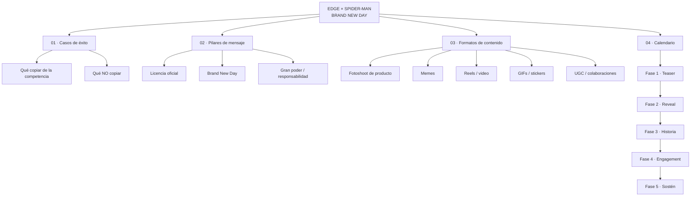

# EDGE × Spider-Man — Plan de contenido "Brand New Day"

**Licencia:** Sony / Marvel — Spider-Man · **Temática narrativa:** Brand New Day · **Mensaje ancla:** *"Un gran poder conlleva una gran responsabilidad"*

Árbol de campaña — no solo fotoshoot de producto, sino el mix completo de formatos que ya funciona en casos de éxito comparables del sector.

---

## 01 · Casos de éxito

<b>Qué copiar de la competencia</b>

Ver sección [Referencias validadas](#referencias-validadas) más abajo — Axxis Ghostfighter y Nolan ya corrieron esta jugada con licencia Spider-Man. Úsalas como benchmark de tono, no de diseño.

<b>Qué NO copiar</b>

Ninguno de los dos casos de referencia muestra **meme o UGC** — se quedan en key art estático. Ahí está el hueco que EDGE puede ocupar primero.

## 02 · Pilares de mensaje

<b>Licencia oficial</b>

El sello **Marvel** visible en el casco (mentonera trasera) es el activo de credibilidad — legitima el producto frente a réplicas no licenciadas. Debe aparecer legible en fotoshoot y en al menos 1 frame de cada video.

<b>Brand New Day</b>

Arco editorial 2025 de Marvel: Spider-Man vuelve a lo urbano/callejero, tono más terrenal que cósmico. Traducción visual: grafiti, cómic clásico blanco/negro/rojo, ciudad de noche — no naves ni multiverso.

<b>Gran poder / responsabilidad</b>

Tagline reutilizable en **todos** los formatos como hilo conductor — funciona como CTA de seguridad vial ("el poder es tu moto, la responsabilidad es tu casco").

## 03 · Formatos de contenido

<b>Fotoshoot de producto</b>

**Estudio:** 6 ángulos fijos + macro del visor espejado y del logo Marvel (ya tienes estas tomas).

**Lifestyle:** piloto de espaldas / en moto, luz de atardecer urbano — como la foto que enviaste del piloto con el casco puesto.

<b>Memes</b>

Formato que **ningún competidor está usando** — ventaja de ser primero. 3 plantillas:

1. Panel de cómic con el casco reemplazando la cara de Spider-Man en una viñeta icónica.
2. Meme "Spider-Man señalando a Spider-Man" con dos versiones del piloto EDGE.
3. Texto tipo alerta ("tu instinto arácnido ya se activó") sobre foto del casco — mismo copy que usó Axxis, adaptado a EDGE.

<b>Reels / video</b>

**Unboxing narrado** con la frase "gran poder / gran responsabilidad" como voz en off.

**Reveal cinematográfico** estilo Axxis: casco emergiendo de sombra + telaraña, 8-10s, sin diálogo, solo música + SFX.

**Antes/después:** visor claro → visor espejado bajo el sol, transición rápida.

<b>GIFs / stickers</b>

Loop corto del visor cambiando de reflejo (rojo/dorado) — usable como sticker de WhatsApp/Instagram, y como respuesta rápida en DMs de ventas.

<b>UGC / colaboraciones</b>

Enviar la pieza a 2-3 riders/creadores de moto para que graben su propio "reveal" — contenido que ni Axxis ni Nolan están haciendo, refuerza el hueco identificado en el nodo 01.

## 04 · Calendario

| Fase | Qué se publica | Objetivo |
|---|---|---|
| **1 · Teaser** | Silueta + telaraña, sin mostrar el casco completo (1-2 posts) | Generar la misma curiosidad que el gancho de Axxis, sin revelar el diseño |
| **2 · Reveal** | Fotoshoot de producto completo + reel cinematográfico | Primera vez que se ve el casco entero, logo Marvel visible — es el post "ancla" del perfil |
| **3 · Historia** | Video narrativo con el tagline "gran poder / responsabilidad" | Conecta el lore de Brand New Day con el mensaje de seguridad vial — el gancho emocional real |
| **4 · Engagement** | Memes + primeras piezas UGC | EDGE se diferencia de Axxis/Nolan, que no llegan a este formato — mayor alcance orgánico esperado |
| **5 · Sostén** | GIFs/stickers en circulación + reposteo de UGC de riders | Mantiene la campaña viva en DMs y stories sin producir contenido nuevo cada semana |

## Referencias validadas

Los dos casos que se mandaron por WhatsApp — ambos con licencia Spider-Man, mismo sector (cascos de moto), ambos funcionando solo con key art estático.

<b>Axxis Helmets México — Ghostfighter</b>

Casco naranja/negro en bodega abandonada cubierta de telaraña, tipografía "GHOSTFIGHTER" arriba.

- Copy corto tipo gancho: "si tu instinto arácnido ya se..." — genera curiosidad, no cierra la frase
- Ambientación nocturna/urbana, no estudio limpio
- Sin logo Marvel visible en la pieza — juega la referencia de forma sutil, sin licencia explícita en el post

<b>Rider Site — Nolan</b>

Casco naranja/rojo colgando de telaraña sobre avenida nocturna, tagline completo a pantalla.

- Tagline "un gran poder conlleva una gran responsabilidad" + "que cada decisión sobre tu moto demuestre que lo entiendes" — conecta lore con mensaje de seguridad
- CTA de WhatsApp integrado directo en el creative ("Pregúntanos en WhatsApp")
- Silueta de Spider-Man como marca de agua sutil, sin usar el personaje completo

---
*edge helmets · brand new day · plan de contenido*
