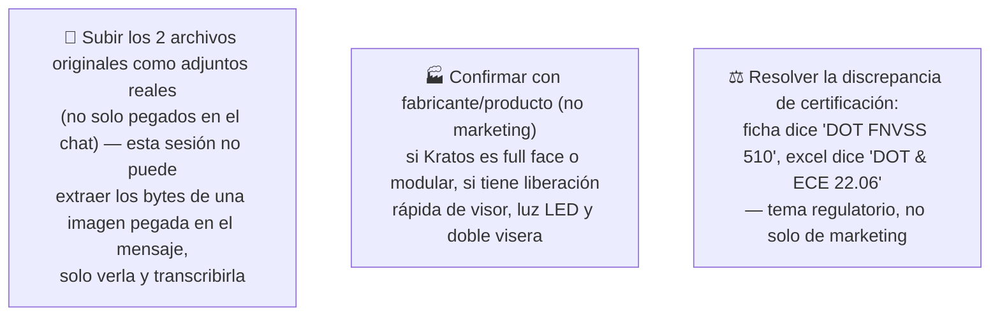

# Simulación 10 — Kratos: verificación ficha de marketing vs. excel maestro de specs (Etapa 3 — Catálogo)

[← Volver al índice de mis pruebas](../mis-pruebas-claude-code.md) · [← Orquestación de agentes en paralelo](../orquestacion-agentes-paralelos.md)

Primer caso del catálogo trabajado bajo el pipeline de [orquestación de agentes en paralelo](../orquestacion-agentes-paralelos.md) — **Tipo C: verificación de ficha de marketing contra fuente de datos**. No es generación de imagen: es cruzar lo que dice la ficha publicitaria del modelo **Kratos** contra el excel maestro de especificaciones de la empresa, columna por columna, sin asumir cuál de las dos fuentes tiene razón cuando hay conflicto.

División de roles real usada en esta simulación: yo (Agente 0/Intake) transcribí el contenido de las 2 fuentes recibidas por chat; un **Agente Auditor independiente** (subagente separado, sin acceso a las imágenes, solo a los datos transcritos) hizo la comparación fila por fila — separación de roles exigida por el pipeline (nunca el mismo agente audita lo que él mismo interpretó).

### 🔴 Pendiente de tu parte



<details><summary>Fuentes recibidas (pendiente subir binario real al repo)</summary>

1. **Ficha de marketing "KRATOS"** (catálogo EDGE) — tarjeta "HOMOLOGACIÓN DOT FNVSS 510" (7 ítems de texto) + grid de 6 íconos de features + renders del casco (lateral, 3/4, trasera, frontal con visor) + foto lifestyle + 4 variantes de color + tagline "DISEÑADO PARA SUPERAR TUS LÍMITES."
2. **Excel maestro de especificaciones**, pestaña "FICHAS" — comparativo de 7 modelos (Stellar, Kratos, Xpro, Vortex, Carbex, Shift, Hero) contra ~25 filas de atributos técnicos.

Estas imágenes llegaron pegadas directamente en el chat. Esta sesión de Claude Code puede **verlas y transcribirlas**, pero no tiene forma de extraer los bytes originales para guardarlas como archivo binario en `imagenes-kratos/` — por eso no hay carpeta de imágenes todavía en esta simulación, a diferencia de 6a-6d. Si las volvés a mandar como **adjunto/subida de archivo** (no pegado inline), quedan guardadas acá igual que las de los otros casos.

</details>

<details><summary>Claims transcritos de la ficha de marketing</summary>

**Bloque "HOMOLOGACIÓN — DOT FNVSS 510" (7 ítems):**
1. Visera anti scratch
2. Preparado para anti empañante
3. Sistema de emergencia de liberación rápida (ERS)
4. Liner desmontable y lavable
5. Sistema de liberación rápida del visor
6. Cubre barbilla
7. Cubre nariz

**Bloque grid de íconos (6 ítems):**
1. Diseño modular
2. Con luz LED
3. Canal para lentes
4. Hebilla micrométrica
5. Doble visera
6. Espacio para bluetooth

</details>

<details><summary>Excel maestro — columna Kratos, transcripción completa</summary>

| Fila | Valor Kratos |
|---|---|
| Marca | EDGEPRO |
| Certificación | DOT & ECE 22.06 |
| Full Face-Flip Up-Open Face-Adventure | FULL FACE |
| Con luz LED | N/A |
| Doble visera | N/A |
| Mica night vision/PC/etc | (vacío) |
| Preparado para anti empañante | X |
| Con Pinlock | X |
| Kit de mecanismo visor | X |
| Visera anti scratch | X |
| Hebilla micrométrica | X |
| Hebilla doble D | N/A |
| Espacio para Bluetooth | X |
| Material exterior ABS alta resistencia | X |
| Interior EPS de alta resistencia | X |
| Liner desmontable y lavable | X |
| Cubre barbilla | X |
| Cubre nariz | X |
| Emergency Quick Release System (ERS) | X |
| Canal para lentes (Glasses Fit System) | X |
| N° Air Vent System | 3 |
| Estilo de casco | Elegante |
| Peso | (vacío) |
| Quick Visor Release System | N/A |
| Master Box | X |
| Inner Box-bolsa protectora | X |
| Con maletín de lujo | X |

*(el excel completo compara 7 modelos; solo se transcribe acá la columna Kratos, relevante para este caso — varias celdas del original tienen un comentario en triángulo rojo no legible en la captura, no afecta los valores transcritos)*

</details>

### Auditoría — tabla de verificación (Agente Auditor independiente)

| # | Claim de la ficha | Fila del excel usada | Valor Kratos en excel | Resultado |
|---|---|---|---|---|
| A1 | Visera anti scratch | Visera anti scratch | X | ✅ MATCH |
| A2 | Preparado para anti empañante | Preparado para anti empañante | X | ✅ MATCH |
| A3 | Sistema de emergencia de liberación rápida (ERS) | Emergency Quick Release System (ERS) | X | ✅ MATCH |
| A4 | Liner desmontable y lavable | Liner desmontable y lavable | X | ✅ MATCH |
| A5 | Sistema de liberación rápida del visor | Quick Visor Release System | N/A | ❌ MISMATCH |
| A6 | Cubre barbilla | Cubre barbilla | X | ✅ MATCH |
| A7 | Cubre nariz | Cubre nariz | X | ✅ MATCH |
| B1 | Diseño modular | Full Face-Flip Up-Open Face-Adventure | FULL FACE | ❌ MISMATCH |
| B2 | Con luz LED | Con luz LED | N/A | ❌ MISMATCH |
| B3 | Canal para lentes | Canal para lentes (Glasses Fit System) | X | ✅ MATCH |
| B4 | Hebilla micrométrica | Hebilla micrométrica | X | ✅ MATCH |
| B5 | Doble visera | Doble visera | N/A | ❌ MISMATCH |
| B6 | Espacio para bluetooth | Espacio para Bluetooth | X | ✅ MATCH |

**Nota sobre A5:** el excel tiene dos filas de visor distintas — "Kit de mecanismo visor" (Kratos = X) y "Quick Visor Release System" (Kratos = N/A). El claim de la ficha es sobre *liberación rápida* específicamente, que corresponde a la segunda fila. Con la fila correcta, el excel dice que Kratos **no** tiene esa función — no confundir con "Kit de mecanismo visor", que sí es X.

**Nota sobre B1:** "Full Face" y "modular/flip-up" son categorías mutuamente excluyentes en esa fila del excel. El valor de Kratos es Full Face, no Flip Up — el excel no respalda "diseño modular".

**Hallazgo adicional (fuera de los 13 claims, encontrado por el Auditor):** el encabezado de la ficha dice **"HOMOLOGACIÓN DOT FNVSS 510"**, mientras el excel dice **"DOT & ECE 22.06"** para Kratos — son designaciones de normativa distintas, y es una discrepancia de mayor peso que las anteriores porque es regulatoria, no solo de feature de marketing. También hay variación de naming de marca: la ficha dice "EDGE", el excel dice "EDGEPRO" — no se puede determinar si es un error o solo un acortamiento comercial.

**Datos del excel no reclamados en la ficha (no son errores, features confirmadas sin usar en marketing):** Con Pinlock, Kit de mecanismo visor, Material exterior ABS, Interior EPS, Master Box, Inner Box, Maletín de lujo, N° Air Vent System = 3, Estilo de casco = Elegante.

### Estado: ⚠️ Falló — 4 de 13 claims no coinciden con el excel, + 1 discrepancia regulatoria adicional

**Qué falló:**
- La ficha dice "Diseño modular" pero el excel marca Kratos como Full Face.
- La ficha incluye "Con luz LED" pero el excel dice N/A para Kratos.
- La ficha incluye "Doble visera" pero el excel dice N/A para Kratos.
- La ficha incluye "Sistema de liberación rápida del visor" pero el excel marca "Quick Visor Release System" como N/A para Kratos.
- La ficha dice "DOT FNVSS 510", el excel dice "DOT & ECE 22.06" — discrepancia de certificación, no solo de feature.

**Qué hay que hacer:**
1. No asumir cuál fuente está desactualizada — confirmar contra el producto físico/fabricante, no contra ninguna de las dos fuentes de escritorio.
2. Congelar la reimpresión/publicación de la ficha Kratos hasta resolver los 4 mismatches y la discrepancia de certificación — dos de ellos (diseño modular, liberación rápida del visor) son afirmaciones con implicación de seguridad y expectativa del cliente, no detalles menores.
3. Hipótesis a descartar con el fabricante: que la ficha de marketing haya copiado features de otro modelo por error (Stellar, Xpro y Shift sí tienen X en "Doble visera"; Vortex y Carbex sí tienen X en "Quick Visor Release System" — son los candidatos más probables de origen del copy-paste).
4. Una vez confirmada la fuente correcta: corregir la ficha o actualizar el excel, y considerar incorporar a la ficha las features confirmadas y no usadas (Maletín de lujo, Pinlock).
5. Subir los 2 archivos originales como adjunto real (no pegado en el chat) para dejarlos versionados en este caso.

---

## Prompts corregidos (Agente Generador, tras auditoría)

Solo usan ítems confirmados con X en el excel — ninguno de los 4 mismatches quedó incluido.

<details><summary>Prompt A — HOMOLOGACIÓN Kratos (corregido)</summary>

```
Genera una tarjeta gráfica de "HOMOLOGACIÓN" en formato vertical angosto, resolución 4K, idéntica en aspect ratio, composición y estilo tipográfico a la referencia usada anteriormente para esta ficha. Mantené exactamente la misma estructura visual:

- Encabezado superior con el texto "HOMOLOGACIÓN" en tipografía bold, mismo tamaño y posición que la referencia.
- Bloque negro debajo del encabezado que contenga el logo/isotipo "DOT" y el texto de certificación "DOT & ECE 22.06" (CRÍTICO: la certificación debe decir exactamente "DOT & ECE 22.06", NO "DOT FNVSS 510" — dato corregido tras auditoría contra el excel maestro).
- Debajo del bloque negro, un área de fondo gris claro con una lista de EXACTAMENTE 6 ítems, en mayúscula, tipografía bold, centrados, cada ítem separado por una línea delgada horizontal (sin íconos, sin viñetas).
- Los 6 ítems, en este orden exacto:
  1. VISERA ANTI SCRATCH
  2. SISTEMA DE EMERGENCIA DE LIBERACIÓN RÁPIDA (ERS)
  3. LINER DESMONTABLE Y LAVABLE
  4. PREPARADO PARA ANTI EMPAÑANTE
  5. CUBRE BARBILLA
  6. CUBRE NARIZ

CRÍTICO — prohibiciones explícitas:
- NO incluir "Sistema de liberación rápida del visor" (Quick Visor Release System) bajo ninguna forma — NO está confirmado para Kratos en el excel.
- NO agregar íconos, sellos ni elementos gráficos ajenos a la referencia.
- NO alterar el aspect ratio ni la jerarquía tipográfica de la referencia.
- Mantener exactamente 6 ítems, ni más ni menos.
```

</details>

<details><summary>Prompt B — Grid de íconos Kratos (corregido)</summary>

```
Genera un grid de íconos 2x3 en formato 4K, idéntico en composición, estilo y aspect ratio a la referencia. Fondo gris claro uniforme. Cada una de las 6 celdas contiene un ícono lineal en color rojo/bordo dentro de un octágono (mismo estilo de línea, grosor y paleta que la referencia), con el texto correspondiente en mayúscula bold centrado debajo del ícono.

Los 6 ítems, en este orden exacto:
1. CANAL PARA LENTES
2. HEBILLA MICROMÉTRICA
3. ESPACIO PARA BLUETOOTH
4. KIT DE MECANISMO VISOR
5. MATERIAL EXTERIOR ABS ALTA RESISTENCIA
6. INTERIOR EPS DE ALTA RESISTENCIA

(Los 3 ítems añadidos —Kit de mecanismo visor, Material exterior ABS, Interior EPS— se eligieron por ser features físicas/técnicas del casco, coherentes con un grid de producto, en vez de ítems de empaque como Master Box o maletín.)

CRÍTICO — prohibiciones explícitas:
- NO incluir "Diseño modular" — el excel confirma que Kratos es FULL FACE, no modular.
- NO incluir "Con luz LED" ni "Doble visera" — ambos N/A para Kratos en el excel.
- NO agregar íconos o texto que no correspondan a los 6 ítems listados.
- Mantener exactamente 6 celdas en grid 2x3, ni más ni menos.
```

</details>

**Cambios respecto al prompt original:** Prompt A — se quitó "liberación rápida del visor" (N/A), se completó con "preparado para anti empañante" (X, ya estaba en la ficha original), se corrigió la certificación. Prompt B — se quitaron "diseño modular" y "luz LED" (ambos incorrectos), se completó con 3 ítems técnicos confirmados con X.

## Auditoría del resultado generado (Intento 1)

**Prompt B (grid de íconos): ✅ Aprobado.** Los 6 ítems generados son exactamente los del prompt corregido (Canal para lentes, Hebilla micrométrica, Espacio para Bluetooth, Kit de mecanismo visor, Material exterior ABS, Interior EPS), sin duplicados, sin ítems extra. Los 6 coinciden con la columna Kratos del excel.

**Prompt A (tarjeta HOMOLOGACIÓN): ⚠️ Falló — defecto de duplicación.** Los 6 ítems correctos SÍ están todos presentes y coinciden con el excel, pero "Sistema de emergencia de liberación rápida (ERS)" aparece **repetido dos veces** (posiciones 2 y 3), resultando en una lista de 7 líneas en vez de las 6 exactas pedidas. La certificación "DOT & ECE 22.06" salió correcta.

**Qué falló:** duplicación de un ítem — no es un error de contenido/datos (los 6 correctos están ahí), es un error de generación que violó la instrucción "EXACTAMENTE 6 ítems, ni más ni menos".

**Qué hay que hacer:** reintentar el Prompt A (1er reintento) con una instrucción reforzada contra duplicados — agregar explícitamente: "cada uno de los 6 ítems debe aparecer UNA SOLA VEZ, no repitas ningún ítem aunque el espacio vertical sobre o falte".

---

**Última actualización:** 2026-07-28 · Agente 0 (transcripción) + Agente Auditor independiente (verificación) + Agente Generador (prompts corregidos) + auditoría del resultado generado (Intento 1: grid aprobado, homologación con duplicado a reintentar), corridos en esta sesión a pedido explícito de auditar el primer caso del catálogo (Kratos) bajo el pipeline de orquestación en paralelo.
