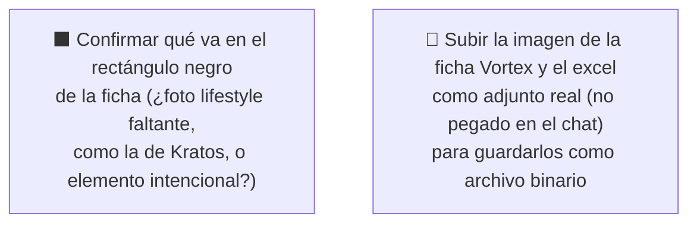

# Simulación 11 — Vortex: verificación ficha de marketing vs. excel maestro de specs (Etapa 3 — Catálogo)

[← Volver al índice de mis pruebas](../mis-pruebas-claude-code.md) · [← Orquestación de agentes en paralelo](../orquestacion-agentes-paralelos.md)

Segundo caso del catálogo, mismo pipeline **Tipo C** que [Kratos (Simulación 10)](simulacion-10-kratos-verificacion.md). A diferencia de Kratos, acá también se evalúan **2 prompts genéricos** (los mismos textos base de prompt para "ficha HOMOLOGACIÓN" y "grid de 6 íconos") para confirmar si, instanciados con los datos reales de Vortex, producirían una pieza correcta.

Nota de método: esta verificación la hice directo (sin subagente auditor separado) por pedido explícito de velocidad del usuario — a diferencia de Kratos, donde sí corrió un Agente Auditor independiente. Se puede re-auditar con un agente separado si hace falta más rigor.

### 🔴 Pendiente de tu parte



<details><summary>Claims transcritos de la ficha Vortex</summary>

**Bloque "HOMOLOGACIÓN — DOT FNVSS 510 & ECE 22.06" (6 ítems):**
1. Visera anti scratch
2. Sistema de emergencia de liberación rápida (ERS)
3. Liner desmontable y lavable
4. Sistema de liberación rápida del visor
5. Cubre barbilla
6. Cubre nariz

(a diferencia de Kratos, esta ficha **no** incluye "Preparado para anti empañante" — correcto, ver auditoría abajo)

**Bloque grid de íconos (6 ítems, 2x3):**
1. Canal para lentes
2. Hebilla micrométrica
3. Espacio para Bluetooth
4. Kit de mecanismo visor
5. Material exterior alta resistencia
6. Interior EPS de alta resistencia

</details>

<details><summary>Excel maestro — columna Vortex, transcripción completa</summary>

| Fila | Valor Vortex |
|---|---|
| Marca | EDGEPRO |
| Certificación | DOT & ECE 22.06 |
| Full Face-Flip Up-Open Face-Adventure | FULL FACE |
| Con luz LED | N/A |
| Doble visera | N/A |
| Mica night vision/PC/etc | (vacío) |
| Preparado para anti empañante | N/A |
| Con Pinlock | N/A |
| Kit de mecanismo visor | X |
| Visera anti scratch | X |
| Hebilla micrométrica | X |
| Hebilla doble D | N/A |
| Espacio para Bluetooth | X |
| Material exterior ABS alta resistencia | X |
| Interior EPS de alta resistencia | X |
| Liner desmontable y lavable | X |
| Cubre barbilla | X |
| Cubre nariz | X |
| Emergency Quick Release System (ERS) | X |
| Canal para lentes (Glasses Fit System) | X |
| N° Air Vent System | 8 |
| Estilo de casco | Moderno |
| Peso | (vacío) |
| Quick Visor Release System | X |
| Master Box | X |
| Inner Box-bolsa protectora | X |
| Con maletín de lujo | N/A |

</details>

### Auditoría — tabla de verificación

| # | Claim de la ficha | Fila del excel usada | Valor Vortex en excel | Resultado |
|---|---|---|---|---|
| A1 | Visera anti scratch | Visera anti scratch | X | ✅ MATCH |
| A2 | Sistema de emergencia de liberación rápida (ERS) | Emergency Quick Release System (ERS) | X | ✅ MATCH |
| A3 | Liner desmontable y lavable | Liner desmontable y lavable | X | ✅ MATCH |
| A4 | Sistema de liberación rápida del visor | Quick Visor Release System | X | ✅ MATCH |
| A5 | Cubre barbilla | Cubre barbilla | X | ✅ MATCH |
| A6 | Cubre nariz | Cubre nariz | X | ✅ MATCH |
| B1 | Canal para lentes | Canal para lentes (Glasses Fit System) | X | ✅ MATCH |
| B2 | Hebilla micrométrica | Hebilla micrométrica | X | ✅ MATCH |
| B3 | Espacio para Bluetooth | Espacio para Bluetooth | X | ✅ MATCH |
| B4 | Kit de mecanismo visor | Kit de mecanismo visor | X | ✅ MATCH |
| B5 | Material exterior alta resistencia | Material exterior ABS alta resistencia | X | ✅ MATCH |
| B6 | Interior EPS de alta resistencia | Interior EPS de alta resistencia | X | ✅ MATCH |

**Certificación:** ficha dice "DOT FNVSS 510 & ECE 22.06", excel dice "DOT & ECE 22.06" para Vortex — consistente (la ficha solo agrega el número de norma DOT, pero incluye "& ECE 22.06" que sí coincide). A diferencia de Kratos, acá **no** falta la parte de ECE 22.06.

**Exclusiones correctas verificadas** (cosas que la ficha NO reclama y el excel confirma que no debería reclamar):
- "Preparado para anti empañante" — excel N/A para Vortex ✅ correcto que no esté en la lista de homologación.
- "Diseño modular" — excel dice Full Face (no flip-up) ✅ correcto que no esté en el grid.
- "Con luz LED" — excel N/A ✅ correcto.
- "Doble visera" — excel N/A ✅ correcto.
- "Con Pinlock" — excel N/A ✅ correcto.
- "Visera anti scratch" y "Quick Visor Release System" no duplicados en el grid (ya están en homologación) ✅ correcto.

**Datos del excel no reclamados en ninguna de las dos piezas** (no son errores): N° Air Vent System = 8, Estilo de casco = Moderno, Master Box = X, Inner Box = X. "Con maletín de lujo" = N/A para Vortex, consistente con que ninguna pieza lo reclame.

### Estado: ✅ Aprobado — 12 de 12 claims coinciden con el excel, certificación consistente, todas las exclusiones correctas

**Qué falló:** nada en el contenido de texto de las dos piezas evaluadas (homologación + grid).

**Qué hay que hacer:**
1. Los 2 prompts pegados por el usuario (plantilla HOMOLOGACIÓN + plantilla grid 2x3) **sí corresponden a los datos reales de Vortex** — se pueden usar tal cual para regenerar o confirmar estas dos piezas, sin ajustar la lista de ítems.
2. Confirmar qué debería ir en el **rectángulo negro** de la ficha — no se puede determinar desde el chat si es un asset faltante (ej. la foto lifestyle, como la que sí tiene la ficha Kratos) o un elemento de diseño intencional. No se asume ninguna de las dos opciones.
3. Comparar esto con el caso Kratos: la hipótesis de la Simulación 10 (que la ficha Kratos pudo haber copiado features de otro modelo) queda parcialmente descartada como "copiado de Vortex", porque el prompt de Vortex es correcto y distinto del que generó los errores de Kratos — el origen del error de Kratos sigue sin confirmar.
4. Subir la imagen de la ficha Vortex y el excel como adjunto real para dejarlos versionados (misma limitación técnica que Kratos, ver nota en `orquestacion-agentes-paralelos.md`).

---

## Prompts confirmados (sin cambios — ya pasaron la auditoría)

<details><summary>Prompt A — HOMOLOGACIÓN Vortex (confirmado, sin cambios)</summary>

```
FORMATO: Tarjeta vertical angosta, resolución 4K, aspect ratio idéntico al de referencia. Fondo blanco limpio, composición centrada.

BLOQUE DE CERTIFICACIÓN (parte superior, tipografía técnica mayúsculas): DOT FNVSS 510 & ECE 22.06

LISTA DE CARACTERÍSTICAS (exactamente 6 ítems, en este orden):
1. VISERA ANTI SCRATCH
2. SISTEMA DE EMERGENCIA DE LIBERACIÓN RÁPIDA (ERS)
3. LINER DESMONTABLE Y LAVABLE
4. SISTEMA DE LIBERACIÓN RÁPIDA DEL VISOR
5. CUBRE BARBILLA
6. CUBRE NARIZ

CRÍTICO:
- Cantidad de ítems: exactamente 6, en el orden listado.
- Certificación exacta: "DOT FNVSS 510 & ECE 22.06", sin abreviar.

PROHIBIDO ABSOLUTO:
- No agregar ítems fuera de la lista (NO "Diseño modular", "Con luz led", "Doble visera", "Con pinlock").
- No cambiar el aspect ratio ni el formato vertical angosto.
```

</details>

<details><summary>Prompt B — Grid de íconos Vortex (confirmado, sin cambios)</summary>

```
FORMATO: Grid de íconos 2x3, resolución 4K, aspect ratio idéntico al de referencia. Fondo gris claro uniforme.

LISTA DE ÍTEMS (exactamente 6, en este orden, uno por celda):
1. CANAL PARA LENTES
2. HEBILLA MICROMÉTRICA
3. ESPACIO PARA BLUETOOTH
4. KIT DE MECANISMO VISOR
5. MATERIAL EXTERIOR ABS ALTA RESISTENCIA
6. INTERIOR EPS DE ALTA RESISTENCIA

CRÍTICO: cantidad de ítems exactamente 6, en grid 2x3, en el orden listado.

PROHIBIDO ABSOLUTO:
- No incluir "Diseño modular", "Con luz led", "Doble visera" ni "Con pinlock" — Vortex no los tiene.
- No incluir "Visera anti scratch" ni "Quick Visor Release System" — ya están en el Prompt A, evitar duplicado.
```

</details>

Ambos prompts pasaron la auditoría sin cambios (12/12 claims correctos) — listos para generar tal cual.

## Auditoría del resultado generado (Intento 1)

**Prompt A (tarjeta HOMOLOGACIÓN): ❌ Falló — se generó con la lista equivocada.** El resultado trae: VISERA ANTI SCRATCH, ERS, LINER DESMONTABLE Y LAVABLE, **PREPARADO PARA ANTI EMPAÑANTE**, CUBRE BARBILLA, CUBRE NARIZ. Ese es el listado corregido de **Kratos**, no el de Vortex — "Preparado para anti empañante" es N/A para Vortex en el excel, y falta **"Sistema de liberación rápida del visor"**, que sí está confirmado con X para Vortex y debía estar en la lista. No es un defecto menor de generación — se usó el prompt/caso equivocado.

**Prompt B (grid de íconos): ⚠️ Falló parcialmente — contenido correcto, un ícono mal.** Los 6 ítems generados sí son los correctos para Vortex (Canal para lentes, Hebilla micrométrica, Espacio para Bluetooth, Kit de mecanismo visor, Material exterior ABS, Interior EPS), todos confirmados en el excel. Pero el ícono de "HEBILLA MICROMÉTRICA" salió con una **X roja tachándolo** (ni siquiera parece un ícono de hebilla) — el prompt pedía explícitamente "ícono de hebilla, SIN tachar, SIN la X roja" y no se respetó.

**Qué falló:**
- Prompt A: lista de ítems de otro caso (Kratos) en vez de la de Vortex.
- Prompt B: ícono de hebilla micrométrica generado con tache/X roja, contradice la instrucción explícita del prompt.

**Qué hay que hacer:**
1. Reintentar el Prompt A **con el prompt de Vortex correcto** (ver arriba, sección "Prompts confirmados") — verificar antes de correrlo que no se esté reusando por error el prompt de otro caso.
2. Reintentar el Prompt B agregando una instrucción reforzada: "el ícono de HEBILLA MICROMÉTRICA debe mostrar únicamente el broche/hebilla, sin ninguna marca de tache, X, prohibición ni símbolo de exclusión superpuesto — ícono limpio y positivo, no negativo."

---

**Última actualización:** 2026-07-28 · verificación directa (sin subagente auditor separado, por pedido de velocidad) + Agente Generador confirmando los 2 prompts sin cambios, a pedido explícito de auditar el segundo caso del catálogo (Vortex).
