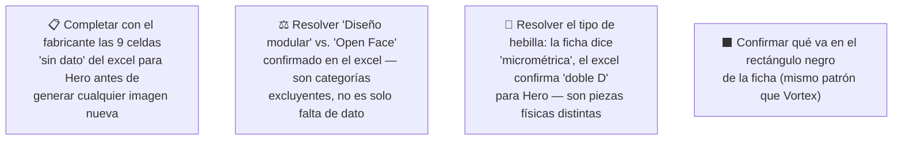

# Simulación 12 — Hero: verificación ficha de marketing vs. excel maestro de specs (Etapa 3 — Catálogo)

[← Volver al índice de mis pruebas](../mis-pruebas-claude-code.md) · [← Orquestación de agentes en paralelo](../orquestacion-agentes-paralelos.md)

Tercer caso del catálogo, pipeline **Tipo C**, con Agente Auditor independiente (igual que Kratos). A diferencia de Kratos y Vortex, acá el excel tiene muchas celdas **vacías** para la columna Hero (no "N/A", directamente sin dato) — el Auditor usó una tercera categoría de resultado, **SIN DATO**, distinta de MATCH y MISMATCH, para no confundir "no confirmado" con "confirmado que no lo tiene".

Además, Hero es un casco **open face / tipo jet** (sin mentonera, visera abatible, mentón expuesto — visible en la foto de referencia), lo que genera una contradicción estructural con uno de los claims, no solo una discrepancia de dato.

### 🔴 Pendiente de tu parte



<details><summary>Claims transcritos de la ficha Hero</summary>

**Bloque "HOMOLOGACIÓN — DOT FNVSS 510" (7 ítems):**
1. Visera anti scratch
2. Preparado para anti empañante
3. Sistema de emergencia de liberación rápida (ERS)
4. Liner desmontable y lavable
5. Sistema de liberación rápida del visor
6. Cubre barbilla
7. Cubre nariz

**Bloque grid de íconos (6 ítems):**
1. Diseño modular
2. Con luz LED
3. Canal para lentes
4. Hebilla micrométrica
5. Doble visera
6. Espacio para Bluetooth

</details>

<details><summary>Excel maestro — columna Hero, transcripción completa</summary>

| Fila | Valor Hero |
|---|---|
| Marca | EDGEPRO |
| Certificación | DOT & ECE 22.06 |
| Full Face-Flip Up-Open Face-Adventure | **OPEN FACE** |
| Con luz LED | (vacío) |
| Doble visera | (vacío) |
| Mica night vision/PC/etc | (vacío) |
| Preparado para anti empañante | (vacío) |
| Con Pinlock | (vacío) |
| Kit de mecanismo visor | X |
| Visera anti scratch | (vacío) |
| Hebilla micrométrica | (vacío) |
| Hebilla doble D | X |
| Espacio para Bluetooth | X |
| Material exterior ABS alta resistencia | (vacío — inusual, es la única columna sin dato en esta fila; todas las demás marcas tienen X) |
| Interior EPS de alta resistencia | (vacío) |
| Liner desmontable y lavable | X |
| Cubre barbilla | (vacío) |
| Cubre nariz | (vacío) |
| Emergency Quick Release System (ERS) | (vacío) |
| Canal para lentes (Glasses Fit System) | X |
| N° Air Vent System | (vacío) |
| Estilo de casco | (vacío) |
| Peso | (vacío) |
| Quick Visor Release System | (vacío) |
| Master Box | X |
| Inner Box-bolsa protectora | X |
| Con maletín de lujo | (vacío) |

</details>

### Auditoría — tabla de verificación (Agente Auditor independiente)

| # | Claim de la ficha | Fila del excel | Valor Hero | Resultado |
|---|---|---|---|---|
| 1 | Visera anti scratch | Visera anti scratch | (vacío) | ⚪ SIN DATO |
| 2 | Preparado para anti empañante | Preparado para anti empañante | (vacío) | ⚪ SIN DATO |
| 3 | Sistema de emergencia de liberación rápida (ERS) | Emergency Quick Release System (ERS) | (vacío) | ⚪ SIN DATO |
| 4 | Liner desmontable y lavable | Liner desmontable y lavable | X | ✅ MATCH |
| 5 | Sistema de liberación rápida del visor | Quick Visor Release System | (vacío) | ⚪ SIN DATO |
| 6 | Cubre barbilla | Cubre barbilla (Chin Curtain) | (vacío) | ⚪ SIN DATO |
| 7 | Cubre nariz | Cubre nariz (Anti-Fog Nose Guard) | (vacío) | ⚪ SIN DATO |
| 8 | Diseño modular | Full Face-Flip Up-Open Face-Adventure | OPEN FACE | ❌ MISMATCH |
| 9 | Con luz LED | Con luz LED | (vacío) | ⚪ SIN DATO |
| 10 | Canal para lentes | Canal para lentes (Glasses Fit System) | X | ✅ MATCH |
| 11 | Hebilla micrométrica | Hebilla micrométrica | (vacío) | ⚪ SIN DATO |
| 12 | Doble visera | Doble visera | (vacío) | ⚪ SIN DATO |
| 13 | Espacio para Bluetooth | Espacio para Bluetooth | X | ✅ MATCH |

**Veredicto:** 3 MATCH · 1 MISMATCH · 9 SIN DATO. Ninguna de las 9 celdas vacías se interpreta como "no lo tiene" — es información ausente en el excel, no un descarte confirmado.

### Hallazgos estructurales (no son solo discrepancias de dato)

1. **"Diseño modular" contradice el tipo de casco confirmado.** El excel dice OPEN FACE. Modular, Full Face y Open Face son categorías mutuamente excluyentes — esto es un MISMATCH duro, no falta de dato.
2. **"Cubre barbilla" — sentido físico dudoso en un open face.** Un casco open face no tiene mentonera propia; no se puede confirmar ni descartar con el dato disponible si existe una variante de esta pieza aplicable, pero la incoherencia potencial se señala aparte del resultado formal (SIN DATO).
3. **"Sistema de liberación rápida del visor" sí es físicamente plausible en un open face** (visera abatible tipo demi-jet) — acá el problema es solo falta de dato, no incoherencia de diseño.
4. **Conflicto de tipo de hebilla.** La ficha reclama "hebilla micrométrica" (sin dato en excel), pero el excel sí confirma con X "Hebilla doble D" para Hero — son dos piezas físicas distintas y mutuamente excluyentes. Hay evidencia indirecta de que el claim de la ficha está describiendo el tipo de hebilla equivocado, aunque formalmente el claim 11 quede como "sin dato" y no "mismatch".
5. **Material exterior ABS es la única celda sin dato de toda esa fila** — todas las demás marcas (Stellar, Kratos, Xpro, Vortex, Carbex, Shift) tienen X — vale la pena confirmar si es un vacío real del producto o un olvido de carga del excel.

### Cómo adaptar los 2 prompts de generación para Hero

**Conclusión: ninguno de los dos prompts sirve tal cual** (a diferencia de Vortex, donde sí servían sin cambios).

**Prompt A — tarjeta HOMOLOGACIÓN (6 ítems originales: visera anti scratch / ERS / liner / liberación rápida visor / cubre barbilla / cubre nariz):**
- Solo **1 de 6** queda confirmado por el excel: *Liner desmontable y lavable*.
- Los otros 5 deben sacarse o confirmarse con el fabricante antes de generar nada.
- **No hay, en el excel, otros ítems de este bloque confirmados con X para completar la tarjeta a 6** — hace falta información adicional del fabricante, no se puede resolver solo con lo que ya tenemos.

**Prompt B — grid 2x3 de íconos (6 ítems originales: canal para lentes / hebilla micrométrica / bluetooth / kit mecanismo visor / material ABS / interior EPS):**
- **3 de 6** quedan confirmados tal cual: *Canal para lentes, Espacio para Bluetooth, Kit de mecanismo visor*.
- *Hebilla micrométrica* debe sacarse y reemplazarse por ***Hebilla doble D*** (sí confirmada con X para Hero).
- *Material exterior ABS* e *Interior EPS* quedan sin dato — no hay más ítems confirmados en el excel para completar el grid a 6.
- Resultado: **el grid B solo se puede armar hoy con 4 ítems confirmados** (Canal para lentes, Bluetooth, Kit de mecanismo visor, Hebilla doble D). Faltan 2 para llegar a 6.

### Estado: 🔴 Bloqueado — no se puede generar ninguna imagen de Hero todavía sin datos adicionales

**Qué falló:** "Diseño modular" contradice el tipo de casco confirmado (open face); "hebilla micrométrica" probablemente sea el tipo de hebilla equivocado (el excel confirma doble D).

**Qué hay que hacer:**
1. Completar con el fabricante las 9 celdas "sin dato" del excel para Hero antes de tocar los prompts de generación.
2. Resolver explícitamente "diseño modular" vs. "open face" en el excel maestro — no es un vacío, es una contradicción activa.
3. Resolver el conflicto de hebilla (micrométrica vs. doble D) antes de armar el grid B.
4. Confirmar qué va en el rectángulo negro de la ficha (mismo pendiente que Vortex).
5. Una vez completado el excel, recién ahí adaptar los 2 prompts con la lista de ítems corregida (ver tablas arriba) y generar.

## Prompts del catálogo (Agente Generador) — A bloqueado, B reducido a 4 ítems

**Prompt A sigue bloqueado, no se generó texto de prompt.** Datos que hacen falta pedirle al fabricante para poder armarlo (celdas vacías en el excel, columna Hero, bloque de homologación):
1. Visera anti scratch — ¿el visor tiene tratamiento anti-rayado?
2. Preparado para anti empañante — ¿admite/incluye tratamiento anti-vaho?
3. Sistema de emergencia de liberación rápida (ERS) — ¿el liner tiene ERS?
4. Sistema de liberación rápida del visor — ¿el mecanismo permite desmontaje rápido sin herramientas?
5. Cubre barbilla y cubre nariz — ¿Hero incluye estas piezas accesorias?

<details><summary>Prompt B — Grid de íconos Hero (4 ítems, versión con datos disponibles — NO 6)</summary>

```
Diseña una tarjeta de especificaciones técnicas en formato GRID DE ÍCONOS 2x2
(dos columnas, dos filas), resolución 4K, fondo transparente o blanco liso,
para el casco EDGE modelo HERO (open face / jet).

NOTA: Esta es una versión de 4 ítems, no de 6. El grid original contemplaba
6 elementos (2x3), pero solo 4 características de Hero están confirmadas con
dato verificado en el excel maestro. NO se incluyen "Material exterior ABS
alta resistencia" ni "Interior EPS de alta resistencia" porque, aunque están
confirmadas para otros modelos del catálogo, para Hero esas filas no tienen
dato. Tampoco se incluye "Hebilla micrométrica" porque el excel confirma que
Hero usa un tipo de hebilla distinto: hebilla doble D.

LAYOUT: grid de 2 columnas x 2 filas (4 celdas), distribución uniforme y
simétrica, espaciado igual entre celdas y márgenes iguales en los 4 bordes.
Cada celda: ícono centrado arriba, texto del ítem en mayúsculas centrado
debajo, mismo tamaño de fuente en las 4 celdas.

ESTILO DE ÍCONO — mantener consistencia con las demás piezas de esta ficha:
- Estilo lineal, trazo uniforme, sin relleno sólido salvo detalles mínimos.
- Color principal rojo/bordo (tono EDGE), sobre octágono de fondo.
- Mismo grosor de trazo, mismo tamaño de octágono y misma paleta en los 4 íconos.

LOS 4 ÍTEMS A REPRESENTAR (en este orden):
1. CANAL PARA LENTES
2. ESPACIO PARA BLUETOOTH
3. KIT DE MECANISMO VISOR
4. HEBILLA DOBLE D

CRÍTICO — íconos nuevos, no reciclados de la referencia:
- Diseñá un ícono lineal NUEVO específico para cada ítem, especialmente "HEBILLA DOBLE D" — la imagen de referencia (de otro modelo) probablemente muestre un ícono de "hebilla micrométrica" con tache o X; NO lo copies, doble D es un broche físicamente distinto y debe dibujarse desde cero, sin tache.
- No reutilices el dibujo de ningún ícono de la referencia que corresponda a un ítem que no está en esta lista de 4.

PROHIBIDO ABSOLUTO:
- No agregar un quinto o sexto ítem para "completar" el grid a 6.
- No incluir "Hebilla micrométrica" (no confirmada; el dato correcto es doble D).
- No incluir "Material exterior ABS" ni "Interior EPS" (sin dato confirmado para Hero).
- No dejar celdas vacías decorativas ni forzar un layout 2x3 con huecos: rediseñar
  limpiamente como 2x2.

ASPECTO Y SALIDA: relación 1:1 o 4:3 (consistente con el resto de la ficha),
4K, fondo limpio apto para maquetación junto a las demás piezas.
```

</details>

---

## Sub-caso — Foto lifestyle inspirada (Tipo A, distinto del catálogo de specs de arriba)

Pedido aparte del usuario, en paralelo a la auditoría de specs: generar una foto lifestyle del Hero (persona con el casco puesto, plano contrapicado) **inspirada en la composición** de una foto de referencia ajena (persona con un casco integral negro/dorado distinto, mismo tipo de plano contrapicado contra el cielo) — pero usando **únicamente** la geometría/color/diseño del casco real Hero, nunca el casco de la referencia.

Regla aplicada (Lección 7 del pipeline): la referencia de estilo va primero en el payload, la foto real del casco (autoridad) va al final.

<details><summary>Prompt usado</summary>

```
Genera una fotografía de producto tipo lifestyle en 4K, formato vertical
(relación aproximada 3:4, igual que la imagen de referencia de composición).

CRÍTICO — el casco que aparece en la imagen debe ser EXACTAMENTE el casco real
adjunto como autoridad (foto del modelo Hero): open face / tipo jet, negro mate,
visera clara/transparente abatible con mecanismo de pivote visible, ventilación
superior con rejilla, correa con hebilla roja, acolchado interior negro en el
borde. No cambies su geometría, forma, color, ni le agregues ningún gráfico,
diseño, franja ni pintura que no esté en la foto real del casco.

La imagen de referencia de estilo (persona con casco negro, plano contrapicado,
cielo de fondo) se usa ÚNICAMENTE para tomar prestado lo siguiente:
- Ángulo de cámara: contrapicado (desde abajo, mirando hacia arriba)
- Encuadre: persona de hombros hacia arriba, casco puesto, centrada o levemente
  descentrada, con espacio de cielo/fondo claro alrededor de la cabeza
- Iluminación: luz natural suave, cálida, de día despejado
- Mood/composición general: minimalista, editorial, sin elementos que distraigan

PROHIBIDO ABSOLUTO: no copiar el casco de la imagen de referencia (es un
modelo integral/full-face con diseño de pintura distinto, gris/dorado con
líneas — no tiene nada que ver con el casco real que estás usando). La
referencia es SOLO para ángulo, luz y encuadre — el único casco permitido en
la imagen final es el casco real adjunto (Hero), sin excepciones.

Persona modelo: sin rasgos específicos pedidos — cualquier persona con el
casco puesto, rostro no necesariamente visible (el casco puede cubrirlo,
como en la referencia).

Fondo: cielo despejado o levemente nublado, tono cálido/neutro, sin elementos
que compitan visualmente con el casco. Sin logos, sin texto superpuesto,
sin marca de agua.

Orden de imágenes en el payload: 1) foto de referencia de estilo/composición,
2) foto real del casco Hero (autoridad final de geometría y color) — la
imagen del casco real manda sobre cualquier otro detalle.
```

</details>

### Intento 1 — resultado auditado


**Estado:** ⚠️ Falló — reintentar con prompt ajustado (ver Intento 2 abajo).

**Qué falló:**
- Formato vertical en vez de horizontal (pedido explícito del usuario).
- Ángulo de cámara 3/4 frontal en vez de perfil lateral, que es el ángulo real del checkpoint.
- **Degradé de color bronce/dorado en la parte inferior del casco** — el casco real es 100% negro mate sin ninguna transición de color. Contaminación del casco de referencia (estilo) hacia la geometría/color del casco real — justo lo que el prompt intentaba prohibir.
- **Forma de la ventilación superior distinta** a la del checkpoint (salió más grande y con forma de rombo; en el real es una rejilla alargada/ovalada más chica).

**Qué hay que hacer:** reintentar con el prompt corregido (Intento 2) — máximo 1-2 reintentos antes de escalar a humano, según la regla del pipeline.

### Intento 2 — prompt corregido

<details><summary>Prompt usado</summary>

```
Genera una fotografía de producto tipo lifestyle en 4K, formato HORIZONTAL
(apaisado, relación aproximada 4:3 — NO vertical/retrato).

ÁNGULO DE CÁMARA: perfil lateral (de lado), igual que la foto de referencia
del casco real (checkpoint) — NO uses un ángulo de 3/4 frontal. La cámara
mira al casco desde el costado, a la altura de los ojos aprox., igual que
en la foto de referencia del casco.

CRÍTICO — el casco que aparece en la imagen debe ser EXACTAMENTE el casco
real adjunto como autoridad (foto del modelo Hero, checkpoint): open face /
tipo jet, 100% negro mate SIN degradé ni ningún otro color (nada de bronce,
dorado ni ninguna transición de color — el intento anterior agregó un
degradé bronce que NO existe en el casco real, no lo repitas), visera
clara/transparente abatible con mecanismo de pivote visible, ventilación
superior con la MISMA forma exacta del checkpoint (rejilla alargada/ovalada
pequeña, no un rombo grande — el intento anterior cambió esta forma, no la
repitas), correa con hebilla roja, acolchado interior negro con costura roja
en el borde. No cambies su geometría, forma, color ni ningún detalle físico.

La imagen de referencia de estilo (persona con casco negro/dorado, cielo de
fondo) se usa ÚNICAMENTE para tomar prestado:
- Iluminación: luz natural suave, cálida, de día despejado
- Mood: minimalista, editorial, sin elementos que distraigan
NO se usa para el ángulo de cámara (eso lo define el checkpoint, ver arriba)
ni para el color/diseño del casco.

PROHIBIDO ABSOLUTO: no copiar el color, degradé, ni ninguna forma del casco
de la imagen de referencia de estilo — el único casco permitido es el casco
real adjunto (Hero), en negro mate puro, sin excepciones.

Persona modelo: sin rasgos específicos pedidos, casco puesto, rostro puede
estar parcialmente visible por el ángulo de perfil.

Fondo: cielo despejado o levemente nublado, tono cálido/neutro, sin
elementos que compitan visualmente con el casco. Sin logos, sin texto
superpuesto, sin marca de agua.

Orden de imágenes en el payload: 1) foto de referencia de estilo/iluminación,
2) foto real del casco Hero de perfil (autoridad final de geometría, color
y ángulo) — la imagen del checkpoint manda sobre cualquier otro detalle.
```

</details>

**Estado:** 🔴 pendiente de generar — esta sesión no tiene conectada una herramienta de generación de imagen, el prompt queda listo para correr en la herramienta ya validada (Nano Banana Pro/OpenRouter).

**Qué falló:** N/A (todavía no generado).

**Qué hay que hacer:** correr el prompt, mandar el resultado para auditoría. Si vuelve a fallar en color/forma/ángulo, es el segundo y último reintento automático antes de escalar a humano (regla del pipeline).

### Intento 3 — mismo casco, nueva referencia de estilo (moody urbano)

El usuario cambió la imagen de referencia de estilo (ahora: motociclista de perfil/espaldas, casco integral negro brillante con parche y sticker, campera de cuero, mochila táctica, fondo urbano de concreto desenfocado, paleta fría/desaturada) — pidió explícitamente **no modificar nada de la descripción del casco Hero**, solo actualizar qué se toma prestado de la referencia (mood, paleta, fondo, vestuario). Mantiene el ángulo de perfil lateral del intento 2 (viene del checkpoint, no de la referencia).

<details><summary>Prompt usado</summary>

```
Genera una fotografía de producto tipo lifestyle en 4K, formato HORIZONTAL
(apaisado, relación aproximada 4:3 — NO vertical/retrato).

ÁNGULO DE CÁMARA: perfil lateral (de lado), igual que la foto de referencia
del casco real (checkpoint) — NO uses un ángulo de 3/4 frontal. La cámara
mira al casco desde el costado, a la altura de los ojos aprox., igual que
en la foto de referencia del casco.

CRÍTICO — el casco que aparece en la imagen debe ser EXACTAMENTE el casco
real adjunto como autoridad (foto del modelo Hero, checkpoint): open face /
tipo jet, 100% negro mate SIN degradé ni ningún otro color (nada de bronce,
dorado ni ninguna transición de color), visera clara/transparente abatible
con mecanismo de pivote visible, ventilación superior con la MISMA forma
exacta del checkpoint (rejilla alargada/ovalada pequeña, no un rombo
grande), correa con hebilla roja, acolchado interior negro con costura roja
en el borde. No cambies su geometría, forma, color ni ningún detalle físico.

La NUEVA imagen de referencia de estilo (persona de espaldas/perfil sobre
una moto, casco integral negro brillante con parche/sticker en la mandíbula,
campera de cuero negra, mochila táctica negra al hombro, fondo urbano de
concreto desenfocado, paleta desaturada y fría, luz difusa de exterior/día
nublado) se usa ÚNICAMENTE para tomar prestado:
- Mood/paleta: tonos fríos, desaturados, urbano/editorial, nada cálido
- Iluminación: luz difusa, suave, de exterior nublado (no sol directo)
- Fondo: concreto/pared urbana desenfocada (bokeh), no cielo
- Vestuario del modelo: campera de cuero negra, guantes negros, mochila al
  hombro — estos elementos de vestuario SÍ se pueden copiar de la referencia
  (no son parte del casco)
- Composición: figura recortada contra el fondo, sensación de movimiento/
  acción congelada

NO se usa la referencia para: el ángulo de cámara (eso lo define el
checkpoint, perfil lateral — la referencia tiene un ángulo de 3/4 trasero,
NO lo copies), ni para el casco (es un modelo integral/full-face distinto,
con visera oscura/ahumada y un parche con bandera sueca — nada de eso debe
aparecer).

PROHIBIDO ABSOLUTO: no copiar el casco de la referencia (integral, visera
oscura, parche/sticker) bajo ninguna forma — el único casco permitido es el
casco real adjunto (Hero, open face, negro mate puro, visera transparente),
sin excepciones. No agregar ningún sticker, parche, bandera ni texto al
casco Hero.

Persona modelo: sin rasgos específicos pedidos, casco puesto, rostro puede
estar parcialmente visible por el ángulo de perfil. Puede llevar campera de
cuero y mochila como en la referencia.

Fondo: pared/concreto urbano desenfocado, tono frío/neutro, sin elementos
que compitan visualmente con el casco. Sin logos, sin texto superpuesto,
sin marca de agua.

Orden de imágenes en el payload: 1) foto de referencia de estilo/mood/
vestuario, 2) foto real del casco Hero de perfil (autoridad final de
geometría, color y ángulo) — la imagen del checkpoint manda sobre
cualquier otro detalle del casco.
```

</details>

**Estado:** 🔴 pendiente de generar.

**Qué falló:** N/A (todavía no generado).

**Qué hay que hacer:** correr el prompt, mandar el resultado para auditoría.

---

**Última actualización:** 2026-07-28 · Agente 0 (transcripción) + Agente Auditor independiente (verificación + adaptación de prompts), corridos en esta sesión a pedido explícito de auditar el tercer caso del catálogo (Hero). Sub-caso de foto lifestyle: intento 1 auditado con 4 defectos (formato, ángulo, degradé de color, forma de ventilación), intento 2 con prompt corregido listo para correr.
