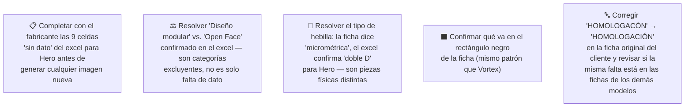

# Simulación 12 — Hero: verificación ficha de marketing vs. excel maestro de specs (Etapa 3 — Catálogo)

[← Volver al índice de mis pruebas](../mis-pruebas-claude-code.md) · [← Orquestación de agentes en paralelo](../orquestacion-agentes-paralelos.md)

Tercer caso del catálogo, pipeline **Tipo C**, con Agente Auditor independiente (igual que Kratos). A diferencia de Kratos y Vortex, acá el excel tiene muchas celdas **vacías** para la columna Hero (no "N/A", directamente sin dato) — el Auditor usó una tercera categoría de resultado, **SIN DATO**, distinta de MATCH y MISMATCH, para no confundir "no confirmado" con "confirmado que no lo tiene".

Además, Hero es un casco **open face / tipo jet** (sin mentonera, visera abatible, mentón expuesto — visible en la foto de referencia), lo que genera una contradicción estructural con uno de los claims, no solo una discrepancia de dato.

### 🔴 Pendiente de tu parte



<details><summary>Claims transcritos de la ficha Hero</summary>

**Bloque "HOMOLOGACIÓN — DOT FNVSS 510" (7 ítems):**
1. Visera anti scratch
2. Preparado para anti empañante
3. Sistema de emergencia de liberación rápida (ERS)
4. Liner desmontable y lavable
5. Sistema de liberación rápida del visor
6. Cubre barbilla
7. Cubre nariz

**Bloque grid de íconos (6 ítems):**
1. Diseño modular
2. Con luz LED
3. Canal para lentes
4. Hebilla micrométrica
5. Doble visera
6. Espacio para Bluetooth

</details>

<details><summary>Excel maestro — columna Hero, transcripción completa</summary>

| Fila | Valor Hero |
|---|---|
| Marca | EDGEPRO |
| Certificación | DOT & ECE 22.06 |
| Full Face-Flip Up-Open Face-Adventure | **OPEN FACE** |
| Con luz LED | (vacío) |
| Doble visera | (vacío) |
| Mica night vision/PC/etc | (vacío) |
| Preparado para anti empañante | (vacío) |
| Con Pinlock | (vacío) |
| Kit de mecanismo visor | X |
| Visera anti scratch | (vacío) |
| Hebilla micrométrica | (vacío) |
| Hebilla doble D | X |
| Espacio para Bluetooth | X |
| Material exterior ABS alta resistencia | (vacío — inusual, es la única columna sin dato en esta fila; todas las demás marcas tienen X) |
| Interior EPS de alta resistencia | (vacío) |
| Liner desmontable y lavable | X |
| Cubre barbilla | (vacío) |
| Cubre nariz | (vacío) |
| Emergency Quick Release System (ERS) | (vacío) |
| Canal para lentes (Glasses Fit System) | X |
| N° Air Vent System | (vacío) |
| Estilo de casco | (vacío) |
| Peso | (vacío) |
| Quick Visor Release System | (vacío) |
| Master Box | (vacío) — corregido: una transcripción anterior lo tenía como X |
| Inner Box-bolsa protectora | (vacío) — corregido: una transcripción anterior lo tenía como X |
| Con maletín de lujo | (vacío) |

</details>

### Auditoría — tabla de verificación (Agente Auditor independiente)

| # | Claim de la ficha | Fila del excel | Valor Hero | Resultado |
|---|---|---|---|---|
| 1 | Visera anti scratch | Visera anti scratch | (vacío) | ⚪ SIN DATO |
| 2 | Preparado para anti empañante | Preparado para anti empañante | (vacío) | ⚪ SIN DATO |
| 3 | Sistema de emergencia de liberación rápida (ERS) | Emergency Quick Release System (ERS) | (vacío) | ⚪ SIN DATO |
| 4 | Liner desmontable y lavable | Liner desmontable y lavable | X | ✅ MATCH |
| 5 | Sistema de liberación rápida del visor | Quick Visor Release System | (vacío) | ⚪ SIN DATO |
| 6 | Cubre barbilla | Cubre barbilla (Chin Curtain) | (vacío) | ⚪ SIN DATO |
| 7 | Cubre nariz | Cubre nariz (Anti-Fog Nose Guard) | (vacío) | ⚪ SIN DATO |
| 8 | Diseño modular | Full Face-Flip Up-Open Face-Adventure | OPEN FACE | ❌ MISMATCH |
| 9 | Con luz LED | Con luz LED | (vacío) | ⚪ SIN DATO |
| 10 | Canal para lentes | Canal para lentes (Glasses Fit System) | X | ✅ MATCH |
| 11 | Hebilla micrométrica | Hebilla micrométrica | (vacío) | ⚪ SIN DATO |
| 12 | Doble visera | Doble visera | (vacío) | ⚪ SIN DATO |
| 13 | Espacio para Bluetooth | Espacio para Bluetooth | X | ✅ MATCH |

**Veredicto:** 3 MATCH · 1 MISMATCH · 9 SIN DATO. Ninguna de las 9 celdas vacías se interpreta como "no lo tiene" — es información ausente en el excel, no un descarte confirmado.

**⚠️ Corrección de una lectura errónea (registrada a propósito, para no repetirla):** en un momento de esta sesión se marcaron "Cubre barbilla" y "Cubre nariz" como X confirmado para Hero, a partir de una captura de excel de baja resolución donde la columna Hero quedaba cerca del borde. Una captura posterior, más clara y completa, mostró que **ambas celdas están vacías para Hero** — la lectura anterior fue un error de interpretación visual, no un dato nuevo. Se revierte a SIN DATO y el veredicto vuelve a 3 MATCH · 1 MISMATCH · 9 SIN DATO. **Lección de método:** cuando un dato del excel se lee de una captura de pantalla (no del archivo original), y sobre todo cuando la columna está cerca del borde o en baja resolución, el dato tiene que marcarse como provisorio hasta confirmarlo con una segunda captura nítida — nunca escribirlo directo como confirmado. La columna Hero tiene exactamente **5 celdas con X**: Kit de mecanismo visor, Hebilla doble D, Espacio para Bluetooth, Liner desmontable y lavable, y Canal para lentes. Todo el resto está vacío.

### Hallazgos estructurales (no son solo discrepancias de dato)

1. **"Diseño modular" contradice el tipo de casco confirmado.** El excel dice OPEN FACE. Modular, Full Face y Open Face son categorías mutuamente excluyentes — esto es un MISMATCH duro, no falta de dato.
2. **"Cubre barbilla" — sentido físico dudoso en un open face.** Un casco open face no tiene mentonera propia; no se puede confirmar ni descartar con el dato disponible si existe una variante de esta pieza aplicable, pero la incoherencia potencial se señala aparte del resultado formal (SIN DATO).
3. **"Sistema de liberación rápida del visor" sí es físicamente plausible en un open face** (visera abatible tipo demi-jet) — acá el problema es solo falta de dato, no incoherencia de diseño.
4. **Conflicto de tipo de hebilla.** La ficha reclama "hebilla micrométrica" (sin dato en excel), pero el excel sí confirma con X "Hebilla doble D" para Hero — son dos piezas físicas distintas y mutuamente excluyentes. Hay evidencia indirecta de que el claim de la ficha está describiendo el tipo de hebilla equivocado, aunque formalmente el claim 11 quede como "sin dato" y no "mismatch".
5. **Material exterior ABS es la única celda sin dato de toda esa fila** — todas las demás marcas (Stellar, Kratos, Xpro, Vortex, Carbex, Shift) tienen X — vale la pena confirmar si es un vacío real del producto o un olvido de carga del excel.

### Cómo adaptar los 2 prompts de generación para Hero

**Conclusión: ninguno de los dos prompts sirve tal cual** (a diferencia de Vortex, donde sí servían sin cambios).

**Prompt A — tarjeta HOMOLOGACIÓN (6 ítems originales: visera anti scratch / ERS / liner / liberación rápida visor / cubre barbilla / cubre nariz):**
- Solo **1 de 6** queda confirmado por el excel: *Liner desmontable y lavable*. (Corrección: "Cubre barbilla" y "Cubre nariz" habían sido marcados como confirmados por una lectura errónea de una captura de baja resolución — ver la nota de corrección arriba. Están vacíos para Hero.)
- Los otros 5 (Visera anti scratch, ERS, Sistema de liberación rápida del visor, Cubre barbilla, Cubre nariz) siguen sin dato. **Con un solo ítem confirmado no hay tarjeta posible** — el Prompt A vuelve a quedar 🔴 bloqueado hasta que el fabricante complete el excel. La versión de 3 ítems que se armó más abajo quedó basada en el dato erróneo y NO debe correrse tal cual.

**Prompt B — grid 2x3 de íconos (6 ítems originales: canal para lentes / hebilla micrométrica / bluetooth / kit mecanismo visor / material ABS / interior EPS):**
- **3 de 6** quedan confirmados tal cual: *Canal para lentes, Espacio para Bluetooth, Kit de mecanismo visor*.
- *Hebilla micrométrica* debe sacarse y reemplazarse por ***Hebilla doble D*** (sí confirmada con X para Hero).
- *Material exterior ABS* e *Interior EPS* quedan sin dato — no hay más ítems confirmados en el excel para completar el grid a 6.
- Resultado: **el grid B solo se puede armar hoy con 4 ítems confirmados** (Canal para lentes, Bluetooth, Kit de mecanismo visor, Hebilla doble D). Faltan 2 para llegar a 6.

### Estado: ✅ los 2 prompts definitivos están armados — reparto 3 + 3 (ver [sección de abajo](#-versión-definitiva-de-las-2-tarjetas-de-hero--reparto-3--3-sin-ítems-repetidos))

> **Nota:** durante un tramo de esta sesión el Prompt A quedó 🔴 bloqueado por tener un solo ítem confirmado *dentro de su bloque original*. Se destrabó al repartir los 6 datos confirmados de Hero entre las dos tarjetas (3 y 3) en vez de tratarlas por separado. El análisis de abajo sobre "1 de 6" y "4 de 6" queda como registro de cómo se llegó ahí.

**Qué falló:** "Diseño modular" contradice el tipo de casco confirmado (open face); "hebilla micrométrica" probablemente sea el tipo de hebilla equivocado (el excel confirma doble D).

**Qué hay que hacer:**
1. Completar con el fabricante las 9 celdas "sin dato" del excel para Hero antes de poder armar la tarjeta de homologación — hoy solo hay 1 ítem confirmado de los 6 que necesita.
2. Resolver explícitamente "diseño modular" vs. "open face" en el excel maestro — no es un vacío, es una contradicción activa.
3. Confirmar qué va en el rectángulo negro de la ficha (mismo pendiente que Vortex).
4. Mientras tanto, solo el Prompt B (4/6 ítems confirmados) es generable. El Prompt A no.

## Prompts del catálogo (Agente Generador) — A bloqueado, B reducido a 4 ítems

**Prompt A — datos que hacen falta pedirle al fabricante** para completar la tarjeta a 6 (celdas todavía vacías en el excel, columna Hero, bloque de homologación):
1. Visera anti scratch — ¿el visor tiene tratamiento anti-rayado?
2. Preparado para anti empañante — ¿admite/incluye tratamiento anti-vaho?
3. Sistema de emergencia de liberación rápida (ERS) — ¿el liner tiene ERS?
4. Sistema de liberación rápida del visor — ¿el mecanismo permite desmontaje rápido sin herramientas?

<details><summary>⚠️ OBSOLETO — Prompt A de 3 ítems (armado sobre un dato erróneo, NO usar)</summary>

**No correr este prompt.** Se armó cuando "Cubre barbilla" y "Cubre nariz" figuraban por error como confirmados para Hero. Con el dato corregido, solo *Liner desmontable y lavable* está confirmado, así que esta tarjeta de 3 ítems afirmaría 2 features sin respaldo. Se conserva únicamente como registro del error.

```
Diseñá una tarjeta de HOMOLOGACIÓN para el casco EDGEPRO HERO (open
face), EXACTAMENTE con la misma forma, estructura y tamaño que la
imagen de referencia adjunta — el lienzo final tiene que tener el
mismo ancho y alto en píxeles que la referencia (formato vertical
angosto), sin recortar ni estirar ni cambiar la proporción.

NOTA: Esta es una versión de 3 ítems, no de 6. El bloque original
contemplaba 6 elementos, pero solo 3 características de Hero están
confirmadas con dato verificado en el excel maestro. NO se incluyen
"Visera anti scratch", "Sistema de emergencia de liberación rápida
(ERS)" ni "Sistema de liberación rápida del visor" porque, para Hero,
esas filas no tienen dato todavía en el excel.

CRÍTICO — ESTRUCTURA DE 3 BLOQUES, igual que la referencia (no
describir el título como una sola línea de texto, tiene que ser esta
estructura de 3 partes apiladas):

BLOQUE 1 — Título (franja angosta arriba, fondo gris claro):
- Texto "HOMOLOGACIÓN" en mayúsculas, negro, bold, centrado.

BLOQUE 2 — Banner negro (rectángulo sólido negro, ancho completo del
lienzo, ocupa aproximadamente el 20-25% del alto total de la tarjeta):
- Texto "DOT" en letras BLANCAS enormes, bold, centrado.
- Debajo, en el mismo banner negro, texto blanco más chico: "& ECE
  22.06" (usar exactamente este texto — NO "FNVSS 510").

BLOQUE 3 — Lista de ítems (zona gris clara, el resto del alto de la
tarjeta, debajo del banner negro):
Lista de EXACTAMENTE 3 ítems, en este orden, cada uno en mayúsculas,
negro, bold, centrado, separados por una línea horizontal fina gris
entre cada ítem:
1. LINER DESMONTABLE Y LAVABLE
2. CUBRE BARBILLA
3. CUBRE NARIZ

CRÍTICO — ESPACIADO UNIFORME: el espacio vertical entre los 3 ítems
del Bloque 3 debe ser EXACTAMENTE IGUAL entre todos los pares
consecutivos. Distribuí la zona gris completa de forma pareja entre
los 3 ítems, sin huecos irregulares ni forzar el espaciado de una
tarjeta de 6 ítems en una de 3.

PROHIBIDO ABSOLUTO:
- NO incluir "Visera anti scratch", "Sistema de emergencia de
  liberación rápida (ERS)" ni "Sistema de liberación rápida del
  visor" — sin dato confirmado para Hero todavía.
- No mostrar "DOT FNVSS 510" — la certificación correcta es "DOT & ECE
  22.06".
- No usar rectángulos negros sólidos como placeholder en ningún otro
  lugar de la tarjeta.
- No forzar un 4°, 5° o 6° ítem para "completar" la tarjeta.
```

</details>
5. Cubre barbilla y cubre nariz — ¿Hero incluye estas piezas accesorias?

<details><summary>Prompt B — Grid de íconos Hero (4 ítems, versión con datos disponibles — NO 6)</summary>

```
Diseña una tarjeta de especificaciones técnicas en formato GRID DE ÍCONOS 2x2
(dos columnas, dos filas), resolución 4K, fondo transparente o blanco liso,
para el casco EDGE modelo HERO (open face / jet).

NOTA: Esta es una versión de 4 ítems, no de 6. El grid original contemplaba
6 elementos (2x3), pero solo 4 características de Hero están confirmadas con
dato verificado en el excel maestro. NO se incluyen "Material exterior ABS
alta resistencia" ni "Interior EPS de alta resistencia" porque, aunque están
confirmadas para otros modelos del catálogo, para Hero esas filas no tienen
dato. Tampoco se incluye "Hebilla micrométrica" porque el excel confirma que
Hero usa un tipo de hebilla distinto: hebilla doble D.

LAYOUT: grid de 2 columnas x 2 filas (4 celdas), distribución uniforme y
simétrica, espaciado igual entre celdas y márgenes iguales en los 4 bordes.
Cada celda: ícono centrado arriba, texto del ítem en mayúsculas centrado
debajo, mismo tamaño de fuente en las 4 celdas.

CRÍTICO — DIMENSIONES Y LAYOUT EXACTOS (verificado que un generador anterior falló acá con otro caso — produjo un grid con filas/celdas de más y contenido repetido, prestar máxima atención):
- El grid debe tener EXACTAMENTE 2 columnas x 2 filas = 4 celdas en total, nunca 2x3 ni 6 celdas, nunca una fila de más.
- Cada uno de los 4 ítems aparece en UNA sola celda, UNA sola vez — no dupliques ningún ítem para rellenar espacio.
- El lienzo final debe tener EXACTAMENTE el mismo ancho y alto en píxeles (mismo aspect ratio) que la imagen de referencia adjunta.
- Antes de terminar, contá las celdas: deben ser 4, ni una más ni una menos, ninguna repetida.

ESTILO DE ÍCONO — mantener consistencia con las demás piezas de esta ficha:
- Estilo lineal, trazo uniforme, sin relleno sólido salvo detalles mínimos.
- Color principal rojo/bordo (tono EDGE), sobre octágono de fondo.
- Mismo grosor de trazo, mismo tamaño de octágono y misma paleta en los 4 íconos.

LOS 4 ÍTEMS A REPRESENTAR (en este orden):
1. CANAL PARA LENTES
2. ESPACIO PARA BLUETOOTH
3. KIT DE MECANISMO VISOR
4. HEBILLA DOBLE D

CRÍTICO — íconos nuevos, no reciclados de la referencia:
- Diseñá un ícono lineal NUEVO específico para cada ítem, especialmente "HEBILLA DOBLE D" — la imagen de referencia (de otro modelo) probablemente muestre un ícono de "hebilla micrométrica" con tache o X; NO lo copies, doble D es un broche físicamente distinto y debe dibujarse desde cero, sin tache.
- No reutilices el dibujo de ningún ícono de la referencia que corresponda a un ítem que no está en esta lista de 4.

PROHIBIDO ABSOLUTO:
- No agregar un quinto o sexto ítem para "completar" el grid a 6.
- No incluir "Hebilla micrométrica" (no confirmada; el dato correcto es doble D).
- No incluir "Material exterior ABS" ni "Interior EPS" (sin dato confirmado para Hero).
- No dejar celdas vacías decorativas ni forzar un layout 2x3 con huecos: rediseñar
  limpiamente como 2x2.

ASPECTO Y SALIDA: relación 1:1 o 4:3 (consistente con el resto de la ficha),
4K, fondo limpio apto para maquetación junto a las demás piezas.
```

</details>

### Intento 1 — resultado auditado (Prompt B)

**Estado:** ⚠️ Falló — grid de 6 celdas (2x3) en vez de 4 (2x2), con 2 ítems duplicados.

**Qué falló:** el resultado real salió como un grid de 6 celdas (2 columnas x 3 filas), no las 4 pedidas. Fila 1: "Canal para lentes" y "Espacio para Bluetooth", cada uno 1 sola vez, como correspondía. Fila 2: "Kit de mecanismo visor" y "Hebilla doble D", primera aparición de cada uno. Fila 3: "Kit de mecanismo visor" otra vez, pero con un ícono completamente distinto al de la fila 2 (esta vez con aspecto de mecanismo/engranaje con tornillos y palanca, estilo herramienta), y "Hebilla doble D" otra vez, también con un ícono ligeramente distinto (correa rellena con un rectángulo punteado). Es decir, "Kit de mecanismo visor" y "Hebilla doble D" quedaron duplicados, cada uno con arte distinto en cada aparición, generando 6 celdas en vez de 4 — a pesar de que el prompt ya decía explícitamente "EXACTAMENTE 2 columnas x 2 filas = 4 celdas... contá las celdas antes de terminar, ninguna repetida". Es el mismo patrón de "grid con celdas de más y contenido duplicado" que el propio Prompt B ya advertía como riesgo conocido de otros casos del catálogo, y la advertencia no alcanzó para evitarlo esta vez.

**Qué hay que hacer:** reintentar con el prompt reforzado (Intento 2, abajo), que nombra explícitamente los 2 ítems que se duplicaron.

### Intento 2 — prompt corregido, nombrando los ítems que se duplicaron

<details><summary>Prompt usado</summary>

```
Diseña una tarjeta de especificaciones técnicas en formato GRID DE ÍCONOS 2x2
(dos columnas, dos filas), resolución 4K, fondo transparente o blanco liso,
para el casco EDGE modelo HERO (open face / jet).

NOTA: Esta es una versión de 4 ítems, no de 6. Solo 4 características de
Hero están confirmadas con dato verificado en el excel maestro. NO se
incluyen "Material exterior ABS alta resistencia" ni "Interior EPS de alta
resistencia" (sin dato para Hero). Tampoco se incluye "Hebilla micrométrica"
(el excel confirma hebilla doble D en su lugar para Hero).

CRÍTICO — DIMENSIONES Y LAYOUT EXACTOS (un intento anterior de este mismo
caso falló acá: produjo un grid de 2x3 = 6 celdas en vez de 2x2 = 4,
duplicando "Kit de mecanismo visor" y "Hebilla doble D" con un ícono
distinto en cada repetición — máxima atención, no lo repitas):
- El grid debe tener EXACTAMENTE 2 columnas x 2 filas = 4 celdas en total.
  NUNCA 2x3, NUNCA 6 celdas, NUNCA una fila de más "por si acaso".
- Cada uno de los 4 ítems aparece en UNA sola celda, UNA sola vez. En
  particular: "KIT DE MECANISMO VISOR" aparece UNA sola vez, no dos. Y
  "HEBILLA DOBLE D" aparece UNA sola vez, no dos. No generes una segunda
  versión de ninguno de estos 2 ítems con un ícono distinto para rellenar
  una fila extra.
- El lienzo final debe tener EXACTAMENTE el mismo ancho y alto en píxeles
  (mismo aspect ratio) que la imagen de referencia adjunta.
- Antes de terminar, contá las celdas una por una: tienen que ser 4, ni una
  más, ninguna con un ítem repetido aunque el ícono se vea distinto.

ESTILO DE ÍCONO — mantener consistencia con las demás piezas de esta ficha:
- Estilo lineal, trazo uniforme, sin relleno sólido salvo detalles mínimos.
- Color principal rojo/bordo (tono EDGE), sobre octágono de fondo.
- Mismo grosor de trazo, mismo tamaño de octágono y misma paleta en los 4
  íconos.

LOS 4 ÍTEMS A REPRESENTAR (en este orden, cada uno EXACTAMENTE 1 vez):
1. CANAL PARA LENTES
2. ESPACIO PARA BLUETOOTH
3. KIT DE MECANISMO VISOR
4. HEBILLA DOBLE D

CRÍTICO — íconos nuevos, no reciclados de la referencia:
- Diseñá un ícono lineal NUEVO específico para cada ítem, especialmente
  "HEBILLA DOBLE D" — no copies el ícono de "hebilla micrométrica" de la
  referencia (broche físicamente distinto), y si tiene tache/X, esa marca
  no pasa a este grid.
- No reutilices el dibujo de ningún ícono de la referencia que corresponda
  a un ítem que no está en esta lista de 4.

PROHIBIDO ABSOLUTO:
- No agregar un 5° o 6° ítem para "completar" el grid.
- No incluir "Hebilla micrométrica" (no confirmada; el dato correcto es
  doble D).
- No incluir "Material exterior ABS" ni "Interior EPS" (sin dato
  confirmado para Hero).
- No duplicar "Kit de mecanismo visor" ni "Hebilla doble D" en ninguna
  celda adicional, aunque el ícono sea distinto — cada ítem va en UNA sola
  celda.
- No dejar celdas vacías decorativas ni forzar un layout 2x3 con huecos.
```

</details>

**Estado:** 🔴 pendiente de generar.

**Qué hay que hacer:** correr el prompt y mandar el resultado para auditoría.

---

## ✅ Versión definitiva de las 2 tarjetas de Hero — reparto 3 + 3, sin ítems repetidos

Pedido explícito del usuario: los **dos** prompts para rehacer los **dos objetos** de la ficha Hero (la tarjeta de homologación con el banner DOT, y el grid de íconos). Se entregan ambos, con la advertencia dicha de frente: **el excel maestro confirma hoy solo 6 datos para Hero**, así que las dos tarjetas no se pueden "arreglar" conservando su tamaño — bajan de 7 + 6 = 13 claims a **3 + 3 = 6 claims**, todos con respaldo.

### Por qué 3 + 3 y no 4 + 2

Los 6 datos confirmados de la columna Hero son:

| Dato confirmado | Fuente en el excel | A qué tarjeta va |
|---|---|---|
| OPEN FACE | fila "Full Face-Flip Up-Open Face-Adventure" | Grid de íconos |
| Espacio para Bluetooth | X | Grid de íconos |
| Hebilla doble D | X | Grid de íconos |
| Liner desmontable y lavable | X | Lista de homologación |
| Kit de mecanismo visor | X | Lista de homologación |
| Canal para lentes | X | Lista de homologación |

**Regla aplicada:** ningún ítem aparece en las dos tarjetas. La ficha original tampoco repite — sus 7 ítems de lista y sus 6 íconos son conjuntos disjuntos. Por eso el reparto es 3 + 3 y no 4 + 2: es el único corte balanceado que usa los 6 datos confirmados sin duplicar ninguno y sin afirmar nada sin respaldo.

**Esto reemplaza** al *Prompt A de 3 ítems* marcado como ⚠️ OBSOLETO más arriba (estaba armado sobre el dato erróneo de cubre barbilla / cubre nariz) y a la *versión de 4 ítems* del Prompt B (que repetía "Canal para lentes" y "Kit de mecanismo visor", ya presentes en la lista).

### Los 3 errores duros que se corrigen

1. **"DISEÑO MODULAR" → "OPEN FACE".** El excel confirma OPEN FACE. Modular, full face y open face son categorías mutuamente excluyentes: no es un dato faltante, es un claim falso.
2. **"HEBILLA MICROMÉTRICA" → "HEBILLA DOBLE D".** El excel deja micrométrica vacía y confirma doble D con X. Además, en la ficha actual el ícono de hebilla micrométrica viene con una **X/tache encima** — o sea que la pieza afirma en negativo algo que tampoco está confirmado. Se saca el tache: doble D es una característica que el casco **sí** tiene.
3. **"DOT FNVSS 510" → "DOT & ECE 22.06".** El excel dice "DOT & ECE 22.06" para toda la marca. "FNVSS 510" no aparece en ninguna parte del excel.

> ⚠️ **Falta de ortografía en la pieza original del cliente:** el título de la tarjeta de homologación de la ficha Hero dice **"HOMOLOGACÓN"**, sin la **I** — lo correcto es **"HOMOLOGACIÓN"**. El error **no es del generador**: viene de la imagen de referencia original, y el generador se limitó a copiarla fielmente (ver Intento 1, defecto 5). Ya quedó corregido en el Prompt A del Intento 2. **Pendiente de revisar:** como estas fichas se arman sobre un template maestro compartido, es muy probable que la misma falta esté replicada en las fichas de **todos los demás modelos del catálogo** (Kratos, Vortex, Shanghai, Stellar, Shift, Evolution 929, Carbex...) — hay que revisarlas una por una y corregir el template, no solo la ficha de Hero. Es el mismo tipo de defecto sistémico que el rectángulo negro recurrente.

<details><summary>Prompt A — Intento 1 (corrido, falló en layout — reemplazado por el Intento 2 de abajo)</summary>

```
Diseñá la tarjeta de HOMOLOGACIÓN del casco EDGEPRO HERO (open face /
tipo jet), reproduciendo EXACTAMENTE la forma, la estructura, la
proporción y el tamaño de la imagen de referencia adjunta: el lienzo
final tiene que tener el MISMO ancho y alto en píxeles que la
referencia (formato vertical angosto), sin recortar, sin estirar y
sin cambiar la relación de aspecto.

QUÉ SE CONSERVA IDÉNTICO A LA REFERENCIA:
- La estructura de 2 bloques apilados: arriba un banner NEGRO sólido
  de ancho completo, abajo una zona de fondo GRIS CLARO con la lista.
- La tipografía: sans serif condensada, mayúsculas, bold, texto blanco
  sobre el negro y texto negro sobre el gris.
- Las líneas horizontales finas grises que separan un ítem del
  siguiente.
- El centrado del texto y los márgenes laterales.

BLOQUE 1 — BANNER NEGRO (arriba, ancho completo):
- Texto "DOT" en letras BLANCAS grandes, bold, centrado.
- Debajo, dentro del mismo banner negro, en blanco y en cuerpo más
  chico: "& ECE 22.06".
- CRÍTICO: la imagen de referencia dice "FNVSS 510" debajo del DOT.
  Ese texto NO se copia. La certificación correcta de este casco,
  según el excel maestro, es "DOT & ECE 22.06". Reemplazalo.

BLOQUE 2 — LISTA (zona gris clara, el resto del alto):
Lista de EXACTAMENTE 3 ítems, en este orden, en mayúsculas, negro,
bold, centrados, separados entre sí por una línea horizontal fina
gris:
1. LINER DESMONTABLE Y LAVABLE
2. KIT DE MECANISMO VISOR
3. CANAL PARA LENTES

CRÍTICO — SON 3 ÍTEMS, NO 7:
La referencia tiene 7 ítems. Esta tarjeta tiene 3. Los otros 4 de la
referencia (VISERA ANTI SCRATCH, PREPARADO PARA ANTI EMPAÑANTE,
SISTEMA DE EMERGENCIA DE LIBERACIÓN RÁPIDA, SISTEMA DE LIBERACIÓN
RÁPIDA DEL VISOR, CUBRE BARBILLA, CUBRE NARIZ) NO se incluyen porque
no están confirmados para este modelo. No los agregues, no los
reemplaces por otros, no rellenes con ítems inventados.

CRÍTICO — ESPACIADO UNIFORME:
El espacio vertical entre los 3 ítems tiene que ser EXACTAMENTE IGUAL
entre todos los pares consecutivos, y el margen superior e inferior de
la lista también parejo. Redistribuí la zona gris completa entre los 3
ítems — NO conserves el espaciado de una tarjeta de 7 ítems dejando
huecos vacíos abajo.

PROHIBIDO ABSOLUTO:
- No mostrar "FNVSS 510" en ninguna parte.
- No agregar un 4°, 5°, 6° ni 7° ítem para "completar" la tarjeta.
- No dejar rectángulos negros sólidos como relleno en ningún lugar
  fuera del banner de certificación.
- No agregar íconos, logos ni gráficos: esta tarjeta es solo texto.
- No cambiar la paleta (negro / gris claro / blanco).
```

</details>

### Prompt A — Intento 1 — resultado auditado

**Estado:** ⚠️ Falló — **el contenido salió perfecto, falló exclusivamente el LAYOUT.**

**Qué salió bien (y no es poco — el objetivo de datos se cumplió al 100%):**

- **Certificación corregida.** El banner negro dice **"DOT"** en grande y debajo **"& ECE 22.06"**. **"FNVSS 510" no aparece en ninguna parte** de la pieza. El bloque `CRÍTICO` que ordenaba reemplazar el texto de la referencia funcionó — es el error duro más importante de los 3 y quedó resuelto.
- **Los 3 ítems son los correctos y en el orden pedido:** LINER DESMONTABLE Y LAVABLE / KIT DE MECANISMO VISOR / CANAL PARA LENTES.
- **No inventó ítems de más.** No apareció ningún 4°, 5°, 6° ni 7° ítem para "completar" la tarjeta — ni siquiera reciclando alguno de los 4 de la referencia que el prompt prohibía. El bloque `CRÍTICO — SON 3 ÍTEMS, NO 7` funcionó.
- **Paleta respetada:** negro / gris claro / blanco, sin colores agregados.
- **Estructura general correcta:** franja de título arriba, banner negro debajo, zona gris con la lista abajo.
- **Sin rectángulos negros de relleno** fuera del banner de certificación, y sin íconos ni logos (la tarjeta es solo texto, como se pidió).

O sea: los ejes de **dato**, **contenido de texto** y **paleta** están resueltos. Lo que falló es **cómo se dispone ese contenido sobre el lienzo**.

**Qué falló (5 defectos):**

| # | Defecto | Qué se ve en el resultado | Qué debería verse (imagen de referencia) | Causa raíz |
|---|---|---|---|---|
| 1 | 🔴 **Cambió la relación de aspecto — la tarjeta salió estirada** | Lienzo de aprox. **415 × 1024 px**, relación cercana a **1 : 2,47**. La tarjeta quedó notoriamente más alta y angosta que el original. | Lienzo vertical angosto de aprox. **264 × 527 px**, relación aproximada **1 : 2**. | **Es el defecto principal y la causa raíz de los defectos 2 y 3.** El prompt declaraba la fidelidad de lienzo **solo en palabras** ("el MISMO ancho y alto en píxeles que la referencia", "sin estirar y sin cambiar la relación de aspecto") pero **nunca en números**, y al mismo tiempo le daba **permiso explícito para redistribuir**: *"Redistribuí la zona gris completa entre los 3 ítems"*. Con **menos ítems que la referencia** (3 en vez de 7), esas dos instrucciones entran en conflicto y el generador resolvió el conflicto **conservando el alto de bloque por ítem** y **haciendo crecer el lienzo**, en vez de conservar el alto del lienzo y hacer crecer el aire por ítem. Nunca se le dijo lo único que desambigua: **el lienzo es una CONSTANTE y el reparto es la VARIABLE** — bajar la cantidad de ítems no cambia las dimensiones de la tarjeta. |
| 2 | 🔴 **Los separadores dejaron de ser líneas y se volvieron bandas** | Entre ítem e ítem hay **bandas horizontales gruesas de ancho completo**, de un gris apenas distinto al del fondo, que cortan la tarjeta en tres bloques macizos. Cambió el elemento gráfico: de "separador discreto" a "divisor de sección". | Un **guion / línea horizontal muy fina, gris, CORTA y CENTRADA**, que ocupa solo una fracción chica del ancho de la tarjeta y **no llega a los bordes**. Es casi un guion largo, no una barra. | El prompt describía el elemento **solo con un adjetivo**: *"línea horizontal fina gris"*. **Un elemento gráfico chico descrito solo con adjetivos no sobrevive** a la generación: "fina" es relativo y no dice nada del **largo**, ni de la **posición**, ni de si toca o no los bordes. Sin geometría declarada (grosor en px, largo como fracción del ancho, centrado, sin llegar a los bordes), el generador lo reinterpretó como el elemento que le resultaba más natural dado el nuevo lienzo estirado: un divisor de sección de ancho completo. Es pariente de la lección de la flecha roja fina de [`simulacion-30`](simulacion-30-edge-racing-livery.md) (un detalle fino necesita declarar contra qué contrasta), pero acá el eje que faltó no es el **contraste de color** sino la **geometría**. |
| 3 | 🔴 **Espaciado desmesurado — la tarjeta se lee vacía** | Cada ítem queda **flotando en el centro de un bloque enorme de gris vacío**. El aire entre ítems es varias veces mayor que en la referencia. La pieza se lee como 3 secciones casi vacías, no como una lista. | Ritmo vertical **compacto**: los 7 ítems llenan la zona gris con poco aire entre uno y otro, agrupados como una lista. | Derivado del defecto 1, pero con su propio agujero de texto. El prompt pedía *"espaciado uniforme"* y *"redistribuí la zona gris completa entre los 3 ítems"*, y el generador **cumplió eso al pie de la letra** — el espaciado *es* uniforme. El problema es que "uniforme" solo fija que los huecos sean **iguales entre sí**, y **no pone ningún techo**: nunca se dijo cuánto aire es demasiado, ni contra qué medirlo. Faltaba una **referencia concreta de densidad** (por ejemplo, que el bloque de los 3 ítems ocupe una proporción del alto parecida a la que ocupan los 7 de la referencia, con los ítems agrupados y el aire repartido, en vez de un ítem por bloque). |
| 4 | 🔴 **Artefacto decorativo espurio** | Abajo a la derecha, sobre la zona gris, aparece un **destello / estrella blanca de cuatro puntas** que no existe en la referencia ni fue pedido en ninguna parte. | Zona gris limpia, sin ningún elemento decorativo. | El `PROHIBIDO ABSOLUTO` del prompt enumeraba prohibiciones **de contenido** (no agregar ítems, no mostrar "FNVSS 510", no poner rectángulos negros, no agregar íconos ni logos) pero **no cubría los adornos gráficos genéricos** — destellos, estrellas, brillos, sparkles. Es un relleno decorativo típico de generador cuando le queda **superficie vacía** que llenar: el defecto 3 le creó el espacio y la falta de prohibición explícita le dio permiso. Se combate igual que el conteo forzado de celdas del Tipo B: nombrando el elemento prohibido, no confiando en que "no se pidió" alcance. |
| 5 | 🟡 **Falta de ortografía heredada: "HOMOLOGACÓN"** | El título de la franja superior dice **"HOMOLOGACÓN"**, sin la **I**. | **"HOMOLOGACIÓN"**, completo. | **El error no es del generador: viene de la imagen de referencia original del cliente**, y el generador la copió fielmente — lo cual, en sí mismo, es el comportamiento correcto para una pieza Tipo B. El agujero del prompt es otro: **el Bloque 1 (la franja de título) nunca se describió**. El prompt declaraba *"la estructura de 2 bloques apilados"* (banner negro + zona gris) y se saltaba la franja de título de arriba, así que sobre ese bloque el generador no tenía ninguna instrucción y lo replicó tal cual, con la falta incluida. Esto viola el ítem del checklist Tipo B *"cada bloque jerárquico de la pieza descrito por separado"*, que ya existía y no se aplicó a este prompt. **Ver la advertencia sobre la falta en la pieza original, arriba de esta sección.** |

**Diagnóstico general del intento:** este intento separa con una claridad poco común los dos ejes de una pieza Tipo B. El eje de **contenido** —qué dice la tarjeta, con qué datos, con qué correcciones respecto de la ficha original— salió **impecable**: los bloques `CRÍTICO` que hablaban de texto (la certificación, los 3 ítems, la prohibición de inventar ítems) funcionaron todos. El eje de **layout** falló entero, y falló por una razón común a los 3 defectos duros: **el prompt describió el lienzo y sus elementos con adjetivos en vez de con números y geometría**. "Mismo ancho y alto en píxeles", "línea fina gris", "espaciado uniforme" son formulaciones que suenan precisas pero no lo son: ninguna sobrevive al momento en que el generador tiene que decidir **cuánto** exactamente. Y encima el prompt contenía una **contradicción activa** —fidelidad de lienzo + permiso de redistribución— que, en una pieza con **menos elementos que la referencia**, obliga al generador a elegir cuál de las dos gana; eligió mal porque nunca se le dijo cuál era la constante. Se registran **dos lecciones generalizables** en el checklist Tipo B de [`orquestacion-agentes-paralelos.md`](../orquestacion-agentes-paralelos.md): (a) cuando una pieza reproduce un layout fijo con **menos elementos** que la referencia, hay que declarar que el **lienzo es una constante y el reparto es la variable**; (b) **un elemento gráfico chico descrito solo con adjetivos no sobrevive** — hay que darle grosor, largo relativo y posición.

**Qué hay que hacer:** correr el **Intento 2** de abajo, que conserva palabra por palabra todo lo que funcionó (certificación, 3 ítems, prohibiciones de contenido) y reescribe entero el tratamiento del lienzo, los separadores y el ritmo vertical.

### Prompt A — Intento 2 — layout declarado en números y geometría

<details><summary>Prompt A corregido — Tarjeta de homologación Hero (listo para copiar/pegar en Nano Banana Pro)</summary>

```
Diseñá la tarjeta de HOMOLOGACIÓN del casco EDGEPRO HERO (open face /
tipo jet), reproduciendo el layout de la imagen de referencia adjunta.
Es una reproducción de un layout fijo: lo ÚNICO que cambia respecto de
la referencia es QUÉ DICE la lista y CUÁNTOS ítems tiene. Todo lo demás
—dimensiones, proporciones, tipografía, paleta, separadores— se
reproduce igual.

CRÍTICO — EL LIENZO ES UNA CONSTANTE, NO SE ESTIRA:
- El lienzo final tiene que tener EXACTAMENTE el mismo ancho y el mismo
  alto en píxeles que la imagen de referencia adjunta. La referencia es
  un rectángulo vertical angosto con una relación de aspecto de
  aproximadamente 1 : 2 (el alto es aproximadamente el DOBLE del ancho:
  del orden de 264 px de ancho por 527 px de alto). El resultado tiene
  que dar esa misma relación: alto ÷ ancho ≈ 2.
- ESTA TARJETA TIENE 3 ÍTEMS Y LA REFERENCIA TIENE 7. BAJAR DE 7 ÍTEMS
  A 3 NO AGRANDA LA TARJETA. El alto total del lienzo es EXACTAMENTE EL
  MISMO con 7 ítems que con 3. Lo único que cambia al haber menos ítems
  es CUÁNTO AIRE HAY ENTRE ELLOS dentro de ese mismo alto — nunca el
  tamaño del lienzo.
- Pensalo así: el lienzo es una CONSTANTE, el reparto interno es la
  VARIABLE. NO conserves el alto de bloque por ítem de la referencia y
  hagas crecer el lienzo. Hacé exactamente lo contrario: conservá el
  alto del lienzo y repartí adentro.
- ATENCIÓN, ESTE ERROR YA PASÓ EN UN INTENTO ANTERIOR DE ESTA MISMA
  TARJETA: el resultado salió de aproximadamente 415 x 1024 px, o sea
  una relación de 1 : 2,47 en vez de 1 : 2 — una tarjeta claramente
  ESTIRADA hacia abajo, más alta y más angosta que la referencia. NO LO
  REPITAS.

PROPORCIONES INTERNAS — 3 BLOQUES APILADOS, DE ARRIBA HACIA ABAJO:

BLOQUE 1 — FRANJA DE TÍTULO (arriba de todo, angosta, fondo GRIS CLARO):
- Una sola línea de texto: "HOMOLOGACIÓN", en negro, bold, MAYÚSCULAS,
  centrada.
- OJO CON LA ORTOGRAFÍA: la palabra correcta es "HOMOLOGACIÓN", con
  la letra I entre la C y la O finales, y con tilde en la O.
  H-O-M-O-L-O-G-A-C-I-Ó-N. La imagen de referencia adjunta tiene una
  FALTA DE ORTOGRAFÍA en esa palabra (le falta la I y dice
  "HOMOLOGACÓN"): NO copies esa falta, escribila bien.
- Es una franja angosta: ocupa poco alto, solo lo necesario para el
  texto más un margen chico arriba y abajo.

BLOQUE 2 — BANNER NEGRO (debajo del título, ancho completo del lienzo):
- Rectángulo sólido NEGRO que ocupa TODO el ancho del lienzo, de borde
  a borde, y aproximadamente el 15 % DEL ALTO TOTAL de la tarjeta.
- Adentro, texto "DOT" en BLANCO, muy grande y bold, centrado.
- Debajo de "DOT", dentro del mismo banner negro, en blanco, en cuerpo
  bastante más chico y con las letras espaciadas: "& ECE 22.06".
- CRÍTICO: la imagen de referencia dice "FNVSS 510" debajo del DOT. Ese
  texto NO se copia. La certificación correcta de este casco, según el
  excel maestro, es "DOT & ECE 22.06". Reemplazalo.

BLOQUE 3 — LISTA DE ÍTEMS (fondo GRIS CLARO, todo el alto restante):
Lista de EXACTAMENTE 3 ítems, en este orden, en MAYÚSCULAS, negro,
bold, centrados horizontalmente, cada uno en una o dos líneas de texto:
1. LINER DESMONTABLE Y LAVABLE
2. KIT DE MECANISMO VISOR
3. CANAL PARA LENTES

CRÍTICO — LOS SEPARADORES SON LÍNEAS FINAS, NO BANDAS:
Entre un ítem y el siguiente va un separador. Su geometría exacta:
- Es un GUION / LÍNEA HORIZONTAL de 1 a 2 PÍXELES de grosor. Fino como
  un trazo de lápiz, no como una barra.
- Es de color GRIS medio, apenas más oscuro que el fondo gris claro,
  solo lo suficiente para que se vea.
- Es CORTO: ocupa aproximadamente entre un 15 % y un 25 % del ancho de
  la tarjeta, NO MÁS. NO llega a los bordes laterales: queda mucho
  espacio gris vacío a su izquierda y a su derecha.
- Va CENTRADO horizontalmente, exactamente en el eje vertical de la
  tarjeta, alineado con el centrado del texto.
- Son EXACTAMENTE 2 separadores: uno entre el ítem 1 y el 2, y otro
  entre el ítem 2 y el 3. No va separador arriba del ítem 1 ni debajo
  del ítem 3.
- PROHIBIDO convertirlos en bandas o franjas horizontales de ancho
  completo, en barras gruesas, en divisores de sección, o en bloques de
  fondo de un tono de gris distinto al del resto de la zona gris. El
  separador es un DETALLE DISCRETO dentro de un fondo gris continuo, no
  un elemento que parta la tarjeta en secciones.
- El fondo gris claro del Bloque 3 es UNO SOLO y CONTINUO de arriba
  abajo: los separadores se dibujan encima, no lo dividen en zonas de
  distinto tono.

CRÍTICO — RITMO VERTICAL: AIRE PAREJO PERO ACOTADO:
- El espacio vertical entre los 3 ítems tiene que ser EXACTAMENTE IGUAL
  entre el par 1-2 y el par 2-3, y los márgenes superior e inferior de
  la lista también parejos entre sí.
- PERO ACOTADO: la tarjeta NO puede leerse VACÍA. Medilo contra la
  referencia: en la referencia, el bloque que va desde el primer ítem
  hasta el último ocupa casi toda la zona gris, con los 7 ítems
  agrupados y compactos. Acá tiene que pasar lo mismo: los 3 ítems
  forman un GRUPO compacto que ocupa una proporción parecida de la zona
  gris, con el aire repartido entre ellos.
- LO QUE NO QUIERO: cada ítem flotando solo en el centro de un bloque
  enorme de gris vacío, como si la tarjeta estuviera dividida en 3
  secciones casi vacías. Eso ya pasó en un intento anterior y está mal.
- Es una LISTA, se tiene que leer como una lista: 3 renglones cercanos
  entre sí, separados por su guion fino, no 3 secciones independientes.

QUÉ SE CONSERVA IDÉNTICO A LA REFERENCIA:
- La tipografía: sans serif condensada, MAYÚSCULAS, bold, texto blanco
  sobre el negro y texto negro sobre el gris.
- La paleta: NEGRO / GRIS CLARO / BLANCO, nada más.
- El centrado del texto y los márgenes laterales.
- El orden de los 3 bloques apilados y su proporción relativa.

CRÍTICO — SON 3 ÍTEMS, NO 7:
La referencia tiene 7 ítems. Esta tarjeta tiene 3. Los otros de la
referencia (VISERA ANTI SCRATCH, PREPARADO PARA ANTI EMPAÑANTE, SISTEMA
DE EMERGENCIA DE LIBERACIÓN RÁPIDA, SISTEMA DE LIBERACIÓN RÁPIDA DEL
VISOR, CUBRE BARBILLA, CUBRE NARIZ) NO se incluyen porque no están
confirmados para este modelo. No los agregues, no los reemplaces por
otros, no rellenes con ítems inventados.

PROHIBIDO ABSOLUTO:
- NO cambiar la relación de aspecto del lienzo. Nada de estirar hacia
  abajo, nada de agrandar la tarjeta porque tiene menos ítems.
- NO convertir los separadores en bandas horizontales de ancho
  completo, barras gruesas ni bloques de fondo de otro tono.
- NO dejar la tarjeta vacía: nada de un ítem flotando por bloque con
  huecos enormes de gris.
- NO agregar destellos, estrellas, brillos, sparkles, chispas, líneas
  decorativas, degradés, sombras, texturas, marcos, íconos, logos ni
  NINGÚN elemento gráfico que no esté en la imagen de referencia. En un
  intento anterior apareció una estrella blanca de cuatro puntas abajo
  a la derecha, sobre el gris: eso NO existe en la referencia y NO debe
  aparecer. Esta tarjeta es SOLO texto sobre bloques de color plano.
- NO escribir "HOMOLOGACÓN" (sin la I). Se escribe "HOMOLOGACIÓN".
- NO mostrar "FNVSS 510" en ninguna parte.
- NO agregar un 4°, 5°, 6° ni 7° ítem para "completar" la tarjeta.
- NO usar rectángulos negros sólidos como relleno en ningún lugar fuera
  del banner de certificación.
- NO cambiar la paleta (negro / gris claro / blanco).

VERIFICACIÓN FINAL — ANTES DE ENTREGAR, CHEQUEÁ ESTAS 6 COSAS:
1. ¿El ALTO dividido el ANCHO del lienzo da aproximadamente 2, igual
   que la referencia? Si da 2,4 o más, la tarjeta está ESTIRADA:
   rehacela con el alto correcto.
2. ¿Los separadores son GUIONES FINOS, CORTOS Y CENTRADOS, que no
   llegan a los bordes — y no bandas horizontales de ancho completo?
3. ¿Hay algún elemento decorativo (destello, estrella, brillo, línea,
   marco) que NO esté en la imagen de referencia? Si lo hay, sacalo.
4. ¿El título dice "HOMOLOGACIÓN" completo, con la I y con la tilde?
5. ¿El banner negro dice "DOT" y "& ECE 22.06", y en ninguna parte de
   la tarjeta aparece "FNVSS 510"?
6. ¿Los 3 ítems se leen como una LISTA compacta y no como 3 secciones
   separadas por huecos vacíos?
```

</details>

**Estado:** 🔴 pendiente de generar.

**Qué hay que hacer:** correr el prompt y mandar el resultado para auditoría, chequeando en este orden: (1) relación de aspecto ≈ 1 : 2; (2) separadores como guiones finos centrados; (3) ausencia de adornos inventados; (4) "HOMOLOGACIÓN" bien escrito; (5) que no se haya perdido nada de lo que el Intento 1 ya había logrado bien (certificación, 3 ítems correctos, paleta).

<details><summary>Prompt B — Grid de íconos Hero (3 ítems, 1 fila x 3 columnas) — corregido por analogía con el Intento 2 del Prompt A</summary>

```
Diseñá una tarjeta de especificaciones técnicas en formato GRID DE
ÍCONOS de UNA FILA x TRES COLUMNAS (3 celdas en total), resolución 4K,
fondo blanco liso o transparente, para el casco EDGEPRO HERO
(open face / tipo jet).

CRÍTICO — EL LIENZO NO SE ESTIRA NI SE INFLA POR TENER MENOS CELDAS:
- Esta pieza tiene 3 celdas y la referencia tiene 6. BAJAR DE 6 CELDAS
  A 3 NO AGRANDA LA PIEZA NI AGRANDA LAS CELDAS.
- El ANCHO del lienzo es el MISMO que el de la imagen de referencia
  adjunta, en píxeles, con los MISMOS márgenes laterales.
- Cada celda conserva el MISMO tamaño y las MISMAS proporciones que una
  celda de la referencia: mismo tamaño de octágono, mismo grosor de
  trazo, mismo cuerpo de texto. Las celdas NO se agrandan para
  "aprovechar" el espacio que dejaron las que no están.
- Como la referencia tiene 3 filas y esta pieza tiene 1 sola, el lienzo
  resulta PROPORCIONALMENTE MÁS BAJO que el de la referencia
  (aproximadamente el alto de una fila más los márgenes superior e
  inferior de la referencia), NUNCA más alto y NUNCA estirado.
- PROHIBIDO conservar el alto completo de la referencia y dejar la
  única fila flotando en el medio rodeada de vacío. PROHIBIDO estirar
  el lienzo en cualquier dirección. PROHIBIDO agrandar los íconos o el
  texto para rellenar superficie sobrante.
- El lienzo es una CONSTANTE derivada de la referencia; lo único que
  cambia por tener menos celdas es CUÁNTAS FILAS hay, no el tamaño de
  la pieza ni el de sus elementos.

CRÍTICO — SON 3 CELDAS, NI UNA MÁS:
La imagen de referencia adjunta tiene un grid de 6 celdas (2 columnas
x 3 filas). Esta tarjeta tiene EXACTAMENTE 3 celdas, en UNA sola fila
horizontal. Solo 3 características de este modelo están confirmadas en
el excel maestro.
- En un intento anterior de este mismo caso, el generador devolvió un
  grid con FILAS DE MÁS y con ítems DUPLICADOS, cada repetición con un
  ícono distinto. NO lo repitas.
- Cada uno de los 3 ítems aparece en UNA sola celda, UNA sola vez.
- Antes de terminar, contá las celdas una por una: tienen que ser 3.
  Ninguna repetida, ninguna vacía, ninguna fila extra "por si acaso".

LOS 3 ÍTEMS A REPRESENTAR (en este orden, izquierda a derecha):
1. OPEN FACE
2. ESPACIO PARA BLUETOOTH
3. HEBILLA DOBLE D

LAYOUT: 3 celdas de igual ancho, distribución uniforme y simétrica,
mismo espaciado entre celdas y márgenes iguales en los 4 bordes. Cada
celda: ícono centrado arriba, texto del ítem en mayúsculas centrado
debajo, MISMO tamaño de fuente en las 3 celdas.

ESTILO DE ÍCONO — consistente con la referencia adjunta:
- Estilo lineal, trazo uniforme, sin relleno sólido salvo detalles
  mínimos.
- Color principal rojo/bordo (tono EDGE), cada ícono dentro de un
  octágono de contorno, igual que en la referencia.
- Mismo grosor de trazo, mismo tamaño de octágono y misma paleta en
  los 3 íconos.

CRÍTICO — TRES ÍCONOS NUEVOS, NINGUNO RECICLADO DE LA REFERENCIA:
- "OPEN FACE": dibujá un casco de perfil de tipo JET / open face —
  SIN mentonera, mentón y boca expuestos, con visera abatible. NO
  copies el ícono de "DISEÑO MODULAR" de la referencia (ese muestra
  un casco con mentonera abatible, que es otro tipo de casco). Modular
  y open face son categorías excluyentes y este casco es open face.
- "HEBILLA DOBLE D": dibujá desde cero un broche de dos anillas en
  "D" con la correa pasando entre ellas. NO copies el ícono de
  "HEBILLA MICROMÉTRICA" de la referencia, que además viene con una
  X/tache encima: ese tache NO pasa a esta tarjeta. Este casco SÍ
  tiene hebilla, es de otro tipo.
- "ESPACIO PARA BLUETOOTH": puede mantener el mismo concepto visual
  que en la referencia, redibujado limpio y al mismo trazo que los
  otros dos.

PROHIBIDO ABSOLUTO:
- No incluir "DISEÑO MODULAR" — este casco es OPEN FACE.
- No incluir "HEBILLA MICROMÉTRICA" — el dato confirmado es doble D.
- No incluir "CON LUZ LED", "DOBLE VISERA", "CANAL PARA LENTES",
  "MATERIAL EXTERIOR ABS" ni "INTERIOR EPS": o no están confirmados
  para este modelo, o ya van en la otra tarjeta de la ficha.
- No agregar un 4°, 5° ni 6° ítem para "completar" el grid.
- No poner ninguna X, tache ni marca de negación sobre ningún ícono:
  las 3 celdas son características que el casco SÍ tiene.
- No dejar celdas decorativas vacías ni forzar el layout 2x3 de la
  referencia con huecos.
- No estirar el lienzo ni agrandar celdas, íconos o texto porque hay
  menos ítems que en la referencia.
- No agregar destellos, estrellas, brillos, degradés, marcos ni ningún
  elemento decorativo que no esté en la imagen de referencia.

VERIFICACIÓN FINAL — ANTES DE ENTREGAR, CHEQUEÁ ESTAS 4 COSAS:
1. ¿Hay EXACTAMENTE 3 celdas, en 1 sola fila, sin ninguna repetida?
2. ¿El ancho del lienzo y los márgenes laterales coinciden con los de
   la referencia, y el alto es el de UNA fila (no el de tres, ni un
   lienzo estirado)?
3. ¿Los octágonos, los trazos y el cuerpo de texto tienen el mismo
   tamaño que en la referencia, sin haberse agrandado para rellenar?
4. ¿Hay algún elemento decorativo o alguna X/tache que no corresponda?
```

</details>

**Corrección preventiva del Prompt B, por analogía con el fallo del Prompt A (2026-07-29):** el Prompt B **todavía no se corrió en esta versión**, pero tenía **exactamente el mismo agujero** que hizo fallar al Prompt A: baja la cantidad de elementos respecto de la referencia (de 6 celdas a 3) y **no declaraba nada sobre el lienzo** — ni ancho, ni alto, ni qué pasa con las dimensiones cuando sobran celdas. Aplicando el ítem *"toda regla nueva se propaga en el acto a los prompts de TODAS las vistas y piezas del mismo caso"* del checklist Tipo A de [`orquestacion-agentes-paralelos.md`](../orquestacion-agentes-paralelos.md), se le agregó **antes de que falle** un bloque `CRÍTICO — EL LIENZO NO SE ESTIRA NI SE INFLA POR TENER MENOS CELDAS`, dos prohibiciones nuevas en el `PROHIBIDO ABSOLUTO` (no estirar/agrandar por tener menos ítems, no agregar decoración inventada) y un bloque de `VERIFICACIÓN FINAL` de 4 chequeos.

**Diferencia importante entre las dos piezas, que el bloque tiene en cuenta:** en la **tarjeta A** el lienzo es literalmente una constante — es la misma lista vertical con menos renglones, así que ancho y alto no se mueven y lo único que cambia es el aire entre ítems. En el **grid B** la grilla sí cambia de forma (2x3 → 1x3), así que la constante es el **ancho del lienzo**, los **márgenes** y el **tamaño de cada celda**, y el alto baja proporcionalmente al pasar de 3 filas a 1. Lo que está prohibido en los dos casos es lo mismo: **estirar el lienzo o inflar los elementos porque hay menos contenido**.

**Estado:** 🔴 los 2 prompts listos, pendientes de generar — el Prompt A en su **Intento 2** (el Intento 1 se corrió y falló solo en layout, ver auditoría arriba), el Prompt B en su versión corregida por analogía, nunca corrido.

**Qué hay que hacer:** correr los dos y mandar los resultados para auditoría. Chequeos concretos al recibirlos: (a) que el banner diga "DOT & ECE 22.06" y en ningún lado "FNVSS 510"; (b) que la tarjeta A dé **alto ÷ ancho ≈ 2** y no salga estirada; (c) que los separadores de la tarjeta A sean **guiones finos, cortos y centrados**, no bandas de ancho completo; (d) que la lista tenga 3 ítems agrupados como lista, sin bloques enormes de gris vacío; (e) que el título diga **"HOMOLOGACIÓN"** completo, con la I; (f) que no haya **ningún destello, estrella ni adorno** que no esté en la referencia, en ninguna de las dos piezas; (g) que el grid tenga 3 celdas en 1 fila, ninguna repetida, con el ancho y el tamaño de celda de la referencia; (h) que el ícono de tipo de casco muestre un jet sin mentonera; (i) que el ícono de hebilla sea de dos anillas en D y **sin tache**.

**Lo que desbloquea tarjetas más completas:** los 5 datos que hay que pedirle al fabricante siguen siendo los mismos (visera anti scratch, preparado para anti empañante, ERS, sistema de liberación rápida del visor, cubre barbilla / cubre nariz). Con esos cargados en el excel, la lista vuelve a 6-7 ítems y el grid a 2x3.

---

## Sub-caso — Foto lifestyle inspirada (Tipo A, distinto del catálogo de specs de arriba)

Pedido aparte del usuario, en paralelo a la auditoría de specs: generar una foto lifestyle del Hero (persona con el casco puesto, plano contrapicado) **inspirada en la composición** de una foto de referencia ajena (persona con un casco integral negro/dorado distinto, mismo tipo de plano contrapicado contra el cielo) — pero usando **únicamente** la geometría/color/diseño del casco real Hero, nunca el casco de la referencia.

Regla aplicada (Lección 7 del pipeline): la referencia de estilo va primero en el payload, la foto real del casco (autoridad) va al final.

<details><summary>Prompt usado</summary>

```
Genera una fotografía de producto tipo lifestyle en 4K, formato vertical
(relación aproximada 3:4, igual que la imagen de referencia de composición).

CRÍTICO — el casco que aparece en la imagen debe ser EXACTAMENTE el casco real
adjunto como autoridad (foto del modelo Hero): open face / tipo jet, negro mate,
visera clara/transparente abatible con mecanismo de pivote visible, ventilación
superior con rejilla, correa con hebilla roja, acolchado interior negro en el
borde. No cambies su geometría, forma, color, ni le agregues ningún gráfico,
diseño, franja ni pintura que no esté en la foto real del casco.

La imagen de referencia de estilo (persona con casco negro, plano contrapicado,
cielo de fondo) se usa ÚNICAMENTE para tomar prestado lo siguiente:
- Ángulo de cámara: contrapicado (desde abajo, mirando hacia arriba)
- Encuadre: persona de hombros hacia arriba, casco puesto, centrada o levemente
  descentrada, con espacio de cielo/fondo claro alrededor de la cabeza
- Iluminación: luz natural suave, cálida, de día despejado
- Mood/composición general: minimalista, editorial, sin elementos que distraigan

PROHIBIDO ABSOLUTO: no copiar el casco de la imagen de referencia (es un
modelo integral/full-face con diseño de pintura distinto, gris/dorado con
líneas — no tiene nada que ver con el casco real que estás usando). La
referencia es SOLO para ángulo, luz y encuadre — el único casco permitido en
la imagen final es el casco real adjunto (Hero), sin excepciones.

Persona modelo: sin rasgos específicos pedidos — cualquier persona con el
casco puesto, rostro no necesariamente visible (el casco puede cubrirlo,
como en la referencia).

Fondo: cielo despejado o levemente nublado, tono cálido/neutro, sin elementos
que compitan visualmente con el casco. Sin logos, sin texto superpuesto,
sin marca de agua.

Orden de imágenes en el payload: 1) foto de referencia de estilo/composición,
2) foto real del casco Hero (autoridad final de geometría y color) — la
imagen del casco real manda sobre cualquier otro detalle.
```

</details>

### Intento 1 — resultado auditado


**Estado:** ⚠️ Falló — reintentar con prompt ajustado (ver Intento 2 abajo).

**Qué falló:**
- Formato vertical en vez de horizontal (pedido explícito del usuario).
- Ángulo de cámara 3/4 frontal en vez de perfil lateral, que es el ángulo real del checkpoint.
- **Degradé de color bronce/dorado en la parte inferior del casco** — el casco real es 100% negro mate sin ninguna transición de color. Contaminación del casco de referencia (estilo) hacia la geometría/color del casco real — justo lo que el prompt intentaba prohibir.
- **Forma de la ventilación superior distinta** a la del checkpoint (salió más grande y con forma de rombo; en el real es una rejilla alargada/ovalada más chica).

**Qué hay que hacer:** reintentar con el prompt corregido (Intento 2) — máximo 1-2 reintentos antes de escalar a humano, según la regla del pipeline.

### Intento 2 — prompt corregido

<details><summary>Prompt usado</summary>

```
Genera una fotografía de producto tipo lifestyle en 4K, formato HORIZONTAL
(apaisado, relación aproximada 4:3 — NO vertical/retrato).

ÁNGULO DE CÁMARA: perfil lateral (de lado), igual que la foto de referencia
del casco real (checkpoint) — NO uses un ángulo de 3/4 frontal. La cámara
mira al casco desde el costado, a la altura de los ojos aprox., igual que
en la foto de referencia del casco.

CRÍTICO — el casco que aparece en la imagen debe ser EXACTAMENTE el casco
real adjunto como autoridad (foto del modelo Hero, checkpoint): open face /
tipo jet, 100% negro mate SIN degradé ni ningún otro color (nada de bronce,
dorado ni ninguna transición de color — el intento anterior agregó un
degradé bronce que NO existe en el casco real, no lo repitas), visera
clara/transparente abatible con mecanismo de pivote visible, ventilación
superior con la MISMA forma exacta del checkpoint (rejilla alargada/ovalada
pequeña, no un rombo grande — el intento anterior cambió esta forma, no la
repitas), correa con hebilla roja, acolchado interior negro con costura roja
en el borde. No cambies su geometría, forma, color ni ningún detalle físico.

La imagen de referencia de estilo (persona con casco negro/dorado, cielo de
fondo) se usa ÚNICAMENTE para tomar prestado:
- Iluminación: luz natural suave, cálida, de día despejado
- Mood: minimalista, editorial, sin elementos que distraigan
NO se usa para el ángulo de cámara (eso lo define el checkpoint, ver arriba)
ni para el color/diseño del casco.

PROHIBIDO ABSOLUTO: no copiar el color, degradé, ni ninguna forma del casco
de la imagen de referencia de estilo — el único casco permitido es el casco
real adjunto (Hero), en negro mate puro, sin excepciones.

Persona modelo: sin rasgos específicos pedidos, casco puesto, rostro puede
estar parcialmente visible por el ángulo de perfil.

Fondo: cielo despejado o levemente nublado, tono cálido/neutro, sin
elementos que compitan visualmente con el casco. Sin logos, sin texto
superpuesto, sin marca de agua.

Orden de imágenes en el payload: 1) foto de referencia de estilo/iluminación,
2) foto real del casco Hero de perfil (autoridad final de geometría, color
y ángulo) — la imagen del checkpoint manda sobre cualquier otro detalle.
```

</details>

**Estado:** 🔴 pendiente de generar — esta sesión no tiene conectada una herramienta de generación de imagen, el prompt queda listo para correr en la herramienta ya validada (Nano Banana Pro/OpenRouter).

**Qué falló:** N/A (todavía no generado).

**Qué hay que hacer:** correr el prompt, mandar el resultado para auditoría. Si vuelve a fallar en color/forma/ángulo, es el segundo y último reintento automático antes de escalar a humano (regla del pipeline).

### Intento 3 — mismo casco, nueva referencia de estilo (moody urbano)

El usuario cambió la imagen de referencia de estilo (ahora: motociclista de perfil/espaldas, casco integral negro brillante con parche y sticker, campera de cuero, mochila táctica, fondo urbano de concreto desenfocado, paleta fría/desaturada) — pidió explícitamente **no modificar nada de la descripción del casco Hero**, solo actualizar qué se toma prestado de la referencia (mood, paleta, fondo, vestuario). Mantiene el ángulo de perfil lateral del intento 2 (viene del checkpoint, no de la referencia).

<details><summary>Prompt usado</summary>

```
Genera una fotografía de producto tipo lifestyle en 4K, formato HORIZONTAL
(apaisado, relación aproximada 4:3 — NO vertical/retrato).

ÁNGULO DE CÁMARA: perfil lateral (de lado), igual que la foto de referencia
del casco real (checkpoint) — NO uses un ángulo de 3/4 frontal. La cámara
mira al casco desde el costado, a la altura de los ojos aprox., igual que
en la foto de referencia del casco.

CRÍTICO — el casco que aparece en la imagen debe ser EXACTAMENTE el casco
real adjunto como autoridad (foto del modelo Hero, checkpoint): open face /
tipo jet, 100% negro mate SIN degradé ni ningún otro color (nada de bronce,
dorado ni ninguna transición de color), visera clara/transparente abatible
con mecanismo de pivote visible, ventilación superior con la MISMA forma
exacta del checkpoint (rejilla alargada/ovalada pequeña, no un rombo
grande), correa con hebilla roja, acolchado interior negro con costura roja
en el borde. No cambies su geometría, forma, color ni ningún detalle físico.

La NUEVA imagen de referencia de estilo (persona de espaldas/perfil sobre
una moto, casco integral negro brillante con parche/sticker en la mandíbula,
campera de cuero negra, mochila táctica negra al hombro, fondo urbano de
concreto desenfocado, paleta desaturada y fría, luz difusa de exterior/día
nublado) se usa ÚNICAMENTE para tomar prestado:
- Mood/paleta: tonos fríos, desaturados, urbano/editorial, nada cálido
- Iluminación: luz difusa, suave, de exterior nublado (no sol directo)
- Fondo: concreto/pared urbana desenfocada (bokeh), no cielo
- Vestuario del modelo: campera de cuero negra, guantes negros, mochila al
  hombro — estos elementos de vestuario SÍ se pueden copiar de la referencia
  (no son parte del casco)
- Composición: figura recortada contra el fondo, sensación de movimiento/
  acción congelada

NO se usa la referencia para: el ángulo de cámara (eso lo define el
checkpoint, perfil lateral — la referencia tiene un ángulo de 3/4 trasero,
NO lo copies), ni para el casco (es un modelo integral/full-face distinto,
con visera oscura/ahumada y un parche con bandera sueca — nada de eso debe
aparecer).

PROHIBIDO ABSOLUTO: no copiar el casco de la referencia (integral, visera
oscura, parche/sticker) bajo ninguna forma — el único casco permitido es el
casco real adjunto (Hero, open face, negro mate puro, visera transparente),
sin excepciones. No agregar ningún sticker, parche, bandera ni texto al
casco Hero.

Persona modelo: sin rasgos específicos pedidos, casco puesto, rostro puede
estar parcialmente visible por el ángulo de perfil. Puede llevar campera de
cuero y mochila como en la referencia.

Fondo: pared/concreto urbano desenfocado, tono frío/neutro, sin elementos
que compitan visualmente con el casco. Sin logos, sin texto superpuesto,
sin marca de agua.

Orden de imágenes en el payload: 1) foto de referencia de estilo/mood/
vestuario, 2) foto real del casco Hero de perfil (autoridad final de
geometría, color y ángulo) — la imagen del checkpoint manda sobre
cualquier otro detalle del casco.
```

</details>

**Estado:** 🔴 pendiente de generar.

**Qué falló:** N/A (todavía no generado).

**Qué hay que hacer:** correr el prompt, mandar el resultado para auditoría.

### Intento 4 — mismo casco, mood/iluminación nocturna descrita SIN adjuntar la foto de referencia

Diferencia clave respecto a los intentos 2 y 3: esta vez la imagen de referencia de estilo (persona con casco integral carbono/glossy, escena nocturna urbana, luces de ciudad desenfocadas) **NO se adjunta al generador** — solo se manda la foto real del casco Hero (checkpoint). Todo el mood/iluminación de la referencia se describe en texto, a propósito, para lograr el mismo look sin copiar visualmente nada de esa foto (ni el casco glossy/carbono, que de todas formas está prohibido).

<details><summary>Prompt usado</summary>

```
Genera una fotografía de producto tipo lifestyle/photoshoot editorial en 4K,
formato vertical (relación aproximada 2:3), escena NOCTURNA urbana.

ADVERTENCIA MÁXIMA — LEER PRIMERO: el casco NO CAMBIA ABSOLUTAMENTE NADA.
Ni su geometría, ni su forma, ni su tamaño, ni sus proporciones, ni su
color, ni su textura/acabado, ni la posición de ningún elemento físico
(ventilación, tornillos, hebilla, correa, mecanismo de la visera,
acolchado). El casco de esta imagen tiene que ser una réplica exacta,
pixel a pixel en cuanto a diseño, del casco real adjunto (checkpoint Hero).
Lo único que cambia en esta imagen es el ENTORNO, la ILUMINACIÓN y la
PERSONA — el casco en sí queda 100% intacto, como si fuera un objeto 3D
fijo que solo se está re-iluminando y fotografiando en un escenario nuevo,
nunca rediseñando.

CRÍTICO — el casco que aparece en la imagen debe ser EXACTAMENTE el casco
real adjunto como autoridad (foto del modelo Hero, checkpoint): open face /
tipo jet, 100% negro MATE (no glossy, no carbono, no textura de fibra —
mate uniforme), visera clara/transparente abatible con mecanismo de pivote
visible, ventilación superior con la forma exacta del checkpoint, correa
con hebilla roja, acolchado interior negro con costura roja. No cambies su
geometría, forma, color, textura ni ningún detalle físico.

ÁNGULO DE CÁMARA: PERFIL LATERAL (de costado), el mismo ángulo exacto de
la foto de referencia de estilo (no adjunta, pero su composición era de
perfil) — NO 3/4, NO frontal, NO trasero. La cámara está al costado de la
persona, mostrando el perfil lateral completo de la cabeza/casco y la
silueta del rostro/mandíbula de lado, igual que en la referencia.

ILUMINACIÓN Y MOOD (descrito en detalle porque NO se adjunta imagen de
referencia, solo el casco — replicar por descripción, no por copia visual):
- Es de noche, ambiente urbano. Temperatura de color general FRÍA/azulada
  en las sombras y el fondo (tonos azul-teal oscuros, casi desaturados).
- De fondo, luces de ciudad totalmente desenfocadas (bokeh): círculos de
  luz borrosos en tonos cálidos — naranja, rojo, blanco cálido — contra el
  azul oscuro del ambiente. Fondo completamente fuera de foco (profundidad
  de campo muy baja), el casco es lo único nítido.
- Iluminación de tipo "low-key" / dramática: mayormente sombras y negros
  profundos, con un realce de luz (rim light / contraluz) marcando el
  contorno superior y lateral del casco — una franja de luz más clara que
  recorre la curvatura de la calota, dejando el resto en penumbra.
- Como el casco es MATE (no glossy), ese realce de luz debe verse suave y
  difuso sobre la superficie — no un reflejo especular nítido como tendría
  una superficie brillante/carbono. Es un degradé de luz suave, no un brillo
  puntual duro.
- Visera: reflejo tenue y difuso de las luces de fondo (los bokeh de colores
  se insinúan levemente en la superficie curva de la visera), sin perder su
  transparencia real.
- Sensación general: cinematográfica, moody, editorial, contemplativa — no
  una foto de estudio de producto plana.

Persona modelo: DE PERFIL (no 3/4, no frontal), casco puesto, campera/hoodie
oscura casual, sin rasgos específicos pedidos, iluminada de forma
consistente con la descripción de arriba (mayormente en sombra, con el
mismo realce de contorno que el casco).

PROHIBIDO ABSOLUTO: no cambiar el casco a un acabado glossy/brillante ni
textura de carbono — sigue siendo el casco real Hero, mate, con la
geometría del checkpoint. No agregar logos, texto ni marca de agua.

RECORDATORIO FINAL: el casco es el ÚNICO elemento de esta imagen que debe
permanecer 100% sin alteraciones respecto al checkpoint adjunto — cero
cambios de diseño, cero reinterpretación creativa del objeto. Todo lo
demás (luz, fondo, persona, ropa) sí es libre de generar según lo descrito.

Orden de imágenes en el payload: SOLO la foto real del casco Hero
(checkpoint, autoridad de geometría/color) — no se adjunta ninguna imagen
de referencia de estilo, todo el mood/iluminación descrito arriba debe
lograrse únicamente a partir de este texto.
```

</details>

**Estado:** 🔴 pendiente de generar. Prompt reforzado a pedido explícito del usuario, agregando advertencia inicial y recordatorio final de que el casco no cambia absolutamente nada.

**Qué falló:** N/A (todavía no generado).

**Qué hay que hacer:** correr el prompt, mandar el resultado para auditoría — prestar especial atención a si el mood nocturno/iluminación se logró solo con la descripción de texto, sin haber visto la foto de referencia.

### Intento 5 — variante diurna del Intento 4 (mismo prompt, cambia solo iluminación de noche a día)

El usuario confirmó que el prompt del Intento 4 (nocturno) quedó muy bien y pidió una variante idéntica pero de día — mismo casco, misma pose de perfil, misma advertencia de geometría intacta, solo cambia el bloque de iluminación/mood de nocturno-frío a diurno-cálido.

<details><summary>Prompt usado</summary>

```
Genera una fotografía de producto tipo lifestyle/photoshoot editorial en 4K,
formato vertical (relación aproximada 2:3), escena DIURNA urbana (variante
de día del prompt nocturno — mismo concepto, mismo casco, misma pose,
distinta hora del día).

ADVERTENCIA MÁXIMA — LEER PRIMERO: el casco NO CAMBIA ABSOLUTAMENTE NADA.
Ni su geometría, ni su forma, ni su tamaño, ni sus proporciones, ni su
color, ni su textura/acabado, ni la posición de ningún elemento físico
(ventilación, tornillos, hebilla, correa, mecanismo de la visera,
acolchado). El casco de esta imagen tiene que ser una réplica exacta,
pixel a pixel en cuanto a diseño, del casco real adjunto (checkpoint Hero).
Lo único que cambia en esta imagen es el ENTORNO, la ILUMINACIÓN y la
PERSONA — el casco en sí queda 100% intacto, como si fuera un objeto 3D
fijo que solo se está re-iluminando y fotografiando en un escenario nuevo,
nunca rediseñando.

CRÍTICO — el casco que aparece en la imagen debe ser EXACTAMENTE el casco
real adjunto como autoridad (foto del modelo Hero, checkpoint): open face /
tipo jet, 100% negro MATE (no glossy, no carbono, no textura de fibra —
mate uniforme), visera clara/transparente abatible con mecanismo de pivote
visible, ventilación superior con la forma exacta del checkpoint, correa
con hebilla roja, acolchado interior negro con costura roja. No cambies su
geometría, forma, color, textura ni ningún detalle físico.

ÁNGULO DE CÁMARA: PERFIL LATERAL (de costado), mismo ángulo que en la
versión nocturna de este prompt — NO 3/4, NO frontal, NO trasero.

ILUMINACIÓN Y MOOD — VARIANTE DIURNA (mismo concepto que la versión
nocturna, adaptado a luz de día):
- Es de DÍA, ambiente urbano, cielo despejado o parcialmente nublado.
  Temperatura de color general CÁLIDA/natural en las luces, con sombras
  suaves y algo de tono neutro-azulado solo en las zonas de sombra
  profunda (no en toda la imagen, como sí pasaba de noche).
- De fondo, la misma idea de ciudad totalmente desenfocada (bokeh), pero
  ahora con luces de día: reflejos de vidrio, follaje o tránsito borroso,
  en tonos cálidos y neutros (no luces artificiales de noche). Fondo
  completamente fuera de foco, el casco es lo único nítido.
- Iluminación de tipo "high-key" suave / luz natural de día — más
  luminosidad general que la versión nocturna, pero manteniendo el mismo
  recurso compositivo: un realce de luz (rim light natural, por ejemplo
  contraluz de sol) marcando el contorno superior y lateral del casco,
  con el resto del casco en luz suave difusa (no en penumbra oscura como
  de noche, pero sí con ese mismo contraste de contorno iluminado).
- Como el casco es MATE (no glossy), ese realce de luz debe verse suave y
  difuso sobre la superficie — no un reflejo especular nítido. Mismo
  criterio que en la versión nocturna, adaptado a luz de sol.
- Visera: reflejo tenue y difuso del entorno diurno (cielo, luces
  ambientales), sin perder su transparencia real.
- Sensación general: cinematográfica, editorial, la misma que la versión
  nocturna pero en clave luminosa/diurna — no una foto de estudio plana.

Persona modelo: de perfil (mismo criterio que la versión nocturna), casco
puesto, campera/hoodie oscura casual, sin rasgos específicos pedidos,
iluminada de forma consistente con la descripción de arriba.

PROHIBIDO ABSOLUTO: no cambiar el casco a un acabado glossy/brillante ni
textura de carbono — sigue siendo el casco real Hero, mate, con la
geometría del checkpoint. No agregar logos, texto ni marca de agua.

RECORDATORIO FINAL: el casco es el ÚNICO elemento de esta imagen que debe
permanecer 100% sin alteraciones respecto al checkpoint adjunto — cero
cambios de diseño, cero reinterpretación creativa del objeto. Todo lo
demás (luz, fondo, persona, ropa) sí es libre de generar según lo descrito.

Orden de imágenes en el payload: SOLO la foto real del casco Hero
(checkpoint, autoridad de geometría/color) — no se adjunta ninguna imagen
de referencia de estilo, todo el mood/iluminación descrito arriba debe
lograrse únicamente a partir de este texto.
```

</details>

**Estado:** 🔴 pendiente de generar.

**Qué hay que hacer:** correr el prompt y mandar el resultado para auditoría.

---

**Última actualización:** 2026-07-28 · Agente 0 (transcripción) + Agente Auditor independiente (verificación + adaptación de prompts), corridos en esta sesión a pedido explícito de auditar el tercer caso del catálogo (Hero). Sub-caso de foto lifestyle: intento 1 auditado con 4 defectos (formato, ángulo, degradé de color, forma de ventilación), intento 2 con prompt corregido, intento 4 nocturno confirmado por el usuario como muy bueno, intento 5 variante diurna del mismo prompt. Corrección posterior: una lectura errónea de una captura de excel de baja resolución había marcado "Cubre barbilla" y "Cubre nariz" como confirmados para Hero; una captura nítida posterior mostró que ambas celdas están vacías — se revirtió a SIN DATO (veredicto de vuelta en 3 MATCH · 1 MISMATCH · 9 SIN DATO), el Prompt A vuelve a quedar bloqueado y su versión de 3 ítems quedó marcada como obsoleta. Nueva actualización: el Prompt B (grid de íconos, 4 ítems) se corrió y falló — salió un grid de 6 celdas (2x3) con "Kit de mecanismo visor" y "Hebilla doble D" duplicados con ícono distinto en cada repetición, a pesar de la advertencia explícita del prompt. Se documentó como Intento 1 y se agregó el Intento 2 con el prompt reforzado, nombrando explícitamente los 2 ítems que se duplicaron, pendiente de correr.

**2026-07-29 —** a pedido explícito del usuario ("los dos prompts para arreglar esos dos objetos del Hero") se armó la **versión definitiva de las 2 tarjetas con reparto 3 + 3**, que destraba el Prompt A sin afirmar nada sin respaldo: en vez de tratar cada tarjeta por separado (lo que dejaba a la lista con 1 solo ítem confirmado), se reparten los 6 datos confirmados de la columna Hero entre las dos, sin repetir ninguno — igual que la ficha original, cuyos dos bloques son conjuntos disjuntos. Lista: liner desmontable y lavable / kit de mecanismo visor / canal para lentes. Grid: open face / espacio para Bluetooth / hebilla doble D. Se corrigen los 3 errores duros: "diseño modular" → "open face", "hebilla micrométrica" (con tache) → "hebilla doble D" (sin tache), "DOT FNVSS 510" → "DOT & ECE 22.06". Quedan obsoletos el Prompt A de 3 ítems (dato erróneo) y el Prompt B de 4 ítems (repetía ítems de la lista). Además se corrigió la transcripción del excel: **Master Box e Inner Box están vacías para Hero**, no con X — la columna Hero tiene exactamente 5 celdas con X, como ya decía la nota de corrección, y la tabla de transcripción se había quedado desalineada con ese conteo.

**2026-07-29 (segunda pasada) —** se corrió el **Prompt A definitivo** (tarjeta de homologación, 3 ítems) y **falló, pero solo en el layout**. Todo el eje de contenido salió impecable: el banner dice "DOT" + "& ECE 22.06" y **"FNVSS 510" no aparece en ninguna parte** (la corrección de certificación, que era el error duro más importante, quedó resuelta), los 3 ítems son los correctos y en el orden pedido, no se inventó ningún ítem de más y la paleta negro / gris claro / blanco se respetó. Lo que falló fueron **5 defectos de layout**: (1) **la relación de aspecto cambió** — salió de aprox. 415 x 1024 px, o sea 1 : 2,47, contra el 1 : 2 de la referencia (aprox. 264 x 527 px): la tarjeta quedó estirada verticalmente; (2) **los separadores dejaron de ser líneas finas** y se convirtieron en bandas horizontales gruesas de ancho completo que parten la tarjeta en tres bloques macizos, cuando en la referencia son un guion gris fino, corto, centrado y que no llega a los bordes; (3) **espaciado desmesurado** — cada ítem quedó flotando en el centro de un bloque enorme de gris vacío y la tarjeta se lee vacía; (4) **artefacto espurio** — apareció un destello / estrella blanca de cuatro puntas abajo a la derecha, que no existe en la referencia ni fue pedido; (5) **falta de ortografía heredada** — el título dice "HOMOLOGACÓN", sin la I. La **causa raíz del defecto principal** es que el prompt declaraba la fidelidad de lienzo **en palabras pero no en números** ("el MISMO ancho y alto en píxeles que la referencia") y al mismo tiempo le daba **permiso explícito para redistribuir** ("redistribuí la zona gris completa entre los 3 ítems"): con menos ítems que la referencia, esas dos instrucciones se contradicen, y el generador resolvió el conflicto **conservando el alto de bloque por ítem y estirando el lienzo**, en vez de conservar el alto del lienzo y repartir el aire adentro. Nunca se le dijo que **el lienzo es una constante y el reparto es la variable**. La **causa raíz del defecto 2** es distinta y vale por sí sola: un **elemento gráfico chico descrito solo con un adjetivo** ("línea horizontal fina gris") **no sobrevive** — hace falta declarar su geometría (grosor en px, largo como fracción del ancho, centrado, que no llega a los bordes). El **defecto 5 no es del generador**: la falta viene de la **imagen de referencia original del cliente**, que el generador copió fielmente; el agujero del prompt fue no describir el Bloque 1 (la franja de título), que quedó sin instrucción y se replicó tal cual. Se escribió el **Intento 2 del Prompt A**, con bloques nuevos `CRÍTICO — EL LIENZO ES UNA CONSTANTE, NO SE ESTIRA` (relación 1 : 2 declarada en números, "bajar de 7 ítems a 3 NO agranda la tarjeta", y el defecto real nombrado), `CRÍTICO — LOS SEPARADORES SON LÍNEAS FINAS, NO BANDAS` (guion de 1-2 px, 15-25 % del ancho, centrado, sin llegar a los bordes, exactamente 2), proporciones internas con los 3 bloques descritos por separado (franja de título con "HOMOLOGACIÓN" bien escrito / banner negro al 15 % del alto / zona gris con la lista), `CRÍTICO — RITMO VERTICAL: AIRE PAREJO PERO ACOTADO` (medido contra la densidad de los 7 ítems de la referencia), un `PROHIBIDO ABSOLUTO` ampliado (nada de destellos, estrellas ni adornos; nada de "HOMOLOGACÓN"; nada de cambiar la relación de aspecto) y una `VERIFICACIÓN FINAL` de 6 chequeos concretos. Se corrigió además el **Prompt B por analogía y antes de que falle**: baja de 6 celdas a 3 y no declaraba nada sobre el lienzo, así que se le agregó su propio bloque `CRÍTICO — EL LIENZO NO SE ESTIRA NI SE INFLA POR TENER MENOS CELDAS` (ancho, márgenes y tamaño de celda constantes; el alto baja proporcionalmente al pasar de 3 filas a 1; prohibido inflar íconos o texto para rellenar), dos prohibiciones nuevas y una `VERIFICACIÓN FINAL` de 4 chequeos. Las **2 lecciones generalizables** —el lienzo como constante cuando hay menos elementos que la referencia, y la geometría obligatoria de los elementos gráficos chicos— se registran como ítems nuevos del checklist **Tipo B** en `orquestacion-agentes-paralelos.md`. Queda además un **pendiente nuevo para el usuario**: la falta de ortografía "HOMOLOGACÓN" está en la **pieza original del cliente**, así que muy probablemente esté replicada en las fichas de todos los demás modelos del catálogo — hay que revisarlas y corregir el template maestro, igual que con el rectángulo negro recurrente.
