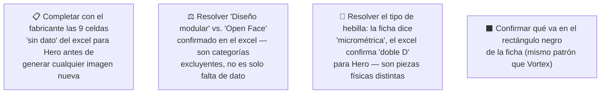

# Simulación 12 — Hero: verificación ficha de marketing vs. excel maestro de specs (Etapa 3 — Catálogo)

[← Volver al índice de mis pruebas](../mis-pruebas-claude-code.md) · [← Orquestación de agentes en paralelo](../orquestacion-agentes-paralelos.md)

Tercer caso del catálogo, pipeline **Tipo C**, con Agente Auditor independiente (igual que Kratos). A diferencia de Kratos y Vortex, acá el excel tiene muchas celdas **vacías** para la columna Hero (no "N/A", directamente sin dato) — el Auditor usó una tercera categoría de resultado, **SIN DATO**, distinta de MATCH y MISMATCH, para no confundir "no confirmado" con "confirmado que no lo tiene".

Además, Hero es un casco **open face / tipo jet** (sin mentonera, visera abatible, mentón expuesto — visible en la foto de referencia), lo que genera una contradicción estructural con uno de los claims, no solo una discrepancia de dato.

### 🔴 Pendiente de tu parte

Claims transcritos de la ficha Hero

**Bloque "HOMOLOGACIÓN — DOT FNVSS 510" (7 ítems):**
1. Visera anti scratch
2. Preparado para anti empañante
3. Sistema de emergencia de liberación rápida (ERS)
4. Liner desmontable y lavable
5. Sistema de liberación rápida del visor
6. Cubre barbilla
7. Cubre nariz

**Bloque grid de íconos (6 ítems):**
1. Diseño modular
2. Con luz LED
3. Canal para lentes
4. Hebilla micrométrica
5. Doble visera
6. Espacio para Bluetooth

Excel maestro — columna Hero, transcripción completa

| Fila | Valor Hero |
|---|---|
| Marca | EDGEPRO |
| Certificación | DOT & ECE 22.06 |
| Full Face-Flip Up-Open Face-Adventure | **OPEN FACE** |
| Con luz LED | (vacío) |
| Doble visera | (vacío) |
| Mica night vision/PC/etc | (vacío) |
| Preparado para anti empañante | (vacío) |
| Con Pinlock | (vacío) |
| Kit de mecanismo visor | X |
| Visera anti scratch | (vacío) |
| Hebilla micrométrica | (vacío) |
| Hebilla doble D | X |
| Espacio para Bluetooth | X |
| Material exterior ABS alta resistencia | (vacío — inusual, es la única columna sin dato en esta fila; todas las demás marcas tienen X) |
| Interior EPS de alta resistencia | (vacío) |
| Liner desmontable y lavable | X |
| Cubre barbilla | (vacío) |
| Cubre nariz | (vacío) |
| Emergency Quick Release System (ERS) | (vacío) |
| Canal para lentes (Glasses Fit System) | X |
| N° Air Vent System | (vacío) |
| Estilo de casco | (vacío) |
| Peso | (vacío) |
| Quick Visor Release System | (vacío) |
| Master Box | X |
| Inner Box-bolsa protectora | X |
| Con maletín de lujo | (vacío) |

### Auditoría — tabla de verificación (Agente Auditor independiente)

| # | Claim de la ficha | Fila del excel | Valor Hero | Resultado |
|---|---|---|---|---|
| 1 | Visera anti scratch | Visera anti scratch | (vacío) | ⚪ SIN DATO |
| 2 | Preparado para anti empañante | Preparado para anti empañante | (vacío) | ⚪ SIN DATO |
| 3 | Sistema de emergencia de liberación rápida (ERS) | Emergency Quick Release System (ERS) | (vacío) | ⚪ SIN DATO |
| 4 | Liner desmontable y lavable | Liner desmontable y lavable | X | ✅ MATCH |
| 5 | Sistema de liberación rápida del visor | Quick Visor Release System | (vacío) | ⚪ SIN DATO |
| 6 | Cubre barbilla | Cubre barbilla (Chin Curtain) | (vacío) | ⚪ SIN DATO |
| 7 | Cubre nariz | Cubre nariz (Anti-Fog Nose Guard) | (vacío) | ⚪ SIN DATO |
| 8 | Diseño modular | Full Face-Flip Up-Open Face-Adventure | OPEN FACE | ❌ MISMATCH |
| 9 | Con luz LED | Con luz LED | (vacío) | ⚪ SIN DATO |
| 10 | Canal para lentes | Canal para lentes (Glasses Fit System) | X | ✅ MATCH |
| 11 | Hebilla micrométrica | Hebilla micrométrica | (vacío) | ⚪ SIN DATO |
| 12 | Doble visera | Doble visera | (vacío) | ⚪ SIN DATO |
| 13 | Espacio para Bluetooth | Espacio para Bluetooth | X | ✅ MATCH |

**Veredicto:** 3 MATCH · 1 MISMATCH · 9 SIN DATO. Ninguna de las 9 celdas vacías se interpreta como "no lo tiene" — es información ausente en el excel, no un descarte confirmado.

### Hallazgos estructurales (no son solo discrepancias de dato)

1. **"Diseño modular" contradice el tipo de casco confirmado.** El excel dice OPEN FACE. Modular, Full Face y Open Face son categorías mutuamente excluyentes — esto es un MISMATCH duro, no falta de dato.
2. **"Cubre barbilla" — sentido físico dudoso en un open face.** Un casco open face no tiene mentonera propia; no se puede confirmar ni descartar con el dato disponible si existe una variante de esta pieza aplicable, pero la incoherencia potencial se señala aparte del resultado formal (SIN DATO).
3. **"Sistema de liberación rápida del visor" sí es físicamente plausible en un open face** (visera abatible tipo demi-jet) — acá el problema es solo falta de dato, no incoherencia de diseño.
4. **Conflicto de tipo de hebilla.** La ficha reclama "hebilla micrométrica" (sin dato en excel), pero el excel sí confirma con X "Hebilla doble D" para Hero — son dos piezas físicas distintas y mutuamente excluyentes. Hay evidencia indirecta de que el claim de la ficha está describiendo el tipo de hebilla equivocado, aunque formalmente el claim 11 quede como "sin dato" y no "mismatch".
5. **Material exterior ABS es la única celda sin dato de toda esa fila** — todas las demás marcas (Stellar, Kratos, Xpro, Vortex, Carbex, Shift) tienen X — vale la pena confirmar si es un vacío real del producto o un olvido de carga del excel.

### Cómo adaptar los 2 prompts de generación para Hero

**Conclusión: ninguno de los dos prompts sirve tal cual** (a diferencia de Vortex, donde sí servían sin cambios).

**Prompt A — tarjeta HOMOLOGACIÓN (6 ítems originales: visera anti scratch / ERS / liner / liberación rápida visor / cubre barbilla / cubre nariz):**
- Solo **1 de 6** queda confirmado por el excel: *Liner desmontable y lavable*.
- Los otros 5 deben sacarse o confirmarse con el fabricante antes de generar nada.
- **No hay, en el excel, otros ítems de este bloque confirmados con X para completar la tarjeta a 6** — hace falta información adicional del fabricante, no se puede resolver solo con lo que ya tenemos.

**Prompt B — grid 2x3 de íconos (6 ítems originales: canal para lentes / hebilla micrométrica / bluetooth / kit mecanismo visor / material ABS / interior EPS):**
- **3 de 6** quedan confirmados tal cual: *Canal para lentes, Espacio para Bluetooth, Kit de mecanismo visor*.
- *Hebilla micrométrica* debe sacarse y reemplazarse por ***Hebilla doble D*** (sí confirmada con X para Hero).
- *Material exterior ABS* e *Interior EPS* quedan sin dato — no hay más ítems confirmados en el excel para completar el grid a 6.
- Resultado: **el grid B solo se puede armar hoy con 4 ítems confirmados** (Canal para lentes, Bluetooth, Kit de mecanismo visor, Hebilla doble D). Faltan 2 para llegar a 6.

### Estado: 🔴 Bloqueado — no se puede generar ninguna imagen de Hero todavía sin datos adicionales

**Qué falló:** "Diseño modular" contradice el tipo de casco confirmado (open face); "hebilla micrométrica" probablemente sea el tipo de hebilla equivocado (el excel confirma doble D).

**Qué hay que hacer:**
1. Completar con el fabricante las 9 celdas "sin dato" del excel para Hero antes de tocar los prompts de generación.
2. Resolver explícitamente "diseño modular" vs. "open face" en el excel maestro — no es un vacío, es una contradicción activa.
3. Resolver el conflicto de hebilla (micrométrica vs. doble D) antes de armar el grid B.
4. Confirmar qué va en el rectángulo negro de la ficha (mismo pendiente que Vortex).
5. Una vez completado el excel, recién ahí adaptar los 2 prompts con la lista de ítems corregida (ver tablas arriba) y generar.

---

**Última actualización:** 2026-07-28 · Agente 0 (transcripción) + Agente Auditor independiente (verificación + adaptación de prompts), corridos en esta sesión a pedido explícito de auditar el tercer caso del catálogo (Hero).
