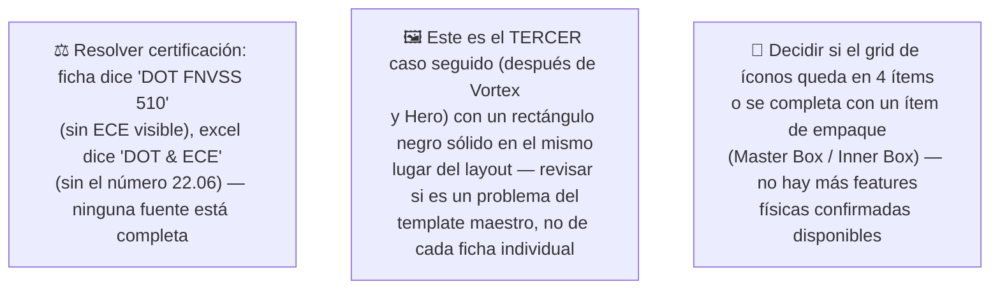

# Simulación 13 — Shanghai: verificación ficha de marketing vs. excel maestro de specs (Etapa 3 — Catálogo)

[← Volver al índice de mis pruebas](../mis-pruebas-claude-code.md) · [← Orquestación de agentes en paralelo](../orquestacion-agentes-paralelos.md)

Cuarto caso del catálogo, pipeline **Tipo C**, con Agente Auditor + Generador independiente en un solo pase. Nota importante: este caso usa un **excel distinto** al de Kratos/Vortex/Hero — otra pestaña que compara Power, Sport, Kova, Monaco, **Shanghai** (no Stellar/Kratos/Xpro/Vortex/Carbex/Shift/Hero). No mezclar las dos fuentes.

### 🔴 Pendiente de tu parte



<details><summary>Claims transcritos de la ficha Shanghai</summary>

**Bloque "HOMOLOGACIÓN — DOT FNVSS 510" (7 ítems):** Visera anti scratch, Preparado para anti empañante, Sistema de emergencia de liberación rápida (ERS), Liner desmontable y lavable, Sistema de liberación rápida del visor, Cubre barbilla, Cubre nariz.

**Bloque grid de íconos (6 ítems):** Diseño modular, Con luz LED, Canal para lentes, Hebilla micrométrica, Doble visera, Espacio para Bluetooth.

</details>

<details><summary>Excel maestro (pestaña Power/Sport/Kova/Monaco/Shanghai) — columna Shanghai</summary>

| Fila | Valor Shanghai |
|---|---|
| Certificación | DOT & ECE (sin número 22.06 en este tab) |
| Full Face-Flip Up-Open Face-Adventure | Full Face |
| Con luz LED | N/A |
| Doble visera | N/A |
| Preparado para anti empañante | X |
| Con Pinlock | N/A |
| Visera anti scratch | X |
| Hebilla micrométrica | X |
| Hebilla doble D | N/A |
| Espacio para Bluetooth | X |
| Material exterior ABS alta resistencia | X |
| Interior EPS de alta resistencia | X |
| Liner desmontable y lavable | X |
| Cubre barbilla | X |
| Cubre nariz | X |
| Emergency Quick Release System (ERS) | N/A |
| Canal para lentes | X |
| N° Air Vent System | 4 |
| Estilo de casco | RACING |
| Quick Visor Release System | N/A |
| Master Box | X |
| Inner Box-bolsa protectora | X |

*(este tab no tiene fila "Kit de mecanismo visor" — no está disponible como opción para completar listas, a diferencia del otro tab)*

</details>

### Auditoría — tabla de verificación

| # | Claim de la ficha | Fila del excel | Valor Shanghai | Resultado |
|---|---|---|---|---|
| 1 | Visera anti scratch | Visera anti scratch | X | ✅ MATCH |
| 2 | Preparado para anti empañante | Preparado para anti empañante | X | ✅ MATCH |
| 3 | Sistema de emergencia de liberación rápida (ERS) | Emergency Quick Release System (ERS) | N/A | ❌ MISMATCH |
| 4 | Liner desmontable y lavable | Liner desmontable y lavable | X | ✅ MATCH |
| 5 | Sistema de liberación rápida del visor | Quick Visor Release System | N/A | ❌ MISMATCH |
| 6 | Cubre barbilla | Cubre barbilla | X | ✅ MATCH |
| 7 | Cubre nariz | Cubre nariz | X | ✅ MATCH |
| 8 | Diseño modular | (no existe fila propia; solo "Full Face-Flip Up-Open Face-Adventure" = Full Face) | — | ⚪ SIN DATO (indicio fuerte de contradicción, no formal por falta de fila exacta) |
| 9 | Con luz LED | Con luz LED | N/A | ❌ MISMATCH |
| 10 | Canal para lentes | Canal para lentes | X | ✅ MATCH |
| 11 | Hebilla micrométrica | Hebilla micrométrica | X | ✅ MATCH |
| 12 | Doble visera | Doble visera | N/A | ❌ MISMATCH |
| 13 | Espacio para Bluetooth | Espacio para Bluetooth | X | ✅ MATCH |

**Veredicto:** 8 MATCH · 4 MISMATCH · 1 SIN DATO.

**Certificación:** ficha dice "DOT FNVSS 510" (sin ECE visible en el bloque), excel dice "DOT & ECE" (sin el número 22.06) — dos strings incompletos y distintos entre sí, ninguna fuente confirma el dato completo. Discrepancia abierta, no se resuelve a favor de ninguna.

**Hallazgo transversal (no es de contenido, es de layout):** esta es la **tercera ficha consecutiva** (después de Vortex y Hero) con un rectángulo negro sólido en la misma posición del layout — sugiere un patrón sistemático de asset faltante en el template maestro del catálogo, no un defecto puntual de esta ficha.

### Prompts corregidos

**Ítems confirmados con X disponibles para Shanghai (12 en total):** Preparado para anti empañante, Visera anti scratch, Hebilla micrométrica, Espacio para Bluetooth, Material exterior ABS alta resistencia, Interior EPS de alta resistencia, Liner desmontable y lavable, Cubre barbilla, Cubre nariz, Canal para lentes, Master Box, Inner Box. De esos, solo 10 son features físicas reales (los 2 restantes son de empaque). Se necesitan 12 slots (6+6) — **faltan 2 features físicas para completar ambos prompts sin usar ítems de empaque.**

<details><summary>Prompt A — Homologación Shanghai (6/6, completo)</summary>

```
Diseñá una tarjeta de HOMOLOGACIÓN para el casco EDGE/EDGEPRO modelo "Shanghai"
(FULL FACE, visera espejada iridiscente violeta/rosa), mismo formato vertical
angosto 4K que la referencia. Título: "HOMOLOGACIÓN — DOT & ECE" (usar
exactamente este texto; NO usar "DOT FNVSS 510" ni inventar el número "22.06",
no está confirmado en la fuente de datos).

Lista de EXACTAMENTE 6 ítems, en este orden:
1. VISERA ANTI SCRATCH
2. PREPARADO PARA ANTI EMPAÑANTE
3. LINER DESMONTABLE Y LAVABLE
4. MATERIAL EXTERIOR ABS ALTA RESISTENCIA
5. CUBRE BARBILLA
6. CUBRE NARIZ

CRÍTICO / PROHIBIDO ABSOLUTO:
- NO incluir "Sistema de emergencia de liberación rápida (ERS)" — N/A para Shanghai.
- NO incluir "Sistema de liberación rápida del visor" — N/A para Shanghai.
- NO usar rectángulos negros sólidos como placeholder de imagen faltante — si
  falta un asset, dejar el espacio en blanco/gris claro, nunca negro sólido
  (patrón repetido detectado en 3 fichas seguidas, no lo repitas acá).
```

</details>

<details><summary>Prompt B — Grid de íconos Shanghai (4/6 — CORREGIDO, "Doble visera" sacado por error de transcripción)</summary>

**Corrección:** la versión anterior de este prompt incluía "DOBLE VISERA" como ítem confirmado — error real, el excel dice **N/A** para Shanghai en esa fila (ver tabla de auditoría arriba). Se saca y el grid queda en 4 ítems confirmados, no 5.

```
Diseñá un grid de íconos 2x3 para el casco EDGE/EDGEPRO modelo "Shanghai",
mismo formato 4K, fondo gris claro, íconos lineales rojo/bordo en octágono
que la referencia.

Ítems confirmados (4, no 6 — ver nota):
1. CANAL PARA LENTES
2. HEBILLA MICROMÉTRICA
3. ESPACIO PARA BLUETOOTH
4. INTERIOR EPS DE ALTA RESISTENCIA

NOTA: NO incluir "Doble visera" — el excel confirma N/A para Shanghai, no
está disponible como ítem. No hay más features físicas confirmadas por el
excel para completar el grid a 5 o 6 sin repetir con el Prompt A. Los únicos
ítems restantes confirmados con X son de empaque/logística (Master Box o
Inner Box) — no se agregan automático, usarlos solo si el usuario los
aprueba explícitamente para completar el grid.

CRÍTICO — íconos nuevos, no reciclados de la referencia:
- Diseñá un ícono lineal NUEVO específico para cada ítem, especialmente "HEBILLA MICROMÉTRICA" — si la referencia muestra ese ícono con tache/X roja, NO lo copies así, Shanghai sí tiene esta feature confirmada, el ícono debe ser positivo/limpio.
- No reutilices el dibujo de ningún ícono de la referencia que corresponda a un ítem que no está en esta lista de 4 (esto incluye "Doble visera", que NO va en este prompt — ver corrección arriba).

CRÍTICO / PROHIBIDO ABSOLUTO:
- NO incluir "Diseño modular" — Shanghai es Full Face, contradicción de categoría.
- NO incluir "Con luz LED" — N/A para Shanghai.
- NO usar rectángulos negros sólidos como placeholder.
```

</details>

### Estado: ⚠️ Falló — 4 de 13 claims + 1 sin dato no coinciden; prompts corregidos entregados, uno de los dos queda en 4/6 ítems por falta de dato

**Qué hay que hacer:**
1. Decidir certificación real (ni la ficha ni el excel están completos).
2. Confirmar con el fabricante si hay más features físicas para completar el grid B, o aceptar 4 ítems / usar un ítem de empaque.
3. Revisar el template maestro por el rectángulo negro recurrente (3er caso seguido).
4. Subir los archivos originales como adjunto real para versionarlos.

---

**Última actualización:** 2026-07-28 · Agente Auditor + Generador independiente, corridos en esta sesión a pedido explícito de auditar el cuarto caso del catálogo (Shanghai) y adaptar los 2 prompts.
