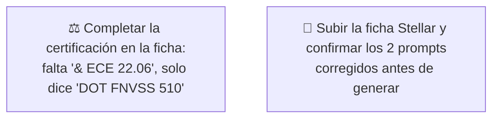

# Simulación 14 — Stellar: verificación ficha de marketing vs. excel maestro de specs (Etapa 3 — Catálogo)

[← Volver al índice de mis pruebas](../mis-pruebas-claude-code.md) · [← Orquestación de agentes en paralelo](../orquestacion-agentes-paralelos.md)

Quinto caso del catálogo, pipeline **Tipo C**, Agente Auditor + Generador independiente. Mismo excel que Kratos/Vortex/Hero (pestaña Stellar/Kratos/Xpro/Vortex/Carbex/Shift/Hero), columna Stellar. Es el mejor resultado del catálogo hasta ahora: **10 de 13 claims coinciden**, mejor que Kratos (9/13) y Shanghai (8/13), aunque no perfecto como Vortex (12/12).

### 🔴 Pendiente de tu parte



<details><summary>Claims transcritos de la ficha Stellar</summary>

**Bloque "HOMOLOGACIÓN — DOT FNVSS 510" (7 ítems):** Visera anti scratch, Preparado para anti empañante, Sistema de emergencia de liberación rápida (ERS), Liner desmontable y lavable, Sistema de liberación rápida del visor, Cubre barbilla, Cubre nariz.

**Bloque grid de íconos (6 ítems):** Diseño modular, Con luz LED, Canal para lentes, Hebilla micrométrica, Doble visera, Espacio para Bluetooth.

</details>

<details><summary>Excel maestro — columna Stellar, transcripción completa</summary>

| Fila | Valor Stellar |
|---|---|
| Marca | EDGEPRO |
| Certificación | DOT & ECE 22.06 |
| Full Face-Flip Up-Open Face-Adventure | FULL FACE |
| Con luz LED | N/A |
| Doble visera | **X** ← único caso del catálogo con esto confirmado |
| Preparado para anti empañante | X |
| Con Pinlock | X |
| Kit de mecanismo visor | X |
| Visera anti scratch | X |
| Hebilla micrométrica | X |
| Hebilla doble D | N/A |
| Espacio para Bluetooth | X |
| Material exterior ABS alta resistencia | X |
| Interior EPS de alta resistencia | X |
| Liner desmontable y lavable | X |
| Cubre barbilla | X |
| Cubre nariz | X |
| Emergency Quick Release System (ERS) | X |
| Canal para lentes | X |
| N° Air Vent System | 5 |
| Estilo de casco | REDONDO |
| Quick Visor Release System | N/A |
| Master Box | X |
| Inner Box-bolsa protectora | X |
| Con maletín de lujo | X |

</details>

### Auditoría — tabla de verificación

| # | Claim de la ficha | Fila del excel | Valor Stellar | Resultado |
|---|---|---|---|---|
| 1 | Visera anti scratch | Visera anti scratch | X | ✅ MATCH |
| 2 | Preparado para anti empañante | Preparado para anti empañante | X | ✅ MATCH |
| 3 | Sistema de emergencia de liberación rápida (ERS) | Emergency Quick Release System (ERS) | X | ✅ MATCH |
| 4 | Liner desmontable y lavable | Liner desmontable y lavable | X | ✅ MATCH |
| 5 | Sistema de liberación rápida del visor | Quick Visor Release System | N/A | ❌ MISMATCH |
| 6 | Cubre barbilla | Cubre barbilla | X | ✅ MATCH |
| 7 | Cubre nariz | Cubre nariz | X | ✅ MATCH |
| 8 | Diseño modular | Full Face-Flip Up-Open Face-Adventure | FULL FACE | ❌ MISMATCH |
| 9 | Con luz LED | Con luz LED | N/A | ❌ MISMATCH |
| 10 | Canal para lentes | Canal para lentes | X | ✅ MATCH |
| 11 | Hebilla micrométrica | Hebilla micrométrica | X | ✅ MATCH |
| 12 | Doble visera | Doble visera | X | ✅ MATCH |
| 13 | Espacio para Bluetooth | Espacio para Bluetooth | X | ✅ MATCH |

**Veredicto:** 10 MATCH · 3 MISMATCH · 0 SIN DATO.

**Nota especial — "Doble visera":** a diferencia de Kratos, Vortex, Hero y Shanghai (donde este ítem siempre fue N/A o sin dato), en **Stellar el excel confirma "Doble visera: X"**. El Auditor lo verificó explícitamente en vez de descartarlo por el patrón de los otros casos — acá el claim de la ficha tiene respaldo real, es un MATCH genuino, no un error heredado.

**Certificación:** la ficha muestra solo "DOT FNVSS 510" (falta "& ECE 22.06"), el excel confirma "DOT & ECE 22.06" completo — mismo patrón de discrepancia que Kratos.

### Prompts corregidos

Con 17 ítems confirmados con X disponibles y solo 12 slots (6+6) necesarios, **alcanzó sin necesitar ítems de empaque** (Master Box, Inner Box y Maletín de lujo quedaron disponibles pero no se usaron).

<details><summary>Prompt A — Homologación Stellar (6/6, completo)</summary>

```
Diseñá una tarjeta de HOMOLOGACIÓN para el casco EDGEPRO STELLAR, mismo
formato vertical angosto 4K que la referencia. Título: "HOMOLOGACIÓN —
DOT & ECE 22.06" (usar exactamente este texto completo, nunca solo
"DOT FNVSS 510").

Lista de EXACTAMENTE 6 ítems, en este orden:
1. VISERA ANTI SCRATCH
2. PREPARADO PARA ANTI EMPAÑANTE
3. SISTEMA DE EMERGENCIA DE LIBERACIÓN RÁPIDA (ERS)
4. LINER DESMONTABLE Y LAVABLE
5. CUBRE BARBILLA
6. CUBRE NARIZ

CRÍTICO / PROHIBIDO ABSOLUTO:
- NO incluir "Sistema de liberación rápida del visor" — N/A para Stellar.
- No mostrar certificación incompleta.
```

</details>

<details><summary>Prompt B — Grid de íconos Stellar (6/6, completo)</summary>

```
Diseñá un grid de íconos 2x3 para el casco EDGEPRO STELLAR, mismo formato
4K, fondo gris claro, íconos lineales rojo/bordo en octágono.

Lista de EXACTAMENTE 6 ítems, en este orden:
1. CANAL PARA LENTES
2. HEBILLA MICROMÉTRICA
3. DOBLE VISERA
4. ESPACIO PARA BLUETOOTH
5. CON PINLOCK
6. KIT DE MECANISMO VISOR

CRÍTICO — íconos nuevos, no reciclados de la referencia:
- Diseñá un ícono lineal NUEVO específico para cada ítem, incluido "CON PINLOCK" (probablemente no está en la referencia, hay que crearlo desde cero) y especialmente "HEBILLA MICROMÉTRICA" y "DOBLE VISERA" — si la referencia muestra alguno de estos íconos con tache/X roja o ausente, NO lo copies así, ambos están confirmados con X para Stellar y deben verse de forma positiva/limpia.
- No reutilices el dibujo de ningún ícono de la referencia que corresponda a un ítem que no está en esta lista.

CRÍTICO / PROHIBIDO ABSOLUTO:
- NO incluir "Diseño modular" — Stellar es Full Face, no modular.
- NO incluir "Con luz LED" — N/A para Stellar.
- NO omitir "Doble visera" — a diferencia de otros modelos de la línea,
  en Stellar SÍ está confirmado con X y debe aparecer.
```

</details>

### Estado: ⚠️ Falló parcialmente — 3 de 13 claims no coinciden, pero los 2 prompts quedaron completos (6/6) sin necesitar ítems de empaque

**Qué hay que hacer:**
1. Completar la certificación en la ficha ("& ECE 22.06" falta).
2. Sacar "diseño modular", "con luz LED" y "liberación rápida del visor" antes de reimprimir/republicar.
3. Subir los archivos originales como adjunto real para versionarlos.

---

**Última actualización:** 2026-07-28 · Agente Auditor + Generador independiente, corridos en esta sesión a pedido explícito de auditar el quinto caso del catálogo (Stellar) y adaptar los 2 prompts.
