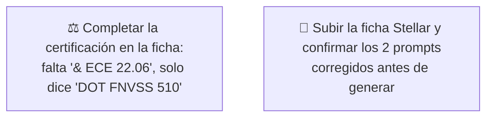

# Simulación 14 — Stellar: verificación ficha de marketing vs. excel maestro de specs (Etapa 3 — Catálogo)

[← Volver al índice de mis pruebas](../mis-pruebas-claude-code.md) · [← Orquestación de agentes en paralelo](../orquestacion-agentes-paralelos.md)

Quinto caso del catálogo, pipeline **Tipo C**, Agente Auditor + Generador independiente. Mismo excel que Kratos/Vortex/Hero (pestaña Stellar/Kratos/Xpro/Vortex/Carbex/Shift/Hero), columna Stellar. Es el mejor resultado del catálogo hasta ahora: **10 de 13 claims coinciden**, mejor que Kratos (9/13) y Shanghai (8/13), aunque no perfecto como Vortex (12/12).

### 🔴 Pendiente de tu parte



<details><summary>Claims transcritos de la ficha Stellar</summary>

**Bloque "HOMOLOGACIÓN — DOT FNVSS 510" (7 ítems):** Visera anti scratch, Preparado para anti empañante, Sistema de emergencia de liberación rápida (ERS), Liner desmontable y lavable, Sistema de liberación rápida del visor, Cubre barbilla, Cubre nariz.

**Bloque grid de íconos (6 ítems):** Diseño modular, Con luz LED, Canal para lentes, Hebilla micrométrica, Doble visera, Espacio para Bluetooth.

</details>

<details><summary>Excel maestro — columna Stellar, transcripción completa</summary>

| Fila | Valor Stellar |
|---|---|
| Marca | EDGEPRO |
| Certificación | DOT & ECE 22.06 |
| Full Face-Flip Up-Open Face-Adventure | FULL FACE |
| Con luz LED | N/A |
| Doble visera | **X** ← único caso del catálogo con esto confirmado |
| Preparado para anti empañante | X |
| Con Pinlock | X |
| Kit de mecanismo visor | X |
| Visera anti scratch | X |
| Hebilla micrométrica | X |
| Hebilla doble D | N/A |
| Espacio para Bluetooth | X |
| Material exterior ABS alta resistencia | X |
| Interior EPS de alta resistencia | X |
| Liner desmontable y lavable | X |
| Cubre barbilla | X |
| Cubre nariz | X |
| Emergency Quick Release System (ERS) | X |
| Canal para lentes | X |
| N° Air Vent System | 5 |
| Estilo de casco | REDONDO |
| Quick Visor Release System | N/A |
| Master Box | X |
| Inner Box-bolsa protectora | X |
| Con maletín de lujo | X |

</details>

### Auditoría — tabla de verificación

| # | Claim de la ficha | Fila del excel | Valor Stellar | Resultado |
|---|---|---|---|---|
| 1 | Visera anti scratch | Visera anti scratch | X | ✅ MATCH |
| 2 | Preparado para anti empañante | Preparado para anti empañante | X | ✅ MATCH |
| 3 | Sistema de emergencia de liberación rápida (ERS) | Emergency Quick Release System (ERS) | X | ✅ MATCH |
| 4 | Liner desmontable y lavable | Liner desmontable y lavable | X | ✅ MATCH |
| 5 | Sistema de liberación rápida del visor | Quick Visor Release System | N/A | ❌ MISMATCH |
| 6 | Cubre barbilla | Cubre barbilla | X | ✅ MATCH |
| 7 | Cubre nariz | Cubre nariz | X | ✅ MATCH |
| 8 | Diseño modular | Full Face-Flip Up-Open Face-Adventure | FULL FACE | ❌ MISMATCH |
| 9 | Con luz LED | Con luz LED | N/A | ❌ MISMATCH |
| 10 | Canal para lentes | Canal para lentes | X | ✅ MATCH |
| 11 | Hebilla micrométrica | Hebilla micrométrica | X | ✅ MATCH |
| 12 | Doble visera | Doble visera | X | ✅ MATCH |
| 13 | Espacio para Bluetooth | Espacio para Bluetooth | X | ✅ MATCH |

**Veredicto:** 10 MATCH · 3 MISMATCH · 0 SIN DATO.

**Nota especial — "Doble visera":** a diferencia de Kratos, Vortex, Hero y Shanghai (donde este ítem siempre fue N/A o sin dato), en **Stellar el excel confirma "Doble visera: X"**. El Auditor lo verificó explícitamente en vez de descartarlo por el patrón de los otros casos — acá el claim de la ficha tiene respaldo real, es un MATCH genuino, no un error heredado.

**Certificación:** la ficha muestra solo "DOT FNVSS 510" (falta "& ECE 22.06"), el excel confirma "DOT & ECE 22.06" completo — mismo patrón de discrepancia que Kratos.

### Prompts corregidos

Con 17 ítems confirmados con X disponibles y solo 12 slots (6+6) necesarios, **alcanzó sin necesitar ítems de empaque** (Master Box, Inner Box y Maletín de lujo quedaron disponibles pero no se usaron).

<details><summary>Prompt A — Homologación Stellar (6/6, completo)</summary>

```
Diseñá una tarjeta de HOMOLOGACIÓN para el casco EDGEPRO STELLAR, mismo
formato vertical angosto 4K que la referencia. Título: "HOMOLOGACIÓN —
DOT & ECE 22.06" (usar exactamente este texto completo, nunca solo
"DOT FNVSS 510").

Lista de EXACTAMENTE 6 ítems, en este orden:
1. VISERA ANTI SCRATCH
2. PREPARADO PARA ANTI EMPAÑANTE
3. SISTEMA DE EMERGENCIA DE LIBERACIÓN RÁPIDA (ERS)
4. LINER DESMONTABLE Y LAVABLE
5. CUBRE BARBILLA
6. CUBRE NARIZ

CRÍTICO — DIMENSIONES EXACTAS:
- El lienzo final debe tener EXACTAMENTE el mismo ancho y alto en píxeles (mismo aspect ratio, formato vertical angosto) que la imagen de referencia — no generar un lienzo cuadrado, panorámico ni de proporción distinta.

CRÍTICO / PROHIBIDO ABSOLUTO:
- NO incluir "Sistema de liberación rápida del visor" — N/A para Stellar.
- No mostrar certificación incompleta.
```

</details>

### Intento 1 — resultado auditado

**Estado:** ⚠️ Falló — espaciado desparejo entre ítems.

**Qué falló:** los 6 ítems (Visera anti scratch, Preparado anti empañante, ERS, Liner desmontable y lavable, Cubre barbilla, Cubre nariz) están todos presentes y con el texto correcto, pero el espacio vertical entre el ítem 4 (Liner) y el ítem 5 (Cubre barbilla) salió mucho más grande que entre los demás — se ve como un hueco vacío, como si faltara un ítem, aunque no falta ninguno. Es un defecto de espaciado, no de contenido.

**Qué hay que hacer:** reintentar con el prompt reforzado (Intento 2, abajo), que fuerza espaciado uniforme entre los 6 ítems.

### Intento 2 — prompt corregido con espaciado uniforme forzado

<details><summary>Prompt usado</summary>

```
Diseñá una tarjeta de HOMOLOGACIÓN para el casco EDGEPRO STELLAR, mismo
formato vertical angosto 4K que la referencia. Título: "HOMOLOGACIÓN —
DOT & ECE 22.06" (usar exactamente este texto completo).

Lista de EXACTAMENTE 6 ítems, en este orden:
1. VISERA ANTI SCRATCH
2. PREPARADO PARA ANTI EMPAÑANTE
3. SISTEMA DE EMERGENCIA DE LIBERACIÓN RÁPIDA (ERS)
4. LINER DESMONTABLE Y LAVABLE
5. CUBRE BARBILLA
6. CUBRE NARIZ

CRÍTICO — ESPACIADO UNIFORME (defecto real detectado en un intento anterior, no lo repitas): el espacio vertical entre cada uno de los 6 ítems debe ser EXACTAMENTE IGUAL — mismo espacio entre el 1 y el 2, entre el 2 y el 3, entre el 3 y el 4, entre el 4 y el 5, y entre el 5 y el 6. NO dejes un hueco más grande entre ningún par de ítems que entre los demás — el intento anterior dejó un espacio enorme y vacío entre el ítem 4 (Liner) y el ítem 5 (Cubre barbilla), como si faltara texto ahí, aunque los 6 ítems estaban presentes. Distribuí el área gris completa de forma pareja entre los 6 ítems, de arriba a abajo, sin huecos irregulares.

CRÍTICO — TEXTO COMPLETO: los 6 ítems deben tener su texto visible y legible, ninguno puede quedar en blanco, cortado ni con solo la línea separadora sin texto arriba.

PROHIBIDO ABSOLUTO:
- NO incluir "Sistema de liberación rápida del visor" — N/A para Stellar.
- No mostrar certificación incompleta.
- No dejar ningún espacio vacío entre ítems más grande que los demás.
```

</details>

**Estado:** ⚠️ Falló — no respetó forma, estructura ni tamaño de la imagen de referencia.

**Qué falló:** el Intento 2 solo daba una instrucción genérica ("mismo formato vertical angosto 4K que la referencia") sin describir la estructura visual real de la ficha, y el resultado no coincidió en forma, estructura ni tamaño con la imagen de referencia. La ficha real tiene una estructura de 3 bloques bien definida que el prompt anterior no describía: (1) título "HOMOLOGACIÓN" solo, en una franja angosta arriba; (2) un banner NEGRO rectangular grande con el texto "DOT" en letras blancas enormes tipo insignia, y debajo "FNVSS 510" (acá corregido a "& ECE 22.06") en letras blancas más chicas; (3) recién debajo de ese banner negro arranca la zona gris con los 6 ítems. El prompt anterior trataba todo el título como una sola línea de texto ("HOMOLOGACIÓN — DOT & ECE 22.06"), sin ese banner negro ni esa jerarquía visual — por eso no coincidió la estructura.

### Intento 3 — prompt corregido con estructura de 3 bloques descrita explícitamente

<details><summary>Prompt usado</summary>

```
Diseñá una tarjeta de HOMOLOGACIÓN para el casco EDGEPRO STELLAR,
EXACTAMENTE con la misma forma, estructura y tamaño que la imagen de
referencia adjunta — el lienzo final tiene que tener el mismo ancho y
alto en píxeles que la referencia (formato vertical angosto), sin
recortar ni estirar ni cambiar la proporción.

CRÍTICO — ESTRUCTURA DE 3 BLOQUES, igual que la referencia (un intento
anterior falló acá por describir todo como una sola línea de texto —
no lo repitas, tiene que ser exactamente esta estructura de 3 partes
apiladas):

BLOQUE 1 — Título (franja angosta arriba, fondo gris claro):
- Texto "HOMOLOGACIÓN" en mayúsculas, negro, bold, centrado. Nada más
  en este bloque.

BLOQUE 2 — Banner negro (rectángulo sólido negro, ancho completo del
lienzo, ocupa aproximadamente el 20-25% del alto total de la tarjeta):
- Texto "DOT" en letras BLANCAS enormes, bold, centrado, ocupando la
  mayor parte del banner (como una insignia/logo, letras muy grandes).
- Debajo de "DOT", en el mismo banner negro, texto blanco más chico:
  "& ECE 22.06" (usar exactamente este texto — NO "FNVSS 510").

BLOQUE 3 — Lista de ítems (zona gris clara, el resto del alto de la
tarjeta, debajo del banner negro):
Lista de EXACTAMENTE 6 ítems, en este orden, cada uno en mayúsculas,
negro, bold, centrado, separados por una línea horizontal fina gris
entre cada ítem:
1. VISERA ANTI SCRATCH
2. PREPARADO PARA ANTI EMPAÑANTE
3. SISTEMA DE EMERGENCIA DE LIBERACIÓN RÁPIDA (ERS)
4. LINER DESMONTABLE Y LAVABLE
5. CUBRE BARBILLA
6. CUBRE NARIZ

CRÍTICO — ESPACIADO UNIFORME (defecto real detectado en un intento
anterior, no lo repitas): el espacio vertical entre cada uno de los 6
ítems del Bloque 3 debe ser EXACTAMENTE IGUAL entre todos los pares
consecutivos. Distribuí la zona gris completa de forma pareja entre
los 6 ítems, sin huecos irregulares.

CRÍTICO — TEXTO COMPLETO: los 6 ítems deben tener su texto visible y
legible, ninguno puede quedar en blanco, cortado ni con solo la línea
separadora sin texto arriba.

PROHIBIDO ABSOLUTO:
- NO incluir "Sistema de liberación rápida del visor" — N/A para
  Stellar.
- No mostrar "DOT FNVSS 510" — la certificación correcta es "DOT & ECE
  22.06", repartida en el Bloque 2 como se describió arriba.
- No dejar ningún espacio vacío entre ítems más grande que los demás.
- No cambiar la estructura de 3 bloques ni el tamaño/proporción del
  lienzo respecto a la referencia.
```

</details>

**Estado:** 🔴 pendiente de generar.

**Qué hay que hacer:** correr el prompt y mandar el resultado para auditoría.

<details><summary>Prompt B — Grid de íconos Stellar (6/6, completo)</summary>

```
Diseñá un grid de íconos 2x3 para el casco EDGEPRO STELLAR, mismo formato
4K, fondo gris claro, íconos lineales rojo/bordo en octágono.

Lista de EXACTAMENTE 6 ítems, en este orden:
1. CANAL PARA LENTES
2. HEBILLA MICROMÉTRICA
3. DOBLE VISERA
4. ESPACIO PARA BLUETOOTH
5. CON PINLOCK
6. KIT DE MECANISMO VISOR

CRÍTICO — íconos nuevos, no reciclados de la referencia:
- Diseñá un ícono lineal NUEVO específico para cada ítem, incluido "CON PINLOCK" (probablemente no está en la referencia, hay que crearlo desde cero) y especialmente "HEBILLA MICROMÉTRICA" y "DOBLE VISERA" — si la referencia muestra alguno de estos íconos con tache/X roja o ausente, NO lo copies así, ambos están confirmados con X para Stellar y deben verse de forma positiva/limpia.
- No reutilices el dibujo de ningún ícono de la referencia que corresponda a un ítem que no está en esta lista.

CRÍTICO / PROHIBIDO ABSOLUTO:
- NO incluir "Diseño modular" — Stellar es Full Face, no modular.
- NO incluir "Con luz LED" — N/A para Stellar.
- NO omitir "Doble visera" — a diferencia de otros modelos de la línea,
  en Stellar SÍ está confirmado con X y debe aparecer.
```

</details>

### Estado: ⚠️ Falló parcialmente — 3 de 13 claims no coinciden, pero los 2 prompts quedaron completos (6/6) sin necesitar ítems de empaque

**Qué hay que hacer:**
1. Completar la certificación en la ficha ("& ECE 22.06" falta).
2. Sacar "diseño modular", "con luz LED" y "liberación rápida del visor" antes de reimprimir/republicar.
3. Subir los archivos originales como adjunto real para versionarlos.

## Sub-caso — 4 variantes de color (Tipo A, geometría 100% intacta)

Pedido del usuario: 4 colorways nuevos del mismo casco (asumiendo que es Stellar por la silueta redondeada, pivote cromado y visera clara de la foto adjuntada — a confirmar), sin cambiar ningún componente físico, solo color/acabado de superficie.

| Variante | Carcasa | Detalles | Visera | Acabado |
|---|---|---|---|---|
| 1 | Blanco | Piezas puntuales en azul oscuro | Sin cambios (transparente) | Igual al original |
| 2 | Gris | — | Ahumada azul (semitransparente) | Igual al original |
| 3 | Morado pastel | Detalles en rosa | Sin cambios (transparente) | Igual al original |
| 4 | Azul oscuro | — | Sin cambios (transparente) | **Brillante/glossy** (único caso que cambia de mate a brillante) |

<details><summary>Prompt Variante 1 — Blanco + azul oscuro, visera sin cambios</summary>

```
Genera una imagen de producto del mismo casco de la referencia adjunta,
en formato y ángulo idénticos (vista 3/4 lateral), fondo idéntico.

CRÍTICO — GEOMETRÍA INTACTA: no cambies absolutamente ningún componente
físico del casco — mismo pivote cromado de la visera, misma forma y
posición de la ventilación lateral, misma silueta redondeada, mismo
borde inferior, misma correa/mentonera. Es el mismo objeto 3D, solo
cambia el color de la superficie.

CAMBIO DE COLOR — ÚNICO cambio permitido:
- Carcasa principal: BLANCO (mismo tipo de acabado/textura que el original,
  no agregar brillo ni textura nueva salvo que se pida).
- Algunas piezas puntuales (mentonera inferior / zona de la ventilación /
  franja del borde) en AZUL OSCURO — aplicar como bloque de color sólido,
  no como degradé ni gráfico.
- Visera: SIN CAMBIOS — mantener exactamente transparente/clara como en
  la referencia, no tintar, no oscurecer.
- El pivote cromado y cualquier pieza metálica quedan igual (cromado),
  no se pintan.

PROHIBIDO ABSOLUTO: no agregar gráficos, logos, texto, ni cambiar la forma,
tamaño o posición de ningún elemento. Solo color de carcasa + piezas
puntuales en azul oscuro. Visera intacta.
```

</details>

<details><summary>Prompt Variante 2 — Gris total, visera ahumada azul</summary>

```
Genera una imagen de producto del mismo casco de la referencia adjunta,
en formato y ángulo idénticos, fondo idéntico.

CRÍTICO — GEOMETRÍA INTACTA: mismo pivote, misma ventilación, misma
silueta, mismo borde, misma correa — ningún componente cambia de forma
ni posición. Solo cambia el color.

CAMBIO DE COLOR — ÚNICO cambio permitido:
- Carcasa completa: GRIS (tono medio, uniforme en todo el casco, mismo
  tipo de acabado que el original).
- Visera: AHUMADA AZUL — semitransparente, con tinte azul, no opaca del
  todo (se debe seguir insinuando que es un visor, no un panel sólido).
- El pivote cromado queda igual (cromado, sin pintar).

PROHIBIDO ABSOLUTO: no agregar gráficos, logos, ni cambiar forma/tamaño/
posición de ningún componente. Solo color de carcasa (gris) + tinte de
visera (ahumado azul).
```

</details>

<details><summary>Prompt Variante 3 — Morado pastel + detalles rosados</summary>

```
Genera una imagen de producto del mismo casco de la referencia adjunta,
en formato y ángulo idénticos, fondo idéntico.

CRÍTICO — GEOMETRÍA INTACTA: mismo pivote, misma ventilación, misma
silueta, mismo borde, misma correa — ningún componente cambia de forma
ni posición. Solo cambia el color.

CAMBIO DE COLOR — ÚNICO cambio permitido:
- Carcasa principal: MORADO PASTEL (tono suave, no saturado).
- Algunos detalles puntuales (ventilación / borde / mentonera) en ROSA.
- Visera: SIN CAMBIOS — mantener transparente/clara como en la referencia.
- El pivote cromado queda igual (cromado, sin pintar).

PROHIBIDO ABSOLUTO: no agregar gráficos, logos, ni cambiar forma/tamaño/
posición de ningún componente. Solo color de carcasa (morado pastel) +
detalles puntuales (rosa). Visera intacta.
```

</details>

<details><summary>Prompt Variante 4 — Azul oscuro brillante (glossy)</summary>

```
Genera una imagen de producto del mismo casco de la referencia adjunta,
en formato y ángulo idénticos, fondo idéntico.

CRÍTICO — GEOMETRÍA INTACTA: mismo pivote, misma ventilación, misma
silueta, mismo borde, misma correa — ningún componente cambia de forma
ni posición. Solo cambia el color/acabado de superficie.

CAMBIO DE COLOR — ÚNICO cambio permitido:
- Carcasa completa: AZUL OSCURO, con acabado BRILLANTE/GLOSSY (a
  diferencia del mate del original — este es el único caso donde el
  acabado sí cambia, de mate a brillante, según lo pedido).
- Visera: SIN CAMBIOS — mantener transparente/clara como en la referencia.
- El pivote cromado queda igual (cromado, sin pintar).

PROHIBIDO ABSOLUTO: no agregar gráficos, logos, ni cambiar forma/tamaño/
posición de ningún componente. Solo color de carcasa (azul oscuro
brillante). Visera intacta.
```

</details>

**Estado:** 🔴 pendientes de generar (los 4).

**Qué hay que hacer:** correr los 4 prompts (en sesiones aisladas cada uno, ver hallazgo de contaminación cruzada en el caso Vortex) y mandar los resultados para auditoría — verificar especialmente que el pivote cromado y la geometría no cambien entre variantes.

## Sub-caso — Foto lifestyle en la playa, ultra realista, luz cálida

Pedido del usuario: foto lifestyle de una persona con el casco puesto en la playa, sin referencia de estilo adicional (brief directo) — ultra realista, iluminación cálida (golden hour).

<details><summary>Prompt usado</summary>

```
Genera una fotografía de producto tipo lifestyle, ULTRA REALISTA (foto de
cámara real, no ilustración ni render 3D-look), formato vertical (relación
aproximada 4:5).

CRÍTICO — el casco que aparece en la imagen debe ser EXACTAMENTE el casco
real adjunto como autoridad (checkpoint): full face, 100% negro mate,
visera clara/transparente, pivote cromado en su posición y forma exacta,
ventilación lateral y borde inferior idénticos al checkpoint. No cambies
su geometría, forma, color, textura ni ningún detalle físico — es el
mismo objeto 3D, solo cambia la escena alrededor.

ESCENA: una persona con el casco puesto, en la PLAYA — arena, mar de
fondo, cielo despejado o con algunas nubes. Encuadre de medio cuerpo o
primer plano, casco bien visible y nítido.

ILUMINACIÓN: CÁLIDA — luz de golden hour (atardecer/amanecer), tonos
dorados/naranjas suaves, sombras largas y suaves, reflejos cálidos en la
visera transparente del casco (sin perder su transparencia real).

ESTILO FOTOGRÁFICO: ultra realista, como una foto real tomada con cámara
profesional — profundidad de campo natural, grano/nitidez de foto real,
nada de aspecto ilustrado, pintado ni renderizado en 3D genérico.

Persona modelo: sin rasgos específicos pedidos, ropa casual de playa,
casco puesto con el rostro cubierto (visera hacia adelante).

PROHIBIDO ABSOLUTO: no cambiar geometría, color ni textura del casco. No
agregar logos, gráficos ni texto sobre el casco. No usar iluminación fría
ni de estudio — tiene que ser cálida, de exterior, playa real.
```

</details>

**Estado:** 🔴 pendiente de generar.

**Qué hay que hacer:** correr el prompt y mandar el resultado para auditoría.

## Sub-caso — Logo/título de marca "BOSTON 4.0" → "STELLAR"

Mismo tipo de pedido que el sub-caso de logo de Carbex (`simulacion-25-carbex-verificacion.md`): mismo diseño de logo/título de referencia (ícono tipo abanico/espiral, barra roja divisoria, tipografía condensada itálica con contorno blanco, fondo con textura diagonal), reemplazando el texto "BOSTON 4.0" por "STELLAR", mismas dimensiones exactas.

<details><summary>Prompt usado</summary>

```
Genera una imagen del mismo logo/título de marca de la referencia
adjunta, EXACTAMENTE en las mismas dimensiones y tamaño de lienzo (mismo
ancho x alto en píxeles, mismo aspect ratio, sin recortar ni estirar).

CRÍTICO — TODO IGUAL, SIN EXCEPCIÓN:
- Ícono gráfico a la izquierda (la forma tipo abanico/espiral en blanco
  y negro): EXACTAMENTE igual, mismo diseño, mismo tamaño, misma
  posición.
- Barra vertical roja divisoria: igual, mismo color, mismo grosor,
  misma posición.
- Tipografía: misma familia condensada/itálica bold, mismo efecto de
  contorno blanco sobre el texto negro, mismo tamaño de letra relativo
  al lienzo.
- Fondo: mismo fondo gris claro con textura diagonal a rayas, igual.
- Composición general: mismo layout, mismo espaciado entre el ícono, la
  barra y el texto.

ÚNICO CAMBIO PERMITIDO: el texto "BOSTON 4.0" se reemplaza por
"STELLAR" — mismo estilo tipográfico, mismo tamaño de letra relativo
(ajustar el ancho de la caja de texto si "STELLAR" tiene más o menos
caracteres que "BOSTON 4.0", pero manteniendo la misma altura de letra
y el mismo centrado vertical respecto al ícono y la barra roja).

PROHIBIDO ABSOLUTO: no agregar números, subtítulos ni ningún otro texto
adicional a "STELLAR". No cambiar el ícono, la barra roja, la
tipografía, el fondo, ni las dimensiones del lienzo. Alta calidad,
texto nítido y legible.
```

</details>

**Estado:** 🔴 pendiente de generar.

**Qué hay que hacer:** correr el prompt y mandar el resultado para auditoría.

---

**Última actualización:** 2026-07-28 · Agente Auditor + Generador independiente, corridos en esta sesión a pedido explícito de auditar el quinto caso del catálogo (Stellar) y adaptar los 2 prompts. Sub-caso de 4 variantes de color agregado el mismo día a pedido del usuario. Sub-caso de foto de playa agregado el mismo día.
