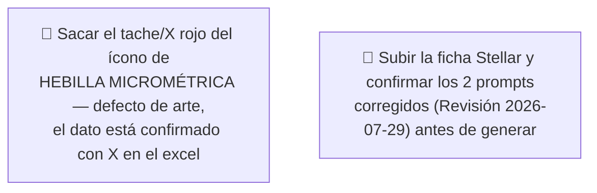

# Simulación 14 — Stellar: verificación ficha de marketing vs. excel maestro de specs (Etapa 3 — Catálogo)

[← Volver al índice de mis pruebas](../mis-pruebas-claude-code.md) · [← Orquestación de agentes en paralelo](../orquestacion-agentes-paralelos.md)

Quinto caso del catálogo, pipeline **Tipo C**, Agente Auditor + Generador independiente. Mismo excel que Kratos/Vortex/Hero (pestaña Stellar/Kratos/Xpro/Vortex/Carbex/Shift/Hero), columna Stellar.

> ⚠️ **Revisión 2026-07-29 con captura nítida — el veredicto cambió.** Todo lo que sigue hasta la sección `## Revisión 2026-07-29` es el **registro histórico** de la primera pasada (que cerró en 10 de 13 claims). Una captura nueva y nítida de la ficha real y de la columna Stellar del excel mostró que **la pieza que se auditó en aquella pasada no es la ficha vigente del Stellar**, y el veredicto pasó a **12 MATCH / 0 MISMATCH / 0 SIN DATO**. El historial se deja intacto a propósito — misma política que la corrección del caso Hero (`simulacion-12-hero-verificacion.md`), donde una captura de baja resolución también había producido un veredicto que después hubo que revisar. **Para trabajar hoy, usar la sección `## Revisión 2026-07-29` y los prompts de ahí, no los de más arriba.**

### 🔴 Pendiente de tu parte



<details><summary>Claims transcritos de la ficha Stellar</summary>

**Bloque "HOMOLOGACIÓN — DOT FNVSS 510" (7 ítems):** Visera anti scratch, Preparado para anti empañante, Sistema de emergencia de liberación rápida (ERS), Liner desmontable y lavable, Sistema de liberación rápida del visor, Cubre barbilla, Cubre nariz.

**Bloque grid de íconos (6 ítems):** Diseño modular, Con luz LED, Canal para lentes, Hebilla micrométrica, Doble visera, Espacio para Bluetooth.

</details>

<details><summary>Excel maestro — columna Stellar, transcripción completa</summary>

| Fila | Valor Stellar |
|---|---|
| Marca | EDGEPRO |
| Certificación | DOT & ECE 22.06 |
| Full Face-Flip Up-Open Face-Adventure | FULL FACE |
| Con luz LED | N/A |
| Doble visera | **X** ← único caso del catálogo con esto confirmado |
| Preparado para anti empañante | X |
| Con Pinlock | X |
| Kit de mecanismo visor | X |
| Visera anti scratch | X |
| Hebilla micrométrica | X |
| Hebilla doble D | N/A |
| Espacio para Bluetooth | X |
| Material exterior ABS alta resistencia | X |
| Interior EPS de alta resistencia | X |
| Liner desmontable y lavable | X |
| Cubre barbilla | X |
| Cubre nariz | X |
| Emergency Quick Release System (ERS) | X |
| Canal para lentes | X |
| N° Air Vent System | 5 |
| Estilo de casco | REDONDO |
| Quick Visor Release System | N/A |
| Master Box | X |
| Inner Box-bolsa protectora | X |
| Con maletín de lujo | X |

</details>

### Auditoría — tabla de verificación (🕘 histórica — superada por la Revisión 2026-07-29)

| # | Claim de la ficha | Fila del excel | Valor Stellar | Resultado |
|---|---|---|---|---|
| 1 | Visera anti scratch | Visera anti scratch | X | ✅ MATCH |
| 2 | Preparado para anti empañante | Preparado para anti empañante | X | ✅ MATCH |
| 3 | Sistema de emergencia de liberación rápida (ERS) | Emergency Quick Release System (ERS) | X | ✅ MATCH |
| 4 | Liner desmontable y lavable | Liner desmontable y lavable | X | ✅ MATCH |
| 5 | Sistema de liberación rápida del visor | Quick Visor Release System | N/A | ❌ MISMATCH |
| 6 | Cubre barbilla | Cubre barbilla | X | ✅ MATCH |
| 7 | Cubre nariz | Cubre nariz | X | ✅ MATCH |
| 8 | Diseño modular | Full Face-Flip Up-Open Face-Adventure | FULL FACE | ❌ MISMATCH |
| 9 | Con luz LED | Con luz LED | N/A | ❌ MISMATCH |
| 10 | Canal para lentes | Canal para lentes | X | ✅ MATCH |
| 11 | Hebilla micrométrica | Hebilla micrométrica | X | ✅ MATCH |
| 12 | Doble visera | Doble visera | X | ✅ MATCH |
| 13 | Espacio para Bluetooth | Espacio para Bluetooth | X | ✅ MATCH |

**Veredicto:** 10 MATCH · 3 MISMATCH · 0 SIN DATO.

**Nota especial — "Doble visera":** a diferencia de Kratos, Vortex, Hero y Shanghai (donde este ítem siempre fue N/A o sin dato), en **Stellar el excel confirma "Doble visera: X"**. El Auditor lo verificó explícitamente en vez de descartarlo por el patrón de los otros casos — acá el claim de la ficha tiene respaldo real, es un MATCH genuino, no un error heredado.

**Certificación:** la ficha muestra solo "DOT FNVSS 510" (falta "& ECE 22.06"), el excel confirma "DOT & ECE 22.06" completo — mismo patrón de discrepancia que Kratos.

### Prompts corregidos (🕘 históricos — superados por los de la Revisión 2026-07-29)

Con 17 ítems confirmados con X disponibles y solo 12 slots (6+6) necesarios, **alcanzó sin necesitar ítems de empaque** (Master Box, Inner Box y Maletín de lujo quedaron disponibles pero no se usaron).

<details><summary>Prompt A — Homologación Stellar (6/6, completo)</summary>

```
Diseñá una tarjeta de HOMOLOGACIÓN para el casco EDGEPRO STELLAR, mismo
formato vertical angosto 4K que la referencia. Título: "HOMOLOGACIÓN —
DOT & ECE 22.06" (usar exactamente este texto completo, nunca solo
"DOT FNVSS 510").

Lista de EXACTAMENTE 6 ítems, en este orden:
1. VISERA ANTI SCRATCH
2. PREPARADO PARA ANTI EMPAÑANTE
3. SISTEMA DE EMERGENCIA DE LIBERACIÓN RÁPIDA (ERS)
4. LINER DESMONTABLE Y LAVABLE
5. CUBRE BARBILLA
6. CUBRE NARIZ

CRÍTICO — DIMENSIONES EXACTAS:
- El lienzo final debe tener EXACTAMENTE el mismo ancho y alto en píxeles (mismo aspect ratio, formato vertical angosto) que la imagen de referencia — no generar un lienzo cuadrado, panorámico ni de proporción distinta.

CRÍTICO / PROHIBIDO ABSOLUTO:
- NO incluir "Sistema de liberación rápida del visor" — N/A para Stellar.
- No mostrar certificación incompleta.
```

</details>

### Intento 1 — resultado auditado

**Estado:** ⚠️ Falló — espaciado desparejo entre ítems.

**Qué falló:** los 6 ítems (Visera anti scratch, Preparado anti empañante, ERS, Liner desmontable y lavable, Cubre barbilla, Cubre nariz) están todos presentes y con el texto correcto, pero el espacio vertical entre el ítem 4 (Liner) y el ítem 5 (Cubre barbilla) salió mucho más grande que entre los demás — se ve como un hueco vacío, como si faltara un ítem, aunque no falta ninguno. Es un defecto de espaciado, no de contenido.

**Qué hay que hacer:** reintentar con el prompt reforzado (Intento 2, abajo), que fuerza espaciado uniforme entre los 6 ítems.

### Intento 2 — prompt corregido con espaciado uniforme forzado

<details><summary>Prompt usado</summary>

```
Diseñá una tarjeta de HOMOLOGACIÓN para el casco EDGEPRO STELLAR, mismo
formato vertical angosto 4K que la referencia. Título: "HOMOLOGACIÓN —
DOT & ECE 22.06" (usar exactamente este texto completo).

Lista de EXACTAMENTE 6 ítems, en este orden:
1. VISERA ANTI SCRATCH
2. PREPARADO PARA ANTI EMPAÑANTE
3. SISTEMA DE EMERGENCIA DE LIBERACIÓN RÁPIDA (ERS)
4. LINER DESMONTABLE Y LAVABLE
5. CUBRE BARBILLA
6. CUBRE NARIZ

CRÍTICO — ESPACIADO UNIFORME (defecto real detectado en un intento anterior, no lo repitas): el espacio vertical entre cada uno de los 6 ítems debe ser EXACTAMENTE IGUAL — mismo espacio entre el 1 y el 2, entre el 2 y el 3, entre el 3 y el 4, entre el 4 y el 5, y entre el 5 y el 6. NO dejes un hueco más grande entre ningún par de ítems que entre los demás — el intento anterior dejó un espacio enorme y vacío entre el ítem 4 (Liner) y el ítem 5 (Cubre barbilla), como si faltara texto ahí, aunque los 6 ítems estaban presentes. Distribuí el área gris completa de forma pareja entre los 6 ítems, de arriba a abajo, sin huecos irregulares.

CRÍTICO — TEXTO COMPLETO: los 6 ítems deben tener su texto visible y legible, ninguno puede quedar en blanco, cortado ni con solo la línea separadora sin texto arriba.

PROHIBIDO ABSOLUTO:
- NO incluir "Sistema de liberación rápida del visor" — N/A para Stellar.
- No mostrar certificación incompleta.
- No dejar ningún espacio vacío entre ítems más grande que los demás.
```

</details>

**Estado:** ⚠️ Falló — no respetó forma, estructura ni tamaño de la imagen de referencia.

**Qué falló:** el Intento 2 solo daba una instrucción genérica ("mismo formato vertical angosto 4K que la referencia") sin describir la estructura visual real de la ficha, y el resultado no coincidió en forma, estructura ni tamaño con la imagen de referencia. La ficha real tiene una estructura de 3 bloques bien definida que el prompt anterior no describía: (1) título "HOMOLOGACIÓN" solo, en una franja angosta arriba; (2) un banner NEGRO rectangular grande con el texto "DOT" en letras blancas enormes tipo insignia, y debajo "FNVSS 510" (acá corregido a "& ECE 22.06") en letras blancas más chicas; (3) recién debajo de ese banner negro arranca la zona gris con los 6 ítems. El prompt anterior trataba todo el título como una sola línea de texto ("HOMOLOGACIÓN — DOT & ECE 22.06"), sin ese banner negro ni esa jerarquía visual — por eso no coincidió la estructura.

### Intento 3 — prompt corregido con estructura de 3 bloques descrita explícitamente

<details><summary>Prompt usado</summary>

```
Diseñá una tarjeta de HOMOLOGACIÓN para el casco EDGEPRO STELLAR,
EXACTAMENTE con la misma forma, estructura y tamaño que la imagen de
referencia adjunta — el lienzo final tiene que tener el mismo ancho y
alto en píxeles que la referencia (formato vertical angosto), sin
recortar ni estirar ni cambiar la proporción.

CRÍTICO — ESTRUCTURA DE 3 BLOQUES, igual que la referencia (un intento
anterior falló acá por describir todo como una sola línea de texto —
no lo repitas, tiene que ser exactamente esta estructura de 3 partes
apiladas):

BLOQUE 1 — Título (franja angosta arriba, fondo gris claro):
- Texto "HOMOLOGACIÓN" en mayúsculas, negro, bold, centrado. Nada más
  en este bloque.

BLOQUE 2 — Banner negro (rectángulo sólido negro, ancho completo del
lienzo, ocupa aproximadamente el 20-25% del alto total de la tarjeta):
- Texto "DOT" en letras BLANCAS enormes, bold, centrado, ocupando la
  mayor parte del banner (como una insignia/logo, letras muy grandes).
- Debajo de "DOT", en el mismo banner negro, texto blanco más chico:
  "& ECE 22.06" (usar exactamente este texto — NO "FNVSS 510").

BLOQUE 3 — Lista de ítems (zona gris clara, el resto del alto de la
tarjeta, debajo del banner negro):
Lista de EXACTAMENTE 6 ítems, en este orden, cada uno en mayúsculas,
negro, bold, centrado, separados por una línea horizontal fina gris
entre cada ítem:
1. VISERA ANTI SCRATCH
2. PREPARADO PARA ANTI EMPAÑANTE
3. SISTEMA DE EMERGENCIA DE LIBERACIÓN RÁPIDA (ERS)
4. LINER DESMONTABLE Y LAVABLE
5. CUBRE BARBILLA
6. CUBRE NARIZ

CRÍTICO — ESPACIADO UNIFORME (defecto real detectado en un intento
anterior, no lo repitas): el espacio vertical entre cada uno de los 6
ítems del Bloque 3 debe ser EXACTAMENTE IGUAL entre todos los pares
consecutivos. Distribuí la zona gris completa de forma pareja entre
los 6 ítems, sin huecos irregulares.

CRÍTICO — TEXTO COMPLETO: los 6 ítems deben tener su texto visible y
legible, ninguno puede quedar en blanco, cortado ni con solo la línea
separadora sin texto arriba.

PROHIBIDO ABSOLUTO:
- NO incluir "Sistema de liberación rápida del visor" — N/A para
  Stellar.
- No mostrar "DOT FNVSS 510" — la certificación correcta es "DOT & ECE
  22.06", repartida en el Bloque 2 como se describió arriba.
- No dejar ningún espacio vacío entre ítems más grande que los demás.
- No cambiar la estructura de 3 bloques ni el tamaño/proporción del
  lienzo respecto a la referencia.
```

</details>

**Estado:** 🔴 pendiente de generar.

**Qué hay que hacer:** correr el prompt y mandar el resultado para auditoría.

<details><summary>Prompt B — Grid de íconos Stellar (6/6, completo)</summary>

```
Diseñá un grid de íconos 2x3 para el casco EDGEPRO STELLAR, mismo formato
4K, fondo gris claro, íconos lineales rojo/bordo en octágono.

Lista de EXACTAMENTE 6 ítems, en este orden:
1. CANAL PARA LENTES
2. HEBILLA MICROMÉTRICA
3. DOBLE VISERA
4. ESPACIO PARA BLUETOOTH
5. CON PINLOCK
6. KIT DE MECANISMO VISOR

CRÍTICO — íconos nuevos, no reciclados de la referencia:
- Diseñá un ícono lineal NUEVO específico para cada ítem, incluido "CON PINLOCK" (probablemente no está en la referencia, hay que crearlo desde cero) y especialmente "HEBILLA MICROMÉTRICA" y "DOBLE VISERA" — si la referencia muestra alguno de estos íconos con tache/X roja o ausente, NO lo copies así, ambos están confirmados con X para Stellar y deben verse de forma positiva/limpia.
- No reutilices el dibujo de ningún ícono de la referencia que corresponda a un ítem que no está en esta lista.

CRÍTICO / PROHIBIDO ABSOLUTO:
- NO incluir "Diseño modular" — Stellar es Full Face, no modular.
- NO incluir "Con luz LED" — N/A para Stellar.
- NO omitir "Doble visera" — a diferencia de otros modelos de la línea,
  en Stellar SÍ está confirmado con X y debe aparecer.
```

</details>

### Estado: ⚠️ Falló parcialmente — 3 de 13 claims no coinciden, pero los 2 prompts quedaron completos (6/6) sin necesitar ítems de empaque

**Qué hay que hacer:**
1. Completar la certificación en la ficha ("& ECE 22.06" falta).
2. Sacar "diseño modular", "con luz LED" y "liberación rápida del visor" antes de reimprimir/republicar.
3. Subir los archivos originales como adjunto real para versionarlos.

*(fin del registro histórico de la primera pasada — sigue la revisión vigente)*

---

# Revisión 2026-07-29 — captura nítida, re-auditoría completa

El usuario mandó una **captura nueva y nítida** de los 2 objetos de la ficha de marketing vigente del Stellar y de la columna Stellar del excel maestro (esta vez la columna no queda pegada al borde de la captura, así que se lee entera sin ambigüedad). Se re-corrió la auditoría Tipo C desde cero contra esa transcripción.

**Resultado: el veredicto anterior queda superado.** Se pasa de **10 MATCH / 3 MISMATCH** a **12 MATCH / 0 MISMATCH / 0 SIN DATO**.

## Por qué cambió el veredicto — no se "corrigió un error de auditoría", cambió la pieza auditada

Este punto es el que hay que entender dentro de seis meses: **la auditoría vieja no estaba mal hecha sobre la pieza que tenía enfrente — es que esa no es la ficha vigente del Stellar.** La comparación lado a lado:

| | Pieza auditada en la 1ª pasada | Ficha vigente (captura nítida 2026-07-29) |
|---|---|---|
| Certificación | "DOT FNVSS 510" (sin ECE) | Banner negro: **"DOT"** grande + **"& ECE 22.06"** debajo |
| Ítems del bloque de homologación | **7** | **6** |
| Incluye "Sistema de liberación rápida del visor" | Sí (era MISMATCH, Quick Visor Release System = N/A) | **No** |
| Grid — celda 1 | "Diseño modular" (era MISMATCH, Stellar es FULL FACE) | "Canal para lentes" |
| Grid — "Con luz LED" | Sí (era MISMATCH, N/A) | **No** |
| Grid — "Con Pinlock" | No estaba | **Sí** (X confirmado) |
| Grid — "Kit de mecanismo visor" | No estaba | **Sí** (X confirmado) |
| MISMATCH totales | 3 | **0** |

Los 3 MISMATCH de la primera pasada (liberación rápida del visor, diseño modular, luz LED) **ya no existen en la pieza vigente**: los tres ítems fueron reemplazados por features confirmadas con X. Y la discrepancia de certificación tampoco existe: el banner negro dice exactamente lo que confirma el excel. O sea, la ficha vigente del Stellar es una versión posterior/distinta de la que se transcribió en julio 28 — probablemente la primera transcripción se hizo sobre una pieza de plantilla vieja del catálogo (la misma familia de plantilla que arrastraba "diseño modular / luz LED / doble visera" en Kratos y en la Pieza 1 de Vortex).

**Lo que sí se mantiene sin cambios de la primera pasada:** que "Doble visera" está confirmada con X para Stellar y es un MATCH genuino. Ese punto no se toca — lo que cambia es que igual sale de la pieza, pero por decisión comercial, no por dato (ver abajo).

<details><summary>Ficha vigente — transcripción de los 2 objetos (captura nítida 2026-07-29)</summary>

**Objeto 1 — tarjeta de homologación** (banner negro arriba + lista sobre fondo gris claro):
- Banner negro: **"DOT"** grande en blanco, y debajo, más chico, **"& ECE 22.06"**.
- Lista de 6 ítems: 1) VISERA ANTI SCRATCH · 2) PREPARADO PARA ANTI EMPAÑANTE · 3) SISTEMA DE EMERGENCIA DE LIBERACIÓN RÁPIDA (ERS) · 4) LINER DESMONTABLE Y LAVABLE · 5) CUBRE BARBILLA · 6) CUBRE NARIZ

**Objeto 2 — grid de íconos 2 columnas x 3 filas = 6 celdas**, íconos lineales rojo/bordo dentro de octágonos:
- Fila 1: CANAL PARA LENTES · HEBILLA MICROMÉTRICA
- Fila 2: DOBLE VISERA · ESPACIO PARA BLUETOOTH
- Fila 3: CON PINLOCK · KIT DE MECANISMO VISOR
- ⚠️ El ícono de **HEBILLA MICROMÉTRICA lleva una X / tache ROJO grande encima** — la pieza está afirmando en negativo que el casco NO la tiene.

</details>

<details><summary>Excel maestro — columna Stellar, transcripción completa (captura nítida 2026-07-29)</summary>

| Fila | Valor Stellar |
|---|---|
| Marca | EDGEPRO |
| Certificación | DOT & ECE 22.06 |
| Full Face-Flip Up-Open Face-Adventure | FULL FACE |
| Con luz LED | N/A |
| Doble visera | X |
| Mica night vision/PC/etc | (vacío) → **SIN DATO** |
| Preparado para anti empañante | X |
| Con Pinlock | X |
| Kit de mecanismo visor | X |
| Visera anti scratch | X |
| Hebilla micrométrica | X |
| Hebilla doble D | N/A |
| Espacio para Bluetooth | X |
| Material exterior ABS alta resistencia | X |
| Interior EPS de alta resistencia | X |
| Liner desmontable y lavable | X |
| Cubre barbilla (Chin Curtain) | X |
| Cubre nariz (Anti-Fog Nose Guard) | X |
| Emergency Quick Release System (ERS) | X |
| Canal para lentes (Glasses Fit System) | X |
| N° Air Vent System | 5 |
| Estilo de casco | REDONDO |
| Peso | (vacío) → **SIN DATO** |
| Quick Visor Release System | N/A |
| Master Box | X |
| Inner Box-bolsa protectora | X |
| Con maletín de lujo | X |

*Recordatorio de método Tipo C: una celda **vacía** es SIN DATO (no se puede confirmar ni descartar); una celda con **N/A** es un descarte confirmado. Las dos vacías de esta columna (Mica night vision, Peso) no son claim de ninguna de las 2 piezas, así que no entran en el conteo.*

</details>

## Auditoría Tipo C — 12 claims, uno por uno

**Objeto 1 — tarjeta de homologación (6 claims)**

| # | Claim de la pieza | Fila del excel usada | Valor Stellar | Veredicto |
|---|---|---|---|---|
| A1 | VISERA ANTI SCRATCH | Visera anti scratch | X | ✅ MATCH |
| A2 | PREPARADO PARA ANTI EMPAÑANTE | Preparado para anti empañante | X | ✅ MATCH |
| A3 | SISTEMA DE EMERGENCIA DE LIBERACIÓN RÁPIDA (ERS) | Emergency Quick Release System (ERS) | X | ✅ MATCH |
| A4 | LINER DESMONTABLE Y LAVABLE | Liner desmontable y lavable | X | ✅ MATCH |
| A5 | CUBRE BARBILLA | Cubre barbilla (Chin Curtain) | X | ✅ MATCH |
| A6 | CUBRE NARIZ | Cubre nariz (Anti-Fog Nose Guard) | X | ✅ MATCH |

**Objeto 2 — grid de íconos (6 claims)**

| # | Claim de la pieza | Fila del excel usada | Valor Stellar | Veredicto |
|---|---|---|---|---|
| B1 | CANAL PARA LENTES | Canal para lentes (Glasses Fit System) | X | ✅ MATCH |
| B2 | HEBILLA MICROMÉTRICA | Hebilla micrométrica | X | ✅ MATCH *(ver defecto de arte abajo — el dato es correcto, el tache no)* |
| B3 | DOBLE VISERA | Doble visera | X | ✅ MATCH *(sale igual, por decisión de negocio — ver abajo)* |
| B4 | ESPACIO PARA BLUETOOTH | Espacio para Bluetooth | X | ✅ MATCH |
| B5 | CON PINLOCK | Con Pinlock | X | ✅ MATCH |
| B6 | KIT DE MECANISMO VISOR | Kit de mecanismo visor | X | ✅ MATCH |

### Veredicto final: **12 MATCH · 0 MISMATCH · 0 SIN DATO** (12 de 12)

**Certificación:** la pieza muestra "DOT" + "& ECE 22.06", el excel dice "DOT & ECE 22.06" → ✅ coincide exactamente. **No aparece "FNVSS 510"**, el número que el excel nunca escribe y que arrastraban Kratos, Shanghai y la Pieza 1 de Vortex.

**Exclusiones correctas verificadas** (cosas que la pieza NO reclama y el excel confirma que no debería reclamar): Con luz LED (N/A) ✅ · Hebilla doble D (N/A) ✅ · Quick Visor Release System (N/A) ✅ · "Diseño modular" (el excel dice FULL FACE) ✅.

**Datos confirmados en el excel y no reclamados en ninguna de las 2 piezas** (no son errores, son oportunidades comerciales sin usar): Material exterior ABS alta resistencia, Interior EPS de alta resistencia, N° Air Vent System = 5, Estilo de casco = REDONDO, Master Box, Inner Box-bolsa protectora y **Con maletín de lujo** (la de mayor peso comercial, mismo hallazgo que en Kratos).

**Lugar del Stellar en el catálogo tras la revisión:** con 12/12 se suma a Vortex y Kratos como caso cerrado, y es el **primero cuya ficha ya vigente da 12/12 sin necesitar corrección de contenido** — en Vortex y Kratos el 12/12 se alcanzó recién con la pieza regenerada. Acá el único trabajo pendiente es de arte (el tache) y una decisión comercial (doble visera), no de dato.

## Defecto de arte — el tache sobre HEBILLA MICROMÉTRICA (fuera del conteo formal)

**Esto NO es un MISMATCH y por eso está fuera de la tabla de 12.** El ítem está bien elegido, el texto es correcto y el excel lo confirma con X. Lo que está mal es el **arte**: el ícono lleva una **X / tache rojo grande encima**, que es la convención visual de "no disponible". O sea, la pieza **afirma en negativo** una feature que el producto sí tiene: el texto dice "hebilla micrométrica" y el dibujo dice "no tiene hebilla micrométrica".

Impacto comercial: se está regalando una feature real confirmada. Impacto de auditoría: **un veredicto Tipo C leído solo sobre el texto de los claims lo da por bueno y no lo detecta** (de hecho, así lo dio la primera pasada de este mismo caso — ver la lección generalizable al final).

**Es un defecto ya conocido del catálogo, no nuevo.** Aparece idéntico en el caso Vortex, `simulacion-11-vortex-verificacion.md`, en dos lugares distintos:
- **Pieza 1 circulante atribuida a Vortex** (fila `P1-B4` de esa auditoría): "Hebilla micrométrica (ícono tachado con X roja)" marcada como *"✅ MATCH de dato / ⚠️ tache incorrecto"*, con la nota **"Ícono tachado incorrecto"** que concluye que *"el tache es incorrecto y comunica lo opuesto al dato real"*.
- **Intento 1 del Prompt B de Vortex**: el ícono de hebilla micrométrica salió generado con la X roja pese a que el prompt la prohibía explícitamente.

Además, la misma duda quedó abierta en Kratos (pendiente #4 del índice: *"confirmar visualmente si el ícono de Hebilla micrométrica tiene un tache/X superpuesto"*) y en Shift (pendiente #22). Con Stellar ya son **cuatro modelos** con el mismo tache o la misma sospecha sobre el mismo ícono: **es un defecto de la plantilla maestra del catálogo, no de la pieza de cada modelo.** El único caso donde se confirmó limpio es la pieza regenerada de Vortex, y solo porque el prompt lo prohibió en cuatro líneas distintas.

## Decisión de negocio — "DOBLE VISERA" sale de la pieza (NO es un MISMATCH)

> 🟦 **Registrar como decisión comercial del usuario, no como error de dato.** El usuario pidió textualmente que **"DOBLE VISERA" no se incluya — ni en los íconos ni en la lista**.
>
> **El excel confirma "Doble visera: X" para Stellar.** El claim tiene respaldo real, es un MATCH genuino (fila B3 de la tabla de arriba), y de hecho el Stellar es de los pocos modelos del catálogo con esta feature confirmada (Kratos, Vortex y Hero la tienen N/A). **No se saca porque esté mal: se saca porque el usuario decidió no comunicarla.**
>
> **Por qué esta nota existe:** si dentro de seis meses alguien re-audita la ficha del Stellar contra el excel, va a ver una feature confirmada con X que la pieza no comunica y la va a leer como una "oportunidad no usada" o directamente como un olvido, y la va a devolver al grid "corrigiendo" algo que nadie rompió. **No devolverla sin volver a preguntarle al usuario.** Este ítem no está en la lista de oportunidades comerciales sin usar de más arriba justamente por eso.

## Prompts corregidos — Revisión 2026-07-29

Estructura y vocabulario copiados de los prompts ya validados de **Vortex** (`simulacion-11-vortex-verificacion.md`, sección "Prompts corregidos para Vortex (12/12 confirmados)") y **Kratos** (`simulacion-10-kratos-verificacion.md`), que son los dos que efectivamente cerraron en 12/12. No se inventa formato nuevo.

### Prompt A — decisión: reproducción fiel (Tipo B), sin cambios de contenido

Los 6 ítems de la tarjeta de homologación vigente son **6/6 MATCH** y la certificación del banner es exacta. **No hay nada que corregir en el contenido**, así que el Prompt A es de **reproducción fiel**: mismo lienzo en píxeles, misma estructura de banner negro + lista gris, mismos 6 ítems en el mismo orden. Lo único que el prompt agrega respecto de la pieza real son los **blindajes de generación** ya conocidos del catálogo: conteo forzado de ítems, espaciado uniforme y texto completo.

<details><summary>Prompt A — Tarjeta de homologación Stellar (6/6 confirmados, reproducción fiel)</summary>

```
Diseñá una tarjeta de HOMOLOGACIÓN para el casco EDGEPRO STELLAR,
EXACTAMENTE con la misma forma, estructura y tamaño que la imagen de
referencia adjunta — el lienzo final tiene que tener el mismo ancho y
alto en píxeles que la referencia (formato vertical angosto), sin
recortar ni estirar ni cambiar la proporción.

CRÍTICO — ESTRUCTURA DE 2 BLOQUES APILADOS, igual que la referencia (un
intento anterior de este mismo caso falló acá por describir todo como
una sola línea de texto — no lo repitas, tiene que ser exactamente esta
estructura de partes apiladas):

BLOQUE 1 — Banner negro (rectángulo sólido negro, ancho completo del
lienzo, arriba de todo, ocupa aproximadamente el 20-25% del alto total
de la tarjeta):
- Texto "DOT" en letras BLANCAS enormes, bold, centrado, ocupando la
  mayor parte del banner (como una insignia/logo, letras muy grandes).
- Debajo de "DOT", dentro del mismo banner negro, texto blanco más
  chico, centrado: "& ECE 22.06" (usar exactamente este texto — NO
  "FNVSS 510", ese número no existe en la fuente de datos).

BLOQUE 2 — Lista de ítems (zona de fondo GRIS CLARO, el resto del alto
de la tarjeta, debajo del banner negro):
Lista de EXACTAMENTE 6 ítems, en este orden, cada uno en mayúsculas,
negro, bold, centrado, separados por una línea horizontal fina gris
entre cada ítem:
1. VISERA ANTI SCRATCH
2. PREPARADO PARA ANTI EMPAÑANTE
3. SISTEMA DE EMERGENCIA DE LIBERACIÓN RÁPIDA (ERS)
4. LINER DESMONTABLE Y LAVABLE
5. CUBRE BARBILLA
6. CUBRE NARIZ

CRÍTICO — CONTEO FORZADO DE ÍTEMS (hallazgo real del catálogo: un
generador devolvió esta misma tarjeta con un ítem repetido dos veces,
dando 7 renglones en vez de 6, y en otro caso devolvió filas de más con
ítems duplicados y arte distinto en cada repetición — prestar máxima
atención acá):
- La lista tiene EXACTAMENTE 6 ítems. NUNCA 5, NUNCA 7, NUNCA 8.
- Cada uno de los 6 ítems aparece UNA sola vez — no repitas ninguno
  para rellenar espacio vertical, ni aunque sobre o falte lugar.
- Antes de terminar, contá los renglones de la lista: deben ser 6, ni
  uno más ni uno menos, ninguno repetido, y cada uno con un texto
  distinto de los otros 5.

CRÍTICO — ESPACIADO UNIFORME (defecto real detectado en un intento
anterior de este mismo caso, no lo repitas): el espacio vertical entre
cada uno de los 6 ítems debe ser EXACTAMENTE IGUAL entre todos los
pares consecutivos — mismo espacio entre el 1 y el 2, entre el 2 y el
3, entre el 3 y el 4, entre el 4 y el 5, y entre el 5 y el 6. El
intento anterior dejó un hueco enorme y vacío entre el ítem 4 (Liner) y
el ítem 5 (Cubre barbilla), como si faltara texto ahí, aunque los 6
estaban presentes. Distribuí la zona gris completa de forma pareja
entre los 6 ítems, de arriba a abajo, sin huecos irregulares.

CRÍTICO — TEXTO COMPLETO: los 6 ítems deben tener su texto visible,
completo y legible, tal cual está escrito en la lista — ninguno puede
quedar en blanco, cortado, acortado ni con solo la línea separadora sin
texto arriba (ej. "SISTEMA DE EMERGENCIA DE LIBERACIÓN RÁPIDA (ERS)"
completo, no "SISTEMA DE EMERGENCIA" solo).

PROHIBIDO ABSOLUTO:
- NO incluir "DOBLE VISERA" en esta tarjeta — decisión comercial
  explícita del usuario: esta feature no se comunica en ninguna de las
  2 piezas del Stellar. (Aclaración interna, no es un error de dato: el
  excel sí la confirma para este modelo; simplemente no se publica.)
- NO incluir "SISTEMA DE LIBERACIÓN RÁPIDA DEL VISOR" (Quick Visor
  Release System) — N/A confirmado para Stellar.
- NO incluir "CON LUZ LED" ni "DISEÑO MODULAR" — el primero es N/A y el
  segundo contradice el tipo confirmado (FULL FACE).
- No mostrar "DOT FNVSS 510" — la certificación correcta es "DOT & ECE
  22.06", repartida en el Bloque 1 como se describió arriba.
- No agregar un 7° ítem — son exactamente 6.
- No usar rectángulos negros sólidos como placeholder en ninguna parte
  de la tarjeta fuera del banner del Bloque 1.
- No dejar ningún espacio vacío entre ítems más grande que los demás.
- No cambiar la estructura de bloques ni el tamaño/proporción del
  lienzo respecto a la referencia.
```

</details>

### Prompt B — decisión: 6 celdas, "DOBLE VISERA" reemplazada por "MATERIAL EXTERIOR ABS ALTA RESISTENCIA"

Dos cambios respecto de la pieza vigente, y ninguno de los dos es una corrección de dato:
1. **Sale "DOBLE VISERA"** — decisión comercial del usuario (ver el bloque de arriba).
2. **Sale el tache rojo del ícono de "HEBILLA MICROMÉTRICA"** — defecto de arte; el ítem se queda, lo que se va es la marca de negación.

Eso deja **una celda libre**. Se opta por **rellenarla y mantener el grid 2x3 = 6**, en vez de rediseñar a 5 celdas: el layout 2x3 es el que usan todas las piezas del catálogo, es el que ya validaron Vortex y Kratos en 12/12, y un grid de 5 obliga a un rediseño con una fila impar que rompe la simetría de la plantilla maestra.

**Ítem elegido para la 6ª celda: `MATERIAL EXTERIOR ABS ALTA RESISTENCIA`.** Por qué, sobre los otros candidatos confirmados:

| Candidato | Excel Stellar | Decisión |
|---|---|---|
| **Material exterior ABS alta resistencia** | X | ✅ **Elegido** — es una **feature física del casco** (no empaque, no dato numérico), está confirmada con X, **no duplica ningún ítem de la tarjeta de homologación**, y es exactamente el ítem que ya ocupa una celda en los dos grids del catálogo que cerraron en 12/12 (Vortex y Kratos). Mantener la misma plantilla de grid entre modelos es lo que baja el riesgo de reciclado sin verificar que viene rompiendo este catálogo desde el principio. |
| Interior EPS de alta resistencia | X | Válido y del mismo tipo, pero solo hay una celda libre. Queda como **suplente inmediato** si el usuario prefiere hablar del interior antes que del exterior. |
| 5 ventilaciones (N° Air Vent System = 5) | 5 | Descartado. Es un dato numérico duro y **verificable a ojo en el render**: si el arte del casco no muestra exactamente 5 ventilaciones, la pieza se contradice a sí misma y se abre un mismatch nuevo que hoy no existe. Además ningún otro grid del catálogo comunica un número, así que rompería la plantilla. |
| Master Box / Inner Box / Maletín de lujo | X | Descartados por el mismo criterio que ya se aplicó en Kratos y Shanghai: son **ítems de empaque**, no features del casco, y desentonan en un grid de producto. (El maletín de lujo sigue siendo la mejor oportunidad comercial sin usar, pero para otra pieza, no para este grid.) |

**Orden de las celdas:** se conserva el layout de la pieza vigente y se sustituye únicamente la celda que ocupaba "DOBLE VISERA" (fila 2, columna izquierda), para desviarse lo mínimo posible del diseño ya aprobado.

<details><summary>Prompt B — Grid de íconos Stellar 2x3 (6/6 confirmados, sin doble visera, sin taches)</summary>

```
Diseñá un grid de íconos 2x3 para el casco EDGEPRO STELLAR, resolución
4K, mismo aspect ratio y mismas dimensiones en píxeles que la imagen de
referencia adjunta. Fondo gris claro uniforme, íconos lineales
rojo/bordo dentro de un octágono, mismo estilo gráfico que la
referencia, con el texto de cada ítem en mayúsculas, bold, centrado
debajo de su ícono.

CRÍTICO — DIMENSIONES Y CONTEO FORZADO DE CELDAS (hallazgo real del
catálogo: con un prompt que solo decía "2x3" una vez, un generador
devolvió un grid con filas de más e ítems DUPLICADOS, dibujando encima
un arte distinto en cada repetición del mismo ítem — prestar máxima
atención acá):
- El grid debe tener EXACTAMENTE 2 columnas x 3 filas = 6 celdas en
  total. NUNCA 2x4, NUNCA 8 celdas, NUNCA una fila o columna de más,
  NUNCA una celda vacía de relleno.
- Cada uno de los 6 ítems aparece en UNA sola celda, UNA sola vez — no
  dupliques ningún ítem para rellenar una fila extra, ni aunque sobre
  espacio.
- Ningún pictograma puede repetirse en dos celdas: los 6 dibujos son
  distintos entre sí, igual que los 6 textos.
- El lienzo final debe tener EXACTAMENTE el mismo ancho y alto en
  píxeles que la imagen de referencia.
- Antes de terminar, contá las celdas: deben ser 6, ni una más ni una
  menos, ninguna repetida, ninguna vacía.

LISTA DE ÍTEMS (exactamente 6, en este orden, uno por celda, leyendo de
izquierda a derecha y de arriba a abajo):
1. CANAL PARA LENTES
2. HEBILLA MICROMÉTRICA
3. MATERIAL EXTERIOR ABS ALTA RESISTENCIA
4. ESPACIO PARA BLUETOOTH
5. CON PINLOCK
6. KIT DE MECANISMO VISOR

CRÍTICO — NINGÚN ÍCONO TACHADO, EN NINGUNA CELDA (defecto real de la
pieza que circula hoy para este modelo, y defecto recurrente de la
plantilla del catálogo — no lo copies):
- NO pongas ninguna X, tache, cruz, barra diagonal, círculo con línea,
  símbolo de prohibición ni ninguna otra marca de negación encima de
  ningún ícono, en ninguna celda, de ningún color y de ningún tamaño.
- Los 6 ítems de la lista están TODOS confirmados como presentes en
  este casco: los 6 íconos se dibujan en positivo, limpios, sin marcas
  superpuestas.
- Atención especial con "HEBILLA MICROMÉTRICA": la imagen de
  referencia muestra ese ícono con una X ROJA GRANDE tachándolo. Esa
  marca es un DEFECTO DE ARTE de la referencia, no un dato del
  producto — el Stellar SÍ tiene hebilla micrométrica, confirmada en la
  fuente de datos. Su ícono debe mostrar únicamente el broche/hebilla,
  limpio y en positivo, SIN la X roja y sin ninguna otra marca encima.

CRÍTICO — ÍCONOS NUEVOS, NO RECICLADOS:
- Diseñá un pictograma propio, específico y correcto para cada uno de
  los 6 ítems de la lista.
- "MATERIAL EXTERIOR ABS ALTA RESISTENCIA" probablemente no exista en
  la referencia: creá su pictograma desde cero (idea: la calota del
  casco con un símbolo de escudo/impacto que sugiera resistencia del
  material exterior).
- No copies el dibujo interno de un ícono de la referencia que
  corresponda a un ítem distinto del de esta lista — en particular, NO
  reutilices el ícono que en la referencia corresponde a "DOBLE
  VISERA", porque ese ítem no va en esta pieza.
- De la referencia tomá SOLO el estilo visual (línea, grosor, color
  rojo/bordo, forma de octágono, tipografía) — nunca un defecto, una
  marca de exclusión ni el pictograma de otro ítem.

CRÍTICO — TEXTO COMPLETO: la etiqueta de cada celda debe reproducirse
COMPLETA, tal cual está escrita en la lista — no la acortes ni le
quites palabras (ej. "MATERIAL EXTERIOR ABS ALTA RESISTENCIA" completo,
no "MATERIAL EXTERIOR ABS" solo; "KIT DE MECANISMO VISOR" completo, no
"KIT DE MECANISMO").

PROHIBIDO ABSOLUTO:
- NO incluir "DOBLE VISERA" en ninguna celda, ni con ícono ni con
  texto, ni tachada ni parcial. Es una DECISIÓN COMERCIAL EXPLÍCITA
  del usuario, no un error de dato: la fuente sí confirma esta feature
  para el Stellar, pero se decidió no comunicarla en ninguna de las 2
  piezas. Su celda la ocupa "MATERIAL EXTERIOR ABS ALTA RESISTENCIA".
- NO incluir "DISEÑO MODULAR" — el Stellar es FULL FACE, no modular.
- NO incluir "CON LUZ LED" — N/A confirmado para Stellar.
- NO incluir "HEBILLA DOBLE D" — N/A confirmado para Stellar (la
  hebilla de este modelo es la micrométrica).
- NO incluir "VISERA ANTI SCRATCH", "PREPARADO PARA ANTI EMPAÑANTE",
  "ERS", "LINER DESMONTABLE Y LAVABLE", "CUBRE BARBILLA" ni "CUBRE
  NARIZ" — esos 6 ya van en la tarjeta de homologación (Prompt A) y
  las 2 piezas nunca comparten ítems.
- No tachar ningún ícono, con ninguna marca, en ninguna celda.
- No duplicar ítems ni repetir un pictograma en dos celdas.
- No usar rectángulos negros sólidos como placeholder en ninguna parte
  de la pieza.
```

</details>

**Estado de los 2 prompts:** 🔴 pendientes de generar. Con estos dos, las **11 features publicadas** (6 en la tarjeta + 5 confirmadas del grid + la 6ª celda nueva, todas con X en el excel) quedan respaldadas al 100%, sin ningún claim sin respaldo, sin taches y sin la doble visera que el usuario pidió no comunicar.

**Qué hay que hacer:** correr los 2 prompts en **sesiones de generación aisladas** (una por pieza, no en el mismo hilo — ver el hallazgo de contaminación cruzada entre generaciones del caso Vortex) y mandar los resultados para auditoría, chequeando puntualmente: conteo de ítems/celdas, ausencia total de taches, y que la etiqueta larga de "MATERIAL EXTERIOR ABS ALTA RESISTENCIA" no salga truncada.

## Sub-caso — 4 variantes de color (Tipo A, geometría 100% intacta)

Pedido del usuario: 4 colorways nuevos del mismo casco (asumiendo que es Stellar por la silueta redondeada, pivote cromado y visera clara de la foto adjuntada — a confirmar), sin cambiar ningún componente físico, solo color/acabado de superficie.

| Variante | Carcasa | Detalles | Visera | Acabado |
|---|---|---|---|---|
| 1 | Blanco | Piezas puntuales en azul oscuro | Sin cambios (transparente) | Igual al original |
| 2 | Gris | — | Ahumada azul (semitransparente) | Igual al original |
| 3 | Morado pastel | Detalles en rosa | Sin cambios (transparente) | Igual al original |
| 4 | Azul oscuro | — | Sin cambios (transparente) | **Brillante/glossy** (único caso que cambia de mate a brillante) |

<details><summary>Prompt Variante 1 — Blanco + azul oscuro, visera sin cambios</summary>

```
Genera una imagen de producto del mismo casco de la referencia adjunta,
en formato y ángulo idénticos (vista 3/4 lateral), fondo idéntico.

CRÍTICO — GEOMETRÍA INTACTA: no cambies absolutamente ningún componente
físico del casco — mismo pivote cromado de la visera, misma forma y
posición de la ventilación lateral, misma silueta redondeada, mismo
borde inferior, misma correa/mentonera. Es el mismo objeto 3D, solo
cambia el color de la superficie.

CAMBIO DE COLOR — ÚNICO cambio permitido:
- Carcasa principal: BLANCO (mismo tipo de acabado/textura que el original,
  no agregar brillo ni textura nueva salvo que se pida).
- Algunas piezas puntuales (mentonera inferior / zona de la ventilación /
  franja del borde) en AZUL OSCURO — aplicar como bloque de color sólido,
  no como degradé ni gráfico.
- Visera: SIN CAMBIOS — mantener exactamente transparente/clara como en
  la referencia, no tintar, no oscurecer.
- El pivote cromado y cualquier pieza metálica quedan igual (cromado),
  no se pintan.

PROHIBIDO ABSOLUTO: no agregar gráficos, logos, texto, ni cambiar la forma,
tamaño o posición de ningún elemento. Solo color de carcasa + piezas
puntuales en azul oscuro. Visera intacta.
```

</details>

<details><summary>Prompt Variante 2 — Gris total, visera ahumada azul</summary>

```
Genera una imagen de producto del mismo casco de la referencia adjunta,
en formato y ángulo idénticos, fondo idéntico.

CRÍTICO — GEOMETRÍA INTACTA: mismo pivote, misma ventilación, misma
silueta, mismo borde, misma correa — ningún componente cambia de forma
ni posición. Solo cambia el color.

CAMBIO DE COLOR — ÚNICO cambio permitido:
- Carcasa completa: GRIS (tono medio, uniforme en todo el casco, mismo
  tipo de acabado que el original).
- Visera: AHUMADA AZUL — semitransparente, con tinte azul, no opaca del
  todo (se debe seguir insinuando que es un visor, no un panel sólido).
- El pivote cromado queda igual (cromado, sin pintar).

PROHIBIDO ABSOLUTO: no agregar gráficos, logos, ni cambiar forma/tamaño/
posición de ningún componente. Solo color de carcasa (gris) + tinte de
visera (ahumado azul).
```

</details>

<details><summary>Prompt Variante 3 — Morado pastel + detalles rosados</summary>

```
Genera una imagen de producto del mismo casco de la referencia adjunta,
en formato y ángulo idénticos, fondo idéntico.

CRÍTICO — GEOMETRÍA INTACTA: mismo pivote, misma ventilación, misma
silueta, mismo borde, misma correa — ningún componente cambia de forma
ni posición. Solo cambia el color.

CAMBIO DE COLOR — ÚNICO cambio permitido:
- Carcasa principal: MORADO PASTEL (tono suave, no saturado).
- Algunos detalles puntuales (ventilación / borde / mentonera) en ROSA.
- Visera: SIN CAMBIOS — mantener transparente/clara como en la referencia.
- El pivote cromado queda igual (cromado, sin pintar).

PROHIBIDO ABSOLUTO: no agregar gráficos, logos, ni cambiar forma/tamaño/
posición de ningún componente. Solo color de carcasa (morado pastel) +
detalles puntuales (rosa). Visera intacta.
```

</details>

<details><summary>Prompt Variante 4 — Azul oscuro brillante (glossy)</summary>

```
Genera una imagen de producto del mismo casco de la referencia adjunta,
en formato y ángulo idénticos, fondo idéntico.

CRÍTICO — GEOMETRÍA INTACTA: mismo pivote, misma ventilación, misma
silueta, mismo borde, misma correa — ningún componente cambia de forma
ni posición. Solo cambia el color/acabado de superficie.

CAMBIO DE COLOR — ÚNICO cambio permitido:
- Carcasa completa: AZUL OSCURO, con acabado BRILLANTE/GLOSSY (a
  diferencia del mate del original — este es el único caso donde el
  acabado sí cambia, de mate a brillante, según lo pedido).
- Visera: SIN CAMBIOS — mantener transparente/clara como en la referencia.
- El pivote cromado queda igual (cromado, sin pintar).

PROHIBIDO ABSOLUTO: no agregar gráficos, logos, ni cambiar forma/tamaño/
posición de ningún componente. Solo color de carcasa (azul oscuro
brillante). Visera intacta.
```

</details>

**Estado:** 🔴 pendientes de generar (los 4).

**Qué hay que hacer:** correr los 4 prompts (en sesiones aisladas cada uno, ver hallazgo de contaminación cruzada en el caso Vortex) y mandar los resultados para auditoría — verificar especialmente que el pivote cromado y la geometría no cambien entre variantes.

## Sub-caso — Foto lifestyle en la playa, ultra realista, luz cálida

Pedido del usuario: foto lifestyle de una persona con el casco puesto en la playa, sin referencia de estilo adicional (brief directo) — ultra realista, iluminación cálida (golden hour).

<details><summary>Prompt usado</summary>

```
Genera una fotografía de producto tipo lifestyle, ULTRA REALISTA (foto de
cámara real, no ilustración ni render 3D-look), formato vertical (relación
aproximada 4:5).

CRÍTICO — el casco que aparece en la imagen debe ser EXACTAMENTE el casco
real adjunto como autoridad (checkpoint): full face, 100% negro mate,
visera clara/transparente, pivote cromado en su posición y forma exacta,
ventilación lateral y borde inferior idénticos al checkpoint. No cambies
su geometría, forma, color, textura ni ningún detalle físico — es el
mismo objeto 3D, solo cambia la escena alrededor.

ESCENA: una persona con el casco puesto, en la PLAYA — arena, mar de
fondo, cielo despejado o con algunas nubes. Encuadre de medio cuerpo o
primer plano, casco bien visible y nítido.

ILUMINACIÓN: CÁLIDA — luz de golden hour (atardecer/amanecer), tonos
dorados/naranjas suaves, sombras largas y suaves, reflejos cálidos en la
visera transparente del casco (sin perder su transparencia real).

ESTILO FOTOGRÁFICO: ultra realista, como una foto real tomada con cámara
profesional — profundidad de campo natural, grano/nitidez de foto real,
nada de aspecto ilustrado, pintado ni renderizado en 3D genérico.

Persona modelo: sin rasgos específicos pedidos, ropa casual de playa,
casco puesto con el rostro cubierto (visera hacia adelante).

PROHIBIDO ABSOLUTO: no cambiar geometría, color ni textura del casco. No
agregar logos, gráficos ni texto sobre el casco. No usar iluminación fría
ni de estudio — tiene que ser cálida, de exterior, playa real.
```

</details>

**Estado:** 🔴 pendiente de generar.

**Qué hay que hacer:** correr el prompt y mandar el resultado para auditoría.

## Sub-caso — Logo/título de marca "BOSTON 4.0" → "STELLAR"

Mismo tipo de pedido que el sub-caso de logo de Carbex (`simulacion-25-carbex-verificacion.md`): mismo diseño de logo/título de referencia (ícono tipo abanico/espiral, barra roja divisoria, tipografía condensada itálica con contorno blanco, fondo con textura diagonal), reemplazando el texto "BOSTON 4.0" por "STELLAR", mismas dimensiones exactas.

<details><summary>Prompt usado</summary>

```
Genera una imagen del mismo logo/título de marca de la referencia
adjunta, EXACTAMENTE en las mismas dimensiones y tamaño de lienzo (mismo
ancho x alto en píxeles, mismo aspect ratio, sin recortar ni estirar).

CRÍTICO — TODO IGUAL, SIN EXCEPCIÓN:
- Ícono gráfico a la izquierda (la forma tipo abanico/espiral en blanco
  y negro): EXACTAMENTE igual, mismo diseño, mismo tamaño, misma
  posición.
- Barra vertical roja divisoria: igual, mismo color, mismo grosor,
  misma posición.
- Tipografía: misma familia condensada/itálica bold, mismo efecto de
  contorno blanco sobre el texto negro, mismo tamaño de letra relativo
  al lienzo.
- Fondo: mismo fondo gris claro con textura diagonal a rayas, igual.
- Composición general: mismo layout, mismo espaciado entre el ícono, la
  barra y el texto.

ÚNICO CAMBIO PERMITIDO: el texto "BOSTON 4.0" se reemplaza por
"STELLAR" — mismo estilo tipográfico, mismo tamaño de letra relativo
(ajustar el ancho de la caja de texto si "STELLAR" tiene más o menos
caracteres que "BOSTON 4.0", pero manteniendo la misma altura de letra
y el mismo centrado vertical respecto al ícono y la barra roja).

PROHIBIDO ABSOLUTO: no agregar números, subtítulos ni ningún otro texto
adicional a "STELLAR". No cambiar el ícono, la barra roja, la
tipografía, el fondo, ni las dimensiones del lienzo. Alta calidad,
texto nítido y legible.
```

</details>

**Estado:** 🔴 pendiente de generar.

**Qué hay que hacer:** correr el prompt y mandar el resultado para auditoría.

---

**Última actualización:** 2026-07-29 · **Revisión con captura nítida**: se re-auditaron los 2 objetos de la ficha vigente del Stellar contra la columna Stellar del excel maestro y el veredicto pasó de 10 MATCH / 3 MISMATCH a **12 MATCH / 0 MISMATCH / 0 SIN DATO** — la pieza auditada en la primera pasada no era la ficha vigente (tenía 7 ítems, certificación "DOT FNVSS 510" y un grid con "diseño modular" y "luz LED"). El registro histórico de esa pasada se dejó intacto arriba. Se documentó aparte, fuera del conteo formal, el **defecto de arte del tache rojo sobre el ícono de HEBILLA MICROMÉTRICA** (mismo defecto que en `simulacion-11-vortex-verificacion.md`, Pieza 1 e Intento 1 del Prompt B), y la **decisión comercial del usuario de no comunicar "DOBLE VISERA"** pese a estar confirmada con X — marcada explícitamente como decisión de negocio, no como MISMATCH, para que una auditoría posterior no la devuelva. Se armaron los 2 prompts corregidos con la estructura ya validada de Vortex/Kratos: Prompt A de reproducción fiel (6/6 sin cambios de contenido) y Prompt B con la celda de "doble visera" reemplazada por "MATERIAL EXTERIOR ABS ALTA RESISTENCIA", ambos con conteo forzado y el B con prohibición explícita de cualquier marca de negación sobre los íconos.
· *(2026-07-28, registro previo)* Agente Auditor + Generador independiente, corridos a pedido explícito de auditar el quinto caso del catálogo (Stellar) y adaptar los 2 prompts. Sub-caso de 4 variantes de color agregado el mismo día a pedido del usuario. Sub-caso de foto de playa agregado el mismo día.
