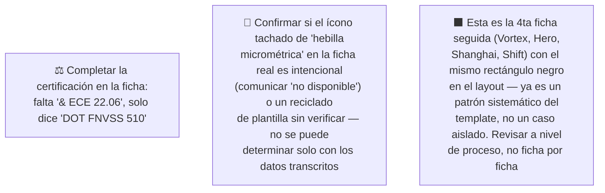

# Simulación 15 — Shift: verificación ficha de marketing vs. excel maestro de specs (Etapa 3 — Catálogo)

[← Volver al índice de mis pruebas](../mis-pruebas-claude-code.md) · [← Orquestación de agentes en paralelo](../orquestacion-agentes-paralelos.md)

Sexto caso del catálogo, pipeline **Tipo C**, Agente Auditor + Generador corrido en segundo plano. Mismo excel que Stellar/Kratos/Xpro/Vortex/Carbex/Hero, columna Shift.

### 🔴 Pendiente de tu parte



<details><summary>Claims transcritos de la ficha Shift</summary>

**Bloque "HOMOLOGACIÓN — DOT FNVSS 510" (7 ítems):** Visera anti scratch, Preparado para anti empañante, Sistema de emergencia de liberación rápida (ERS), Liner desmontable y lavable, Sistema de liberación rápida del visor, Cubre barbilla, Cubre nariz.

**Bloque grid de íconos (6 ítems):** Diseño modular, Con luz LED, Canal para lentes, Hebilla micrométrica (ícono con X roja tachándolo en la ficha real), Doble visera, Espacio para Bluetooth.

</details>

<details><summary>Excel maestro — columna Shift, transcripción completa</summary>

| Fila | Valor Shift |
|---|---|
| Marca | EDGEPRO |
| Certificación | DOT & ECE 22.06 |
| Full Face-Flip Up-Open Face-Adventure | FULL FACE |
| Con luz LED | N/A |
| Doble visera | X |
| Preparado para anti empañante | X |
| Con Pinlock | X |
| Kit de mecanismo visor | X |
| Visera anti scratch | X |
| Hebilla micrométrica | **N/A** — a diferencia de casi todos los demás modelos del catálogo |
| Hebilla doble D | X |
| Espacio para Bluetooth | X |
| Material exterior ABS alta resistencia | X |
| Interior EPS de alta resistencia | X |
| Liner desmontable y lavable | X |
| Cubre barbilla | X |
| Cubre nariz | X |
| Emergency Quick Release System (ERS) | X |
| Canal para lentes | X |
| N° Air Vent System | 3 |
| Estilo de casco | AERODINÁMICO |
| Quick Visor Release System | N/A |
| Master Box | X |
| Inner Box-bolsa protectora | X |
| Con maletín de lujo | X |

</details>

### Auditoría — tabla de verificación

| # | Claim de la ficha | Fila del excel | Valor Shift | Resultado |
|---|---|---|---|---|
| 1 | Visera anti scratch | Visera anti scratch | X | ✅ MATCH |
| 2 | Preparado para anti empañante | Preparado para anti empañante | X | ✅ MATCH |
| 3 | Sistema de emergencia de liberación rápida (ERS) | Emergency Quick Release System (ERS) | X | ✅ MATCH |
| 4 | Liner desmontable y lavable | Liner desmontable y lavable | X | ✅ MATCH |
| 5 | Sistema de liberación rápida del visor | Quick Visor Release System | N/A | ❌ MISMATCH |
| 6 | Cubre barbilla | Cubre barbilla | X | ✅ MATCH |
| 7 | Cubre nariz | Cubre nariz | X | ✅ MATCH |
| 8 | Diseño modular | Full Face-Flip Up-Open Face-Adventure | FULL FACE | ❌ MISMATCH |
| 9 | Con luz LED | Con luz LED | N/A | ❌ MISMATCH |
| 10 | Canal para lentes | Canal para lentes | X | ✅ MATCH |
| 11 | Hebilla micrométrica | Hebilla micrométrica | N/A | ❌ MISMATCH |
| 12 | Doble visera | Doble visera | X | ✅ MATCH |
| 13 | Espacio para Bluetooth | Espacio para Bluetooth | X | ✅ MATCH |

**Veredicto:** 9 MATCH · 4 MISMATCH.

**Certificación:** ficha dice "DOT FNVSS 510" (sin "& ECE 22.06" visible), excel dice "DOT & ECE 22.06" completo — mismo patrón de discrepancia que Kratos y Stellar.

**Nota especial — hebilla micrométrica / ícono tachado:** para Shift, "hebilla micrométrica" es N/A en el excel (a diferencia de casi todo el resto del catálogo, donde sí está confirmada). En la ficha real, ese ícono aparece con una X roja tachándolo. En el caso Vortex, ese mismo patrón visual fue un defecto real (el ítem SÍ estaba confirmado ahí). Acá es la situación inversa: no hay evidencia suficiente para afirmar si el tachado es una representación intencional de "no disponible" o un reciclado de plantilla sin verificar el dato — se deja como observación abierta, sin asumir ninguna de las dos.

**Hallazgo transversal:** 4to caso consecutivo (después de Vortex, Hero, Shanghai) con el mismo rectángulo negro sólido en el layout — refuerza que es un problema sistemático del template maestro del catálogo, no un defecto puntual de cada ficha.

### Prompts corregidos

<details><summary>Prompt A — Homologación Shift (6/6, completo)</summary>

```
Genera una tarjeta de HOMOLOGACIÓN para el casco EDGEPRO SHIFT (FULL FACE), mismo formato vertical angosto 4K que la referencia. Encabezado: "HOMOLOGACIÓN — DOT & ECE 22.06" (certificación completa, corregida — NO usar "DOT FNVSS 510" solo).

Lista de EXACTAMENTE 6 ítems, en este orden:
1. VISERA ANTI SCRATCH
2. PREPARADO PARA ANTI EMPAÑANTE
3. SISTEMA DE EMERGENCIA DE LIBERACIÓN RÁPIDA (ERS)
4. LINER DESMONTABLE Y LAVABLE
5. CUBRE BARBILLA
6. CUBRE NARIZ

CRÍTICO — DIMENSIONES EXACTAS: el lienzo final debe tener EXACTAMENTE el mismo ancho y alto en píxeles (mismo aspect ratio, formato vertical angosto) que la imagen de referencia — no generar un lienzo cuadrado, panorámico ni de proporción distinta.

CRÍTICO — layout: una sola columna vertical con los 6 ítems apilados, espaciado uniforme, sin grid ni columnas múltiples. No agregar un 7° ítem, no omitir ninguno, no duplicar.

PROHIBIDO ABSOLUTO:
- NO incluir "Sistema de liberación rápida del visor" — N/A para Shift.
- NO incluir el ícono de "Hebilla micrométrica" en esta tarjeta.
- NO usar rectángulos negros sólidos como placeholder (patrón repetido en 4 fichas seguidas, no lo repitas acá).
- NO mostrar certificación incompleta.
```

</details>

<details><summary>Prompt B — Grid de íconos Shift (6/6, completo)</summary>

```
Genera un grid de íconos 2x3 para el casco EDGEPRO SHIFT, mismo formato 4K, mismo aspect ratio que la referencia, fondo gris claro, íconos lineales rojo/bordo en octágono.

CRÍTICO — DIMENSIONES Y LAYOUT EXACTOS (un generador anterior de este catálogo falló acá, produjo 2x4 con celdas duplicadas — máxima atención):
- El grid debe tener EXACTAMENTE 2 columnas x 3 filas = 6 celdas en total. NUNCA 2x4, NUNCA 8 celdas.
- Cada uno de los 6 ítems aparece en UNA sola celda, UNA sola vez — no dupliques ningún ítem.
- El lienzo debe tener el mismo ancho y alto en píxeles que la referencia.
- Contá las celdas antes de terminar: deben ser 6, ninguna repetida.

Los 6 ítems, en este orden:
1. CANAL PARA LENTES
2. DOBLE VISERA
3. ESPACIO PARA BLUETOOTH
4. HEBILLA DOBLE D
5. CON PINLOCK
6. KIT DE MECANISMO VISOR

(Se reemplazó "Hebilla micrométrica" —N/A para Shift— por "Hebilla doble D" —sí confirmada—, mismo criterio usado en el caso Hero. Se completó con "Con Pinlock" y "Kit de mecanismo visor", features técnicas confirmadas, en vez de ítems de empaque.)

CRÍTICO — íconos nuevos, no reciclados de la referencia:
- El ítem "Hebilla doble D" necesita un ícono NUEVO, específico para ese tipo de hebilla (broche doble anillo D) — NO copies ni adaptes el ícono de "Hebilla micrométrica" de la referencia (aunque sea el mismo tipo de pieza en la ficha original, son broches físicamente distintos).
- Si el ícono de "Hebilla micrométrica" de la referencia tiene una X roja tachándolo, esa marca NO debe pasar a ningún ícono de este grid — los 6 ítems están confirmados, deben verse limpios y positivos, sin tachaduras.
- No reutilices el dibujo de ningún ícono de la referencia que corresponda a un ítem que no está en esta lista.

PROHIBIDO ABSOLUTO:
- NO incluir "Diseño modular" — Shift es Full Face.
- NO incluir "Con luz LED" — N/A para Shift.
- NO incluir "Hebilla micrométrica" en ninguna forma, tachada o no.
- NO usar rectángulos negros sólidos como placeholder.
```

</details>

### Estado: ⚠️ Falló — 4 de 13 claims no coinciden; ambos prompts quedaron completos (6/6) tras el reemplazo de hebilla

**Qué hay que hacer:**
1. Completar la certificación en la ficha ("& ECE 22.06" falta).
2. Sacar "diseño modular", "con luz LED" y "hebilla micrométrica" antes de reimprimir/republicar (o confirmar con humano si el tachado de hebilla micrométrica era intencional).
3. Sacar "sistema de liberación rápida del visor" del bloque de homologación.
4. Revisar el template maestro por el rectángulo negro recurrente — ya son 4 casos seguidos.
5. Subir los archivos originales como adjunto real para versionarlos.

---

**Última actualización:** 2026-07-28 · Agente Auditor + Generador corrido en segundo plano (a pedido explícito de background), a pedido de auditar el sexto caso del catálogo (Shift). Aspect ratios específicos que el agente había inventado sin base (9:16, 3:2) se revirtieron a "idéntico a la referencia", consistente con el resto de los casos del pipeline.
