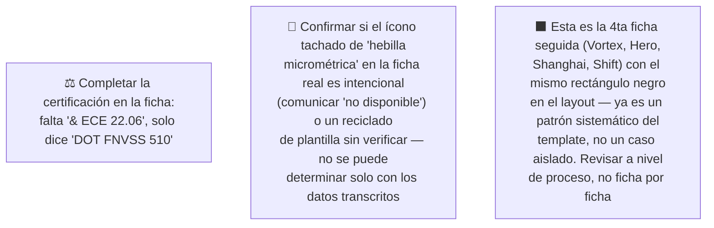

# Simulación 15 — Shift: verificación ficha de marketing vs. excel maestro de specs (Etapa 3 — Catálogo)

[← Volver al índice de mis pruebas](../mis-pruebas-claude-code.md) · [← Orquestación de agentes en paralelo](../orquestacion-agentes-paralelos.md)

Sexto caso del catálogo, pipeline **Tipo C**, Agente Auditor + Generador corrido en segundo plano. Mismo excel que Stellar/Kratos/Xpro/Vortex/Carbex/Hero, columna Shift.

> ⚠️ **Revisión 2026-07-29 — el conteo NO cambió, pero cambió qué es la pieza.** Todo lo que sigue hasta la sección `## Revisión 2026-07-29` es el **registro histórico** de la primera pasada. Con una transcripción nítida de los 2 objetos se re-corrió la auditoría desde cero: el veredicto sigue siendo **9 MATCH / 4 MISMATCH / 0 SIN DATO**, igual que el "9 de 13" ya registrado. Lo que sí cambió es el diagnóstico de fondo: **la pieza no es la ficha del Shift, es la plantilla genérica del catálogo sin adaptar a ningún modelo** (prueba de huella digital contra las 7 columnas, abajo), y **el tache sobre el ícono de hebilla micrométrica acá es CORRECTO**, al revés que en el Stellar — el mismo arte miente en una ficha y dice la verdad en la otra. El historial se deja intacto a propósito, misma política que Hero y Stellar. **Para trabajar hoy, usar la sección `## Revisión 2026-07-29` y los prompts de ahí.**

### 🔴 Pendiente de tu parte



<details><summary>Claims transcritos de la ficha Shift</summary>

**Bloque "HOMOLOGACIÓN — DOT FNVSS 510" (7 ítems):** Visera anti scratch, Preparado para anti empañante, Sistema de emergencia de liberación rápida (ERS), Liner desmontable y lavable, Sistema de liberación rápida del visor, Cubre barbilla, Cubre nariz.

**Bloque grid de íconos (6 ítems):** Diseño modular, Con luz LED, Canal para lentes, Hebilla micrométrica (ícono con X roja tachándolo en la ficha real), Doble visera, Espacio para Bluetooth.

</details>

<details><summary>Excel maestro — columna Shift, transcripción completa</summary>

| Fila | Valor Shift |
|---|---|
| Marca | EDGEPRO |
| Certificación | DOT & ECE 22.06 |
| Full Face-Flip Up-Open Face-Adventure | FULL FACE |
| Con luz LED | N/A |
| Doble visera | X |
| Preparado para anti empañante | X |
| Con Pinlock | X |
| Kit de mecanismo visor | X |
| Visera anti scratch | X |
| Hebilla micrométrica | **N/A** — a diferencia de casi todos los demás modelos del catálogo |
| Hebilla doble D | X |
| Espacio para Bluetooth | X |
| Material exterior ABS alta resistencia | X |
| Interior EPS de alta resistencia | X |
| Liner desmontable y lavable | X |
| Cubre barbilla | X |
| Cubre nariz | X |
| Emergency Quick Release System (ERS) | X |
| Canal para lentes | X |
| N° Air Vent System | 3 |
| Estilo de casco | AERODINÁMICO |
| Quick Visor Release System | N/A |
| Master Box | X |
| Inner Box-bolsa protectora | X |
| Con maletín de lujo | X |

</details>

### Auditoría — tabla de verificación

| # | Claim de la ficha | Fila del excel | Valor Shift | Resultado |
|---|---|---|---|---|
| 1 | Visera anti scratch | Visera anti scratch | X | ✅ MATCH |
| 2 | Preparado para anti empañante | Preparado para anti empañante | X | ✅ MATCH |
| 3 | Sistema de emergencia de liberación rápida (ERS) | Emergency Quick Release System (ERS) | X | ✅ MATCH |
| 4 | Liner desmontable y lavable | Liner desmontable y lavable | X | ✅ MATCH |
| 5 | Sistema de liberación rápida del visor | Quick Visor Release System | N/A | ❌ MISMATCH |
| 6 | Cubre barbilla | Cubre barbilla | X | ✅ MATCH |
| 7 | Cubre nariz | Cubre nariz | X | ✅ MATCH |
| 8 | Diseño modular | Full Face-Flip Up-Open Face-Adventure | FULL FACE | ❌ MISMATCH |
| 9 | Con luz LED | Con luz LED | N/A | ❌ MISMATCH |
| 10 | Canal para lentes | Canal para lentes | X | ✅ MATCH |
| 11 | Hebilla micrométrica | Hebilla micrométrica | N/A | ❌ MISMATCH |
| 12 | Doble visera | Doble visera | X | ✅ MATCH |
| 13 | Espacio para Bluetooth | Espacio para Bluetooth | X | ✅ MATCH |

**Veredicto:** 9 MATCH · 4 MISMATCH.

**Certificación:** ficha dice "DOT FNVSS 510" (sin "& ECE 22.06" visible), excel dice "DOT & ECE 22.06" completo — mismo patrón de discrepancia que Kratos y Stellar.

**Nota especial — hebilla micrométrica / ícono tachado:** para Shift, "hebilla micrométrica" es N/A en el excel (a diferencia de casi todo el resto del catálogo, donde sí está confirmada). En la ficha real, ese ícono aparece con una X roja tachándolo. En el caso Vortex, ese mismo patrón visual fue un defecto real (el ítem SÍ estaba confirmado ahí). Acá es la situación inversa: no hay evidencia suficiente para afirmar si el tachado es una representación intencional de "no disponible" o un reciclado de plantilla sin verificar el dato — se deja como observación abierta, sin asumir ninguna de las dos.

**Hallazgo transversal:** 4to caso consecutivo (después de Vortex, Hero, Shanghai) con el mismo rectángulo negro sólido en el layout — refuerza que es un problema sistemático del template maestro del catálogo, no un defecto puntual de cada ficha.

### Prompts corregidos

<details><summary>Prompt A — Homologación Shift (6/6, completo)</summary>

```
Genera una tarjeta de HOMOLOGACIÓN para el casco EDGEPRO SHIFT (FULL FACE), mismo formato vertical angosto 4K que la referencia. Encabezado: "HOMOLOGACIÓN — DOT & ECE 22.06" (certificación completa, corregida — NO usar "DOT FNVSS 510" solo).

Lista de EXACTAMENTE 6 ítems, en este orden:
1. VISERA ANTI SCRATCH
2. PREPARADO PARA ANTI EMPAÑANTE
3. SISTEMA DE EMERGENCIA DE LIBERACIÓN RÁPIDA (ERS)
4. LINER DESMONTABLE Y LAVABLE
5. CUBRE BARBILLA
6. CUBRE NARIZ

CRÍTICO — DIMENSIONES EXACTAS: el lienzo final debe tener EXACTAMENTE el mismo ancho y alto en píxeles (mismo aspect ratio, formato vertical angosto) que la imagen de referencia — no generar un lienzo cuadrado, panorámico ni de proporción distinta.

CRÍTICO — layout: una sola columna vertical con los 6 ítems apilados, espaciado uniforme, sin grid ni columnas múltiples. No agregar un 7° ítem, no omitir ninguno, no duplicar.

PROHIBIDO ABSOLUTO:
- NO incluir "Sistema de liberación rápida del visor" — N/A para Shift.
- NO incluir el ícono de "Hebilla micrométrica" en esta tarjeta.
- NO usar rectángulos negros sólidos como placeholder (patrón repetido en 4 fichas seguidas, no lo repitas acá).
- NO mostrar certificación incompleta.
```

</details>

<details><summary>Prompt B — Grid de íconos Shift (6/6, completo)</summary>

```
Genera un grid de íconos 2x3 para el casco EDGEPRO SHIFT, mismo formato 4K, mismo aspect ratio que la referencia, fondo gris claro, íconos lineales rojo/bordo en octágono.

CRÍTICO — DIMENSIONES Y LAYOUT EXACTOS (un generador anterior de este catálogo falló acá, produjo 2x4 con celdas duplicadas — máxima atención):
- El grid debe tener EXACTAMENTE 2 columnas x 3 filas = 6 celdas en total. NUNCA 2x4, NUNCA 8 celdas.
- Cada uno de los 6 ítems aparece en UNA sola celda, UNA sola vez — no dupliques ningún ítem.
- El lienzo debe tener el mismo ancho y alto en píxeles que la referencia.
- Contá las celdas antes de terminar: deben ser 6, ninguna repetida.

Los 6 ítems, en este orden:
1. CANAL PARA LENTES
2. DOBLE VISERA
3. ESPACIO PARA BLUETOOTH
4. HEBILLA DOBLE D
5. CON PINLOCK
6. KIT DE MECANISMO VISOR

(Se reemplazó "Hebilla micrométrica" —N/A para Shift— por "Hebilla doble D" —sí confirmada—, mismo criterio usado en el caso Hero. Se completó con "Con Pinlock" y "Kit de mecanismo visor", features técnicas confirmadas, en vez de ítems de empaque.)

CRÍTICO — íconos nuevos, no reciclados de la referencia:
- El ítem "Hebilla doble D" necesita un ícono NUEVO, específico para ese tipo de hebilla (broche doble anillo D) — NO copies ni adaptes el ícono de "Hebilla micrométrica" de la referencia (aunque sea el mismo tipo de pieza en la ficha original, son broches físicamente distintos).
- Si el ícono de "Hebilla micrométrica" de la referencia tiene una X roja tachándolo, esa marca NO debe pasar a ningún ícono de este grid — los 6 ítems están confirmados, deben verse limpios y positivos, sin tachaduras.
- No reutilices el dibujo de ningún ícono de la referencia que corresponda a un ítem que no está en esta lista.

PROHIBIDO ABSOLUTO:
- NO incluir "Diseño modular" — Shift es Full Face.
- NO incluir "Con luz LED" — N/A para Shift.
- NO incluir "Hebilla micrométrica" en ninguna forma, tachada o no.
- NO usar rectángulos negros sólidos como placeholder.
```

</details>

### Estado: ⚠️ Falló — 4 de 13 claims no coinciden; ambos prompts quedaron completos (6/6) tras el reemplazo de hebilla

**Qué hay que hacer:**
1. Completar la certificación en la ficha ("& ECE 22.06" falta).
2. Sacar "diseño modular", "con luz LED" y "hebilla micrométrica" antes de reimprimir/republicar (o confirmar con humano si el tachado de hebilla micrométrica era intencional).
3. Sacar "sistema de liberación rápida del visor" del bloque de homologación.
4. Revisar el template maestro por el rectángulo negro recurrente — ya son 4 casos seguidos.
5. Subir los archivos originales como adjunto real para versionarlos.

*(fin del registro histórico de la primera pasada — sigue la revisión vigente)*

---

# Revisión 2026-07-29 — huella digital, re-auditoría completa y prompts corregidos

El usuario mandó una transcripción nítida de los **2 objetos** de la ficha de marketing que se le atribuye al Shift y de la **columna Shift completa** del excel maestro. Se re-corrió la auditoría Tipo C desde cero y, antes de auditar, se hizo la **prueba de huella digital** que se estrenó en el caso Stellar: probar los 13 claims contra **todas** las columnas del catálogo para confirmar de qué modelo es realmente la pieza, en vez de asumir la atribución que viene con ella.

## 1. Prueba de huella digital — la pieza NO es del Shift: es la plantilla genérica del catálogo

<details><summary>Ficha atribuida al Shift — transcripción de los 2 objetos (2026-07-29)</summary>

**Objeto 1 — tarjeta de homologación** (3 bloques apilados):
- Franja de título gris con la palabra **"HOMOLOGACÓN"** — sí, con esa falta de ortografía, sin la **I**.
- Banner negro con **"DOT"** en grande y debajo **"FNVSS 510"**.
- Lista de **7 ítems** sobre fondo gris claro: 1) VISERA ANTI SCRATCH · 2) PREPARADO PARA ANTI EMPAÑANTE · 3) SISTEMA DE EMERGENCIA DE LIBERACIÓN RÁPIDA · 4) LINER DESMONTABLE Y LAVABLE · 5) SISTEMA DE LIBERACIÓN RÁPIDA DEL VISOR · 6) CUBRE BARBILLA · 7) CUBRE NARIZ

**Objeto 2 — grid de íconos 2 columnas x 3 filas = 6 celdas**, íconos lineales rojo/bordo dentro de octágonos:
- Fila 1: **DISEÑO MODULAR** · **CON LUZ LED**
- Fila 2: **CANAL PARA LENTES** · **HEBILLA MICROMÉTRICA**
- Fila 3: **DOBLE VISERA** · **ESPACIO PARA BLUETOOTH**
- ⚠️ El ícono de **HEBILLA MICROMÉTRICA lleva una X / tache ROJO grande encima** — comunica que el casco **NO** la tiene.

</details>

<details><summary>Excel maestro — columna Shift, transcripción completa (2026-07-29)</summary>

| Fila | Valor Shift |
|---|---|
| Marca | EDGEPRO |
| Certificación | **DOT & ECE 22.06** |
| Full Face-Flip Up-Open Face-Adventure | **FULL FACE** |
| Con luz LED | **N/A** |
| Doble visera | X |
| Mica night vision/PC/etc | (vacío) → **SIN DATO** |
| Preparado para anti empañante | X |
| Con Pinlock | X |
| Kit de mecanismo visor | X |
| Visera anti scratch | X |
| Hebilla micrométrica | **N/A** |
| Hebilla doble D | X |
| Espacio para Bluetooth | X |
| Material exterior ABS alta resistencia | X |
| Interior EPS de alta resistencia | X |
| Liner desmontable y lavable | X |
| Cubre barbilla | X |
| Cubre nariz | X |
| Emergency Quick Release System (ERS) | X |
| Canal para lentes | X |
| N° Air Vent System | 3 |
| Estilo de casco | AERODINÁMICO |
| Peso | (vacío) → **SIN DATO** |
| **Quick Visor Release System** | **N/A** |
| Master Box | X |
| Inner Box-bolsa protectora | X |
| Con maletín de lujo | X |

*Recordatorio de método Tipo C: una celda **vacía** es SIN DATO (no se puede confirmar ni descartar); una celda con **N/A** es un descarte confirmado. Las dos vacías de esta columna (Mica night vision, Peso) no son claim de ninguno de los 2 objetos, así que no entran en el conteo.*

</details>

### Los 13 claims probados contra las columnas del catálogo

Se cruzó la **misma lista de 13 claims** contra cada columna disponible del excel EDGEPRO, exactamente como se hizo en el caso Stellar para identificar la pieza por huella digital.

| Claim | Shift | Stellar | Kratos | Vortex | Carbex | Hero |
|---|---|---|---|---|---|---|
| Visera anti scratch | X ✅ | X ✅ | X ✅ | X ✅ | X ✅ | (vacío) ⚪ |
| Preparado para anti empañante | X ✅ | X ✅ | X ✅ | N/A ❌ | X ✅ | (vacío) ⚪ |
| Sistema de emergencia de liberación rápida (ERS) | X ✅ | X ✅ | X ✅ | X ✅ | X ✅ | (vacío) ⚪ |
| Liner desmontable y lavable | X ✅ | X ✅ | X ✅ | X ✅ | X ✅ | X ✅ |
| Sistema de liberación rápida del visor | **N/A ❌** | N/A ❌ | N/A ❌ | X ✅ | X ✅ | (vacío) ⚪ |
| Cubre barbilla | X ✅ | X ✅ | X ✅ | X ✅ | X ✅ | (vacío) ⚪ |
| Cubre nariz | X ✅ | X ✅ | X ✅ | X ✅ | X ✅ | (vacío) ⚪ |
| Diseño modular | **FULL FACE ❌** | FULL FACE ❌ | FULL FACE ❌ | FULL FACE ❌ | FULL FACE ❌ | OPEN FACE ❌ |
| Con luz LED | **N/A ❌** | N/A ❌ | N/A ❌ | N/A ❌ | N/A ❌ | (vacío) ⚪ |
| Canal para lentes | X ✅ | X ✅ | X ✅ | X ✅ | X ✅ | X ✅ |
| Hebilla micrométrica | **N/A ❌** | X ✅ | X ✅ | X ✅ | N/A ❌ | (vacío) ⚪ |
| Doble visera | X ✅ | X ✅ | N/A ❌ | N/A ❌ | N/A ❌ | (vacío) ⚪ |
| Espacio para Bluetooth | X ✅ | X ✅ | X ✅ | X ✅ | X ✅ | X ✅ |
| **TOTAL** | **9 ✅ / 4 ❌** | **10 ✅ / 3 ❌** | **9 ✅ / 4 ❌** | **9 ✅ / 4 ❌** | **9 ✅ / 4 ❌** | **3 ✅ / 1 ❌ / 9 ⚪** |

*(La columna **Xpro** del mismo excel no está transcrita en ningún caso del repo todavía, así que no se pudo probar entera. Lo poco que hay referenciado de forma cruzada —Doble visera = X, Quick Visor Release System = N/A, Preparado para anti empañante = N/A— ya le daría al menos 2 mismatches, así que tampoco es candidata a coincidencia limpia. Queda como pendiente menor.)*

### 🔴 Conclusión de la huella digital: la ficha no fue adaptada a ningún modelo

**Ninguna columna del catálogo coincide con esta pieza.** El mejor puntaje es 10 de 13 (Stellar) y el resto se apiña en 9 de 13. No hay un solo modelo del que esta ficha sea la ficha correcta.

Tres cosas hay que decir fuerte, porque son el hallazgo principal de esta revisión:

1. **La pieza coincide MEJOR con el Stellar (10/13) que con el Shift (9/13).** O sea que ni siquiera la atribución al Shift resiste la huella digital. Pero eso **no significa que sea la ficha del Stellar**: 10 de 13 tampoco es una coincidencia, es simplemente el modelo que menos contradice la plantilla.
2. **Estos 13 claims exactos ya aparecieron atribuidos a cinco modelos distintos** en este mismo repo: Hero (`simulacion-12-hero-verificacion.md`, bloque de 7 + grid de 6, idénticos), Kratos (`simulacion-10-kratos-verificacion.md`, idénticos), la primera pasada del Stellar (`simulacion-14-stellar-verificacion.md`, idénticos), la **Pieza 1 circulante atribuida a Vortex** (`simulacion-11-vortex-verificacion.md`, idénticos **incluido el tache rojo sobre la hebilla micrométrica**) y ahora el Shift. Cinco modelos, una sola pieza.
3. **Detalle que cierra el caso:** la Pieza 1 de Vortex dio exactamente **9 de 13** contra la columna Vortex, el mismo puntaje que esta pieza contra la columna Shift — con **mismatches distintos**. Es la firma estadística de una plantilla genérica: acierta más o menos lo mismo contra cualquier columna, porque no fue escrita contra ninguna.

**Qué significa en la práctica:** esta ficha **no es un caso de "ficha del Shift con 4 errores"**. Es la **plantilla genérica del catálogo, publicada tal cual sobre el modelo Shift sin adaptarla**. Es exactamente el problema sistémico que el caso viene documentando desde Kratos, pero acá queda demostrado numéricamente en vez de inferido. La corrección no es "arreglarle 4 ítems a la ficha del Shift": es **instanciar la plantilla contra la columna Shift**, que es lo que hacen los 2 prompts del final.

## 2. Auditoría Tipo C — los 13 claims contra la columna Shift

**Objeto 1 — tarjeta de homologación (7 claims)**

| # | Claim de la pieza | Fila del excel usada | Valor Shift | Veredicto |
|---|---|---|---|---|
| A1 | VISERA ANTI SCRATCH | Visera anti scratch | X | ✅ MATCH |
| A2 | PREPARADO PARA ANTI EMPAÑANTE | Preparado para anti empañante | X | ✅ MATCH |
| A3 | SISTEMA DE EMERGENCIA DE LIBERACIÓN RÁPIDA | Emergency Quick Release System (ERS) | X | ✅ MATCH |
| A4 | LINER DESMONTABLE Y LAVABLE | Liner desmontable y lavable | X | ✅ MATCH |
| A5 | SISTEMA DE LIBERACIÓN RÁPIDA DEL VISOR | **Quick Visor Release System** | **N/A** | ❌ **MISMATCH duro** |
| A6 | CUBRE BARBILLA | Cubre barbilla | X | ✅ MATCH |
| A7 | CUBRE NARIZ | Cubre nariz | X | ✅ MATCH |

**Objeto 2 — grid de íconos (6 claims)**

| # | Claim de la pieza | Fila del excel usada | Valor Shift | Veredicto |
|---|---|---|---|---|
| B1 | DISEÑO MODULAR | Full Face-Flip Up-Open Face-Adventure | **FULL FACE** | ❌ **MISMATCH duro (contradicción estructural)** |
| B2 | CON LUZ LED | Con luz LED | **N/A** | ❌ **MISMATCH duro** |
| B3 | CANAL PARA LENTES | Canal para lentes | X | ✅ MATCH |
| B4 | HEBILLA MICROMÉTRICA *(ícono con tache rojo)* | Hebilla micrométrica | **N/A** | ❌ MISMATCH de texto — *pero el tache es correcto, ver abajo* |
| B5 | DOBLE VISERA | Doble visera | X | ✅ MATCH |
| B6 | ESPACIO PARA BLUETOOTH | Espacio para Bluetooth | X | ✅ MATCH |

### Veredicto final: **9 MATCH · 4 MISMATCH · 0 SIN DATO** (9 de 13)

**El conteo no cambió respecto del "9 de 13" ya registrado en la primera pasada, y los 4 mismatches son exactamente los mismos** (liberación rápida del visor, diseño modular, luz LED, hebilla micrométrica). La primera pasada estaba bien hecha sobre el texto de los claims — lo que faltaba no era aritmética, era el diagnóstico: que la pieza es una plantilla sin instanciar, y qué significa el tache.

**Validación de la lectura del usuario, punto por punto** (se verificó cada una contra la transcripción del excel, no se dio ninguna por buena):

| Lectura propuesta | Verificación | Resultado |
|---|---|---|
| `DISEÑO MODULAR` es MISMATCH duro porque el excel dice FULL FACE | Confirmado. Modular/flip-up, full face, open face y adventure son **valores excluyentes de una misma fila** — no es un dato faltante, es una contradicción de categoría. Se marca con más peso que un mismatch de dato, según el checklist Tipo C. | ✅ **Correcta** |
| `CON LUZ LED` es MISMATCH duro, no "sin dato" | Confirmado. La celda dice **N/A**, no está vacía: es un **descarte confirmado**. La distinción es justamente el ítem del checklist Tipo C que nació en el caso Hero. | ✅ **Correcta** |
| `SISTEMA DE LIBERACIÓN RÁPIDA DEL VISOR` es MISMATCH duro | Confirmado, con la precaución de fila que exige el checklist: el excel tiene **dos filas de visor distintas** — *Kit de mecanismo visor* (Shift = **X**) y *Quick Visor Release System* (Shift = **N/A**). El claim habla de *liberación rápida*, o sea la segunda. No confundirlas: usar la fila equivocada daría un falso MATCH. | ✅ **Correcta** |
| El tache sobre `HEBILLA MICROMÉTRICA` acá **es correcto** | Confirmado. El excel dice **N/A** para Shift, y el tache es la convención visual de "no disponible": la pieza está comunicando una ausencia que la fuente confirma. **Es el único elemento de arte de toda esta ficha que dice la verdad.** | ✅ **Correcta** |

**Nota de método sobre cómo se contó la celda B4.** Hay dos lecturas posibles y conviene dejar las dos escritas:
- **Lectura por texto (la que se usa para el veredicto formal, 9/13):** el checklist Tipo C dice explícitamente que *el veredicto valida el TEXTO del claim, no su representación gráfica*. El texto "HEBILLA MICROMÉTRICA" en un grid de specs es un claim positivo, y el excel dice N/A → **MISMATCH**. Contarlo así mantiene la comparabilidad con las auditorías de Kratos, Vortex, Hero y Stellar, que se contaron con la misma regla, y con el "9 de 13" ya registrado.
- **Lectura por unidad comunicada (anotada, no usada para el conteo):** si se lee la celda entera —ícono + tache + etiqueta— como un solo mensaje, lo que le llega al cliente es "este casco NO tiene hebilla micrométrica", que **coincide** con el N/A del excel. Bajo esa lectura el veredicto sería 10 MATCH / 3 MISMATCH.

**No se cambia el conteo formal** para no romper la comparabilidad de todo el catálogo, pero sí importa para la decisión de negocio: **la pieza no le está mintiendo al cliente en esa celda**. Los que sí le mienten son los otros 3 mismatches.

**Exclusiones correctas verificadas** (cosas que la pieza NO reclama y el excel confirma que no debería reclamar): ninguna — la pieza reclama absolutamente todo lo que la plantilla trae, no ejerció ninguna exclusión. Esto es en sí mismo evidencia de que no fue instanciada.

**Datos confirmados en el excel y no reclamados en ninguno de los 2 objetos** (no son errores, son oportunidades comerciales sin usar): Con Pinlock, Kit de mecanismo visor, **Hebilla doble D** (la que el casco sí tiene), Material exterior ABS alta resistencia, Interior EPS de alta resistencia, N° Air Vent System = 3, Estilo de casco = AERODINÁMICO, Master Box, Inner Box-bolsa protectora y **Con maletín de lujo** (la de mayor peso comercial, mismo hallazgo que en Kratos y Stellar).

## 3. 🔎 El hallazgo del caso — el mismo tache miente en el Stellar y dice la verdad en el Shift

Este es el punto más interesante de toda la revisión y merece quedar escrito con todas las letras.

| | Stellar (`simulacion-14-stellar-verificacion.md`) | Shift (este caso) |
|---|---|---|
| Arte de la celda | Ícono de hebilla micrométrica **con X roja grande encima** | Ícono de hebilla micrométrica **con X roja grande encima** — *el mismo arte* |
| Excel, fila "Hebilla micrométrica" | **X** (el casco SÍ la tiene) | **N/A** (el casco NO la tiene) |
| Qué comunica el tache | "no tiene hebilla micrométrica" | "no tiene hebilla micrométrica" |
| ¿Es correcto? | ❌ **No.** Niega una feature real → se regala una feature confirmada | ✅ **Sí.** Comunica una ausencia real |
| Cómo se clasifica | **Defecto de arte** (fuera del conteo formal) | **Acierto accidental** (fuera del conteo formal) |

**El arte es idéntico en las dos fichas: en una miente y en la otra no.** Y nada en la pieza permite distinguir un caso del otro — no hay ninguna marca, nota ni diferencia visual que indique que en un modelo el tache es un dato y en el otro un error. Solo se sabe cruzando contra el excel, modelo por modelo.

**La conclusión es dura y es la que hay que llevarse:** el tache **no se decide por modelo, viene heredado de la plantilla**. En el Shift **acierta por casualidad**, no porque alguien haya verificado que el Shift no tiene hebilla micrométrica. La prueba es que la misma celda tachada aparece igual en la Pieza 1 de Vortex (donde la feature es **X** → tache incorrecto), en la ficha vigente del Stellar (**X** → tache incorrecto) y con la misma duda abierta en Kratos (**X** → tache sería incorrecto). Cuatro modelos donde el tache es un defecto, uno donde por azar coincide.

> 🟨 **Hallazgo de template, para el registro:** un elemento de arte heredado de una plantilla puede ser **correcto en un modelo y falso en otro** sin que nada en la pieza lo delate. Que un elemento heredado coincida con el dato de un modelo **no lo valida** — hay que verificarlo modelo por modelo en todo el catálogo. Referencias cruzadas: `simulacion-14-stellar-verificacion.md` (mismo tache, incorrecto), `simulacion-11-vortex-verificacion.md` (mismo tache en la Pieza 1, incorrecto), `simulacion-10-kratos-verificacion.md` (misma duda abierta). Se registra como lección generalizable en [`orquestacion-agentes-paralelos.md`](../orquestacion-agentes-paralelos.md), checklist Tipo C.

**Esto cierra el pendiente T2 del diagrama de arriba**, que preguntaba si el tache del Shift era intencional o un reciclado sin verificar. La respuesta es: **es un reciclado sin verificar que además resulta ser correcto**. Las dos cosas a la vez, y por eso era tan difícil de resolver mirando solo esta ficha.

### 🟦 Pregunta de negocio — ¿vale una de 6 celdas para decir lo que el casco NO tiene?

**Es una decisión del usuario, no una corrección de dato — se plantea, no se ejecuta.**

El grid de íconos tiene **6 celdas**, es la pieza más escasa de toda la ficha, y hoy una de esas 6 se gasta en comunicar una **ausencia**. Un grid de specs de producto normalmente comunica lo que el producto **sí ofrece**: es superficie de venta, no de descargo. Aunque el dato sea cierto, dedicarle un sexto del espacio disponible a una feature que el casco no tiene es caro.

**El reemplazo natural es `HEBILLA DOBLE D`:**
- Para Shift está **confirmada con X** en el excel.
- Es el **dato positivo equivalente** — misma pieza física (el sistema de cierre de la correa), contada en positivo: en vez de "no tiene hebilla micrométrica", "tiene hebilla doble D".
- No duplica ningún ítem del Objeto 1.
- Ya hay precedente en el catálogo: el mismo cambio se hizo en Hero (`simulacion-12-hero-verificacion.md`) y en Carbex (`simulacion-25-carbex-verificacion.md`), los otros dos modelos con la micrométrica en N/A y la doble D en X.

> 🔴 **Pendiente de confirmación del usuario.** El cambio está aplicado en el Prompt B de abajo porque es la recomendación, **pero no está decidido**. Si el usuario prefiere mantener la celda tachada (por ejemplo, porque quiere anticipar una pregunta frecuente del cliente o porque la ficha impresa ya circula así), es una elección legítima y **no un error de dato** — el excel respalda las dos opciones. Si se decide mantenerla, hay que registrarlo como **decisión de negocio** en su propio bloque, igual que se hizo con "DOBLE VISERA" en el Stellar, para que una auditoría futura no lo "corrija".

## 4. Los 2 defectos de plantilla que se repiten acá (ya documentados en otros casos)

No se re-analizan, se referencian y se suman al recuento. Los dos son del **template maestro**, no de la ficha del Shift.

### 4.1 Encabezado "DOT / FNVSS 510" cuando el excel dice "DOT & ECE 22.06"

**❌ MISMATCH duro de certificación.** La pieza muestra el banner negro con "DOT" y debajo "FNVSS 510"; el excel dice **"DOT & ECE 22.06"** para Shift, y **nunca escribe el número "FNVSS 510" en ninguna fila ni columna**. O sea: se **omite** una certificación real y confirmada, y se **agrega** un número sin respaldo en la fuente. Es de mayor peso que un mismatch de feature porque es **regulatorio**.

Es exactamente el mismo defecto ya documentado en Hero (`simulacion-12-hero-verificacion.md`, "los 3 errores duros que se corrigen", punto 3) y en Carbex (`simulacion-25-carbex-verificacion.md`, prohibición de "certificación incompleta"), más Kratos, Shanghai y la Pieza 1 de Vortex. **Recuento con este caso: 6 apariciones confirmadas** (Kratos, Shanghai, Vortex Pieza 1, Hero, Carbex, Shift). El único lugar del catálogo donde la certificación sale bien es en las piezas **regeneradas** con prompt corregido (Vortex 12/12, Kratos 12/12) y en la ficha vigente del Stellar.

### 4.2 Falta de ortografía "HOMOLOGACÓN" → "HOMOLOGACIÓN"

La franja de título dice **"HOMOLOGACÓN"**, sin la **I**. Lo correcto es **"HOMOLOGACIÓN"** (H-O-M-O-L-O-G-A-C-I-Ó-N). **El error es de la pieza original del cliente, no de ningún generador** — se detectó por primera vez en Hero (`simulacion-12-hero-verificacion.md`, defecto 5 del Intento 1 del Prompt A, donde el generador la copió fielmente porque el prompt no describía el bloque de título) y se confirmó también en Kratos (`simulacion-10-kratos-verificacion.md`, punto 4 de la re-auditoría crítica). **Recuento con este caso: 3 apariciones confirmadas** (Hero, Kratos, Shift), sobre 3 fichas donde se pudo leer la franja de título — o sea, **todas las que se pudieron verificar**.

### 🔴 El pendiente real es el TEMPLATE MAESTRO, no cada ficha

Los dos defectos de esta sección, más el tache heredado de la sección 3, más el rectángulo negro recurrente del registro histórico, apuntan todos al mismo lugar: **se están corrigiendo síntomas ficha por ficha cuando el problema está en la plantilla de la que salen todas**. Cada corrección puntual arregla un modelo y deja los otros seis intactos, y la próxima ficha que se genere desde el template vuelve a traer los mismos defectos. **Corregir el template maestro una vez y regenerar desde ahí es más barato que auditar siete fichas por separado**, y esta revisión —donde la pieza resultó ser literalmente la plantilla sin instanciar— es la evidencia más directa de eso que hay en todo el repo.

## 5. Prompts corregidos — Revisión 2026-07-29

Estructura y vocabulario copiados de los prompts ya validados de **Vortex** (`simulacion-11-vortex-verificacion.md`, sección "Prompts corregidos para Vortex (12/12 confirmados)") y **Kratos** (`simulacion-10-kratos-verificacion.md`), que son los dos que efectivamente cerraron en 12/12, más los **blindajes de layout** que dejó el fallo real del Prompt A de Hero. No se inventa formato nuevo.

### 5.1 Qué se reemplaza y por qué

**Ventaja del Shift sobre Hero: acá sobran datos.** La columna Shift tiene **17 features confirmadas con X**, y los 2 objetos necesitan 7 + 6 = 13 slots. Eso permite algo que en Hero fue imposible: **mantener los 2 objetos en su tamaño original** (7 ítems y 6 celdas), sin bajar la cantidad de elementos. Es una ventaja de layout enorme — el modo de falla más caro del catálogo (el lienzo que se estira cuando hay menos elementos que la referencia, Hero 1:2,47 en vez de 1:2) **no se activa acá**, porque el conteo no cambia. El blindaje de lienzo va igual, pero como refuerzo, no como remedio.

**Regla respetada del caso Hero: ningún ítem aparece en los dos objetos a la vez.** En la ficha original los dos bloques son **conjuntos disjuntos** y así se mantienen.

| Ítem que sale | Objeto | Motivo | Ítem que entra | Motivo de la elección |
|---|---|---|---|---|
| SISTEMA DE LIBERACIÓN RÁPIDA DEL VISOR | 1 (tarjeta) | *Quick Visor Release System* = **N/A** para Shift | **MATERIAL EXTERIOR ABS ALTA RESISTENCIA** | Confirmada con **X**. Es una **feature estructural**, temáticamente la más cercana a una tarjeta de *homologación* (resistencia al impacto), que es un bloque de **solo texto** — así que no requiere inventar ningún ícono nuevo, el modo de falla más frecuente del Objeto 2. No está en el grid, no duplica nada. |
| DISEÑO MODULAR | 2 (grid) | El excel dice **FULL FACE**, categorías excluyentes | **KIT DE MECANISMO VISOR** | Confirmada con **X**. Es la feature de visor que el Shift **sí** tiene (la que se confunde con la de liberación rápida, que es N/A), así que además **corrige el malentendido de fila** en la misma pieza. Ya ocupa una celda en los dos grids del catálogo que cerraron 12/12 (Vortex y Kratos) — mantener la misma plantilla de grid entre modelos baja el riesgo de reciclado. |
| CON LUZ LED | 2 (grid) | **N/A** confirmado | **CON PINLOCK** | Confirmada con **X**. Es una feature **con nombre comercial propio** (accesorio reconocible por el cliente), tiene pictograma obvio, y no duplica ningún ítem del Objeto 1. *Nota de redacción: convive con "PREPARADO PARA ANTI EMPAÑANTE" del Objeto 1, pero son **filas distintas del excel** y ambas X — una dice que el visor viene preparado, la otra que el Pinlock está incluido. No es duplicación bajo la regla de conjuntos disjuntos, pero conviene que el usuario lo mire con ojo de copy.* |
| HEBILLA MICROMÉTRICA *(tachada)* | 2 (grid) | **N/A** confirmado — el tache es correcto, pero gasta una celda en una ausencia | **HEBILLA DOBLE D** | Confirmada con **X**. Es el **dato positivo equivalente**: misma pieza física contada en positivo. 🔴 **Pendiente de confirmación del usuario** — ver la pregunta de negocio de la sección 3. Precedente: mismo cambio en Hero y Carbex. |

**Candidatos evaluados y descartados** (quedan como suplentes documentados, no se pierden):

| Candidato | Excel Shift | Decisión |
|---|---|---|
| Interior EPS de alta resistencia | X | **Suplente inmediato.** Válido y del mismo tipo que el ABS exterior. Se prefirió el ABS para la tarjeta porque es la superficie que recibe el impacto directo; si el usuario prefiere hablar del interior, se cambia uno por otro sin más. |
| N° Air Vent System = **3 ventilaciones** | 3 | **Descartado**, mismo criterio que en Stellar. Es un dato numérico **verificable a ojo en el render**: si el arte del casco no muestra exactamente 3 ventilaciones, la pieza se contradice a sí misma y se abre un mismatch nuevo que hoy no existe. Además ningún otro grid del catálogo comunica un número, así que rompería la plantilla. |
| Estilo de casco = AERODINÁMICO | AERODINÁMICO | Descartado. Es un atributo de *marketing*, no una feature verificable — no encaja en un grid de specs técnicas. |
| Master Box / Inner Box / **Con maletín de lujo** | X | Descartados por el criterio ya aplicado en Kratos, Shanghai y Stellar: son **ítems de empaque**, no features del casco, y desentonan en un grid de producto. (El maletín de lujo sigue siendo la mejor oportunidad comercial sin usar del Shift, pero para otra pieza.) |

### 5.2 Los blindajes obligatorios que llevan los 2 prompts

Los seis vienen de fallas **reales y ya registradas** en este repo, no de precaución teórica:

1. **Lienzo constante, declarado en números** — Hero, Prompt A, Intento 1: salió **1 : 2,47** (415 x 1024) en vez de **1 : 2**, porque el prompt declaraba la fidelidad de lienzo solo en palabras. Se declara la relación en números y se dice explícitamente que la cantidad de ítems **no cambia las dimensiones del lienzo**.
2. **Geometría de los separadores** — Hero, mismo intento: descritos solo como *"línea horizontal fina gris"*, volvieron como **bandas horizontales de ancho completo** que partían la tarjeta en bloques. Se declaran grosor (1-2 px), largo (15-25 % del ancho), centrado, que **no llegan a los bordes**, cuántos hay y en qué **no** pueden convertirse.
3. **Conteo forzado, contando uno por uno antes de entregar** — Hero, Prompt B, Intento 1: pidió un grid de **4 celdas** y volvió con **6**, duplicando 2 ítems con **arte distinto en cada repetición**. Kratos, Prompt A: un ítem repetido dando 7 renglones en vez de 6.
4. **Prohibición explícita de adornos** — Hero, mismo intento: apareció un **destello / estrella blanca de cuatro puntas** abajo a la derecha que no existe en la referencia y que nadie pidió.
5. **Los 3 bloques de la tarjeta descritos por separado, incluida la franja de título** — Hero: el prompt describía solo **2 bloques** (banner negro + lista) y se saltaba la franja de título, así que sobre ese bloque el generador no tenía instrucción y **copió el título literal con la falta de ortografía adentro**.
6. **Regla de taches, matizada — no se prohíben en general** — este caso demuestra que un tache puede ser correcto. La regla que se escribe en el prompt es: **un tache solo puede aparecer sobre un ítem cuyo excel diga N/A**; como los 6 ítems del grid corregido están confirmados con **X**, van **todos sin tache**.

<details><summary>Prompt A — Tarjeta de homologación Shift (7/7 confirmados, listo para copiar/pegar en Nano Banana Pro)</summary>

```
Diseñá la tarjeta de HOMOLOGACIÓN del casco EDGEPRO SHIFT (FULL FACE),
reproduciendo el layout de la imagen de referencia adjunta. Es una
reproducción de un layout fijo: lo ÚNICO que cambia respecto de la
referencia es QUÉ DICE la lista y qué dice el banner de certificación.
Todo lo demás —dimensiones, proporciones, tipografía, paleta,
separadores, cantidad de ítems— se reproduce igual.

CRÍTICO — EL LIENZO ES UNA CONSTANTE, NO SE ESTIRA:
- El lienzo final tiene que tener EXACTAMENTE el mismo ancho y el mismo
  alto en píxeles que la imagen de referencia adjunta. Es un rectángulo
  vertical angosto con una relación de aspecto de aproximadamente
  1 : 2 — el alto es aproximadamente el DOBLE del ancho. El resultado
  tiene que dar esa misma relación: alto ÷ ancho ≈ 2.
- ESTA TARJETA TIENE 7 ÍTEMS Y LA REFERENCIA TAMBIÉN TIENE 7. La
  cantidad de ítems NO CAMBIA. Por lo tanto el lienzo tampoco cambia:
  mismo ancho, mismo alto, mismo reparto interno que la referencia.
- La cantidad de ítems NUNCA modifica las dimensiones del lienzo. El
  lienzo es una CONSTANTE, el reparto interno es la VARIABLE. Aunque
  un texto sea más largo o más corto que el de la referencia, el
  lienzo no crece ni se achica: se ajusta el reparto interno.
- ATENCIÓN, ESTE ERROR YA PASÓ EN OTRA TARJETA DE ESTE MISMO CATÁLOGO:
  el resultado salió de aproximadamente 415 x 1024 px, o sea una
  relación de 1 : 2,47 en vez de 1 : 2 — una tarjeta claramente
  ESTIRADA hacia abajo, más alta y más angosta que la referencia. NO LO
  REPITAS.

ESTRUCTURA — 3 BLOQUES APILADOS, DE ARRIBA HACIA ABAJO (describir los
3 por separado es obligatorio: en un intento anterior de este catálogo
el prompt describía solo 2 y el bloque no descrito se copió de la
referencia con una falta de ortografía adentro):

BLOQUE 1 — FRANJA DE TÍTULO (arriba de todo, angosta, fondo GRIS CLARO):
- Una sola línea de texto: "HOMOLOGACIÓN", en negro, bold, MAYÚSCULAS,
  centrada. Nada más en este bloque.
- OJO CON LA ORTOGRAFÍA: la palabra correcta es "HOMOLOGACIÓN", con la
  letra I entre la C y la O finales, y con tilde en la O:
  H-O-M-O-L-O-G-A-C-I-Ó-N. La imagen de referencia adjunta tiene una
  FALTA DE ORTOGRAFÍA en esa palabra: dice "HOMOLOGACÓN", sin la I. NO
  copies esa falta. Escribila bien.
- Es una franja angosta: ocupa poco alto, solo lo necesario para el
  texto más un margen chico arriba y abajo.

BLOQUE 2 — BANNER NEGRO (debajo del título, ancho completo del lienzo):
- Rectángulo sólido NEGRO que ocupa TODO el ancho del lienzo, de borde
  a borde, y aproximadamente el 20-25 % DEL ALTO TOTAL de la tarjeta.
- Adentro, el texto "DOT" en letras BLANCAS enormes, bold, centrado,
  ocupando la mayor parte del banner (como una insignia/logo).
- Debajo de "DOT", dentro del mismo banner negro, en blanco, en cuerpo
  bastante más chico y centrado: "& ECE 22.06".
- CRÍTICO: la imagen de referencia dice "FNVSS 510" debajo del DOT. Ese
  texto NO se copia. La certificación correcta de este casco, según el
  excel maestro, es "DOT & ECE 22.06". El número "FNVSS 510" no existe
  en la fuente de datos. Reemplazalo.

BLOQUE 3 — LISTA DE ÍTEMS (fondo GRIS CLARO, todo el alto restante):
Lista de EXACTAMENTE 7 ítems, en este orden, en MAYÚSCULAS, negro,
bold, centrados horizontalmente:
1. VISERA ANTI SCRATCH
2. PREPARADO PARA ANTI EMPAÑANTE
3. SISTEMA DE EMERGENCIA DE LIBERACIÓN RÁPIDA
4. LINER DESMONTABLE Y LAVABLE
5. MATERIAL EXTERIOR ABS ALTA RESISTENCIA
6. CUBRE BARBILLA
7. CUBRE NARIZ

CRÍTICO — CONTEO FORZADO DE ÍTEMS (hallazgo real de este catálogo: un
generador devolvió esta misma tarjeta con un ítem repetido dos veces,
dando 7 renglones donde debía haber 6; y en otra pieza devolvió filas
de más con ítems duplicados y arte distinto en cada repetición —
prestar máxima atención acá):
- La lista tiene EXACTAMENTE 7 ítems. NUNCA 6, NUNCA 8.
- Cada uno de los 7 ítems aparece UNA sola vez — no repitas ninguno
  para rellenar espacio vertical, ni aunque sobre o falte lugar.
- Antes de entregar, contá los renglones de la lista UNO POR UNO:
  tienen que ser 7, ni uno más ni uno menos, ninguno repetido, y cada
  uno con un texto distinto de los otros 6.

CRÍTICO — LOS SEPARADORES SON LÍNEAS FINAS, NO BANDAS (defecto real de
este catálogo: descritos solo como "línea horizontal fina gris",
volvieron como bandas de ancho completo que partían la tarjeta en
bloques macizos — no lo repitas). Geometría exacta del separador:
- Es un GUION / LÍNEA HORIZONTAL de 1 a 2 PÍXELES de grosor. Fino como
  un trazo de lápiz, no como una barra.
- Es de color GRIS medio, apenas más oscuro que el fondo gris claro,
  solo lo suficiente para que se vea.
- Es CORTO: ocupa aproximadamente entre un 15 % y un 25 % del ancho de
  la tarjeta, NO MÁS. NO llega a los bordes laterales: queda mucho
  espacio gris vacío a su izquierda y a su derecha.
- Va CENTRADO horizontalmente, en el eje vertical de la tarjeta,
  alineado con el centrado del texto.
- Son EXACTAMENTE 6 separadores: uno entre cada par de ítems
  consecutivos. No va separador arriba del ítem 1 ni debajo del ítem 7.
- PROHIBIDO convertirlos en bandas o franjas horizontales de ancho
  completo, en barras gruesas, en divisores de sección, o en bloques de
  fondo de un tono de gris distinto al del resto de la zona gris.
- El fondo gris claro del Bloque 3 es UNO SOLO y CONTINUO de arriba
  abajo: los separadores se dibujan encima, no lo dividen en zonas de
  distinto tono.

CRÍTICO — RITMO VERTICAL: AIRE PAREJO PERO ACOTADO:
- El espacio vertical entre los 7 ítems tiene que ser EXACTAMENTE IGUAL
  entre todos los pares consecutivos, y los márgenes superior e
  inferior de la lista también parejos entre sí.
- Los 7 ítems forman un GRUPO compacto que ocupa casi toda la zona
  gris, igual que en la referencia. Es una LISTA y se tiene que leer
  como una lista: renglones cercanos entre sí separados por su guion
  fino, no secciones independientes con huecos vacíos.

CRÍTICO — TEXTO COMPLETO: los 7 ítems deben tener su texto visible,
completo y legible, tal cual está escrito en la lista — ninguno puede
quedar en blanco, cortado, acortado ni con solo la línea separadora sin
texto arriba (ej. "MATERIAL EXTERIOR ABS ALTA RESISTENCIA" completo, no
"MATERIAL EXTERIOR ABS" solo; "SISTEMA DE EMERGENCIA DE LIBERACIÓN
RÁPIDA" completo, no "SISTEMA DE EMERGENCIA" solo).

QUÉ SE CONSERVA IDÉNTICO A LA REFERENCIA:
- La tipografía: sans serif condensada, MAYÚSCULAS, bold, texto blanco
  sobre el negro y texto negro sobre el gris.
- La paleta: NEGRO / GRIS CLARO / BLANCO, nada más.
- El centrado del texto y los márgenes laterales.
- El orden de los 3 bloques apilados y su proporción relativa.

PROHIBIDO ABSOLUTO:
- NO incluir "SISTEMA DE LIBERACIÓN RÁPIDA DEL VISOR" (Quick Visor
  Release System) — está confirmado como N/A para el Shift en el excel
  maestro. Su lugar en la lista lo ocupa "MATERIAL EXTERIOR ABS ALTA
  RESISTENCIA". Ojo: NO confundir con "Kit de mecanismo visor", que es
  otra fila del excel, sí confirmada, y que va en la otra pieza.
- NO incluir "DISEÑO MODULAR" — el Shift es FULL FACE, son categorías
  excluyentes.
- NO incluir "CON LUZ LED" — N/A confirmado para el Shift.
- NO incluir "HEBILLA MICROMÉTRICA" — N/A confirmado para el Shift.
- NO incluir "CANAL PARA LENTES", "DOBLE VISERA", "ESPACIO PARA
  BLUETOOTH", "KIT DE MECANISMO VISOR", "CON PINLOCK" ni "HEBILLA
  DOBLE D" — esos 6 van en el grid de íconos (Prompt B) y las 2 piezas
  nunca comparten ítems.
- NO escribir "HOMOLOGACÓN" (sin la I). Se escribe "HOMOLOGACIÓN".
- NO mostrar "FNVSS 510" en ninguna parte de la tarjeta.
- NO cambiar la relación de aspecto del lienzo. Nada de estirar hacia
  abajo, nada de agrandar ni achicar la tarjeta.
- NO convertir los separadores en bandas horizontales de ancho
  completo, barras gruesas ni bloques de fondo de otro tono.
- NO agregar destellos, estrellas, brillos, sparkles, chispas, líneas
  decorativas, degradés, sombras, texturas, marcos, íconos, logos ni
  NINGÚN elemento gráfico que no esté en la imagen de referencia. En un
  intento anterior de este catálogo apareció una estrella blanca de
  cuatro puntas abajo a la derecha, sobre el gris: eso NO existe en la
  referencia y NO debe aparecer. Esta tarjeta es SOLO texto sobre
  bloques de color plano.
- NO agregar un 8° ítem ni omitir ninguno de los 7.
- NO usar rectángulos negros sólidos como placeholder en ningún lugar
  fuera del banner de certificación del Bloque 2.
- NO poner ninguna X, tache, cruz ni marca de negación sobre ningún
  texto: los 7 ítems son características que el casco SÍ tiene.
- NO cambiar la paleta (negro / gris claro / blanco).

VERIFICACIÓN FINAL — ANTES DE ENTREGAR, CHEQUEÁ ESTAS 7 COSAS:
1. ¿El ALTO dividido el ANCHO del lienzo da aproximadamente 2, igual
   que la referencia? Si da 2,4 o más, la tarjeta está ESTIRADA:
   rehacela con el alto correcto.
2. ¿Contaste los renglones uno por uno y son EXACTAMENTE 7, ninguno
   repetido?
3. ¿Los separadores son GUIONES FINOS, CORTOS Y CENTRADOS, que no
   llegan a los bordes — y no bandas horizontales de ancho completo?
   ¿Son exactamente 6?
4. ¿El título dice "HOMOLOGACIÓN" completo, con la I y con la tilde?
5. ¿El banner negro dice "DOT" y "& ECE 22.06", y en ninguna parte de
   la tarjeta aparece "FNVSS 510"?
6. ¿Hay algún elemento decorativo (destello, estrella, brillo, línea,
   marco) que NO esté en la imagen de referencia? Si lo hay, sacalo.
7. ¿Los 7 textos están completos, sin ninguno truncado?
```

</details>

<details><summary>Prompt B — Grid de íconos Shift 2x3 (6/6 confirmados, sin taches, listo para copiar/pegar en Nano Banana Pro)</summary>

```
Diseñá un grid de íconos 2x3 para el casco EDGEPRO SHIFT (FULL FACE),
resolución 4K, mismo aspect ratio y mismas dimensiones en píxeles que
la imagen de referencia adjunta. Fondo gris claro uniforme, íconos
lineales rojo/bordo dentro de un octágono, mismo estilo gráfico que la
referencia, con el texto de cada ítem en mayúsculas, bold, centrado
debajo de su ícono.

CRÍTICO — EL LIENZO ES UNA CONSTANTE, NO SE ESTIRA:
- El lienzo final debe tener EXACTAMENTE el mismo ancho y el mismo alto
  en píxeles que la imagen de referencia adjunta, con los MISMOS
  márgenes laterales y el MISMO tamaño de celda, de octágono, de trazo
  y de cuerpo de texto.
- ESTE GRID TIENE 6 CELDAS Y LA REFERENCIA TAMBIÉN TIENE 6 (2 columnas
  x 3 filas). La cantidad de celdas NO CAMBIA, así que el lienzo
  tampoco cambia.
- La cantidad de celdas NUNCA modifica las dimensiones del lienzo. El
  lienzo es una CONSTANTE, el reparto interno es la VARIABLE. Aunque
  una etiqueta sea más larga que la de la referencia, el lienzo no
  crece: se ajusta el cuerpo de texto dentro de su celda.
- PROHIBIDO estirar el lienzo en cualquier dirección, agrandar las
  celdas, los octágonos, los íconos o el texto "para aprovechar el
  espacio". ATENCIÓN: en otra pieza de este mismo catálogo el lienzo
  salió estirado a una relación de 1 : 2,47 en vez de 1 : 2 por no
  declarar esto. NO LO REPITAS.

CRÍTICO — CONTEO FORZADO DE CELDAS (hallazgo real de este catálogo: con
un prompt que solo decía "2x3" una vez, un generador devolvió un grid
con una fila de más e ítems DUPLICADOS, dibujando un arte distinto en
cada repetición del mismo ítem — prestar máxima atención acá):
- El grid debe tener EXACTAMENTE 2 columnas x 3 filas = 6 celdas en
  total. NUNCA 2x4, NUNCA 8 celdas, NUNCA una fila o columna de más,
  NUNCA una celda vacía de relleno.
- Cada uno de los 6 ítems aparece en UNA sola celda, UNA sola vez — no
  dupliques ningún ítem para rellenar una fila extra, ni aunque sobre
  espacio.
- Ningún pictograma puede repetirse en dos celdas: los 6 dibujos son
  distintos entre sí, igual que los 6 textos.
- Antes de entregar, contá las celdas UNA POR UNA: deben ser 6, ni una
  más ni una menos, ninguna repetida, ninguna vacía.

LISTA DE ÍTEMS (exactamente 6, en este orden, uno por celda, leyendo de
izquierda a derecha y de arriba a abajo):
1. KIT DE MECANISMO VISOR
2. CON PINLOCK
3. CANAL PARA LENTES
4. HEBILLA DOBLE D
5. DOBLE VISERA
6. ESPACIO PARA BLUETOOTH

CRÍTICO — REGLA DE TACHES / MARCAS DE NEGACIÓN:
- Un tache (X, cruz, barra diagonal, círculo con línea, símbolo de
  prohibición) SOLO puede aparecer sobre un ítem que el casco NO tenga.
- Los 6 ítems de esta lista están TODOS confirmados como presentes en
  este casco, así que NINGUNO lleva tache: los 6 íconos se dibujan en
  positivo, limpios, sin ninguna marca superpuesta, de ningún color y
  de ningún tamaño.
- ATENCIÓN ESPECIAL: la imagen de referencia muestra el ícono de
  "HEBILLA MICROMÉTRICA" con una X ROJA GRANDE tachándolo. Ese ítem NO
  va en este grid: su celda la ocupa "HEBILLA DOBLE D", que es la
  hebilla que este casco SÍ tiene. Ni el ítem tachado ni su X pasan al
  resultado.

CRÍTICO — ÍCONOS NUEVOS, NO RECICLADOS:
- Diseñá un pictograma propio, específico y correcto para cada uno de
  los 6 ítems de la lista.
- "HEBILLA DOBLE D" necesita un ícono NUEVO, dibujado desde cero: un
  broche de DOS ANILLAS EN "D" con la correa pasando entre ellas. NO
  copies ni adaptes el ícono de "HEBILLA MICROMÉTRICA" de la
  referencia: aunque sea el mismo tipo de pieza (el cierre de la
  correa), son broches físicamente distintos. Y por supuesto, sin la X
  roja que ese ícono trae en la referencia.
- "KIT DE MECANISMO VISOR" y "CON PINLOCK" probablemente no existan en
  la referencia: creá sus pictogramas desde cero (ideas: para el kit,
  el mecanismo/pivote lateral del visor con su tornillo; para el
  Pinlock, la lámina interna del visor con sus dos pines laterales).
- No copies el dibujo interno de un ícono de la referencia que
  corresponda a un ítem distinto del de esta lista — en particular, NO
  reutilices los íconos que en la referencia corresponden a "DISEÑO
  MODULAR" ni a "CON LUZ LED", porque esos ítems no van en esta pieza.
- De la referencia tomá SOLO el estilo visual (línea, grosor, color
  rojo/bordo, forma de octágono, tipografía) — nunca un defecto, una
  marca de exclusión ni el pictograma de otro ítem.

CRÍTICO — TEXTO COMPLETO: la etiqueta de cada celda debe reproducirse
COMPLETA, tal cual está escrita en la lista — no la acortes ni le
quites palabras (ej. "KIT DE MECANISMO VISOR" completo, no "KIT DE
MECANISMO"; "ESPACIO PARA BLUETOOTH" completo, no "BLUETOOTH").

PROHIBIDO ABSOLUTO:
- NO incluir "DISEÑO MODULAR" — el excel confirma que el Shift es FULL
  FACE, y full face y modular son categorías excluyentes.
- NO incluir "CON LUZ LED" — N/A confirmado para el Shift.
- NO incluir "HEBILLA MICROMÉTRICA" en ninguna forma, ni tachada ni
  limpia ni parcial — N/A confirmado para el Shift. Su celda la ocupa
  "HEBILLA DOBLE D".
- NO incluir "SISTEMA DE LIBERACIÓN RÁPIDA DEL VISOR" (Quick Visor
  Release System) — N/A confirmado para el Shift. Ojo: "KIT DE
  MECANISMO VISOR", que sí va, es una fila distinta del excel y sí está
  confirmada; no las confundas ni las fusiones en una sola celda.
- NO incluir "VISERA ANTI SCRATCH", "PREPARADO PARA ANTI EMPAÑANTE",
  "SISTEMA DE EMERGENCIA DE LIBERACIÓN RÁPIDA", "LINER DESMONTABLE Y
  LAVABLE", "MATERIAL EXTERIOR ABS ALTA RESISTENCIA", "CUBRE BARBILLA"
  ni "CUBRE NARIZ" — esos 7 van en la tarjeta de homologación
  (Prompt A) y las 2 piezas nunca comparten ítems.
- NO tachar ningún ícono, con ninguna marca, en ninguna celda.
- NO duplicar ítems ni repetir un pictograma en dos celdas.
- NO agregar destellos, estrellas, brillos, sparkles, degradés,
  sombras, marcos ni ningún elemento decorativo que no esté en la
  imagen de referencia.
- NO usar rectángulos negros sólidos como placeholder en ninguna parte
  de la pieza.
- NO estirar el lienzo ni inflar celdas, íconos o texto.

VERIFICACIÓN FINAL — ANTES DE ENTREGAR, CHEQUEÁ ESTAS 6 COSAS:
1. ¿Contaste las celdas una por una y son EXACTAMENTE 6, en 2 columnas
   x 3 filas, ninguna repetida y ninguna vacía?
2. ¿El ancho y el alto del lienzo, los márgenes y el tamaño de celda
   coinciden con los de la referencia, sin estirar ni inflar nada?
3. ¿Hay alguna X, tache o marca de negación sobre algún ícono? Si la
   hay, sacala: los 6 ítems son features que el casco SÍ tiene.
4. ¿El ícono de la hebilla muestra DOS ANILLAS EN "D" y no el broche
   micrométrico de la referencia?
5. ¿Los 6 pictogramas son distintos entre sí y ninguno es el de un ítem
   que no está en la lista?
6. ¿Las 6 etiquetas están completas, sin ninguna truncada?
```

</details>

**Estado de los 2 prompts:** 🔴 pendientes de generar. Con estos dos, los **13 claims publicados** (7 en la tarjeta + 6 en el grid, todos con X en la columna Shift) quedan respaldados al 100 %, sin ningún claim sin respaldo, sin taches, con la certificación correcta y con el título bien escrito — y **sin bajar la cantidad de elementos de ninguna de las 2 piezas**, que es lo que en Hero obligó a recortar de 13 claims a 6.

**Qué hay que hacer:**
1. **Confirmar la decisión de negocio** de la sección 3: ¿la celda de hebilla se pasa a "HEBILLA DOBLE D" (recomendado, ya aplicado en el Prompt B) o se mantiene la micrométrica tachada? Si se mantiene, hay que registrarlo como decisión de negocio y revertir esa línea del prompt.
2. Correr los 2 prompts en **sesiones de generación aisladas** (una por pieza, no en el mismo hilo — ver el hallazgo de contaminación cruzada entre generaciones del caso Vortex).
3. Auditar los resultados chequeando puntualmente: relación de aspecto ≈ 1 : 2 en la tarjeta, conteo de 7 renglones / 6 celdas, separadores como guiones finos centrados, ausencia total de taches y de adornos inventados, "HOMOLOGACIÓN" bien escrito, "& ECE 22.06" presente y "FNVSS 510" ausente, y que "MATERIAL EXTERIOR ABS ALTA RESISTENCIA" no salga truncado.
4. Escalar a proceso el arreglo del **template maestro** (ver el cierre de la sección 4), en vez de seguir corrigiendo ficha por ficha.
5. Subir los archivos originales como adjunto real para versionarlos.

---

**Última actualización:** 2026-07-29 · **Revisión con transcripción nítida**: se hizo la **prueba de huella digital** de los 13 claims contra las 6 columnas EDGEPRO transcritas en el repo y se confirmó que **la pieza no es la ficha del Shift ni de ningún modelo** — coincide mejor con Stellar (10/13) que con Shift (9/13), y los mismos 13 claims ya aparecieron atribuidos a Hero, Kratos, Stellar (1ª pasada) y a la Pieza 1 de Vortex: es la **plantilla genérica del catálogo publicada sin instanciar**. El veredicto Tipo C contra la columna Shift **se mantiene en 9 MATCH / 4 MISMATCH / 0 SIN DATO**, idéntico al "9 de 13" ya registrado, con los mismos 4 mismatches; se validaron las 4 lecturas propuestas (diseño modular, luz LED y liberación rápida del visor como mismatches duros; tache de hebilla correcto) y se dejó anotada la lectura alternativa de la celda B4 sin cambiar el conteo formal. **Hallazgo principal:** el tache sobre el ícono de hebilla micrométrica es **correcto en el Shift** (N/A) y **falso en el Stellar** (X) siendo **el mismo arte** — o sea que el tache no se decide por modelo, viene heredado de la plantilla y acá acierta por casualidad; se registró como hallazgo de template con referencia cruzada a `simulacion-14-stellar-verificacion.md` y `simulacion-11-vortex-verificacion.md`, y como lección generalizable nueva en el checklist Tipo C de `orquestacion-agentes-paralelos.md`. Se planteó la **pregunta de negocio** de si conviene gastar 1 de 6 celdas del grid en una feature ausente, con "HEBILLA DOBLE D" como reemplazo recomendado y **pendiente de confirmar**. Se sumaron al recuento los 2 defectos de plantilla ya documentados en otros casos: **"DOT / FNVSS 510"** en vez de "DOT & ECE 22.06" (6ª aparición confirmada) y la falta **"HOMOLOGACÓN"** (3ª aparición, sobre 3 fichas verificables), reforzando que el pendiente real es corregir el **template maestro**. Se armaron los **2 prompts corregidos** manteniendo el tamaño original de las 2 piezas (7 ítems + 6 celdas, algo imposible en Hero), con lienzo declarado en números, geometría de separadores, conteo forzado, prohibición de adornos, los 3 bloques de la tarjeta descritos por separado con "HOMOLOGACIÓN" bien escrito, y la regla de taches matizada (un tache solo sobre un ítem con N/A).
· *(2026-07-28, registro previo)* Agente Auditor + Generador corrido en segundo plano (a pedido explícito de background), a pedido de auditar el sexto caso del catálogo (Shift). Aspect ratios específicos que el agente había inventado sin base (9:16, 3:2) se revirtieron a "idéntico a la referencia", consistente con el resto de los casos del pipeline.
