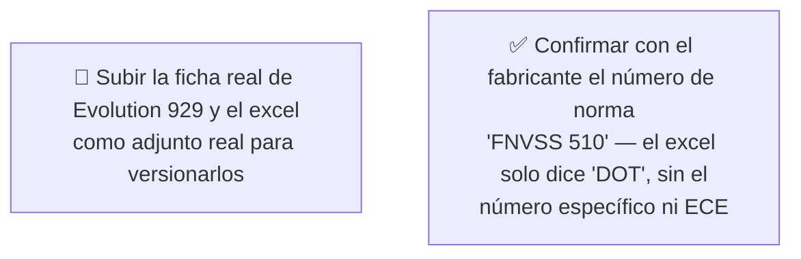

# Simulación 16 — Evolution 929: verificación ficha de marketing vs. excel maestro de specs (Etapa 3 — Catálogo)

[← Volver al índice de mis pruebas](../mis-pruebas-claude-code.md) · [← Orquestación de agentes en paralelo](../orquestacion-agentes-paralelos.md)

Séptimo caso del catálogo, pipeline **Tipo C**, corrido en segundo plano. Primer caso de una **marca/tab distinta**: "EDGE" (Power, Sport, Kova, Monaco, Shanghai, GX7, X5A 2.0, Boston, Boston 4.0, Evolution 929...), no "EDGEPRO" (Stellar, Kratos, Xpro, Vortex, Carbex, Shift, Hero) — no mezclar ambas fuentes. Es también el **mejor resultado del catálogo hasta ahora**: 11 de 13 claims coinciden.

### 🏆 Hallazgo positivo — "Diseño modular" es el primer MATCH real del catálogo

En todos los casos anteriores (Kratos, Vortex, Stellar, Shift), el excel confirmaba que el casco era **Full Face**, así que el claim "Diseño modular" del grid de íconos era sistemáticamente un error. El Evolution 929 es distinto: el excel confirma que el tipo es **FLIP UP (modular real, con mentonera abatible)**. Acá "Diseño modular" sí corresponde y debe conservarse — importante para no aplicar la regla "modular = error" de forma automática en casos futuros, hay que seguir verificando caso por caso.

### 🔴 Pendiente de tu parte



<details><summary>Claims transcritos de la ficha (plantilla genérica reusada)</summary>

**Bloque "HOMOLOGACIÓN — DOT FNVSS 510" (7 ítems):** Visera anti scratch, Preparado para anti empañante, Sistema de emergencia de liberación rápida (ERS), Liner desmontable y lavable, Sistema de liberación rápida del visor, Cubre barbilla, Cubre nariz.

**Bloque grid de íconos (6 ítems):** Diseño modular, Con luz LED, Canal para lentes, Hebilla micrométrica, Doble visera, Espacio para Bluetooth.

</details>

<details><summary>Excel maestro (tab EDGE) — columna Evolution 929, transcripción completa</summary>

| Fila | Valor Evolution 929 |
|---|---|
| Marca | EDGE |
| Certificación | DOT (sin ECE — a diferencia de otros modelos del mismo tab, como Shanghai, X5A 2.0 o Boston, que sí tienen "DOT & ECE") |
| Tipo | **FLIP UP (modular)** |
| Con luz LED | N/A |
| Doble visera | X |
| Preparado para anti empañante | X |
| Con Pinlock | N/A |
| Visera anti scratch | X |
| Hebilla micrométrica | X |
| Hebilla doble D | N/A |
| Espacio para Bluetooth | X |
| Material exterior ABS alta resistencia | X |
| Interior EPS de alta resistencia | X |
| Liner desmontable y lavable | X |
| Cubre barbilla | X |
| Cubre nariz | X |
| Emergency Quick Release System (ERS) | X |
| Canal para lentes | X |
| N° Air Vent System | 4 |
| Estilo de casco | AERODINÁMICO |
| Quick Visor Release System | N/A |
| Master Box | X |
| Inner Box-bolsa protectora | X |

</details>

### Auditoría — tabla de verificación

| # | Claim de la ficha | Fila del excel | Valor Evolution 929 | Resultado |
|---|---|---|---|---|
| 1 | Visera anti scratch | Visera anti scratch | X | ✅ MATCH |
| 2 | Preparado para anti empañante | Preparado para anti empañante | X | ✅ MATCH |
| 3 | Sistema de emergencia de liberación rápida (ERS) | Emergency Quick Release System (ERS) | X | ✅ MATCH |
| 4 | Liner desmontable y lavable | Liner desmontable y lavable | X | ✅ MATCH |
| 5 | Sistema de liberación rápida del visor | Quick Visor Release System | N/A | ❌ MISMATCH |
| 6 | Cubre barbilla | Cubre barbilla | X | ✅ MATCH |
| 7 | Cubre nariz | Cubre nariz | X | ✅ MATCH |
| 8 | Diseño modular | Tipo (Full Face-Flip Up-Open Face-Adventure) | **FLIP UP** | ✅ **MATCH** |
| 9 | Con luz LED | Con luz LED | N/A | ❌ MISMATCH |
| 10 | Canal para lentes | Canal para lentes | X | ✅ MATCH |
| 11 | Hebilla micrométrica | Hebilla micrométrica | X | ✅ MATCH |
| 12 | Doble visera | Doble visera | X | ✅ MATCH |
| 13 | Espacio para Bluetooth | Espacio para Bluetooth | X | ✅ MATCH |

**Veredicto:** 11 MATCH · 2 MISMATCH — mejor resultado del catálogo hasta ahora (por encima de Stellar, 10/13).

**Certificación:** ficha dice "DOT FNVSS 510" (sin ECE), excel dice solo "DOT" (sin ECE tampoco) — más consistente que los casos anteriores, donde faltaba "& ECE 22.06" pese a estar confirmado. Sí queda una discrepancia menor: el número específico "FNVSS 510" no aparece en ninguna celda del excel — dato no verificable con la fuente disponible, ni confirmado ni descartado.

### Prompts corregidos

<details><summary>Prompt A — Homologación Evolution 929 (6/6, completo)</summary>

```
Genera una tarjeta de homologación para casco EDGE Evolution 929, tipo FLIP UP
(modular), en formato vertical angosto 4K, misma estética/tipografía/paleta de
la referencia de marca EDGE ya usada en otras fichas de este catálogo.

CERTIFICACIÓN — usar EXACTAMENTE: "DOT"
No agregues "& ECE" ni ningún número de norma adicional (ej. "FNVSS 510") — el
excel maestro confirma únicamente "DOT" para este modelo.

Lista de EXACTAMENTE 6 ítems, en este orden:
1. VISERA ANTI SCRATCH
2. PREPARADO PARA ANTI EMPAÑANTE
3. SISTEMA DE EMERGENCIA DE LIBERACIÓN RÁPIDA (ERS)
4. LINER DESMONTABLE Y LAVABLE
5. CUBRE BARBILLA
6. CUBRE NARIZ

CRÍTICO — DIMENSIONES EXACTAS: mantené exactamente el mismo ancho y alto en
píxeles que la imagen de referencia — no asumas un aspect ratio específico
que no esté confirmado por una imagen real.

PROHIBIDO ABSOLUTO:
- NO incluir "Sistema de liberación rápida del visor" — N/A para este modelo.
- NO agregar "& ECE" ni ningún número de norma no confirmado.
- NO usar rectángulos negros sólidos como placeholder (patrón recurrente ya
  documentado en 4 casos anteriores de este catálogo).
```

</details>

<details><summary>Prompt B — Grid de íconos Evolution 929 (6/6, completo — incluye "Diseño modular" real)</summary>

```
Genera un grid de íconos EXACTAMENTE 2 columnas x 3 filas (6 celdas) para
casco EDGE Evolution 929, tipo FLIP UP (modular), misma estética de la
referencia de marca EDGE.

CRÍTICO — DIMENSIONES Y LAYOUT EXACTOS (un generador anterior de este catálogo
falló acá, produjo 2x4 con celdas duplicadas — máxima atención):
- EXACTAMENTE 2 columnas x 3 filas = 6 celdas, nunca 2x4 ni 8 celdas.
- Cada ítem en UNA sola celda, UNA sola vez — no dupliques ninguno.
- Mismo ancho/alto en píxeles que la referencia. Contá las celdas antes de
  terminar: 6, ninguna repetida.

Los 6 ítems, en este orden:
1. DISEÑO MODULAR
2. CANAL PARA LENTES
3. HEBILLA MICROMÉTRICA
4. DOBLE VISERA
5. ESPACIO PARA BLUETOOTH
6. MATERIAL EXTERIOR ABS ALTA RESISTENCIA

CASO ESPECIAL — "DISEÑO MODULAR": a diferencia de TODOS los modelos anteriores
de este catálogo (Kratos, Vortex, Stellar, Shift), donde este claim era un
error porque esos cascos eran Full Face, en el Evolution 929 el excel SÍ
confirma tipo FLIP UP. El ícono debe representar correctamente un casco
flip-up/modular real (mentonera abatible visible, línea de articulación/
bisagra a la altura de la sien) — es un dato real para este modelo, no lo
excluyas ni lo dibujes como un casco Full Face genérico.

PROHIBIDO ABSOLUTO:
- NO incluir "Con luz LED" — N/A para este modelo.
- NO incluir "Sistema de liberación rápida del visor" — pertenece al Prompt A
  y además es N/A.
- NO usar rectángulos negros sólidos como placeholder.
```

</details>

### Estado: ⚠️ Falló parcialmente — solo 2 de 13 claims no coinciden, el mejor resultado del catálogo hasta ahora

**Qué hay que hacer:**
1. Sacar "con luz LED" del grid y "sistema de liberación rápida del visor" de la homologación antes de reimprimir.
2. Confirmar el número de norma "FNVSS 510" con el fabricante — el excel no lo tiene transcripto.
3. Subir los archivos originales como adjunto real para versionarlos.

---

**Última actualización:** 2026-07-28 · Agente Auditor + Generador corrido en segundo plano, a pedido de auditar el séptimo caso del catálogo (Evolution 929, primera vez con el tab de marca EDGE en vez de EDGEPRO).
