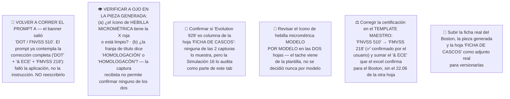

# Simulación 33 — Boston: verificación ficha de marketing vs. excel maestro de specs (Etapa 3 — Catálogo)

[← Volver al índice de mis pruebas](../mis-pruebas-claude-code.md) · [← Orquestación de agentes en paralelo](../orquestacion-agentes-paralelos.md) · [← Índice maestro de prompts](indice-prompts-catalogo.md) · [🎨 Boston 4.0 — 4 variantes de color (Simulación 21)](simulacion-21-boston-4-colores.md) · [🔎 Boston 4.0 — la OTRA ficha, la del otro modelo (Simulación 38)](simulacion-38-boston40-verificacion.md)

Noveno caso del catálogo con pipeline **Tipo C**. Mismo método que [Vortex (Sim. 11)](simulacion-11-vortex-verificacion.md) y [Kratos (Sim. 10)](simulacion-10-kratos-verificacion.md), de donde se copian estructura y vocabulario de los 2 prompts corregidos.

**Este caso es distinto de todos los anteriores en un punto de fondo: no se audita contra la misma hoja del excel.** Ver el bloque `## 🧭 Hallazgo estructural` — es un hallazgo de nivel catálogo, no un detalle de este modelo.

> ✅ **Resuelto (2026-07-29, confirmado por el usuario) — son DOS fichas distintas, una por modelo.** Textual del usuario: *"yo te mandé a hacer 2 diferentes, una del Boston y la otra del Boston 4.0."* O sea que **no hay una sola pieza cuya columna haya que adivinar**: hay **dos piezas de ficha separadas**, y este archivo audita la del **Boston** contra la columna **Boston** (veredicto **11 MATCH / 2 MISMATCH**, con sus 2 ítems de reemplazo ya elegidos), mientras que [`simulacion-38-boston40-verificacion.md`](simulacion-38-boston40-verificacion.md) audita la del **Boston 4.0** contra la columna **Boston 4.0** (veredicto **13 MATCH / 0 MISMATCH**, sin ningún reemplazo de contenido). Las dos columnas existen en la **misma hoja** y **difieren en 5 filas** (certificación, canal para lentes, Quick Visor Release System, N° de ventilaciones y estilo).
>
> 🔎 **Lo que queda como hallazgo de método, no como duda:** las dos fichas son **visualmente idénticas** —misma plantilla genérica de 13 claims, mismos 7 ítems, mismo grid de 6 celdas— y **el veredicto cambia según el modelo al que se las atribuya**: los mismos 13 claims dan **11/13 contra Boston** y **13/13 contra Boston 4.0**. Dos piezas indistinguibles a ojo que auditan distinto es exactamente el escenario que **refuerza el pedido de que cada pieza lleve el nombre del modelo visible** — mismo patrón ya registrado entre Vortex y Kratos y entre Carbex y Shift. Sin el nombre impreso, la única forma de saber cuál ficha es de cuál modelo es preguntarle al usuario, como pasó acá.

> 🎨 **Caso hermano, mismo modelo, otro tema:** [`simulacion-21-boston-4-colores.md`](simulacion-21-boston-4-colores.md) trabaja el **Boston 4.0** por el lado de los colorways (Tipo A, geometría intacta: 4 variantes de color de carcasa + tinte de visor). Este archivo (Sim. 33) es la **auditoría de datos** de la ficha de marketing del mismo modelo. Los dos se referencian entre sí y **no se pisan**: uno habla de píxeles del casco, el otro de claims de specs.

---

## Estado general del caso

**Actualizado 2026-07-29 — los 2 prompts SE CORRIERON y la pieza resultante llegó para auditar.** Ya no es un caso "pendiente de generar": lo que se auditó en esta última pasada **no es la ficha original del cliente**, es **el resultado generado por los Prompts A y B de este mismo archivo**.

| Objeto | Veredicto de datos (contra la columna **Boston**) | Estado del prompt |
|---|---|---|
| Tarjeta de homologación (7 ítems) | ✅ **7 de 7 MATCH** — incluye el reemplazo *INTERIOR EPS DE ALTA RESISTENCIA* | 🟠 **Corrido — corrección de contenido aplicada, corrección de certificación NO aplicada.** Hay que volver a correrlo |
| Grid de íconos (6 celdas) | ✅ **6 de 6 MATCH** — incluye el reemplazo *MATERIAL EXTERIOR ABS ALTA RESISTENCIA* | ✅ **Corrido — contenido correcto.** Pendiente solo la verificación visual del tache |

**Veredicto de la pieza generada: 13 MATCH · 0 MISMATCH · 0 SIN DATO.** La pieza pasó de **11/13 (ficha original) a 13/13 (pieza regenerada)**: los 2 reemplazos elegidos en la sección 4 funcionaron y taparon los 2 mismatches duros.

**Único defecto de contenido que queda:** el banner sigue diciendo **"DOT / FNVSS 510"** en lugar de **"DOT & ECE / FMVSS 218"**. La corrección de contenido se aplicó y la de certificación no — ver el bloque `## 6` más abajo.

---

## 🧭 Hallazgo estructural — la ficha del Boston se audita contra OTRA hoja del excel

Hasta este caso, **todo el catálogo se venía verificando contra una sola tabla**: la de la marca **EDGEPRO** (Stellar, Kratos, Xpro, Vortex, Carbex, Shift, Hero) — casos [10](simulacion-10-kratos-verificacion.md), [11](simulacion-11-vortex-verificacion.md), [12](simulacion-12-hero-verificacion.md), [14](simulacion-14-stellar-verificacion.md), [15](simulacion-15-shift-verificacion.md) y [25](simulacion-25-carbex-verificacion.md).

**El Boston no está en esa tabla.** Pertenece a otra hoja, titulada **"FICHA DE CASCOS"**, de la marca **EDGE** (sin "PRO"), con otros 8 modelos: **Power, Sport, Kova, Monaco, Shanghai, GX7, X5A 2.0, Boston**. Los casos [13 (Shanghai)](simulacion-13-shanghai-verificacion.md) y [16 (Evolution 929)](simulacion-16-evolution929-verificacion.md) ya habían tocado esta hoja y habían dejado escrito "no mezclar las dos fuentes", pero **ninguno de los dos comparó las dos tablas fila por fila**. Acá sí, y la diferencia es mayor de lo que se suponía.

### Las dos hojas NO tienen el mismo set de filas

| Fila | Hoja **EDGEPRO** | Hoja **EDGE** ("FICHA DE CASCOS") | Verificado contra |
|---|---|---|---|
| **PRECIO** | ❌ no existe | ✅ **existe** (vacía para Boston) | Transcripciones EDGEPRO de Vortex, Stellar, Shift y Hero: ninguna tiene fila de precio |
| **KIT DE MECANISMO VISOR** | ✅ existe (X en Vortex, Stellar, Shift, Carbex) | ❌ **no existe** | Ya observado en [Shanghai (Sim. 13)](simulacion-13-shanghai-verificacion.md): *"este tab no tiene fila 'Kit de mecanismo visor'"*. Confirmado ahora también en Boston y en [Evolution 929](simulacion-16-evolution929-verificacion.md) |
| **CON MALETÍN DE LUJO** | ✅ existe (X en Stellar y Shift, N/A en Vortex) | ❌ **no existe** | Hallazgo nuevo de este caso: ninguna transcripción de la hoja EDGE (Shanghai, Evolution 929, Boston) la tiene |
| **Certificación** | Uniforme por marca: **"DOT & ECE 22.06"** en todas las columnas | **Una por modelo**: solo "DOT" en Power, Sport, Kova, Monaco y GX7; **"DOT & ECE"** en Shanghai, X5A 2.0 y **Boston** | Transcripciones de las 8 columnas EDGE |

**Detalle fino de la certificación que hay que respetar:** la hoja EDGE **nunca escribe el número "22.06"**. Para Boston la celda dice exactamente **"DOT & ECE"**, no "DOT & ECE 22.06". Copiar la cadena de la hoja EDGEPRO sería inventar un dato — el mismo error de fondo que ya se documentó con "FNVSS 510", que ninguna de las dos hojas escribe nunca.

### Conclusión de proceso (esto es lo importante, no el detalle del Boston)

**La misma plantilla de ficha de marketing se está aplicando a dos líneas de producto con sets de specs distintos.** Los 13 claims de la plantilla genérica se diseñaron sobre un conjunto de filas que solo existe completo en una de las dos hojas. Eso explica de raíz por qué **los mismos claims fallan una y otra vez en modelos distintos**: no es que cada modelo tenga un error propio, es que la pieza afirma cosas que en su hoja ni siquiera son una fila.

Tres consecuencias operativas concretas:

1. **Antes de auditar hay que declarar contra qué hoja se audita.** Auditar el Boston contra la hoja EDGEPRO habría producido un "SIN DATO" falso en PRECIO y un mismatch inexistente por buscar "Kit de mecanismo visor".
2. **El relleno estándar del grid ya no sirve para los modelos EDGE.** En Vortex, Kratos, Stellar y Shift, la celda que sobraba se completaba con *"Kit de mecanismo visor"* — feature que en la hoja EDGE **no existe como fila**. Es exactamente el callejón sin salida contra el que chocó Shanghai, cuyo grid quedó en 4 de 6 ítems.
3. **La certificación no se puede heredar por marca.** En EDGEPRO alcanzaba con saber la marca; en EDGE hay que ir columna por columna, porque conviven "DOT" y "DOT & ECE" en la misma hoja.

### 🟡 Punto abierto que deja este hallazgo

La hoja "FICHA DE CASCOS" que se transcribió acá tiene **8 columnas** (Power, Sport, Kova, Monaco, Shanghai, GX7, X5A 2.0, Boston) y **no incluye ni "Evolution 929" ni "Boston 4.0"**. Pero la [Simulación 16](simulacion-16-evolution929-verificacion.md) auditó al Evolution 929 declarando que pertenece al tab EDGE, y la [Simulación 21](simulacion-21-boston-4-colores.md) confirmó por logo real que el modelo comercial se llama **"Boston 4.0"**, no "Boston" a secas.

✅ **Resuelto:** la auditoría paralela [`simulacion-38-boston40-verificacion.md`](simulacion-38-boston40-verificacion.md) trabajó sobre una captura de la **misma hoja** que **sí incluye la columna "BOSTON 4.0"** (y cuenta **9 modelos**, no 8). O sea que **"Boston" y "Boston 4.0" son dos columnas distintas y coexisten en la misma hoja** — la lectura correcta era "la captura de este caso no mostraba todas las columnas", no "viven en otra hoja". Y el **2026-07-29 el usuario confirmó** que además hay **dos fichas de marketing distintas**, una por modelo, así que cada archivo audita la suya contra su columna. **Sigue abierto** el punto de **Evolution 929**: ninguna de las dos capturas lo muestra como columna de esta hoja, pese a que la Simulación 16 lo audita como tal. No se asume ninguna lectura.

---

## Datos de entrada

<details><summary>Ficha de marketing atribuida al Boston — transcripción de los 2 objetos</summary>

Es **la misma plantilla genérica** que ya apareció en las fichas del [Hero](simulacion-12-hero-verificacion.md) y del [Shift](simulacion-15-shift-verificacion.md), con los mismos **13 claims**.

**Objeto 1 — tarjeta de homologación** (3 bloques: franja de título / banner negro / lista sobre gris claro):
- Franja de título gris: **"HOMOLOGACÓN"** — con esa falta de ortografía (le falta la **I**).
- Banner negro: **"DOT"** en grande y debajo **"FNVSS 510"**.
- Lista de **7 ítems** sobre fondo gris claro:
  1. VISERA ANTI SCRATCH
  2. PREPARADO PARA ANTI EMPAÑANTE
  3. SISTEMA DE EMERGENCIA DE LIBERACIÓN RÁPIDA
  4. LINER DESMONTABLE Y LAVABLE
  5. SISTEMA DE LIBERACIÓN RÁPIDA DEL VISOR
  6. CUBRE BARBILLA
  7. CUBRE NARIZ

**Objeto 2 — grid de íconos 2 columnas x 3 filas = 6 celdas**, íconos lineales rojo/bordo dentro de octágonos:
- Fila 1: **DISEÑO MODULAR** · **CON LUZ LED**
- Fila 2: **CANAL PARA LENTES** · **HEBILLA MICROMÉTRICA**
- Fila 3: **DOBLE VISERA** · **ESPACIO PARA BLUETOOTH**
- ⚠️ El ícono de **HEBILLA MICROMÉTRICA lleva una X / tache ROJO grande encima** — la pieza afirma en negativo que el casco **NO** la tiene.

</details>

<details><summary>Excel, hoja "FICHA DE CASCOS" (marca EDGE) — columna Boston, transcripción completa</summary>

| Fila | Valor Boston |
|---|---|
| Marca | **EDGE** (no EDGEPRO) |
| Certificación | **DOT & ECE** (sin el "22.06" que sí usa la hoja EDGEPRO) |
| **Precio** | (vacío) → **SIN DATO** — *fila que solo existe en esta hoja* |
| Full Face-Flip Up-Open Face-Adventure | **Flip Up** |
| Con luz LED | **X** ← uno de los 2 únicos modelos del catálogo con esto confirmado (el otro es **Boston 4.0**, ver `simulacion-38`) |
| Doble visera | X |
| Mica night vision/PC/etc | (vacío) → **SIN DATO** |
| Preparado para anti empañante | X |
| Con Pinlock | N/A |
| Visera anti scratch | X |
| Hebilla micrométrica | **X** |
| Hebilla doble D | N/A |
| Espacio para Bluetooth | X |
| Material exterior ABS alta resistencia | X |
| Interior EPS de alta resistencia | X |
| Liner desmontable y lavable | X |
| Cubre barbilla | X |
| Cubre nariz | X |
| Emergency Quick Release System (ERS) | X |
| Canal para lentes (Glasses Fit System) | **N/A** |
| N° Air Vent System | 4 |
| Estilo de casco | MODERNO |
| Peso | (vacío) → **SIN DATO** |
| **Quick Visor Release System** | **N/A** |
| Master Box | X |
| Inner Box-bolsa protectora | X |

*(Esta hoja **no tiene** las filas "Kit de mecanismo visor" ni "Con maletín de lujo", que sí existen en la hoja EDGEPRO — ver el hallazgo estructural.)*

*Recordatorio de método Tipo C: una celda **vacía** es SIN DATO (no se puede confirmar ni descartar); una celda con **N/A** es un **descarte confirmado**. Las tres vacías de esta columna (Precio, Mica night vision, Peso) no son claim de ninguna de las 2 piezas, así que no entran en el conteo.*

</details>

---

## 1. Identificación por huella digital — ¿la ficha es realmente del Boston?

Método: probar los **13 claims de la pieza contra las 8 columnas** de la hoja EDGE y ver cuál explica mejor el contenido. Como es la **plantilla genérica** del catálogo, no se espera que cierre perfecto con ninguna columna — lo que importa es cuál queda mejor y, sobre todo, **qué claim funciona como discriminador**.

### Matriz de los 13 claims contra las 8 columnas EDGE

| # | Claim de la pieza | Power | Sport | Kova | Monaco | Shanghai | GX7 | X5A 2.0 | **Boston** |
|---|---|:--:|:--:|:--:|:--:|:--:|:--:|:--:|:--:|
| 1 | Visera anti scratch | ✅ | ✅ | ✅ | ✅ | ✅ | ✅ | ✅ | ✅ |
| 2 | Preparado para anti empañante | ❌ | ✅ | ✅ | ✅ | ✅ | ✅ | ✅ | ✅ |
| 3 | Sist. de emergencia de liberación rápida (ERS) | ❌ | ✅ | ✅ | ✅ | ❌ | ✅ | ✅ | ✅ |
| 4 | Liner desmontable y lavable | ✅ | ✅ | ✅ | ✅ | ✅ | ✅ | ✅ | ✅ |
| 5 | Sist. de liberación rápida del visor (QVR) | ✅ | ❌ | ✅ | ✅ | ❌ | ❌ | ❌ | ❌ |
| 6 | Cubre barbilla | ✅ | ✅ | ✅ | ✅ | ✅ | ✅ | ✅ | ✅ |
| 7 | Cubre nariz | ❌ | ✅ | ✅ | ✅ | ✅ | ✅ | ✅ | ✅ |
| 8 | **Diseño modular** (fila de tipo) | ❌ FF | ❌ FF | ❌ FF | ❌ FF | ❌ FF | ✅ Flip Up | ✅ Flip Up | ✅ **Flip Up** |
| 9 | **Con luz LED** | ❌ | ❌ | ❌ | ❌ | ❌ | ❌ | ❌ | ✅ **X** |
| 10 | Canal para lentes | ❌ | ✅ | ✅ | ✅ | ✅ | ❌ | ✅ | ❌ |
| 11 | Hebilla micrométrica | ✅ | ✅ | ✅ | ✅ | ✅ | ✅ | ✅ | ✅ |
| 12 | Doble visera | ✅ | ✅ | ❌ | ✅ | ❌ | ✅ | ✅ | ✅ |
| 13 | Espacio para Bluetooth | ✅ | ✅ | ✅ | ✅ | ✅ | ✅ | ✅ | ✅ |
| | **Total MATCH** | 7 | 10 | 10 | **11** | 8 | 10 | **11** | **11** |

### Veredicto de identificación: ✅ **es la ficha del Boston**, con dos evidencias independientes

**Evidencia 1 — el par (Flip Up + LED) es único del Boston.** Tres columnas empatan en 11 MATCH (Monaco, X5A 2.0 y Boston), así que el puntaje solo no alcanza. Lo que desempata es **qué** falla en cada una:

| Columna | Los 2 claims que fallan | ¿Puede ser esta ficha? |
|---|---|---|
| Monaco | **Diseño modular** (es Full Face) + **Con luz LED** (N/A) | ❌ La pieza reclama las dos y las dos son falsas |
| X5A 2.0 | Liberación rápida del visor (N/A) + **Con luz LED** (N/A) | ❌ Reclama LED, que es falso |
| **Boston** | Liberación rápida del visor (N/A) + Canal para lentes (N/A) | ✅ **Los 2 claims más raros de la plantilla —"Diseño modular" y "Con luz LED"— son ciertos los dos** |

**Boston es la única columna de las 8 transcritas acá donde "Diseño modular" y "Con luz LED" dan MATCH simultáneamente.** Solo 3 modelos de esas 8 son Flip Up (GX7, X5A 2.0, Boston) y de esos **solo el Boston tiene LED en X**, así que el par identifica la columna sin ambigüedad dentro de este set. Y el alcance es mayor todavía: **"Con luz LED" está en N/A en las otras 7 columnas de la hoja EDGE y en las 7 columnas de la hoja EDGEPRO** — o sea que el LED, por sí solo, ya descarta 14 de los 15 modelos conocidos. Verificado y confirmado tal como se anticipó.

⚠️ **Corrección posterior, misma jornada — hay una 9ª columna y el LED no es exclusivo del Boston.** La auditoría paralela [`simulacion-38-boston40-verificacion.md`](simulacion-38-boston40-verificacion.md) muestra que la hoja tiene además una columna **BOSTON 4.0**, que **también** es Flip Up y **también** tiene **LED en X**. Lo que hay que corregir de la afirmación de arriba, y lo que se sostiene:

- ❌ **No se sostiene:** "el Boston es el único modelo de todo el catálogo con LED confirmado". Son **dos**: Boston y Boston 4.0 — los únicos 2 de 16 columnas conocidas.
- ✅ **Se sostiene, y es lo que importa:** el par (Flip Up + LED) **identifica la familia Boston sin ambigüedad** y descarta las otras 14 columnas del catálogo.
- 🔍 **Y dentro de la familia, los discriminadores son otros 2 claims:** `CANAL PARA LENTES` y `SISTEMA DE LIBERACIÓN RÁPIDA DEL VISOR`, ambos **N/A en Boston** y ambos **X en Boston 4.0**. Son las dos filas que hacen que **la misma plantilla de 13 claims cierre 11/13 en un modelo y 13/13 en el otro**.

**Conclusión de identificación (✅ cerrada 2026-07-29 por el usuario):** hay **dos fichas separadas, una por modelo**, y esta es la del **Boston** — se audita contra la columna **Boston** y da **11/13**, con los 2 claims discriminantes en N/A y por lo tanto con 2 ítems a reemplazar. La del **Boston 4.0** vive en [`simulacion-38`](simulacion-38-boston40-verificacion.md) y da 13/13 sin reemplazos.

**Hallazgo de método que deja este cruce (no es una duda pendiente):** las dos fichas son **visualmente idénticas** y **el veredicto depende enteramente del modelo al que se las atribuya**. Es el mismo patrón de "dos fichas casi indistinguibles" ya registrado entre Vortex y Kratos (que se diferencian en **un solo renglón**) y entre Carbex y Shift, pero llevado al extremo: acá **las dos piezas son la misma imagen** y solo el nombre del modelo las separa. **Refuerza el pedido de que cada pieza lleve el nombre del modelo visible** — sin eso, ni la pieza ni el excel alcanzan para saber cuál es cuál, y hay que preguntarle al usuario.

**Evidencia 2 — corroboración física, independiente del excel.** La [Simulación 21](simulacion-21-boston-4-colores.md) describe la foto real del Boston 4.0 como *"panel lateral glossy negro con **luces LED rojas de freno**"*. O sea que la feature más discriminante del excel **se ve en la foto del producto**. Es el mismo tipo de evidencia dura que ya se usó para cerrar el naming del modelo (logo real > silueta), aplicado ahora a una spec.

**No hace falta la advertencia:** la huella **no** da otro modelo. Si hubiera dado Monaco o X5A 2.0, iría en negrita al principio del resumen; no es el caso.

---

## 2. Auditoría Tipo C — los 13 claims, uno por uno

**Objeto 1 — tarjeta de homologación (7 claims)**

| # | Claim de la pieza | Fila del excel usada | Valor Boston | Veredicto |
|---|---|---|---|---|
| A1 | VISERA ANTI SCRATCH | Visera anti scratch | X | ✅ MATCH |
| A2 | PREPARADO PARA ANTI EMPAÑANTE | Preparado para anti empañante | X | ✅ MATCH |
| A3 | SISTEMA DE EMERGENCIA DE LIBERACIÓN RÁPIDA | Emergency Quick Release System (ERS) | X | ✅ MATCH |
| A4 | LINER DESMONTABLE Y LAVABLE | Liner desmontable y lavable | X | ✅ MATCH |
| A5 | SISTEMA DE LIBERACIÓN RÁPIDA DEL VISOR | **Quick Visor Release System** | **N/A** | ❌ **MISMATCH duro** |
| A6 | CUBRE BARBILLA | Cubre barbilla | X | ✅ MATCH |
| A7 | CUBRE NARIZ | Cubre nariz | X | ✅ MATCH |

**Objeto 2 — grid de íconos (6 claims)**

| # | Claim de la pieza | Fila del excel usada | Valor Boston | Veredicto |
|---|---|---|---|---|
| B1 | DISEÑO MODULAR | Full Face-Flip Up-Open Face-Adventure | **Flip Up** | ✅ **MATCH** *(ver abajo)* |
| B2 | CON LUZ LED | Con luz LED | **X** | ✅ **MATCH** *(ver abajo)* |
| B3 | CANAL PARA LENTES | Canal para lentes (Glasses Fit System) | **N/A** | ❌ **MISMATCH duro** |
| B4 | HEBILLA MICROMÉTRICA | Hebilla micrométrica | **X** | ✅ MATCH *(el dato es correcto — **el tache miente**, ver defecto de arte)* |
| B5 | DOBLE VISERA | Doble visera | X | ✅ MATCH |
| B6 | ESPACIO PARA BLUETOOTH | Espacio para Bluetooth | X | ✅ MATCH |

### Veredicto final: **11 MATCH · 2 MISMATCH · 0 SIN DATO** (11 de 13)

Empata con [Evolution 929](simulacion-16-evolution929-verificacion.md) (11/13) como el **mejor resultado del catálogo sobre la plantilla genérica de 13 claims** — por encima de Shift (9/13), Shanghai (8/13) y Kratos (9/13). *(Vortex y Stellar llegaron a 12/12, pero sobre piezas de 12 claims, no sobre esta plantilla de 13.)*

### Validación de la lectura previa — los 5 puntos verificados uno por uno

Se pidió expresamente **no dar por buena** la lectura de entrada. Se verificó cada punto de forma independiente contra la columna Boston:

| Punto a validar | Verificación propia | Resultado |
|---|---|---|
| `DISEÑO MODULAR` → Flip Up **no** es mismatch | La fila de tipo dice **Flip Up**, y "flip up" *es* el diseño modular (mentonera abatible). Es exactamente el criterio que fijó [Evolution 929 (Sim. 16)](simulacion-16-evolution929-verificacion.md), **primer caso del catálogo con "Diseño modular" real**, donde se dejó escrito que **no se puede aplicar "modular = error" de forma automática** | ✅ **Confirmado — MATCH** |
| `CON LUZ LED` → MATCH y primer caso del catálogo | Celda en **X**. Se recorrieron las otras 7 columnas EDGE (todas N/A) y las 7 EDGEPRO (todas N/A) | ✅ **Confirmado — MATCH, y único en todo el catálogo** |
| `CANAL PARA LENTES` → MISMATCH duro | Celda en **N/A** = descarte confirmado, no celda vacía. No es SIN DATO | ✅ **Confirmado — MISMATCH** |
| `SISTEMA DE LIBERACIÓN RÁPIDA DEL VISOR` → MISMATCH duro | *Quick Visor Release System* en **N/A**. Ojo con la trampa de naming ya advertida en el checklist Tipo C: **no** se confunde con "Kit de mecanismo visor", que además **no existe como fila en esta hoja** | ✅ **Confirmado — MISMATCH** |
| Tache de `HEBILLA MICROMÉTRICA` → el ítem está bien, el tache miente | Celda en **X**: el Boston **sí** la tiene. El texto del claim es correcto → MATCH de dato. Lo que niega es el **arte** | ✅ **Confirmado — defecto de arte, fuera del conteo** |
| Los otros 8 claims dan MATCH | Verificados uno por uno en las tablas de arriba: A1, A2, A3, A4, A6, A7, B5, B6 — los 8 con **X** en su fila | ✅ **Confirmado — 8/8** |

### 🏆 Dos primeras veces que deja este caso

1. **`DISEÑO MODULAR` es cierto — y es la primera vez que este claim, que venía siendo falso en todos los demás casos, resulta verdadero en la plantilla de 13 claims.** En Kratos, Vortex, Stellar, Shift, Shanghai y Hero el claim fue siempre un error (Full Face u Open Face confirmados). El precedente que habilita leerlo como MATCH es Evolution 929, pero allá la pieza auditada era otra; **acá es la primera vez que la plantilla genérica de 13 claims acierta con este ítem.**
2. **`CON LUZ LED` es el primer LED confirmado del catálogo.** Seis fichas lo venían reclamando y en todas las columnas auditadas hasta hoy estaba en N/A. El Boston es el primero en aparecer con **X** — y por eso mismo el claim **se queda** en el grid. *(Corrección posterior: **no es el único** — la columna **Boston 4.0** también lo tiene en X, ver `simulacion-38`. Son los 2 únicos de 16 columnas conocidas, los dos de la familia Boston, lo cual **no debilita la identificación**: el LED sigue descartando a los otros 14 modelos.)*

### Certificación — MISMATCH duro (se reporta aparte de los 13 claims)

| Fuente | Qué dice |
|---|---|
| Encabezado de la pieza | Banner negro: **"DOT"** + **"FNVSS 510"** |
| Excel, columna Boston | **"DOT & ECE"** |

Dos problemas a la vez, los dos ya documentados en el catálogo:
- **Falta "& ECE"**, que el excel confirma → se omite una certificación real. Mismo patrón que en [Kratos](simulacion-10-kratos-verificacion.md), [Shift](simulacion-15-shift-verificacion.md) y la Pieza 1 de [Vortex](simulacion-11-vortex-verificacion.md).
- **"FNVSS 510" está mal escrito y mal numerado**, y es un número que **ninguna de las dos hojas del excel escribe nunca**. Ya señalado en Vortex (pendiente #10 del índice) y en [Evolution 929](simulacion-16-evolution929-verificacion.md) (pendiente #27).

### ✅ CERRADO (2026-07-29, confirmado por el usuario) — el número correcto es **FMVSS 218**, y la corrección vale para el TEMPLATE MAESTRO de todo el catálogo

Textual del usuario: ***"dot fmvss"***. Queda confirmado que la segunda línea del banner **no se elimina**: se **corrige**.

| | |
|---|---|
| **Qué dice hoy la plantilla** | "FNVSS 510" |
| **Qué tiene que decir** | **"FMVSS 218"** |
| **Qué está mal** | **las dos cosas**: las **letras** (es **FMVSS** — *Federal Motor Vehicle Safety Standard* —, no "FNVSS") y el **número** (es **218**, la norma de cascos de motociclismo, no "510") |
| **Evidencia** | los **stickers de certificación pegados en los cascos físicos** de la marca, visibles en las **fotos de producto del propio catálogo** (en el visor y en la nuca), que dicen **"DOT · FMVSS NO. 218 · CERTIFIED"**. No es una discrepancia entre dos fuentes: "FNVSS 510" es un dato que **no existe en ninguna** |

🔁 **Alcance: TEMPLATE MAESTRO, no este caso.** "FNVSS 510" viene de la **plantilla genérica de marketing**, no de la ficha del Boston: ya apareció en Kratos, Vortex, Shanghai, Hero, Shift, Carbex, Evolution 929, Boston y Boston 4.0 — o sea en **las dos hojas y las dos líneas de producto**. La corrección **"FNVSS 510" → "FMVSS 218" se aplica de una sola vez en el template maestro del catálogo**, igual que la falta de ortografía "HOMOLOGACÓN" y el tache heredado del ícono de hebilla micrométrica. Corregirlo ficha por ficha es repetir nueve veces el mismo parche.

⚠️ **Lo que NO cambia con esta decisión — la primera línea se sigue leyendo de la columna de cada modelo.** El "FMVSS 218" es la **segunda** línea del banner, la que hoy está mal. El **valor de certificación** de la primera línea sale de la fila *Certificación* de la columna del modelo, y para el **Boston** es exactamente **"DOT & ECE"**, **sin "22.06"** — la hoja EDGE nunca escribe ese número. Escribir "DOT & ECE 22.06" acá sería copiar el dato de la otra línea de producto, y agregar "& ECE" a un modelo cuya celda dice solo "DOT" (como el Boston 4.0) sería inventarlo.

### Falta de ortografía — "HOMOLOGACÓN" (defecto de plantilla, ya documentado)

La franja de título dice **"HOMOLOGACÓN"**, sin la **I**. Lo correcto es **"HOMOLOGACIÓN"**.

**No se duplica el análisis:** está resuelto en [`simulacion-12-hero-verificacion.md`](simulacion-12-hero-verificacion.md) (Prompt A, Intento 1, defecto 5), donde se estableció que **el error no es del generador sino de la pieza original del cliente**, y que la causa raíz del prompt fue **no describir el Bloque 1 (la franja de título)**, que quedó sin instrucción y se replicó tal cual. Ahí mismo quedó anotado que era "muy probable que la misma falta esté replicada en las fichas de todos los demás modelos del catálogo".

**Este caso lo confirma en una segunda línea de producto.** Recuento de apariciones verificadas: **Hero (EDGEPRO) + Boston (EDGE) = 2 confirmadas**, en las **dos hojas**. Ya no es una hipótesis sobre "el template de un tab": el defecto viaja con la plantilla de marketing, que es común a EDGEPRO y EDGE. Se sigue pidiendo la revisión modelo por modelo del pendiente ya abierto en el índice.

### Datos confirmados en el excel y no reclamados en ninguna de las 2 piezas

No son errores: son oportunidades comerciales sin usar. **Material exterior ABS alta resistencia** (X), **Interior EPS de alta resistencia** (X), **N° Air Vent System = 4**, **Estilo de casco = MODERNO**, **Master Box** (X), **Inner Box-bolsa protectora** (X). Dos de ellos se usan más abajo para tapar los 2 mismatches.

### Exclusiones correctas verificadas

Cosas que la pieza **no** reclama y el excel confirma que **no** debería reclamar: **Con Pinlock** (N/A) ✅ · **Hebilla doble D** (N/A) ✅ · **Canal para lentes** — bueno, esta **sí** la reclama, y por eso es MISMATCH.

---

## 3. Defecto de arte — el tache sobre HEBILLA MICROMÉTRICA (fuera del conteo formal)

**No es un MISMATCH y por eso está fuera de la tabla de 13.** El ítem está bien elegido, el texto es correcto y el excel lo confirma con **X**: el Boston **sí tiene hebilla micrométrica**. Lo que está mal es el **arte** — el ícono lleva una **X / tache rojo grande encima**, que es la convención visual de "no disponible". La pieza dice en texto "hebilla micrométrica" y dibuja "no tiene hebilla micrométrica". Es **un defecto de arte, no de dato**, exactamente el mismo que se documentó en el [Stellar](simulacion-14-stellar-verificacion.md).

Aplica el ítem del checklist Tipo C ya vigente: *"el veredicto valida el TEXTO del claim, no su representación gráfica"* — una auditoría leída solo sobre el texto da MATCH y **no ve el problema**.

### 🔒 Cierre del caso a nivel catálogo — el tache viene de la plantilla, no se decide por modelo

Con el Boston ya son **tres apariciones del mismo arte heredado, sobre el mismo ícono, con veredictos distintos**:

| Modelo | Hoja | Hebilla micrométrica en el excel | ¿El tache es correcto? | Fuente |
|---|---|---|---|---|
| **Stellar** | EDGEPRO | **X** (la tiene) | ❌ **Falso** — niega una feature real | [`simulacion-14`](simulacion-14-stellar-verificacion.md) |
| **Shift** | EDGEPRO | **N/A** (no la tiene) | ✅ **Correcto** — por coincidencia | [`simulacion-15`](simulacion-15-shift-verificacion.md) |
| **Boston** | **EDGE** | **X** (la tiene) | ❌ **Falso** — niega una feature real | este caso |

**Conclusión, y con esto el caso se cierra como hallazgo:** el mismo ícono tachado aparece en modelos donde el dato es X y en modelos donde el dato es N/A, en **las dos hojas** y en **las dos líneas de producto**. Si el tache se decidiera modelo por modelo, no podría estar presente en los tres. **El tache viene de la plantilla maestra y se arrastra sin verificar; que en Shift acierte es una coincidencia, no una decisión.** El caso Shift deja de ser una "duda abierta" (pendiente #24 del índice): con el Boston queda claro que **no hay evidencia de que nadie lo haya decidido nunca por modelo**.

Sumando las apariciones previas del mismo defecto sobre el mismo ícono —la Pieza 1 circulante de [Vortex](simulacion-11-vortex-verificacion.md) (X confirmada, tache falso), el Intento 1 de su Prompt B (el generador lo reprodujo pese a la prohibición) y la sospecha nunca verificada de Kratos—, son **cinco modelos tocados por el mismo arte**.

**Qué hay que hacer, y es trabajo de a uno:** revisar el ícono **modelo por modelo en las dos hojas** y decidir por dato, no por plantilla. En cada ficha, el ícono va **limpio** si su celda dice X, y solo lleva marca de negación si la celda dice **N/A** — y aun así conviene preguntarse si tiene sentido comunicar en una pieza de marketing algo que el producto no tiene, en vez de simplemente no ponerlo. Hoy el único caso del catálogo con el ícono confirmado limpio es la pieza regenerada de Vortex, y solo porque el prompt lo prohibió en cuatro líneas distintas.

---

## 4. Elección de los 2 ítems de reemplazo

Los 2 MISMATCH duros (`SISTEMA DE LIBERACIÓN RÁPIDA DEL VISOR` en el Objeto 1 y `CANAL PARA LENTES` en el Objeto 2) tienen que salir. Quedan **2 slots libres**, uno en cada objeto, y hay que llenarlos con datos **confirmados con X para Boston** que **todavía no estén en ninguno de los dos objetos**.

**Regla dura que se respeta:** [ya establecida en Hero](simulacion-12-hero-verificacion.md) (*"ningún ítem aparece en las dos tarjetas; la ficha original tampoco repite — sus 7 ítems de lista y sus 6 íconos son conjuntos disjuntos"*) y en el checklist Tipo B (*"sin duplicados entre piezas de un mismo set"*). **Ningún ítem aparece en los dos objetos a la vez.**

| Candidato | Excel Boston | Decisión |
|---|---|---|
| **Interior EPS de alta resistencia** | **X** | ✅ **Elegido para el Objeto 1** (reemplaza a "Sistema de liberación rápida del visor"). Es el candidato **temáticamente correcto para una tarjeta de HOMOLOGACIÓN**: el EPS es el material que absorbe el impacto, o sea el argumento de seguridad que esa tarjeta comunica, junto al resto de sus ítems. No está en el grid, así que no duplica |
| **Material exterior ABS alta resistencia** | **X** | ✅ **Elegido para el Objeto 2** (reemplaza a "Canal para lentes"). Es una **feature física del casco** (no empaque, no dato numérico) y es **exactamente el ítem que ya ocupa una celda en los grids del catálogo que cerraron bien** — Vortex y Kratos en 12/12, y el grid definitivo del Stellar. Mantener la misma plantilla de grid entre modelos es lo que baja el riesgo de reciclado sin verificar. No está en la tarjeta de homologación, así que no duplica |
| N° Air Vent System = 4 ("4 VENTILACIONES") | 4 | ⛔ **Descartado**, mismo criterio que ya se aplicó en el [Stellar](simulacion-14-stellar-verificacion.md): es un **dato numérico duro y verificable a ojo** — si el arte del casco no muestra exactamente 4 ventilaciones, la pieza se contradice sola y se abre un mismatch nuevo que hoy no existe; y **ninguna otra pieza del catálogo comunica un número**, así que rompería la plantilla. Se deja como **suplente** si el usuario prefiere un dato duro y valida el conteo contra la foto real |
| Master Box / Inner Box-bolsa protectora | X | ⛔ **Descartados** por el criterio ya aplicado en Kratos y Shanghai: son **ítems de empaque/logística**, no features del casco, y desentonan en una pieza de producto |
| Estilo de casco = MODERNO | MODERNO | ⛔ **Descartado**: no es una feature, es una categoría de diseño interna; no se comunica en ninguna pieza del catálogo |
| Kit de mecanismo visor | — | ⛔ **Imposible**: es el relleno estándar de los grids EDGEPRO, pero **esa fila no existe en la hoja EDGE**. Es la consecuencia directa del hallazgo estructural |

**Resultado del reparto:** Objeto 1 queda con **7 ítems, 7/7 confirmados**; Objeto 2 con **6 celdas, 6/6 confirmadas**. **13 de 13 claims respaldados por el excel, sin un solo claim sin respaldo.**

**Nota de layout, importante para los prompts:** las dos piezas **conservan la misma cantidad de elementos que la referencia** (7 ítems y 6 celdas). O sea que **este caso no cae** en el modo de falla del Hero (bajar de 7 ítems a 3 y estirar el lienzo) — pero los bloques de lienzo constante y conteo forzado van igual, porque el defecto ya se vivió y sale barato blindarlo.

---

## 5. Prompts corregidos — listos para copiar/pegar en Nano Banana Pro

Estructura y vocabulario copiados de los prompts ya validados de **[Vortex](simulacion-11-vortex-verificacion.md)** (sección "Prompts corregidos para Vortex (12/12 confirmados)") y **[Kratos](simulacion-10-kratos-verificacion.md)**, más los bloques de blindaje que dejó el **[Hero](simulacion-12-hero-verificacion.md)** (lienzo constante en números, geometría de separadores, conteo forzado, prohibición de adornos, 3 bloques descritos por separado). No se inventa formato nuevo.

<details><summary>Prompt A — Tarjeta de homologación Boston (7/7 confirmados)</summary>

```
Diseñá una tarjeta de HOMOLOGACIÓN para el casco EDGE BOSTON (tipo FLIP
UP / modular), EXACTAMENTE con la misma forma, estructura y tamaño que
la imagen de referencia adjunta — el lienzo final tiene que tener el
mismo ancho y el mismo alto en píxeles que la referencia, sin recortar,
sin estirar y sin cambiar la proporción.

Es una reproducción de un layout fijo: lo ÚNICO que cambia respecto de
la referencia es QUÉ DICE un renglón de la lista y QUÉ DICE la línea de
certificación. Todo lo demás —dimensiones, proporciones, tipografía,
paleta, separadores— se reproduce igual.

CRÍTICO — EL LIENZO ES UNA CONSTANTE, NO SE ESTIRA:
- La referencia es un rectángulo VERTICAL ANGOSTO cuya relación de
  aspecto es de aproximadamente 1 : 2, es decir, EL ALTO ES
  APROXIMADAMENTE EL DOBLE DEL ANCHO (alto ÷ ancho ≈ 2). Medí la
  referencia adjunta y reproducí EXACTAMENTE su ancho y su alto en
  píxeles.
- ESTA TARJETA TIENE 7 ÍTEMS, IGUAL QUE LA REFERENCIA. La cantidad de
  ítems NO CAMBIA LAS DIMENSIONES DEL LIENZO. El alto total es el
  mismo con 7 ítems que con 6 o con 3: lo único que cambiaría es
  cuánto aire hay entre ellos dentro de ese mismo alto.
- Pensalo así: el lienzo es una CONSTANTE, el reparto interno es la
  VARIABLE. NO conserves el alto de bloque por ítem y hagas crecer el
  lienzo. Hacé exactamente lo contrario: conservá el alto del lienzo y
  repartí adentro.
- ATENCIÓN, ESTE ERROR YA PASÓ EN OTRA TARJETA DE ESTE MISMO CATÁLOGO:
  el resultado salió de aproximadamente 415 x 1024 px, o sea una
  relación de 1 : 2,47 en vez de 1 : 2 — una tarjeta claramente
  ESTIRADA hacia abajo, más alta y más angosta que la referencia. NO LO
  REPITAS.

ESTRUCTURA — 3 BLOQUES APILADOS, DE ARRIBA HACIA ABAJO (los tres van
descritos por separado a propósito: en un intento anterior de este
catálogo el prompt describía solo 2 bloques y se saltaba la franja de
título, así que el generador la copió tal cual de la referencia CON UNA
FALTA DE ORTOGRAFÍA ADENTRO):

BLOQUE 1 — FRANJA DE TÍTULO (arriba de todo, angosta, fondo GRIS CLARO):
- Una sola línea de texto: "HOMOLOGACIÓN", en negro, bold, MAYÚSCULAS,
  centrada. Nada más en este bloque.
- OJO CON LA ORTOGRAFÍA: la palabra correcta es "HOMOLOGACIÓN", con la
  letra I entre la C y la O finales, y con tilde en la O:
  H-O-M-O-L-O-G-A-C-I-Ó-N. La imagen de referencia adjunta tiene una
  FALTA DE ORTOGRAFÍA en esa palabra (le falta la I y dice
  "HOMOLOGACÓN"): NO copies esa falta, escribila bien.
- Es una franja angosta: ocupa poco alto, solo lo necesario para el
  texto más un margen chico arriba y abajo.

BLOQUE 2 — BANNER NEGRO (debajo del título, ancho completo del lienzo):
- Rectángulo sólido NEGRO que ocupa TODO el ancho del lienzo, de borde
  a borde, y aproximadamente el 15-20 % DEL ALTO TOTAL de la tarjeta.
- Adentro, texto "DOT" en BLANCO, muy grande y bold, centrado, como una
  insignia.
- Debajo de "DOT", dentro del mismo banner negro, en blanco, en cuerpo
  bastante más chico y con las letras espaciadas: "& ECE"
- Debajo de "& ECE", en el mismo banner negro, en blanco y en cuerpo
  chico: "FMVSS 218"
- CRÍTICO — CERTIFICACIÓN EXACTA, SON DOS CORRECCIONES DISTINTAS:
  (1) EL NÚMERO DE NORMA: la imagen de referencia dice "FNVSS 510".
      Ese texto está MAL POR PARTIDA DOBLE —las letras y el número— y
      NO se copia. La norma real, la que dicen los stickers de
      certificación pegados en los cascos físicos de esta marca
      ("DOT · FMVSS NO. 218 · CERTIFIED"), es "FMVSS 218". Escribí
      exactamente "FMVSS 218": con M (FMVSS, no FNVSS) y con 218 (no
      510). NO escribas "FNVSS", NO escribas "510".
  (2) LA CERTIFICACIÓN DEL MODELO: para este casco la fuente de datos
      dice "DOT & ECE", así que va "DOT" grande y "& ECE" debajo. SIN
      el número "22.06": ese sufijo pertenece a otra línea de producto
      y para este modelo sería un dato inventado.
  Las dos líneas conviven: "DOT" grande, "& ECE" debajo, "FMVSS 218"
  abajo de todo, las tres centradas dentro del banner negro.

BLOQUE 3 — LISTA DE ÍTEMS (fondo GRIS CLARO, todo el alto restante):
Lista de EXACTAMENTE 7 ítems, en este orden, en MAYÚSCULAS, negro,
bold, centrados horizontalmente:
1. VISERA ANTI SCRATCH
2. PREPARADO PARA ANTI EMPAÑANTE
3. SISTEMA DE EMERGENCIA DE LIBERACIÓN RÁPIDA
4. LINER DESMONTABLE Y LAVABLE
5. INTERIOR EPS DE ALTA RESISTENCIA
6. CUBRE BARBILLA
7. CUBRE NARIZ

CRÍTICO — CONTEO FORZADO DE ÍTEMS (defecto real de este catálogo: un
generador devolvió una lista con un ítem DUPLICADO y otra pieza salió
con celdas de más):
- Son EXACTAMENTE 7 ítems, ni uno más ni uno menos.
- Cada ítem aparece UNA sola vez. Ninguno se repite, ni siquiera con
  otra redacción.
- ANTES DE ENTREGAR, CONTÁ LOS RENGLONES DE LA LISTA UNO POR UNO: tienen
  que ser 7, ninguno repetido, ninguno vacío.

CRÍTICO — LOS SEPARADORES SON LÍNEAS FINAS, NO BANDAS (defecto real de
este catálogo, no lo repitas). Entre un ítem y el siguiente va un
separador, con esta geometría exacta:
- Es un GUION / LÍNEA HORIZONTAL de 1 a 2 PÍXELES de grosor. Fino como
  un trazo de lápiz, no como una barra.
- Es de color GRIS medio, apenas más oscuro que el fondo gris claro,
  solo lo suficiente para que se vea.
- Es CORTO: ocupa aproximadamente entre un 15 % y un 25 % del ancho de
  la tarjeta, NO MÁS. NO llega a los bordes laterales: queda mucho
  espacio gris vacío a su izquierda y a su derecha.
- Va CENTRADO horizontalmente, en el eje vertical de la tarjeta,
  alineado con el centrado del texto.
- Son EXACTAMENTE 6 separadores: uno entre cada par de ítems
  consecutivos. NO va separador arriba del ítem 1 ni debajo del ítem 7.
- PROHIBIDO convertirlos en bandas o franjas horizontales de ancho
  completo, en barras gruesas, en divisores de sección, o en bloques de
  fondo de un tono de gris distinto al del resto de la zona gris. El
  separador es un DETALLE DISCRETO dentro de un fondo gris continuo, no
  un elemento que parta la tarjeta en secciones. En un intento anterior
  de este catálogo volvieron como bandas grises de ancho completo que
  partían la tarjeta en bloques macizos: eso está MAL.
- El fondo gris claro del Bloque 3 es UNO SOLO y CONTINUO de arriba
  abajo: los separadores se dibujan encima, no lo dividen en zonas de
  distinto tono.

CRÍTICO — ESPACIADO UNIFORME Y TEXTO COMPLETO:
- El espacio vertical entre cada par de ítems consecutivos tiene que ser
  EXACTAMENTE IGUAL entre todos los pares. Distribuí la zona gris de
  forma pareja, sin huecos irregulares.
- Los 7 ítems tienen que tener su texto visible, legible y COMPLETO:
  ninguno puede quedar en blanco, cortado ni acortado. "INTERIOR EPS DE
  ALTA RESISTENCIA" va completo, no "INTERIOR EPS".

QUÉ SE CONSERVA IDÉNTICO A LA REFERENCIA: tipografía sans serif
condensada en mayúsculas y bold, paleta NEGRO / GRIS CLARO / BLANCO y
nada más, centrado del texto, márgenes laterales, y el orden y la
proporción relativa de los 3 bloques.

PROHIBIDO ABSOLUTO:
- NO incluir "SISTEMA DE LIBERACIÓN RÁPIDA DEL VISOR" (Quick Visor
  Release System): la fuente de datos lo marca como NO disponible para
  este modelo. Su lugar lo ocupa "INTERIOR EPS DE ALTA RESISTENCIA".
- NO incluir "CANAL PARA LENTES": tampoco está disponible en este
  modelo, y además no corresponde a esta pieza.
- NO incluir "DISEÑO MODULAR", "CON LUZ LED", "DOBLE VISERA",
  "HEBILLA MICROMÉTRICA", "ESPACIO PARA BLUETOOTH" ni "MATERIAL
  EXTERIOR ABS ALTA RESISTENCIA": esos 6 van en la OTRA pieza (el grid
  de íconos) y las 2 piezas NUNCA comparten ítems.
- NO escribir "HOMOLOGACÓN" (sin la I). Se escribe "HOMOLOGACIÓN".
- NO mostrar "FNVSS 510" en ninguna parte: la norma se escribe
  "FMVSS 218". NO agregar "22.06".
- NO agregar un 8° ítem ni quitar ninguno de los 7.
- NO cambiar la relación de aspecto del lienzo ni estirarlo.
- NO convertir los separadores en bandas horizontales de ancho completo.
- NO agregar destellos, estrellas, brillos, sparkles, chispas, líneas
  decorativas, degradés, sombras, texturas, marcos, íconos, logos ni
  NINGÚN elemento gráfico que no esté en la imagen de referencia. En un
  intento anterior de este catálogo apareció una estrella blanca de
  cuatro puntas abajo a la derecha, sobre el gris: eso NO existe en la
  referencia y NO debe aparecer. Esta tarjeta es SOLO texto sobre
  bloques de color plano.
- NO usar rectángulos negros sólidos como placeholder en ninguna parte
  de la tarjeta fuera del banner del Bloque 2.

VERIFICACIÓN FINAL — ANTES DE ENTREGAR, CHEQUEÁ ESTAS 6 COSAS:
1. ¿El ALTO dividido el ANCHO del lienzo da aproximadamente 2, igual que
   la referencia? Si da 2,4 o más, la tarjeta está ESTIRADA: rehacela.
2. ¿Conté los ítems uno por uno y son EXACTAMENTE 7, ninguno repetido,
   ninguno vacío?
3. ¿Los separadores son GUIONES FINOS, CORTOS Y CENTRADOS que no llegan
   a los bordes — y no bandas horizontales de ancho completo? ¿Son 6?
4. ¿El título dice "HOMOLOGACIÓN" completo, con la I y con la tilde?
5. ¿El banner negro dice "DOT", "& ECE" y "FMVSS 218" —con M y con
   218—, y en ninguna parte de la tarjeta aparece "FNVSS", "510" ni
   "22.06"?
6. ¿Hay algún elemento decorativo (destello, estrella, brillo, marco)
   que NO esté en la imagen de referencia? Si lo hay, sacalo.
```

</details>

<details><summary>Prompt B — Grid de íconos Boston 2x3 (6/6 confirmados, SIN tache)</summary>

```
Diseñá un grid de íconos 2x3 para el casco EDGE BOSTON (tipo FLIP UP /
modular), resolución 4K, con el mismo aspect ratio y las mismas
dimensiones en píxeles que la imagen de referencia adjunta. Fondo gris
claro uniforme, íconos lineales rojo/bordo dentro de un octágono, mismo
estilo gráfico que la referencia, con el texto de cada ítem en
mayúsculas, bold, centrado debajo de su ícono.

CRÍTICO — EL LIENZO ES UNA CONSTANTE, NO SE ESTIRA NI SE INFLA:
- Medí la imagen de referencia adjunta y reproducí EXACTAMENTE su ancho
  y su alto en píxeles. Declaralo como número y respetalo: si la
  referencia mide W x H, el resultado mide W x H.
- Este grid tiene 6 celdas, IGUAL que la referencia. La cantidad de
  celdas NO CAMBIA LAS DIMENSIONES DEL LIENZO: el ancho, los márgenes,
  el tamaño de cada celda y el alto total son los mismos.
- PROHIBIDO estirar el lienzo, cambiar su relación de aspecto, o inflar
  los íconos o el texto para "rellenar" espacio. En un intento anterior
  de este catálogo una pieza volvió estirada a 1 : 2,47 cuando la
  referencia era 1 : 2: no lo repitas.

CRÍTICO — DIMENSIONES Y CONTEO FORZADO DE CELDAS (hallazgo real del
catálogo: con un prompt que solo decía "2x3" una vez, un generador
devolvió un grid con filas de más e ítems DUPLICADOS, dibujando encima
un arte distinto en cada repetición del mismo ítem — prestar máxima
atención acá):
- El grid tiene EXACTAMENTE 2 columnas x 3 filas = 6 celdas en total.
  NUNCA 2x4, NUNCA 8 celdas, NUNCA una fila o columna de más, NUNCA una
  celda vacía de relleno.
- Cada uno de los 6 ítems aparece en UNA sola celda, UNA sola vez — no
  dupliques ningún ítem para rellenar una fila extra, ni aunque sobre
  espacio.
- Ningún pictograma puede repetirse en dos celdas: los 6 dibujos son
  distintos entre sí, igual que los 6 textos.
- ANTES DE TERMINAR, CONTÁ LAS CELDAS UNA POR UNA: deben ser 6, ni una
  más ni una menos, ninguna repetida, ninguna vacía.

LISTA DE ÍTEMS (exactamente 6, en este orden, uno por celda, leyendo de
izquierda a derecha y de arriba a abajo):
1. DISEÑO MODULAR
2. CON LUZ LED
3. MATERIAL EXTERIOR ABS ALTA RESISTENCIA
4. HEBILLA MICROMÉTRICA
5. DOBLE VISERA
6. ESPACIO PARA BLUETOOTH

CRÍTICO — NINGÚN ÍCONO TACHADO, EN NINGUNA CELDA (defecto real de la
pieza que circula hoy para este modelo, y defecto recurrente de la
plantilla de este catálogo — no lo copies):
- NO pongas ninguna X, tache, cruz, barra diagonal, círculo con línea,
  símbolo de prohibición ni ninguna otra marca de negación encima de
  ningún ícono, en ninguna celda, de ningún color y de ningún tamaño.
- Los 6 ítems de la lista están TODOS confirmados como presentes en este
  casco: los 6 íconos se dibujan en positivo, limpios, sin marcas
  superpuestas.
- ATENCIÓN ESPECIAL CON "HEBILLA MICROMÉTRICA": LA IMAGEN DE REFERENCIA
  ADJUNTA MUESTRA ESE ÍCONO CON UNA X ROJA GRANDE TACHÁNDOLO. Esa marca
  es un DEFECTO DE ARTE de la referencia, no un dato del producto — el
  Boston SÍ TIENE hebilla micrométrica, confirmada en la fuente de
  datos. Su ícono debe mostrar únicamente el broche/hebilla, limpio y en
  positivo, SIN la X roja y sin ninguna otra marca encima. No la copies.

CASO ESPECIAL — "DISEÑO MODULAR" ES UN DATO REAL ACÁ:
A diferencia de la mayoría de los modelos de este catálogo, donde este
claim era un error porque el casco era Full Face, el Boston SÍ es FLIP
UP (modular). El ícono tiene que representar correctamente un casco
flip-up real: mentonera abatible visible y línea de articulación /
bisagra a la altura de la sien. No lo excluyas ni lo dibujes como un
casco Full Face genérico.

CASO ESPECIAL — "CON LUZ LED" TAMBIÉN ES UN DATO REAL ACÁ:
Este modelo tiene luz LED confirmada (es el único del catálogo). El
ícono debe representarla de forma positiva y clara (idea: la silueta
trasera del casco con una luz/led emitiendo). No lo excluyas ni lo
taches.

CRÍTICO — ÍCONOS NUEVOS, NO RECICLADOS:
- Diseñá un pictograma propio, específico y correcto para cada uno de
  los 6 ítems de la lista.
- "MATERIAL EXTERIOR ABS ALTA RESISTENCIA" probablemente no exista en la
  referencia: creá su pictograma desde cero (idea: la calota del casco
  con un símbolo de escudo o de impacto que sugiera resistencia del
  material exterior).
- No copies el dibujo interno de un ícono de la referencia que
  corresponda a un ítem distinto del de esta lista — en particular, NO
  reutilices el ícono que en la referencia corresponde a "CANAL PARA
  LENTES", porque ese ítem no va en esta pieza.
- De la referencia tomá SOLO el estilo visual (línea, grosor, color
  rojo/bordo, forma de octágono, tipografía) — nunca un defecto, una
  marca de exclusión ni el pictograma de otro ítem.

CRÍTICO — TEXTO COMPLETO: la etiqueta de cada celda se reproduce
COMPLETA, tal cual está escrita en la lista — no la acortes ni le quites
palabras (ej. "MATERIAL EXTERIOR ABS ALTA RESISTENCIA" completo, no
"MATERIAL EXTERIOR ABS" solo).

PROHIBIDO ABSOLUTO:
- NO incluir "CANAL PARA LENTES": la fuente de datos lo marca como NO
  disponible para este modelo. Su celda la ocupa "MATERIAL EXTERIOR ABS
  ALTA RESISTENCIA".
- NO incluir "SISTEMA DE LIBERACIÓN RÁPIDA DEL VISOR": tampoco está
  disponible en este modelo.
- NO incluir "CON PINLOCK" ni "HEBILLA DOBLE D": no disponibles en este
  modelo (la hebilla de este casco es la micrométrica).
- NO incluir "KIT DE MECANISMO VISOR": no es una spec de esta línea de
  producto.
- NO incluir "VISERA ANTI SCRATCH", "PREPARADO PARA ANTI EMPAÑANTE",
  "SISTEMA DE EMERGENCIA DE LIBERACIÓN RÁPIDA", "LINER DESMONTABLE Y
  LAVABLE", "INTERIOR EPS DE ALTA RESISTENCIA", "CUBRE BARBILLA" ni
  "CUBRE NARIZ": esos 7 ya van en la tarjeta de homologación (Prompt A)
  y las 2 piezas NUNCA comparten ítems.
- No tachar ningún ícono, con ninguna marca, en ninguna celda.
- No duplicar ítems ni repetir un pictograma en dos celdas.
- NO agregar destellos, estrellas, brillos, sparkles, degradés, marcos,
  sombras ni ningún adorno gráfico que no esté en la referencia.
- No usar rectángulos negros sólidos como placeholder en ninguna parte
  de la pieza.

VERIFICACIÓN FINAL — ANTES DE ENTREGAR, CHEQUEÁ ESTAS 5 COSAS:
1. ¿Conté las celdas una por una y son EXACTAMENTE 6 (2 columnas x 3
   filas), ninguna repetida, ninguna vacía?
2. ¿El lienzo tiene el mismo ancho y alto en píxeles que la referencia,
   sin estirar y sin inflar íconos ni texto?
3. ¿Hay alguna X, tache, cruz o marca de negación sobre ALGÚN ícono,
   especialmente el de "HEBILLA MICROMÉTRICA"? Si la hay, sacala.
4. ¿Las 6 etiquetas están completas, sin palabras faltantes?
5. ¿Aparece algún adorno (destello, estrella, marco) que no esté en la
   referencia? Si aparece, sacalo.
```

</details>

**Estado de los 2 prompts:** ✅ **corridos (2026-07-29).** El resultado llegó y está auditado en la sección 6. Con estos dos, los **13 claims publicados** (7 en la tarjeta + 6 en el grid) quedan respaldados al 100 % por el excel, sin ningún claim sin respaldo, con la certificación correcta de la hoja EDGE y con el título bien escrito — **y eso es exactamente lo que se cumplió a medias**: el contenido salió al 100 %, la certificación no.

**Qué había que hacer:** correr los 2 prompts en **sesiones de generación aisladas** (una por pieza, no en el mismo hilo — ver el hallazgo de contaminación cruzada entre generaciones del [caso Vortex](simulacion-11-vortex-verificacion.md)) y mandar los resultados para auditoría, chequeando puntualmente: relación de aspecto, conteo de ítems y de celdas, ausencia total de taches, "HOMOLOGACIÓN" bien escrito, banner "DOT" + "& ECE" + "FMVSS 218" sin "22.06" ni "FNVSS 510", y que la etiqueta larga de "MATERIAL EXTERIOR ABS ALTA RESISTENCIA" no salga truncada. **Hecho — resultado abajo.**

---

## 6. Auditoría de la PIEZA GENERADA (2026-07-29) — el resultado de los prompts, no la ficha original

El usuario mandó una pieza y preguntó si corresponde al Boston. La respuesta tiene dos partes, y la segunda es la importante.

### 6.1 Sí es del Boston — y además NO es la ficha original, es el resultado de los prompts de este archivo

La evidencia no es de huella digital estadística como en la sección 1: es **literal**. Los dos ítems que aparecen en la pieza son **exactamente los 2 reemplazos que este caso inventó en la sección 4**, y **no existen en la plantilla genérica original** de 13 claims que circula en todo el catálogo (Hero, Shift, Boston, Boston 4.0):

| Objeto | Ítem de la pieza recibida | ¿Está en la plantilla genérica original? | ¿Está en el prompt de este archivo? |
|---|---|---|---|
| Tarjeta (ítem 5) | **INTERIOR EPS DE ALTA RESISTENCIA** | ❌ **No.** La original dice *SISTEMA DE LIBERACIÓN RÁPIDA DEL VISOR* | ✅ Sí — **Prompt A, ítem 5**, elegido en la sección 4 para tapar el MISMATCH de *Quick Visor Release System* (N/A) |
| Grid (celda 3) | **MATERIAL EXTERIOR ABS ALTA RESISTENCIA** | ❌ **No.** La original dice *CANAL PARA LENTES* | ✅ Sí — **Prompt B, ítem 3**, elegido en la sección 4 para tapar el MISMATCH de *Canal para lentes* (N/A) |

**Conclusión:** los 2 ítems que la pieza tiene de más son **los 2 reemplazos**, y los 2 que la ficha original tenía **desaparecieron los dos**. Eso no puede pasar por casualidad: **la pieza recibida es el resultado generado de los Prompts A y B de este caso**, no la ficha original del cliente.

**Y descarta también al Boston 4.0 de forma directa:** la ficha del [Boston 4.0](simulacion-38-boston40-verificacion.md) **sí lleva** *SISTEMA DE LIBERACIÓN RÁPIDA DEL VISOR* en la tarjeta y *CANAL PARA LENTES* en el grid (sus dos celdas son X en esa columna, ver `simulacion-38`). La pieza recibida **no tiene ninguno de los dos**, así que no es esa ficha ni el resultado de esos prompts.

### 6.2 Auditoría Tipo C de los 13 claims de la pieza generada contra la columna Boston

**Objeto 1 — tarjeta de homologación (7 claims)**

| # | Claim de la pieza | Fila del excel usada | Valor Boston | Veredicto |
|---|---|---|---|---|
| A1 | VISERA ANTI SCRATCH | Visera anti scratch | X | ✅ MATCH |
| A2 | PREPARADO PARA ANTI EMPAÑANTE | Preparado para anti empañante | X | ✅ MATCH |
| A3 | SISTEMA DE EMERGENCIA DE LIBERACIÓN RÁPIDA | Emergency Quick Release System (ERS) | X | ✅ MATCH |
| A4 | LINER DESMONTABLE Y LAVABLE | Liner desmontable y lavable | X | ✅ MATCH |
| A5 | **INTERIOR EPS DE ALTA RESISTENCIA** | Interior EPS de alta resistencia | **X** | ✅ **MATCH — era el MISMATCH duro, quedó tapado por el reemplazo** |
| A6 | CUBRE BARBILLA | Cubre barbilla | X | ✅ MATCH |
| A7 | CUBRE NARIZ | Cubre nariz | X | ✅ MATCH |

**Objeto 2 — grid de íconos (6 claims)**

| # | Claim de la pieza | Fila del excel usada | Valor Boston | Veredicto |
|---|---|---|---|---|
| B1 | DISEÑO MODULAR | Full Face-Flip Up-Open Face-Adventure | **Flip Up** | ✅ MATCH |
| B2 | CON LUZ LED | Con luz LED | **X** | ✅ MATCH |
| B3 | **MATERIAL EXTERIOR ABS ALTA RESISTENCIA** | Material exterior ABS alta resistencia | **X** | ✅ **MATCH — era el MISMATCH duro, quedó tapado por el reemplazo** |
| B4 | DOBLE VISERA | Doble visera | X | ✅ MATCH |
| B5 | HEBILLA MICROMÉTRICA | Hebilla micrométrica | **X** | ✅ MATCH *(el dato es correcto; el arte queda pendiente de verificación visual, ver 6.4)* |
| B6 | ESPACIO PARA BLUETOOTH | Espacio para Bluetooth | X | ✅ MATCH |

### 🏁 Veredicto de la pieza generada: **13 MATCH · 0 MISMATCH · 0 SIN DATO (13 de 13)**

**Antes y después, registrado:**

| | Ficha original (auditada en la sección 2) | Pieza generada (esta auditoría) |
|---|---|---|
| Tarjeta de homologación | 6 de 7 — *SISTEMA DE LIBERACIÓN RÁPIDA DEL VISOR* en **N/A** | ✅ **7 de 7** |
| Grid de íconos | 5 de 6 — *CANAL PARA LENTES* en **N/A** | ✅ **6 de 6** |
| **Total** | **11 MATCH / 2 MISMATCH** | ✅ **13 MATCH / 0 MISMATCH** |

**Los 2 reemplazos funcionaron.** La sección 2 de este archivo queda como la auditoría de la **ficha original** (11/13) y esta sección 6 como la de la **pieza regenerada** (13/13); las dos se conservan porque el antes y el después es el valor del registro. Con esto el Boston se suma al [Boston 4.0](simulacion-38-boston40-verificacion.md) como **segunda pieza 13/13 del catálogo** — con la diferencia de que aquella lo era de origen y esta **lo consiguió por corrección**, que es el primer caso del catálogo donde una ficha con mismatches se regenera y cierra al 100 %.

### 6.3 ❌ El defecto que SÍ queda — la certificación no se corrigió

| Fuente | Qué dice |
|---|---|
| **Banner de la pieza generada** | **"DOT"** grande + **"FNVSS 510"** debajo |
| Lo que pedía el **Prompt A** | **"DOT"** grande + **"& ECE"** debajo + **"FMVSS 218"** abajo de todo |
| Excel, columna **Boston** | Certificación = **"DOT & ECE"** |
| Stickers de los cascos físicos (confirmado por el usuario) | **"DOT · FMVSS NO. 218 · CERTIFIED"** |

**O sea que el mismo Prompt A aplicó una corrección y se salteó la otra:** cambió el **contenido de la lista** (metió el reemplazo de la sección 4, que era el cambio "nuevo" del prompt) y **no tocó el banner**, que lo copió tal cual de la imagen de referencia — con las dos mitades equivocadas: **"FNVSS" en lugar de "FMVSS"**, **"510" en lugar de "218"**, y **sin el "& ECE"** que el excel confirma para el Boston. El Prompt A dedicaba a esto un bloque `CRÍTICO — CERTIFICACIÓN EXACTA, SON DOS CORRECCIONES DISTINTAS` y un chequeo propio en la verificación final, y aun así el generador reprodujo el texto de la referencia.

**Este es el único defecto pendiente de esta pieza.** No es un MISMATCH de los 13 claims (la certificación siempre se reportó aparte, ver la sección 2), pero es **el más grave de los que quedan**: es un dato regulatorio, y es el único que sigue contradiciendo la fuente.

**Qué hay que hacer, en una línea:** 🔁 **volver a correr el Prompt A tal como está** — ya contempla la corrección completa ("DOT" + "& ECE" + "FMVSS 218", sin "22.06" y sin "FNVSS 510"), no hay que reescribirlo; lo que falló fue la aplicación, no la instrucción. El **Prompt B no hay que volver a correrlo** por este motivo.

### 6.4 Dos puntos que esta captura NO permite verificar — no se dan por buenos ni por malos

1. **🔤 La franja de título ("HOMOLOGACIÓN" vs. "HOMOLOGACÓN") — NO VERIFICABLE EN ESTA CAPTURA.** El recorte recibido **no muestra la franja de título** de arriba, así que no se puede confirmar si el generador corrigió la falta de ortografía o la copió de la referencia. **No se registra como corregido ni como fallado.** Dado que el mismo prompt ya falló en la otra corrección de texto de plantilla (el banner), **hay motivo concreto para sospechar** que esta también se saltó — pero sospechar no es verificar. Queda como **pendiente de verificación visual del usuario**.
   - ❓ **Pregunta concreta para el usuario:** *en la franja gris de arriba de la tarjeta, ¿dice **"HOMOLOGACIÓN"** (con la I, bien escrito) o **"HOMOLOGACÓN"** (sin la I, como la referencia)?*
2. **⚠️ El tache sobre el ícono de HEBILLA MICROMÉTRICA — PENDIENTE DE VERIFICACIÓN VISUAL DEL USUARIO.** A la resolución de esta captura **no se distingue con certeza** si el ícono conserva la X roja o si salió limpio. **No se afirma ni que está ni que no está.** El Prompt B prohibía el tache en cuatro lugares distintos (bloque `CRÍTICO — NINGÚN ÍCONO TACHADO`, atención especial sobre ese ícono, `PROHIBIDO ABSOLUTO` y chequeo 3 de la verificación final), así que si el tache sigue ahí es un hallazgo de peso — el mismo defecto ya se reprodujo pese a la prohibición en el Intento 1 del Prompt B del [Vortex](simulacion-11-vortex-verificacion.md).
   - ❓ **Pregunta concreta para el usuario:** *en la celda de **HEBILLA MICROMÉTRICA** del grid, ¿el ícono tiene encima una **X / tache rojo grande**, o está limpio?* El excel confirma la feature con **X** para el Boston, así que el ícono **tiene que estar limpio**; si la X está, hay que volver a correr el Prompt B.

### 6.5 Observación menor — el orden de las celdas del grid no es el del prompt

Los **6 ítems son los correctos** y son los 6 del Prompt B, pero **dos celdas salieron intercambiadas** respecto del orden pedido:

| Posición | Prompt B pedía | La pieza tiene |
|---|---|---|
| 1 y 2 | DISEÑO MODULAR · CON LUZ LED | ✅ igual |
| 3 y 4 | MATERIAL EXTERIOR ABS ALTA RESISTENCIA · **HEBILLA MICROMÉTRICA** | MATERIAL EXTERIOR ABS ALTA RESISTENCIA · **DOBLE VISERA** |
| 5 y 6 | **DOBLE VISERA** · ESPACIO PARA BLUETOOTH | **HEBILLA MICROMÉTRICA** · ESPACIO PARA BLUETOOTH |

**No es un mismatch de datos** (el conjunto de 6 es exacto, ninguno repetido, ninguno faltante, ninguno inventado) y **no cambia el veredicto 13/13**. Se registra igual porque el prompt sí declaraba el orden explícitamente ("en este orden, uno por celda, leyendo de izquierda a derecha y de arriba a abajo") y no se respetó: es el mismo tipo de instrucción que el conteo forzado, cumplida a medias. Si el orden importa comercialmente, hay que decirlo en la próxima corrida; si no, se deja como está.

**Lo que sí se registra como cumplido en el Objeto 2:** el conteo de **6 celdas exactas en 2x3** (sin la fila extra ni los duplicados del defecto histórico del catálogo), la etiqueta larga **"MATERIAL EXTERIOR ABS ALTA RESISTENCIA" completa y sin truncar** —que era un riesgo explícito del prompt—, el estilo de ícono lineal rojo/bordo en octágonos sobre gris claro, y **ningún ítem compartido entre los dos objetos** (la regla de conjuntos disjuntos del Hero se respetó).

### 6.6 Lo que NO es la pieza — la maquetación de la lámina

La pieza llegó **dentro de una maquetación de catálogo**: foto lifestyle a la izquierda (motociclista de espaldas en una ruta de montaña), líneas guía punteadas, un marco violeta y una fila de cascos de colores abajo. **Nada de eso es la pieza auditada** y nada de eso entra en el veredicto — son elementos de la lámina que la contiene. Aplica el mismo criterio ya establecido en el checklist Tipo D sobre guías de maquetación: se identifican, se declaran y **no se tocan salvo pedido explícito**.

---

## Estado: 🟠 Contenido resuelto (13/13) — queda la certificación sin corregir

**Cambió el estado del caso el 2026-07-29 con la pieza generada.** La ficha original fallaba 2 de 13 claims; **la pieza regenerada con los prompts de este archivo da 13 de 13** y los 2 reemplazos elegidos en la sección 4 quedaron confirmados en la práctica. **Lo que queda pendiente ya no es de datos:** el banner de certificación sigue diciendo **"DOT / FNVSS 510"**, o sea que el Prompt A **aplicó la corrección de contenido y se salteó la de certificación**. Ver la sección 6.

### 🔴 Pendiente de tu parte



**Qué hay que hacer:**
1. 🔁 **Volver a correr el Prompt A** — es lo único bloqueante. El banner salió **"DOT / FNVSS 510"** en lugar de **"DOT" + "& ECE" + "FMVSS 218"**. El prompt **ya está escrito con la corrección completa**, no hay que tocarlo: falló la aplicación, no la instrucción. **El Prompt B no hay que volver a correrlo por este motivo.**
2. 👁️ **Verificar a ojo dos cosas que la captura recibida no permite confirmar** (ver 6.4): **(a)** si el ícono de **HEBILLA MICROMÉTRICA** conserva la X roja o salió limpio —el excel confirma la feature con **X**, así que tiene que estar limpio; si la X está, se vuelve a correr el Prompt B—; y **(b)** si la franja de título dice **"HOMOLOGACIÓN"** o **"HOMOLOGACÓN"**. Ninguno de los dos se da por bueno ni por malo hasta esa verificación.
3. ✅ **CUMPLIDO (2026-07-29):** ~~Sacar "SISTEMA DE LIBERACIÓN RÁPIDA DEL VISOR" de la tarjeta de homologación y "CANAL PARA LENTES" del grid~~ — la pieza generada **ya no los tiene**: los reemplazaron *INTERIOR EPS DE ALTA RESISTENCIA* y *MATERIAL EXTERIOR ABS ALTA RESISTENCIA*. Los 2 MISMATCH duros están cerrados.
4. ✅ **CUMPLIDO (2026-07-29):** ~~confirmar los 2 ítems de reemplazo elegidos~~ — quedaron confirmados en la práctica: la pieza generada los lleva y con ellos da **13/13**. *(El suplente "4 VENTILACIONES" queda descartado y ya no hace falta.)*
5. ⚖️ Corregir la certificación en el **template maestro** de todo el catálogo, no solo acá: **"FNVSS 510" → "FMVSS 218"** (✅ confirmado por el usuario el 2026-07-29) y, para el Boston, primera línea **"DOT & ECE"** exacta, sin "22.06".
6. 🔤 Corregir **"HOMOLOGACÓN" → "HOMOLOGACIÓN"** en el template maestro, no solo en esta ficha.
7. 🔁 Abrir la revisión del ícono de hebilla micrométrica **modelo por modelo en las dos hojas** — el tache viene de la plantilla y no se decidió nunca por modelo.
8. ✅ **CERRADO (2026-07-29, confirmado por el usuario):** ~~decidir a cuál de las dos columnas Boston pertenece esta ficha~~ — *"yo te mandé a hacer 2 diferentes, una del Boston y la otra del Boston 4.0"*. Son **dos fichas distintas**: esta es la del **Boston** y la del **Boston 4.0** está en [`simulacion-38`](simulacion-38-boston40-verificacion.md) (13/13, sin reemplazos). **Sigue abierto, aparte:** confirmar si **Evolution 929** es o no una columna de esta hoja.

---

**Última actualización:** 2026-07-29 · verificación Tipo C del noveno caso del catálogo (Boston), **primer caso auditado explícitamente contra la hoja "FICHA DE CASCOS" de la marca EDGE** con comparación fila por fila contra la hoja EDGEPRO. Identificación por huella digital de los 13 claims contra las 8 columnas de la hoja: **la ficha es del Boston**, confirmado por el par único (Flip Up + LED en X) y corroborado por la foto real del producto de la [Simulación 21](simulacion-21-boston-4-colores.md). Veredicto **11 MATCH / 2 MISMATCH / 0 SIN DATO**, con "Diseño modular" y "Con luz LED" como MATCH reales (primer LED confirmado del catálogo). Se registran el **hallazgo estructural de las dos hojas** (fila PRECIO de más; filas KIT DE MECANISMO VISOR y CON MALETÍN DE LUJO de menos; certificación por modelo y no por marca) y su conclusión de proceso, el **cierre del caso del tache de hebilla micrométrica a nivel catálogo** (Stellar falso / Shift correcto por coincidencia / Boston falso → viene de la plantilla) y la segunda aparición confirmada de **"HOMOLOGACÓN"**. Se armaron los 2 prompts corregidos (7/7 y 6/6) con los blindajes del caso Hero: lienzo constante en números, geometría de separadores, conteo forzado, prohibición de adornos, los 3 bloques de la tarjeta descritos por separado y prohibición explícita del tache. **Corrección de la misma jornada, por la auditoría paralela de [`simulacion-38-boston40-verificacion.md`](simulacion-38-boston40-verificacion.md):** la hoja tiene **9 columnas, no 8** — existe una columna **BOSTON 4.0** distinta de **BOSTON**, que difiere en 5 filas y que **también tiene LED en X**. Con esa columna la misma pieza da **13/13**. Se corrigió en consecuencia la afirmación de "único modelo con LED" (son 2, los dos de la familia Boston).

**2026-07-29 (cierre de decisiones del usuario) —** se resolvieron los 2 puntos que este archivo tenía abiertos:

1. **Boston y Boston 4.0 son DOS fichas distintas, no una pieza cuya columna había que adivinar.** Textual: *"yo te mandé a hacer 2 diferentes, una del Boston y la otra del Boston 4.0"*. Este archivo queda como la ficha del **Boston**, veredicto **11 MATCH / 2 MISMATCH**, con sus 2 prompts corregidos y sus 2 reemplazos ya elegidos (*Interior EPS de alta resistencia* en la tarjeta, *Material exterior ABS alta resistencia* en el grid); [`simulacion-38`](simulacion-38-boston40-verificacion.md) queda como la del **Boston 4.0**, **13/13**, sin reemplazos de contenido. Se sacó el bloque de "no se sabe cuál de las dos columnas es" y **se conserva como hallazgo de método** —no como duda— que **las dos fichas son visualmente idénticas y el veredicto cambia según el modelo**, lo que **refuerza el pedido de que cada pieza lleve el nombre del modelo visible**.
2. **La certificación va "DOT / FMVSS 218".** Textual: *"dot fmvss"*. "FNVSS 510" estaba mal por las **letras** y por el **número**; la norma real es **FMVSS 218**, la que dicen los **stickers de certificación pegados en los cascos físicos**, visibles en las fotos de producto del propio catálogo. El Prompt A pasa a llevar **"DOT"** grande, **"& ECE"** debajo (valor de la columna Boston, sin "22.06") y **"FMVSS 218"** abajo. La corrección del número **vale para el template maestro de todo el catálogo**, no solo para este caso: el "FNVSS 510" viene de la plantilla y ya apareció en las dos hojas y las dos líneas de producto.

Queda abierto solo el punto de si **Evolution 929** pertenece o no a esta hoja.

---

**2026-07-29 (tercera pasada del día — LLEGÓ LA PIEZA GENERADA) —** el usuario mandó una pieza y preguntó si corresponde al Boston. **Sí corresponde, y además no es la ficha original: es el resultado generado de los Prompts A y B de este archivo.** La evidencia es literal, no estadística: los 2 ítems que la pieza tiene —**INTERIOR EPS DE ALTA RESISTENCIA** en la tarjeta y **MATERIAL EXTERIOR ABS ALTA RESISTENCIA** en el grid— son **exactamente los 2 reemplazos que la sección 4 de este archivo inventó**, y **no existen en la plantilla genérica original**; los 2 ítems que la original tenía en esos lugares (*Sistema de liberación rápida del visor* y *Canal para lentes*, ambos **N/A** para el Boston) **desaparecieron los dos**. Eso descarta también la ficha del Boston 4.0, que sí lleva esos dos. **Auditoría Tipo C de los 13 claims contra la columna Boston: 13 MATCH · 0 MISMATCH · 0 SIN DATO.** La pieza pasó de **11/13 a 13/13**: los 2 reemplazos funcionaron, y el Boston queda como **el primer caso del catálogo donde una ficha con mismatches se regenera y cierra al 100 %**. **El único defecto que queda es la certificación:** el banner sigue diciendo **"DOT / FNVSS 510"** cuando para el Boston tiene que decir **"DOT & ECE"** (excel) y **"FMVSS 218"** (stickers de los cascos físicos, confirmado por el usuario). O sea que **el mismo Prompt A aplicó la corrección de contenido y se salteó la de certificación**, pese a tener un bloque `CRÍTICO` propio y un chequeo dedicado en la verificación final — **hay que volver a correr el Prompt A tal como está, que ya la contempla; falló la aplicación, no la instrucción.** **Dos puntos quedan pendientes de verificación visual del usuario, y no se dan por buenos ni por malos:** **(a)** si el ícono de **hebilla micrométrica** conserva la X roja (a esta resolución no se distingue) y **(b)** si la franja de título dice **"HOMOLOGACIÓN"** o **"HOMOLOGACÓN"** (el recorte no la muestra). Se registra además una **observación menor**: los 6 ítems del grid son los correctos pero **las celdas 4 y 5 salieron intercambiadas** respecto del orden que pedía el Prompt B — no cambia el veredicto. Deja **1 lección nueva** al checklist Tipo B, registrada en `orquestacion-agentes-paralelos.md`: **cuando un prompt corrige varias cosas heterogéneas a la vez, el resultado puede aplicar unas y saltearse otras — la auditoría del resultado va corrección por corrección, no se dan por aplicadas todas porque el contenido principal salió bien.**
