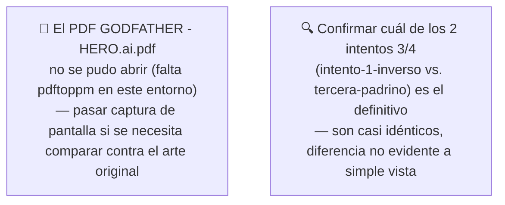
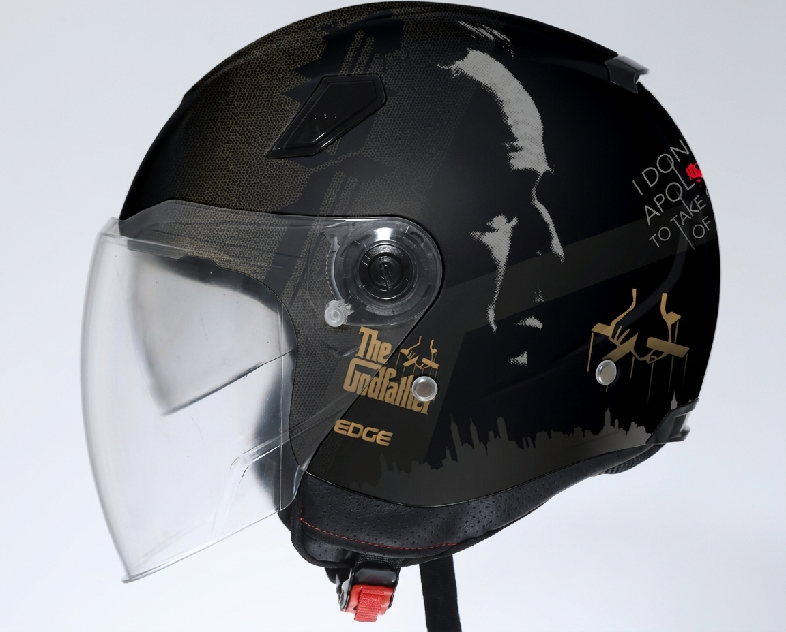
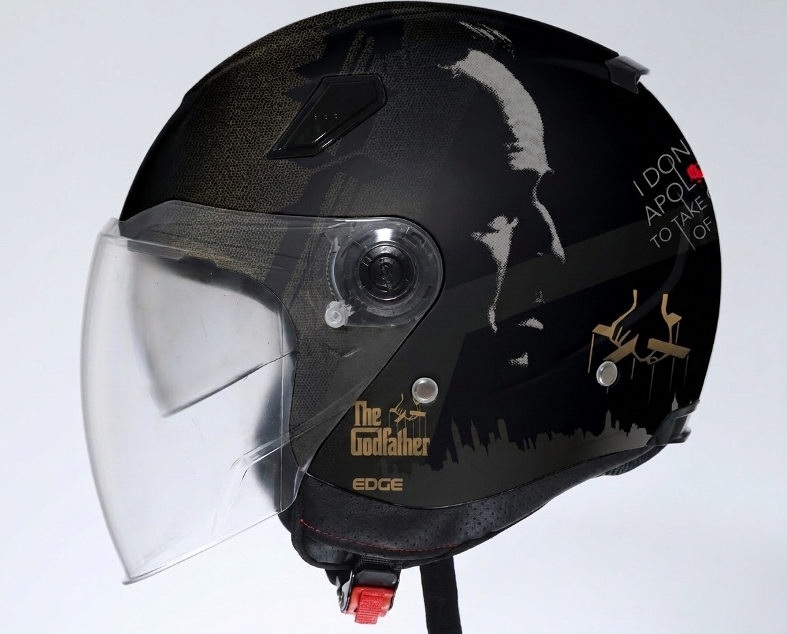
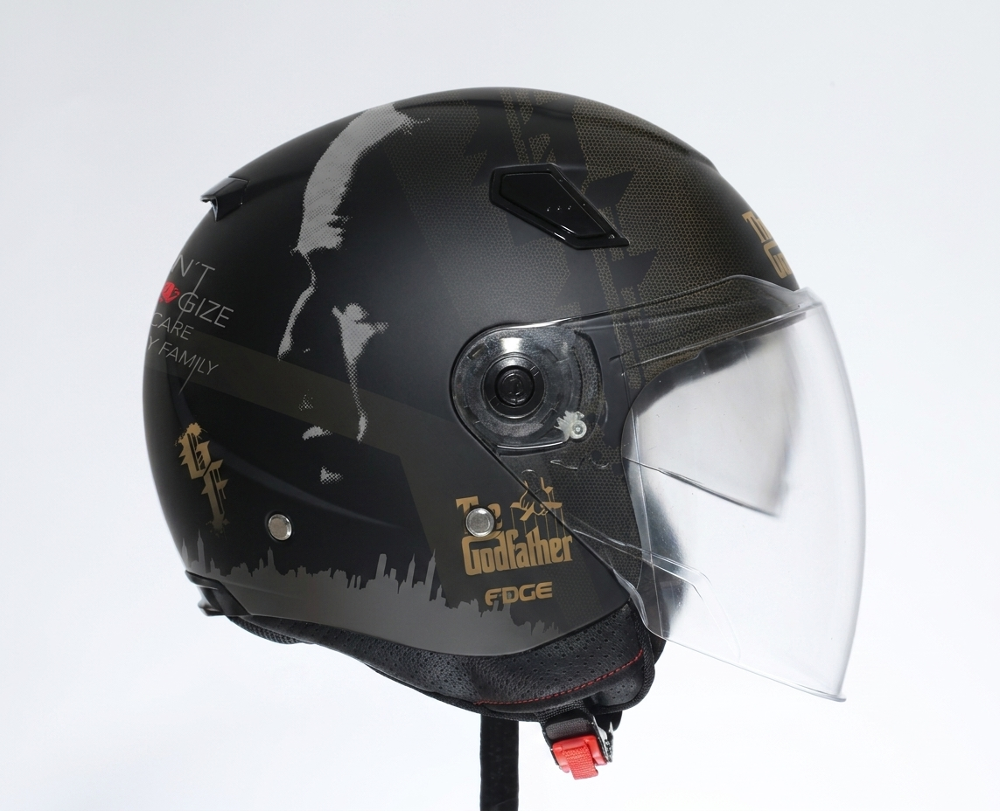
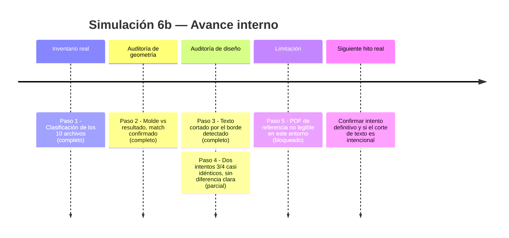
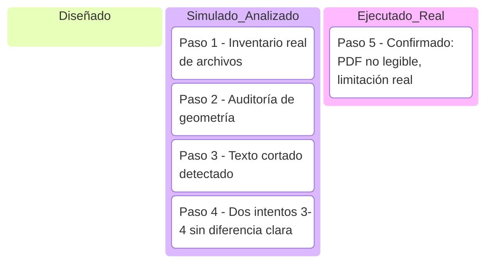

# Simulación 6b — Adaptación 2D "The Godfather / El Padrino" con Nano Banana (Etapa 1 — Ilustración)

[← Volver al índice de mis pruebas](../mis-pruebas-claude-code.md) · [← Volver a Simulación 6](simulacion-6-NANO BANANA.md)

Caso concreto: mismo molde de casco EDGE (abierto/jet) con diseño tipo poster de "The Godfather" (silueta de Vito Corleone en escala de grises/dorado, tipografía "The Godfather", frases icónicas de la película) aplicado por capas sobre la geometría real.

### 🔴 Pendiente de tu parte

Pasos de la simulación

**Paso 1 — Inventario real de archivos (ejecutado, carpeta leída completa)**
Carpeta: `Adaptacion God Father` — 10 archivos (varios compartidos con la carpeta Bob Esponja, mismo molde reutilizado).

| Archivo | Rol identificado |
|---|---|
| `ROTATE PADRINO.JPG` | Molde — casco blanco liso, vista lateral |
| `WhatsApp Image 2026-07-16...jpeg` | Molde — casco blanco liso, vista frontal |
| `tarsera bob.jpeg` | Molde — casco blanco liso, vista trasera |
| `9HEnaD9u.jpeg` | Molde — casco blanco liso, vista 3/4 |
| `vista lateral hero.jpeg` | Molde — casco blanco liso, vista lateral (duplicado de referencia) |
| `segundo god father.jpg` | Resultado — vista lateral con diseño aplicado |
| `tercera [adrino.jpg` | Resultado — vista 3/4 con diseño aplicado |
| `intento 1 inverso.jpg` | Resultado — vista 3/4, variante/intento alternativo |
| `invertid uemro 2.jpg` | Resultado — vista 3/4, casi idéntica a `tercera [adrino.jpg` |
| `GODFATHER - HERO.ai.pdf` | Arte de referencia original — **no se pudo abrir** (falta `pdftoppm` en este entorno, y el archivo es más pesado, ~50MB) |

**Paso 2 — Auditoría de geometría: molde vs. resultado**
Comparando el molde blanco (lateral) contra el resultado lateral (`segundo god father.jpg`):
- ✅ Visor: misma forma y mecanismo de pivote circular en igual posición
- ✅ Ventilación superior: mismo diseño y ubicación
- ✅ Remache visible cerca del visor: en la misma posición
- ✅ Correa con hebilla roja: idéntica
- ✅ Silueta general: sin deformación — confirma patrón aditivo (color/gráfico sobre geometría fija), igual que en el caso Bob Esponja

**Paso 3 — Auditoría del diseño: texto legible pero cortado**
En las vistas laterales, la frase "I DON'T APOLOGIZE... TO TAKE CARE OF MY FAMILY" aparece **cortada por el borde del casco** en varias tomas (se lee "I DON...GIZE...CARE...Y FAMILY" en fragmentos según el ángulo) — esto es evidente en la comparación directa, no una suposición. Es un hallazgo real de auditoría: el texto largo no está pensado para leerse completo desde un solo ángulo, lo cual puede ser intencional (se lee completo dando la vuelta al casco) o un defecto de composición — no se puede afirmar cuál sin que el usuario lo confirme.

**Paso 4 — Dos intentos casi idénticos sin diferencia clara**
`tercera [adrino.jpg` e `intento 1 inverso.jpg` muestran el mismo ángulo 3/4, mismo diseño, sin diferencia visualmente evidente en esta revisión — igual que pasó con las 2 traseras de Bob Esponja. Patrón repetido: el usuario genera variantes casi gemelas y hay que decidir cuál es la buena — recomendaría, para los próximos casos, nombrar los archivos con la palabra "FINAL" o "DESCARTAR" explícita en el momento de generarlos, para no depender de comparación visual después.

**Paso 5 — Limitación: no hay comparación contra el arte original**
Igual que en Bob Esponja, no se pudo abrir el PDF de referencia por falta de herramienta de renderizado. La fidelidad del diseño final contra el póster original de la película no está verificada.

Comparación visual (molde vs. resultado)

| Vista | Molde (real) | Resultado (generado) |
|---|---|---|
| Lateral |  |  |
| 3/4 — intento A | — |  |
| 3/4 — intento B | — |  |

Línea de tiempo interna (Mermaid)

Kanban de progreso (Mermaid)

Checklist de respaldo:
- [x] Paso 1 — Inventario real de los 10 archivos
- [x] Paso 2 — Auditoría de geometría (match confirmado)
- [x] Paso 3 — Detectado: texto de la frase icónica se corta por el borde en algunas vistas
- [x] Paso 4 — Comparación de los 2 intentos 3/4 (sin diferencia clara)
- [x] Paso 5 — Confirmada limitación: PDF no renderizable en este entorno
- [ ] Confirmar cuál intento 3/4 es el definitivo
- [ ] Comparar resultado final contra el póster original del PDF

🧪 **SIMULACIÓN — geometría validada por auditoría real (molde vs. resultado coinciden). Se detectó un hallazgo real de composición (texto cortado por el borde) que requiere tu confirmación de si es intencional. Fidelidad contra el arte original sin verificar por la limitación del PDF.**
