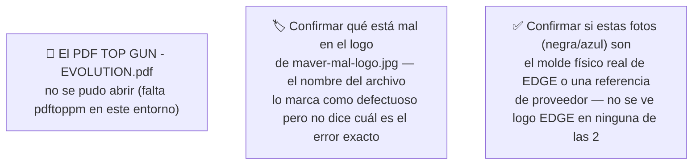
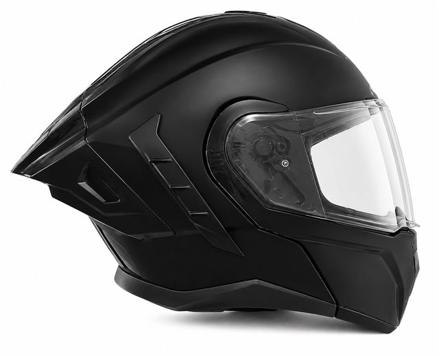
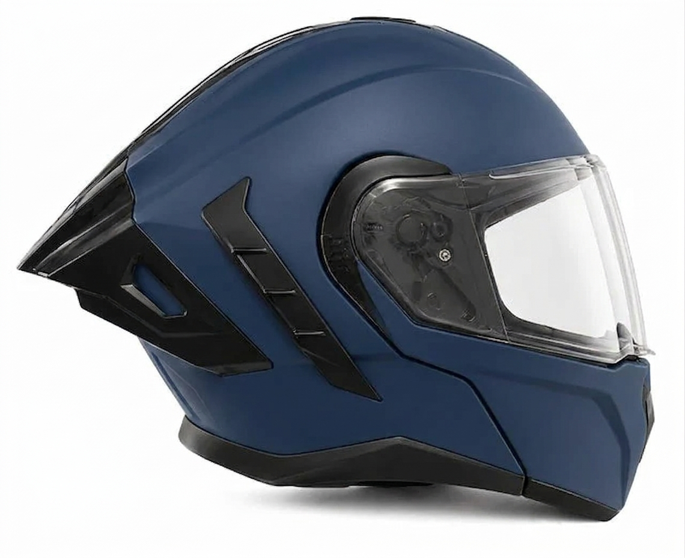
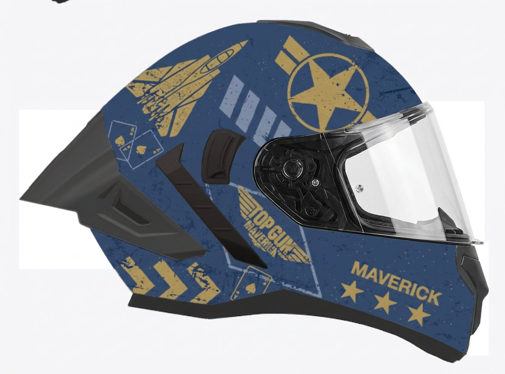
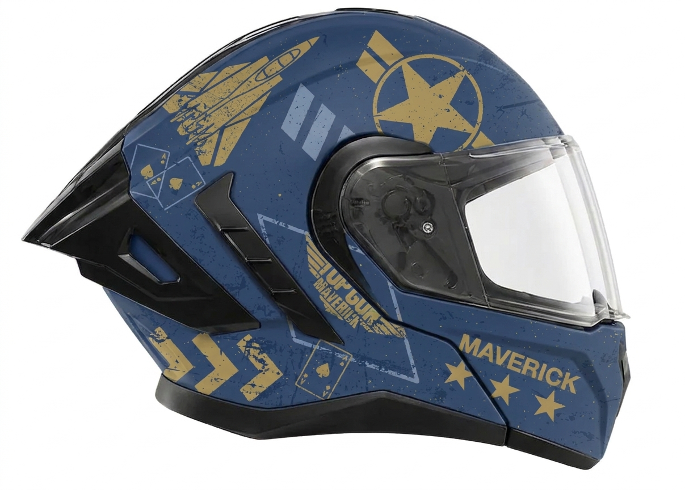
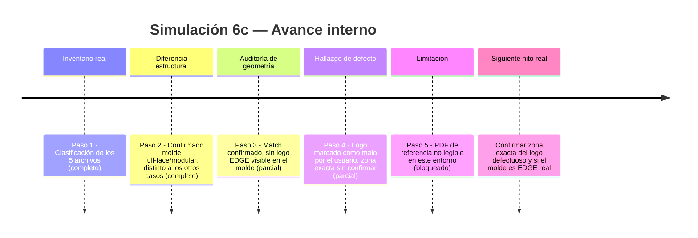
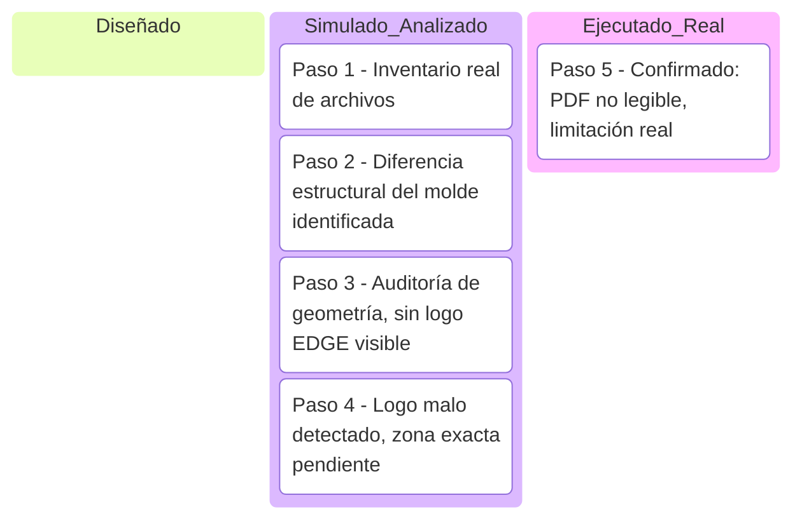

# Simulación 6c — Adaptación 2D "Top Gun: Maverick" con Nano Banana (Etapa 1 — Ilustración)

[← Volver al índice de mis pruebas](../mis-pruebas-claude-code.md) · [← Volver a Simulación 6](simulacion-6-NANO BANANA.md)

Caso concreto y distinto a los anteriores: este NO es el mismo molde abierto/jet usado en Bob Esponja y Padrino — es un **casco modular/full-face** (mentonera integrada, pico frontal, spoiler trasero puntiagudo), con diseño temático "Top Gun: Maverick" (avión, estrella militar, naipes, texto "MAVERICK").

### 🔴 Pendiente de tu parte

Pasos de la simulación

**Paso 1 — Inventario real de archivos (ejecutado, carpeta leída completa)**
Carpeta: `Adaptacion top gun evolution` — 5 archivos, ninguno compartido con las carpetas anteriores (molde distinto).

| Archivo | Rol identificado |
|---|---|
| `evolution casoco.png` | Molde — casco negro mate liso, vista lateral |
| `download - 2026-07-18T125401.108.jpg` | Molde — mismo casco en azul mate liso, vista lateral (posible referencia de color alternativa) |
| `evolution intent 1.jpg` | Resultado — diseño Top Gun aplicado sobre base azul |
| `maver mal logo.jpg` | Resultado — variante casi idéntica a la anterior, **nombrada explícitamente por el usuario como "logo malo"** |
| `TOP GUN - EVOLUTION.pdf` | Arte de referencia original — **no se pudo abrir** (falta `pdftoppm` en este entorno) |

**Paso 2 — Diferencia estructural importante con los casos anteriores**
Este molde es un casco **full-face/modular** (mentonera cerrada integrada al casco, pico/visera frontal tipo motocross, spoiler trasero puntiagudo grande) — geometría completamente distinta al casco abierto/jet de Bob Esponja y Padrino. No se debe reutilizar ningún criterio de auditoría de "visor + correa + remaches" de los otros casos sin adaptarlo a esta geometría.

**Paso 3 — Auditoría de geometría: molde vs. resultado**
Comparando el molde negro/azul contra el resultado con diseño:
- ✅ Silueta general (pico frontal, spoiler trasero, mentonera): consistente entre molde y resultado
- ✅ Ranuras de ventilación laterales: mismo patrón y conteo
- ✅ Mecanismo de visor doble (visor externo + visor interno oscuro, visible en el molde negro): presente también en el resultado
- ⚠️ No se puede confirmar con certeza si el molde es el casco físico real de EDGE o una foto de referencia de catálogo de proveedor — **ninguna de las 2 fotos de molde muestra el logo/escudo EDGE** que sí aparecía claramente en la trasera del caso Bob Esponja. Esto es una diferencia real detectada, no una suposición.

**Paso 4 — Hallazgo explícito: "logo malo"**
El propio nombre de archivo `maver mal logo.jpg` es una anotación del usuario marcando un defecto conocido. Comparando esta imagen contra `evolution intent 1.jpg`, ambas muestran el mismo diseño general (avión, estrella, "TOP GUN MAVERICK", naipes, "MAVERICK" en letras grandes) sin que se identifique a simple vista cuál elemento específico del logo está mal — se necesita que el usuario señale la zona exacta del defecto para poder documentarlo con precisión en vez de adivinar.

**Paso 5 — Limitación: no hay comparación contra el arte original**
Igual que en los casos anteriores, no se pudo abrir el PDF de referencia por falta de herramienta de renderizado — no se puede confirmar fidelidad del diseño final contra el arte original de "Top Gun: Maverick".

Comparación visual (molde vs. resultado)

| Vista | Molde (negro) | Molde (azul) | Resultado |
|---|---|---|---|
| Lateral |  |  |  |
| Lateral (variante con logo marcado como malo) | — | — |  |

Línea de tiempo interna (Mermaid)

Kanban de progreso (Mermaid)

Checklist de respaldo:
- [x] Paso 1 — Inventario real de los 5 archivos
- [x] Paso 2 — Confirmado: molde distinto (full-face/modular, no el jet abierto de los otros casos)
- [x] Paso 3 — Auditoría de geometría (match confirmado, sin logo EDGE visible en el molde)
- [x] Paso 4 — Detectado hallazgo "logo malo" por nombre de archivo, zona exacta sin confirmar
- [x] Paso 5 — Confirmada limitación: PDF no renderizable en este entorno
- [ ] Confirmar si el molde es el casco físico real de EDGE o referencia de proveedor
- [ ] Confirmar zona exacta del defecto de logo

🧪 **SIMULACIÓN — geometría validada por auditoría real (molde vs. resultado coinciden en silueta y ventilación), pero con 2 preguntas abiertas específicas de este caso: origen real del molde (sin logo EDGE visible) y ubicación exacta del defecto de logo ya señalado por el usuario.**
