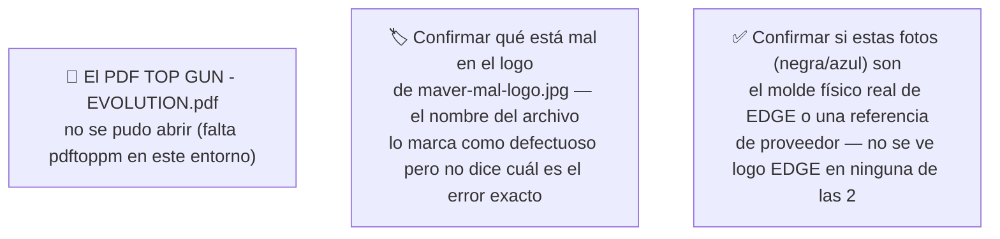
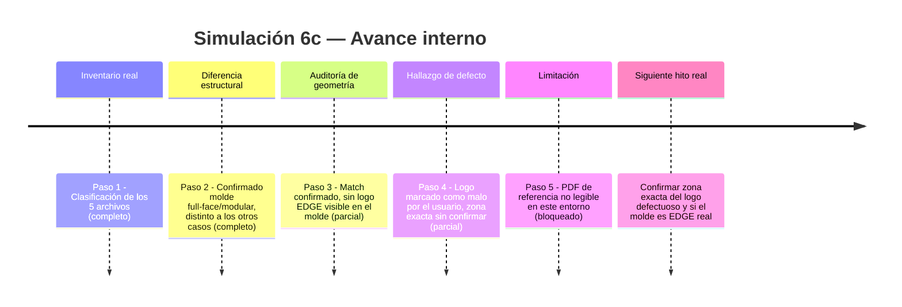
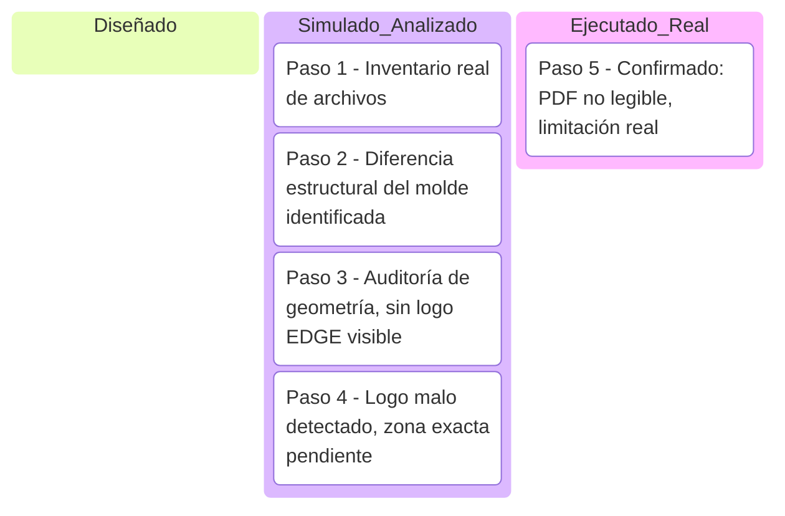

# Simulación 6c — Adaptación 2D "Top Gun: Maverick" con Nano Banana (Etapa 1 — Ilustración)

[← Volver al índice de mis pruebas](../mis-pruebas-claude-code.md) · [← Volver a Simulación 6](simulacion-6-NANO BANANA.md)

Caso concreto y distinto a los anteriores: este NO es el mismo molde abierto/jet usado en Bob Esponja y Padrino — es un **casco modular/full-face** (mentonera integrada, pico frontal, spoiler trasero puntiagudo), con diseño temático "Top Gun: Maverick" (avión, estrella militar, naipes, texto "MAVERICK").

### 🔴 Pendiente de tu parte


```mermaid
flowchart TD
    T1["📄 El PDF TOP GUN - EVOLUTION.pdf<br/>no se pudo abrir (falta pdftoppm en este entorno)"]
    T2["🏷️ Confirmar qué está mal en el logo<br/>de maver-mal-logo.jpg — el nombre del archivo<br/>lo marca como defectuoso pero no dice cuál es el error exacto"]
    T3["✅ Confirmar si estas fotos (negra/azul) son<br/>el molde físico real de EDGE o una referencia<br/>de proveedor — no se ve logo EDGE en ninguna de las 2"]
```

<details><summary>Pasos de la simulación</summary>

**Paso 1 — Inventario real de archivos (ejecutado, carpeta leída completa)**
Carpeta: `Adaptacion top gun evolution` — 5 archivos, ninguno compartido con las carpetas anteriores (molde distinto).

| Archivo | Rol identificado |
|---|---|
| `evolution casoco.png` | Molde — casco negro mate liso, vista lateral |
| `download - 2026-07-18T125401.108.jpg` | Molde — mismo casco en azul mate liso, vista lateral (posible referencia de color alternativa) |
| `evolution intent 1.jpg` | Resultado — diseño Top Gun aplicado sobre base azul |
| `maver mal logo.jpg` | Resultado — variante casi idéntica a la anterior, **nombrada explícitamente por el usuario como "logo malo"** |
| `TOP GUN - EVOLUTION.pdf` | Arte de referencia original — **no se pudo abrir** (falta `pdftoppm` en este entorno) |

**Paso 2 — Diferencia estructural importante con los casos anteriores**
Este molde es un casco **full-face/modular** (mentonera cerrada integrada al casco, pico/visera frontal tipo motocross, spoiler trasero puntiagudo grande) — geometría completamente distinta al casco abierto/jet de Bob Esponja y Padrino. No se debe reutilizar ningún criterio de auditoría de "visor + correa + remaches" de los otros casos sin adaptarlo a esta geometría.

**Paso 3 — Auditoría de geometría: molde vs. resultado**
Comparando el molde negro/azul contra el resultado con diseño:
- ✅ Silueta general (pico frontal, spoiler trasero, mentonera): consistente entre molde y resultado
- ✅ Ranuras de ventilación laterales: mismo patrón y conteo
- ✅ Mecanismo de visor doble (visor externo + visor interno oscuro, visible en el molde negro): presente también en el resultado
- ⚠️ No se puede confirmar con certeza si el molde es el casco físico real de EDGE o una foto de referencia de catálogo de proveedor — **ninguna de las 2 fotos de molde muestra el logo/escudo EDGE** que sí aparecía claramente en la trasera del caso Bob Esponja. Esto es una diferencia real detectada, no una suposición.

**Paso 4 — Hallazgo explícito: "logo malo"**
El propio nombre de archivo `maver mal logo.jpg` es una anotación del usuario marcando un defecto conocido. Comparando esta imagen contra `evolution intent 1.jpg`, ambas muestran el mismo diseño general (avión, estrella, "TOP GUN MAVERICK", naipes, "MAVERICK" en letras grandes) sin que se identifique a simple vista cuál elemento específico del logo está mal — se necesita que el usuario señale la zona exacta del defecto para poder documentarlo con precisión en vez de adivinar.

**Paso 5 — Limitación: no hay comparación contra el arte original**
Igual que en los casos anteriores, no se pudo abrir el PDF de referencia por falta de herramienta de renderizado — no se puede confirmar fidelidad del diseño final contra el arte original de "Top Gun: Maverick".

</details>

<details><summary>Comparación por vista — foto real / foto adaptada / ilustración del PDF</summary>

<details><summary>Vista lateral — molde negro vs. resultado</summary>

| Foto real (molde negro) | Foto adaptada (resultado) | Ilustración del PDF |
|---|---|---|
|  |  | ⏳ Pendiente — PDF no legible en este entorno |

**Aciertos:**
- Silueta general (pico frontal, spoiler trasero, mentonera) y ranuras de ventilación consistentes entre molde y resultado
- Visor doble (externo + interno oscuro) presente en ambos

**Fallas:**
- El molde no muestra logo/escudo EDGE en ningún ángulo — no se puede confirmar si es el casco físico real de EDGE o una foto de catálogo de proveedor
- Sin PDF no se puede auditar fidelidad del diseño (avión, estrella, naipes) contra el arte original

</details>

<details><summary>Vista lateral — molde azul vs. resultado con logo marcado como malo</summary>

| Foto real (molde azul) | Foto adaptada — "logo malo" | Ilustración del PDF |
|---|---|---|
|  |  | ⏳ Pendiente — PDF no legible en este entorno |

**Aciertos:**
- Misma geometría que el molde negro — confirma que negro y azul son el mismo casco, solo cambia el color base
- Texto "MAVERICK" y las 3 estrellas se leen con claridad

**Fallas:**
- El propio usuario ya marcó esta imagen como defectuosa en el logo, pero comparándola contra el otro resultado no se identifica a simple vista cuál elemento específico está mal — falta que el usuario señale la zona exacta
- Sin PDF no se puede comparar contra el logo original de referencia para aislar el error

</details>

</details>

<details><summary>Línea de tiempo interna (Mermaid)</summary>


```mermaid
timeline
    title Simulación 6c — Avance interno
    Inventario real : Paso 1 - Clasificación de los 5 archivos (completo)
    Diferencia estructural : Paso 2 - Confirmado molde full-face/modular, distinto a los otros casos (completo)
    Auditoría de geometría : Paso 3 - Match confirmado, sin logo EDGE visible en el molde (parcial)
    Hallazgo de defecto : Paso 4 - Logo marcado como malo por el usuario, zona exacta sin confirmar (parcial)
    Limitación : Paso 5 - PDF de referencia no legible en este entorno (bloqueado)
    Siguiente hito real : Confirmar zona exacta del logo defectuoso y si el molde es EDGE real
```

</details>

<details><summary>Kanban de progreso (Mermaid)</summary>


```mermaid
kanban
  Diseñado
  Simulado_Analizado
    Paso1[Paso 1 - Inventario real de archivos]
    Paso2[Paso 2 - Diferencia estructural del molde identificada]
    Paso3[Paso 3 - Auditoría de geometría, sin logo EDGE visible]
    Paso4[Paso 4 - Logo malo detectado, zona exacta pendiente]
  Ejecutado_Real
    Paso5[Paso 5 - Confirmado: PDF no legible, limitación real]
```

Checklist de respaldo:
- [x] Paso 1 — Inventario real de los 5 archivos
- [x] Paso 2 — Confirmado: molde distinto (full-face/modular, no el jet abierto de los otros casos)
- [x] Paso 3 — Auditoría de geometría (match confirmado, sin logo EDGE visible en el molde)
- [x] Paso 4 — Detectado hallazgo "logo malo" por nombre de archivo, zona exacta sin confirmar
- [x] Paso 5 — Confirmada limitación: PDF no renderizable en este entorno
- [ ] Confirmar si el molde es el casco físico real de EDGE o referencia de proveedor
- [ ] Confirmar zona exacta del defecto de logo

</details>

🧪 **SIMULACIÓN — geometría validada por auditoría real (molde vs. resultado coinciden en silueta y ventilación), pero con 2 preguntas abiertas específicas de este caso: origen real del molde (sin logo EDGE visible) y ubicación exacta del defecto de logo ya señalado por el usuario.**

---

## Prompt de transferencia de diseño — molde azul real + arte "Top Gun: Maverick" (primer caso de la línea de licencias de marca)

Este es el primer caso concreto de la nueva línea **"Licencias de marca"** (Marvel, DC, Paramount, etc. — el usuario confirmó que tiene licencias pagas con estas marcas y que el flujo de trabajo es siempre el mismo: tomar un molde de casco real y adaptarle un diseño). Se reutiliza el molde azul de este mismo caso (`download - 2026-07-18T125401.108.jpg`, ya identificado arriba como "molde azul").

**Punto de partida distinto al de los resultados anteriores de este archivo:** el arte de referencia (avión, escudo de estrella, naipes, "TOP GUN MAVERICK", "MAVERICK", 3 estrellas, todo en dorado envejecido/desgastado sobre azul) fue diseñado originalmente sobre **otro molde de casco**, con una mentonera y un spoiler trasero de forma distinta a la de este molde azul. Pedido explícito del usuario: el diseño se adapta al molde azul real, **sin alterar en nada la geometría del molde azul** — no se reproduce la forma del casco del arte de referencia, solo su diseño gráfico 2D.

<details><summary>Prompt — Top Gun: Maverick sobre molde azul (Tipo A, geometría intacta)</summary>

```
Genera una imagen de producto del mismo casco azul mate de la
referencia adjunta (molde real, vista lateral), mismo ángulo, encuadre
y fondo blanco.

CRÍTICO — GEOMETRÍA INTACTA, CERO CAMBIOS: no modifiques absolutamente
ningún componente físico del casco azul — mismo pico frontal
puntiagudo, mismas ranuras de ventilación laterales tipo cuchilla
(mismo conteo y forma), misma mentonera integrada, mismo mecanismo de
pivote visible junto al visor, mismo spoiler/borde trasero, misma
silueta general, mismo visor transparente. Es el mismo objeto 3D
exacto — SOLO se le agrega una gráfica 2D encima de la superficie
azul, como una calcomanía/pintura aplicada al molde, nunca cambiando
su forma.

DISEÑO A TRANSFERIR (tomado de la segunda imagen de referencia, que
está aplicado sobre OTRO casco de forma distinta — no copies la forma
de ese otro casco, solo su arte gráfico):
- Avión de combate estilizado (silueta tipo jet), ubicado en la zona
  delantera superior de la calota.
- Escudo circular con una estrella grande de 5 puntas en el centro,
  en la zona superior/central.
- Un par de naipes (ases de pique) cerca de la zona del pico frontal.
- Franjas diagonales tipo chevron repetidas en la parte inferior
  delantera.
- Logotipo "TOP GUN MAVERICK" en tipografía condensada dentro de un
  recuadro alargado, ubicado cerca de las ranuras de ventilación.
- Texto grande "MAVERICK" en la zona inferior trasera, en mayúsculas,
  fuente bold sans-serif.
- 3 estrellas de 5 puntas alineadas horizontalmente debajo del texto
  "MAVERICK".
- Paleta y acabado: todos estos elementos van en color DORADO/MOSTAZA
  envejecido con textura desgastada/grunge (bordes irregulares,
  aspecto rayado y descascarado, como pintura militar vieja), sobre
  la base azul mate del casco que se mantiene visible de fondo.

ADAPTACIÓN AL MOLDE REAL (no al molde del arte de referencia): como
este molde azul tiene ranuras de ventilación, mentonera y spoiler de
forma distinta a los del casco donde se diseñó originalmente el arte,
reposicioná y escalá cada elemento gráfico para que respete los
límites reales de los paneles de ESTE casco — ningún elemento del
diseño debe quedar cortado de forma rara ni superpuesto de manera
ilógica sobre las ranuras de ventilación o el mecanismo de pivote.

PROHIBIDO ABSOLUTO: no cambiar el color ni la transparencia del
visor. No agregar logos, textos o símbolos que no estén en la lista
de arriba. No cambiar el color negro de la mentonera/ribetes ni el
azul mate de la carcasa base. No cambiar cantidad, forma o tamaño de
las ranuras de ventilación. No cambiar la silueta, el pico frontal ni
el spoiler trasero del molde azul real.
```

</details>

**Estado:** 🔴 pendiente de generar.

**Qué hay que hacer:**
1. Correr el prompt (en sesión aislada, ver hallazgo de contaminación cruzada de este mismo catálogo) y mandar el resultado para auditoría.
2. Confirmar si este molde azul es el casco físico real de la marca licenciante o solo una referencia — sigue siendo la misma pregunta abierta de este caso (ver pendientes arriba).
3. Subir las 2 imágenes de referencia (molde azul + arte Top Gun) como adjuntos para versionarlas.
4. Cuando el usuario mande el primer caso de Marvel/DC/Paramount, crear el archivo de caso correspondiente siguiendo esta misma estructura (Tipo A — transferencia de diseño 2D sobre molde real, geometría intacta) y sumarlo al índice maestro de prompts.

---

**Última actualización:** 2026-07-28 · primer prompt de la nueva línea de licencias de marca (Marvel/DC/Paramount), armado directo sobre el molde azul ya documentado en este caso, a pedido de velocidad del usuario.
