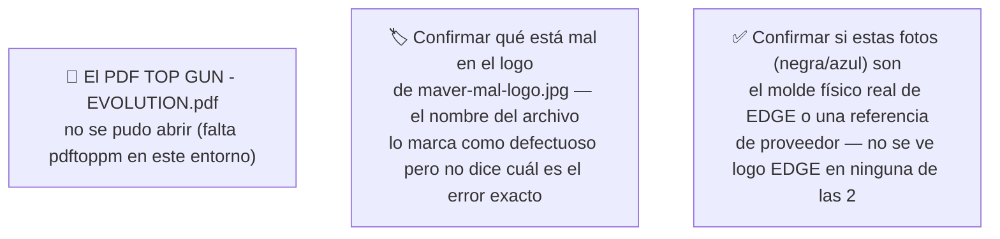
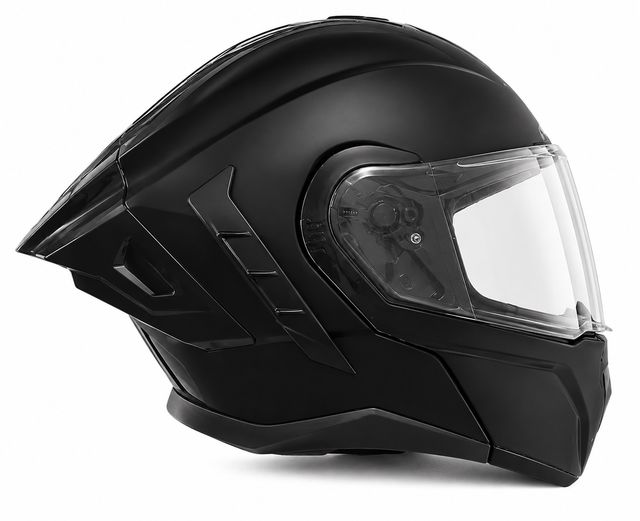
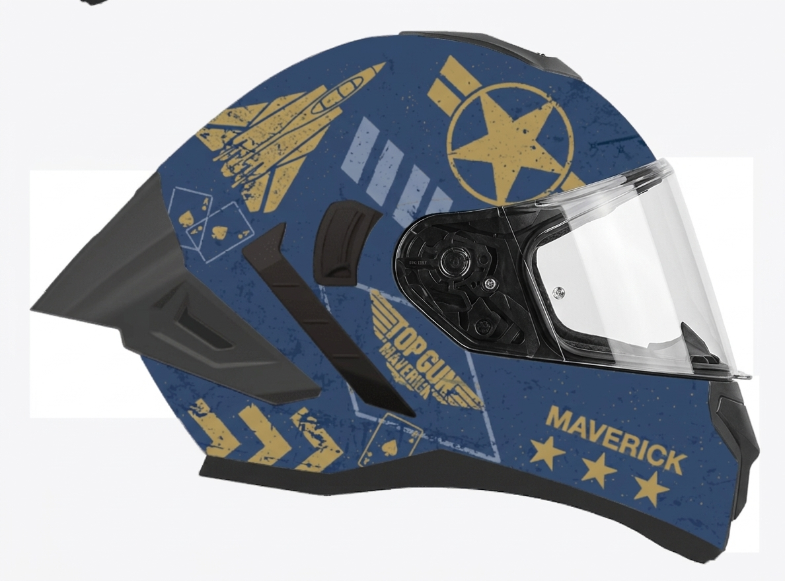
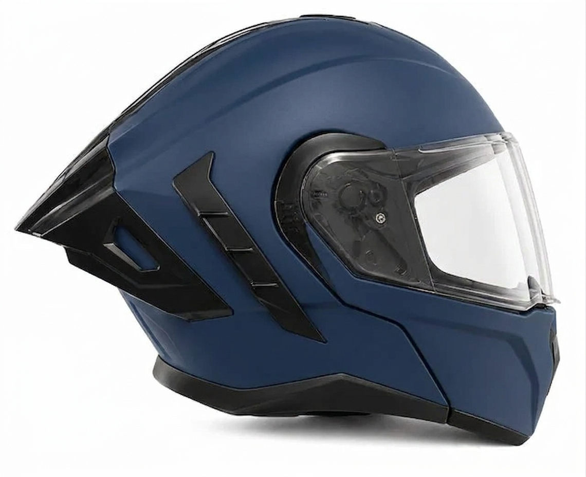
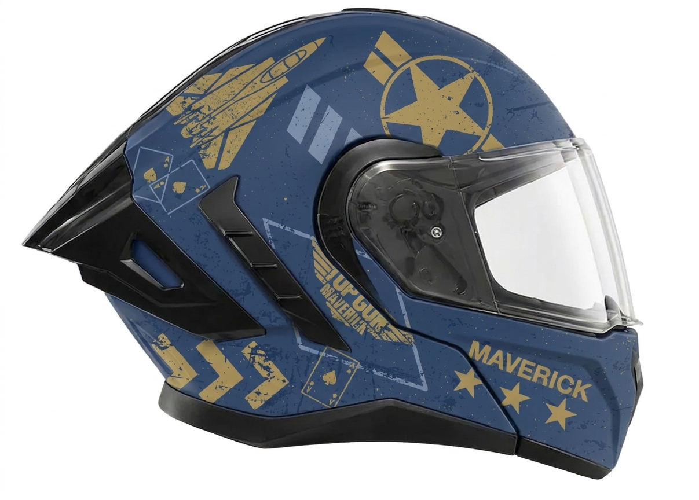
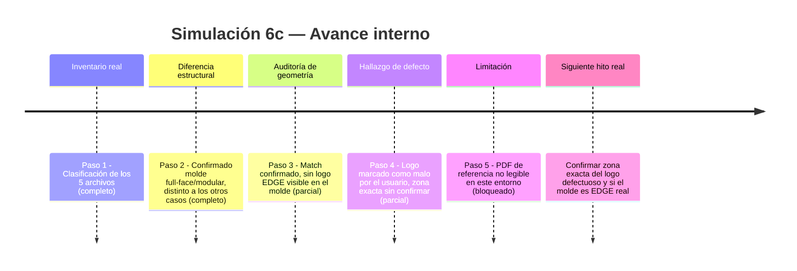
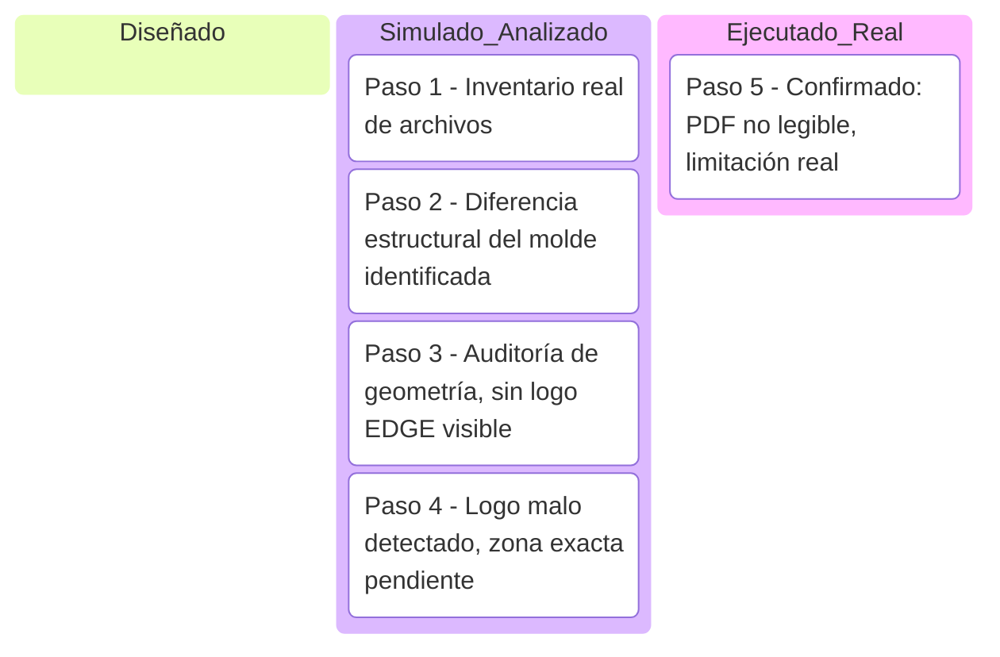

# Simulación 6c — Adaptación 2D "Top Gun: Maverick" con Nano Banana (Etapa 1 — Ilustración)

[← Volver al índice de mis pruebas](../mis-pruebas-claude-code.md) · [← Volver a Simulación 6](simulacion-6-NANO BANANA.md)

Caso concreto y distinto a los anteriores: este NO es el mismo molde abierto/jet usado en Bob Esponja y Padrino — es un **casco modular/full-face** (mentonera integrada, pico frontal, spoiler trasero puntiagudo), con diseño temático "Top Gun: Maverick" (avión, estrella militar, naipes, texto "MAVERICK").

### 🔴 Pendiente de tu parte


```mermaid
flowchart TD
    T1["📄 El PDF TOP GUN - EVOLUTION.pdf<br/>no se pudo abrir (falta pdftoppm en este entorno)"]
    T2["🏷️ Confirmar qué está mal en el logo<br/>de maver-mal-logo.jpg — el nombre del archivo<br/>lo marca como defectuoso pero no dice cuál es el error exacto"]
    T3["✅ Confirmar si estas fotos (negra/azul) son<br/>el molde físico real de EDGE o una referencia<br/>de proveedor — no se ve logo EDGE en ninguna de las 2"]
```

<details><summary>Pasos de la simulación</summary>

**Paso 1 — Inventario real de archivos (ejecutado, carpeta leída completa)**
Carpeta: `Adaptacion top gun evolution` — 5 archivos, ninguno compartido con las carpetas anteriores (molde distinto).

| Archivo | Rol identificado |
|---|---|
| `evolution casoco.png` | Molde — casco negro mate liso, vista lateral |
| `download - 2026-07-18T125401.108.jpg` | Molde — mismo casco en azul mate liso, vista lateral (posible referencia de color alternativa) |
| `evolution intent 1.jpg` | Resultado — diseño Top Gun aplicado sobre base azul |
| `maver mal logo.jpg` | Resultado — variante casi idéntica a la anterior, **nombrada explícitamente por el usuario como "logo malo"** |
| `TOP GUN - EVOLUTION.pdf` | Arte de referencia original — **no se pudo abrir** (falta `pdftoppm` en este entorno) |

**Paso 2 — Diferencia estructural importante con los casos anteriores**
Este molde es un casco **full-face/modular** (mentonera cerrada integrada al casco, pico/visera frontal tipo motocross, spoiler trasero puntiagudo grande) — geometría completamente distinta al casco abierto/jet de Bob Esponja y Padrino. No se debe reutilizar ningún criterio de auditoría de "visor + correa + remaches" de los otros casos sin adaptarlo a esta geometría.

**Paso 3 — Auditoría de geometría: molde vs. resultado**
Comparando el molde negro/azul contra el resultado con diseño:
- ✅ Silueta general (pico frontal, spoiler trasero, mentonera): consistente entre molde y resultado
- ✅ Ranuras de ventilación laterales: mismo patrón y conteo
- ✅ Mecanismo de visor doble (visor externo + visor interno oscuro, visible en el molde negro): presente también en el resultado
- ⚠️ No se puede confirmar con certeza si el molde es el casco físico real de EDGE o una foto de referencia de catálogo de proveedor — **ninguna de las 2 fotos de molde muestra el logo/escudo EDGE** que sí aparecía claramente en la trasera del caso Bob Esponja. Esto es una diferencia real detectada, no una suposición.

**Paso 4 — Hallazgo explícito: "logo malo"**
El propio nombre de archivo `maver mal logo.jpg` es una anotación del usuario marcando un defecto conocido. Comparando esta imagen contra `evolution intent 1.jpg`, ambas muestran el mismo diseño general (avión, estrella, "TOP GUN MAVERICK", naipes, "MAVERICK" en letras grandes) sin que se identifique a simple vista cuál elemento específico del logo está mal — se necesita que el usuario señale la zona exacta del defecto para poder documentarlo con precisión en vez de adivinar.

**Paso 5 — Limitación: no hay comparación contra el arte original**
Igual que en los casos anteriores, no se pudo abrir el PDF de referencia por falta de herramienta de renderizado — no se puede confirmar fidelidad del diseño final contra el arte original de "Top Gun: Maverick".

</details>

<details><summary>Comparación por vista — foto real / foto adaptada / ilustración del PDF</summary>

<details><summary>Vista lateral — molde negro vs. resultado</summary>

| Foto real (molde negro) | Foto adaptada (resultado) | Ilustración del PDF |
|---|---|---|
|  |  | ⏳ Pendiente — PDF no legible en este entorno |

**Aciertos:**
- Silueta general (pico frontal, spoiler trasero, mentonera) y ranuras de ventilación consistentes entre molde y resultado
- Visor doble (externo + interno oscuro) presente en ambos

**Fallas:**
- El molde no muestra logo/escudo EDGE en ningún ángulo — no se puede confirmar si es el casco físico real de EDGE o una foto de catálogo de proveedor
- Sin PDF no se puede auditar fidelidad del diseño (avión, estrella, naipes) contra el arte original

</details>

<details><summary>Vista lateral — molde azul vs. resultado con logo marcado como malo</summary>

| Foto real (molde azul) | Foto adaptada — "logo malo" | Ilustración del PDF |
|---|---|---|
|  |  | ⏳ Pendiente — PDF no legible en este entorno |

**Aciertos:**
- Misma geometría que el molde negro — confirma que negro y azul son el mismo casco, solo cambia el color base
- Texto "MAVERICK" y las 3 estrellas se leen con claridad

**Fallas:**
- El propio usuario ya marcó esta imagen como defectuosa en el logo, pero comparándola contra el otro resultado no se identifica a simple vista cuál elemento específico está mal — falta que el usuario señale la zona exacta
- Sin PDF no se puede comparar contra el logo original de referencia para aislar el error

</details>

</details>

<details><summary>Línea de tiempo interna (Mermaid)</summary>


```mermaid
timeline
    title Simulación 6c — Avance interno
    Inventario real : Paso 1 - Clasificación de los 5 archivos (completo)
    Diferencia estructural : Paso 2 - Confirmado molde full-face/modular, distinto a los otros casos (completo)
    Auditoría de geometría : Paso 3 - Match confirmado, sin logo EDGE visible en el molde (parcial)
    Hallazgo de defecto : Paso 4 - Logo marcado como malo por el usuario, zona exacta sin confirmar (parcial)
    Limitación : Paso 5 - PDF de referencia no legible en este entorno (bloqueado)
    Siguiente hito real : Confirmar zona exacta del logo defectuoso y si el molde es EDGE real
```

</details>

<details><summary>Kanban de progreso (Mermaid)</summary>


```mermaid
kanban
  Diseñado
  Simulado_Analizado
    Paso1[Paso 1 - Inventario real de archivos]
    Paso2[Paso 2 - Diferencia estructural del molde identificada]
    Paso3[Paso 3 - Auditoría de geometría, sin logo EDGE visible]
    Paso4[Paso 4 - Logo malo detectado, zona exacta pendiente]
  Ejecutado_Real
    Paso5[Paso 5 - Confirmado: PDF no legible, limitación real]
```

Checklist de respaldo:
- [x] Paso 1 — Inventario real de los 5 archivos
- [x] Paso 2 — Confirmado: molde distinto (full-face/modular, no el jet abierto de los otros casos)
- [x] Paso 3 — Auditoría de geometría (match confirmado, sin logo EDGE visible en el molde)
- [x] Paso 4 — Detectado hallazgo "logo malo" por nombre de archivo, zona exacta sin confirmar
- [x] Paso 5 — Confirmada limitación: PDF no renderizable en este entorno
- [ ] Confirmar si el molde es el casco físico real de EDGE o referencia de proveedor
- [ ] Confirmar zona exacta del defecto de logo

</details>

🧪 **SIMULACIÓN — geometría validada por auditoría real (molde vs. resultado coinciden en silueta y ventilación), pero con 2 preguntas abiertas específicas de este caso: origen real del molde (sin logo EDGE visible) y ubicación exacta del defecto de logo ya señalado por el usuario.**

---

## Prompt de transferencia de diseño — molde azul real + arte "Top Gun: Maverick" (primer caso de la línea de licencias de marca)

Este es el primer caso concreto de la nueva línea **"Licencias de marca"** (Marvel, DC, Paramount, etc. — el usuario confirmó que tiene licencias pagas con estas marcas y que el flujo de trabajo es siempre el mismo: tomar un molde de casco real y adaptarle un diseño). Se reutiliza el molde azul de este mismo caso (`download - 2026-07-18T125401.108.jpg`, ya identificado arriba como "molde azul").

**Punto de partida distinto al de los resultados anteriores de este archivo:** el arte de referencia (avión, escudo de estrella, naipes, "TOP GUN MAVERICK", "MAVERICK", 3 estrellas, todo en dorado envejecido/desgastado sobre azul) fue diseñado originalmente sobre **otro molde de casco**, con una mentonera y un spoiler trasero de forma distinta a la de este molde azul. Pedido explícito del usuario: el diseño se adapta al molde azul real, **sin alterar en nada la geometría del molde azul** — no se reproduce la forma del casco del arte de referencia, solo su diseño gráfico 2D.

<details><summary>Prompt — Top Gun: Maverick sobre molde azul (Tipo A, geometría intacta)</summary>

```
Genera una imagen de producto del mismo casco azul mate de la
referencia adjunta (molde real, vista lateral), mismo ángulo, encuadre
y fondo blanco.

CRÍTICO — GEOMETRÍA INTACTA, CERO CAMBIOS: no modifiques absolutamente
ningún componente físico del casco azul — mismo pico frontal
puntiagudo, mismas ranuras de ventilación laterales tipo cuchilla
(mismo conteo y forma), misma mentonera integrada, mismo mecanismo de
pivote visible junto al visor, mismo spoiler/borde trasero, misma
silueta general, mismo visor transparente. Es el mismo objeto 3D
exacto — SOLO se le agrega una gráfica 2D encima de la superficie
azul, como una calcomanía/pintura aplicada al molde, nunca cambiando
su forma.

DISEÑO A TRANSFERIR (tomado de la segunda imagen de referencia, que
está aplicado sobre OTRO casco de forma distinta — no copies la forma
de ese otro casco, solo su arte gráfico):
- Avión de combate estilizado (silueta tipo jet), ubicado en la zona
  delantera superior de la calota.
- Escudo circular con una estrella grande de 5 puntas en el centro,
  en la zona superior/central.
- Un par de naipes (ases de pique) cerca de la zona del pico frontal.
- Franjas diagonales tipo chevron repetidas en la parte inferior
  delantera.
- Logotipo "TOP GUN MAVERICK" en tipografía condensada dentro de un
  recuadro alargado, ubicado cerca de las ranuras de ventilación.
- Texto grande "MAVERICK" en la zona inferior trasera, en mayúsculas,
  fuente bold sans-serif.
- 3 estrellas de 5 puntas alineadas horizontalmente debajo del texto
  "MAVERICK".
- Paleta y acabado: todos estos elementos van en color DORADO/MOSTAZA
  envejecido con textura desgastada/grunge (bordes irregulares,
  aspecto rayado y descascarado, como pintura militar vieja), sobre
  la base azul mate del casco que se mantiene visible de fondo.

ADAPTACIÓN AL MOLDE REAL (no al molde del arte de referencia): como
este molde azul tiene ranuras de ventilación, mentonera y spoiler de
forma distinta a los del casco donde se diseñó originalmente el arte,
reposicioná y escalá cada elemento gráfico para que respete los
límites reales de los paneles de ESTE casco — ningún elemento del
diseño debe quedar cortado de forma rara ni superpuesto de manera
ilógica sobre las ranuras de ventilación o el mecanismo de pivote.

PROHIBIDO ABSOLUTO: no cambiar el color ni la transparencia del
visor. No agregar logos, textos o símbolos que no estén en la lista
de arriba. No cambiar el color negro de la mentonera/ribetes ni el
azul mate de la carcasa base. No cambiar cantidad, forma o tamaño de
las ranuras de ventilación. No cambiar la silueta, el pico frontal ni
el spoiler trasero del molde azul real.
```

</details>

### Intento 1 — resultado auditado

**Estado:** ⚠️ Falló — geometría base OK, pero fallas graves de contenido gráfico.

**Qué falló (auditado sobre el resultado real, incluyendo la propia nota que dio el generador al entregar la imagen):**
- **Logotipo "TOP GUN MAVERICK" omitido por completo** — el generador lo reconoció explícitamente: de los 7 elementos gráficos pedidos, este quedó afuera sin reemplazo.
- **Naipes y chevrones mal ubicados** — el propio generador admitió no haber resuelto el posicionamiento: quedaron en zonas equivocadas del casco en vez de las zonas pedidas (pico frontal / parte inferior delantera).
- **Elementos reales del casco borrados o alterados** — el usuario confirma que se perdieron/alteraron detalles físicos visibles en la foto real del molde azul (no solo se agregó el gráfico encima, se tocó geometría/textura que debía quedar intacta).
- **Paleta de color no coincide con la referencia** — el dorado/mostaza y el azul de base no respetan el tono exacto de las 2 imágenes de referencia (arte Top Gun + molde azul real).
- **Cosas colocadas donde no correspondía** — además de naipes/chevrones, aparecieron elementos en zonas no autorizadas por el prompt.

**Qué hay que hacer:** reintentar con el prompt reforzado (Intento 2, abajo), que blinda explícitamente la geometría/textura reales, obliga a incluir los 7 elementos (contándolos), fija zonas exactas por nombre de pieza física, y ancla la paleta de color a la de las imágenes de referencia.

### Intento 2 — prompt corregido con geometría blindada, logotipo obligatorio y paleta anclada

<details><summary>Prompt usado</summary>

```
Genera una imagen de producto del mismo casco azul mate de la
referencia adjunta (molde real, vista lateral), mismo ángulo, encuadre
y fondo blanco.

CRÍTICO — GEOMETRÍA Y TEXTURA 100% INTACTAS (un intento anterior falló
acá: borró/alteró detalles físicos reales del molde — no lo repitas):
- NO borres, simplifiques ni alteres NINGÚN detalle físico visible en
  la foto real del molde azul, aunque quede cubierto parcialmente por
  el diseño gráfico: pico frontal puntiagudo, cada ranura de
  ventilación lateral tipo cuchilla (mismo conteo y forma exacta),
  mentonera integrada, mecanismo de pivote junto al visor (incluida su
  pieza metálica/tornillo visible), spoiler/borde trasero, silueta
  general, visor transparente.
- El diseño gráfico se aplica COMO UNA CALCOMANÍA ENCIMA de la
  superficie real del casco — nunca reemplaza, recorta ni "limpia"
  ningún detalle físico que ya estaba en la foto original.
- Es el mismo objeto 3D exacto, sin excepciones.

DISEÑO A TRANSFERIR — EXACTAMENTE 7 ELEMENTOS, ni uno menos (un intento
anterior omitió el logotipo por completo y ubicó mal 2 elementos —
contalos antes de terminar, tienen que estar los 7):

1. Avión de combate estilizado (silueta tipo jet) — zona delantera
   SUPERIOR de la calota, cerca de la parte más alta del casco.
2. Escudo circular con estrella grande de 5 puntas — zona CENTRAL
   superior de la calota, al lado del avión.
3. Un par de naipes (ases de pique) — sobre la superficie del PICO
   FRONTAL puntiagudo (la pieza que sobresale adelante), NO en la zona
   trasera ni en el spoiler.
4. Franjas diagonales tipo chevron repetidas — sobre la MENTONERA /
   parte inferior delantera del casco (la zona baja, cerca de la boca),
   NO en la zona trasera ni sobre el spoiler.
5. Logotipo "TOP GUN MAVERICK" en tipografía condensada dentro de un
   recuadro alargado — OBLIGATORIO, ubicado junto a las ranuras de
   ventilación laterales. Este elemento NO puede faltar bajo ningún
   concepto.
6. Texto grande "MAVERICK" en mayúsculas, fuente bold sans-serif —
   zona inferior TRASERA del casco (cerca del spoiler/borde trasero).
7. 3 estrellas de 5 puntas alineadas horizontalmente — debajo del texto
   "MAVERICK", misma zona trasera inferior.

PALETA DE COLOR — ANCLADA A LAS IMÁGENES DE REFERENCIA, SIN
DESVIACIÓN (un intento anterior usó tonos distintos a los de las
referencias — no lo repitas):
- Todos los elementos gráficos (avión, escudo, naipes, chevrones,
  logotipo, texto, estrellas): EXACTAMENTE el mismo tono
  dorado/mostaza envejecido de la segunda imagen de referencia (el
  arte Top Gun) — ni más amarillo/brillante ni más oscuro/ocre que esa
  referencia. Misma textura desgastada/grunge (bordes irregulares,
  aspecto rayado y descascarado).
- La base azul mate del casco: EXACTAMENTE el mismo tono de azul de la
  PRIMERA imagen de referencia (el molde real) — no oscurecer, no
  volverlo negro-azulado, no cambiar la saturación.

ADAPTACIÓN AL MOLDE REAL: reposicioná y escalá cada elemento gráfico
para que respete los límites reales de los paneles de ESTE casco
(ranuras de ventilación, mecanismo de pivote, mentonera) — ningún
elemento debe quedar cortado de forma rara ni superpuesto de manera
ilógica sobre las ranuras de ventilación o el mecanismo de pivote.

PROHIBIDO ABSOLUTO: no cambiar el color ni la transparencia del
visor. No agregar logos, textos o símbolos que no estén en la lista
de 7 elementos de arriba. No omitir el logotipo "TOP GUN MAVERICK".
No cambiar el color negro de la mentonera/ribetes. No cambiar
cantidad, forma o tamaño de las ranuras de ventilación. No cambiar la
silueta, el pico frontal ni el spoiler trasero del molde azul real. No
borrar ni simplificar ningún detalle físico real del casco.
```

</details>

**Estado:** 🔴 pendiente de generar.

**Qué hay que hacer:**
1. Correr el prompt reforzado (en sesión aislada, ver hallazgo de contaminación cruzada de este mismo catálogo) y mandar el resultado para auditoría.
2. Confirmar si este molde azul es el casco físico real de la marca licenciante o solo una referencia — sigue siendo la misma pregunta abierta de este caso (ver pendientes arriba).
3. Subir las 2 imágenes de referencia (molde azul + arte Top Gun) como adjuntos para versionarlas.
4. Cuando el usuario mande el primer caso de Marvel/DC/Paramount, crear el archivo de caso correspondiente siguiendo esta misma estructura (Tipo A — transferencia de diseño 2D sobre molde real, geometría intacta) y sumarlo al índice maestro de prompts.

### Resultado del Intento 2 — auditado, muy cerca del objetivo

**Estado:** ✅ Gran mejora, con 1 defecto residual — el resto quedó bien.

**Qué salió bien (confirmado contra las 2 imágenes de referencia):** los 7 elementos gráficos están presentes esta vez (logotipo "TOP GUN MAVERICK" incluido, ya no se omite), las posiciones de naipes/chevrones/avión/escudo/texto "MAVERICK"/3 estrellas quedaron consistentes con el arte de referencia, no se agregó ningún elemento extra fuera de la lista, y la geometría física del molde (pico frontal, ranuras de ventilación, mentonera, spoiler, silueta) se mantuvo intacta.

**Qué falló (defecto residual, 1 solo):** el **visor** cambió de transparente/claro (como en el molde azul real y en el arte de referencia) a un visor OSCURO/ahumado, dejando ver de forma muy marcada el mecanismo interno (tornillos/engranaje del pivote) a través del cristal — en las 2 imágenes de referencia el visor es claro y no se ve tanto detalle mecánico a través de él. El prompt pedía "no cambiar el color ni la transparencia del visor", pero no bastó para evitar este desvío puntual.

### Intento 3 — mismo prompt que funcionó, con el visor blindado

<details><summary>Prompt usado</summary>

```
Genera una imagen de producto del mismo casco azul mate de la
referencia adjunta (molde real, vista lateral), mismo ángulo, encuadre
y fondo blanco.

CRÍTICO — GEOMETRÍA Y TEXTURA 100% INTACTAS: NO borres, simplifiques
ni alteres NINGÚN detalle físico visible en la foto real del molde
azul, aunque quede cubierto parcialmente por el diseño gráfico: pico
frontal puntiagudo, cada ranura de ventilación lateral tipo cuchilla
(mismo conteo y forma exacta), mentonera integrada, mecanismo de
pivote junto al visor, spoiler/borde trasero, silueta general. El
diseño gráfico se aplica COMO UNA CALCOMANÍA ENCIMA de la superficie
real del casco — nunca reemplaza, recorta ni "limpia" ningún detalle
físico que ya estaba en la foto original. Es el mismo objeto 3D
exacto, sin excepciones.

CRÍTICO — VISOR: EXACTAMENTE igual de CLARO Y TRANSPARENTE que en la
foto real del molde azul (un intento anterior lo oscureció/ahumó y
dejó ver de forma muy marcada el mecanismo interno del pivote a través
del cristal — no lo repitas). El visor debe quedar tan claro y
transparente como en la referencia, sin tinte oscuro ni efecto ahumado,
y sin resaltar el mecanismo interno más de lo que se ve en la foto
real del molde. El diseño gráfico NO va sobre el visor, solo sobre la
carcasa.

DISEÑO A TRANSFERIR — EXACTAMENTE 7 ELEMENTOS, mantené las mismas
posiciones que lograste en el intento anterior (funcionaron bien, no
las cambies):

1. Avión de combate estilizado (silueta tipo jet) — zona delantera
   SUPERIOR de la calota, cerca de la parte más alta del casco.
2. Escudo circular con estrella grande de 5 puntas — zona CENTRAL
   superior de la calota, al lado del avión.
3. Un par de naipes (ases de pique) — sobre la superficie del PICO
   FRONTAL puntiagudo.
4. Franjas diagonales tipo chevron repetidas — sobre la MENTONERA /
   parte inferior delantera del casco.
5. Logotipo "TOP GUN MAVERICK" en tipografía condensada dentro de un
   recuadro alargado — junto a las ranuras de ventilación laterales.
   Este elemento NO puede faltar bajo ningún concepto.
6. Texto grande "MAVERICK" en mayúsculas, fuente bold sans-serif —
   zona inferior TRASERA del casco (cerca del spoiler/borde trasero).
7. 3 estrellas de 5 puntas alineadas horizontalmente — debajo del texto
   "MAVERICK", misma zona trasera inferior.

PALETA DE COLOR — ANCLADA A LAS IMÁGENES DE REFERENCIA: todos los
elementos gráficos en el mismo tono dorado/mostaza envejecido de la
imagen de referencia del arte Top Gun, misma textura desgastada/grunge.
La base azul mate del casco en el mismo tono de azul del molde real.

PROHIBIDO ABSOLUTO: no oscurecer, tintar ni ahumar el visor. No
agregar logos, textos o símbolos que no estén en la lista de 7
elementos de arriba. No omitir el logotipo "TOP GUN MAVERICK". No
cambiar el color negro de la mentonera/ribetes. No cambiar cantidad,
forma o tamaño de las ranuras de ventilación. No cambiar la silueta,
el pico frontal ni el spoiler trasero del molde azul real. No borrar
ni simplificar ningún detalle físico real del casco.
```

</details>

**Estado:** 🔴 pendiente de generar.

**Qué hay que hacer:**
1. Correr el prompt (en sesión aislada) y mandar el resultado para auditoría — si el visor queda claro esta vez, este caso queda cerrado.
2. Confirmar si este molde azul es el casco físico real de la marca licenciante o solo una referencia — sigue siendo la misma pregunta abierta de este caso (ver pendientes arriba).
3. Subir las 2 imágenes de referencia (molde azul + arte Top Gun) como adjuntos para versionarlas.
4. Cuando el usuario mande el primer caso de Marvel/DC/Paramount, crear el archivo de caso correspondiente siguiendo esta misma estructura (Tipo A — transferencia de diseño 2D sobre molde real, geometría intacta) y sumarlo al índice maestro de prompts.

### Resultado del Intento 3 — auditado: visor arreglado, pero se perdió el layout bueno del Intento 2

**Estado:** ⚠️ El visor quedó bien (claro/transparente, arreglado), pero el intento de "mantener las mismas posiciones" no funcionó — sin la imagen del Intento 2 como referencia visual, el generador no pudo recordar ese layout y volvió a variar posiciones y a rehacer el logo desde cero.

**Qué falló (auditado contra el Intento 2 y el arte original):**
- **Logotipo mal hecho:** en el arte original y en el Intento 2, "TOP GUN" y "MAVERICK" van juntos en un recuadro angosto inclinado (dos líneas apiladas, "TOP GUN" arriba más grande, "MAVERICK" abajo más chico en itálica, con una cola tipo flecha). En el Intento 3 el generador lo reemplazó por una versión simplificada — solo "TOP GUN" con un ícono genérico tipo cinta/estrella al lado, sin la estructura de 2 líneas ni el recuadro angosto original.
- **Elementos corridos de lugar:** los naipes, que en el Intento 2 estaban sobre el pico frontal, en el Intento 3 aparecen más abajo, cerca de la mentonera. El texto "MAVERICK" + las 3 estrellas, que en el Intento 2 estaban en la zona trasera inferior (cerca del spoiler), en el Intento 3 aparecen en la zona delantera inferior (cerca de la boca/mentonera). Son variaciones de posición no pedidas.

**Causa raíz:** el prompt le decía en texto "mantené las mismas posiciones que lograste en el intento anterior", pero sin la imagen real del Intento 2 adjunta como referencia visual, esa instrucción no tiene nada concreto para copiar — hay que adjuntar esa imagen como referencia, no solo describirla.

### Intento 4 — usa el resultado del Intento 2 como referencia visual de layout, además del molde y el arte original

**Adjuntar 3 imágenes esta vez:** (1) el molde azul real, (2) el arte de referencia original de Top Gun, y (3) el resultado del Intento 2 (el que tenía las posiciones correctas y el logo bien hecho, pero el visor oscuro).

<details><summary>Prompt usado</summary>

```
Genera una imagen de producto del mismo casco azul mate del molde real
(primera imagen de referencia), mismo ángulo, encuadre y fondo blanco.

CRÍTICO — GEOMETRÍA Y TEXTURA 100% INTACTAS: NO borres, simplifiques ni
alteres ningún detalle físico del molde real: pico frontal, ranuras de
ventilación tipo cuchilla, mentonera integrada, mecanismo de pivote,
spoiler/borde trasero, silueta general.

CRÍTICO — LAYOUT: COPIÁ LA POSICIÓN Y EL DISEÑO EXACTOS DE LA TERCERA
IMAGEN DE REFERENCIA (no inventes posiciones nuevas, esa imagen ya
tiene el layout correcto — reproducilo tal cual, elemento por
elemento):
- Avión de combate: misma posición (zona delantera superior de la
  calota) y mismo tamaño que en la tercera imagen.
- Escudo circular con estrella: misma posición (zona central superior,
  al lado del avión) que en la tercera imagen.
- Naipes (ases de pique): sobre el PICO FRONTAL — igual que en la
  tercera imagen, NO los bajes hacia la mentonera.
- Chevrones diagonales: sobre la mentonera / parte inferior delantera
  — igual que en la tercera imagen.
- Logotipo "TOP GUN MAVERICK": reproducí EXACTAMENTE el mismo diseño de
  logo que aparece en la tercera imagen — recuadro angosto inclinado
  con "TOP GUN" en la línea de arriba (más grande) y "MAVERICK" en la
  línea de abajo (más chico, itálica), con la cola tipo flecha al
  costado. NO lo reemplaces por una versión simplificada de una sola
  línea ni le cambies el ícono. Misma posición: junto a las ranuras de
  ventilación.
- Texto "MAVERICK" grande + 3 estrellas debajo: en la zona TRASERA
  inferior del casco (cerca del spoiler) — igual que en la tercera
  imagen, NO los muevas hacia la zona delantera/mentonera.

CRÍTICO — VISOR: el ÚNICO cambio respecto a la tercera imagen de
referencia es el visor — tiene que quedar CLARO Y TRANSPARENTE como en
la primera imagen (molde real), no oscuro/ahumado como salió en la
tercera imagen. Todo lo demás (posiciones, logo, textos, colores) se
copia igual que en la tercera imagen.

PALETA DE COLOR: mismo tono dorado/mostaza envejecido y misma base
azul mate que en la tercera imagen de referencia.

PROHIBIDO ABSOLUTO: no inventar posiciones nuevas para ningún
elemento. No simplificar ni rediseñar el logotipo "TOP GUN MAVERICK".
No oscurecer ni ahumar el visor. No cambiar geometría, forma ni
tamaño de ningún componente físico del casco.
```

</details>

**Estado:** 🔴 pendiente de generar.

**Qué hay que hacer:**
1. Correr el prompt adjuntando las 3 imágenes (molde real + arte original + resultado del Intento 2) y mandar el resultado para auditoría.
2. Si el layout y el logo quedan bien pero el visor sigue fallando (o viceversa), aislar ese único punto en el próximo reintento en vez de volver a tocar todo el prompt.
3. Confirmar si este molde azul es el casco físico real de la marca licenciante o solo una referencia — sigue siendo la misma pregunta abierta de este caso (ver pendientes arriba).
4. Subir las imágenes de referencia (molde azul, arte Top Gun, resultado Intento 2) como adjuntos para versionarlas.
5. Cuando el usuario mande el primer caso de Marvel/DC/Paramount, crear el archivo de caso correspondiente siguiendo esta misma estructura y sumarlo al índice maestro de prompts.

### Resultado del Intento 4 — auditado: la forma real del casco se corrió, no se ciñó al molde real

**Estado:** ❌ Falló — problema nuevo y más grave que los anteriores: la geometría del casco (no el diseño gráfico) se alejó del molde real.

**Qué falló (comparando el resultado contra la foto real del molde azul, pieza por pieza):**
- **Pico frontal:** en el molde real es una punta larga, fina y muy angulada hacia abajo. En el resultado salió más corto, más romo, con otro ángulo.
- **Ranuras de ventilación:** el molde real tiene 3 aletas/cuchillas separadas y verticales. En el resultado ya no se distinguen como 3 piezas iguales — la forma y el agrupamiento cambiaron.
- **Carcasa del mecanismo de pivote:** en el molde real es una pieza angular, ajustada, con un tornillo/tuerca chico y visible. En el resultado la carcasa del pivote salió más grande, más redondeada, con un mecanismo tipo engranaje sobredimensionado.
- **Mentonera/zona inferior delantera:** líneas más angulosas y rectas en el molde real; en el resultado salieron más curvas/redondeadas.
- **Curvatura general de la calota:** más llena/redondeada en el resultado que en el molde real, que es más aerodinámico y afilado.

**Causa raíz probable:** el casco que aparece en la imagen de estilo (el arte Top Gun) fue diseñado sobre OTRO molde de casco, con proporciones distintas a las del molde azul real (ver nota al inicio de este documento). El generador parece estar mezclando la FORMA de ese casco de estilo con la forma real, en vez de usar la imagen de estilo únicamente para extraer el diseño gráfico 2D (colores, íconos, textos) y tomar la forma exclusivamente de la foto del molde real. Este es un hallazgo nuevo y generalizable para toda la línea de licencias de marca (Marvel/DC/Paramount): cuando el arte de referencia está aplicado sobre un casco de forma distinta al molde real que se va a usar, hay que separar explícitamente "fuente de forma" (molde real, única autoridad) de "fuente de diseño gráfico" (arte de estilo, solo colores/íconos/texto, su forma se ignora por completo). Se agrega esta regla al checklist Tipo A de `orquestacion-agentes-paralelos.md`.

### Intento 5 — prompt con "fuente de forma" y "fuente de diseño" separadas explícitamente

<details><summary>Prompt usado</summary>

```
Genera una imagen de producto de un casco, mismo ángulo, encuadre y
fondo blanco.

REGLA MÁS IMPORTANTE DE TODO ESTE PROMPT — DOS FUENTES, DOS ROLES QUE
NUNCA SE MEZCLAN:
- La PRIMERA imagen de referencia (molde azul real, foto de producto
  lisa) es la ÚNICA autoridad de FORMA. Toda la geometría del
  resultado sale de ahí, punto por punto, sin excepción.
- La SEGUNDA imagen de referencia (arte Top Gun) es SOLO una fuente de
  DISEÑO GRÁFICO — colores, íconos, textos, textura. La forma del
  casco que aparece en esa segunda imagen NO se usa para nada, ni
  siquiera parcialmente. Ignorá por completo el pico frontal, las
  ventilaciones, el pivote y la curvatura de calota de la segunda
  imagen — son de OTRO casco, no del que estás generando.

CRÍTICO — GEOMETRÍA EXACTA DEL MOLDE REAL (primera imagen), verificá
cada punto antes de terminar:
- Pico frontal: LARGO, FINO, muy angulado hacia abajo y adelante —
  no cortarlo ni redondearlo.
- Ranuras de ventilación lateral: EXACTAMENTE 3 aletas/cuchillas
  separadas, verticales, del mismo tamaño entre sí.
- Carcasa del mecanismo de pivote junto al visor: pieza angular y
  ajustada (NO redondeada ni sobredimensionada), con un tornillo/tuerca
  chico y visible, del mismo tamaño relativo que en la foto real.
- Mentonera y zona inferior delantera: líneas angulosas y rectas, no
  curvas.
- Curvatura general de la calota: aerodinámica y afilada, NO
  redondeada ni "llena".
- Spoiler/borde trasero: misma forma y proporción que en la foto real.
- Visor: CLARO Y TRANSPARENTE, igual que en la foto real del molde —
  sin tinte oscuro ni ahumado.

DISEÑO GRÁFICO A TRANSFERIR (tomado SOLO del contenido visual de la
segunda imagen, nunca de su forma) — EXACTAMENTE 7 ELEMENTOS:
1. Avión de combate estilizado — zona delantera superior de la calota.
2. Escudo circular con estrella de 5 puntas — zona central superior,
   al lado del avión.
3. Un par de naipes (ases de pique) — sobre el pico frontal.
4. Franjas diagonales tipo chevron — sobre la mentonera/parte inferior
   delantera.
5. Logotipo "TOP GUN MAVERICK": recuadro angosto inclinado con "TOP
   GUN" arriba (más grande) y "MAVERICK" abajo (más chico, itálica),
   con cola tipo flecha — junto a las ranuras de ventilación.
   OBLIGATORIO, no se puede omitir ni simplificar.
6. Texto grande "MAVERICK" en mayúsculas — zona trasera inferior,
   cerca del spoiler.
7. 3 estrellas de 5 puntas alineadas — debajo del texto "MAVERICK".

PALETA: dorado/mostaza envejecido (elementos gráficos) sobre azul mate
(mismo tono exacto del molde real).

ADAPTACIÓN: reposicioná y escalá cada elemento gráfico para que
respete los límites reales de los paneles del molde real (no del
casco de la imagen de estilo) — ningún elemento cortado de forma rara
ni superpuesto sobre las ranuras de ventilación o el pivote.

PROHIBIDO ABSOLUTO: no copiar la forma, proporción ni silueta del
casco de la segunda imagen (arte Top Gun) bajo ningún concepto. No
redondear ni agrandar el pico frontal, el pivote ni la calota. No
cambiar la cantidad ni forma de las ventilaciones. No oscurecer el
visor. No omitir ni simplificar el logotipo "TOP GUN MAVERICK". No
agregar elementos fuera de la lista de 7.
```

</details>

**Estado:** 🔴 pendiente de generar.

**Qué hay que hacer:**
1. Correr el prompt (en sesión aislada, adjuntando molde real + arte Top Gun) y mandar el resultado para auditoría, comparando pieza por pieza contra el molde real.
2. Si la geometría por fin queda fiel al molde real, retomar desde ahí el ajuste fino de layout/logo (usando el mejor resultado de layout — Intento 2 — como referencia adicional si hace falta).
3. Confirmar si este molde azul es el casco físico real de la marca licenciante o solo una referencia — sigue siendo la misma pregunta abierta de este caso.
4. Subir las imágenes de referencia como adjuntos para versionarlas.
5. Cuando el usuario mande el primer caso de Marvel/DC/Paramount, aplicar desde el arranque la regla de "fuente de forma vs. fuente de diseño" (ya que es esperable que los mockups de esas marcas también estén diseñados sobre cascos genéricos de forma distinta al molde real).

### Resultado del Intento 5 — auditado: la geometría por fin se respetó, quedan 2 defectos gráficos puntuales

**Estado:** ✅ Geometría resuelta — la separación "fuente de forma / fuente de diseño" funcionó. Quedan 2 defectos menores, ambos de aplicación del diseño gráfico, no de forma.

**Qué salió bien (confirmado contra el molde real):** pico frontal, ventilaciones (3 aletas), carcasa del pivote, mentonera y curvatura de calota ya coinciden con la foto real del molde azul. El visor quedó claro/transparente. Este es el mejor resultado de geometría de todos los intentos.

**Qué falló (2 defectos puntuales, no de geometría):**
1. **Gráficos superpuestos sobre piezas negras en vez de respetarlas:** el generador dibujó elementos dorados (parte de los chevrones, cerca de la cola/spoiler) encima de piezas de plástico negro del casco, en vez de limitar el diseño gráfico exclusivamente a la superficie azul mate pintada. Las piezas negras (ventilaciones, mentonera negra, spoiler/cola negra, carcasa del pivote) tienen que quedar libres de gráfico, igual que en el molde real.
2. **Falta un elemento del arte original:** el grupo de barras verticales cortas en tono AZUL CLARO/GRISÁCEO (estilo insignia de rango militar) que va junto al escudo con estrella, en la zona superior central, no aparece en el resultado — se perdió. Es un elemento distinto de los chevrones dorados (que sí están, más abajo), y no había sido listado por separado en los prompts anteriores — se agrega ahora como elemento propio.

### Intento 6 — agrega el elemento faltante y prohíbe gráfico sobre piezas negras

<details><summary>Prompt usado</summary>

```
Genera una imagen de producto de un casco, mismo ángulo, encuadre y
fondo blanco.

REGLA MÁS IMPORTANTE — DOS FUENTES, DOS ROLES QUE NUNCA SE MEZCLAN
(esto ya funcionó bien en el intento anterior, mantenelo igual):
- La PRIMERA imagen de referencia (molde azul real) es la ÚNICA
  autoridad de FORMA — pico frontal largo y fino, 3 ventilaciones tipo
  cuchilla, carcasa del pivote angular y ajustada, mentonera angulosa,
  calota aerodinámica, visor claro y transparente. Mantené esta
  geometría exactamente como en el intento anterior, que ya quedó
  correcta.
- La SEGUNDA imagen de referencia (arte Top Gun) es SOLO fuente de
  diseño gráfico (colores, íconos, textos). Su forma se ignora por
  completo.

CRÍTICO — EL DISEÑO GRÁFICO VA SOLO SOBRE LA SUPERFICIE AZUL MATE
PINTADA, NUNCA SOBRE PIEZAS NEGRAS (defecto real del intento anterior:
unos chevrones dorados quedaron dibujados encima de una pieza de
plástico negro — no lo repitas): las ventilaciones negras, la
mentonera negra, el spoiler/cola negra y la carcasa negra del pivote
tienen que quedar SIN NINGÚN gráfico encima, tal como en el molde
real. Si un elemento del diseño cae naturalmente cerca del límite
entre la superficie azul y una pieza negra, recortalo o desplazalo
para que no invada la pieza negra.

DISEÑO GRÁFICO A TRANSFERIR — EXACTAMENTE 8 ELEMENTOS (el intento
anterior logró 7 pero le faltó 1 — agregalo esta vez):

1. Avión de combate estilizado — zona delantera superior de la calota.
2. Escudo circular con estrella de 5 puntas — zona central superior.
3. Grupo de barras verticales cortas en AZUL CLARO/GRISÁCEO (NO
   dorado), estilo insignia de rango militar — junto al escudo con
   estrella, en la misma zona superior central. ESTE ELEMENTO FALTÓ EN
   EL INTENTO ANTERIOR, no lo omitas esta vez. Es distinto de los
   chevrones dorados del punto 5.
4. Un par de naipes (ases de pique) — sobre el pico frontal.
5. Franjas diagonales tipo chevron, en DORADO — sobre la superficie
   azul de la mentonera/parte inferior delantera, SIN invadir la pieza
   de plástico negro de la mentonera.
6. Logotipo "TOP GUN MAVERICK": recuadro angosto inclinado con "TOP
   GUN" arriba (más grande) y "MAVERICK" abajo (más chico, itálica) —
   junto a las ventilaciones, sobre superficie azul, sin invadir las
   piezas negras. Obligatorio, no omitir ni simplificar.
7. Texto grande "MAVERICK" en mayúsculas — zona trasera inferior,
   sobre superficie azul, cerca del spoiler pero sin tocarlo.
8. 3 estrellas de 5 puntas alineadas — debajo del texto "MAVERICK".

PALETA: dorado/mostaza envejecido para los elementos 1, 2, 4, 5, 6, 7
y 8. Azul claro/grisáceo (no dorado) específicamente para el elemento
3. Base azul mate del casco, mismo tono que el molde real.

PROHIBIDO ABSOLUTO: no dibujar ningún elemento gráfico sobre piezas de
plástico negro (ventilaciones, mentonera, spoiler, carcasa del
pivote). No omitir el grupo de barras azul claro/grisáceo junto al
escudo. No copiar la forma del casco de la segunda imagen. No cambiar
geometría, ventilaciones, pivote ni calota respecto al molde real. No
oscurecer el visor. No omitir ni simplificar el logotipo "TOP GUN
MAVERICK".
```

</details>

**Estado:** 🔴 pendiente de generar.

**Qué hay que hacer:**
1. Correr el prompt (en sesión aislada) y mandar el resultado para auditoría — si los 8 elementos aparecen sin invadir piezas negras, este caso queda cerrado.
2. Confirmar si este molde azul es el casco físico real de la marca licenciante o solo una referencia — sigue siendo la misma pregunta abierta de este caso.
3. Subir las imágenes de referencia como adjuntos para versionarlas.
4. Cuando el usuario mande el primer caso de Marvel/DC/Paramount, aplicar desde el arranque la regla de "fuente de forma vs. fuente de diseño" y "gráfico solo sobre superficie pintada, nunca sobre piezas negras".

---

**Última actualización:** 2026-07-28 · Intento 6 agregado tras auditar el Intento 5 (geometría por fin correcta; quedaron 2 defectos gráficos: chevrones invadiendo piezas negras y un elemento faltante — barras azul claro/grisáceo junto al escudo) — línea de licencias de marca (Marvel/DC/Paramount).
