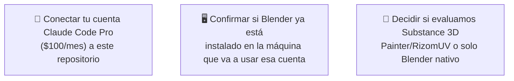
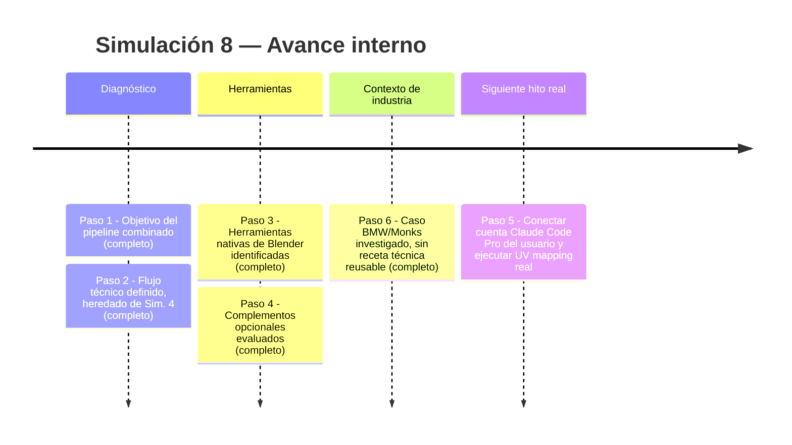
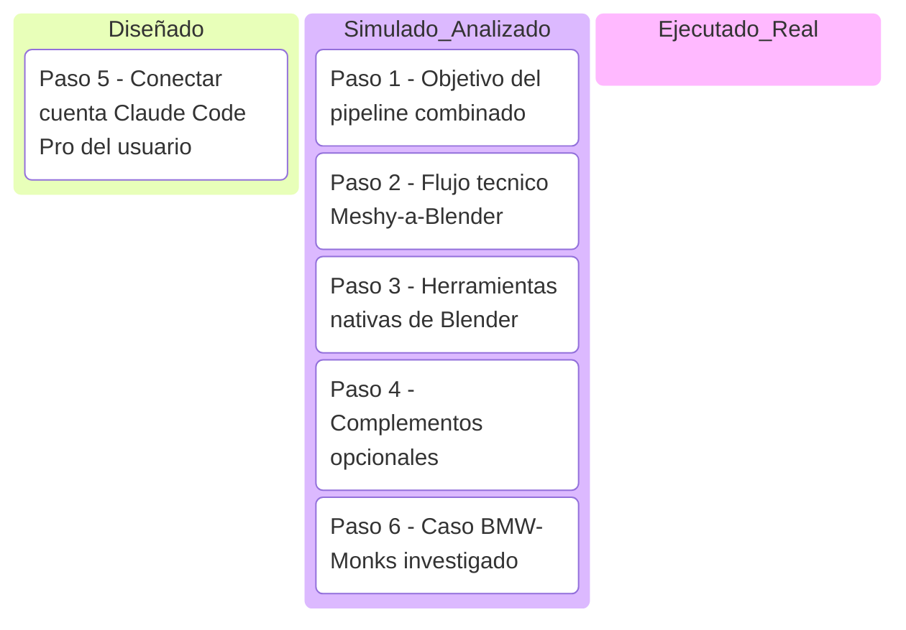

# Simulación 8 — Pipeline Meshy AI + Blender para mapeo de textura exacto

[← Volver al índice de mis pruebas](../mis-pruebas-claude-code.md)

Proyecto que conecta directo con lo aprendido en la [Simulación 4](simulacion-4-meshy-3d.md) (Paso 6-7): la reconstrucción geométrica en Meshy ya funcionó y fue auditada con match confirmado, pero el retexturizado 100% fiel de un diseño complejo (ej. Bob Esponja) requiere intervención manual en Blender, no existe atajo de IA pura. Este proyecto formaliza ese segundo tramo del pipeline, alineado a la referencia del caso BMW/Monks (ver hallazgo del caso Monks — mezcla de render 3D + producción real, sin métricas técnicas reusables).

**Insumo del usuario:** cuenta Claude Code Pro de $100/mes, a conectar a este repositorio para poder darle instrucciones concretas de qué hacer en Blender (UV unwrap, texture paint) — todavía no conectada desde esta sesión.

### 🔴 Pendiente de tu parte

Pasos de la simulación

**Paso 1 — Confirmar el objetivo del pipeline combinado**
Meshy resuelve la geometría (forma del casco, ventilaciones, visor, correa — ya validado). Blender resuelve la fidelidad de textura/diseño (mapeo UV exacto de un colorway complejo sobre esa geometría) — son dos herramientas para dos problemas distintos, no una reemplaza a la otra.

**Paso 2 — Flujo técnico definido (heredado de Simulación 4, Paso 7)**
1. Exportar el GLB generado en Meshy a Blender.
2. UV unwrap limpio del casco, separando visor / ventilaciones / cuerpo como islas UV independientes.
3. Importar la imagen de referencia del diseño (ej. Bob Esponja) como textura base.
4. Proyectar/pintar manualmente sobre la vista que sí tiene foto real (ej. lateral izquierda).
5. Extender/inventar a mano el diseño en las partes sin foto de referencia (frente, atrás, lado derecho) — este paso es manual/creativo, no automatizable con lo disponible hoy.

**Paso 3 — Herramientas dentro de Blender (gratis, sin licencia adicional)**
- UV Editing workspace (desenvolver malla)
- Texture Paint mode (pintar en tiempo real sobre superficie curva)
- Image Editor + overlay UV (alinear referencia sobre coordenadas UV)

**Paso 4 — Complementos opcionales de mayor precisión (pagos, no decididos aún)**
Substance 3D Painter (Adobe, estándar de industria para texturizado de assets 3D) y RizomUV (unwrapping especializado) — evaluar solo si el flujo nativo de Blender resulta insuficiente en la práctica.

**Paso 5 — Conectar la cuenta Claude Code Pro del usuario a este repositorio (PENDIENTE)**
El usuario tiene una cuenta separada de $100/mes que quiere usar específicamente para las tareas de Blender (automatización de UV mapping/texture paint vía instrucciones). Esto es una sesión/cuenta distinta a la presente — requiere que el usuario la conecte desde su lado (esta sesión no tiene acceso automático a otras cuentas/sesiones de Claude).

**Paso 6 — Referencia del caso BMW/Monks (contexto, no receta técnica)**
Investigado: Monks usa Unreal Engine + sistema propietario (`Monks.Flow`) sobre formato `.USD`, con interfaz pick-and-click para combinar auto virtual + fondo real. No publican métricas de tiempo/costo ni detalle técnico del rol de la IA generativa — sirve como confirmación de que "3D + fondo real" es un patrón de industria válido, no como plantilla técnica a copiar paso a paso.

Línea de tiempo interna (Mermaid)

Kanban de progreso (Mermaid)

Checklist de respaldo:
- [x] Paso 1 — Objetivo del pipeline combinado confirmado
- [x] Paso 2 — Flujo técnico Meshy → Blender definido
- [x] Paso 3 — Herramientas nativas de Blender identificadas
- [x] Paso 4 — Complementos opcionales evaluados (no decididos)
- [x] Paso 6 — Caso BMW/Monks investigado (contexto, sin receta técnica)
- [ ] Paso 5 — Conectar cuenta Claude Code Pro del usuario al repo
- [ ] Ejecución real del UV mapping en Blender sobre el casco de la Simulación 4

Bitácora de decisiones

| Fecha | Decisión | Quién | Motivo |
|---|---|---|---|
| 2026-07-20 | Separar responsabilidad: Meshy = geometría, Blender = textura exacta | Usuario + agente Meshy | Confirmado que la IA generativa pura no llega a fidelidad pixel-perfect en retexturizado |
| 2026-07-20 | Usar cuenta Claude Code Pro ($100/mes) dedicada para Blender | Usuario | Separar el flujo de automatización de Blender del resto del sistema |
| Pendiente | Conectar esa cuenta a este repositorio | Usuario | Requiere acción del usuario desde su propia sesión — no es algo que esta sesión pueda hacer por sí sola |

🧪 **SIMULACIÓN — flujo técnico definido y heredado de la Simulación 4, pero la ejecución real en Blender (Paso 5) está pendiente de que el usuario conecte su cuenta dedicada.**
