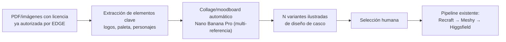

# Simulación 9 — Sistema Ilustrador Automático (licencia → collage → variantes de casco)

[← Volver al índice de mis pruebas](../mis-pruebas-claude-code.md)

Diseño de una etapa previa (Etapa 0.5) al pipeline existente (Recraft → Meshy → Higgsfield): a partir de material con licencia ya autorizada (ej. Marvel, Paramount Pictures), generar automáticamente varias ideas de diseño de casco en formato ilustración, antes de pasar a render fotorrealista.

**Estado: 0/10 pasos en acto — solo diseño, sin ejecutar.**

### Flujo propuesto

### Herramientas evaluadas (investigación 23/07/2026)

| Herramienta | Rol en este flujo | Costo |
|---|---|---|
| Nano Banana Pro | Collage multi-referencia (hasta 8-14 imágenes, máxima fidelidad en las primeras 6) — ya está en el pipeline EDGE, no hace falta herramienta nueva | Ver Simulación de costos (más abajo) |
| Figma Weave / Adobe Firefly Boards | Moodboard automático sobre canvas — alternativa madura con licencias comerciales claras si se necesita más control visual | Suscripción Adobe/Figma existente |
| Extractores de paleta (Pixelait, etc.) | Automatizar la extracción de colores del PDF de licencia | Gratis/bajo costo |

### El cuello de botella real: extracción de logos/personajes desde PDF

Ya se confirmó en las Simulaciones 6a-6c que el entorno no puede renderizar PDFs sin `poppler-utils` — esto se repite aquí. Más allá de esa limitación técnica puntual, la detección automática y confiable de un logo/personaje con derechos dentro de un PDF mixto (arte + texto) **no es una tecnología madura hoy** — un modelo de visión puede identificar "qué hay" pero no aislar el asset limpio en alta fidelidad.

**Decisión de diseño:** se automatiza la extracción de paleta de color y la composición general del collage; el recorte del logo/personaje exacto queda como paso humano intermedio (igual que ya se hace manualmente). No es una limitación a resolver a corto plazo — es un paso que se mantiene manual a propósito.

### Riesgo de propiedad intelectual

Este flujo solo aplica sobre material con licencia YA autorizada por EDGE para ese proyecto específico (ej. acuerdo con Marvel/Paramount) — no genera personajes ni logos no autorizados desde cero. Cualquier variante generada debe verificarse contra los términos de la licencia antes de pasar a producción.

### Relación con el pipeline existente

Esta simulación no reemplaza nada de Etapa 1 (Ilustración) — es un paso previo que le da mejor input. El patrón de "anchor visual + batch processing" ya validado en Etapa 1 aplica directo aquí, no es tecnología nueva.

### Próximos pasos (sin ejecutar todavía)
- [ ] Definir 1 caso de prueba real con una licencia ya autorizada por EDGE
- [ ] Probar extracción de paleta automática sobre ese PDF
- [ ] Recorte manual de logo/personaje (paso humano, no automatizable a corto plazo)
- [ ] Generar 5-10 variantes de collage con Nano Banana Pro
- [ ] Selección humana de la mejor variante
- [ ] Pasar la variante elegida al pipeline existente (Recraft → Meshy → Higgsfield)

🧪 **SIMULACIÓN — diseño conceptual únicamente, no se ha ejecutado ningún paso todavía. Ver investigación de costos de herramientas IA (Nano Banana Pro vs. alternativas) en el hilo de planificación del 23/07/2026.**
