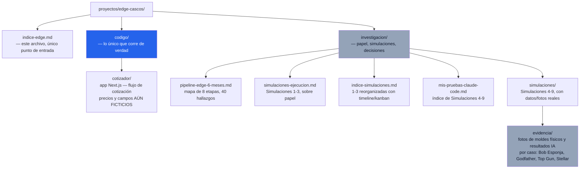
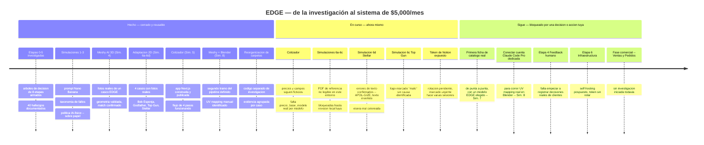

# Índice EDGE Cascos — mapa, mapa de carpetas y línea de tiempo

Este documento es el único punto de entrada al proyecto EDGE. No repite contenido — enlaza y da el estado real de hoy. Reemplaza a `indice-proyecto-edge.md` (ahora reorganizado bajo este nombre) porque la carpeta `edge-cascos/` se reordenó: código, investigación y evidencia visual vivían mezclados en un mismo nivel y eso hacía difícil saber qué es producto, qué es papel y qué es prueba.

📂 **GitHub de este archivo:** https://github.com/juandroeleven-jpg/SAAAS-Marketing/blob/main/proyectos/edge-cascos/indice-edge.md
📦 **Repositorio completo:** https://github.com/juandroeleven-jpg/SAAAS-Marketing

---

## 1. Mapa de carpetas — qué es cada cosa y para qué sirve

**Regla de esta carpeta desde hoy:** todo lo que se pueda ejecutar (`npm run dev`, un build, un deploy) vive en `codigo/`. Todo lo que sea razonamiento, decisión o prueba en papel/foto vive en `investigacion/`. Nada más se mezcla en la raíz de `edge-cascos/`.

---

## 2. Línea de tiempo — qué se hizo, qué está en curso, qué sigue

**Cómo leer esta línea de tiempo:** "Hecho" es lo que ya dejó un resultado fijado y reusable — no se vuelve a discutir salvo que aparezca evidencia nueva. "En curso" son piezas con trabajo real encima pero con un defecto o dato pendiente que impide darlas por cerradas. "Sigue" es lo que no puede avanzar sin que decidas o hagas algo vos — comprar/medir un casco físico, elegir un modelo para la primera ficha, rotar un token. Ningún ítem de "Sigue" se resuelve con más investigación de un agente.

---

## 3. Estado resumido por etapa del pipeline

| Etapa | Pasos en acto (de 20*) | Bloqueo principal |
|---|---|---|
| 0 — Intake | 7 | Falta comprar/medir casco competidor físico |
| 1 — Ilustración | 2 | Faltan bocetos/imágenes reales de EDGE |
| 2 — Turntable | 3 | Falta ejecutar el montaje físico del rig |
| 3 — Catálogo/ficha | 10 (decisión) | Falta generar la primera ficha real de punta a punta |
| 4 — Feedback humano | 1 (el más crítico) | Falta empezar a registrar decisiones reales |
| 5 — Marca/mercado | 1 | Falta cuenta EDGE en producción |
| 6 — Infraestructura | 2 | Falta rotar el token expuesto (urgente) |
| 7 — Sistema operativo | 1 | Depende de que Etapas 0-6 generen datos |

*Etapa 0 tiene 15 pasos reales (10+5), no 20 — ver `investigacion/pipeline-edge-6-meses.md`.

---

## 4. Documentos del proyecto

- **[Pipeline EDGE — 8 etapas, árboles de decisión, 40 hallazgos](investigacion/pipeline-edge-6-meses.md)** — el mapa completo de investigación de mercado, con Mermaid de decisión por etapa
- **[Simulaciones de ejecución — Simulaciones 1-3](investigacion/simulaciones-ejecucion.md)** — prompts, taxonomías y políticas construidas y analizadas en papel, antes de correr contra la API real
- **[Índice de simulaciones 1-3 — timeline, kanban y lectura tomista](investigacion/indice-simulaciones.md)** — misma info de arriba, reorganizada en secciones plegables
- **[Mis pruebas — Simulaciones 4-9](investigacion/mis-pruebas-claude-code.md)** — índice de las simulaciones con datos y fotos reales, sesión local VS Code
- **[Código del cotizador](codigo/cotizador/)** — app Next.js real, corriendo, con precios ficticios
- **[Marca personal — página web + LinkedIn](../marca-personal/indice-simulaciones.md)** — proyecto hermano, fuera de EDGE

## 5. Simulaciones ya construidas

**Sobre papel, sin API real todavía (`investigacion/simulaciones-ejecucion.md`):**

1. Prompt real de render Nano Banana Pro (Etapa 1) — con 3 riesgos predichos y v2 con mitigaciones
2. Taxonomía de 10 modos de fallo de fidelidad de producto (Etapa 4)
3. Política de mezcla IA/físico en catálogo (Etapa 2)

**Con datos y fotos reales (`investigacion/mis-pruebas-claude-code.md` + `investigacion/simulaciones/`):**

4. **Meshy AI — reconstrucción 3D** (Etapa 2) — fotos físicas reales de un casco EDGE, suscripción Meshy Pro pagada, reconstrucción geométrica auditada con match confirmado. Pendiente: elegir modelo de generación final.
5. **Cotizador tipo carrito** (Fase 3 — Ventas/Cotización) — flujo de 4 pasos, campos y precios **explícitamente ficticios**, decisión tomada de ruta low-cost (Meshy GLB + Three.js) sobre Zakeke/Threekit. Código en `codigo/cotizador/`.
6. **Adaptación 2D con Nano Banana** (Etapa 1) — 4 casos auditados con fotos reales: Bob Esponja (6a), Godfather (6b), Top Gun (6c), Stellar (6d). Geometría validada en los 4; fidelidad de diseño contra el arte original pendiente por falta de herramienta para renderizar PDF en este entorno.
7. **Catálogo/ficha técnica automatizada** (Etapa 3) — método de 3 capas ya en uso (Claude Code posiciona → composición automática → Nano Banana estiliza), con Canva como atajo opcional. Pendiente: la primera ficha real de punta a punta.
8. **Meshy + Blender** (Etapa 2) — segundo tramo del pipeline de reconstrucción: Meshy resuelve geometría, Blender resuelve fidelidad de textura/diseño complejo vía UV mapping manual. Pendiente: conectar la cuenta Claude Code Pro dedicada del usuario.

---

**Última actualización de este índice:** 2026-08-07 — reemplaza a `indice-proyecto-edge.md`, reconciliando la reorganización de carpetas (`codigo/`, `investigacion/`, `investigacion/simulaciones/evidencia/`) con el estado real reportado en `proyectos/gestion-pm.md`. Se actualiza a mano cada vez que se cierra un hallazgo, se mueve un archivo o se agrega una simulación nueva.
