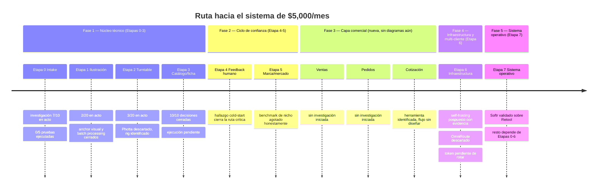

# Índice del proyecto — EDGE (automatización de marketing/producto)

Este documento no repite contenido de los otros — solo enlaza y da contexto general del avance. El detalle completo vive en los documentos originales.

📂 **GitHub de este archivo:** https://github.com/juandroeleven-jpg/SAAAS-Marketing/blob/main/proyectos/edge-cascos/indice-proyecto-edge.md
📦 **Repositorio completo:** https://github.com/juandroeleven-jpg/SAAAS-Marketing

## Documentos del proyecto

- **[Pipeline EDGE — 8 etapas, árboles de decisión, 40 hallazgos](https://claude.ai/code/artifact/b6456d96-242c-472b-8c24-71cc55306aed)** — el mapa completo de investigación de mercado, con Mermaid de decisión por etapa — [GitHub](https://github.com/juandroeleven-jpg/SAAAS-Marketing/blob/main/proyectos/edge-cascos/pipeline-edge-6-meses.md)
- **[Simulaciones de ejecución](https://claude.ai/code/artifact/8c823f87-aa50-415d-8415-a52b413e6e07)** — prompts, taxonomías y políticas construidas y analizadas en papel, antes de correr contra la API real — [GitHub](https://github.com/juandroeleven-jpg/SAAAS-Marketing/blob/main/proyectos/edge-cascos/simulaciones-ejecucion.md)

---

## Línea de tiempo del proyecto

---

## Estado resumido por etapa

| Etapa | Pasos en acto (de 20*) | Bloqueo principal |
|---|---|---|
| 0 — Intake | 7 | Falta comprar/medir casco competidor físico |
| 1 — Ilustración | 2 | Faltan bocetos/imágenes reales de EDGE |
| 2 — Turntable | 3 | Falta ejecutar el montaje físico del rig |
| 3 — Catálogo/ficha | 10 (decisión) | Falta generar la primera ficha real |
| 4 — Feedback humano | 1 (el más crítico) | Falta empezar a registrar decisiones reales |
| 5 — Marca/mercado | 1 | Falta cuenta EDGE en producción |
| 6 — Infraestructura | 2 | Falta rotar el token expuesto (urgente) |
| 7 — Sistema operativo | 1 | Depende de que Etapas 0-6 generen datos |

*Etapa 0 tiene 15 pasos reales (10+5), no 20 — ver documento completo.

## Simulaciones ya construidas (documento de simulaciones)

1. Prompt real de render Nano Banana Pro (Etapa 1) — con 3 riesgos predichos y v2 con mitigaciones
2. Taxonomía de 10 modos de fallo de fidelidad de producto (Etapa 4)
3. Política de mezcla IA/físico en catálogo (Etapa 2)

---

**Última actualización de este índice:** se actualiza manualmente cada vez que se cierra un hallazgo o se agrega una simulación nueva — no es automático.
