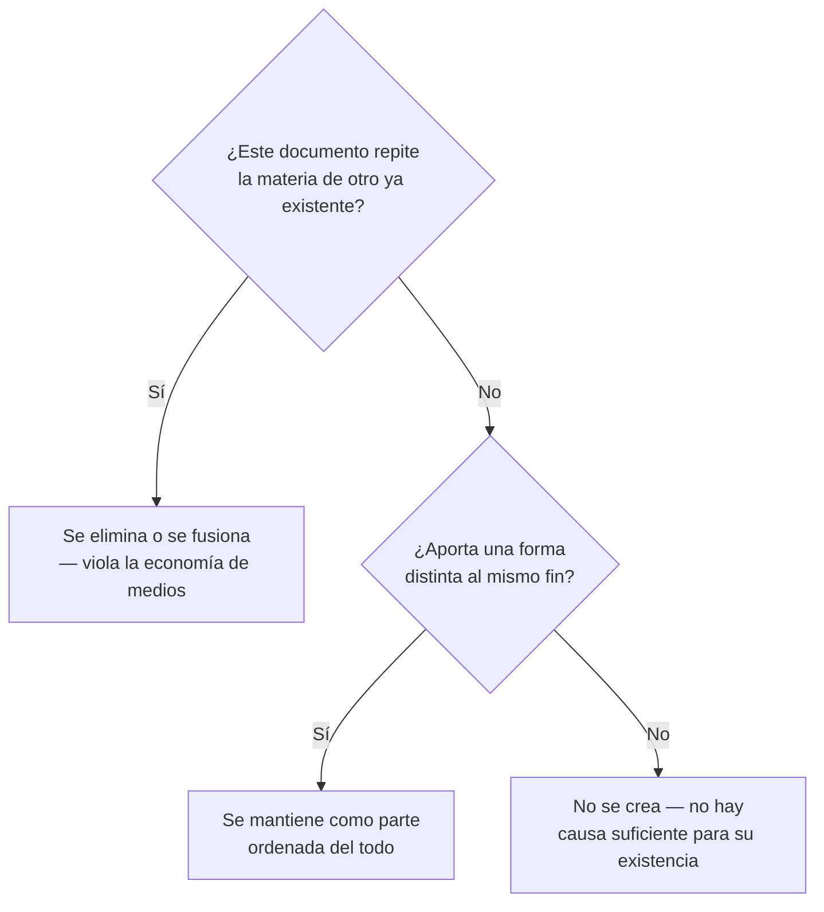
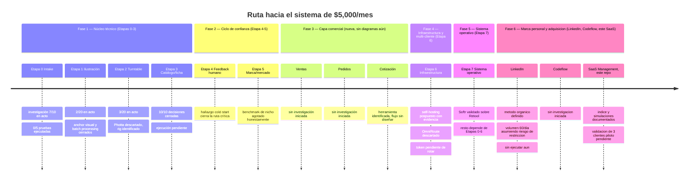
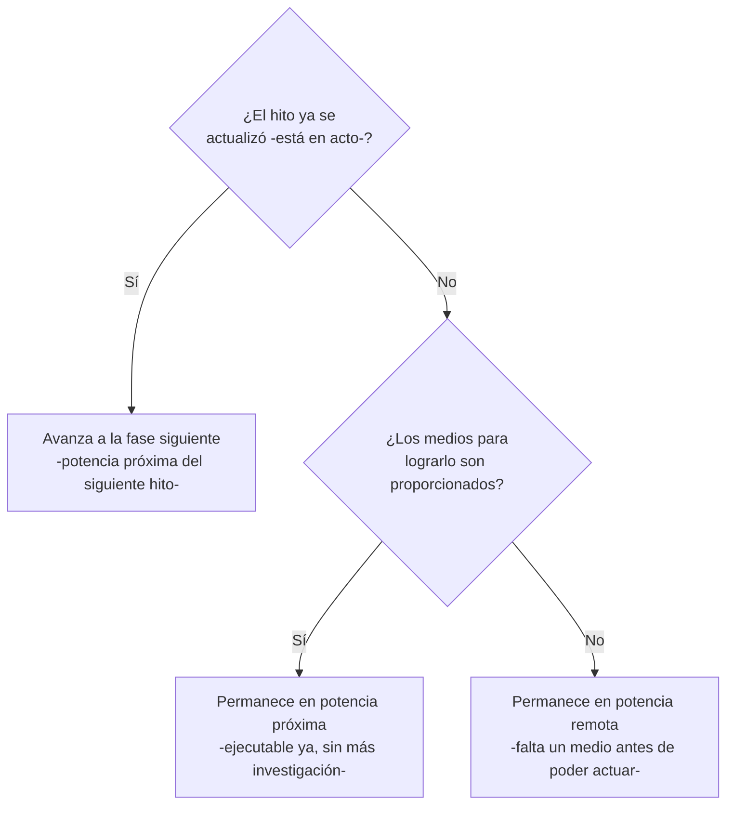
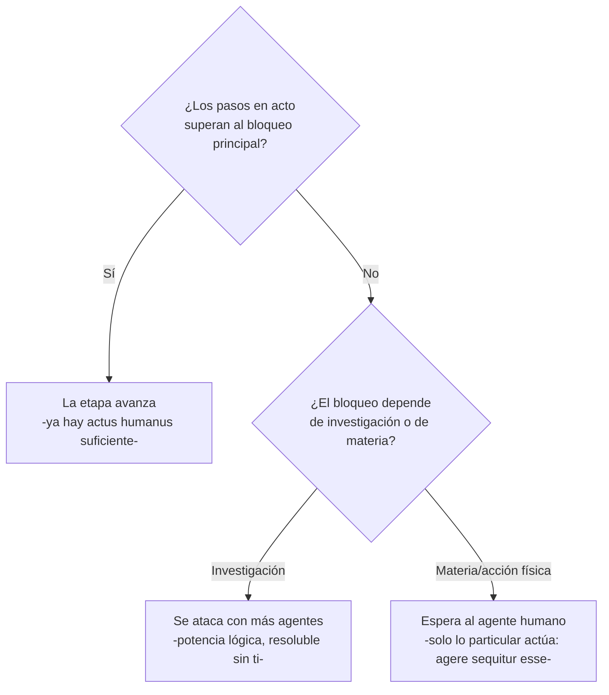
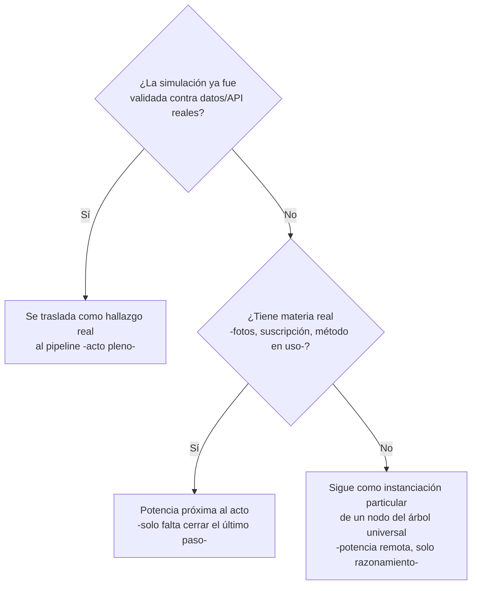

# Índice del proyecto — EDGE (automatización de marketing/producto)

Este documento no repite contenido de los otros — solo enlaza y da contexto general del avance. El detalle completo vive en los documentos originales.

📂 **GitHub de este archivo:** https://github.com/juandroeleven-jpg/SAAAS-Marketing/blob/main/proyectos/edge-cascos/indice-proyecto-edge.md
📦 **Repositorio completo:** https://github.com/juandroeleven-jpg/SAAAS-Marketing

## Documentos del proyecto

- **[Pipeline EDGE — 8 etapas, árboles de decisión, 40 hallazgos](https://claude.ai/code/artifact/b6456d96-242c-472b-8c24-71cc55306aed)** — el mapa completo de investigación de mercado, con Mermaid de decisión por etapa — [GitHub](https://github.com/juandroeleven-jpg/SAAAS-Marketing/blob/main/proyectos/edge-cascos/documentos/pipeline-edge-6-meses.md)
- **[Simulaciones de ejecución](https://claude.ai/code/artifact/8c823f87-aa50-415d-8415-a52b413e6e07)** — prompts, taxonomías y políticas construidas y analizadas en papel, antes de correr contra la API real — [GitHub](https://github.com/juandroeleven-jpg/SAAAS-Marketing/blob/main/proyectos/edge-cascos/documentos/simulaciones-ejecucion.md)
- **[Índice de simulaciones — con timeline, kanban y lectura tomista por simulación](documentos/indice-simulaciones.md)** — la misma info de arriba, reorganizada en secciones plegables (armado en otra sesión)
- **[Mis pruebas — Claude Code VS Code local](documentos/mis-pruebas-claude-code.md)** — Simulación 4 (Meshy 3D) y Simulación 5 (cotizador tipo carrito, Fase 3)
- **[Marca personal — página web + LinkedIn](../marca-personal/indice-simulaciones.md)** — proyecto nuevo, fuera de EDGE, con evidencia real de Copper Group y EDGE ya entregada

**Comentario según Tomás de Aquino:** varios documentos ordenados a un mismo fin no deben repetir la misma materia — eso sería un desperdicio de medios sin causa suficiente. Cada documento aporta una *forma* distinta (investigación, simulación) sobre la misma materia final (el proyecto EDGE); por eso el índice no repite contenido, solo ordena las partes hacia el todo.

Mermaid de decisión — lógica de Aquino aplicada a esta sección

---

## Línea de tiempo del proyecto

**Comentario según Tomás de Aquino:** el movimiento (*motus*) es, para Aquino, el acto de un ser en potencia en cuanto está en potencia — no el paso instantáneo de la nada al todo, sino la actualización progresiva de lo que ya podía ser. Esta línea de tiempo no mide fechas de calendario todavía; mide fases de potencia acercándose al acto, una tras otra, cada una condición de la siguiente. La Fase 6, agregada por el trabajo paralelo en marca personal, no rompe el orden — es una nueva serie de potencias corriendo junto a las Fases 1-5, ordenada al mismo fin último (el sistema de $5,000/mes) por una vía distinta (adquisición y reputación, no producto).

Mermaid de decisión — lógica de Aquino aplicada a esta sección

---

## Estado resumido por etapa

| Etapa | Pasos en acto (de 20*) | Bloqueo principal |
|---|---|---|
| 0 — Intake | 7 | Falta comprar/medir casco competidor físico |
| 1 — Ilustración | 2 | Faltan bocetos/imágenes reales de EDGE |
| 2 — Turntable | 3 | Falta ejecutar el montaje físico del rig |
| 3 — Catálogo/ficha | 10 (decisión) | Falta generar la primera ficha real de punta a punta |
| 4 — Feedback humano | 1 (el más crítico) | Falta empezar a registrar decisiones reales |
| 5 — Marca/mercado | 1 | Falta cuenta EDGE en producción |
| 6 — Infraestructura | 2 | Falta rotar el token expuesto (urgente) |
| 7 — Sistema operativo | 1 | Depende de que Etapas 0-6 generen datos |

*Etapa 0 tiene 15 pasos reales (10+5), no 20 — ver documento completo.

**Comentario según Tomás de Aquino:** cada etapa es juzgada no por cuánto se habló de ella, sino por cuántos actos humanos (*actus humani*) ya dejaron un resultado fijado y reusable frente a cuánta pura potencia sigue esperando su materia. El "bloqueo principal" de cada fila no es un fracaso — es, con precisión tomista, la identificación exacta de qué falta para que la potencia se actualice: a veces es investigación (potencia lógica, resoluble con más agentes), a veces es materia (un casco, un boceto, una cuenta) que solo tú puedes proveer, porque *agere sequitur esse* — solo lo particular actúa, nunca lo universal por sí solo.

Mermaid de decisión — lógica de Aquino aplicada a esta sección

## Simulaciones ya construidas

**Documento original (`simulaciones-ejecucion.md`) — sobre papel, sin API real todavía:**

1. Prompt real de render Nano Banana Pro (Etapa 1) — con 3 riesgos predichos y v2 con mitigaciones
2. Taxonomía de 10 modos de fallo de fidelidad de producto (Etapa 4)
3. Política de mezcla IA/físico en catálogo (Etapa 2)

**Documento `mis-pruebas-claude-code.md` + `simulaciones-cc/` — con datos y fotos reales, sesión local VS Code:**

4. **Meshy AI — reconstrucción 3D** (Etapa 2) — fotos físicas reales de un casco EDGE, suscripción Meshy Pro pagada, reconstrucción geométrica auditada con match confirmado. Pendiente: elegir modelo de generación final.
5. **Cotizador tipo carrito** (Fase 3 — Ventas/Cotización) — flujo de 4 pasos, campos y precios **explícitamente ficticios**, decisión tomada de ruta low-cost (Meshy GLB + Three.js) sobre Zakeke/Threekit.
6. **Adaptación 2D "God Father"** (Etapa 1) — mismo patrón aditivo por capas ya validado en EDGE. Lógica confirmada; auditoría real molde/imagen/referencia pendiente de la ruta local de la carpeta.
7. **Catálogo/ficha técnica automatizada** (Etapa 3) — método de 3 capas ya en uso (Claude Code posiciona → composición automática → Nano Banana estiliza), con Canva como atajo opcional. Pendiente: criterio explícito Canva vs. full-IA, y la primera ficha real de punta a punta.
8. **Meshy + Blender** (Etapa 2) — segundo tramo del pipeline de reconstrucción: Meshy resuelve geometría, Blender resuelve fidelidad de textura/diseño complejo vía UV mapping manual. Pendiente: conectar la cuenta Claude Code Pro dedicada del usuario para ejecutar el UV mapping real.

**Comentario según Tomás de Aquino:** los árboles de decisión de las 8 etapas son la forma universal del proceso — dicen qué pasaría en cualquier caso posible, pero un universal no actúa por sí mismo (*agere sequitur esse*: el actuar sigue al ser, y solo actúa lo que existe en particular). Cada simulación es la instanciación particular de un nodo específico de ese universal — el momento en que la forma abstracta empieza, aunque sea en papel o con datos reales parciales, a acercarse al acto. Las Simulaciones 4-8 están más cerca del acto que las 1-3: ya tienen materia real (fotos, suscripciones pagadas, un método en uso) donde las primeras tres todavía razonan puramente sobre la forma.

Mermaid de decisión — lógica de Aquino aplicada a esta sección

---

**Última actualización de este índice:** 2026-07-20 — se actualiza manualmente cada vez que se cierra un hallazgo o se agrega una simulación nueva; no es automático. Esta actualización reconcilia el comentario tomista (armado en esta sesión) con el trabajo real de las Simulaciones 4-8 (armado en paralelo en sesión local VS Code).
